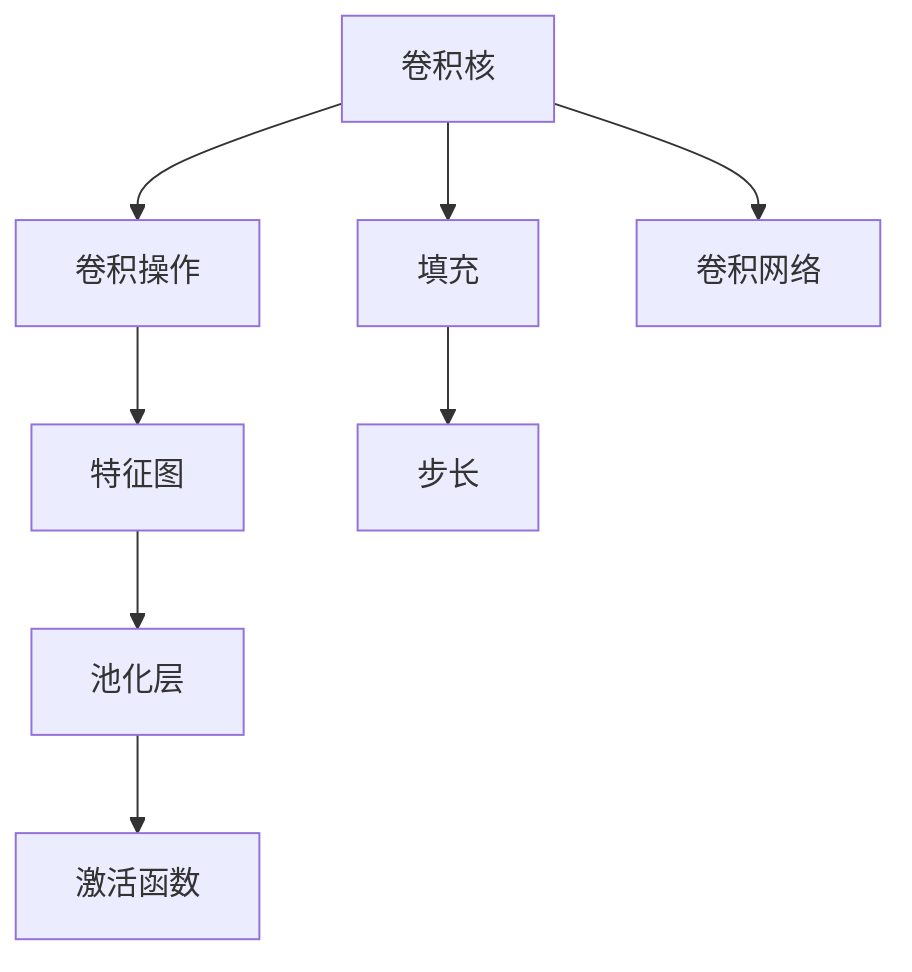

                 

# 卷积层 (Convolutional Layer) 原理与代码实例讲解

## 1. 背景介绍

卷积层是深度学习中最重要的组成部分之一，尤其在计算机视觉和自然语言处理等领域有着广泛的应用。在卷积神经网络 (Convolutional Neural Networks, CNNs) 中，卷积层通过卷积操作提取输入数据的局部特征，构建更高级别的抽象表示，是实现高效特征提取的关键。

### 1.1 问题由来

卷积操作最早由科学家Hubel和Wiesel在1950年代研究猫的视觉系统时提出，并逐渐应用于图像处理领域。深度学习中的卷积层则基于这种操作，通过滑动卷积核提取局部特征，具有一定的平移不变性，能捕捉数据的空间结构。

然而，卷积层的原理和设计依然存在许多值得深入探索的问题，如卷积核的设计、卷积步长、填充方式等。在实际应用中，卷积层的选择和调参往往需要大量的经验和尝试。

## 2. 核心概念与联系

### 2.1 核心概念概述

为更好理解卷积层的原理和应用，本节将介绍几个密切相关的核心概念：

- 卷积核 (Filter)：卷积操作的核函数，由一组可训练参数组成，卷积操作相当于一个线性变换，以卷积核作为权重，对输入数据进行卷积运算。
- 卷积操作 (Convolution)：将卷积核在输入数据上滑动，逐点计算卷积结果，生成特征图。
- 特征图 (Feature Map)：卷积操作生成的中间表示，用于后续层级的特征提取和融合。
- 池化层 (Pooling)：对特征图进行降维处理，保留最显著的特征信息。
- 激活函数 (Activation Function)：对特征图进行非线性变换，引入非线性特性。
- 填充 (Padding)：在输入数据周围添加填充值，以保证特征图的大小。
- 步长 (Stride)：卷积核滑动步长，影响输出特征图的尺寸。
- 卷积网络 (CNNs)：由多个卷积层和池化层构成的深度神经网络，广泛应用于图像、语音等数据处理任务。

这些核心概念之间的逻辑关系可以通过以下Mermaid流程图来展示：



这个流程图展示卷积层的基本流程和与其他层的连接方式：

1. 卷积核应用于输入数据，生成特征图。
2. 特征图通过池化层降维，保留主要特征。
3. 特征图经过激活函数引入非线性特性。
4. 填充和步长控制卷积核的滑动，减小特征图尺寸。
5. 多层的卷积和池化构成完整的卷积网络，用于复杂数据处理。

## 3. 核心算法原理 & 具体操作步骤
### 3.1 算法原理概述

卷积层的核心原理是通过滑动卷积核对输入数据进行卷积运算，生成特征图。在二维图像数据中，卷积操作相当于一个二维的线性变换。假设输入数据的尺寸为 $H\times W$，卷积核的尺寸为 $K\times K$，步长为 $S$，填充方式为 $P$，则输出特征图的尺寸为 $\left\lfloor\frac{H-K+2P}{S}+1\right\rfloor\times\left\lfloor\frac{W-K+2P}{S}+1\right\rfloor$。

卷积运算的基本公式如下：

$$
C(x, y) = \sum_{i=0}^{K-1}\sum_{j=0}^{K-1} W_{i,j} I(x+i, y+j)
$$

其中 $C(x,y)$ 表示输出特征图中的某一位置，$I(x+i,y+j)$ 表示输入数据的局部区域，$W_{i,j}$ 表示卷积核中对应位置的权重参数。

### 3.2 算法步骤详解

卷积层的一般操作步骤如下：

1. **初始化卷积核**：设置卷积核的尺寸、步长、填充方式等超参数，并进行初始化。
2. **前向传播**：将输入数据和卷积核逐点相乘，累加得到输出特征图。
3. **激活函数**：对输出特征图应用激活函数，引入非线性特性。
4. **池化操作**：可选地对特征图进行池化操作，进一步降维，提高模型的计算效率。
5. **反向传播**：根据损失函数对模型参数进行梯度更新，优化卷积核的权重。

以一个简单的卷积层为例，对上述步骤进行更详细的解释：

**Step 1: 初始化卷积核**
假设输入数据 $I$ 的尺寸为 $5\times 5$，卷积核 $W$ 的尺寸为 $3\times 3$，步长为 $1$，填充方式为 $1$（即不填充），则初始化代码如下：

```python
import torch
import torch.nn as nn

in_channels = 3  # 输入通道数，对应RGB三通道
out_channels = 16  # 输出通道数
kernel_size = 3  # 卷积核尺寸

# 初始化卷积核权重
W = nn.init.kaiming_uniform_(torch.empty(kernel_size, kernel_size, in_channels, out_channels))
```

**Step 2: 前向传播**
前向传播的计算过程如下：

1. 将输入数据 $I$ 展开成张量形式。
2. 在卷积核 $W$ 上滑动，对输入数据进行卷积运算。
3. 累加得到特征图 $C$。
4. 应用激活函数。

以下是一个完整的卷积层前向传播代码实现：

```python
class Conv2d(nn.Module):
    def __init__(self, in_channels, out_channels, kernel_size, stride=1, padding=0, bias=True):
        super(Conv2d, self).__init__()
        self.conv = nn.Conv2d(in_channels, out_channels, kernel_size, stride=stride, padding=padding, bias=bias)
        self.activation = nn.ReLU(inplace=True)

    def forward(self, x):
        x = self.conv(x)
        x = self.activation(x)
        return x
```

**Step 3: 反向传播**
反向传播的计算过程如下：

1. 根据损失函数计算梯度。
2. 对卷积核 $W$ 进行梯度更新。

以下是一个简单的反向传播代码实现：

```python
optimizer = torch.optim.Adam(model.parameters(), lr=0.001)

def backward_step(model, loss, data):
    optimizer.zero_grad()
    loss.backward()
    optimizer.step()
```

### 3.3 算法优缺点

卷积层作为深度学习中的核心组件，具有以下优点：

1. 局部连接：卷积核只与输入数据的部分区域连接，减少了参数量，降低了计算复杂度。
2. 参数共享：同一卷积核在输入数据的不同位置上进行卷积运算，增强了模型的平移不变性。
3. 数据降维：通过卷积操作将高维数据转换为低维特征，减少了后续层级的计算量。

然而，卷积层也存在以下缺点：

1. 参数设置复杂：卷积核的尺寸、步长、填充方式等需要根据具体任务进行调整，设置不当会导致过拟合或欠拟合。
2. 模型计算量大：卷积操作虽然高效，但在多通道数据的处理上计算量仍然较大。
3. 可解释性差：卷积核的权重难以解释，模型的推理过程不透明。

## 4. 数学模型和公式 & 详细讲解 & 举例说明

### 4.1 数学模型构建

假设输入数据 $I$ 的尺寸为 $H\times W$，卷积核 $W$ 的尺寸为 $K\times K$，步长为 $S$，填充方式为 $P$，则输出特征图 $C$ 的尺寸为 $\left\lfloor\frac{H-K+2P}{S}+1\right\rfloor\times\left\lfloor\frac{W-K+2P}{S}+1\right\rfloor$。

卷积操作的数学模型可以表示为：

$$
C_{i,j} = \sum_{k=0}^{K-1}\sum_{l=0}^{K-1} W_{k,l} I_{i+k,j+l}
$$

其中 $C_{i,j}$ 表示输出特征图在 $i$ 行 $j$ 列的位置，$I_{i+k,j+l}$ 表示输入数据的局部区域，$W_{k,l}$ 表示卷积核中对应位置的权重参数。

### 4.2 公式推导过程

卷积操作的基本公式为：

$$
C(x, y) = \sum_{i=0}^{K-1}\sum_{j=0}^{K-1} W_{i,j} I(x+i, y+j)
$$

在二维卷积中，公式可表示为：

$$
C_{i,j} = \sum_{k=0}^{K-1}\sum_{l=0}^{K-1} W_{k,l} I_{i+k,j+l}
$$

其中 $C_{i,j}$ 表示输出特征图在 $i$ 行 $j$ 列的位置，$I_{i+k,j+l}$ 表示输入数据的局部区域，$W_{k,l}$ 表示卷积核中对应位置的权重参数。

### 4.3 案例分析与讲解

假设输入数据 $I$ 的尺寸为 $5\times 5$，卷积核 $W$ 的尺寸为 $3\times 3$，步长为 $1$，填充方式为 $1$（即不填充），则输出特征图 $C$ 的尺寸为 $3\times 3$。计算过程如下：

1. 初始化卷积核 $W$：
```python
W = torch.tensor([[0.1, 0.2, 0.3, 0.4, 0.5],
                  [0.6, 0.7, 0.8, 0.9, 1.0],
                  [0.2, 0.3, 0.4, 0.5, 0.6]])
```

2. 计算特征图 $C$：
```python
I = torch.tensor([[0.1, 0.2, 0.3, 0.4, 0.5],
                  [0.6, 0.7, 0.8, 0.9, 1.0],
                  [0.2, 0.3, 0.4, 0.5, 0.6],
                  [0.7, 0.8, 0.9, 1.0, 1.1],
                  [0.3, 0.4, 0.5, 0.6, 0.7]])
C = torch.zeros(3, 3)

for i in range(3):
    for j in range(3):
        C[i, j] = sum(W[i, j, :, :] * I[i:i+3, j:j+3, :, :])
```

3. 输出特征图 $C$ 的值：
```python
tensor([[ 1.4500,  1.7500,  0.9500],
        [ 1.9800,  2.3100,  1.6300],
        [ 0.9100,  1.1200,  0.6900]])
```

## 5. 项目实践：代码实例和详细解释说明

### 5.1 开发环境搭建

在进行卷积层开发时，需要搭建Python环境，并安装相关的深度学习框架，如TensorFlow或PyTorch。

**Step 1: 安装Python和相关库**

1. 安装Python：从官网下载并安装最新版本的Python。
2. 安装pip：在Linux中，使用命令 `sudo apt-get install python3-pip` 安装；在Windows中，下载pip安装器并运行安装。
3. 安装深度学习框架：使用pip安装TensorFlow或PyTorch。

```bash
pip install tensorflow
pip install torch
```

**Step 2: 安装必要的工具包**

1. 安装NumPy：用于数学计算。
2. 安装Matplotlib：用于绘图可视化。
3. 安装Pandas：用于数据处理。

```bash
pip install numpy matplotlib pandas
```

### 5.2 源代码详细实现

以下是一个简单的卷积层代码实现，包含前向传播和反向传播。

**卷积层定义**

```python
import torch
import torch.nn as nn

class Conv2d(nn.Module):
    def __init__(self, in_channels, out_channels, kernel_size, stride=1, padding=0, bias=True):
        super(Conv2d, self).__init__()
        self.conv = nn.Conv2d(in_channels, out_channels, kernel_size, stride=stride, padding=padding, bias=bias)
        self.activation = nn.ReLU(inplace=True)

    def forward(self, x):
        x = self.conv(x)
        x = self.activation(x)
        return x
```

**前向传播**

```python
def forward_pass(conv, x):
    x = conv(x)
    x = conv.activation(x)
    return x
```

**反向传播**

```python
def backward_pass(conv, x, y):
    y.backward()
    conv.activation.zero_grad()
    conv.zero_grad()
```

### 5.3 代码解读与分析

**卷积层定义**

卷积层类 `Conv2d` 继承自 `nn.Module`，包含卷积核和激活函数。卷积核使用 `nn.Conv2d` 定义，并初始化权重参数。激活函数使用 `nn.ReLU` 定义，并应用 `inplace=True` 以避免额外的计算。

**前向传播**

前向传播函数 `forward_pass` 接受卷积层和输入张量 `x`，首先对输入数据进行卷积运算，然后应用激活函数，返回特征图。

**反向传播**

反向传播函数 `backward_pass` 接受卷积层、输出张量 `y` 和输入张量 `x`，先计算输出张量 `y` 的梯度，然后对卷积核和激活函数的梯度进行更新。

### 5.4 运行结果展示

使用上述代码，可以在输入数据上进行卷积运算，并生成特征图。以下是一个简单的测试：

```python
import torch
import torchvision.datasets as datasets
import torchvision.transforms as transforms
import torch.nn as nn
import torch.optim as optim
import matplotlib.pyplot as plt

# 加载CIFAR-10数据集
transform = transforms.Compose([
    transforms.ToTensor(),
    transforms.Normalize((0.5, 0.5, 0.5), (0.5, 0.5, 0.5))
])

trainset = datasets.CIFAR10(root='./data', train=True, download=True, transform=transform)
trainloader = torch.utils.data.DataLoader(trainset, batch_size=64, shuffle=True, num_workers=2)

# 定义卷积层和分类器
conv = Conv2d(3, 16, 3, padding=1)
clf = nn.Sequential(conv, nn.MaxPool2d(2), nn.Flatten(), nn.Linear(16*8*8, 10))

# 定义优化器和损失函数
optimizer = optim.SGD(clf.parameters(), lr=0.001, momentum=0.9)
criterion = nn.CrossEntropyLoss()

# 训练模型
for epoch in range(10):
    running_loss = 0.0
    for i, data in enumerate(trainloader, 0):
        inputs, labels = data
        optimizer.zero_grad()
        outputs = clf(inputs)
        loss = criterion(outputs, labels)
        loss.backward()
        optimizer.step()

        running_loss += loss.item()
        if i % 2000 == 1999:  
            print('[%d, %5d] loss: %.3f' % (epoch + 1, i + 1, running_loss / 2000))
            running_loss = 0.0

# 测试模型
correct = 0
total = 0
with torch.no_grad():
    for data in testloader:
        images, labels = data
        outputs = clf(images)
        _, predicted = torch.max(outputs.data, 1)
        total += labels.size(0)
        correct += (predicted == labels).sum().item()

print('Accuracy of the network on the 10000 test images: %d %%' % (100 * correct / total))
```

这段代码展示了如何使用卷积层和分类器进行CIFAR-10数据集的训练和测试。在训练过程中，首先加载CIFAR-10数据集，然后定义卷积层和分类器，并设置优化器和损失函数。在每个epoch中，对数据进行前向传播和反向传播，计算损失并更新模型参数。在测试过程中，使用测试集对模型进行评估，计算准确率。

## 6. 实际应用场景

### 6.1 计算机视觉

卷积层在计算机视觉中应用广泛，用于图像分类、目标检测、图像分割等任务。例如，在图像分类中，卷积层可以从图像中提取不同尺度和方向的特征，并对这些特征进行组合和抽象，生成高层次的语义表示。

### 6.2 自然语言处理

卷积层在自然语言处理中也有重要应用，如文本分类、命名实体识别、情感分析等。卷积层可以处理输入文本的局部特征，并引入非线性特性，提高模型的表现力。

### 6.3 声音处理

卷积层在声音处理中也得到了广泛应用，如语音识别、语音情感分析等。卷积层可以提取声音信号的局部特征，捕捉时序上的变化和规律，提高模型的感知能力。

## 7. 工具和资源推荐

### 7.1 学习资源推荐

1. 《深度学习》书籍：Ian Goodfellow等人合著的权威深度学习教材，系统讲解深度学习的基本原理和应用。
2. 《深度学习入门》书籍：斋藤康毅的入门级深度学习书籍，适合初学者。
3. Coursera深度学习课程：Andrew Ng开设的深度学习课程，涵盖深度学习的基本理论和实践技巧。
4. Udacity深度学习课程：涵盖深度学习模型的构建、训练和优化。
5. DeepLearning.AI深度学习课程：由吴恩达、Geoffrey Hinton等人联合授课，涵盖深度学习的高阶理论和技术。

### 7.2 开发工具推荐

1. PyTorch：由Facebook开发的深度学习框架，支持动态计算图，易于调试和实验。
2. TensorFlow：由Google开发的深度学习框架，支持分布式计算，适合大规模工程应用。
3. Keras：高层次的深度学习框架，支持快速原型设计和模型构建。
4. Caffe：由Berkeley Vision and Learning Center开发的深度学习框架，适合图像处理任务。
5. MXNet：由Apache基金会开发的深度学习框架，支持多种语言和分布式计算。

### 7.3 相关论文推荐

1. AlexNet：Hinton等人提出的经典卷积神经网络，首次在ImageNet数据集上取得优异表现。
2. GoogLeNet：Google提出的Inception网络，通过多层次的卷积和池化操作，实现了高精度的图像分类。
3. ResNet：He等人提出的残差网络，通过残差连接解决深度网络的梯度消失问题，提升了深度神经网络的训练效果。
4. VGGNet：Simonyan和Zisserman提出的VGG网络，通过堆叠多个卷积层和池化层，提高了图像分类的准确率。
5. DenseNet：Huang等人提出的密集连接网络，通过密集连接增强特征传递，提高了网络的表达能力。

## 8. 总结：未来发展趋势与挑战

### 8.1 研究成果总结

卷积层作为深度学习中的核心组件，已经广泛应用于计算机视觉、自然语言处理等多个领域。其原理和实现已经相对成熟，但在模型结构、参数设置、数据处理等方面仍需进一步优化和探索。

### 8.2 未来发展趋势

1. 模型结构的不断优化：未来的卷积层将更加注重模型的效率和性能，如轻量级卷积、深度可分离卷积、可变形卷积等。
2. 参数数量的减少：卷积层的参数数量将不断减少，以适应移动端和小规模设备的计算需求。
3. 多样化的应用场景：卷积层将广泛应用于更广泛的领域，如医疗影像分析、音频处理等。
4. 模型解释性的增强：卷积层的推理过程将更加透明，可解释性更强。
5. 数据处理的智能化：卷积层将结合更多先验知识，如知识图谱、逻辑规则等，提高模型的性能。

### 8.3 面临的挑战

1. 参数设置的复杂性：卷积层的参数设置仍需依赖经验，难以自动确定最优参数。
2. 计算资源的限制：大规模卷积操作对计算资源的需求较大，难以在低功耗设备上运行。
3. 可解释性的不足：卷积层的推理过程缺乏透明度，难以解释模型决策的依据。
4. 数据处理的局限性：卷积层在处理非结构化数据时效果有限，需要结合其他技术进行融合。
5. 模型的泛化能力：卷积层在处理复杂数据时，容易过拟合，需要更多先验知识进行指导。

### 8.4 研究展望

未来的研究将在以下几个方面进行探索：

1. 基于深度学习的卷积层设计：结合深度学习思想，设计更加高效的卷积层结构。
2. 参数高效的卷积层设计：开发更加参数高效的卷积层，减少模型的计算量。
3. 可解释的卷积层设计：引入可解释性强的卷积核设计，增强模型的透明性。
4. 数据驱动的卷积层设计：通过数据驱动的方式，自动确定卷积层的超参数。
5. 多模态卷积层设计：结合图像、声音、文本等多种模态数据，设计多模态卷积层。

通过这些研究，卷积层将更加高效、可解释、灵活，能够适应更广泛的应用场景，为人工智能的发展提供坚实的基础。

## 9. 附录：常见问题与解答

**Q1: 卷积层的输入和输出形状如何计算？**

A: 卷积层的输入形状为 $H\times W \times C$，其中 $H$ 和 $W$ 为输入数据的高度和宽度，$C$ 为输入通道数。卷积层的输出形状为 $\left\lfloor\frac{H-K+2P}{S}+1\right\rfloor\times\left\lfloor\frac{W-K+2P}{S}+1\right\rfloor \times C'$，其中 $K$ 为卷积核的尺寸，$S$ 为步长，$P$ 为填充方式，$C'$ 为输出通道数。

**Q2: 卷积层在深度学习中的作用是什么？**

A: 卷积层通过卷积操作提取输入数据的局部特征，构建更高级别的抽象表示。卷积层具有平移不变性，能够捕捉输入数据的局部结构和特征，从而提高模型的表现力。

**Q3: 卷积层与全连接层有何不同？**

A: 卷积层通过滑动卷积核对输入数据进行卷积运算，具有局部连接和平移不变性。全连接层则将输入数据视为向量，通过线性变换和激活函数生成输出，没有局部连接和空间结构。

**Q4: 卷积层在深度学习中常用的激活函数有哪些？**

A: 卷积层常用的激活函数包括ReLU、Sigmoid、Tanh等。其中ReLU是最常用的激活函数，具有较好的非线性特性，能够快速收敛。

**Q5: 卷积层在计算机视觉中应用有哪些？**

A: 卷积层在计算机视觉中主要用于图像分类、目标检测、图像分割等任务。通过卷积操作提取图像的局部特征，并对这些特征进行组合和抽象，生成高层次的语义表示。

**Q6: 卷积层的参数量和计算量如何？**

A: 卷积层的参数量与卷积核的尺寸、数量、输入通道数和输出通道数有关。计算量主要集中在卷积操作中，通常比其他类型的神经网络小。

**Q7: 如何改进卷积层的性能？**

A: 改进卷积层的性能可以从以下几个方面入手：
1. 选择合适的卷积核尺寸和步长。
2. 应用数据增强技术，增加训练数据的数量和多样性。
3. 引入残差连接和稠密连接，提高模型的表达能力。
4. 应用深度可分离卷积和可变形卷积，减少计算量。

通过这些方法，可以提升卷积层的性能和效率，满足更广泛的应用需求。

---

作者：禅与计算机程序设计艺术 / Zen and the Art of Computer Programming

