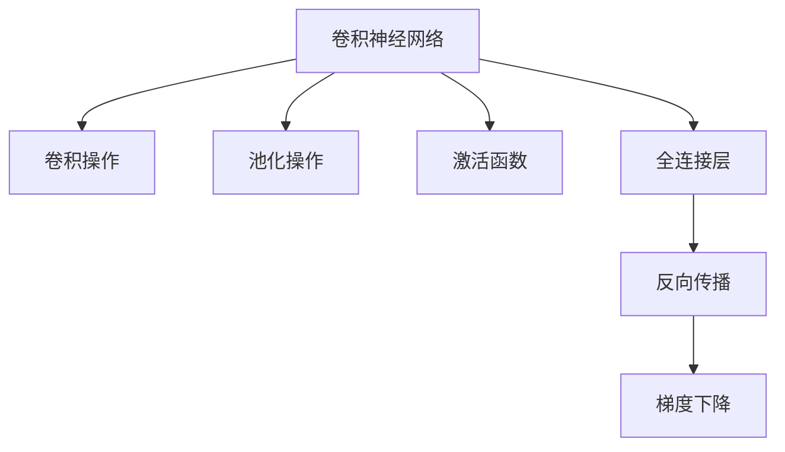

                 

# 卷积神经网络 原理与代码实例讲解

> 关键词：卷积神经网络, CNN, 图像处理, 图像分类, 深度学习, 卷积操作, 池化操作, 激活函数, 全连接层, 反向传播, 模型优化, TensorFlow

## 1. 背景介绍

### 1.1 问题由来
卷积神经网络（Convolutional Neural Network, CNN）作为深度学习领域的核心算法之一，广泛用于图像处理、计算机视觉、自然语言处理等多个领域。CNN的核心思想是通过卷积和池化等操作提取输入数据的局部特征，再通过全连接层进行分类或回归等任务。CNN算法简单高效，可解释性较好，成为处理高维数据的首选方案。

近年来，随着深度学习技术的飞速发展，CNN在图像分类、目标检测、人脸识别、自动驾驶等众多领域取得了突破性进展。例如，AlexNet、VGG、ResNet、Inception等经典模型，展示了CNN强大的数据建模能力。

然而，由于卷积和池化等操作的特殊性，CNN的设计和优化具有一定的难度。如何在实践中高效实现CNN模型，并充分利用其结构特性，是应用中面临的重大挑战。本文章将详细讲解卷积神经网络的原理与代码实现，从数学模型、算法步骤到工程实践，全面解析CNN的奥秘。

## 2. 核心概念与联系

### 2.1 核心概念概述

为更好地理解卷积神经网络，本节将介绍几个关键概念：

- **卷积神经网络 (Convolutional Neural Network, CNN)**：一种专门用于处理网格结构数据的深度学习模型。通过卷积和池化等操作，自动提取输入数据的局部特征，再通过全连接层进行分类或回归任务。

- **卷积操作 (Convolutional Operation)**：CNN的核心操作之一，通过卷积核在输入数据上滑动，提取特征。卷积操作具有参数共享、局部连接等特点，极大地减少了模型的参数量。

- **池化操作 (Pooling Operation)**：用于减少特征图的空间维度，常用方式包括最大池化和平均池化。池化操作保留了特征的主要信息，同时减少了模型计算量。

- **激活函数 (Activation Function)**：在卷积和池化操作后，对输出进行非线性变换。常用的激活函数包括ReLU、Sigmoid、Tanh等。

- **全连接层 (Fully Connected Layer)**：用于将卷积和池化层输出的特征进行分类或回归。全连接层计算复杂，但结构简单，易于优化。

- **反向传播 (Backpropagation)**：用于训练CNN的优化算法，通过链式法则计算模型参数的梯度，并更新参数以最小化损失函数。

- **梯度下降 (Gradient Descent)**：反向传播算法的核心，通过不断迭代更新模型参数，使得损失函数最小化。

这些概念之间的逻辑关系可以通过以下Mermaid流程图来展示：



这个流程图展示了大卷积神经网络的组成结构，各组成部分之间的数据流动与操作流程：

1. 卷积操作对输入数据提取特征。
2. 池化操作对特征图进行下采样，减少维度。
3. 激活函数对特征进行非线性变换，引入非线性信息。
4. 全连接层对特征进行分类或回归。
5. 反向传播算法计算模型参数梯度，进行参数更新。
6. 梯度下降算法迭代更新模型参数。

这些核心概念共同构成了卷积神经网络的结构与功能，使得其在处理图像、视频、文本等高维数据上具备强大的学习能力。

## 3. 核心算法原理 & 具体操作步骤
### 3.1 算法原理概述

卷积神经网络通过卷积操作提取输入数据的局部特征，再通过池化操作减少特征图的空间维度，最后通过全连接层进行分类或回归任务。其核心思想是通过局部连接和参数共享，减少模型的参数量，提升模型泛化能力。

形式化地，假设输入数据的维度为 $D$，卷积核大小为 $k$，步长为 $s$，输出特征图大小为 $n$，卷积层参数为 $W$，卷积操作为 $\mathcal{C}$，则卷积操作可以表示为：

$$
y = \mathcal{C}(x, W) = \sum_{i=0}^{n-1} \sum_{j=0}^{n-1} W_{i,j} \mathcal{C}_k(x_{i,i+k-1})
$$

其中 $x$ 表示输入数据，$W$ 表示卷积核参数，$\mathcal{C}_k$ 表示 $k \times k$ 的卷积操作。

池化操作对卷积层的输出进行下采样，通常有两种方式：

- **最大池化 (Max Pooling)**：取池化窗口内最大值作为输出。
- **平均池化 (Average Pooling)**：取池化窗口内平均值作为输出。

形式化地，假设输入特征图大小为 $m$，池化窗口大小为 $h$，步长为 $s$，则最大池化可以表示为：

$$
y = \max_{i=0}^{m-1} \mathcal{M}_k(x_{i,i+k-1})
$$

其中 $x$ 表示输入特征图，$\mathcal{M}_k$ 表示 $k \times k$ 的最大池化操作。

最后，通过全连接层对特征图进行分类或回归。假设全连接层包含 $d$ 个神经元，则全连接层的输出可以表示为：

$$
y = \sum_{i=0}^{d-1} W_{i,j} \mathcal{F}(x_{i,j})
$$

其中 $x$ 表示输入特征，$W$ 表示全连接层权重，$\mathcal{F}$ 表示激活函数。

### 3.2 算法步骤详解

卷积神经网络的一般训练流程包括数据预处理、模型定义、损失函数定义、优化器选择、模型训练、模型评估等步骤。以下详细说明这些步骤的实现：

**Step 1: 数据预处理**
- 准备训练集、验证集和测试集。将图像数据标准化为 $[0,1]$ 范围。
- 对数据进行增强处理，如随机裁剪、水平翻转、旋转等，以扩充数据集多样性。

**Step 2: 模型定义**
- 定义卷积层、池化层、激活函数、全连接层等组件。
- 设置模型的超参数，如卷积核大小、步长、池化窗口大小、激活函数、学习率等。

**Step 3: 损失函数定义**
- 根据任务类型，选择合适的损失函数。
- 对于分类任务，通常使用交叉熵损失函数。
- 对于回归任务，通常使用均方误差损失函数。

**Step 4: 优化器选择**
- 选择优化的算法，如随机梯度下降（SGD）、Adam、Adagrad等。
- 设置优化器的超参数，如学习率、动量、衰减率等。

**Step 5: 模型训练**
- 将训练集数据分批次输入模型，前向传播计算损失函数。
- 反向传播计算参数梯度，根据设定的优化算法和学习率更新模型参数。
- 周期性在验证集上评估模型性能，根据性能指标决定是否触发 Early Stopping。
- 重复上述步骤直到满足预设的迭代轮数或 Early Stopping 条件。

**Step 6: 模型评估**
- 在测试集上评估模型性能，对比训练前的预测结果。
- 使用混淆矩阵、准确率、召回率等指标评估模型效果。

**Step 7: 模型部署**
- 将训练好的模型导出为文件，以便于后续的推理使用。
- 将模型集成到实际的应用系统中，提供API接口进行推理预测。

以上是卷积神经网络的一般训练流程。在实际应用中，还需要根据具体任务和数据特点，对训练流程进行优化设计，如改进数据增强方式、选择更好的优化器、调整模型超参数等，以进一步提升模型性能。

### 3.3 算法优缺点

卷积神经网络具有以下优点：
1. 局部连接和参数共享，减少了模型参数量，降低了过拟合风险。
2. 对输入数据的平移、旋转、缩放等变换具有一定的不变性，对噪声和局部结构具有较强鲁棒性。
3. 计算量相对较小，适合处理高维数据。
4. 结构简单，易于优化和调整。

然而，卷积神经网络也存在一些缺点：
1. 对于输入数据的维度有严格要求，不适用于非网格结构数据的处理。
2. 模型复杂度较高，训练时间和内存消耗较大。
3. 对于全局特征的提取效果较差，可能存在信息丢失。
4. 对于输入数据的大小和内容变化敏感，可能需要多次调参和优化。

尽管存在这些局限性，但卷积神经网络仍然是目前处理图像、视频、音频等高维数据的最佳选择。未来，随着硬件计算能力的提升和模型结构的优化，卷积神经网络将发挥更大的潜力。

### 3.4 算法应用领域

卷积神经网络在计算机视觉、自然语言处理等领域有着广泛的应用，涵盖了图像分类、目标检测、人脸识别、文本分类、序列标注等多个任务：

- 图像分类：如手写数字识别、物体识别等。
- 目标检测：如 pedestrian detection、object detection等。
- 人脸识别：如 face recognition、人脸关键点检测等。
- 文本分类：如情感分析、主题分类等。
- 序列标注：如命名实体识别、词性标注等。

此外，卷积神经网络还被用于医学图像分析、自动驾驶、遥感图像处理等领域，展示了其强大的数据建模能力。随着算力资源的丰富，卷积神经网络的应用场景将进一步拓展，为更多行业带来智能化升级。

## 4. 数学模型和公式 & 详细讲解
### 4.1 数学模型构建

本节将使用数学语言对卷积神经网络进行详细讲解。

假设输入图像的大小为 $m \times n$，卷积核大小为 $k \times k$，步长为 $s$，输出特征图大小为 $l \times l$，卷积层参数为 $W$，激活函数为 $\mathcal{F}$。则卷积层可以表示为：

$$
y_{i,j} = \sum_{i'=0}^{k-1} \sum_{j'=0}^{k-1} W_{i',j'} x_{(i',j'),(i,i+k-1)}
$$

其中 $y$ 表示输出特征图，$x$ 表示输入图像，$W$ 表示卷积核参数，$\mathcal{F}$ 表示激活函数。

池化操作对卷积层的输出进行下采样，最大池化可以表示为：

$$
y_{i,j} = \max_{i'=0}^{k-1} \max_{j'=0}^{k-1} x_{(i',j'),(i,i+k-1)}
$$

其中 $y$ 表示池化后的特征图，$x$ 表示输入特征图。

最后，通过全连接层对特征图进行分类或回归。假设全连接层包含 $d$ 个神经元，则全连接层的输出可以表示为：

$$
y = \sum_{i=0}^{d-1} W_{i,j} \mathcal{F}(x_{i,j})
$$

其中 $y$ 表示全连接层的输出，$x$ 表示输入特征，$W$ 表示全连接层权重，$\mathcal{F}$ 表示激活函数。

### 4.2 公式推导过程

以下我们以图像分类任务为例，推导卷积神经网络的损失函数和梯度更新公式。

假设模型在图像 $x$ 上的预测概率为 $p = M(x)$，真实标签为 $y$，则分类交叉熵损失函数为：

$$
\ell(y, p) = -y \log p - (1-y) \log (1-p)
$$

将 $M(x)$ 代入，得：

$$
\ell(y, M(x)) = -y \log M(x) - (1-y) \log (1-M(x))
$$

将其代入经验风险公式，得：

$$
\mathcal{L}(\theta) = -\frac{1}{N}\sum_{i=1}^N [y_i \log M(x_i) + (1-y_i) \log (1-M(x_i))]
$$

其中 $x_i$ 表示输入图像，$y_i$ 表示真实标签，$M(x)$ 表示模型在输入图像上的预测概率。

为了求解模型参数 $\theta$，我们采用梯度下降算法，其中学习率为 $\eta$，梯度更新公式为：

$$
\theta \leftarrow \theta - \eta \nabla_{\theta}\mathcal{L}(\theta)
$$

其中 $\nabla_{\theta}\mathcal{L}(\theta)$ 为损失函数对参数 $\theta$ 的梯度，可通过反向传播算法高效计算。

在得到损失函数的梯度后，即可带入参数更新公式，完成模型的迭代优化。重复上述过程直至收敛，最终得到适应训练集的最佳模型参数 $\theta^*$。

## 5. 项目实践：代码实例和详细解释说明
### 5.1 开发环境搭建

在进行卷积神经网络实践前，我们需要准备好开发环境。以下是使用Python进行TensorFlow开发的环境配置流程：

1. 安装Anaconda：从官网下载并安装Anaconda，用于创建独立的Python环境。

2. 创建并激活虚拟环境：
```bash
conda create -n tensorflow-env python=3.8 
conda activate tensorflow-env
```

3. 安装TensorFlow：从官网获取对应版本的安装命令，或使用conda安装：
```bash
pip install tensorflow
```

4. 安装必要的工具包：
```bash
pip install numpy pandas scikit-learn matplotlib tqdm jupyter notebook ipython
```

完成上述步骤后，即可在`tensorflow-env`环境中开始卷积神经网络实践。

### 5.2 源代码详细实现

下面我们以手写数字识别（MNIST数据集）为例，给出使用TensorFlow对卷积神经网络进行代码实现。

首先，导入必要的库和数据集：

```python
import tensorflow as tf
from tensorflow.keras.datasets import mnist
from tensorflow.keras.utils import to_categorical

(x_train, y_train), (x_test, y_test) = mnist.load_data()
x_train, x_test = x_train / 255.0, x_test / 255.0
y_train, y_test = to_categorical(y_train), to_categorical(y_test)
```

然后，定义卷积神经网络模型：

```python
model = tf.keras.Sequential([
    tf.keras.layers.Conv2D(32, (3,3), activation='relu', input_shape=(28, 28, 1)),
    tf.keras.layers.MaxPooling2D((2,2)),
    tf.keras.layers.Conv2D(64, (3,3), activation='relu'),
    tf.keras.layers.MaxPooling2D((2,2)),
    tf.keras.layers.Flatten(),
    tf.keras.layers.Dense(10, activation='softmax')
])
```

接着，编译模型并训练：

```python
model.compile(optimizer='adam', loss='categorical_crossentropy', metrics=['accuracy'])
model.fit(x_train.reshape(-1, 28, 28, 1), y_train, epochs=5, validation_data=(x_test.reshape(-1, 28, 28, 1), y_test))
```

最后，评估模型性能：

```python
model.evaluate(x_test.reshape(-1, 28, 28, 1), y_test)
```

以上就是使用TensorFlow对卷积神经网络进行手写数字识别的完整代码实现。可以看到，TensorFlow提供了强大的Keras API，使得模型构建和训练变得简单易行。

### 5.3 代码解读与分析

让我们再详细解读一下关键代码的实现细节：

**Sequential模型**：
- 通过 `tf.keras.Sequential` 构建一个线性堆叠的卷积神经网络。

**卷积层 (Conv2D)**：
- 使用 `tf.keras.layers.Conv2D` 定义卷积层，其中参数含义如下：
  - `filters`：卷积核数量。
  - `kernel_size`：卷积核大小。
  - `activation`：激活函数。
  - `input_shape`：输入数据形状。

**池化层 (MaxPooling2D)**：
- 使用 `tf.keras.layers.MaxPooling2D` 定义最大池化层，参数含义为池化窗口大小。

**全连接层 (Dense)**：
- 使用 `tf.keras.layers.Dense` 定义全连接层，其中参数含义为输出神经元数量和激活函数。

**模型编译 (compile)**：
- 使用 `model.compile` 编译模型，其中参数含义为优化器、损失函数和评价指标。

**模型训练 (fit)**：
- 使用 `model.fit` 训练模型，其中参数含义为训练数据、标签、迭代次数和验证数据。

**模型评估 (evaluate)**：
- 使用 `model.evaluate` 评估模型性能，其中参数含义为测试数据和标签。

可以看出，TensorFlow的Keras API使得卷积神经网络的构建和训练过程变得简洁高效。开发者只需关注模型结构和超参数，而无需过多关注底层实现细节。

## 6. 实际应用场景
### 6.1 智能监控系统

卷积神经网络在智能监控系统中的应用十分广泛。通过摄像头捕获实时视频数据，使用卷积神经网络进行图像分类和目标检测，能够快速识别和跟踪异常行为。例如，可以使用预训练的YOLO模型检测车辆、行人等目标，通过微调适配特定场景，识别异常行为，及时报警，提高监控系统的智能化水平。

### 6.2 医学影像分析

在医学影像分析中，卷积神经网络能够自动提取病灶区域，辅助医生进行诊断和治疗。例如，可以使用预训练的ResNet模型对肺部X光片进行分类，区分正常和异常区域，辅助诊断肺结核等疾病。通过微调适配具体医院的数据集，能够进一步提升诊断的准确性和速度。

### 6.3 自动驾驶

在自动驾驶中，卷积神经网络能够处理车载摄像头和雷达等传感器数据，进行目标检测和定位，辅助车辆进行决策。例如，可以使用预训练的Faster R-CNN模型检测道路上的车辆和行人，通过微调适配特定车型和环境，提高自动驾驶的安全性和可靠性。

### 6.4 未来应用展望

随着卷积神经网络的不断发展和优化，其在图像处理、计算机视觉、自然语言处理等领域的应用将更加广泛和深入。未来，卷积神经网络将在以下几个方面发挥更大的作用：

1. 图像生成：通过生成对抗网络（GAN）等技术，卷积神经网络能够生成高质量的图像，应用于娱乐、广告、艺术等领域。

2. 视频分析：卷积神经网络能够处理视频数据，进行动作识别、情感分析等任务，广泛应用于安防、娱乐、教育等领域。

3. 自然语言处理：通过预训练和微调，卷积神经网络能够处理自然语言数据，应用于机器翻译、情感分析、问答系统等任务。

4. 自动驾驶：卷积神经网络能够处理车载传感器数据，进行目标检测和定位，提升自动驾驶系统的智能化水平。

5. 医疗影像分析：卷积神经网络能够自动分析医学影像，辅助医生进行诊断和治疗，提升医疗服务的智能化水平。

6. 增强现实（AR）和虚拟现实（VR）：卷积神经网络能够处理视觉和深度数据，应用于虚拟环境和增强现实应用，提高用户的沉浸感和互动性。

总之，卷积神经网络在图像处理、计算机视觉、自然语言处理等领域的应用前景广阔，随着算力资源的丰富和模型结构的优化，卷积神经网络将发挥更大的作用，推动人工智能技术的不断进步。

## 7. 工具和资源推荐
### 7.1 学习资源推荐

为了帮助开发者系统掌握卷积神经网络的理论基础和实践技巧，这里推荐一些优质的学习资源：

1. 《深度学习》（Ian Goodfellow等著）：全面介绍深度学习的基本原理和算法，包括卷积神经网络、循环神经网络等。

2. 《计算机视觉：算法与应用》（Richard Szeliski著）：介绍计算机视觉的基本概念和技术，包括图像处理、目标检测、图像分类等。

3. 《卷积神经网络：结构与算法》（Jianbo Shi等著）：深入讲解卷积神经网络的原理、结构和算法，提供大量实例和代码。

4. CS231n：斯坦福大学开设的计算机视觉课程，有Lecture视频和配套作业，适合深入学习卷积神经网络的应用。

5. Fast.ai：提供免费深度学习课程，覆盖图像处理、计算机视觉等多个领域，适合初学者和进阶者。

通过对这些资源的学习实践，相信你一定能够快速掌握卷积神经网络的精髓，并用于解决实际的计算机视觉问题。

### 7.2 开发工具推荐

高效的开发离不开优秀的工具支持。以下是几款用于卷积神经网络开发的常用工具：

1. TensorFlow：由Google主导开发的深度学习框架，生产部署方便，适合大规模工程应用。

2. PyTorch：基于Python的开源深度学习框架，灵活性高，适合快速迭代研究。

3. Keras：高层次的深度学习框架，支持TensorFlow、Theano等后端，易于上手。

4. MXNet：由Apache支持的深度学习框架，支持多种编程语言，适合分布式计算。

5. Caffe：由Berkeley Vision and Learning Center开发的深度学习框架，适合图像处理任务。

6. OpenCV：开源计算机视觉库，提供丰富的图像处理算法和工具，适用于图像处理和计算机视觉应用。

合理利用这些工具，可以显著提升卷积神经网络的开发效率，加快创新迭代的步伐。

### 7.3 相关论文推荐

卷积神经网络的研究源于学界的持续探索。以下是几篇奠基性的相关论文，推荐阅读：

1. LeNet-5：卷积神经网络的经典模型，广泛应用于手写数字识别等任务。

2. AlexNet：第一个在ImageNet大规模图像分类任务中获胜的模型，展示了卷积神经网络的强大能力。

3. VGGNet：提出深度卷积神经网络结构，增加了模型深度，提升了分类性能。

4. GoogLeNet：通过Inception模块引入多分支结构，进一步提升了模型性能。

5. ResNet：提出残差连接结构，解决了深度网络训练中梯度消失的问题，实现了更深层次的卷积神经网络。

6. DenseNet：提出密集连接结构，进一步优化了卷积神经网络的参数利用率，提升了模型性能。

这些论文代表了大卷积神经网络的发展脉络。通过学习这些前沿成果，可以帮助研究者把握学科前进方向，激发更多的创新灵感。

## 8. 总结：未来发展趋势与挑战

### 8.1 总结

本文对卷积神经网络进行了全面系统的介绍。首先阐述了卷积神经网络的背景和核心概念，详细讲解了卷积操作、池化操作、激活函数、全连接层、反向传播等核心原理，并提供了详细的代码实现。通过实例讲解，展示了卷积神经网络在图像分类、目标检测、医学影像分析等实际应用场景中的表现，展望了未来的发展方向。

通过本文的系统梳理，可以看到，卷积神经网络在图像处理、计算机视觉、自然语言处理等领域的应用前景广阔。它不仅具备强大的数据建模能力，还具备结构简单、参数共享、计算量小等优点，使得其在处理高维数据上具备显著优势。未来，随着卷积神经网络的不断发展和优化，其应用范围和性能将进一步拓展，为人工智能技术的进步带来新的突破。

### 8.2 未来发展趋势

展望未来，卷积神经网络将呈现以下几个发展趋势：

1. 模型规模不断增大：随着算力资源的丰富和预训练模型的普及，卷积神经网络的模型规模将不断增大，从而具备更强的数据建模能力。

2. 多模态融合：卷积神经网络将与其他模型（如循环神经网络、注意力机制等）结合，进行多模态数据的融合，提升模型的泛化能力和鲁棒性。

3. 模型优化：卷积神经网络的优化算法将不断进步，包括加速训练、降低内存占用、提高推理速度等，使其能够在实际应用中更加高效。

4. 模型自动化：通过自动学习模型结构和超参数，自动化的卷积神经网络设计和调优方法将进一步发展，使得模型开发更加便捷和高效。

5. 应用场景拓展：卷积神经网络将应用于更多领域，如自动驾驶、医疗影像分析、金融分析等，推动相关行业的智能化升级。

6. 技术融合：卷积神经网络将与更多前沿技术结合，如强化学习、生成对抗网络等，拓展其应用边界，提升模型的表现能力。

以上趋势将推动卷积神经网络向更深层次、更广泛领域的应用，为人工智能技术的发展带来新的动力。

### 8.3 面临的挑战

尽管卷积神经网络在多个领域取得了显著成效，但在实际应用中仍面临诸多挑战：

1. 数据需求量大：卷积神经网络的训练需要大量的标注数据，对于特定领域的任务，获取高质量标注数据成本较高。

2. 模型复杂度高：卷积神经网络模型结构复杂，训练和推理过程计算量较大，对算力资源要求较高。

3. 泛化能力有限：卷积神经网络对输入数据的变化较为敏感，对于新的数据和场景可能需要重新训练和优化。

4. 解释性不足：卷积神经网络作为“黑盒”模型，缺乏可解释性，难以对其内部机制进行分析和调试。

5. 对抗攻击风险：卷积神经网络对于对抗样本的鲁棒性较弱，可能受到攻击而产生误判。

6. 硬件资源依赖：卷积神经网络对硬件资源的依赖较大，需要高性能的GPU/TPU等设备支持。

正视这些挑战，积极探索解决策略，将是大卷积神经网络迈向成熟的重要一步。相信随着技术的不断进步，卷积神经网络将克服这些挑战，在更多的领域发挥重要作用。

### 8.4 研究展望

面对卷积神经网络所面临的挑战，未来的研究需要在以下几个方面寻求新的突破：

1. 数据增强和扩充：通过数据增强和扩充技术，扩充数据集多样性，提升模型的泛化能力。

2. 模型优化与压缩：通过模型压缩和优化算法，降低计算量和内存占用，提高模型效率和可解释性。

3. 对抗攻击防御：通过对抗样本生成和防御方法，提高卷积神经网络的鲁棒性，增强模型的安全性。

4. 模型可解释性：通过可解释性算法和可视化技术，增强卷积神经网络的解释性，提升用户信任和接受度。

5. 跨模态融合：通过跨模态数据融合和迁移学习技术，提升模型的通用性和迁移能力，拓展应用场景。

6. 自动化调优：通过自动调参和超参数优化方法，提高模型设计和调优效率，降低开发成本。

这些研究方向将推动卷积神经网络技术的进一步发展，为人工智能技术的落地应用提供新的突破口。

## 9. 附录：常见问题与解答

**Q1：卷积神经网络与传统神经网络的区别？**

A: 卷积神经网络与传统神经网络的主要区别在于其卷积操作和池化操作。卷积操作通过卷积核提取局部特征，参数共享，减少模型参数量，降低过拟合风险。池化操作对特征图进行下采样，减少空间维度，提高计算效率。这些操作使得卷积神经网络在处理高维数据上具有优势。

**Q2：卷积神经网络适用于哪些任务？**

A: 卷积神经网络适用于图像分类、目标检测、人脸识别、文本分类、序列标注等任务。对于非网格结构的数据，如视频、音频等，需要结合其他模型（如循环神经网络）进行联合建模。

**Q3：卷积神经网络的训练和推理过程如何优化？**

A: 卷积神经网络的训练和推理过程可以通过数据增强、参数优化、模型压缩等方法进行优化。具体包括：
1. 数据增强：通过旋转、缩放、裁剪等操作扩充数据集。
2. 参数优化：通过学习率调整、正则化、权重衰减等方法优化模型。
3. 模型压缩：通过剪枝、量化、蒸馏等方法压缩模型，提高计算效率和推理速度。

**Q4：卷积神经网络在实际应用中需要注意哪些问题？**

A: 卷积神经网络在实际应用中需要注意以下问题：
1. 数据质量和多样性：需要高质量的标注数据，确保模型泛化能力。
2. 模型大小和计算资源：模型的参数量和计算资源消耗较大，需要合理的硬件配置。
3. 模型调优和优化：需要持续调参和优化，确保模型在特定场景下的最佳性能。
4. 模型解释和调试：需要具备可解释性，方便用户理解和调试。

**Q5：卷积神经网络与其他深度学习模型相比有何优势？**

A: 卷积神经网络与其他深度学习模型相比，具有以下优势：
1. 参数共享：减少模型参数量，降低过拟合风险。
2. 局部连接：提取局部特征，提高模型泛化能力。
3. 计算量小：适合处理高维数据，降低计算资源消耗。
4. 结构简单：易于优化和调整，提高模型开发效率。

**Q6：卷积神经网络有哪些典型的应用场景？**

A: 卷积神经网络的典型应用场景包括：
1. 图像分类：如手写数字识别、物体识别等。
2. 目标检测：如 pedestrian detection、object detection等。
3. 人脸识别：如 face recognition、人脸关键点检测等。
4. 文本分类：如情感分析、主题分类等。
5. 序列标注：如命名实体识别、词性标注等。

总之，卷积神经网络凭借其局部连接、参数共享等优势，在图像处理、计算机视觉、自然语言处理等领域有着广泛的应用前景。未来，随着技术的不断进步，卷积神经网络将发挥更大的作用，推动人工智能技术的不断进步。

---

作者：禅与计算机程序设计艺术 / Zen and the Art of Computer Programming

