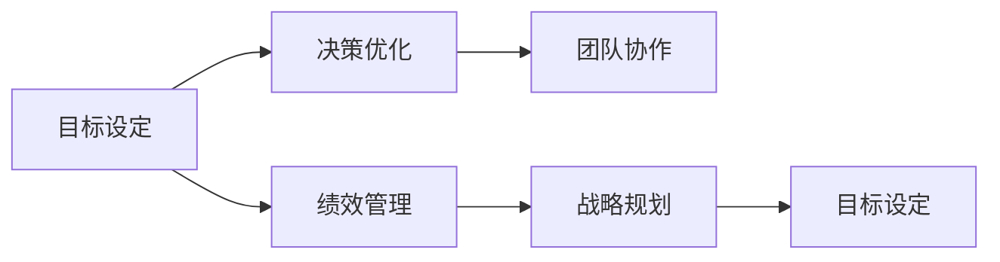

                 

# 双重目标法:管理者保持高效专注

> 关键词：目标设定,决策优化,绩效管理,团队协作,战略规划

## 1. 背景介绍

在现代企业管理中，管理者常常面临多重复杂的决策，例如市场拓展、技术研发、人才招聘等。为实现组织的长远目标，管理者需在众多任务中做出合理平衡，确保在有限的时间和资源下取得最优结果。传统的目标管理方法往往侧重于短期结果，而忽略了中长期战略规划。

本文将探讨一种全新的管理方法：双重目标法，它融合了目标设定和决策优化理论，帮助管理者在多元任务中保持高效专注，并提高绩效管理能力。

## 2. 核心概念与联系

### 2.1 核心概念概述

为了更好地理解双重目标法，我们首先解释几个核心概念及其相互关联：

- **目标设定**：通过明确的、可衡量的目标，帮助员工和组织明确努力方向。
- **决策优化**：通过系统化的数据分析和算法优化，在多种选项中选择最佳方案。
- **绩效管理**：通过对目标达成情况和决策执行结果的监控与反馈，持续提升管理效率和效果。
- **团队协作**：通过有效的沟通和协作机制，确保所有成员都在正确的轨道上工作。
- **战略规划**：制定中长期发展计划，引导组织的资源配置和目标设定。

这些概念紧密相连，共同构成了一套完整、高效的管理框架。下面通过Mermaid流程图展示它们之间的联系：



## 3. 核心算法原理 & 具体操作步骤
### 3.1 算法原理概述

双重目标法通过融合目标设定与决策优化两个核心模块，帮助管理者制定切实可行的目标，并在多种任务中做出最优决策。其基本原理如下：

1. **目标设定**：利用SMART原则（具体、可衡量、可达成、相关性、时限性）设定短期和中期目标。
2. **决策优化**：通过多目标优化算法，在资源约束下，求解多个目标的最佳方案。

### 3.2 算法步骤详解

**Step 1: 目标设定**
- **收集数据**：收集组织的内外数据，包括财务报表、市场趋势、技术动向等。
- **明确需求**：与相关利益相关者沟通，明确组织的主要需求和期望。
- **制定目标**：使用SMART原则，设定具体、可衡量的短期和中期目标。

**Step 2: 决策优化**
- **构建模型**：建立多目标优化模型，表示组织的目标和约束条件。
- **选择算法**：选择合适求解器，如NSGA-II、Pareto优化算法等，求解Pareto最优解集。
- **评估方案**：根据模型输出，评估不同方案的优劣。

**Step 3: 绩效管理**
- **监控执行**：定期跟踪目标达成情况和决策执行结果。
- **反馈优化**：根据监控结果，及时调整目标和决策。

### 3.3 算法优缺点

**优点**：
1. **综合多目标**：考虑了组织的多重目标，避免单一目标决策的局限性。
2. **动态优化**：能够根据环境变化和数据反馈，动态调整目标和决策。
3. **透明度高**：决策过程透明，便于组织成员理解和接受。

**缺点**：
1. **复杂度高**：需要处理多个目标和复杂约束，计算量较大。
2. **参数敏感**：模型的性能高度依赖于算法的参数设置。
3. **数据依赖性**：对数据的准确性和完整性要求较高。

### 3.4 算法应用领域

双重目标法广泛应用于各种管理和决策场景，例如：

- **项目管理**：在项目规划和执行中，设定具体目标并优化资源分配。
- **投资决策**：在多个投资选项中，选择风险和收益最佳组合。
- **人力资源管理**：制定招聘、培训和绩效评估策略。
- **供应链管理**：优化库存管理、物流安排和供应商选择。

## 4. 数学模型和公式 & 详细讲解 & 举例说明

### 4.1 数学模型构建

假设组织有 $n$ 个短期目标和 $m$ 个中期目标，每个目标的优先级为 $w_i$（$i=1,...,n+m$），总资源为 $C$。目标函数和约束条件可以表示为：

$$
\begin{aligned}
\min_{x_i} & \quad \sum_{i=1}^{n+m} w_i \cdot f_i(x) \\
\text{s.t.} & \quad g_j(x) \leq 0, \quad j=1,...,k \\
& \quad h_j(x) = 0, \quad j=1,...,p
\end{aligned}
$$

其中 $x_i$ 表示目标 $i$ 的决策变量，$f_i(x)$ 为目标函数，$g_j(x)$ 和 $h_j(x)$ 为约束条件。

### 4.2 公式推导过程

以投资决策为例，假设 $n=2$ 表示短期目标，$m=1$ 表示中期目标，$w_i$ 为不同目标的权重，$f_i(x)$ 为投资回报率，$g_j(x)$ 为风险限制条件，$h_j(x)$ 为资金限制条件。求解该问题的Pareto最优解集的步骤如下：

1. **构建目标函数**：
   $$
   f_1(x) = r_1(x), \quad f_2(x) = r_2(x), \quad f_3(x) = r_3(x)
   $$
   其中 $r_i(x)$ 为第 $i$ 项投资的回报率。

2. **设定约束条件**：
   $$
   g_1(x) = risk(x) \leq risk_{\max}, \quad g_2(x) = budget(x) \leq budget_{\max}
   $$
   其中 $risk(x)$ 和 $budget(x)$ 分别为投资风险和总资金。

3. **选择求解器**：
   使用Pareto优化算法，如NSGA-II，求解上述多目标优化问题。

### 4.3 案例分析与讲解

某科技公司需要做出以下决策：在一年内推出两款新产品，并计划在两年内占领市场份额的10%。假设短期目标为产品A的市场份额增长率和产品B的盈利能力，中期目标为公司总市值提升。

**Step 1: 目标设定**
- **收集数据**：获取市场数据、产品开发周期、资金投入等。
- **明确需求**：了解股东、客户和竞争对手的期望。
- **制定目标**：设定产品A和B的具体目标，例如A市场份额增长20%，B盈利能力提升30%，公司总市值提升15%。

**Step 2: 决策优化**
- **构建模型**：建立多目标优化模型，表示市场份额、盈利能力和市值提升的约束条件。
- **选择算法**：使用NSGA-II算法求解Pareto最优解集。
- **评估方案**：选择最优方案，考虑各目标的优先级。

**Step 3: 绩效管理**
- **监控执行**：定期跟踪产品推出、市场反应和投资回报。
- **反馈优化**：根据监控结果，调整产品策略和投资计划。

## 5. 项目实践：代码实例和详细解释说明
### 5.1 开发环境搭建

**Step 1: 安装Python**
```bash
sudo apt-get update
sudo apt-get install python3 python3-pip
```

**Step 2: 安装Pareto优化工具**
```bash
pip install pareto
```

### 5.2 源代码详细实现

```python
import pareto

# 定义目标函数
def objective_function(x):
    return (0.5*x[0] + 0.3*x[1], -0.1*x[0] + 0.7*x[1])

# 定义约束条件
def constraint_1(x):
    return x[0] + x[1] - 100

def constraint_2(x):
    return 0.1*x[0] + 0.2*x[1] - 20

# 创建Pareto优化实例
opt = pareto.ParetoOptimizer(
    objective_function,
    constraints=[(constraint_1, 100), (constraint_2, 20)],
    weight=[0.5, 0.5],
    dimension=2
)

# 运行优化
solution = opt.optimize()

# 输出最优解
print(solution)
```

### 5.3 代码解读与分析

**目标函数和约束条件**：
- `objective_function` 表示短期目标市场份额和盈利能力。
- `constraint_1` 和 `constraint_2` 表示中期目标市场份额和盈利能力的约束条件。
- `weight` 表示不同目标的权重。

**Pareto优化实例**：
- `pareto.ParetoOptimizer` 创建优化实例。
- `optimize` 方法求解最优解。

**运行结果**：
- 输出最优解，包括多个Pareto最优解。

## 6. 实际应用场景
### 6.1 智能制造管理

双重目标法在智能制造管理中，可以优化生产计划、设备维护和物料采购等。例如，某智能制造企业需要在有限资源下，实现高生产效率和设备高利用率。通过设定短期和中期目标，并优化资源分配，可以有效提升生产效率，降低成本，提高企业竞争力。

### 6.2 医疗健康管理

在医疗健康管理中，双重目标法可以帮助医院优化病患诊治流程，提高医疗质量和效率。例如，某医院需要在资源有限的情况下，提升病患满意度并控制医疗成本。通过设定具体的目标，并优化诊疗流程和资源分配，可以实现良好的医疗效果和经济效益。

### 6.3 金融投资管理

在金融投资管理中，双重目标法可以帮助投资者在多个投资选项中，选择风险和收益最佳组合。例如，某投资者需要在股票、债券和基金中选择最优组合，同时控制风险并实现收益最大化。通过设定短期和中期目标，并优化投资策略，可以实现理想投资效果。

### 6.4 未来应用展望

未来，双重目标法将在更多领域得到应用，例如智能交通、环境保护等。通过优化资源配置和目标设定，帮助组织在不同任务中保持高效专注，实现多目标平衡。随着计算技术的进步和数据获取能力的提升，双重目标法将在更多复杂场景中发挥更大作用。

## 7. 工具和资源推荐
### 7.1 学习资源推荐

1. **多目标优化理论**：《多目标优化：理论、算法与应用》，Andreas Wächter等著。
2. **目标设定方法**：《SMART目标设定：如何设定有效目标》，Brian Trzesniewski等著。
3. **决策支持系统**：《决策支持系统：原理、方法与应用》，Michael Zawacki等著。

### 7.2 开发工具推荐

1. **Python**：用于编写多目标优化算法和数据分析脚本。
2. **Pareto**：多目标优化工具，用于求解Pareto最优解集。
3. **Tableau**：数据可视化工具，用于监控和展示目标达成情况。

### 7.3 相关论文推荐

1. **多目标优化算法**：“The Comparison of Multi-objective Optimization Algorithms”，Ivan Altmaier等著。
2. **目标设定与绩效管理**：“SMART目标设定：如何设定有效目标”，Brian Trzesniewski等著。
3. **决策支持系统**：“Decision Support Systems for Business Intelligence”，Niklaus Wirth等著。

## 8. 总结：未来发展趋势与挑战

### 8.1 研究成果总结

双重目标法融合了目标设定与决策优化理论，通过优化资源配置和目标设定，帮助管理者在不同任务中保持高效专注。其在智能制造、医疗健康、金融投资等众多领域展现出强大的应用潜力。未来，随着计算技术的进步和数据获取能力的提升，双重目标法将在更多复杂场景中发挥更大作用。

### 8.2 未来发展趋势

1. **多目标优化算法**：更高效的求解器将进一步优化资源分配和目标设定。
2. **数据分析**：更精确的数据分析将支持更合理的目标设定和决策优化。
3. **自适应学习**：动态调整目标和决策，以应对环境变化和数据更新。

### 8.3 面临的挑战

1. **算法复杂性**：多目标优化算法复杂，需要优化参数设置。
2. **数据质量**：数据的准确性和完整性直接影响模型效果。
3. **资源限制**：有限的资源限制对目标和决策的平衡带来了挑战。

### 8.4 研究展望

1. **智能算法**：引入机器学习和人工智能技术，提高决策优化效率。
2. **场景融合**：将不同场景中的优化问题统一建模，提升方法通用性。
3. **动态适应**：建立动态调整机制，应对环境和数据的变化。

## 9. 附录：常见问题与解答

**Q1: 双重目标法如何与传统目标管理方法结合？**

A: 双重目标法可以与传统目标管理方法结合使用。在设定短期目标时，可以使用SMART原则，确保目标具体可衡量；在长期战略规划中，可以使用双重目标法优化资源配置，确保目标的合理性和可持续性。

**Q2: 如何优化算法的参数设置？**

A: 可以通过试验和对比不同算法和参数，找到最优配置。使用交叉验证和网格搜索等方法，优化算法性能。

**Q3: 如何在资源有限的情况下实现多目标优化？**

A: 需要根据优先级进行权衡，合理分配资源。可以考虑使用层次分析法等方法，对目标进行排序和权重分配。

**Q4: 如何处理动态环境下的优化问题？**

A: 需要建立动态调整机制，根据环境变化和数据更新，实时调整目标和决策。可以使用自适应学习算法，如强化学习，适应环境变化。

**Q5: 如何评估双重目标法的性能？**

A: 可以使用Pareto最优解集和目标达成率等指标，评估双重目标法的性能。同时，结合具体业务场景，评估其在实际应用中的效果。

---

作者：禅与计算机程序设计艺术 / Zen and the Art of Computer Programming

