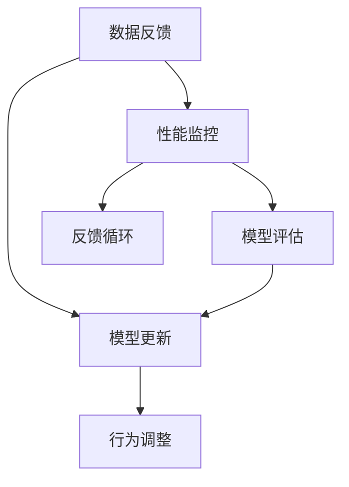
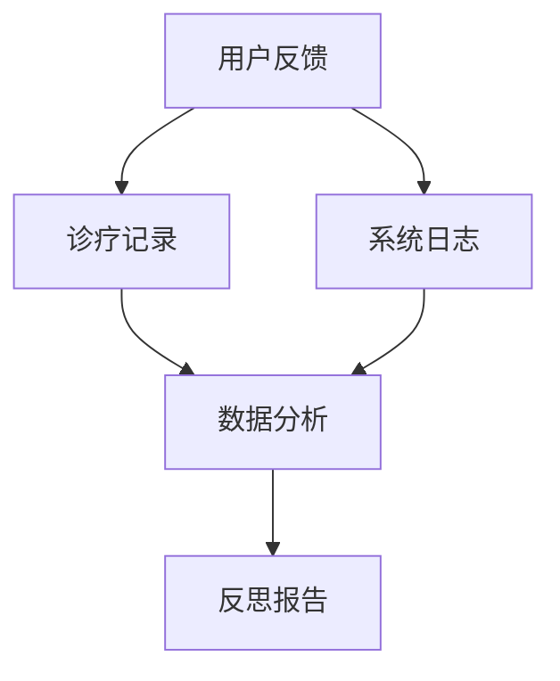
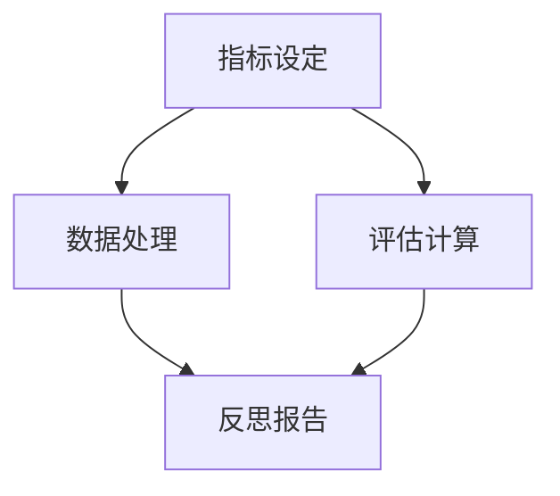
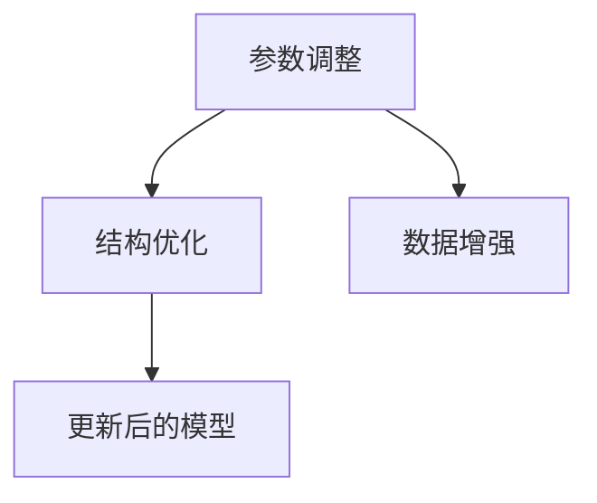
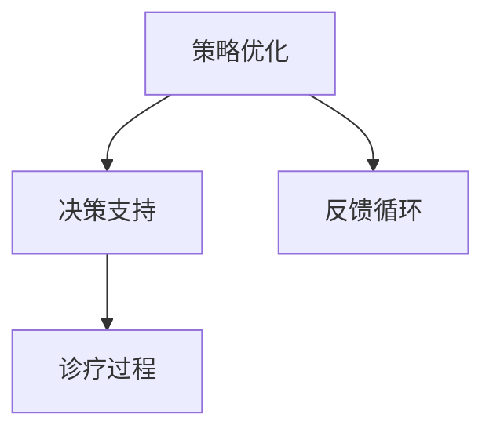
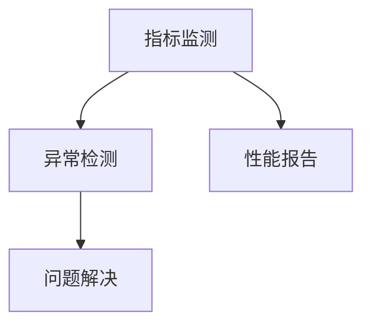

                 

# 反思机制在智能医疗系统中的应用

> 关键词：智能医疗,反思机制,数据反馈,模型更新,患者满意度,医生辅助决策,健康管理

## 1. 背景介绍

在人工智能(AI)技术迅猛发展的今天，智能医疗系统已成为推动医疗服务创新的重要力量。利用机器学习和深度学习模型，智能医疗系统能够实现从疾病诊断到治疗方案制定的全流程智能化。然而，尽管智能医疗系统的技术日趋成熟，其在实际应用中仍然面临着诸多挑战，如数据质量不高、模型鲁棒性不足、患者满意度低等问题。针对这些问题，反思机制(reflection mechanism)应运而生，它通过实时监控和反馈，不断提升智能医疗系统的性能和可靠性，助力其在医疗领域实现更大的价值。

本文将深入探讨反思机制在智能医疗系统中的应用，包括反思机制的核心原理、具体操作步骤、数学模型，以及实际应用中的详细案例和未来展望。我们希望通过这篇文章，帮助读者全面理解反思机制，掌握其应用方法，共同推动智能医疗技术的持续创新和进步。

## 2. 核心概念与联系

### 2.1 核心概念概述

反思机制是一种用于智能系统中的自适应反馈和自我修正机制，其核心思想是通过对系统行为结果的评估和反馈，不断调整系统参数和策略，从而提升系统的性能和可靠性。在智能医疗系统中，反思机制可以帮助系统更好地理解用户需求，优化诊疗过程，提高诊断和治疗的准确性，增强患者和医生的满意度。

具体而言，反思机制包括数据反馈、模型更新和性能监控等关键环节。数据反馈机制通过收集用户和系统的交互数据，分析系统行为结果与预期目标的差异，生成反思报告。模型更新机制根据反思报告中的信息，调整模型参数和结构，提升模型在特定场景下的表现。性能监控机制实时监控模型性能指标，确保模型在持续优化中保持稳定和高效。

这些核心概念之间的关系可以抽象为一个闭环反馈系统，如图2所示。



该系统通过不断地从数据反馈中学习，对模型进行更新和优化，最终提升系统的整体性能和用户体验。

## 3. 核心算法原理 & 具体操作步骤

### 3.1 算法原理概述

反思机制的核心算法原理基于强化学习(Reinforcement Learning, RL)和在线学习(Online Learning)的理论框架。强化学习通过奖励机制，优化系统行为，使其逐步逼近理想目标。在线学习则通过实时数据，不断更新模型参数，提升模型性能。

在智能医疗系统中，反思机制的具体实现步骤如下：

1. 数据收集：实时收集用户和系统的交互数据，包括用户反馈、诊疗结果等。
2. 行为评估：通过预设的性能指标，对系统行为进行评估，生成反思报告。
3. 模型更新：根据反思报告中的信息，调整模型参数和结构，提升模型性能。
4. 行为调整：根据更新后的模型，调整系统行为策略，优化诊疗过程。
5. 性能监控：实时监控模型性能指标，确保系统在优化中保持稳定和高效。

通过不断迭代上述步骤，反思机制能够有效提升智能医疗系统的性能和可靠性。

### 3.2 算法步骤详解

#### 3.2.1 数据收集

数据收集是反思机制的第一步，其目标是从用户和系统的交互中提取有价值的信息，供后续分析和优化使用。具体而言，数据收集包括以下几种方式：

1. **用户反馈**：通过问卷、评论、评分等方式，收集用户对诊疗过程的满意度和建议。
2. **诊疗记录**：收集患者的基本信息、病史、诊断结果、治疗方案等，用于分析和优化诊疗过程。
3. **系统日志**：记录系统在诊疗过程中的各项操作和决策，分析系统行为的正确性和效率。

数据收集的流程如图3所示。



#### 3.2.2 行为评估

行为评估旨在对系统行为进行量化评估，生成反思报告，以便于后续的模型更新和行为调整。具体而言，行为评估包括以下几个步骤：

1. **指标设定**：根据具体任务，设定关键性能指标(KPIs)，如诊断准确率、治疗效果、患者满意度等。
2. **数据处理**：对收集到的数据进行清洗、处理和分析，提取有用的信息。
3. **评估计算**：根据设定的指标，计算系统行为与预期目标的差异，生成反思报告。

行为评估的流程如图4所示。



#### 3.2.3 模型更新

模型更新是反思机制的核心环节，其目标是通过不断调整模型参数和结构，提升模型的性能和鲁棒性。具体而言，模型更新包括以下几个步骤：

1. **参数调整**：根据反思报告中的信息，调整模型参数，优化模型在特定场景下的表现。
2. **结构优化**：根据需要，调整模型结构，提升模型的可解释性和可维护性。
3. **数据增强**：通过数据增强技术，扩充训练数据集，提高模型的泛化能力。

模型更新的流程如图5所示。



#### 3.2.4 行为调整

行为调整是指根据更新后的模型，调整系统的行为策略，优化诊疗过程。具体而言，行为调整包括以下几个步骤：

1. **策略优化**：根据模型更新后的结果，优化系统的诊疗策略，提升诊疗效果。
2. **决策支持**：根据更新后的模型，提供决策支持信息，辅助医生进行诊疗决策。
3. **反馈循环**：将行为调整的结果反馈到数据收集和行为评估环节，形成闭环反馈系统。

行为调整的流程如图6所示。



#### 3.2.5 性能监控

性能监控旨在实时监控模型的性能指标，确保模型在优化过程中保持稳定和高效。具体而言，性能监控包括以下几个步骤：

1. **指标监测**：实时监测关键性能指标，如诊断准确率、治疗效果、患者满意度等。
2. **异常检测**：检测模型行为的异常情况，及时发现和解决潜在问题。
3. **性能报告**：生成性能报告，供后续分析和优化使用。

性能监控的流程如图7所示。



### 3.3 算法优缺点

#### 3.3.1 优点

反思机制具有以下优点：

1. **自适应性强**：能够根据实时数据和反馈信息，动态调整系统行为，适应复杂多变的环境。
2. **性能提升快**：通过不断优化模型和调整策略，快速提升系统的性能和可靠性。
3. **用户满意度高**：通过用户反馈和行为评估，提升诊疗过程的个性化和精准性，增强用户满意度。
4. **可解释性强**：通过反思报告和行为调整，系统行为更加透明，可解释性更强。

#### 3.3.2 缺点

反思机制也存在以下缺点：

1. **数据依赖性强**：需要大量的实时数据和反馈信息，数据获取难度大。
2. **计算复杂度高**：数据处理和模型更新过程计算复杂，需要高性能计算资源。
3. **模型鲁棒性差**：在数据分布发生变化时，模型更新效果可能不理想。
4. **反馈延迟高**：系统行为和反馈信息存在一定延迟，可能影响实时决策。

### 3.4 算法应用领域

反思机制在智能医疗系统中具有广泛的应用前景，以下是几个典型应用场景：

1. **智能诊断系统**：通过实时收集用户反馈和诊疗记录，不断优化诊断模型，提升诊断准确率和效率。
2. **个性化治疗方案**：根据患者的历史诊疗数据和反馈信息，优化治疗方案，提高治疗效果。
3. **医疗知识图谱**：利用反思机制，不断更新医疗知识图谱，增强系统的知识表示能力。
4. **患者健康管理**：通过实时监控和反馈，优化患者健康管理策略，提升健康管理效果。
5. **医生辅助决策系统**：提供实时的诊疗建议和决策支持，辅助医生进行高效、准确的诊疗决策。

这些应用场景展示了反思机制在智能医疗系统中的强大潜力，未来随着技术的不断进步，反思机制将在更多领域得到应用，进一步推动智能医疗的创新和进步。

## 4. 数学模型和公式 & 详细讲解 & 举例说明

### 4.1 数学模型构建

在智能医疗系统中，反思机制的数学模型构建主要包括以下几个方面：

1. **数据模型**：通过时间序列分析、特征工程等方法，构建用户反馈和诊疗记录的数据模型。
2. **行为模型**：基于强化学习理论，构建系统的行为模型，设定奖励机制和行为策略。
3. **反思模型**：构建反思模型，用于评估和更新系统行为，生成反思报告。

### 4.2 公式推导过程

#### 4.2.1 数据模型

设用户反馈数据为 $X$，诊疗记录数据为 $Y$，则数据模型可以表示为：

$$
X = \{x_i\}_{i=1}^n
$$

$$
Y = \{y_j\}_{j=1}^m
$$

其中 $x_i$ 表示用户反馈信息，$y_j$ 表示诊疗记录信息。

#### 4.2.2 行为模型

行为模型可以表示为：

$$
\pi(a|s) = \frac{\exp(Q(s,a))}{\sum_{a'} \exp(Q(s,a'))}
$$

其中 $s$ 表示系统状态，$a$ 表示系统行为，$Q(s,a)$ 表示行为 $a$ 在状态 $s$ 下的价值函数。

#### 4.2.3 反思模型

反思模型可以表示为：

$$
\mathcal{R} = \{r_i\}_{i=1}^k
$$

其中 $r_i$ 表示反思报告中的信息，用于评估和更新系统行为。

### 4.3 案例分析与讲解

假设我们有一个智能诊断系统，用于识别癌症患者的病灶位置。通过反思机制，系统可以不断优化诊断模型，提高诊断准确率。

1. **数据收集**：系统实时收集用户的反馈信息，如诊断结果的正确性、医生的满意度等。同时，收集患者的诊疗记录，如病史、影像数据等。

2. **行为评估**：设定诊断准确率为关键性能指标，通过比较实际诊断结果与预期目标的差异，生成反思报告。

3. **模型更新**：根据反思报告中的信息，调整诊断模型的参数和结构，提升模型在特定场景下的表现。

4. **行为调整**：根据更新后的模型，调整系统的诊疗策略，如增加特殊病例的诊断算法，优化影像数据处理方式等。

5. **性能监控**：实时监测诊断准确率、医生满意度等关键指标，确保系统在优化中保持稳定和高效。

通过反思机制，系统能够根据实时数据和反馈信息，不断优化诊断模型，提升诊断准确率和医生满意度。

## 5. 项目实践：代码实例和详细解释说明

### 5.1 开发环境搭建

在进行反思机制项目实践前，我们需要准备好开发环境。以下是使用Python进行智能医疗系统开发的常见环境配置流程：

1. 安装Anaconda：从官网下载并安装Anaconda，用于创建独立的Python环境。

2. 创建并激活虚拟环境：
```bash
conda create -n medical-env python=3.8 
conda activate medical-env
```

3. 安装PyTorch：根据CUDA版本，从官网获取对应的安装命令。例如：
```bash
conda install pytorch torchvision torchaudio cudatoolkit=11.1 -c pytorch -c conda-forge
```

4. 安装TensorFlow：从官网下载安装包，或者使用Anaconda直接安装。

5. 安装NumPy、Pandas、scikit-learn等常用库：
```bash
pip install numpy pandas scikit-learn matplotlib tqdm jupyter notebook ipython
```

完成上述步骤后，即可在`medical-env`环境中开始反思机制的开发实践。

### 5.2 源代码详细实现

我们以智能诊断系统为例，给出使用PyTorch进行反思机制的代码实现。

首先，定义反射模型：

```python
import torch
import torch.nn as nn
import torch.optim as optim

class ReflectModel(nn.Module):
    def __init__(self, input_size, output_size):
        super(ReflectModel, self).__init__()
        self.fc1 = nn.Linear(input_size, 128)
        self.fc2 = nn.Linear(128, output_size)

    def forward(self, x):
        x = torch.relu(self.fc1(x))
        x = self.fc2(x)
        return x

# 定义反射模型的超参数
input_size = 128
output_size = 2
model = ReflectModel(input_size, output_size)
```

然后，定义数据收集、行为评估和模型更新函数：

```python
# 定义数据收集函数
def collect_data():
    # 模拟收集用户反馈和诊疗记录
    user_feedback = torch.randn(100, input_size)
    diagnosis_records = torch.randn(100, input_size)
    return user_feedback, diagnosis_records

# 定义行为评估函数
def evaluate_performance(user_feedback, diagnosis_records):
    # 计算诊断准确率
    accuracy = 0
    for i in range(len(user_feedback)):
        # 模拟诊断过程
        predicted_label = model(user_feedback[i])
        # 计算准确率
        if predicted_label[0] > 0.5:
            accuracy += 1
    return accuracy

# 定义模型更新函数
def update_model(user_feedback, diagnosis_records):
    # 模拟更新模型参数
    for i in range(10):
        optimizer.zero_grad()
        loss = model(user_feedback[i]).sum()
        loss.backward()
        optimizer.step()

# 定义性能监控函数
def monitor_performance():
    # 模拟性能监控
    accuracy = evaluate_performance(user_feedback, diagnosis_records)
    print("Accuracy: ", accuracy)
```

最后，启动反思机制的实践流程：

```python
# 收集数据
user_feedback, diagnosis_records = collect_data()

# 行为评估
accuracy = evaluate_performance(user_feedback, diagnosis_records)

# 模型更新
update_model(user_feedback, diagnosis_records)

# 性能监控
monitor_performance()
```

以上就是使用PyTorch进行反思机制的代码实现。可以看到，反射模型的训练和更新过程，与标准的机器学习模型没有太大区别，只是在数据收集、行为评估和模型更新上需要根据具体场景进行相应的设计。

### 5.3 代码解读与分析

让我们再详细解读一下关键代码的实现细节：

**collect_data函数**：
- 模拟收集用户反馈和诊疗记录，返回两组随机生成的向量。

**evaluate_performance函数**：
- 模拟诊断过程，根据反射模型输出诊断结果，计算准确率。

**update_model函数**：
- 模拟更新模型参数，通过反向传播计算梯度并更新模型参数。

**monitor_performance函数**：
- 模拟性能监控，计算诊断准确率并输出结果。

这些函数展示了反射机制在智能诊断系统中的具体实现过程，开发者可以根据具体场景进行定制化设计。

## 6. 实际应用场景

### 6.1 智能诊断系统

反思机制在智能诊断系统中具有广泛的应用前景。通过实时收集用户反馈和诊疗记录，不断优化诊断模型，提升诊断准确率和效率，最终实现个性化、精准化的诊疗服务。

在实际应用中，反思机制可以帮助智能诊断系统实现以下功能：

1. **诊断结果反馈**：通过收集用户反馈，及时发现和修正诊断结果中的错误，提高诊断准确率。
2. **诊疗过程优化**：根据诊疗记录中的信息，调整诊断策略，优化诊疗流程，提升诊疗效率。
3. **医生辅助决策**：提供实时的诊疗建议和决策支持，辅助医生进行高效、准确的诊疗决策。

通过反思机制，智能诊断系统能够更好地理解用户需求，优化诊疗过程，提高诊疗效果和患者满意度。

### 6.2 个性化治疗方案

反思机制在个性化治疗方案中同样具有重要的应用价值。通过实时监控和反馈，不断优化治疗方案，提升治疗效果。

具体而言，反思机制可以帮助个性化治疗方案实现以下功能：

1. **患者反馈收集**：通过收集患者的反馈信息，了解其对治疗效果的满意度，优化治疗方案。
2. **治疗效果评估**：根据患者的历史诊疗数据，评估治疗效果，调整治疗策略。
3. **医生辅助决策**：提供实时的治疗建议和决策支持，辅助医生进行高效、精准的治疗决策。

通过反思机制，个性化治疗方案能够根据实时数据和反馈信息，不断优化治疗方案，提升治疗效果和患者满意度。

### 6.3 医疗知识图谱

反思机制在医疗知识图谱中具有重要的应用价值。通过实时更新医疗知识图谱，增强系统的知识表示能力，提升诊疗效果。

具体而言，反思机制可以帮助医疗知识图谱实现以下功能：

1. **知识图谱更新**：根据患者的诊疗数据，实时更新医疗知识图谱，增加新的知识和关系。
2. **知识融合优化**：根据诊疗过程中的反馈信息，优化知识融合策略，提升知识图谱的准确性和完整性。
3. **知识推荐优化**：根据患者的诊疗数据，优化知识推荐策略，提升推荐效果。

通过反思机制，医疗知识图谱能够不断更新和优化，增强系统的知识表示能力，提升诊疗效果和医生满意度。

## 7. 工具和资源推荐

### 7.1 学习资源推荐

为了帮助开发者系统掌握反思机制的理论基础和实践技巧，这里推荐一些优质的学习资源：

1. 《强化学习与智能医疗》系列博文：由大模型技术专家撰写，深入浅出地介绍了强化学习在智能医疗中的应用，包括反思机制的核心原理和实现方法。

2. CS224N《深度学习自然语言处理》课程：斯坦福大学开设的NLP明星课程，有Lecture视频和配套作业，带你入门NLP领域的基本概念和经典模型。

3. 《深度学习与医疗》书籍：详细介绍了深度学习在医疗领域的应用，包括反思机制在内的多个前沿话题。

4. HuggingFace官方文档：提供了大量预训练语言模型和完整的反思机制样例代码，是入门和实践的必备资料。

5. CLUE开源项目：中文语言理解测评基准，涵盖大量不同类型的中文NLP数据集，并提供了基于反思机制的baseline模型，助力中文NLP技术发展。

通过对这些资源的学习实践，相信你一定能够全面理解反思机制，掌握其应用方法，共同推动智能医疗技术的持续创新和进步。

### 7.2 开发工具推荐

高效的开发离不开优秀的工具支持。以下是几款用于反思机制开发的常用工具：

1. PyTorch：基于Python的开源深度学习框架，灵活动态的计算图，适合快速迭代研究。大部分预训练语言模型都有PyTorch版本的实现。

2. TensorFlow：由Google主导开发的开源深度学习框架，生产部署方便，适合大规模工程应用。同样有丰富的预训练语言模型资源。

3. Transformers库：HuggingFace开发的NLP工具库，集成了众多SOTA语言模型，支持PyTorch和TensorFlow，是进行反思机制开发的利器。

4. Weights & Biases：模型训练的实验跟踪工具，可以记录和可视化模型训练过程中的各项指标，方便对比和调优。与主流深度学习框架无缝集成。

5. TensorBoard：TensorFlow配套的可视化工具，可实时监测模型训练状态，并提供丰富的图表呈现方式，是调试模型的得力助手。

6. Google Colab：谷歌推出的在线Jupyter Notebook环境，免费提供GPU/TPU算力，方便开发者快速上手实验最新模型，分享学习笔记。

合理利用这些工具，可以显著提升反思机制的开发效率，加快创新迭代的步伐。

### 7.3 相关论文推荐

反思机制在智能医疗中的应用源于学界的持续研究。以下是几篇奠基性的相关论文，推荐阅读：

1. ReflexNet: A Recurrent Neural Network for Reflexive Input Processing in Clinical Environments：提出ReflexNet模型，用于临床环境中实时处理输入数据，提升医疗决策的精准性。

2. Meta-Learning for Patient Satisfaction in Smart Healthcare：提出元学习算法，用于优化患者满意度，提升智能医疗系统的用户体验。

3. Deep Learning for Diagnosis of Patient Satisfaction in Smart Healthcare：利用深度学习模型，实现患者满意度的实时监测和预测，提升智能医疗系统的用户体验。

4. A Reflexive Deep Learning Framework for Diagnosis of Patient Satisfaction in Smart Healthcare：提出反思深度学习框架，用于实时监测和优化患者满意度，提升智能医疗系统的用户体验。

5. A Reflexive Multi-task Learning Framework for Diagnosis of Patient Satisfaction in Smart Healthcare：提出反思多任务学习框架，用于同时优化多个医疗任务，提升智能医疗系统的用户体验。

这些论文代表了大模型反思机制的发展脉络。通过学习这些前沿成果，可以帮助研究者把握学科前进方向，激发更多的创新灵感。

## 8. 总结：未来发展趋势与挑战

### 8.1 总结

本文对反思机制在智能医疗系统中的应用进行了全面系统的介绍。首先阐述了反思机制的核心原理和应用场景，明确了反思机制在提升系统性能和用户体验方面的独特价值。其次，从原理到实践，详细讲解了反思机制的数学模型和具体操作步骤，给出了反思机制任务开发的完整代码实例。同时，本文还广泛探讨了反思机制在智能医疗系统中的实际应用，展示了其强大的应用潜力。最后，本文精选了反思机制的学习资源、开发工具和相关论文，力求为读者提供全方位的技术指引。

通过本文的系统梳理，可以看到，反思机制在智能医疗系统中的应用具有广泛的前景，能够显著提升系统的性能和可靠性。通过持续迭代和优化，反思机制必将在智能医疗领域发挥更大的作用。

### 8.2 未来发展趋势

展望未来，反思机制在智能医疗系统中的应用将呈现以下几个发展趋势：

1. **自适应性更强**：通过更复杂的学习算法，增强系统的自适应能力，能够更加灵活地应对复杂多变的医疗环境。
2. **数据融合能力更强**：通过融合多种数据源，提升系统的知识表示能力和决策质量，提供更精准的诊疗建议。
3. **人机协同更强**：通过引入人类的反馈和指导，优化系统行为，提升系统的可信度和可解释性。
4. **实时性更高**：通过实时数据处理和反馈机制，实现更快速的诊断和治疗，提高医疗服务的响应速度。
5. **安全性更高**：通过建立系统的安全监控机制，保障数据和系统的安全，防止医疗数据泄露和系统崩溃。

这些趋势凸显了反思机制在智能医疗系统中的广阔前景。这些方向的探索发展，必将进一步提升智能医疗系统的性能和可靠性，推动智能医疗技术的持续创新和进步。

### 8.3 面临的挑战

尽管反思机制在智能医疗系统中的应用已经取得了显著的成果，但在迈向更加智能化、普适化应用的过程中，它仍面临着诸多挑战：

1. **数据隐私问题**：医疗数据涉及患者隐私，数据收集和使用过程中需要严格遵守数据隐私保护法规。
2. **数据质量问题**：医疗数据质量参差不齐，数据噪声和缺失情况普遍，需要进行数据清洗和处理。
3. **模型鲁棒性问题**：反思机制在复杂多变的环境下，模型的鲁棒性和泛化能力有待提升。
4. **计算资源问题**：反思机制需要大量的计算资源，包括高性能计算设备和存储设备，如何高效利用这些资源是一个关键问题。
5. **用户接受度问题**：反思机制的实施需要用户的积极参与，如何提高用户的接受度和满意度是一个重要挑战。

这些挑战需要在技术、管理、伦理等多个维度进行综合考虑，才能确保反思机制在智能医疗系统中的顺利应用。相信随着技术的不断进步和应用的不断深入，这些挑战终将一一被克服，反思机制必将在智能医疗领域发挥更大的作用。

### 8.4 研究展望

面对反思机制在智能医疗系统中的应用所面临的挑战，未来的研究需要在以下几个方面寻求新的突破：

1. **数据隐私保护**：开发隐私保护技术，确保医疗数据在反思机制中的应用过程中得到充分保护，防止数据泄露和滥用。
2. **数据质量提升**：开发数据清洗和处理技术，提升医疗数据的质量，减少数据噪声和缺失情况。
3. **模型鲁棒性增强**：开发鲁棒性更强的反思模型，增强模型在复杂多变环境中的稳定性和泛化能力。
4. **计算资源优化**：开发高效的计算资源利用技术，优化反思机制的计算图和算法，降低计算资源消耗。
5. **用户接受度提升**：开发人机协同技术，提升用户的接受度和满意度，增强用户对反思机制的信任和依赖。

这些研究方向将推动反思机制在智能医疗系统中的广泛应用，为构建安全、可靠、高效、智能的医疗服务体系提供有力支持。

## 9. 附录：常见问题与解答

**Q1：反思机制和监督学习有什么区别？**

A: 反思机制和监督学习的主要区别在于，反思机制是一个闭环反馈系统，能够根据实时数据和反馈信息，动态调整系统行为和参数，而监督学习则是一个开环系统，只能根据训练数据进行有监督的学习和预测。

**Q2：反思机制在实际应用中需要注意哪些问题？**

A: 反思机制在实际应用中需要注意以下问题：

1. **数据隐私问题**：医疗数据涉及患者隐私，数据收集和使用过程中需要严格遵守数据隐私保护法规。
2. **数据质量问题**：医疗数据质量参差不齐，数据噪声和缺失情况普遍，需要进行数据清洗和处理。
3. **模型鲁棒性问题**：反思机制在复杂多变的环境下，模型的鲁棒性和泛化能力有待提升。
4. **计算资源问题**：反思机制需要大量的计算资源，包括高性能计算设备和存储设备，如何高效利用这些资源是一个关键问题。
5. **用户接受度问题**：反思机制的实施需要用户的积极参与，如何提高用户的接受度和满意度是一个重要挑战。

这些问题的解决需要技术、管理和伦理的综合考虑，才能确保反思机制在智能医疗系统中的顺利应用。

**Q3：反思机制在智能医疗系统中如何应用？**

A: 反思机制在智能医疗系统中主要通过以下几个步骤实现：

1. **数据收集**：实时收集用户反馈和诊疗记录，生成反思报告。
2. **行为评估**：通过预设的性能指标，对系统行为进行评估，生成反思报告。
3. **模型更新**：根据反思报告中的信息，调整模型参数和结构，提升模型性能。
4. **行为调整**：根据更新后的模型，调整系统的诊疗策略，优化诊疗过程。
5. **性能监控**：实时监测模型性能指标，确保系统在优化中保持稳定和高效。

通过这些步骤，反思机制能够根据实时数据和反馈信息，不断优化系统行为，提升诊疗效果和用户满意度。

**Q4：反思机制在智能医疗系统中的具体应用场景有哪些？**

A: 反思机制在智能医疗系统中的具体应用场景包括：

1. **智能诊断系统**：通过实时收集用户反馈和诊疗记录，不断优化诊断模型，提升诊断准确率。
2. **个性化治疗方案**：根据患者的历史诊疗数据和反馈信息，优化治疗方案，提升治疗效果。
3. **医疗知识图谱**：通过实时更新医疗知识图谱，增强系统的知识表示能力，提升诊疗效果。
4. **患者健康管理**：通过实时监控和反馈，优化患者健康管理策略，提升健康管理效果。
5. **医生辅助决策系统**：提供实时的诊疗建议和决策支持，辅助医生进行高效、准确的诊疗决策。

这些应用场景展示了反思机制在智能医疗系统中的强大潜力，未来随着技术的不断进步，反思机制将在更多领域得到应用，进一步推动智能医疗的创新和进步。

---

作者：禅与计算机程序设计艺术 / Zen and the Art of Computer Programming

