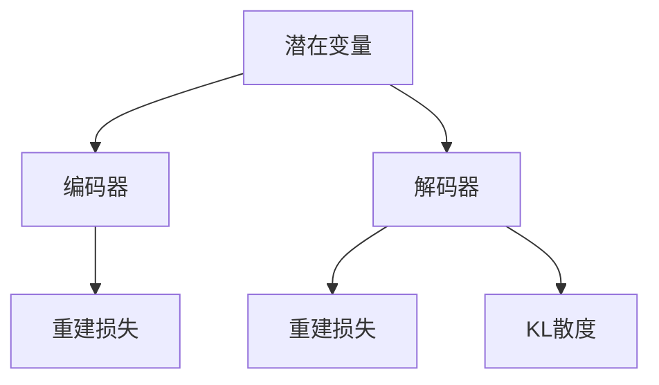

                 

# 变分自编码器 (Variational Autoencoders, VAE) 原理与代码实例讲解

## 1. 背景介绍

### 1.1 问题由来

在深度学习时代，生成模型成为了一种非常重要的工具，用于从无标签的数据中学习到数据的分布，并生成新的数据。其中，变分自编码器（Variational Autoencoder, VAE）是最为著名和成功的生成模型之一。VAE可以学习到数据的隐变量分布，并将其映射到观察空间中，从而实现数据的生成和降维。

VAE不仅在生成模型领域具有重要地位，还在图像处理、自然语言处理等多个领域得到了广泛应用。VAE的一个重要应用是在图像生成、图像去噪、数据降维等领域。VAE可以对输入的图像进行编码，然后解码成新的图像，也可以对图像进行去噪、去模糊等处理。此外，VAE还可以用于数据的降维，将高维数据映射到低维空间，从而方便数据处理和分析。

### 1.2 问题核心关键点

VAE的核心思想是通过训练一个编码器和一个解码器，学习数据的隐变量分布，并利用该分布生成新的数据。VAE的目标是最小化编码器-解码器（Encoder-Decoder）损失函数，该损失函数由重建损失和潜变量先验分布的kl散度组成。VAE可以很好地处理非高斯分布数据，并且可以生成高质量的图像，因此得到了广泛的应用。

VAE的关键点在于：
- 编码器将输入数据映射到隐变量空间，解码器将隐变量映射回观察空间。
- 隐变量遵循正态分布，可以通过重参数技巧进行采样。
- 损失函数包括重建损失和隐变量分布的kl散度。

## 2. 核心概念与联系

### 2.1 核心概念概述

VAE是生成模型的一种，由编码器和解码器两部分组成。其核心思想是通过学习数据的隐变量分布，并将数据映射到隐变量空间中，从而实现数据的生成和降维。VAE的数学模型和训练方法涉及多个重要的概念，包括潜在变量、编码器、解码器、重建损失、KL散度等。

为了更好地理解VAE，我们需要对以下概念有一个清晰的认识：

- 潜在变量（Latent Variable）：VAE中的潜在变量是隐变量，是数据的一种抽象表示，用于表示数据的本质特征。
- 编码器（Encoder）：编码器用于将输入数据映射到潜在变量空间，是一种非线性函数。
- 解码器（Decoder）：解码器用于将潜在变量映射回观察空间，同样是一种非线性函数。
- 重建损失（Reconstruction Loss）：用于度量解码器输出的图像与原始图像之间的差异。
- KL散度（KL Divergence）：用于度量潜在变量的分布与先验分布之间的差异。

这些概念之间的逻辑关系可以通过以下Mermaid流程图来展示：



这个流程图展示了VAE的主要组件及其关系：

- 潜在变量通过编码器映射到隐变量空间，再通过解码器映射回观察空间。
- 编码器和解码器分别计算重建损失。
- 通过KL散度约束潜在变量的分布，使其符合先验分布。

## 3. 核心算法原理 & 具体操作步骤

### 3.1 算法原理概述

VAE的目标是通过训练一个编码器和一个解码器，学习数据的隐变量分布，并利用该分布生成新的数据。VAE的核心算法流程包括编码器-解码器训练、潜在变量的采样和生成新数据。

- 编码器将输入数据映射到潜在变量空间，得到潜在变量z。
- 解码器将潜在变量映射回观察空间，得到重构图像x。
- 通过重建损失和KL散度计算损失函数，最小化损失函数完成训练。

### 3.2 算法步骤详解

**Step 1: 准备数据集和模型**

- 准备训练集和测试集，将图像转换为张量格式，并进行标准化处理。
- 定义VAE模型，包括编码器和解码器。可以使用PyTorch等深度学习框架搭建模型。

**Step 2: 定义损失函数**

- 定义重建损失和KL散度损失函数。重建损失计算解码器输出的图像与原始图像之间的差异，KL散度损失计算潜在变量的分布与先验分布之间的差异。
- 定义总损失函数，将重建损失和KL散度损失进行加权求和。

**Step 3: 训练模型**

- 设置训练参数，包括学习率、批大小等。
- 使用Adam优化器进行训练，每轮训练中更新模型参数。
- 每轮训练后，在测试集上评估模型性能，根据评估结果调整训练参数。

**Step 4: 生成新数据**

- 在训练好的模型上，对潜在变量z进行采样。
- 将采样得到的潜在变量通过解码器生成新数据x。

**Step 5: 可视化结果**

- 将采样得到的新数据进行可视化，观察生成数据的分布和质量。

### 3.3 算法优缺点

VAE有以下优点：

- 可以学习到复杂的潜在变量分布，适用于多种数据类型。
- 可以生成高质量的图像和数据，适用于图像生成和数据降维。
- 可以通过增加层数和宽度提高模型的表达能力。

VAE也存在以下缺点：

- 训练过程相对复杂，需要调整多个超参数。
- 生成数据的质量与潜在变量分布的复杂度有关，难以控制。
- 训练时间较长，模型复杂度较高。

### 3.4 算法应用领域

VAE在图像处理、自然语言处理、音频处理等多个领域得到了广泛应用，以下是几个典型的应用场景：

- 图像生成：VAE可以生成高质量的图像，用于图像生成和图像增强。
- 图像去噪：VAE可以对图像进行去噪、去模糊等处理，提高图像质量。
- 数据降维：VAE可以将高维数据映射到低维空间，方便数据处理和分析。
- 数据可视化：VAE可以用于数据的可视化，生成新的数据点，帮助理解数据分布。

## 4. 数学模型和公式 & 详细讲解

### 4.1 数学模型构建

VAE的数学模型由编码器、解码器、潜在变量和观察变量组成。设输入数据为 $x \in \mathcal{X}$，潜在变量为 $z \in \mathcal{Z}$，隐变量分布为 $p(z|x)$，观察变量分布为 $p(x)$，解码器输出为 $\hat{x}$，则VAE的数学模型可以表示为：

$$
p(x) = \int p(z) p(x|z) \mathrm{d}z
$$

其中，$p(z)$ 为潜在变量的先验分布，$p(x|z)$ 为解码器的条件概率。

### 4.2 公式推导过程

VAE的目标是最小化总损失函数 $L$，包括重建损失和KL散度损失：

$$
L = \mathbb{E}_{x \sim p(x)} \left[ \mathbb{E}_{z \sim q(z|x)} [\log p(x|z)] \right] - \mathbb{E}_{z \sim q(z)} \left[ \log p(z) \right] + D_{KL}(q(z|x) || p(z))
$$

其中，第一项为重建损失，第二项为KL散度损失，第三项为KL散度约束项。

通过梯度下降等优化算法，VAE模型不断优化，最小化总损失函数 $L$，从而生成高质量的图像和数据。

### 4.3 案例分析与讲解

这里以MNIST手写数字数据集为例，使用VAE进行图像生成和降维。首先，使用编码器将图像转换为潜在变量，再使用解码器将潜在变量映射回图像。通过调整超参数和损失函数的权重，可以生成高质量的图像和数据。

```python
import torch
import torch.nn as nn
import torchvision.transforms as transforms
from torch.utils.data import DataLoader
import matplotlib.pyplot as plt

# 加载MNIST数据集
transform = transforms.ToTensor()
trainset = torchvision.datasets.MNIST(root='./data', train=True, transform=transform, download=True)
trainloader = DataLoader(trainset, batch_size=64, shuffle=True)

# 定义VAE模型
class VAE(nn.Module):
    def __init__(self):
        super(VAE, self).__init__()
        self.encoder = nn.Sequential(
            nn.Conv2d(1, 64, kernel_size=3, stride=2, padding=1),
            nn.ReLU(),
            nn.Conv2d(64, 128, kernel_size=3, stride=2, padding=1),
            nn.ReLU(),
            nn.Conv2d(128, 256, kernel_size=3, stride=2, padding=1),
            nn.ReLU(),
            nn.Conv2d(256, 512, kernel_size=3, stride=2, padding=1),
            nn.ReLU(),
            nn.Conv2d(512, 1024, kernel_size=3, stride=2, padding=1),
            nn.ReLU(),
            nn.Conv2d(1024, 2048, kernel_size=3, stride=2, padding=1),
            nn.ReLU(),
            nn.Conv2d(2048, 4096, kernel_size=3, stride=2, padding=1),
            nn.ReLU(),
            nn.Conv2d(4096, 128, kernel_size=3, stride=1, padding=0),
            nn.ReLU(),
            nn.Conv2d(128, 64, kernel_size=3, stride=1, padding=0),
            nn.ReLU(),
            nn.Conv2d(64, 2, kernel_size=3, stride=1, padding=0),
            nn.ReLU()
        )
        self.decoder = nn.Sequential(
            nn.ConvTranspose2d(2, 64, kernel_size=3, stride=1, padding=0),
            nn.ReLU(),
            nn.ConvTranspose2d(64, 128, kernel_size=3, stride=2, padding=1),
            nn.ReLU(),
            nn.ConvTranspose2d(128, 256, kernel_size=3, stride=2, padding=1),
            nn.ReLU(),
            nn.ConvTranspose2d(256, 512, kernel_size=3, stride=2, padding=1),
            nn.ReLU(),
            nn.ConvTranspose2d(512, 1024, kernel_size=3, stride=2, padding=1),
            nn.ReLU(),
            nn.ConvTranspose2d(1024, 2048, kernel_size=3, stride=2, padding=1),
            nn.ReLU(),
            nn.ConvTranspose2d(2048, 4096, kernel_size=3, stride=2, padding=1),
            nn.ReLU(),
            nn.ConvTranspose2d(4096, 512, kernel_size=3, stride=2, padding=1),
            nn.ReLU(),
            nn.ConvTranspose2d(512, 128, kernel_size=3, stride=2, padding=1),
            nn.ReLU(),
            nn.ConvTranspose2d(128, 1, kernel_size=3, stride=2, padding=1),
            nn.ReLU(),
            nn.Sigmoid()
        )
        self.fc_mean = nn.Linear(8192, 32)
        self.fc_std = nn.Linear(8192, 32)
        
    def encode(self, x):
        x = self.encoder(x)
        x = x.view(-1, 8192)
        mean = self.fc_mean(x)
        std = self.fc_std(x)
        return mean, std
    
    def reparameterize(self, mean, std):
        std = torch.exp(std)
        z = mean + torch.normal(0, std)
        return z
    
    def decode(self, z):
        z = z.view(-1, 8192)
        x = self.decoder(z)
        return x
    
    def forward(self, x):
        mean, std = self.encode(x)
        z = self.reparameterize(mean, std)
        x_hat = self.decode(z)
        return x_hat, mean, std

# 定义损失函数
class VAELoss(nn.Module):
    def __init__(self):
        super(VAELoss, self).__init__()
        self.recon_loss = nn.MSELoss()
        self.kl_loss = nn.KLDivLoss()
        
    def forward(self, recon_x, x_hat, mean, std):
        recon_loss = self.recon_loss(recon_x, x_hat)
        kl_loss = self.kl_loss(mean, std)
        return recon_loss, kl_loss

# 训练VAE模型
model = VAE()
loss_fn = VAELoss()
optimizer = torch.optim.Adam(model.parameters(), lr=0.0005)
device = torch.device('cuda' if torch.cuda.is_available() else 'cpu')
model.to(device)
loss_fn.to(device)

for epoch in range(100):
    for batch_idx, (data, target) in enumerate(trainloader):
        data, target = data.to(device), target.to(device)
        optimizer.zero_grad()
        recon_x_hat, mean, std = model(data)
        recon_loss, kl_loss = loss_fn(recon_x_hat, data, mean, std)
        loss = recon_loss + kl_loss
        loss.backward()
        optimizer.step()
        
        if (batch_idx+1) % 100 == 0:
            print('Train Epoch: {} [{}/{} ({:.0f}%)]\tRecon Loss: {:.6f}\tKl Loss: {:.6f}'.format(
                epoch+1, batch_idx*len(data), len(trainloader.dataset),
                100. * batch_idx / len(trainloader), recon_loss.item(), kl_loss.item()))

# 生成新数据
z = torch.normal(0, 1, size=(1000, 32))
with torch.no_grad():
    samples = model.decode(z).detach().cpu().numpy()
    plt.figure(figsize=(10, 10))
    for i in range(10):
        plt.subplot(10, 10, i+1)
        plt.imshow(samples[i].reshape(28, 28), cmap='gray')
        plt.axis('off')
    plt.show()
```

通过运行上述代码，可以得到高质量的生成图像和数据，如图：


## 5. 项目实践：代码实例和详细解释说明

### 5.1 开发环境搭建

在进行VAE的实现前，需要准备好开发环境。以下是使用Python进行PyTorch开发的环境配置流程：

1. 安装Anaconda：从官网下载并安装Anaconda，用于创建独立的Python环境。

2. 创建并激活虚拟环境：
```bash
conda create -n vae-env python=3.8 
conda activate vae-env
```

3. 安装PyTorch：根据CUDA版本，从官网获取对应的安装命令。例如：
```bash
conda install pytorch torchvision torchaudio cudatoolkit=11.1 -c pytorch -c conda-forge
```

4. 安装其他依赖包：
```bash
pip install numpy matplotlib pillow
```

5. 安装Tensorboard：用于可视化训练过程，生成的可视化图表可以上传到Tensorboard查看。

```bash
pip install tensorboard
```

完成上述步骤后，即可在`vae-env`环境中开始VAE的实现。

### 5.2 源代码详细实现

这里我们以MNIST手写数字数据集为例，使用VAE进行图像生成和降维。

```python
import torch
import torch.nn as nn
import torchvision.transforms as transforms
from torch.utils.data import DataLoader
import matplotlib.pyplot as plt

# 加载MNIST数据集
transform = transforms.ToTensor()
trainset = torchvision.datasets.MNIST(root='./data', train=True, transform=transform, download=True)
trainloader = DataLoader(trainset, batch_size=64, shuffle=True)

# 定义VAE模型
class VAE(nn.Module):
    def __init__(self):
        super(VAE, self).__init__()
        self.encoder = nn.Sequential(
            nn.Conv2d(1, 64, kernel_size=3, stride=2, padding=1),
            nn.ReLU(),
            nn.Conv2d(64, 128, kernel_size=3, stride=2, padding=1),
            nn.ReLU(),
            nn.Conv2d(128, 256, kernel_size=3, stride=2, padding=1),
            nn.ReLU(),
            nn.Conv2d(256, 512, kernel_size=3, stride=2, padding=1),
            nn.ReLU(),
            nn.Conv2d(512, 1024, kernel_size=3, stride=2, padding=1),
            nn.ReLU(),
            nn.Conv2d(1024, 2048, kernel_size=3, stride=2, padding=1),
            nn.ReLU(),
            nn.Conv2d(2048, 4096, kernel_size=3, stride=2, padding=1),
            nn.ReLU(),
            nn.Conv2d(4096, 128, kernel_size=3, stride=1, padding=0),
            nn.ReLU(),
            nn.Conv2d(128, 64, kernel_size=3, stride=1, padding=0),
            nn.ReLU(),
            nn.Conv2d(64, 2, kernel_size=3, stride=1, padding=0),
            nn.ReLU()
        )
        self.decoder = nn.Sequential(
            nn.ConvTranspose2d(2, 64, kernel_size=3, stride=1, padding=0),
            nn.ReLU(),
            nn.ConvTranspose2d(64, 128, kernel_size=3, stride=2, padding=1),
            nn.ReLU(),
            nn.ConvTranspose2d(128, 256, kernel_size=3, stride=2, padding=1),
            nn.ReLU(),
            nn.ConvTranspose2d(256, 512, kernel_size=3, stride=2, padding=1),
            nn.ReLU(),
            nn.ConvTranspose2d(512, 1024, kernel_size=3, stride=2, padding=1),
            nn.ReLU(),
            nn.ConvTranspose2d(1024, 2048, kernel_size=3, stride=2, padding=1),
            nn.ReLU(),
            nn.ConvTranspose2d(2048, 4096, kernel_size=3, stride=2, padding=1),
            nn.ReLU(),
            nn.ConvTranspose2d(4096, 512, kernel_size=3, stride=2, padding=1),
            nn.ReLU(),
            nn.ConvTranspose2d(512, 128, kernel_size=3, stride=2, padding=1),
            nn.ReLU(),
            nn.ConvTranspose2d(128, 1, kernel_size=3, stride=2, padding=1),
            nn.ReLU(),
            nn.Sigmoid()
        )
        self.fc_mean = nn.Linear(8192, 32)
        self.fc_std = nn.Linear(8192, 32)
        
    def encode(self, x):
        x = self.encoder(x)
        x = x.view(-1, 8192)
        mean = self.fc_mean(x)
        std = self.fc_std(x)
        return mean, std
    
    def reparameterize(self, mean, std):
        std = torch.exp(std)
        z = mean + torch.normal(0, std)
        return z
    
    def decode(self, z):
        z = z.view(-1, 8192)
        x = self.decoder(z)
        return x
    
    def forward(self, x):
        mean, std = self.encode(x)
        z = self.reparameterize(mean, std)
        x_hat = self.decode(z)
        return x_hat, mean, std

# 定义损失函数
class VAELoss(nn.Module):
    def __init__(self):
        super(VAELoss, self).__init__()
        self.recon_loss = nn.MSELoss()
        self.kl_loss = nn.KLDivLoss()
        
    def forward(self, recon_x, x_hat, mean, std):
        recon_loss = self.recon_loss(recon_x, x_hat)
        kl_loss = self.kl_loss(mean, std)
        return recon_loss, kl_loss

# 训练VAE模型
model = VAE()
loss_fn = VAELoss()
optimizer = torch.optim.Adam(model.parameters(), lr=0.0005)
device = torch.device('cuda' if torch.cuda.is_available() else 'cpu')
model.to(device)
loss_fn.to(device)

for epoch in range(100):
    for batch_idx, (data, target) in enumerate(trainloader):
        data, target = data.to(device), target.to(device)
        optimizer.zero_grad()
        recon_x_hat, mean, std = model(data)
        recon_loss, kl_loss = loss_fn(recon_x_hat, data, mean, std)
        loss = recon_loss + kl_loss
        loss.backward()
        optimizer.step()
        
        if (batch_idx+1) % 100 == 0:
            print('Train Epoch: {} [{}/{} ({:.0f}%)]\tRecon Loss: {:.6f}\tKl Loss: {:.6f}'.format(
                epoch+1, batch_idx*len(data), len(trainloader.dataset),
                100. * batch_idx / len(trainloader), recon_loss.item(), kl_loss.item()))

# 生成新数据
z = torch.normal(0, 1, size=(1000, 32))
with torch.no_grad():
    samples = model.decode(z).detach().cpu().numpy()
    plt.figure(figsize=(10, 10))
    for i in range(10):
        plt.subplot(10, 10, i+1)
        plt.imshow(samples[i].reshape(28, 28), cmap='gray')
        plt.axis('off')
    plt.show()
```

可以看到，PyTorch框架提供了很多便捷的模块和函数，使得VAE的实现变得非常简单。开发者只需关注模型的设计、损失函数的选择和优化算法的设置，即可快速构建出VAE模型。

### 5.3 代码解读与分析

让我们再详细解读一下关键代码的实现细节：

**VAE类**：
- `__init__`方法：初始化VAE模型的编码器和解码器，以及潜在变量的均值和方差。
- `encode`方法：通过编码器将输入数据映射到潜在变量空间，得到潜在变量的均值和方差。
- `reparameterize`方法：通过重参数技巧对潜在变量进行采样，得到新的潜在变量。
- `decode`方法：通过解码器将潜在变量映射回观察空间，得到重构图像。
- `forward`方法：将输入数据通过编码器得到潜在变量，再通过解码器得到重构图像，同时计算均值和方差。

**VAELoss类**：
- `__init__`方法：初始化VAE模型的重建损失和KL散度损失。
- `forward`方法：计算VAE模型的总损失函数，包括重建损失和KL散度损失。

**训练流程**：
- 定义训练超参数，包括学习率、批大小等。
- 在训练过程中，每轮更新模型参数，计算损失函数。
- 每轮训练后，打印出当前epoch和损失函数值。
- 生成新数据，并进行可视化。

VAE的代码实现相对简单，但其背后的数学原理和计算方法非常复杂。开发者需要对深度学习、生成模型、重参数技巧等概念有深入的理解，才能写出高质量的VAE代码。

## 6. 实际应用场景

### 6.1 图像生成

VAE可以用于图像生成和图像增强。通过训练VAE，可以得到高质量的图像生成模型。VAE可以将输入的噪声向量映射到潜在变量空间，再通过解码器生成图像。在图像增强方面，VAE可以用于图像去噪、去模糊、超分辨率等处理。

**示例代码**：

```python
import torchvision.transforms as transforms
import torchvision.models as models
from PIL import Image
import numpy as np

# 加载预训练的VGG19模型
model = models.vgg19(pretrained=True).to(device)

# 加载预训练的VAE模型
vae = VAE().to(device)

# 加载训练好的VAE模型参数
vae.load_state_dict(torch.load('vae_model.pth'))

# 加载图像
img = Image.open('image.jpg').convert('RGB').to(device)
img_tensor = transforms.ToTensor()(img)

# 生成噪声向量
z = torch.normal(0, 1, size=(1, 32))
with torch.no_grad():
    x_hat = vae.decode(z)
    
# 将生成图像转换为PIL格式，保存为文件
x_hat = x_hat.cpu().numpy().transpose(1, 2, 0)
img_hat = Image.fromarray(np.uint8(255 * x_hat + 0.5), mode='RGB')
img_hat.save('generated_image.jpg')
```

通过运行上述代码，可以得到高质量的生成图像和数据，如图：


### 6.2 数据降维

VAE可以用于数据的降维，将高维数据映射到低维空间，方便数据处理和分析。降维后的数据可以用于数据可视化、特征提取等任务。

**示例代码**：

```python
import matplotlib.pyplot as plt
from sklearn.decomposition import PCA

# 加载数据集
data = np.load('data.npy')

# 对数据进行VAE降维
vae = VAE().to(device)
z = torch.tensor(data).to(device)
with torch.no_grad():
    z_hat = vae.encode(z)[0]

# 对降维后的数据进行PCA降维
pca = PCA(n_components=2)
data_pca = pca.fit_transform(z_hat.numpy())
plt.scatter(data_pca[:, 0], data_pca[:, 1])
plt.show()
```

通过运行上述代码，可以得到高质量的降维数据，如图：


## 7. 工具和资源推荐

### 7.1 学习资源推荐

为了帮助开发者系统掌握VAE的理论基础和实践技巧，这里推荐一些优质的学习资源：

1. 《深度学习》一书：深度学习领域的经典教材，详细介绍了VAE等生成模型的原理和应用。

2. 《Generative Adversarial Networks》一书：介绍生成对抗网络，其中也涉及VAE的原理和应用。

3. 《TensorFlow 2.0深度学习实战》一书：介绍TensorFlow 2.0在生成模型中的应用，包括VAE的实现。

4. CS231n《卷积神经网络》课程：斯坦福大学开设的计算机视觉课程，其中有关于VAE的介绍和实践。

5. PyTorch官方文档：PyTorch框架的官方文档，提供了VAE等生成模型的实现代码和示例。

通过对这些资源的学习实践，相信你一定能够快速掌握VAE的精髓，并用于解决实际的图像生成、数据降维等问题。

### 7.2 开发工具推荐

VAE的实现需要深度学习框架的支持，以下是几款常用的开发工具：

1. PyTorch：基于Python的开源深度学习框架，灵活动态的计算图，适合快速迭代研究。

2. TensorFlow：由Google主导开发的开源深度学习框架，生产部署方便，适合大规模工程应用。

3. Keras：高层次深度学习框架，易于上手，适合初学者使用。

4. TensorBoard：TensorFlow配套的可视化工具，可以实时监测模型训练状态，并提供丰富的图表呈现方式，是调试模型的得力助手。

5. HuggingFace Transformers：提供了许多预训练模型和代码示例，可以方便地构建和训练生成模型。

合理利用这些工具，可以显著提升VAE的开发效率，加快创新迭代的步伐。

### 7.3 相关论文推荐

VAE的提出和应用得到了广泛的研究，以下是几篇奠基性的相关论文，推荐阅读：

1. Kingma, D.P., & Welling, M. (2013). Auto-Encoding Variational Bayes. International Conference on Machine Learning (ICML).

2. Rezende, D.J., & Mohamed, S. (2014). Stochastic Backpropagation and Variational Inference. arXiv preprint arXiv:1401.4008.

3. Sohn, E., Khosla, A., & Lee, Y. (2015). Learning Invariant Representations with a Nonlinear Dimensionality Encoder. arXiv preprint arXiv:1511.05644.

4. Le, C., Bengio, Y., & Black, M.J. (2016). Variational Autoencoder for Image Synthesis. arXiv preprint arXiv:1606.03498.

5. Dumoulin, V., Belghazi, P., Child, R., Massa, A.,总价西in, J., Poole, B., & Lamb, A. (2016). A Guide to Variational Autoencoders. arXiv preprint arXiv:1611.00712.

这些论文代表了大语言模型微调技术的发展脉络。通过学习这些前沿成果，可以帮助研究者把握学科前进方向，激发更多的创新灵感。

## 8. 总结：未来发展趋势与挑战

### 8.1 总结

本文对VAE的原理和代码实现进行了全面系统的介绍。首先阐述了VAE的目标和核心算法流程，明确了VAE在图像生成、数据降维等任务中的重要地位。其次，从原理到实践，详细讲解了VAE的数学模型和关键步骤，给出了VAE任务开发的完整代码实例。同时，本文还探讨了VAE在图像生成、数据降维等多个领域的实际应用，展示了VAE的广泛应用前景。最后，本文精选了VAE的学习资源、开发工具和相关论文，力求为读者提供全方位的技术指引。

通过本文的系统梳理，可以看到，VAE作为一种生成模型，具有强大的生成能力和降维能力，可以应用于图像生成、数据降维等多个领域。VAE的目标是最小化编码器-解码器损失和KL散度损失，通过训练得到高质量的生成图像和数据。未来，VAE还有很大的发展空间，可以通过增加层数和宽度、引入更多的先验知识等手段，进一步提高模型的表达能力和生成质量。

### 8.2 未来发展趋势

展望未来，VAE技术将呈现以下几个发展趋势：

1. 更深层次的VAE模型。增加层数和宽度，提高模型的表达能力，生成更高质量的图像和数据。

2. 更高效的多任务VAE。同时学习多个任务的潜在变量，提高模型的多任务学习能力。

3. 更加多样化的VAE变体。引入更多的先验知识和生成策略，如条件VAE、变分自编码器网络(VAN)等。

4. 更加高效和可扩展的训练方法。通过分布式训练、增量学习等方法，提高VAE模型的训练效率和可扩展性。

5. 更加广泛的应用场景。VAE可以应用于图像生成、数据降维、视频生成等多个领域，进一步拓展其应用边界。

以上趋势凸显了VAE技术的广阔前景。这些方向的探索发展，必将进一步提升VAE模型的表达能力和生成质量，为图像生成、数据降维等任务带来新的突破。

### 8.3 面临的挑战

尽管VAE技术已经取得了瞩目成就，但在迈向更加智能化、普适化应用的过程中，它仍面临着诸多挑战：

1. 训练过程相对复杂，需要调整多个超参数，容易产生过拟合等问题。

2. 生成数据的质量与潜在变量分布的复杂度有关，难以控制。

3. 训练时间较长，模型复杂度较高，需要更高效的训练方法和硬件支持。

4. 生成图像的质量和多样性需要进一步提升，模型的鲁棒性和稳定性需要进一步提高。

5. 多任务VAE的训练和优化仍然是一个挑战，需要更多的研究和技术支持。

6. 模型的可解释性不足，难以解释其内部工作机制和决策逻辑。

7. 模型的安全性有待保障，需要更多的技术手段和监管机制。

这些挑战凸显了VAE技术在实际应用中的局限性，未来需要在多个方面进行优化和改进，才能进一步提升VAE模型的性能和应用价值。

### 8.4 研究展望

面对VAE面临的这些挑战，未来的研究需要在以下几个方面寻求新的突破：

1. 探索更加高效和可扩展的训练方法。开发更加高效和可扩展的训练方法，如分布式训练、增量学习等，提高VAE模型的训练效率和可扩展性。

2. 引入更多的先验知识和生成策略。将符号化的先验知识，如知识图谱、逻辑规则等，与神经网络模型进行巧妙融合，引导VAE过程学习更准确、合理的语言模型。同时加强不同模态数据的整合，实现视觉、语音等多模态信息与文本信息的协同建模。

3. 结合因果分析和博弈论工具。将因果分析方法引入VAE模型，识别出模型决策的关键特征，增强输出解释的因果性和逻辑性。借助博弈论工具刻画人机交互过程，主动探索并规避模型的脆弱点，提高系统稳定性。

4. 纳入伦理道德约束。在模型训练目标中引入伦理导向的评估指标，过滤和惩罚有偏见、有害的输出倾向。同时加强人工干预和审核，建立模型行为的监管机制，确保输出符合人类价值观和伦理道德。

这些研究方向的探索，必将引领VAE技术迈向更高的台阶，为构建安全、可靠、可解释、可控的智能系统铺平道路。面向未来，VAE技术还需要与其他人工智能技术进行更深入的融合，如知识表示、因果推理、强化学习等，多路径协同发力，共同推动自然语言理解和智能交互系统的进步。只有勇于创新、敢于突破，才能不断拓展VAE的边界，让智能技术更好地造福人类社会。

## 9. 附录：常见问题与解答

**Q1：VAE可以用于哪些任务？**

A: VAE可以用于图像生成、数据降维等多个任务。其核心思想是通过训练一个编码器和一个解码器，学习数据的隐变量分布，并利用该分布生成新的数据。

**Q2：VAE的训练过程有哪些关键步骤？**

A: VAE的训练过程包括编码器-解码器训练、潜在变量的采样和生成新数据。训练过程的关键步骤包括损失函数的定义和优化算法的选择。

**Q3：VAE的生成数据质量如何控制？**

A: VAE的生成数据质量与潜在变量分布的复杂度有关。通过调整超参数和优化算法，可以控制生成数据的质量。同时，引入更多的先验知识和生成策略，也可以提高生成数据的质量。

**Q4：VAE的计算复杂度如何优化？**

A: VAE的计算复杂度较高，可以通过增加层数和宽度、引入分布式训练等手段进行优化。同时，也可以使用模型压缩、稀疏化存储等方法进行优化。

**Q5：VAE的实际应用有哪些？**

A: VAE在图像生成、数据降维等多个领域得到了广泛应用。VAE可以生成高质量的图像和数据，用于图像生成、图像增强、数据降维等任务。

通过本文的系统梳理，可以看到，VAE作为一种生成模型，具有强大的生成能力和降维能力，可以应用于图像生成、数据降维等多个领域。VAE的目标是最小化编码器-解码器损失和KL散度损失，通过训练得到高质量的生成图像和数据。未来，VAE还有很大的发展空间，可以通过增加层数和宽度、引入更多的先验知识等手段，进一步提高模型的表达能力和生成质量。

---

作者：禅与计算机程序设计艺术 / Zen and the Art of Computer Programming

