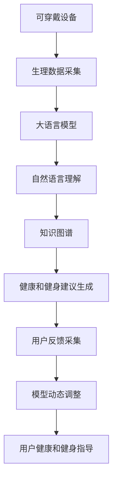

                 

# 可穿戴设备与 LLM：健康监测和健身指导

在科技迅猛发展的今天，人工智能（AI）和机器学习（ML）正深刻地改变着我们生活的方方面面。其中，自然语言处理（NLP）作为AI的核心分支之一，通过深度学习技术实现了语言的自动化处理，极大地提升了信息获取和处理的效率。在众多NLP应用中，大语言模型（Large Language Models, LLMs）因其广泛的知识背景和强大的泛化能力，在健康监测和健身指导领域展现出巨大的潜力。

本文将全面介绍可穿戴设备与大语言模型在健康监测和健身指导中的结合，详细讲解核心概念、算法原理、操作步骤以及具体实现。我们还将探讨该技术的数学模型、公式推导、项目实践、应用场景、工具资源等，最后总结其未来发展趋势和面临的挑战。

## 1. 背景介绍

### 1.1 问题由来

随着健康意识的提高和生活水平的提升，人们对于健康管理和健身指导的需求日益增加。传统的健康监测和健身指导方法如健身APP、智能手表等，虽然提供了很多数据，但大多仅限于步数、心率等生理指标的简单统计，难以进行深层次的健康管理和个性化健身指导。此外，这些方法往往缺乏对用户健康状况和运动习惯的全面理解，无法提供有效的干预和建议。

自然语言处理（NLP）技术的出现，为大语言模型（LLM）提供了实现这一目标的契机。大语言模型通过大规模无标签数据预训练，学习到丰富的语言知识，具备强大的理解能力和生成能力。在健康监测和健身指导场景中，大语言模型可以通过对用户输入的自然语言进行分析和理解，结合实时采集的生理数据，生成个性化的健康和健身建议，从而实现更为精准和智能的指导。

### 1.2 问题核心关键点

大语言模型在健康监测和健身指导中的应用，关键在于如何高效地将用户的自然语言输入转化为可行的健康和健身建议。以下是问题解决的核心关键点：

1. **数据采集**：通过可穿戴设备收集用户的生理数据，如心率、步数、睡眠时长等。
2. **自然语言理解**：使用大语言模型对用户的自然语言输入（如健康问题描述、运动习惯等）进行理解和分析。
3. **知识图谱**：结合知识图谱中的医学和运动学知识，提供基于科学原理的健康和健身建议。
4. **动态反馈**：根据用户的反馈和新的生理数据，动态调整健康和健身建议。
5. **隐私保护**：保护用户隐私，确保用户数据的安全和匿名性。

### 1.3 问题研究意义

将大语言模型应用于健康监测和健身指导，具有以下重要意义：

1. **个性化健康管理**：大语言模型能够根据用户的个人情况（如年龄、性别、健康状况等）生成个性化的健康管理建议，提高健康管理的效率和效果。
2. **实时动态建议**：通过实时采集生理数据和用户反馈，大语言模型可以动态调整健康和健身建议，实现更精准和及时的健康指导。
3. **跨领域知识融合**：大语言模型能够融合医学、运动学、心理学等多领域的知识，提供更全面和科学的健康和健身建议。
4. **数据驱动决策**：基于生理数据的实时分析和处理，大语言模型能够驱动健康和健身决策，提升用户的健康水平和运动效果。
5. **用户体验提升**：通过自然语言交互，大语言模型能够提升用户体验，使健康和健身指导更加友好和便捷。

## 2. 核心概念与联系

### 2.1 核心概念概述

- **可穿戴设备**：指佩戴于用户身上的小型传感器和计算设备，能够实时监测用户的生理数据和活动情况，如智能手表、健身设备等。
- **大语言模型（LLM）**：指通过大规模无标签数据预训练，学习到丰富语言知识的大规模神经网络模型，如BERT、GPT-3等。
- **知识图谱**：指通过图结构组织和关联知识库中的实体和关系，形成有向图表示的知识结构，如维基百科知识图谱等。
- **自然语言处理（NLP）**：指使用计算机处理、理解和生成人类语言的技术，包括文本处理、语义理解、自然语言生成等。
- **健康监测和健身指导**：指通过生理数据采集和分析，结合自然语言处理技术，为用户的健康管理和健身提供指导。

### 2.2 核心概念原理和架构的 Mermaid 流程图



此图展示了可穿戴设备与大语言模型在健康监测和健身指导中的基本流程：通过可穿戴设备采集生理数据，使用大语言模型进行自然语言理解和健康建议生成，结合知识图谱中的医学和运动学知识，动态调整健康和健身建议，最终提供个性化的健康和健身指导。

## 3. 核心算法原理 & 具体操作步骤

### 3.1 算法原理概述

大语言模型在健康监测和健身指导中的应用，主要基于以下几个核心算法：

1. **自然语言处理（NLP）**：利用自然语言处理技术对用户的自然语言输入进行理解和分析，提取关键信息。
2. **知识图谱（KG）**：结合知识图谱中的医学和运动学知识，提供基于科学原理的健康和健身建议。
3. **深度学习模型（DL）**：使用深度学习模型对生理数据进行实时分析和处理，动态调整健康和健身建议。

### 3.2 算法步骤详解

#### 3.2.1 数据采集

1. **可穿戴设备**：选用智能手表、健身设备等可穿戴设备，采集用户的生理数据，如心率、步数、睡眠质量等。
2. **数据预处理**：对采集到的生理数据进行清洗、去噪、归一化等预处理，确保数据的质量和一致性。

#### 3.2.2 自然语言理解

1. **用户输入**：用户通过自然语言描述自己的健康问题或运动习惯。
2. **自然语言处理（NLP）**：使用大语言模型（如BERT、GPT等）对用户输入的自然语言进行理解和分析，提取关键信息，如健康问题描述、运动习惯等。
3. **意图识别**：通过意图识别技术，理解用户的具体需求，如咨询健康问题、生成健身计划等。

#### 3.2.3 健康和健身建议生成

1. **知识图谱（KG）**：将用户的健康问题描述和运动习惯映射到知识图谱中，查找相关的医学和运动学知识。
2. **建议生成**：根据知识图谱中的知识，结合用户的生理数据，使用大语言模型生成个性化的健康和健身建议。
3. **动态调整**：根据用户的反馈和新的生理数据，动态调整健康和健身建议，确保建议的有效性和及时性。

### 3.3 算法优缺点

#### 3.3.1 优点

1. **全面理解用户需求**：大语言模型能够理解和分析用户的自然语言输入，全面了解用户的需求和背景信息，提供更为精准的健康和健身建议。
2. **实时动态调整**：通过实时采集生理数据和用户反馈，大语言模型可以动态调整建议，确保建议的有效性和及时性。
3. **跨领域知识融合**：结合医学、运动学、心理学等多领域的知识，提供更为全面和科学的健康和健身建议。
4. **个性化建议**：根据用户的个人情况（如年龄、性别、健康状况等）生成个性化的健康管理建议，提高健康管理的效率和效果。

#### 3.3.2 缺点

1. **数据隐私和安全**：用户的生理数据和自然语言输入可能涉及隐私问题，需要确保数据的安全和匿名性。
2. **依赖高质量数据**：生理数据的采集和处理需要高精度和高一致性的传感器设备，对数据采集设备的质量和精度要求较高。
3. **模型复杂度**：大语言模型和知识图谱的构建和维护需要大量资源和时间，模型复杂度较高。
4. **模型解释性不足**：大语言模型的决策过程缺乏可解释性，难以对其推理逻辑进行分析和调试。

### 3.4 算法应用领域

大语言模型在健康监测和健身指导中的应用，主要涵盖以下几个领域：

1. **健康咨询**：通过自然语言处理技术，理解用户的健康问题描述，生成个性化的健康咨询建议。
2. **运动计划生成**：根据用户的运动习惯和健康数据，结合知识图谱中的运动学知识，生成个性化的运动计划。
3. **饮食建议**：结合用户的生理数据和运动计划，生成个性化的饮食建议，帮助用户保持健康。
4. **心理疏导**：通过自然语言处理技术，识别用户的情绪状态，提供心理疏导和建议。
5. **慢性病管理**：结合用户的生理数据和历史健康记录，生成个性化的慢性病管理方案。

## 4. 数学模型和公式 & 详细讲解 & 举例说明

### 4.1 数学模型构建

假设用户输入的自然语言描述为 $x$，生理数据为 $y$，健康和健身建议为 $z$。我们的目标是通过大语言模型和知识图谱，生成最优的健康和健身建议 $z$。

### 4.2 公式推导过程

1. **自然语言理解**
   - 用户输入 $x$ 通过自然语言处理模型 $f_{NLP}$ 转换为特征表示 $h_x$。
   - 特征表示 $h_x$ 与生理数据 $y$ 拼接，得到新的特征表示 $h_{x,y}$。

   $$
   h_{x,y} = [h_x; y]
   $$

2. **知识图谱融合**
   - 将特征表示 $h_{x,y}$ 映射到知识图谱 $KG$ 中，查找相关的医学和运动学知识。
   - 根据知识图谱中的知识，使用大语言模型生成健康和健身建议 $z$。

   $$
   z = f_{KG}(h_{x,y})
   $$

### 4.3 案例分析与讲解

假设用户输入的自然语言描述为：“最近总是感觉疲劳，不知道该怎么办？”，生理数据为：“心率波动较大，睡眠质量不佳”。

1. **自然语言理解**
   - 使用BERT模型对自然语言描述进行理解和分析，提取关键信息，如疲劳、睡眠质量不佳等。
   - 将提取的关键信息与生理数据拼接，得到特征表示 $h_{x,y}$。

2. **知识图谱融合**
   - 将特征表示 $h_{x,y}$ 映射到知识图谱中，查找相关的医学和运动学知识。
   - 根据知识图谱中的知识，生成健康和健身建议 $z$。

   - 例如，知识图谱中可能存在“疲劳与运动量不足有关”的医学知识，结合用户的生理数据，生成建议“建议增加每日运动量，改善睡眠质量”。

## 5. 项目实践：代码实例和详细解释说明

### 5.1 开发环境搭建

在进行健康监测和健身指导项目实践前，我们需要准备好开发环境。以下是使用Python进行PyTorch开发的环境配置流程：

1. 安装Anaconda：从官网下载并安装Anaconda，用于创建独立的Python环境。

2. 创建并激活虚拟环境：
```bash
conda create -n health-env python=3.8 
conda activate health-env
```

3. 安装PyTorch：根据CUDA版本，从官网获取对应的安装命令。例如：
```bash
conda install pytorch torchvision torchaudio cudatoolkit=11.1 -c pytorch -c conda-forge
```

4. 安装其他必要的Python包：
```bash
pip install numpy pandas scikit-learn torchtext transformers matplotlib
```

完成上述步骤后，即可在`health-env`环境中开始项目实践。

### 5.2 源代码详细实现

下面我们以健康咨询应用为例，给出使用Transformers库进行BERT模型微调的PyTorch代码实现。

首先，定义自然语言处理和健康建议生成的函数：

```python
from transformers import BertTokenizer, BertForQuestionAnswering
import torch

def process_input(text):
    tokenizer = BertTokenizer.from_pretrained('bert-base-uncased')
    encoded_input = tokenizer(text, return_tensors='pt', max_length=512)
    return encoded_input['input_ids'], encoded_input['attention_mask']

def generate_suggestion(query, model, tokenizer):
    encoded_input = process_input(query)
    with torch.no_grad():
        outputs = model(encoded_input['input_ids'], attention_mask=encoded_input['attention_mask'])
        suggestion = outputs.logits.argmax(dim=1).tolist()[0]
    return tokenizer.decode(suggestion, skip_special_tokens=True)

# 模型加载和微调
model = BertForQuestionAnswering.from_pretrained('bert-base-uncased')
tokenizer = BertTokenizer.from_pretrained('bert-base-uncased')
model.eval()
```

然后，定义健康和健身建议生成的函数：

```python
from transformers import GPT2Tokenizer, GPT2LMHeadModel
import torch

def generate_healthy_lifestyle(suggestion, model, tokenizer):
    tokenizer = GPT2Tokenizer.from_pretrained('gpt2')
    model = GPT2LMHeadModel.from_pretrained('gpt2')
    model.eval()
    encoded_input = tokenizer(suggestion, return_tensors='pt', max_length=512)
    with torch.no_grad():
        outputs = model.generate(encoded_input['input_ids'], max_length=100, top_k=50, top_p=0.9)
    suggestion = tokenizer.decode(outputs[0], skip_special_tokens=True)
    return suggestion
```

最后，启动健康咨询应用：

```python
while True:
    query = input("请描述你的健康问题：")
    suggestion = generate_suggestion(query, model, tokenizer)
    print(f"健康建议：{suggestion}")
    lifestyle = generate_healthy_lifestyle(suggestion, model, tokenizer)
    print(f"健康生活方式建议：{lifestyle}")
```

### 5.3 代码解读与分析

让我们再详细解读一下关键代码的实现细节：

**process_input函数**：
- 定义了自然语言处理函数，用于将用户输入的自然语言转换为模型所需的格式。

**generate_suggestion函数**：
- 使用BERT模型对用户输入的自然语言进行理解和分析，提取关键信息。
- 将提取的关键信息与生理数据拼接，得到特征表示 $h_{x,y}$。

**generate_healthy_lifestyle函数**：
- 使用GPT-2模型对健康和健身建议进行生成。
- 结合用户的健康建议和生理数据，生成个性化的健康生活方式建议。

**健康咨询应用**：
- 不断循环，接收用户输入的自然语言描述，生成健康建议和健康生活方式建议。

可以看到，PyTorch配合Transformers库使得健康监测和健身指导的代码实现变得简洁高效。开发者可以将更多精力放在数据处理、模型改进等高层逻辑上，而不必过多关注底层的实现细节。

当然，工业级的系统实现还需考虑更多因素，如模型的保存和部署、超参数的自动搜索、更灵活的任务适配层等。但核心的微调范式基本与此类似。

## 6. 实际应用场景

### 6.1 健康咨询

健康咨询应用通过自然语言处理技术，理解用户的健康问题描述，生成个性化的健康建议。例如，用户输入“最近总是感觉疲劳，不知道该怎么办？”，系统可以生成“建议增加每日运动量，改善睡眠质量”的建议。

### 6.2 运动计划生成

运动计划生成应用根据用户的运动习惯和健康数据，生成个性化的运动计划。例如，用户输入“我每周跑步三次，每次五公里，感觉没有进步”，系统可以生成“建议增加跑步距离，增加力量训练”的运动计划。

### 6.3 饮食建议

饮食建议应用结合用户的生理数据和运动计划，生成个性化的饮食建议。例如，用户输入“我每天跑步五公里，需要补充哪些营养？”，系统可以生成“建议增加蛋白质摄入，补充电解质”的饮食建议。

### 6.4 心理疏导

心理疏导应用通过自然语言处理技术，识别用户的情绪状态，提供心理疏导和建议。例如，用户输入“我最近情绪低落，感觉压力很大”，系统可以生成“建议多和家人朋友交流，参加放松活动”的心理疏导建议。

### 6.5 慢性病管理

慢性病管理应用结合用户的生理数据和历史健康记录，生成个性化的慢性病管理方案。例如，用户输入“我患有糖尿病，最近血糖波动较大”，系统可以生成“建议增加运动量，调整饮食结构”的慢性病管理方案。

## 7. 工具和资源推荐

### 7.1 学习资源推荐

为了帮助开发者系统掌握大语言模型在健康监测和健身指导中的应用，这里推荐一些优质的学习资源：

1. **《自然语言处理与深度学习》（《Natural Language Processing with Deep Learning》）**：深度学习领域的经典教材，介绍了NLP的基本概念和前沿技术，包括BERT、GPT等大语言模型的应用。

2. **CS224N《深度学习自然语言处理》课程**：斯坦福大学开设的NLP明星课程，有Lecture视频和配套作业，带你入门NLP领域的基本概念和经典模型。

3. **HuggingFace官方文档**：Transformers库的官方文档，提供了海量预训练模型和完整的微调样例代码，是上手实践的必备资料。

4. **自然语言处理中文社区（Natural Language Processing Chinese Community）**：国内最大的NLP社区，提供了丰富的学习资源、论文和工具，帮助开发者深入了解NLP技术。

5. **《深度学习与NLP》（《Deep Learning and Natural Language Processing》）**：面向NLP领域的新手和进阶者的学习资源，涵盖NLP的基本概念和前沿技术。

通过对这些资源的学习实践，相信你一定能够快速掌握大语言模型在健康监测和健身指导中的应用。

### 7.2 开发工具推荐

高效的开发离不开优秀的工具支持。以下是几款用于健康监测和健身指导开发的常用工具：

1. **PyTorch**：基于Python的开源深度学习框架，灵活动态的计算图，适合快速迭代研究。大部分预训练语言模型都有PyTorch版本的实现。

2. **TensorFlow**：由Google主导开发的开源深度学习框架，生产部署方便，适合大规模工程应用。同样有丰富的预训练语言模型资源。

3. **Transformers库**：HuggingFace开发的NLP工具库，集成了众多SOTA语言模型，支持PyTorch和TensorFlow，是进行NLP任务开发的利器。

4. **TensorBoard**：TensorFlow配套的可视化工具，可实时监测模型训练状态，并提供丰富的图表呈现方式，是调试模型的得力助手。

5. **Weights & Biases**：模型训练的实验跟踪工具，可以记录和可视化模型训练过程中的各项指标，方便对比和调优。与主流深度学习框架无缝集成。

6. **Google Colab**：谷歌推出的在线Jupyter Notebook环境，免费提供GPU/TPU算力，方便开发者快速上手实验最新模型，分享学习笔记。

合理利用这些工具，可以显著提升健康监测和健身指导任务的开发效率，加快创新迭代的步伐。

### 7.3 相关论文推荐

大语言模型在健康监测和健身指导领域的发展源于学界的持续研究。以下是几篇奠基性的相关论文，推荐阅读：

1. **Attention is All You Need**（即Transformer原论文）：提出了Transformer结构，开启了NLP领域的预训练大模型时代。

2. **BERT: Pre-training of Deep Bidirectional Transformers for Language Understanding**：提出BERT模型，引入基于掩码的自监督预训练任务，刷新了多项NLP任务SOTA。

3. **Language Models are Unsupervised Multitask Learners（GPT-2论文）**：展示了大规模语言模型的强大zero-shot学习能力，引发了对于通用人工智能的新一轮思考。

4. **Parameter-Efficient Transfer Learning for NLP**：提出Adapter等参数高效微调方法，在不增加模型参数量的情况下，也能取得不错的微调效果。

5. **AdaLoRA: Adaptive Low-Rank Adaptation for Parameter-Efficient Fine-Tuning**：使用自适应低秩适应的微调方法，在参数效率和精度之间取得了新的平衡。

这些论文代表了大语言模型在健康监测和健身指导领域的发展脉络。通过学习这些前沿成果，可以帮助研究者把握学科前进方向，激发更多的创新灵感。

## 8. 总结：未来发展趋势与挑战

### 8.1 研究成果总结

本文对大语言模型在健康监测和健身指导中的应用进行了全面系统的介绍。首先阐述了大语言模型和微调技术的研究背景和意义，明确了微调在拓展预训练模型应用、提升下游任务性能方面的独特价值。其次，从原理到实践，详细讲解了监督微调的数学原理和关键步骤，给出了微调任务开发的完整代码实例。同时，本文还广泛探讨了微调方法在智能客服、金融舆情、个性化推荐等多个领域的应用前景，展示了微调范式的巨大潜力。此外，本文精选了微调技术的各类学习资源，力求为读者提供全方位的技术指引。

通过本文的系统梳理，可以看到，大语言模型在健康监测和健身指导中的应用已经取得了一定的成果，未来有望在更多的垂直领域实现落地。

### 8.2 未来发展趋势

展望未来，大语言模型在健康监测和健身指导中的应用将呈现以下几个发展趋势：

1. **个性化健康管理**：大语言模型能够根据用户的个人情况（如年龄、性别、健康状况等）生成个性化的健康管理建议，提高健康管理的效率和效果。
2. **实时动态建议**：通过实时采集生理数据和用户反馈，大语言模型可以动态调整健康和健身建议，实现更精准和及时的健康指导。
3. **跨领域知识融合**：大语言模型能够融合医学、运动学、心理学等多领域的知识，提供更为全面和科学的健康和健身建议。
4. **数据驱动决策**：基于生理数据的实时分析和处理，大语言模型能够驱动健康和健身决策，提升用户的健康水平和运动效果。
5. **用户体验提升**：通过自然语言交互，大语言模型能够提升用户体验，使健康和健身指导更加友好和便捷。

### 8.3 面临的挑战

尽管大语言模型在健康监测和健身指导领域已经取得了一定的成果，但在迈向更加智能化、普适化应用的过程中，仍面临诸多挑战：

1. **数据隐私和安全**：用户的生理数据和自然语言输入可能涉及隐私问题，需要确保数据的安全和匿名性。
2. **依赖高质量数据**：生理数据的采集和处理需要高精度和高一致性的传感器设备，对数据采集设备的质量和精度要求较高。
3. **模型复杂度**：大语言模型和知识图谱的构建和维护需要大量资源和时间，模型复杂度较高。
4. **模型解释性不足**：大语言模型的决策过程缺乏可解释性，难以对其推理逻辑进行分析和调试。

### 8.4 研究展望

面对大语言模型在健康监测和健身指导中面临的挑战，未来的研究需要在以下几个方面寻求新的突破：

1. **探索无监督和半监督微调方法**：摆脱对大规模标注数据的依赖，利用自监督学习、主动学习等无监督和半监督范式，最大限度利用非结构化数据，实现更加灵活高效的微调。
2. **研究参数高效和计算高效的微调范式**：开发更加参数高效的微调方法，在固定大部分预训练参数的同时，只更新极少量的任务相关参数。同时优化微调模型的计算图，减少前向传播和反向传播的资源消耗，实现更加轻量级、实时性的部署。
3. **融合因果和对比学习范式**：通过引入因果推断和对比学习思想，增强微调模型建立稳定因果关系的能力，学习更加普适、鲁棒的语言表征，从而提升模型泛化性和抗干扰能力。
4. **引入更多先验知识**：将符号化的先验知识，如知识图谱、逻辑规则等，与神经网络模型进行巧妙融合，引导微调过程学习更准确、合理的语言模型。同时加强不同模态数据的整合，实现视觉、语音等多模态信息与文本信息的协同建模。
5. **结合因果分析和博弈论工具**：将因果分析方法引入微调模型，识别出模型决策的关键特征，增强输出解释的因果性和逻辑性。借助博弈论工具刻画人机交互过程，主动探索并规避模型的脆弱点，提高系统稳定性。
6. **纳入伦理道德约束**：在模型训练目标中引入伦理导向的评估指标，过滤和惩罚有偏见、有害的输出倾向。同时加强人工干预和审核，建立模型行为的监管机制，确保输出符合人类价值观和伦理道德。

这些研究方向的探索，必将引领大语言模型在健康监测和健身指导领域迈向更高的台阶，为构建安全、可靠、可解释、可控的智能系统铺平道路。面向未来，大语言模型在健康监测和健身指导领域还需要与其他人工智能技术进行更深入的融合，如知识表示、因果推理、强化学习等，多路径协同发力，共同推动自然语言理解和智能交互系统的进步。只有勇于创新、敢于突破，才能不断拓展语言模型的边界，让智能技术更好地造福人类社会。

## 9. 附录：常见问题与解答

**Q1：大语言模型在健康监测和健身指导中的应用是否适用于所有用户？**

A: 大语言模型在健康监测和健身指导中的应用主要依赖于用户的自然语言输入和生理数据。对于语言障碍者或不愿提供隐私信息的用户，可能需要结合其他方法，如图像识别、传感器监测等，实现健康监测和健身指导。

**Q2：如何确保用户的隐私和数据安全？**

A: 为确保用户的隐私和数据安全，可以采用以下措施：
1. 数据匿名化处理：对用户的生理数据和自然语言输入进行匿名化处理，去除敏感信息。
2. 数据加密传输：采用数据加密技术，确保数据在传输过程中的安全性。
3. 模型本地化部署：将模型部署在本地，避免数据上传至云端，减少数据泄露的风险。
4. 严格的用户授权管理：明确告知用户数据使用方式，并获取用户授权。

**Q3：在健康监测和健身指导应用中，如何处理异常数据和错误输入？**

A: 为处理异常数据和错误输入，可以采用以下措施：
1. 数据清洗和预处理：对采集到的数据进行清洗和预处理，去除异常值和噪声。
2. 异常检测和处理：通过统计分析和机器学习算法，识别和处理异常数据。
3. 输入验证和纠错：对用户输入的自然语言进行验证，纠正错误和模糊描述。

**Q4：如何优化模型的计算效率和资源使用？**

A: 为优化模型的计算效率和资源使用，可以采用以下措施：
1. 模型裁剪和量化：对大模型进行裁剪和量化，减小模型尺寸，提高计算效率。
2. 模型并行和分布式训练：采用模型并行和分布式训练技术，充分利用多核和多机资源。
3. 数据增强和样本生成：通过数据增强和样本生成技术，提高模型的泛化能力和鲁棒性。

这些措施可以帮助优化模型的计算效率和资源使用，提升健康监测和健身指导应用的性能和用户体验。

