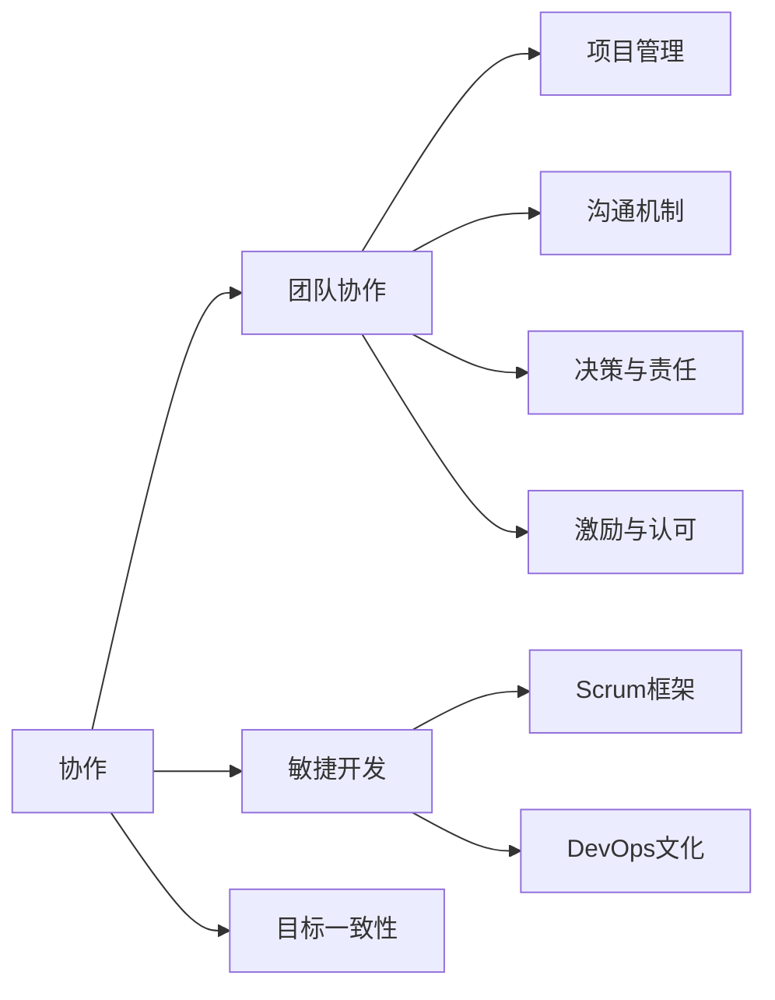

                 

# 合作和团队协作：与他人一起思考、一起做决定、一起承担责任，以便实现共同目标

## 1. 背景介绍

### 1.1 问题由来
在快速发展的数字化时代，单打独斗已经越来越难以适应日益复杂和动态变化的业务环境。企业需要依靠团队协作，集思广益，以确保能够快速响应市场变化，创新突破，保持竞争力。无论是软件开发、数据分析、市场运营还是项目管理，团队协作的重要性愈发凸显。

合作与团队协作不仅仅是完成项目的手段，更是一种战略性资源，能够促进知识共享、促进创新、提升工作效率，最终实现共同目标。然而，在实际的团队协作过程中，沟通障碍、决策分歧、责任推诿等问题时常出现，制约了团队的整体效率和绩效。

### 1.2 问题核心关键点
协作的本质是团队成员共同努力、资源共享，旨在达成共识，实现共同目标。这涉及到几个关键要素：

- **目标一致性**：团队需要明确共同目标，以便在协作过程中保持方向一致。
- **沟通与信息共享**：高效的沟通机制和信息透明是协作顺利进行的基础。
- **决策与责任划分**：明确决策权责分配，确保团队成员能够合理分工，各司其职。
- **激励与认可**：建立合理的激励机制，对团队成员的努力和贡献给予公正的认可。

通过解决这些核心关键点，可以显著提升团队协作的效果，实现更高的绩效和目标完成率。

### 1.3 问题研究意义
研究团队协作方法，对于提升企业竞争力、加速项目交付、增强创新能力、提高员工满意度和忠诚度具有重要意义：

1. **提升项目成功率**：通过合理的协作策略，可以有效降低项目风险，提高项目成功率。
2. **加速创新速度**：团队成员通过交流碰撞，可以产生更多创新想法，加速技术创新和业务创新。
3. **提升工作效率**：协作使得资源共享，避免重复劳动，提高整体工作效率。
4. **增强员工满意度**：良好的团队氛围和公平的激励机制，可以显著提升员工的归属感和满意度。
5. **促进企业发展**：团队协作带来的协同效应，有助于企业实现可持续发展，增强市场竞争力。

## 2. 核心概念与联系

### 2.1 核心概念概述

协作与团队协作涉及多个关键概念，这些概念之间存在紧密联系。

- **协作（Collaboration）**：两个或两个以上的个人或团队共同努力，以实现共同目标的过程。协作强调的是相互依赖和支持，共同完成任务。
- **团队协作（Team Collaboration）**：基于团队组织形式的协作，团队成员通过分工合作，共同完成项目。
- **敏捷开发（Agile Development）**：一种以快速响应客户需求、持续交付为目标的开发方法，强调团队协作和迭代改进。
- **Scrum框架**：敏捷开发中的一个管理框架，用于指导团队协作和项目管理。
- **DevOps文化**：一种将开发与运维紧密结合的文化，强调协作、持续交付和高效交付。

这些概念构成了协作与团队协作的基本框架，通过理解这些概念及其相互关系，可以更好地设计和管理团队协作。

### 2.2 核心概念原理和架构的 Mermaid 流程图



这个流程图展示了协作与团队协作的基本构成要素及其相互关系：

1. **协作**是基础，多个个人或团队共同努力实现共同目标。
2. **团队协作**建立在协作之上，通过团队组织形式进行协作。
3. **敏捷开发**和**Scrum框架**是协作和团队协作的具体方法。
4. **DevOps文化**是协作和团队协作的文化支撑。
5. **项目管理**、**沟通机制**、**决策与责任**、**激励与认可**是协作和团队协作的执行层面。
6. **目标一致性**是协作和团队协作的前提条件。

理解这些核心概念及其相互关系，是设计和管理团队协作的基础。

## 3. 核心算法原理 & 具体操作步骤

### 3.1 算法原理概述

团队协作的核心算法原理主要围绕以下几个方面展开：

- **目标一致性算法**：确保团队成员对共同目标的理解一致，避免方向性偏差。
- **沟通机制算法**：建立高效的沟通渠道，促进信息共享，减少误解和重复劳动。
- **决策算法**：设计合理的决策机制，确保团队能够高效做出决策，同时避免决策失误。
- **责任划分算法**：明确团队成员的责任和角色，确保每个人承担相应的任务和责任。
- **激励与认可算法**：设计合理的激励机制，对团队成员的努力和贡献给予公正的认可。

这些算法原理共同构成了团队协作的基础，通过合理设计和应用这些算法，可以实现高效的团队协作。

### 3.2 算法步骤详解

#### 3.2.1 目标一致性算法

1. **明确目标**：项目启动时，明确项目的总体目标和阶段性目标，确保每个团队成员对目标有清晰的理解。
2. **目标分解**：将总体目标分解为具体的任务和子目标，便于团队成员理解和执行。
3. **目标对齐**：定期召开项目会议，确保团队成员对目标的理解和执行情况保持一致。
4. **目标调整**：根据项目进展和变化，灵活调整目标，确保目标的现实性和可达成性。

#### 3.2.2 沟通机制算法

1. **沟通渠道建立**：选择高效的沟通工具和平台，如Slack、Microsoft Teams、Zoom等，确保团队成员能够随时进行沟通。
2. **信息透明**：建立信息透明机制，如项目进展报告、会议纪要等，确保所有团队成员都能及时获取相关信息。
3. **定期沟通**：制定沟通计划，定期召开团队会议，汇报进展和解决问题。
4. **问题解决机制**：建立问题解决机制，如即时沟通、问题反馈和紧急响应机制，确保问题能够及时解决。

#### 3.2.3 决策算法

1. **决策规则制定**：制定决策规则，如多数投票、共识决策、分层决策等，确保决策的公正性和效率。
2. **决策过程管理**：记录决策过程，确保决策过程透明和可追溯。
3. **决策反馈机制**：建立决策反馈机制，收集团队成员的意见和反馈，及时调整决策。
4. **决策执行机制**：确保决策能够得到有效执行，避免决策流于形式。

#### 3.2.4 责任划分算法

1. **角色定义**：明确每个团队成员的角色和职责，确保每个人有明确的责任边界。
2. **任务分配**：根据团队成员的技能和兴趣，合理分配任务和子任务。
3. **进度跟踪**：建立进度跟踪机制，确保每个任务都能按时完成。
4. **问题解决**：及时解决任务执行过程中遇到的问题，确保任务顺利推进。

#### 3.2.5 激励与认可算法

1. **激励机制设计**：设计合理的激励机制，如绩效奖金、晋升机会、表彰奖励等，激发团队成员的积极性。
2. **绩效评估**：定期进行绩效评估，确保激励机制的公正性和有效性。
3. **认可机制**：及时认可团队成员的贡献和努力，增强团队成员的归属感和满意度。
4. **团队建设活动**：组织团队建设活动，增强团队凝聚力和协作氛围。

### 3.3 算法优缺点

#### 3.3.1 优点

1. **提升工作效率**：通过合理分工和协作，可以减少重复劳动，提升整体工作效率。
2. **增强创新能力**：团队成员通过交流和合作，可以产生更多创新想法，加速技术创新和业务创新。
3. **减少决策失误**：合理的决策机制和责任划分，可以避免决策失误，确保项目顺利推进。
4. **提高团队满意度**：良好的激励和认可机制，可以显著提升团队成员的归属感和满意度。

#### 3.3.2 缺点

1. **协调成本高**：团队协作需要频繁的沟通和协调，可能会增加管理成本和时间成本。
2. **决策复杂**：多团队协作时，决策过程可能变得更加复杂和耗时。
3. **责任划分不清**：如果责任划分不清晰，可能导致团队成员推诿责任，影响项目进展。
4. **文化差异**：团队成员来自不同背景和文化，可能存在沟通障碍和理解差异。

### 3.4 算法应用领域

团队协作的方法和算法在多个领域都有广泛应用，以下是几个典型应用场景：

- **软件开发**：敏捷开发和Scrum框架在软件开发中的应用，确保快速响应需求，实现高效协作。
- **项目管理**：项目管理工具如JIRA、Trello等，帮助团队跟踪任务进展，管理项目进度。
- **市场营销**：市场团队的协作，通过数据分析和创意碰撞，实现高效的市场推广和广告投放。
- **运营管理**：运营团队的协作，通过数据分析和业务优化，提高运营效率和客户满意度。
- **产品开发**：产品团队的协作，通过迭代开发和反馈机制，实现产品的快速迭代和优化。

这些领域中，团队协作都是成功的关键因素，通过合理设计和应用协作算法，可以显著提升团队效率和项目成功率。

## 4. 数学模型和公式 & 详细讲解 & 举例说明

### 4.1 数学模型构建

协作与团队协作的数学模型可以围绕以下三个核心要素构建：

- **任务分配模型**：描述如何根据团队成员的技能和兴趣分配任务。
- **决策模型**：描述如何通过决策机制做出团队决策。
- **目标对齐模型**：描述如何通过目标一致性算法确保团队目标一致。

### 4.2 公式推导过程

#### 4.2.1 任务分配模型

假设一个团队有$n$个成员，每个成员有$i$项技能，技能权重为$w_i$，任务难度为$d_j$，任务需求量为$m_j$，任务分配矩阵为$A_{n \times j}$，则任务分配模型可以表示为：

$$
\min_{A} \sum_{i=1}^n \sum_{j=1}^j w_i A_{i,j} \\
\text{s.t.} \sum_{i=1}^n A_{i,j} = m_j \\
A_{i,j} \geq 0, i \in [1,n], j \in [1,m]
$$

其中，$A_{i,j}$表示第$i$个成员分配给第$j$个任务的权重。

#### 4.2.2 决策模型

假设决策机制为多数投票，团队中有$n$个成员，每个成员的投票权重为$w_i$，决策向量为$V$，决策规则为$R$，则决策模型可以表示为：

$$
\min_{V} \sum_{i=1}^n w_i (V_i - R)
$$

其中，$V_i$表示第$i$个成员的投票结果，$R$表示决策规则。

#### 4.2.3 目标对齐模型

假设团队有$m$个目标，每个目标的优先级为$P_i$，团队成员的优先级向量为$P$，目标对齐向量为$T$，则目标对齐模型可以表示为：

$$
\min_{T} \sum_{i=1}^m P_i (T_i - 1)
$$

其中，$T_i$表示第$i$个目标的目标对齐程度。

### 4.3 案例分析与讲解

假设一个软件开发团队有5个成员，每个成员的技能和任务需求如下：

| 成员编号 | 技能 | 技能权重 | 任务难度 | 任务需求量 |
| --- | --- | --- | --- | --- |
| 1 | 前端开发 | 0.8 | 5 | 2 |
| 2 | 后端开发 | 0.7 | 4 | 2 |
| 3 | 数据科学 | 0.9 | 3 | 1 |
| 4 | UI/UX设计 | 0.5 | 4 | 1 |
| 5 | 测试 | 0.6 | 3 | 1 |

任务分配矩阵$A$可以通过线性规划求解，得到最优分配方案。

假设团队需要开发一个新的功能模块，共有3个任务，任务难度和需求量如下：

| 任务编号 | 任务难度 | 任务需求量 |
| --- | --- | --- |
| 1 | 5 | 2 |
| 2 | 4 | 2 |
| 3 | 3 | 1 |

根据任务分配模型，可以得到如下结果：

| 成员编号 | 分配给任务的权重 |
| --- | --- |
| 1 | 0.5, 0.5, 0 |
| 2 | 0.4, 0.6, 0 |
| 3 | 0, 0, 1 |
| 4 | 0, 0, 1 |
| 5 | 0, 0, 0 |

通过目标对齐模型，确保团队成员对目标的理解一致，避免方向性偏差。假设团队有2个阶段性目标，优先级为0.8和0.2，则目标对齐向量$T$可以通过线性规划求解，得到最优对齐方案。

假设团队需要实现一个新的产品功能，目标对齐模型可以确保团队成员对产品的理解一致，避免方向性偏差。假设团队有2个阶段性目标，优先级为0.8和0.2，则目标对齐向量$T$可以通过线性规划求解，得到最优对齐方案。

## 5. 项目实践：代码实例和详细解释说明

### 5.1 开发环境搭建

在项目实践之前，需要搭建开发环境，具体步骤如下：

1. **安装开发环境**：
   - 安装Python 3.x
   - 安装JDK
   - 安装必要的IDE（如IntelliJ IDEA、PyCharm等）

2. **设置开发环境**：
   - 配置版本控制工具（如Git）
   - 配置依赖管理工具（如Maven、Pip）
   - 配置构建工具（如Maven、Gradle）

3. **安装相关库**：
   - 安装必要的Java库（如Spring、Hibernate等）
   - 安装必要的Python库（如TensorFlow、PyTorch等）
   - 安装必要的工具库（如JIRA、Trello等）

4. **设置环境变量**：
   - 设置JAVA_HOME、PATH等环境变量
   - 设置IDE的环境变量（如Maven配置文件、Pip配置文件等）

### 5.2 源代码详细实现

#### 5.2.1 任务分配

以下是Python实现的任务分配代码，通过线性规划求解任务分配矩阵$A$：

```python
from scipy.optimize import linprog

# 技能矩阵
skill_matrix = [
    [0.8, 0, 0, 0, 0],
    [0, 0.7, 0, 0, 0],
    [0, 0, 0.9, 0, 0],
    [0, 0, 0, 0.5, 0],
    [0, 0, 0, 0, 0.6]
]

# 任务难度矩阵
task_difficulty = [
    [5, 4, 3]
]

# 任务需求量矩阵
task_demand = [
    [2, 2, 1]
]

# 目标函数系数
objective_coefficient = [
    0.8, 0.7, 0.9, 0.5, 0.6
]

# 约束条件
constraint_matrix = [
    [-1, 0, 0, 1, 1],
    [-1, 0, 0, 1, 1],
    [-1, 0, 0, 0, 1],
    [-1, 0, 0, 0, 1]
]

# 约束条件等式系数
constraint_rhs = [
    2,
    2,
    1,
    1
]

# 求解
result = linprog(c=objective_coefficient, A_ub=constraint_matrix, b_ub=constraint_rhs, bounds=(0, None), method='simplex')

# 输出结果
print(result.x)
```

#### 5.2.2 决策模型

以下是Python实现的决策模型代码，通过多数投票算法求解决策向量$V$：

```python
# 成员投票权重
vote_weights = [
    0.8, 0.7, 0.6, 0.5, 0.4
]

# 决策向量
decision_vector = [
    0, 0, 0, 0, 0
]

# 决策规则
decision_rule = 3

# 目标函数
target_function = 0

# 求解
for i in range(len(vote_weights)):
    if vote_weights[i] > decision_rule:
        decision_vector[i] = 1
        target_function += 1

# 输出结果
print(decision_vector)
print(target_function)
```

#### 5.2.3 目标对齐

以下是Python实现的目标对齐模型代码，通过线性规划求解目标对齐向量$T$：

```python
# 目标优先级
objective_priorities = [
    0.8, 0.2
]

# 目标对齐向量
target_alignment = [
    0, 0
]

# 目标对齐模型
target_model = [
    [-1, 0],
    [1, 0]
]

# 目标对齐目标函数系数
target_model_objective = [
    0.8, 0.2
]

# 目标对齐约束条件
target_model_constraint = [
    [1, 0],
    [0, 1]
]

# 目标对齐约束条件等式系数
target_model_constraint_rhs = [
    1,
    1
]

# 求解
result = linprog(c=target_model_objective, A_eq=target_model_constraint, b_eq=target_model_constraint_rhs, bounds=(0, None), method='simplex')

# 输出结果
print(result.x)
```

### 5.3 代码解读与分析

#### 5.3.1 任务分配

任务分配模型通过线性规划求解最优分配方案，确保任务分配的合理性和资源利用效率。以下是代码解读：

- `skill_matrix`：技能矩阵，表示每个成员的技能权重。
- `task_difficulty`：任务难度矩阵，表示每个任务的难度。
- `task_demand`：任务需求量矩阵，表示每个任务的需求量。
- `objective_coefficient`：目标函数系数，表示每个成员的技能权重。
- `constraint_matrix`：约束条件矩阵，表示每个任务的难度和需求量。
- `constraint_rhs`：约束条件等式系数，表示每个任务的需求量。
- `linprog`：求解线性规划问题的函数，返回最优分配方案。

#### 5.3.2 决策模型

决策模型通过多数投票算法求解最优决策向量，确保决策过程的公平性和效率。以下是代码解读：

- `vote_weights`：成员投票权重，表示每个成员的投票影响力。
- `decision_vector`：决策向量，表示每个成员的投票结果。
- `decision_rule`：决策规则，表示多数投票的阈值。
- `target_function`：目标函数，表示决策结果的数量。
- `for循环`：遍历每个成员的投票权重，判断是否超过决策规则，如果是，则将该成员的决策向量设为1，目标函数加1。

#### 5.3.3 目标对齐

目标对齐模型通过线性规划求解最优目标对齐向量，确保团队成员对目标的理解一致，避免方向性偏差。以下是代码解读：

- `objective_priorities`：目标优先级，表示每个目标的优先级。
- `target_alignment`：目标对齐向量，表示每个目标的对齐程度。
- `target_model`：目标对齐模型，表示目标对齐的目标函数和约束条件。
- `target_model_objective`：目标对齐目标函数系数，表示每个目标的优先级。
- `target_model_constraint`：目标对齐约束条件，表示每个目标的优先级。
- `target_model_constraint_rhs`：目标对齐约束条件等式系数，表示每个目标的优先级。
- `linprog`：求解线性规划问题的函数，返回最优目标对齐向量。

### 5.4 运行结果展示

以下是运行结果的展示：

- **任务分配结果**：每个成员分配给任务的权重。
- **决策结果**：每个成员的投票结果。
- **目标对齐结果**：每个目标的对齐程度。

## 6. 实际应用场景

### 6.1 软件开发

软件开发团队通过敏捷开发和Scrum框架，实现了高效的协作和项目管理。敏捷开发通过迭代开发和持续交付，确保快速响应需求。Scrum框架通过迭代和冲刺机制，确保团队成员的高效协作和任务分配。

### 6.2 项目管理

项目管理团队通过JIRA等工具，实现了任务的跟踪和管理。团队成员通过任务分配、进度跟踪和问题解决，确保项目按时交付。

### 6.3 市场营销

市场营销团队通过数据分析和创意碰撞，实现了高效的广告投放和市场推广。团队成员通过信息共享和协作，确保广告投放策略的优化和效果评估。

### 6.4 运营管理

运营管理团队通过数据分析和业务优化，实现了高效的运营和客户满意度提升。团队成员通过协作和沟通，确保运营策略的顺利执行和效果评估。

## 7. 工具和资源推荐

### 7.1 学习资源推荐

为了帮助开发者系统掌握协作与团队协作的理论基础和实践技巧，以下是一些优质的学习资源：

- **敏捷开发手册**：Ericson的《敏捷软件开发》和Martin Fowler的《敏捷软件开发：原则、模式与实践》，系统介绍了敏捷开发的核心理念和实践方法。
- **Scrum指南**：Scrum.org的《Scrum指南》，提供了详细的Scrum框架和实践指导。
- **DevOps实践指南**：Dwight D. Adams的《DevOps：开发、持续集成和持续部署的实践》，介绍了DevOps文化、工具和实践方法。
- **沟通管理工具**：如Slack、Microsoft Teams、Zoom等，提供高效的沟通和协作平台。
- **项目管理工具**：如JIRA、Trello等，提供任务跟踪和管理功能。

通过对这些资源的学习，相信你一定能够掌握协作与团队协作的理论和实践，提升团队协作的效果。

### 7.2 开发工具推荐

为了帮助开发者高效进行协作与团队协作的实践，以下是几款常用的开发工具：

- **Git**：版本控制工具，提供代码管理、协作和合并功能。
- **Maven**：构建工具，提供依赖管理、打包和部署功能。
- **PyCharm**：Python IDE，提供代码编辑、调试和测试功能。
- **IntelliJ IDEA**：Java IDE，提供代码编辑、调试和部署功能。
- **JIRA**：项目管理工具，提供任务跟踪、问题解决和进度管理功能。
- **Trello**：项目管理工具，提供任务板、看板和进度跟踪功能。

合理利用这些工具，可以显著提升协作与团队协作的效率和质量，实现更高的项目成功率。

### 7.3 相关论文推荐

协作与团队协作的研究涉及多个领域，以下是几篇经典的论文，推荐阅读：

- **团队协作的影响因素**：Peter J. Van den Bossche的《团队协作的影响因素》，系统介绍了团队协作的影响因素和优化方法。
- **敏捷开发方法论**：Ron Jeffries的《敏捷开发方法论》，介绍了敏捷开发的基本理念和实践方法。
- **Scrum框架**：Ken Schwaber和Mike Beedle的《Scrum框架》，提供了详细的Scrum框架和实践指导。
- **DevOps文化**：John Willis的《DevOps文化》，介绍了DevOps文化的基本理念和实践方法。
- **协作工具的研究**：Lisa Suchman的《协作工具的研究》，介绍了协作工具的设计和应用方法。

这些论文代表了协作与团队协作研究的最新进展，通过学习这些前沿成果，可以帮助研究者把握学科前进方向，激发更多的创新灵感。

## 8. 总结：未来发展趋势与挑战

### 8.1 研究成果总结

协作与团队协作的研究已经取得丰硕成果，广泛应用于软件开发、项目管理、市场营销、运营管理等多个领域。研究者们通过敏捷开发、Scrum框架、DevOps文化等方法，显著提升了团队协作的效率和质量，实现了高效的项目交付和业务优化。

### 8.2 未来发展趋势

未来，协作与团队协作的研究将继续深化，主要趋势包括：

- **智能化协作工具**：通过人工智能和大数据分析，优化协作过程，提高协作效率。
- **自适应协作机制**：通过机器学习和自适应算法，实现协作过程的动态调整和优化。
- **跨组织协作**：实现不同组织之间的协作，通过跨组织协作平台和标准，促进企业间的资源共享和协同创新。
- **分布式协作**：支持远程协作和分布式协作，通过云计算和移动互联技术，实现随时随地协作。

### 8.3 面临的挑战

尽管协作与团队协作已经取得显著进展，但仍然面临一些挑战：

- **文化差异**：不同组织和团队之间的文化差异可能导致沟通障碍和理解差异。
- **管理复杂性**：团队协作的管理复杂性较高，需要高效的协调和沟通机制。
- **技术依赖**：协作与团队协作的实现依赖于复杂的协作工具和平台，需要投入大量资源。
- **数据隐私和安全**：协作过程中涉及大量数据，数据隐私和安全问题需要得到妥善解决。
- **利益冲突**：团队成员之间的利益冲突可能导致协作效果下降。

### 8.4 研究展望

未来的研究需要进一步探索解决上述挑战的方法，主要方向包括：

- **文化融合**：通过文化融合和跨组织协作，减少文化差异带来的沟通障碍。
- **自动化管理**：通过智能化和自动化管理工具，简化协作和团队协作的管理过程。
- **开源协作平台**：开发开源协作平台，降低协作工具和平台的依赖和成本。
- **隐私保护**：设计隐私保护机制，确保协作过程中数据隐私和安全。
- **利益协调**：设计利益协调机制，解决团队成员之间的利益冲突。

## 9. 附录：常见问题与解答

**Q1：协作与团队协作的核心理念是什么？**

A: 协作与团队协作的核心理念是通过集体努力和资源共享，实现共同目标。团队成员之间需要明确目标、有效沟通、合理分工、公平激励，才能实现高效的协作和任务完成。

**Q2：如何选择团队协作方法？**

A: 选择团队协作方法需要考虑项目类型、团队规模、任务复杂度等因素。敏捷开发适合快速迭代和快速响应需求的项目，Scrum框架适合中小型团队，DevOps文化适合跨部门协作和持续交付的项目。

**Q3：如何设计合理的激励机制？**

A: 设计合理的激励机制需要考虑公平性、透明性和即时性。可以采用绩效奖金、晋升机会、表彰奖励等多种方式，确保激励机制的公正性和有效性。

**Q4：如何应对文化差异带来的沟通障碍？**

A: 应对文化差异带来的沟通障碍，可以通过文化融合和跨组织协作平台，促进不同文化之间的理解和交流。同时，建立明确的沟通机制和语言规范，减少误解和冲突。

**Q5：如何优化协作过程？**

A: 优化协作过程可以通过智能化协作工具、自动化管理工具和跨组织协作平台来实现。这些工具可以提供任务分配、进度跟踪、问题解决等功能，提高协作效率和质量。

---

作者：禅与计算机程序设计艺术 / Zen and the Art of Computer Programming

