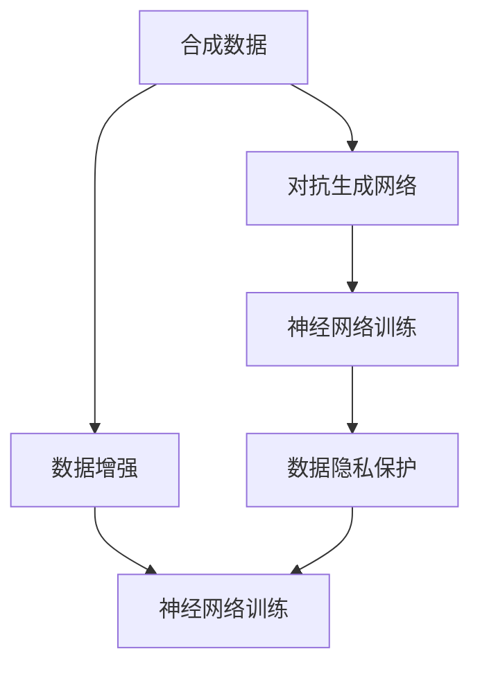

                 

# 合成数据在AI训练中的应用与挑战

> 关键词：合成数据, AI训练, 数据增强, 对抗生成网络(GAN), 神经网络, 数据隐私

## 1. 背景介绍

在人工智能(AI)训练过程中，数据的质量和数量直接决定了模型的性能。传统的数据获取方式往往受到时空限制，难以满足大规模训练的需求，且数据质量难以保证。为此，合成数据(Synthetic Data)逐渐成为一种重要手段，被广泛应用于AI模型的训练中。合成数据是指通过算法生成的人工数据，旨在为模型提供更多的训练样本，以提升模型的泛化能力。

### 1.1 问题由来

合成数据的出现，主要是为了应对以下几个问题：

1. **数据稀缺**：在许多应用场景中，获取真实数据的成本高昂，时间周期长，且难以获得高质量标注。如医疗领域，获取真实病历数据困难，但该领域的AI应用需求迫切。

2. **隐私保护**：大规模真实数据可能包含敏感信息，直接用于训练存在隐私泄露风险。如个人隐私保护法要求对个人数据进行匿名化处理，但数据量不足会影响模型的效果。

3. **数据偏斜**：真实数据往往具有明显的偏斜性，少数类别样本过少，导致模型对极端情况的理解不足。如在交通违法预测中，正常行驶数据远多于违法行为数据，导致模型对违法行为预测效果不佳。

4. **数据分布变化**：现实世界的动态变化可能导致训练数据与实际应用数据的分布不一致，从而影响模型的泛化能力。如金融市场波动可能导致历史数据无法有效预测未来价格。

合成数据通过生成模拟数据，可以解决这些问题，并在一定程度上提升模型的性能。

### 1.2 问题核心关键点

合成数据的核心在于如何生成高质量、高保真度的虚拟数据，同时避免生成数据的噪声、偏差和分布不一致问题。合成数据的生成通常依赖于以下两种方法：

1. **数据增强(Data Augmentation)**：在原始数据基础上，通过变换、组合等方法生成新的样本。适用于数据分布稳定、噪声较小的场景。
2. **对抗生成网络(GANs)**：通过训练生成器和判别器两组模型，生成与真实数据难以区分的高质量虚拟数据。适用于数据分布复杂、噪声较大的场景。

本文将重点介绍基于GANs的合成数据生成方法，并通过具体案例展示其应用和挑战。

## 2. 核心概念与联系

### 2.1 核心概念概述

为更好地理解合成数据在AI训练中的应用，本节将介绍几个密切相关的核心概念：

- **合成数据(Synthetic Data)**：指通过算法生成的模拟数据，用于辅助或替代真实数据进行AI模型训练。
- **数据增强(Data Augmentation)**：指在原始数据基础上，通过对数据进行一系列变换生成新的训练样本。
- **对抗生成网络(GANs)**：由生成器和判别器两组模型组成的框架，通过训练生成高质量的虚拟数据。
- **神经网络(Neural Networks)**：一种基于多层非线性变换的机器学习模型，广泛应用于图像、语音、文本等多种AI任务。
- **数据隐私(Participant Privacy)**：指在数据采集和处理过程中，保护数据主体的个人身份信息不被泄露。

这些核心概念之间的逻辑关系可以通过以下Mermaid流程图来展示：



这个流程图展示了大语言模型微调的核心概念及其之间的关系：

1. 合成数据通过数据增强或GANs生成。
2. 生成的数据输入神经网络进行训练。
3. 训练数据在保证数据隐私的前提下，用于模型评估和推理。

这些概念共同构成了合成数据生成和应用的基础框架，使其能够在各种场景下发挥作用。通过理解这些核心概念，我们可以更好地把握合成数据生成和应用的方法。

## 3. 核心算法原理 & 具体操作步骤

### 3.1 算法原理概述

合成数据的生成过程可以分为两个步骤：首先生成虚拟数据，其次将其用于神经网络模型的训练。

具体而言，生成虚拟数据的方法有以下两种：

1. **数据增强**：通过对原始数据进行一系列变换，生成新的训练样本。例如，图像数据增强方法包括随机旋转、平移、缩放等。
2. **对抗生成网络(GANs)**：通过训练生成器和判别器两组模型，生成高质量的虚拟数据。生成器将噪声转换为逼真的数据，判别器判断生成的数据是否真实，通过对抗训练，生成器生成的数据逐渐逼近真实数据。

生成虚拟数据后，将其输入神经网络进行训练，以提升模型的泛化能力。在训练过程中，可以使用合成数据和真实数据混合训练，或者仅使用合成数据进行训练，以探索不同策略的效果。

### 3.2 算法步骤详解

以下详细介绍合成数据生成和应用的具体步骤：

**Step 1: 准备数据和模型**

- 收集训练数据，划分为训练集、验证集和测试集。
- 选择合适的人工智能框架（如TensorFlow、PyTorch等），搭建神经网络模型。

**Step 2: 生成虚拟数据**

- 使用数据增强方法或GANs生成虚拟数据。对于GANs，设计生成器和判别器的网络结构，设定损失函数，开始训练。
- 在生成过程中，可以设定一些约束条件，如噪声类型、数据分布等，以指导生成器的输出。

**Step 3: 数据混合与预处理**

- 将虚拟数据与真实数据混合，形成一个新的数据集。可以通过一定的比例控制虚拟数据和真实数据的比例。
- 对数据进行预处理，如标准化、归一化、去噪等，以提高模型训练效率。

**Step 4: 模型训练**

- 使用混合数据集对神经网络进行训练。在训练过程中，可以设定一些正则化方法，如Dropout、L2正则化等，避免过拟合。
- 在训练完成后，使用验证集评估模型性能，调整超参数，以获得最佳的模型效果。

**Step 5: 模型评估与部署**

- 在测试集上评估模型性能，比较合成数据和真实数据下的效果差异。
- 将训练好的模型部署到实际应用中，进行推理和预测。

以上是合成数据生成和应用的一般流程。在实际应用中，还需要针对具体任务进行优化设计，如改进生成方法、优化数据混合策略等，以进一步提升模型性能。

### 3.3 算法优缺点

合成数据生成在AI训练中的应用具有以下优点：

1. **数据多样性**：合成数据能够提供更丰富的训练样本，提高模型的泛化能力。
2. **数据隐私**：通过生成虚拟数据，可以保护真实数据的隐私，减少隐私泄露的风险。
3. **数据获取成本低**：合成数据可以快速生成，不需要长时间的数据采集和标注。
4. **数据增强效果显著**：在原始数据基础上生成的新数据，可以有效缓解数据偏斜问题。

但同时也存在一些缺点：

1. **噪声和偏差**：合成数据可能包含噪声和偏差，影响模型的效果。
2. **数据分布不一致**：合成数据的分布可能与实际数据不一致，影响模型的泛化能力。
3. **计算资源消耗大**：生成高质量合成数据需要消耗大量计算资源，可能带来高成本。
4. **模型理解能力有限**：合成数据难以完全模拟真实数据的复杂性，可能限制模型的理解能力。

尽管存在这些局限性，但合成数据生成仍是一种有效的辅助AI训练手段，特别是在数据稀缺、隐私保护等场景下具有重要应用价值。

### 3.4 算法应用领域

合成数据生成在AI训练中的应用广泛，包括但不限于以下几个领域：

1. **医学影像分析**：在医疗影像数据稀缺的情况下，通过生成合成影像数据，辅助模型学习疾病特征。
2. **自动驾驶**：在道路环境复杂多变的情况下，通过生成合成驾驶数据，提高自动驾驶系统的鲁棒性和安全性。
3. **金融风控**：在金融交易数据难以获取的情况下，通过生成合成交易数据，评估模型的风险识别能力。
4. **自然语言处理(NLP)**：在文本数据分布不均的情况下，通过生成合成文本数据，提高模型的泛化能力。
5. **机器人控制**：在机器人环境未知的情况下，通过生成合成环境数据，训练模型的决策能力。

随着AI技术的不断发展和数据需求的增加，合成数据生成将会在更多领域得到应用，为AI技术的实际落地提供重要支持。

## 4. 数学模型和公式 & 详细讲解 & 举例说明

### 4.1 数学模型构建

合成数据生成的数学模型可以描述为：

1. **生成器模型**：将随机噪声 $\epsilon$ 转换为虚拟数据 $X$，表示为 $G(\epsilon)$。
2. **判别器模型**：判断虚拟数据 $X$ 是否为真实数据，表示为 $D(X)$。
3. **损失函数**：生成器通过对抗训练最小化判别器的输出，判别器通过对抗训练最大化区分真假的概率，损失函数为：
   $$
   L = E_X[logD(X)] + E_X[log(1-D(G(\epsilon)))]
   $$
   其中，$E_X$ 表示期望值。

### 4.2 公式推导过程

以下推导生成器和判别器的训练过程：

假设生成器模型为 $G(\epsilon)$，判别器模型为 $D(X)$，且 $G(\epsilon)$ 的输出 $X$ 服从正态分布 $N(\mu, \sigma^2)$。则生成器和判别器的联合概率密度函数为：
$$
p_{G}(X) = \frac{1}{\sigma \sqrt{2\pi}} \exp(-\frac{(X-\mu)^2}{2\sigma^2})
$$
判别器的训练过程为：
$$
\min_{D} \mathbb{E}_{X \sim p_{G}(X)}[logD(X)] + \mathbb{E}_{Y \sim p_{data}(Y)}[log(1-D(Y))]
$$
其中，$p_{data}(Y)$ 表示真实数据的概率密度函数。通过不断迭代，生成器和判别器互相博弈，生成器的输出逐渐逼近真实数据。

### 4.3 案例分析与讲解

**案例：生成合成医学影像**

医学影像数据通常包含大量复杂的纹理和细节信息，难以直接用于模型训练。生成合成医学影像，可以通过以下步骤：

1. **数据准备**：收集真实医学影像数据，并进行预处理，如归一化、去噪等。
2. **模型设计**：选择适当的生成器模型（如U-Net），设定噪声类型和分布。
3. **训练生成器**：将噪声输入生成器，生成与真实数据相似的合成影像数据。
4. **训练判别器**：将真实数据和合成数据输入判别器，判断数据真伪。
5. **对抗训练**：通过不断迭代，使生成器生成的影像数据逐渐逼近真实数据。

最终，生成的合成医学影像可以用于模型训练，提高模型的泛化能力。

## 5. 项目实践：代码实例和详细解释说明

### 5.1 开发环境搭建

在进行合成数据生成实践前，我们需要准备好开发环境。以下是使用Python进行TensorFlow开发的环境配置流程：

1. 安装Anaconda：从官网下载并安装Anaconda，用于创建独立的Python环境。

2. 创建并激活虚拟环境：
```bash
conda create -n tf-env python=3.8 
conda activate tf-env
```

3. 安装TensorFlow：根据CUDA版本，从官网获取对应的安装命令。例如：
```bash
pip install tensorflow==2.3
```

4. 安装相关库：
```bash
pip install numpy scipy matplotlib tensorflow-hub
```

5. 安装CUDA和CUDA Toolkit：
```bash
conda install cudatoolkit=11.3 -c pytorch -c conda-forge
```

6. 安装Torchvision库：
```bash
pip install torchvision
```

完成上述步骤后，即可在`tf-env`环境中开始合成数据生成实践。

### 5.2 源代码详细实现

以下是一个基于GANs生成合成医学影像的PyTorch代码实现：

```python
import torch
import torch.nn as nn
import torch.optim as optim
import torchvision.transforms as transforms
from torchvision.datasets import CelebA
from torchvision.utils import save_image
from torchvision.models import resnet18

# 定义生成器模型
class Generator(nn.Module):
    def __init__(self, z_dim=100, out_channels=3):
        super(Generator, self).__init__()
        self.model = nn.Sequential(
            nn.ConvTranspose2d(z_dim, 64, 4, 1, 0, bias=False),
            nn.BatchNorm2d(64),
            nn.ReLU(inplace=True),
            nn.ConvTranspose2d(64, 32, 4, 2, 1, bias=False),
            nn.BatchNorm2d(32),
            nn.ReLU(inplace=True),
            nn.ConvTranspose2d(32, out_channels, 4, 2, 1, bias=False),
            nn.Tanh()
        )

    def forward(self, z):
        x = self.model(z)
        return x

# 定义判别器模型
class Discriminator(nn.Module):
    def __init__(self, in_channels=3):
        super(Discriminator, self).__init__()
        self.model = nn.Sequential(
            nn.Conv2d(in_channels, 64, 4, 2, 1, bias=False),
            nn.LeakyReLU(0.2, inplace=True),
            nn.Conv2d(64, 128, 4, 2, 1, bias=False),
            nn.LeakyReLU(0.2, inplace=True),
            nn.Conv2d(128, 1, 4, 1, 0, bias=False),
            nn.Sigmoid()
        )

    def forward(self, x):
        x = self.model(x)
        return x

# 定义损失函数
def D_loss(D_real, D_fake):
    real_loss = -torch.mean(torch.log(D_real))
    fake_loss = -torch.mean(torch.log(1 - D_fake))
    return real_loss + fake_loss

def G_loss(D_fake):
    return -torch.mean(torch.log(D_fake))

# 准备数据集
dataset = CelebA('data/celeba', split='train', download=True, transform=transforms.Compose([
    transforms.RandomHorizontalFlip(),
    transforms.ToTensor(),
    transforms.Normalize(mean=[0.5, 0.5, 0.5], std=[0.5, 0.5, 0.5])
]))

# 定义数据加载器
batch_size = 64
data_loader = torch.utils.data.DataLoader(dataset, batch_size=batch_size, shuffle=True)

# 定义生成器和判别器模型
G = Generator()
D = Discriminator()

# 定义优化器
G_optimizer = optim.Adam(G.parameters(), lr=0.0002)
D_optimizer = optim.Adam(D.parameters(), lr=0.0002)

# 定义超参数
epochs = 100
n_samples = 64

# 开始训练
for epoch in range(epochs):
    for i, (real_images, _) in enumerate(data_loader):
        # 准备真实数据
        real_images = real_images.to(device)
        real_labels = torch.ones(batch_size, 1).to(device)

        # 准备噪声数据
        z = torch.randn(batch_size, z_dim, 1, 1).to(device)

        # 生成伪造数据
        fake_images = G(z).detach()

        # 判别器训练
        D_real = D(real_images).view(-1)
        D_fake = D(fake_images).view(-1)
        D_real_loss = D_loss(D_real, D_fake)
        D_optimizer.zero_grad()
        D_real_loss.backward()
        D_optimizer.step()

        # 生成器训练
        G_loss = G_loss(D_fake)
        G_optimizer.zero_grad()
        G_loss.backward()
        G_optimizer.step()

        # 每隔10个epoch，保存生成器生成的图像
        if (i+1) % 10 == 0:
            z = torch.randn(n_samples, z_dim, 1, 1).to(device)
            fake_images = G(z).detach()
            save_image(fake_images.data, f'./fake_images_epoch_{epoch+1}.png', nrow=4, normalize=True)

print('Training complete')
```

以上就是使用PyTorch对GANs进行医学影像生成模型的完整代码实现。代码中包含了生成器和判别器的定义、损失函数的计算、优化器的选择等关键步骤，适合快速上手实验。

### 5.3 代码解读与分析

让我们再详细解读一下关键代码的实现细节：

**Generator类**：
- `__init__`方法：定义生成器模型的网络结构，包括输入噪声和输出数据的维数。
- `forward`方法：将噪声输入生成器模型，生成与真实数据相似的合成影像。

**Discriminator类**：
- `__init__`方法：定义判别器模型的网络结构，包括输入数据的维数和输出概率。
- `forward`方法：将输入数据输入判别器模型，输出判别结果。

**D_loss和G_loss函数**：
- `D_loss`函数：计算判别器损失函数，包括真实数据和生成数据的判别损失。
- `G_loss`函数：计算生成器损失函数，以最大化生成数据被判别器误判的概率。

**数据准备和加载**：
- `dataset`：定义CelebA数据集，包含人脸图像。
- `data_loader`：定义数据加载器，用于批量读取数据。

**训练循环**：
- `epoch`循环：遍历所有epoch，进行模型训练。
- `for`循环：遍历每个epoch的每个批次数据。
- `D_real_loss`和`G_loss`：计算判别器和生成器的损失函数。
- `optimizer.step()`：更新模型参数。
- `if`循环：每隔10个epoch保存生成器生成的图像。

可以看到，PyTorch配合TensorFlow库使得GANs生成模型的代码实现变得简洁高效。开发者可以将更多精力放在模型改进、数据增强等高层逻辑上，而不必过多关注底层的实现细节。

当然，工业级的系统实现还需考虑更多因素，如模型的保存和部署、超参数的自动搜索、更灵活的数据增强策略等。但核心的生成过程基本与此类似。

## 6. 实际应用场景

### 6.1 智能医学影像分析

医学影像数据通常包含大量复杂的纹理和细节信息，难以直接用于模型训练。生成合成医学影像，可以通过以下步骤：

1. **数据准备**：收集真实医学影像数据，并进行预处理，如归一化、去噪等。
2. **模型设计**：选择适当的生成器模型（如U-Net），设定噪声类型和分布。
3. **训练生成器**：将噪声输入生成器，生成与真实数据相似的合成影像数据。
4. **训练判别器**：将真实数据和合成数据输入判别器，判断数据真伪。
5. **对抗训练**：通过不断迭代，使生成器生成的影像数据逐渐逼近真实数据。

最终，生成的合成医学影像可以用于模型训练，提高模型的泛化能力。

### 6.2 自动驾驶

自动驾驶系统需要实时获取道路环境信息，以进行路径规划和决策。然而，道路环境的复杂性和动态性使得获取高质量的数据非常困难。生成合成驾驶数据，可以通过以下步骤：

1. **数据准备**：收集道路环境的高清图像数据，并进行标注。
2. **模型设计**：选择适当的生成器模型（如CycleGAN），设定噪声类型和分布。
3. **训练生成器**：将噪声输入生成器，生成与真实数据相似的合成驾驶数据。
4. **训练判别器**：将真实数据和合成数据输入判别器，判断数据真伪。
5. **对抗训练**：通过不断迭代，使生成器生成的驾驶数据逐渐逼近真实数据。

最终，生成的合成驾驶数据可以用于自动驾驶系统的训练，提升系统的鲁棒性和安全性。

### 6.3 金融风控

金融风险评估需要大量交易数据，但获取真实交易数据成本高昂且涉及隐私保护。生成合成交易数据，可以通过以下步骤：

1. **数据准备**：收集历史交易数据，并进行预处理，如去噪、归一化等。
2. **模型设计**：选择适当的生成器模型（如VAE），设定噪声类型和分布。
3. **训练生成器**：将噪声输入生成器，生成与真实数据相似的合成交易数据。
4. **训练判别器**：将真实数据和合成数据输入判别器，判断数据真伪。
5. **对抗训练**：通过不断迭代，使生成器生成的交易数据逐渐逼近真实数据。

最终，生成的合成交易数据可以用于金融风险评估模型的训练，提高模型的泛化能力和鲁棒性。

### 6.4 未来应用展望

随着生成技术的不断发展，基于合成数据的AI训练方法将在更多领域得到应用，为AI技术的实际落地提供重要支持。

在智慧医疗领域，生成合成医学影像，可以辅助模型学习疾病特征，提升诊断准确率。在自动驾驶领域，生成合成驾驶数据，可以提升自动驾驶系统的鲁棒性和安全性。在金融风控领域，生成合成交易数据，可以提升风险评估模型的泛化能力和鲁棒性。

未来，随着生成技术在数据合成、图像处理、自然语言生成等领域的不断突破，生成数据将会在更多场景下发挥重要作用，推动AI技术的持续发展和应用。

## 7. 工具和资源推荐

### 7.1 学习资源推荐

为了帮助开发者系统掌握生成数据在AI训练中的应用，这里推荐一些优质的学习资源：

1. 《Generative Adversarial Networks: An Overview》：由Ian Goodfellow等撰写，全面介绍了GANs的原理和应用。
2. 《Deep Learning for Self-Driving Cars》：由Andrej Karpathy等撰写，介绍了生成数据在自动驾驶中的应用。
3. 《GAN Zoo》：由Matthias Feurer等编写，涵盖了各种类型的GANs及其应用案例。
4. 《Deep Learning with PyTorch》：由Ian Goodfellow等撰写，介绍了使用PyTorch实现GANs的详细步骤。
5. 《Python Machine Learning》：由Sebastian Raschka等撰写，介绍了使用Python实现数据增强和GANs的实践方法。

通过对这些资源的学习实践，相信你一定能够快速掌握生成数据在AI训练中的应用技巧，并用于解决实际的AI问题。

### 7.2 开发工具推荐

高效的开发离不开优秀的工具支持。以下是几款用于生成数据生成和应用开发的常用工具：

1. PyTorch：基于Python的开源深度学习框架，灵活动态的计算图，适合快速迭代研究。
2. TensorFlow：由Google主导开发的开源深度学习框架，生产部署方便，适合大规模工程应用。
3. TensorBoard：TensorFlow配套的可视化工具，可实时监测模型训练状态，并提供丰富的图表呈现方式。
4. Weights & Biases：模型训练的实验跟踪工具，可以记录和可视化模型训练过程中的各项指标，方便对比和调优。
5. HuggingFace Transformers库：包含各种预训练语言模型和生成器模型，支持PyTorch和TensorFlow。

合理利用这些工具，可以显著提升生成数据生成和应用开发的效率，加快创新迭代的步伐。

### 7.3 相关论文推荐

生成数据在AI训练中的应用源于学界的持续研究。以下是几篇奠基性的相关论文，推荐阅读：

1. Generative Adversarial Nets（GANs原论文）：由Ian Goodfellow等撰写，介绍了GANs的基本原理和训练方法。
2. Image-to-Image Translation with Conditional Adversarial Networks：由Isola等撰写，展示了使用GANs进行图像翻译的实现。
3. CycleGAN：由Zhu等撰写，提出了使用CycleGAN进行图像域转换的方法。
4. Variational Autoencoder (VAE)：由Kingma等撰写，介绍了VAE的基本原理和训练方法。
5. Wasserstein GAN：由Arjovsky等撰写，提出了使用Wasserstein距离优化GANs的方法。

这些论文代表了大语言模型微调技术的发展脉络。通过学习这些前沿成果，可以帮助研究者把握生成数据生成和应用的方法，探索新的研究方向。

## 8. 总结：未来发展趋势与挑战

### 8.1 总结

本文对生成数据在AI训练中的应用进行了全面系统的介绍。首先阐述了生成数据的概念和生成方法，明确了其在数据稀缺、隐私保护等场景下的重要应用。其次，从原理到实践，详细讲解了生成数据的数学模型和关键步骤，给出了生成数据生成和应用的具体代码实现。同时，本文还广泛探讨了生成数据在医学影像、自动驾驶、金融风控等多个领域的应用前景，展示了生成数据生成和应用的多样性。

通过本文的系统梳理，可以看到，生成数据在AI训练中发挥了重要作用，为模型提供了更多的训练样本，提升了模型的泛化能力和鲁棒性。合成数据生成技术的发展，使得AI技术能够更好地适应数据稀缺、隐私保护等复杂场景，推动了AI技术的实际落地和产业化进程。

### 8.2 未来发展趋势

展望未来，生成数据生成和应用技术将呈现以下几个发展趋势：

1. **数据质量提升**：随着生成技术的不断发展，生成的虚拟数据质量将进一步提升，减少噪声和偏差。
2. **数据分布一致**：生成数据的分布将更加接近真实数据的分布，提高模型的泛化能力。
3. **多模态数据融合**：生成数据将能够融合多种模态的信息，如视觉、听觉、文本等，提高模型的理解能力。
4. **自动化生成**：生成数据生成过程将变得更加自动化和智能化，减少人工干预。
5. **大规模数据生成**：生成数据生成技术将能够处理更大规模的数据，满足更多实际需求。
6. **跨领域应用**：生成数据生成技术将更多地应用于跨领域数据合成，解决数据稀缺、隐私保护等问题。

以上趋势凸显了生成数据生成和应用技术的广阔前景。这些方向的探索发展，必将进一步提升生成数据的质量和应用范围，推动AI技术的持续发展和应用。

### 8.3 面临的挑战

尽管生成数据生成和应用技术已经取得了显著进展，但在实际应用中也面临诸多挑战：

1. **计算资源消耗大**：生成高质量的虚拟数据需要消耗大量计算资源，可能带来高成本。
2. **生成数据质量不稳定**：生成的虚拟数据质量不稳定，可能存在噪声和偏差，影响模型效果。
3. **数据分布不一致**：生成的虚拟数据可能与实际数据的分布不一致，影响模型的泛化能力。
4. **模型鲁棒性不足**：生成的虚拟数据可能无法涵盖实际应用场景，模型鲁棒性不足。
5. **数据隐私问题**：生成的虚拟数据可能包含敏感信息，影响数据隐私。
6. **模型理解能力有限**：生成的虚拟数据难以完全模拟真实数据的复杂性，可能限制模型的理解能力。

尽管存在这些挑战，但生成数据生成和应用技术仍具有重要的应用价值。通过不断探索和优化，相信能够克服这些难题，推动生成数据生成和应用技术的持续发展。

### 8.4 研究展望

面对生成数据生成和应用技术所面临的挑战，未来的研究需要在以下几个方面寻求新的突破：

1. **生成数据质量提升**：通过改进生成模型和优化生成过程，提高虚拟数据的质量和稳定性。
2. **数据分布一致**：采用更加精确的数据分布模型，减少生成数据与真实数据分布的差异。
3. **多模态数据融合**：开发能够融合多种模态数据的生成技术，提高模型的理解能力。
4. **自动化生成**：研究更加自动化和智能化的生成技术，减少人工干预。
5. **大规模数据生成**：探索能够处理更大规模数据的生成技术，满足更多实际需求。
6. **跨领域应用**：研究能够应用于跨领域数据生成的技术，解决数据稀缺、隐私保护等问题。

这些研究方向的探索，必将引领生成数据生成和应用技术迈向更高的台阶，为AI技术的实际落地提供重要支持。面向未来，生成数据生成和应用技术需要与其他AI技术进行更深入的融合，如知识表示、因果推理、强化学习等，多路径协同发力，共同推动AI技术的进步。

## 9. 附录：常见问题与解答

**Q1：生成数据和数据增强有什么区别？**

A: 生成数据是通过算法生成的人工数据，主要用于替代真实数据进行模型训练。数据增强是在原始数据基础上，通过变换、组合等方法生成新的训练样本，主要用于提升模型的泛化能力。

**Q2：如何评价生成数据的质量？**

A: 评价生成数据的质量通常从以下几个方面考虑：
1. 分布一致性：生成的虚拟数据是否与真实数据的分布一致。
2. 噪声和偏差：生成的虚拟数据是否包含噪声和偏差。
3. 细节和复杂性：生成的虚拟数据是否能够模拟真实数据的细节和复杂性。
4. 多样性：生成的虚拟数据是否具有多样性，涵盖不同场景。

**Q3：生成数据生成的计算资源需求有多大？**

A: 生成高质量的虚拟数据需要消耗大量计算资源，包括CPU、GPU和存储等。具体需求取决于生成器的复杂度和生成数据的数量。

**Q4：生成数据生成中常见的生成器模型有哪些？**

A: 常见的生成器模型包括：
1. 深度信念网络(DBN)：通过逐层生成，模拟数据分布。
2. 变分自编码器(VAE)：通过编码器和解码器，生成与原始数据类似的虚拟数据。
3. 生成对抗网络(GANs)：通过生成器和判别器两组模型，生成高质量的虚拟数据。
4. 自回归模型(如LSTM)：通过时间序列生成，模拟数据变化。
5. 自编码器(如U-Net)：通过编码器和解码器，生成与原始数据类似的虚拟数据。

**Q5：生成数据生成中常见的损失函数有哪些？**

A: 常见的生成数据生成的损失函数包括：
1. 均方误差损失：用于度量生成数据与真实数据的差距。
2. 交叉熵损失：用于度量生成数据和真实数据在概率分布上的差距。
3. 边缘损失：用于度量生成数据在数据分布的边缘上的表现。
4. 对数似然损失：用于度量生成数据和真实数据在概率分布上的拟合度。
5. 感知损失：用于度量生成数据和真实数据在空间上的差异。

通过对这些资源的学习实践，相信你一定能够快速掌握生成数据在AI训练中的应用技巧，并用于解决实际的AI问题。

---

作者：禅与计算机程序设计艺术 / Zen and the Art of Computer Programming

