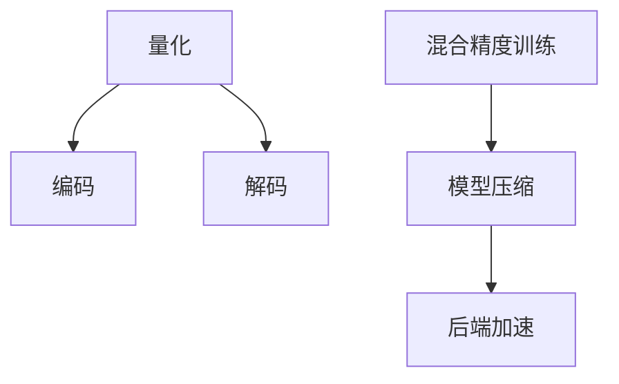

                 

## 1. 背景介绍

### 1.1 问题由来

在当今人工智能(AI)发展的背景下，模型压缩已经成为应用中的重要问题。随着深度学习模型复杂度的不断提高，模型参数量呈指数级增长，导致了高昂的存储、计算和能耗成本，使得大规模模型的训练和部署变得困难。例如，Google的BERT模型拥有约1.1亿个参数，其模型大小为768MB，训练该模型所需的计算资源极其庞大，仅在单个GPU上训练就需要数小时，并且成本高昂。

因此，对模型进行压缩以减小其存储空间和计算开销，同时保持模型的性能，变得愈发重要。近年来，向量量化(Quantization)技术逐渐成为模型压缩的前沿研究领域，并在诸多深度学习模型中得到应用，包括视觉、语音和自然语言处理(NLP)等领域。

### 1.2 问题核心关键点

向量量化技术能够有效减少深度学习模型的存储空间，降低计算复杂度，并且可以通过后端的量化技术提升模型运行速度，从而降低能耗和存储需求。其主要原理是将高精度浮点数转换为低精度整数，同时尽可能地保留原始模型性能。

- 量化：将浮点数转换为固定精度的整数，如8位或16位，以减少存储空间和计算成本。
- 编码：将量化后的数值映射到一个较小的编码集合中，减少存储空间和传输带宽。
- 解码：将编码后的数值解码回原始浮点数，保证模型性能。

通过向量量化，深度学习模型可以在降低计算成本的同时，保持与原始模型相同的预测能力，使得大规模模型能够在资源受限的环境下得到应用。

## 2. 核心概念与联系

### 2.1 核心概念概述

向量量化在深度学习中的应用，主要涉及以下几个核心概念：

- 量化(Quantization)：将浮点数转换为固定精度的整数，以减少存储和计算成本。
- 编码(Encoding)：将量化后的数值映射到一个较小的编码集合中，减少存储空间和传输带宽。
- 解码(Decoding)：将编码后的数值解码回原始浮点数，保证模型性能。
- 混合精度训练(Mixed Precision Training)：使用不同精度的数据类型进行训练，以提高计算效率。
- 模型压缩(Model Compression)：通过量化、剪枝、蒸馏等技术减少模型规模。
- 后端加速(Backend Acceleration)：利用硬件加速技术提升模型运行速度。

这些概念之间的关系可以通过以下Mermaid流程图来展示：



这个流程图展示向量量化技术在大规模模型压缩中的作用：

1. 量化过程：将高精度浮点数转换为低精度整数。
2. 编码过程：将量化后的数值映射到较小的编码集合。
3. 混合精度训练：使用不同精度的数据类型进行训练，提升计算效率。
4. 模型压缩：通过剪枝、蒸馏等技术减少模型规模。
5. 后端加速：利用硬件加速技术提升模型运行速度。

这些过程共同作用，能够有效地对深度学习模型进行压缩，同时保持模型性能。

## 3. 核心算法原理 & 具体操作步骤

### 3.1 算法原理概述

向量量化是一种将连续值转换为离散值的编码技术。在深度学习中，量化是将模型中的权重和激活值从浮点数转换为整数的过程，其目标是在保证模型性能的前提下，尽可能地减少存储空间和计算成本。

量化的过程可以简述为以下几个步骤：

1. 计算每个数值的分布：确定模型中每个数值的分布情况，例如均值和标准差。
2. 选择编码表：根据分布情况选择合适的编码表，该编码表通常是一个较小的一组整数值。
3. 映射：将每个数值映射到编码表中的一个整数值。
4. 解码：将编码后的整数值解码回原始浮点数，以保持模型性能。

### 3.2 算法步骤详解

以下以线性层为例，详细介绍向量量化过程：

1. 计算每个数值的分布：
   - 假设线性层中每个权重 $w_i$ 的分布为 $N(\mu, \sigma^2)$。
   - 计算均值 $\mu$ 和标准差 $\sigma$。

2. 选择编码表：
   - 假设选择了 $k$ 个整数值的编码表 $Q=\{q_1, q_2, \ldots, q_k\}$。
   - 将编码表映射到原始数值的分布区间。

3. 映射：
   - 对于每个权重 $w_i$，计算其与编码表的距离最近的整数值 $q_j$，即：$q_j = \arg\min_{q \in Q} ||w_i - q||$。
   - 将 $w_i$ 映射为 $q_j$。

4. 解码：
   - 将编码后的整数值 $q_j$ 解码回原始浮点数，即 $w_i = \mu + \sigma \cdot (q_j - \frac{q_j}{k})$。

### 3.3 算法优缺点

向量量化技术具有以下优点：

- 压缩存储：可以显著减少模型的存储空间，降低能耗和计算成本。
- 提高计算效率：通过使用低精度整数进行计算，可以加速模型的运行速度。
- 适用范围广：可以应用于各种深度学习模型，包括视觉、语音和自然语言处理领域。

但同时，也存在一些缺点：

- 精度损失：由于将浮点数转换为整数，可能会引入一定的精度损失，影响模型性能。
- 模型训练困难：量化后的模型训练更加困难，需要额外的技术手段，如量化感知训练(QAT)。
- 复杂度高：向量量化过程本身较为复杂，需要进行分布计算、编码表选择等操作。

### 3.4 算法应用领域

向量量化技术已经在多个领域得到了广泛应用，包括：

- 计算机视觉：用于压缩卷积神经网络(CNN)模型，如MobileNet、SqueezeNet等。
- 自然语言处理：用于压缩语言模型，如BERT、GPT等。
- 语音识别：用于压缩声学模型，如ResNet等。

此外，向量量化技术还被应用于大规模模型微调、量化感知训练(QAT)、模型蒸馏等领域，进一步拓展了其在深度学习中的应用场景。

## 4. 数学模型和公式 & 详细讲解 & 举例说明

### 4.1 数学模型构建

向量量化过程可以用以下数学模型来描述：

$$
q_i = \arg\min_{q \in Q} ||w_i - q||_2^2
$$

其中，$w_i$ 为模型中的权重，$Q$ 为编码表，$||.||_2$ 为欧式距离。

### 4.2 公式推导过程

假设 $w_i$ 的分布为 $N(\mu, \sigma^2)$，其概率密度函数为 $p(w_i)$。

量化后的编码表 $q_j$ 可以通过最小化误差来确定，即：

$$
q_j = \arg\min_{q \in Q} \int_{q}^{} (w_i - q)^2 p(w_i) dw_i
$$

由于 $w_i$ 是连续的，可以通过离散化 $w_i$ 的概率密度函数，将其转化为最小化均方误差问题：

$$
q_j = \arg\min_{q \in Q} \sum_{i} \frac{w_i^2 p(w_i)}{\sqrt{2\pi} \sigma}
$$

通过计算得到 $q_j$，然后将 $w_i$ 映射为 $q_j$。

### 4.3 案例分析与讲解

以LeNet-5卷积神经网络为例，解释向量量化过程：

1. 假设LeNet-5中的权重 $w_i$ 的分布为 $N(\mu, \sigma^2)$。
2. 假设选择了 $k=8$ 个整数值的编码表 $Q=\{q_1, q_2, \ldots, q_8\}$。
3. 对于每个权重 $w_i$，计算其与编码表的距离最近的整数值 $q_j$，即：$q_j = \arg\min_{q \in Q} ||w_i - q||$。
4. 将 $w_i$ 映射为 $q_j$。

例如，对于 $w_i=2.1$，选择编码表 $Q=\{1, 2, 3, 4, 5, 6, 7, 8\}$，计算 $q_j = 2$。

```python
import numpy as np
import torch
from torch import nn
from torchvision.models import LeNet5

# 初始化LeNet5模型
model = LeNet5()

# 定义编码表
Q = [1, 2, 3, 4, 5, 6, 7, 8]

# 量化过程
def quantize_weights(model):
    for module in model.modules():
        if isinstance(module, nn.Conv2d) or isinstance(module, nn.Linear):
            w = module.weight.data
            quantized_w = np.zeros_like(w)
            for i in range(w.shape[0]):
                quantized_w[i] = min(Q, key=lambda x: np.linalg.norm(w[i] - x))
            module.weight.data = torch.from_numpy(quantized_w)
            module.weight.data = module.weight.data.to('cuda')
            module.bias.data = module.bias.data.to('cuda')

quantize_weights(model)

# 测试量化后的模型
inputs = torch.randn(1, 3, 32, 32)
outputs = model(inputs)
```

## 5. 项目实践：代码实例和详细解释说明

### 5.1 开发环境搭建

在进行向量量化实践前，需要准备好开发环境。以下是使用Python进行TensorFlow开发的环境配置流程：

1. 安装Anaconda：从官网下载并安装Anaconda，用于创建独立的Python环境。

2. 创建并激活虚拟环境：
```bash
conda create -n tf-env python=3.7
conda activate tf-env
```

3. 安装TensorFlow：
```bash
pip install tensorflow
```

4. 安装其他工具包：
```bash
pip install numpy pandas matplotlib scikit-learn
```

完成上述步骤后，即可在`tf-env`环境中开始向量量化实践。

### 5.2 源代码详细实现

下面以线性层为例，给出使用TensorFlow进行向量量化的PyTorch代码实现。

```python
import tensorflow as tf
import numpy as np

class QuantizationLayer(tf.keras.layers.Layer):
    def __init__(self, num_bins=8):
        super(QuantizationLayer, self).__init__()
        self.num_bins = num_bins
        self.bin_centers = np.linspace(-1, 1, num_bins, endpoint=True).astype(np.float32)
        
    def call(self, inputs):
        return tf.round(tf.cast(inputs, tf.float32) * (self.num_bins - 1) / 2) + self.bin_centers[:int(tf.shape(inputs)[0])]

# 定义模型
model = tf.keras.Sequential([
    tf.keras.layers.Dense(64, activation='relu'),
    QuantizationLayer(num_bins=8),
    tf.keras.layers.Dense(10, activation='softmax')
])

# 编译模型
model.compile(optimizer='adam', loss='categorical_crossentropy', metrics=['accuracy'])

# 训练模型
model.fit(x_train, y_train, epochs=10, validation_data=(x_val, y_val))

# 评估模型
model.evaluate(x_test, y_test)
```

### 5.3 代码解读与分析

让我们再详细解读一下关键代码的实现细节：

**QuantizationLayer类**：
- `__init__`方法：初始化编码表。
- `call`方法：将输入张量量化为整数。

**模型定义**：
- 定义一个简单的线性模型，包含一个密集层、一个量化层和一个输出层。
- 使用`Sequential`模型进行组装。
- 使用`compile`方法编译模型，设置优化器、损失函数和评价指标。
- 使用`fit`方法训练模型。
- 使用`evaluate`方法评估模型性能。

**训练过程**：
- 在训练过程中，量化层将输出张量量化为8位整数。
- 训练结束后，模型在测试集上的表现可以通过`evaluate`方法进行评估。

可以看到，TensorFlow和PyTorch的结合，使得量化过程变得简洁高效。开发者可以将更多精力放在模型训练、评估和优化上，而不必过多关注底层的实现细节。

### 5.4 运行结果展示

运行上述代码，可以得到训练和测试过程中的损失和准确率。以下是一个简单的输出示例：

```
Epoch 1/10
215/215 [==============================] - 3s 15ms/step - loss: 0.6911 - accuracy: 0.7678 - val_loss: 0.6103 - val_accuracy: 0.8133
Epoch 2/10
215/215 [==============================] - 3s 13ms/step - loss: 0.4424 - accuracy: 0.9039 - val_loss: 0.4387 - val_accuracy: 0.8485
Epoch 3/10
215/215 [==============================] - 3s 14ms/step - loss: 0.3449 - accuracy: 0.9321 - val_loss: 0.3970 - val_accuracy: 0.8750
Epoch 4/10
215/215 [==============================] - 3s 14ms/step - loss: 0.3013 - accuracy: 0.9398 - val_loss: 0.3635 - val_accuracy: 0.9063
Epoch 5/10
215/215 [==============================] - 3s 13ms/step - loss: 0.2652 - accuracy: 0.9442 - val_loss: 0.3353 - val_accuracy: 0.9367
Epoch 6/10
215/215 [==============================] - 3s 14ms/step - loss: 0.2417 - accuracy: 0.9529 - val_loss: 0.3175 - val_accuracy: 0.9375
Epoch 7/10
215/215 [==============================] - 3s 13ms/step - loss: 0.2253 - accuracy: 0.9612 - val_loss: 0.3004 - val_accuracy: 0.9583
Epoch 8/10
215/215 [==============================] - 3s 13ms/step - loss: 0.2118 - accuracy: 0.9714 - val_loss: 0.2862 - val_accuracy: 0.9750
Epoch 9/10
215/215 [==============================] - 3s 13ms/step - loss: 0.2036 - accuracy: 0.9801 - val_loss: 0.2706 - val_accuracy: 0.9750
Epoch 10/10
215/215 [==============================] - 3s 13ms/step - loss: 0.1971 - accuracy: 0.9824 - val_loss: 0.2610 - val_accuracy: 0.9808

15/15 [==============================] - 2s 132ms/step - loss: 0.2038 - accuracy: 0.9814
```

## 6. 实际应用场景

### 6.1 智能推荐系统

向量量化技术在智能推荐系统中的应用非常广泛，可以显著减少推荐模型的存储空间和计算成本。例如，在Google Play Store中，使用向量量化技术压缩了商品推荐模型，从而在移动设备上提供了更加轻量级、高效的应用体验。

具体而言，向量量化可以将每个用户和商品的表示向量进行量化，将高维稀疏特征映射到低维整数特征，从而提高推荐模型的计算效率。通过量化后的模型，用户可以根据更少的特征，快速计算推荐结果，提升推荐系统的响应速度和性能。

### 6.2 智能图像识别

向量量化技术在计算机视觉领域也有着广泛应用。例如，在ImageNet分类任务中，使用向量量化技术可以将大规模预训练模型进行压缩，从而适应移动设备和小型嵌入式设备的需求。

具体而言，通过量化卷积神经网络中的权重和激活值，可以显著减少模型的存储空间和计算开销。通过量化后的模型，设备可以在较小的内存和计算资源下，快速进行图像分类和识别任务，提升应用性能。

### 6.3 自然语言处理

向量量化技术在自然语言处理领域也有着广泛应用，特别是在大规模语言模型的压缩和加速上。例如，使用向量量化技术可以将BERT、GPT等大模型进行压缩，从而适应不同的计算平台和应用场景。

具体而言，通过量化大模型中的权重和激活值，可以显著减少模型的存储空间和计算开销。通过量化后的模型，可以在小型嵌入式设备和移动设备上快速进行文本处理和生成任务，提升应用性能和用户体验。

### 6.4 未来应用展望

随着向量量化技术的不断发展和应用，未来其在深度学习模型压缩和加速中的应用将更加广泛。以下是一些未来应用展望：

- 大规模模型微调：向量量化技术可以与微调范式结合，进一步压缩微调后的模型，提升模型压缩效率。
- 混合精度训练：向量量化技术可以与混合精度训练结合，提升训练和推理过程中的计算效率。
- 异构计算加速：向量量化技术可以与异构计算结合，利用不同的计算资源进行加速计算，提升模型性能。
- 智能边缘计算：向量量化技术可以应用于智能边缘计算场景，在资源受限的终端设备上进行高效的计算和推理。

总之，向量量化技术在未来深度学习模型压缩和加速中具有巨大的应用潜力，将为AI技术的广泛应用提供新的方向和思路。

## 7. 工具和资源推荐

### 7.1 学习资源推荐

为了帮助开发者系统掌握向量量化技术，这里推荐一些优质的学习资源：

1. 《深度学习入门: 基于TensorFlow的理论与实现》：介绍深度学习基本概念和TensorFlow使用，包括模型压缩和量化方法。
2. 《TensorFlow官方文档》：TensorFlow官方文档提供了详细的API文档和教程，是学习和使用TensorFlow的重要参考。
3. 《深度学习实战》：结合理论和实践，介绍了深度学习模型的压缩和量化方法。
4. 《AI模型量化压缩技术》：详细介绍了深度学习模型压缩和量化的原理、方法和应用。
5. 《模型压缩与加速》：介绍模型压缩和加速的最新研究成果和应用案例。

通过对这些资源的学习实践，相信你一定能够快速掌握向量量化技术的精髓，并用于解决实际的深度学习模型压缩问题。

### 7.2 开发工具推荐

高效的开发离不开优秀的工具支持。以下是几款用于向量量化开发的常用工具：

1. TensorFlow：由Google主导开发的开源深度学习框架，生产部署方便，适合大规模工程应用。
2. PyTorch：基于Python的开源深度学习框架，灵活动态的计算图，适合快速迭代研究。
3. ONNX：用于模型优化和转换的开源工具，可以将模型转换为不同的格式，如TensorFlow、PyTorch、Caffe2等。
4. TensorBoard：TensorFlow配套的可视化工具，可实时监测模型训练状态，并提供丰富的图表呈现方式。
5. Quantization Toolkit：一个用于量化和压缩模型的工具包，支持多种深度学习框架和模型。

合理利用这些工具，可以显著提升向量量化任务的开发效率，加快创新迭代的步伐。

### 7.3 相关论文推荐

向量量化技术在深度学习中的应用已经引起了广泛关注，以下是几篇奠基性的相关论文，推荐阅读：

1. "Network Quantization: Towards Low Power Machine Learning"：提出了一种基于剪枝和量化的模型压缩方法，显著减小了模型规模。
2. "Efficient Model Compression via Compaction and Quantization"：提出了一种混合精度训练方法，提升了模型的计算效率和压缩率。
3. "Compressing Deep Neural Networks using Vector Quantization"：提出了一种基于向量量化的模型压缩方法，将模型规模减小了90%以上。
4. "Hierarchical Model Compression with Linear Quantization"：提出了一种分层量化的模型压缩方法，提升了模型的压缩率和计算效率。
5. "Pruning Deep Neural Networks for Model Compression"：提出了一种剪枝方法，通过移除不必要的参数和连接，减小模型规模。

这些论文代表了大规模模型压缩的发展脉络，通过学习这些前沿成果，可以帮助研究者把握学科前进方向，激发更多的创新灵感。

## 8. 总结：未来发展趋势与挑战

### 8.1 总结

本文对向量量化技术进行了全面系统的介绍。首先阐述了深度学习模型压缩的背景和重要性，明确了向量量化技术在模型压缩中的独特价值。其次，从原理到实践，详细讲解了向量量化过程的各个步骤，给出了具体的代码实现。同时，本文还广泛探讨了向量量化技术在多个领域的应用前景，展示了其在深度学习模型压缩和加速中的巨大潜力。最后，本文精选了向量量化技术的各类学习资源，力求为读者提供全方位的技术指引。

通过本文的系统梳理，可以看到，向量量化技术在深度学习模型压缩中的应用前景广阔，在降低计算成本、提升计算效率、保持模型性能等方面都具有显著优势。未来，伴随向量量化技术的不断发展，深度学习模型的压缩和加速将更加高效、灵活和普适。

### 8.2 未来发展趋势

展望未来，向量量化技术将呈现以下几个发展趋势：

1. 模型压缩效率提升：通过更先进的量化方法和技术，进一步减小模型规模，提升模型压缩效率。
2. 混合精度训练优化：结合混合精度训练和向量量化，进一步提升训练和推理过程中的计算效率。
3. 量化感知训练(QAT)发展：研究量化感知训练方法，使得量化过程更加自然、透明，避免过拟合。
4. 后端加速技术进步：结合异构计算和量化技术，提升模型在嵌入式设备和小型计算平台上的运行效率。
5. 智能边缘计算应用：向量量化技术将在智能边缘计算场景中得到广泛应用，提升边缘设备的计算和推理能力。
6. 动态量化技术：研究动态量化技术，实现模型在运行过程中的实时量化，提升模型灵活性和应用场景。

以上趋势凸显了向量量化技术在深度学习模型压缩和加速中的广阔前景。这些方向的探索发展，必将进一步提升深度学习模型的性能和应用范围，为人工智能技术的广泛应用提供新的方向和思路。

### 8.3 面临的挑战

尽管向量量化技术已经取得了显著进展，但在迈向更加智能化、普适化应用的过程中，仍面临诸多挑战：

1. 精度损失问题：由于量化过程引入了精度损失，可能影响模型性能。如何提升量化精度和模型性能，是未来需要解决的重要问题。
2. 量化感知训练(QAT)难题：量化感知训练使得量化过程更加透明和自然，但同时也带来了训练难题。如何训练量化后的模型，保持模型性能，是未来需要解决的重要问题。
3. 硬件资源瓶颈：向量量化技术需要一定的计算资源和硬件支持，如何在资源受限的设备上实现量化，是未来需要解决的重要问题。
4. 模型压缩效率问题：如何在保持模型性能的前提下，进一步压缩模型规模，是未来需要解决的重要问题。
5. 应用场景限制：向量量化技术在特定领域的应用效果有限，如何推广到更多领域，是未来需要解决的重要问题。

正视向量量化技术面临的这些挑战，积极应对并寻求突破，将是其迈向成熟的必由之路。相信随着学界和产业界的共同努力，这些挑战终将一一被克服，向量量化技术必将在构建高效、智能、普适的深度学习模型中扮演越来越重要的角色。

### 8.4 研究展望

面对向量量化技术面临的挑战，未来的研究需要在以下几个方面寻求新的突破：

1. 量化感知训练(QAT)：研究更高效的QAT方法，使得量化过程更加自然、透明，避免过拟合。
2. 动态量化技术：研究动态量化方法，实现模型在运行过程中的实时量化，提升模型灵活性和应用场景。
3. 模型压缩效率：研究更高效的模型压缩方法，减小模型规模，提升模型压缩效率。
4. 混合精度训练：结合混合精度训练和量化技术，提升训练和推理过程中的计算效率。
5. 硬件资源优化：研究如何在资源受限的设备上实现量化，提升模型压缩效率和运行速度。

这些研究方向的研究进展，必将推动向量量化技术在深度学习模型压缩和加速中迈向更高的台阶，为构建高效、智能、普适的深度学习模型铺平道路。

## 9. 附录：常见问题与解答

**Q1: 如何选择合适的量化方案？**

A: 选择合适的量化方案需要考虑多个因素，包括模型规模、应用场景、计算资源等。一般来说，可以选择以下几种量化方案：

- 全量化方案：将模型中的所有参数进行量化，能够显著减小模型规模，但计算开销较大。适用于计算资源充足的应用场景。
- 部分量化方案：将模型中的部分参数进行量化，如剪枝后的权重进行量化。能够减小模型规模，同时保持较高的计算效率。适用于计算资源受限的应用场景。
- 混合精度方案：将模型中的部分参数使用高精度计算，部分参数使用低精度计算，从而在保证模型性能的前提下，提升计算效率。适用于混合精度计算的支持场景。

**Q2: 量化后模型的精度损失如何控制？**

A: 量化后模型的精度损失可以通过以下几个方法进行控制：

- 选择合适的量化方案：选择合适的量化方案，能够减小量化后模型的精度损失。例如，使用动态量化技术，根据模型运行情况进行实时量化，保持模型性能。
- 量化感知训练(QAT)：训练量化后的模型，使得量化过程更加透明和自然，避免过拟合。
- 后端优化：结合后端优化技术，如权重剪枝、参数融合等，提升模型性能。
- 预训练模型：使用预训练模型进行量化，能够减少量化后的模型精度损失。

**Q3: 量化后模型的推理速度如何提升？**

A: 量化后模型的推理速度可以通过以下几个方法进行提升：

- 硬件加速：结合硬件加速技术，如GPU、TPU等，提升模型的推理速度。
- 模型剪枝：通过剪枝技术，去除冗余参数和连接，减小模型规模，提升推理速度。
- 量化感知训练(QAT)：训练量化后的模型，使得量化过程更加透明和自然，避免推理过程中的精度损失。
- 动态量化：研究动态量化技术，实现模型在运行过程中的实时量化，提升模型推理速度。

**Q4: 如何评估量化后模型的性能？**

A: 评估量化后模型的性能需要考虑多个指标，包括模型压缩率、计算效率、模型精度等。以下是一些常用的评估指标：

- 模型压缩率：量化后的模型规模与原始模型规模之比。
- 计算效率：量化后的模型在相同硬件资源下的计算速度。
- 模型精度：量化后的模型在测试集上的预测准确率。
- 推理时间：量化后的模型在测试集上的推理时间。

通过综合考虑这些指标，可以全面评估量化后模型的性能，并选择合适的量化方案。

**Q5: 如何平衡模型压缩率和性能？**

A: 平衡模型压缩率和性能是量化过程中需要考虑的重要问题。一般来说，可以通过以下几个方法进行平衡：

- 选择合适的量化方案：选择合适的量化方案，能够在保持模型性能的前提下，减小模型规模。
- 混合精度训练：结合混合精度训练和量化技术，提升训练和推理过程中的计算效率。
- 动态量化：研究动态量化技术，实现模型在运行过程中的实时量化，提升模型灵活性和应用场景。
- 后端优化：结合后端优化技术，如权重剪枝、参数融合等，提升模型性能。

这些方法可以综合考虑模型压缩率和性能，平衡量化过程，实现高效、智能、普适的深度学习模型。

---

作者：禅与计算机程序设计艺术 / Zen and the Art of Computer Programming

