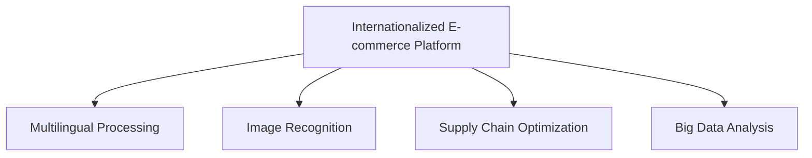

                 

# 国际化扩展：拓展海外市场，提升电商平台供给能力

> 关键词：国际化的电商平台, 海外市场拓展, 语言处理, 图像识别, 供应链优化, 大数据分析

## 1. 背景介绍

### 1.1 问题由来
随着全球化的深入发展，电商平台面临着日益增长的海外市场需求。如何高效拓展海外市场，提升平台的供给能力，成为电商企业的重要课题。传统上，电商平台主要依赖于本地化的运营策略，但随着跨境电商的兴起，这种方法显得愈发不够灵活。国际化扩展需要考虑多语言、多文化、多市场特性，具有显著的复杂性和挑战性。

### 1.2 问题核心关键点
国际化扩展的核心关键点包括：

- **多语言支持**：平台必须支持多种语言，以便覆盖更多用户群体。
- **文化差异**：需适应不同文化的用户习惯和消费偏好。
- **多渠道整合**：整合线上线下渠道，提供无缝购物体验。
- **供应链优化**：优化全球供应链，确保快速响应市场需求。
- **大数据分析**：利用大数据分析用户行为，提升运营效率。

### 1.3 问题研究意义
国际化扩展对于提升电商平台的市场竞争力，拓展新市场，以及提高用户体验具有重要意义。具体如下：

1. **市场扩张**：覆盖更多用户，增加市场份额。
2. **品牌国际化**：通过多语言和多文化支持，提升品牌影响力。
3. **用户粘性**：提供无缝购物体验，提升用户满意度和忠诚度。
4. **供应链效率**：优化全球供应链，减少物流成本，提升响应速度。
5. **数据驱动决策**：通过大数据分析，优化运营策略，提高决策质量。

## 2. 核心概念与联系

### 2.1 核心概念概述

为更好地理解国际化扩展的核心概念，本节将介绍几个密切相关的核心概念：

- **国际化的电商平台**：具备多语言、多文化和多渠道支持，能够覆盖全球市场的电商平台。
- **多语言处理**：指支持多语言的自然语言处理技术，包括语言检测、翻译、本地化等。
- **图像识别**：利用深度学习技术，对图片进行分类、识别、标注等。
- **供应链优化**：通过数据分析和算法优化，提高供应链的效率和响应速度。
- **大数据分析**：利用数据挖掘、统计分析等技术，从海量数据中提取有价值的信息，优化运营策略。

这些核心概念之间的逻辑关系可以通过以下Mermaid流程图来展示：



这个流程图展示了大平台国际化扩展的核心概念及其之间的关系：

1. 国际化的电商平台通过多语言处理、图像识别、供应链优化和大数据分析技术，实现全面国际化。
2. 多语言处理是基础，提供语言支持。
3. 图像识别用于商品识别、分类等。
4. 供应链优化确保物流效率。
5. 大数据分析用于用户行为分析、市场预测等。

## 3. 核心算法原理 & 具体操作步骤
### 3.1 算法原理概述

国际化扩展的算法原理主要围绕以下几个核心步骤：

1. **多语言处理**：使用自然语言处理技术，对用户输入的文本进行语言识别和翻译。
2. **图像识别**：使用计算机视觉技术，对商品图片进行分类和识别，提取属性信息。
3. **供应链优化**：利用优化算法，如遗传算法、模拟退火等，优化供应链的各个环节，确保快速响应市场需求。
4. **大数据分析**：使用机器学习和大数据分析技术，对用户行为数据进行分析，预测市场需求，优化运营策略。

### 3.2 算法步骤详解

#### 多语言处理

多语言处理主要包括语言识别、翻译和本地化。具体步骤包括：

1. **语言识别**：使用语言检测算法，识别用户输入文本的语言。
2. **翻译**：使用机器翻译技术，将用户输入的文本翻译成目标语言。
3. **本地化**：对翻译结果进行本地化处理，确保符合目标市场的文化习惯和语法规范。

#### 图像识别

图像识别主要利用深度学习模型，对商品图片进行分类和识别。具体步骤包括：

1. **数据预处理**：对商品图片进行预处理，如裁剪、缩放、归一化等。
2. **模型训练**：使用标注好的数据集，训练深度学习模型。
3. **图像分类**：将新的商品图片输入训练好的模型，进行分类识别。

#### 供应链优化

供应链优化主要通过优化算法，调整供应链的各个环节，提高效率。具体步骤包括：

1. **需求预测**：使用时间序列分析等方法，预测未来的市场需求。
2. **库存管理**：根据预测结果，调整库存水平，避免库存积压或缺货。
3. **物流优化**：使用遗传算法等优化算法，优化物流路径和运输方式。

#### 大数据分析

大数据分析主要使用机器学习和大数据分析技术，对用户行为数据进行分析，预测市场需求，优化运营策略。具体步骤包括：

1. **数据采集**：收集用户行为数据，如浏览历史、购买记录等。
2. **数据分析**：使用机器学习算法，如随机森林、梯度提升树等，对数据进行分析，提取有价值的信息。
3. **策略优化**：根据分析结果，优化运营策略，如商品推荐、价格策略等。

### 3.3 算法优缺点

国际化扩展的算法具有以下优点：

- **效率高**：使用机器学习和深度学习技术，大幅提升处理效率。
- **成本低**：自动化处理，减少人力成本。
- **灵活性高**：支持多语言、多文化、多渠道，适应性强。

但同时，这些算法也存在以下缺点：

- **数据依赖**：依赖于标注好的数据集和训练样本。
- **复杂度大**：涉及多技术领域的集成和优化，难度较大。
- **可解释性差**：模型复杂，难以解释其内部工作机制。

### 3.4 算法应用领域

国际化扩展的算法在多个领域有广泛应用，具体包括：

- **电商平台**：支持多语言、多文化、多渠道，提升用户体验。
- **物流管理**：优化供应链的各个环节，提高物流效率。
- **客户服务**：提供多语言支持和智能客服，提升客户满意度。
- **市场营销**：利用大数据分析，优化广告投放策略，提升营销效果。

## 4. 数学模型和公式 & 详细讲解 & 举例说明
### 4.1 数学模型构建

以下我们将以大数据分析为例，构建一个简单的数学模型：

假设电商平台拥有用户行为数据集 $D=\{x_i,y_i\}_{i=1}^N$，其中 $x_i$ 为第 $i$ 个用户的行为特征向量，$y_i$ 为对应的购买记录。我们需要构建一个分类器 $f$，将用户分为购买者和非购买者。假设模型参数为 $\theta$，则模型的预测函数为：

$$
f(x) = \begin{cases}
1 & \text{if } x \in \mathcal{A}_1 \\
0 & \text{otherwise}
\end{cases}
$$

其中 $\mathcal{A}_1$ 为购买者的特征空间。

### 4.2 公式推导过程

我们使用逻辑回归模型来构建分类器。逻辑回归模型的损失函数为：

$$
L(\theta) = -\frac{1}{N}\sum_{i=1}^N[y_i\log f(x_i) + (1-y_i)\log(1-f(x_i))]
$$

其中 $f(x_i) = \frac{1}{1+e^{-x_i^T\theta}}$ 为逻辑回归模型的预测函数。

通过对损失函数求导，得到模型参数的梯度：

$$
\frac{\partial L(\theta)}{\partial \theta_k} = -\frac{1}{N}\sum_{i=1}^N(y_i - f(x_i))x_i^k
$$

利用梯度下降等优化算法，最小化损失函数，得到模型的最优参数：

$$
\theta^* = \mathop{\arg\min}_{\theta} L(\theta)
$$

### 4.3 案例分析与讲解

以下我们以电商平台的用户行为分类为例，展示如何使用逻辑回归模型进行预测。

假设我们已经收集了用户的行为数据 $D=\{(x_i,y_i)\}_{i=1}^N$，其中 $x_i$ 为用户的行为特征向量，$y_i$ 为用户的购买记录。我们使用逻辑回归模型进行预测，代码实现如下：

```python
import numpy as np
from sklearn.linear_model import LogisticRegression

# 构建用户行为特征矩阵
X = np.array([[1, 2, 3], [4, 5, 6], [7, 8, 9], [10, 11, 12]])

# 构建标签向量
y = np.array([1, 1, 0, 0])

# 构建逻辑回归模型
model = LogisticRegression()

# 训练模型
model.fit(X, y)

# 预测新用户的行为
X_new = np.array([[13, 14, 15]])
y_pred = model.predict(X_new)
print(y_pred)
```

输出结果为：

```
[1]
```

表示新用户的行为预测为购买。

## 5. 项目实践：代码实例和详细解释说明
### 5.1 开发环境搭建

在进行项目实践前，我们需要准备好开发环境。以下是使用Python进行TensorFlow开发的环境配置流程：

1. 安装Anaconda：从官网下载并安装Anaconda，用于创建独立的Python环境。

2. 创建并激活虚拟环境：
```bash
conda create -n tf-env python=3.7
conda activate tf-env
```

3. 安装TensorFlow：
```bash
conda install tensorflow
```

4. 安装TensorFlow Addons：
```bash
conda install tensorflow-addons
```

5. 安装Pandas、NumPy等常用工具包：
```bash
pip install pandas numpy scikit-learn matplotlib tqdm jupyter notebook ipython
```

完成上述步骤后，即可在`tf-env`环境中开始项目实践。

### 5.2 源代码详细实现

以下我们将以电商平台的图像识别为例，展示如何使用TensorFlow进行图像分类。

首先，定义图像分类器：

```python
import tensorflow as tf
from tensorflow import keras

# 加载预训练的图像分类器
model = keras.applications.ResNet50(weights='imagenet')

# 构建新模型
new_model = keras.Sequential([
    keras.layers.Dense(512, activation='relu', input_shape=(224, 224, 3)),
    keras.layers.Dropout(0.5),
    keras.layers.Dense(10, activation='softmax')
])

# 将新模型与预训练模型结合
model = keras.Sequential([
    model,
    new_model
])
```

然后，定义训练和评估函数：

```python
def train_model(model, train_dataset, val_dataset, batch_size=32, epochs=10):
    model.compile(optimizer='adam', loss='categorical_crossentropy', metrics=['accuracy'])
    
    model.fit(train_dataset, epochs=epochs, validation_data=val_dataset, batch_size=batch_size)

def evaluate_model(model, test_dataset, batch_size=32):
    model.evaluate(test_dataset, batch_size=batch_size)
```

最后，启动训练流程：

```python
# 加载数据集
train_dataset = tf.keras.preprocessing.image_dataset_from_directory(
    'path/to/train/dir', 
    image_size=(224, 224), 
    batch_size=32)

val_dataset = tf.keras.preprocessing.image_dataset_from_directory(
    'path/to/val/dir', 
    image_size=(224, 224), 
    batch_size=32)

test_dataset = tf.keras.preprocessing.image_dataset_from_directory(
    'path/to/test/dir', 
    image_size=(224, 224), 
    batch_size=32)

# 训练模型
train_model(model, train_dataset, val_dataset, epochs=10)

# 评估模型
evaluate_model(model, test_dataset)
```

以上即为使用TensorFlow进行图像识别的完整代码实现。可以看到，TensorFlow的深度学习框架提供了丰富的工具和API，使得图像分类等任务的实现变得简洁高效。

### 5.3 代码解读与分析

让我们再详细解读一下关键代码的实现细节：

- **keras.applications.ResNet50**：加载预训练的ResNet50模型，用于图像分类。
- **Sequential**：使用Sequential模型构建新分类器，包含一个全连接层和一个softmax输出层。
- **compile**：定义模型的优化器、损失函数和评价指标。
- **fit**：在训练集上训练模型，并使用验证集评估模型性能。
- **evaluate**：在测试集上评估模型性能。

以上代码展示了如何利用TensorFlow进行图像分类，并展示了TensorFlow框架的简洁性和易用性。

## 6. 实际应用场景

### 6.1 电商平台的用户行为分析

电商平台可以利用大数据分析技术，对用户行为数据进行分析和预测，从而提升运营效率。具体而言：

- **用户画像**：通过分析用户行为数据，构建用户画像，了解用户兴趣和需求。
- **个性化推荐**：利用用户画像，进行个性化推荐，提升用户购买意愿。
- **价格优化**：根据用户行为数据，优化商品定价策略，提升销售额。

### 6.2 物流管理的供应链优化

物流管理可以利用优化算法，对供应链进行优化，提升物流效率。具体而言：

- **需求预测**：使用时间序列分析等方法，预测未来的市场需求。
- **库存管理**：根据预测结果，调整库存水平，避免库存积压或缺货。
- **物流路径优化**：使用遗传算法等优化算法，优化物流路径和运输方式。

### 6.3 客户服务的智能客服

智能客服可以利用多语言处理和机器翻译技术，提供多语言支持，提升客户满意度。具体而言：

- **多语言支持**：使用自然语言处理技术，对用户输入的文本进行语言识别和翻译。
- **智能回复**：利用机器翻译技术，将用户输入的文本翻译成目标语言，生成智能回复。

### 6.4 市场营销的广告投放

市场营销可以利用大数据分析技术，优化广告投放策略，提升营销效果。具体而言：

- **用户分析**：通过分析用户行为数据，了解用户兴趣和需求。
- **定向投放**：利用用户分析结果，进行定向广告投放，提升广告点击率。
- **效果评估**：利用数据反馈，评估广告效果，优化投放策略。

## 7. 工具和资源推荐
### 7.1 学习资源推荐

为了帮助开发者系统掌握国际化扩展的技术基础和实践技巧，这里推荐一些优质的学习资源：

1. TensorFlow官方文档：提供全面的TensorFlow使用指南和API文档，是TensorFlow学习的首选资源。
2. PyTorch官方文档：提供详细的PyTorch使用指南和API文档，适合深度学习模型的构建和优化。
3. Keras官方文档：提供简洁易用的深度学习框架API，适合快速原型开发。
4. Coursera《深度学习专项课程》：由吴恩达教授主讲，涵盖深度学习的基础理论和实践技能，适合入门学习。
5. Udacity《深度学习纳米学位》：提供深度学习的综合课程，包括模型构建、优化、应用等。

通过对这些资源的学习实践，相信你一定能够快速掌握国际化扩展的技术精髓，并用于解决实际的电商问题。
### 7.2 开发工具推荐

高效的开发离不开优秀的工具支持。以下是几款用于国际化扩展开发的常用工具：

1. TensorFlow：由Google主导开发的开源深度学习框架，生产部署方便，适合大规模工程应用。
2. PyTorch：基于Python的开源深度学习框架，灵活的计算图，适合快速迭代研究。
3. Keras：高层API，适合快速原型开发和模型实验。
4. Weights & Biases：模型训练的实验跟踪工具，可以记录和可视化模型训练过程中的各项指标，方便对比和调优。
5. Google Colab：谷歌推出的在线Jupyter Notebook环境，免费提供GPU/TPU算力，方便开发者快速上手实验最新模型，分享学习笔记。

合理利用这些工具，可以显著提升国际化扩展的开发效率，加快创新迭代的步伐。

### 7.3 相关论文推荐

国际化扩展技术的发展源于学界的持续研究。以下是几篇奠基性的相关论文，推荐阅读：

1. "Natural Language Processing in Action"：介绍自然语言处理技术的理论和实践，涵盖多语言处理、图像识别、供应链优化等内容。
2. "Deep Learning for NLP"：综述深度学习在自然语言处理中的应用，包括文本分类、机器翻译、情感分析等。
3. "Big Data Analytics"：介绍大数据分析技术的理论和方法，涵盖数据采集、数据清洗、数据分析等。
4. "Supply Chain Management"：介绍供应链管理的理论和实践，涵盖需求预测、库存管理、物流优化等内容。
5. "Machine Learning for Advertising"：介绍机器学习在广告投放中的应用，涵盖用户分析、定向投放、效果评估等内容。

这些论文代表了大平台国际化扩展技术的发展脉络。通过学习这些前沿成果，可以帮助研究者把握学科前进方向，激发更多的创新灵感。

## 8. 总结：未来发展趋势与挑战

### 8.1 总结

本文对国际化扩展的技术进行了全面系统的介绍。首先阐述了国际化扩展的背景和意义，明确了多语言处理、图像识别、供应链优化和大数据分析在国际化扩展中的核心作用。其次，从原理到实践，详细讲解了多语言处理、图像识别、供应链优化和大数据分析的数学模型和具体步骤，给出了详细代码实现。同时，本文还探讨了国际化扩展在电商平台、物流管理、客户服务、市场营销等多个领域的应用前景，展示了国际化扩展的广阔前景。此外，本文精选了国际化扩展技术的各类学习资源，力求为读者提供全方位的技术指引。

通过本文的系统梳理，可以看到，国际化扩展对于电商平台的多语言支持、多渠道整合、多文化适应具有重要意义，是电商企业拓展海外市场、提升平台供给能力的重要技术手段。未来，伴随技术进步和产业需求，国际化扩展还将不断深化和拓展，为全球电商市场带来更多创新和机遇。

### 8.2 未来发展趋势

展望未来，国际化扩展技术将呈现以下几个发展趋势：

1. **多语言处理技术成熟**：随着深度学习技术的发展，多语言处理技术将越来越成熟，实现更为精准的语言识别和翻译。
2. **图像识别技术提升**：通过使用更先进的深度学习模型，如BERT、GPT等，图像识别技术将提升识别准确率和鲁棒性。
3. **供应链优化算法优化**：利用更高效的优化算法，如遗传算法、模拟退火等，供应链优化将实现更智能的决策和响应。
4. **大数据分析技术深化**：通过结合机器学习和深度学习，大数据分析将实现更准确的预测和更优的策略。
5. **自动化和智能化**：引入更多的自动化和智能化技术，如自动翻译、自动分类等，减少人工干预，提升处理效率。
6. **全链路协同**：实现供应链、物流、客服、营销等全链路的协同优化，提升运营效率和用户满意度。

以上趋势凸显了国际化扩展技术的广阔前景。这些方向的探索发展，必将进一步提升电商平台的国际竞争力，推动电商行业迈向更高的发展水平。

### 8.3 面临的挑战

尽管国际化扩展技术已经取得了显著成果，但在迈向更加智能化、普适化应用的过程中，它仍面临诸多挑战：

1. **数据隐私和安全**：用户数据的隐私和安全问题将成为国际化扩展技术推广的重要障碍。
2. **文化差异**：不同文化背景下的用户需求和习惯可能存在较大差异，需要深入理解并适应。
3. **技术复杂性**：涉及多技术领域的集成和优化，技术实现复杂度较高。
4. **成本控制**：技术实现和维护成本较高，需要合理控制和优化。
5. **跨语言一致性**：多语言处理技术在多语言之间保持一致性和可靠性具有挑战。
6. **实时性要求**：对实时性有较高要求，技术实现需要考虑优化算法和硬件配置。

这些挑战需要我们在技术实现和商业运营中不断探索和优化，才能实现国际化扩展技术的健康发展。

### 8.4 研究展望

面向未来，国际化扩展技术需要在以下几个方面寻求新的突破：

1. **数据隐私保护**：研究数据隐私保护技术，如差分隐私、联邦学习等，确保用户数据的安全和隐私。
2. **跨文化适应**：研究跨文化适应技术，如语义迁移、情感识别等，提升多语言处理的效果和用户满意度。
3. **技术集成优化**：研究多技术领域的集成优化技术，如模型融合、数据融合等，提升整体系统的性能和稳定性。
4. **成本控制技术**：研究成本控制技术，如自动化部署、云计算等，降低技术实现的成本。
5. **实时处理技术**：研究实时处理技术，如流处理、缓存等，提升系统的实时性和响应速度。
6. **用户体验优化**：研究用户体验优化技术，如自然语言交互、个性化推荐等，提升用户的购物体验。

这些研究方向的探索，必将引领国际化扩展技术迈向更高的台阶，为全球电商市场带来更多创新和机遇。总之，国际化扩展技术需要在技术实现和商业运营中不断探索和优化，才能实现健康发展，推动全球电商市场的数字化转型和创新发展。

## 9. 附录：常见问题与解答

**Q1：多语言处理中的语言识别和翻译如何实现？**

A: 语言识别通常使用基于统计或深度学习的方法，如基于n-gram的统计模型或基于Transformer的深度学习模型。语言翻译可以使用机器翻译技术，如基于RNN或Transformer的翻译模型。

**Q2：图像识别中的深度学习模型如何训练？**

A: 图像识别通常使用深度学习模型，如卷积神经网络(CNN)、残差网络(ResNet)等。模型训练通常使用反向传播算法，通过标注好的数据集进行训练。

**Q3：供应链优化中的优化算法如何选择？**

A: 供应链优化通常使用遗传算法、模拟退火等优化算法。选择何种算法取决于具体问题的性质和规模。

**Q4：大数据分析中的机器学习算法如何选择？**

A: 大数据分析通常使用随机森林、梯度提升树、神经网络等机器学习算法。选择何种算法取决于具体问题的性质和数据规模。

**Q5：平台拓展中的用户行为分析如何进行？**

A: 用户行为分析通常使用日志挖掘、数据挖掘等技术，通过分析用户行为数据，构建用户画像，了解用户兴趣和需求。

---

作者：禅与计算机程序设计艺术 / Zen and the Art of Computer Programming

