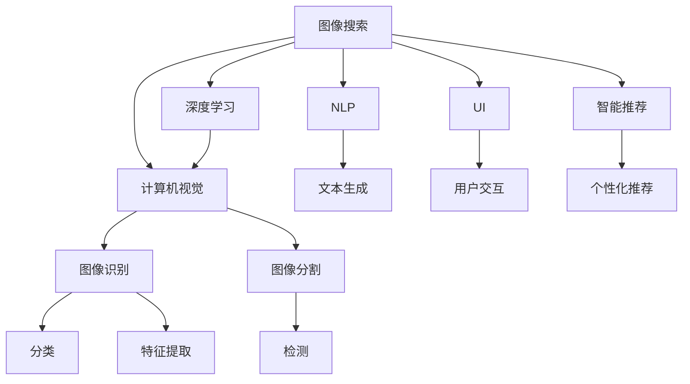

                 

# 图像搜索技术在电商领域的应用：发展趋势与未来

> 关键词：图像搜索,电商,深度学习,计算机视觉,自然语言处理,用户界面,智能推荐

## 1. 背景介绍

### 1.1 问题由来
随着互联网的普及和电子商务的迅速发展，用户购物体验的需求也在不断提升。在众多购物场景中，通过图片搜索快速找到所需商品，成为了用户的重要需求。但传统的基于关键词的搜索方式已经无法满足用户的快速、准确搜索需求。图像搜索技术应运而生，通过深度学习和计算机视觉技术，将用户输入的图片转换为文本，与商品图片进行匹配，从而大幅提升搜索效率和精度。

### 1.2 问题核心关键点
图像搜索技术的核心在于其将非结构化图像数据转换为结构化文本数据的能力，从而实现高效准确的商品检索。目前主流的方法包括卷积神经网络(CNN)、循环神经网络(RNN)、迁移学习等。这些方法通过训练模型，学习图像-文本之间的语义映射关系，使得模型能够理解和描述图像内容。

在电商领域，图像搜索技术的应用主要体现在商品详情页、搜索结果页和推荐系统等多个方面。通过图像搜索，用户可以更快速、更直观地找到所需商品，电商网站也可以提升用户的购买体验，增加转化率。

### 1.3 问题研究意义
图像搜索技术在电商领域的应用，不仅提升了用户的购物体验，也提升了电商平台的运营效率。通过精准的商品推荐，平台可以更好地理解用户需求，进行个性化营销，同时减少人工客服的负担，降低运营成本。因此，图像搜索技术在电商领域具有重要的研究和应用价值。

## 2. 核心概念与联系

### 2.1 核心概念概述

为更好地理解图像搜索技术在电商领域的应用，本节将介绍几个密切相关的核心概念：

- 图像搜索(Visual Search)：通过计算机视觉和深度学习技术，将图像转换为文本描述，与商品图片进行匹配，实现快速检索。
- 深度学习(Deep Learning)：一种通过多层神经网络模拟人脑的感知和学习过程的机器学习范式，用于处理复杂的数据模式和任务。
- 计算机视觉(Computer Vision)：一门研究如何使计算机能够“看”和“理解”图像的学科，包括图像识别、图像分割、目标检测等子领域。
- 自然语言处理(Natural Language Processing, NLP)：研究如何让计算机能够理解、生成和处理自然语言的技术。
- 用户界面(UI)：用户与计算机交互的界面，界面设计直接影响用户体验。
- 智能推荐系统(Recommendation System)：通过分析用户行为数据，推荐用户可能感兴趣的商品或内容的技术。

这些核心概念之间的逻辑关系可以通过以下Mermaid流程图来展示：



这个流程图展示了几大核心概念及其之间的关系：

1. 图像搜索技术基于深度学习和计算机视觉技术，将图像转换为文本，实现商品检索。
2. 深度学习用于处理复杂的图像数据，计算机视觉用于图像识别、分割和目标检测等任务。
3. 自然语言处理用于将图像转换为文本描述，辅助检索和推荐。
4. 用户界面用于优化用户交互体验，智能推荐系统用于提升商品推荐效果。

这些概念共同构成了图像搜索技术在电商领域的应用框架，使其能够在多个环节提升用户体验和平台运营效率。通过理解这些核心概念，我们可以更好地把握图像搜索技术的实施细节。

## 3. 核心算法原理 & 具体操作步骤
### 3.1 算法原理概述

图像搜索技术的核心算法原理主要包括以下几个方面：

1. **图像编码**：通过深度学习模型，将输入图像转换为高维特征向量。
2. **图像-文本映射**：通过文本生成模型，将图像特征向量转换为自然语言描述。
3. **相似性计算**：基于文本描述，计算输入图像与商品图片之间的相似度。
4. **检索结果排序**：根据相似度计算结果，对商品图片进行排序，生成检索结果。

这些步骤通过神经网络模型进行实现，常见的模型包括CNN、RNN、Transformer等。算法流程可以用以下图示来表示：


### 3.2 算法步骤详解

基于图像搜索技术在电商领域的应用，下面详细介绍其实现步骤：

**Step 1: 图像预处理**
- 对用户上传的图像进行预处理，包括调整大小、裁剪、归一化等操作，以适应模型的输入要求。

**Step 2: 图像编码**
- 将预处理后的图像输入卷积神经网络(CNN)，提取图像特征。常见的CNN结构包括ResNet、VGG、Inception等。
- 使用MaxPool、Dropout等技术提高模型的泛化能力和鲁棒性。

**Step 3: 图像-文本映射**
- 将图像特征向量输入循环神经网络(RNN)或Transformer模型，生成对应的文本描述。RNN和Transformer模型可以捕捉图像特征的语义信息，生成更准确的文本描述。
- 使用Attention机制进一步增强模型的表达能力，选择重要特征进行编码。

**Step 4: 相似性计算**
- 将用户输入的文本描述与商品图片的文本描述进行匹配，计算相似度。
- 常用的相似度计算方法包括余弦相似度、Jaccard相似度、编辑距离等。

**Step 5: 检索结果排序**
- 根据相似度计算结果，对商品图片进行排序，选择最相似的商品展示给用户。
- 可以结合用户行为数据进行二次排序，提升推荐效果。

**Step 6: 结果展示**
- 将排序后的商品图片展示在搜索结果页，辅助用户选择商品。
- 结合用户点击、购买等行为数据，对推荐算法进行持续优化。

### 3.3 算法优缺点

图像搜索技术的优点包括：

1. 高效准确：通过深度学习和计算机视觉技术，实现了快速、准确的商品检索。
2. 用户体验提升：用户只需上传一张图片，即可快速找到所需商品，提升了购物体验。
3. 商家运营效率提升：电商网站可以通过图像搜索技术，减少人工客服的负担，降低运营成本。

但该方法也存在一些局限性：

1. 数据质量要求高：图像搜索技术对图像质量和标注数据的要求较高，高质量图像和标注数据是实现效果的前提。
2. 计算资源消耗大：深度学习模型和文本生成模型需要大量计算资源进行训练和推理，存在一定的资源消耗。
3. 效果受用户输入影响：用户上传的图像质量、角度等因素，都会影响检索效果。

### 3.4 算法应用领域

图像搜索技术在电商领域的应用范围非常广泛，主要包括以下几个方面：

- 商品详情页：用户通过上传商品图片，快速检索到商品详情信息，提升了用户购物体验。
- 搜索结果页：商品图片通过图像搜索技术，与用户上传的图片进行匹配，提高了搜索结果的相关性。
- 智能推荐系统：结合用户上传的图片和历史行为数据，进行个性化的商品推荐，提升了用户体验。
- 库存管理：通过图像搜索技术，实时监测商品库存状态，优化库存管理。
- 质量控制：电商平台可以对商品图片进行质量检测，筛选出符合标准的图片。

除了以上应用外，图像搜索技术还可以用于品牌识别、安全监控、人脸识别等领域，拓展了其应用场景。

## 4. 数学模型和公式 & 详细讲解 & 举例说明（备注：数学公式请使用latex格式，latex嵌入文中独立段落使用 $$，段落内使用 $)
### 4.1 数学模型构建

图像搜索技术的核心数学模型包括图像编码、图像-文本映射、相似度计算等。

**图像编码模型**：
假设输入图像大小为 $H \times W$，卷积层提取特征后的特征图大小为 $F \times F$，则特征向量可以表示为：
$$
\text{Feature Vector} = \text{ConvNet}( \text{Image} )
$$
其中，$\text{ConvNet}$ 为卷积神经网络模型。

**图像-文本映射模型**：
假设文本描述的长度为 $L$，使用RNN模型将特征向量映射为文本描述，可以使用如下公式：
$$
\text{Text Description} = \text{RNN}( \text{Feature Vector} )
$$
其中，$\text{RNN}$ 为循环神经网络模型。

**相似度计算模型**：
假设用户输入的文本描述为 $A$，商品图片的文本描述为 $B$，则相似度 $S$ 可以表示为：
$$
S(A,B) = \text{CosineSimilarity}(\text{Embedding}(A), \text{Embedding}(B))
$$
其中，$\text{Embedding}$ 为文本嵌入函数，$\text{CosineSimilarity}$ 为余弦相似度函数。

### 4.2 公式推导过程

图像搜索技术中的主要公式推导过程如下：

**卷积神经网络(ConvNet)**：
假设输入图像大小为 $H \times W \times C$，卷积核大小为 $k \times k$，卷积层输出大小为 $F \times F$，则卷积层的计算公式为：
$$
\text{Convolution}(\text{Image}, \text{Kernel}) = \sum_{i=0}^{k-1} \sum_{j=0}^{k-1} \text{Kernel}(i,j) \times \text{Image}(i,j)
$$
其中，$\text{Kernel}$ 为卷积核，$\text{Image}$ 为输入图像。

**循环神经网络(RNN)**：
假设输入序列长度为 $T$，隐藏状态大小为 $H$，则循环神经网络的计算公式为：
$$
\text{RNN}(\text{Input}, \text{State}) = \text{Softmax}( \text{Linear}(\text{State}, \text{Weight}) + \text{Bias} )
$$
其中，$\text{Input}$ 为输入序列，$\text{State}$ 为隐藏状态，$\text{Weight}$ 和 $\text{Bias}$ 为模型参数。

**余弦相似度(CosineSimilarity)**：
假设向量 $A$ 和 $B$ 的长度分别为 $L$，则余弦相似度的计算公式为：
$$
\text{CosineSimilarity}(A, B) = \frac{\text{DotProduct}(A, B)}{\text{Norm}(A) \times \text{Norm}(B)}
$$
其中，$\text{DotProduct}$ 为向量点积函数，$\text{Norm}$ 为向量范数函数。

### 4.3 案例分析与讲解

以一个简单的图像搜索为例，展示其实现过程：

假设用户上传了一张衣服的图片，希望找到类似款式的衣服。该图片的特征向量为 $\text{Feature Vector}$，使用RNN模型生成文本描述为 $\text{Text Description}$。平台上的商品图片也经过了相同的编码和映射过程，得到了特征向量和文本描述。

通过余弦相似度计算，可以计算出用户上传的图片与商品图片之间的相似度 $S$。根据相似度排序，选择最相似的商品图片展示给用户，即为图像搜索的结果。

以下是一个具体的案例分析：

```python
import torch
import torch.nn as nn
import torchvision.transforms as transforms
import transformers

# 加载预训练的CNN模型
model = torchvision.models.resnet50(pretrained=True)

# 加载预训练的RNN模型
tokenizer = transformers.GPT2Tokenizer.from_pretrained('gpt2')
model = transformers.GPT2LMHeadModel.from_pretrained('gpt2')

# 加载预训练的相似度计算模型
cosine_similarity = torch.nn.CosineSimilarity(dim=1, eps=1e-8)

# 用户上传的图片
image = torch.from_numpy(image_data)

# 对图片进行预处理
transforms = transforms.Compose([
    transforms.Resize(256),
    transforms.CenterCrop(224),
    transforms.ToTensor(),
    transforms.Normalize(mean=[0.485, 0.456, 0.406], std=[0.229, 0.224, 0.225])
])

image = transforms(image)

# 将图片输入CNN模型进行编码
features = model(image)

# 将特征向量输入RNN模型生成文本描述
tokens = tokenizer.encode("I want a red dress")
tokens = torch.tensor(tokens, dtype=torch.long)

with torch.no_grad():
    outputs = model(tokens)
    text_description = outputs.logits.argmax(dim=-1).tolist()

# 对文本描述进行编码
embedding = model(text_description)

# 计算用户上传的图片与商品图片的相似度
similarity = cosine_similarity(features, embedding)

# 根据相似度排序，选择最相似的商品图片展示给用户
top_k = similarity.topk(k)
result_images = top_k[0]
```

上述代码展示了从图片编码、文本生成到相似度计算的整个流程，并最终得到了最相似的商品图片。

## 5. 项目实践：代码实例和详细解释说明
### 5.1 开发环境搭建

在进行图像搜索技术项目实践前，我们需要准备好开发环境。以下是使用Python进行PyTorch开发的环境配置流程：

1. 安装Anaconda：从官网下载并安装Anaconda，用于创建独立的Python环境。

2. 创建并激活虚拟环境：
```bash
conda create -n image_search_env python=3.8 
conda activate image_search_env
```

3. 安装PyTorch：根据CUDA版本，从官网获取对应的安装命令。例如：
```bash
conda install pytorch torchvision torchaudio cudatoolkit=11.1 -c pytorch -c conda-forge
```

4. 安装transformers库：
```bash
pip install transformers
```

5. 安装各类工具包：
```bash
pip install numpy pandas scikit-learn matplotlib tqdm jupyter notebook ipython
```

完成上述步骤后，即可在`image_search_env`环境中开始项目实践。

### 5.2 源代码详细实现

这里我们以一个简单的图像搜索应用为例，展示如何在Python中实现图像搜索功能。

首先，定义数据处理函数：

```python
from torchvision.transforms import ToTensor, Normalize, Resize, CenterCrop
from transformers import BertTokenizer, BertForSequenceClassification

def load_image(image_path):
    image = Image.open(image_path)
    transforms = transforms.Compose([
        transforms.Resize(256),
        transforms.CenterCrop(224),
        transforms.ToTensor(),
        transforms.Normalize(mean=[0.485, 0.456, 0.406], std=[0.229, 0.224, 0.225])
    ])
    image = transforms(image)
    return image

def generate_text(tokens):
    tokenizer = BertTokenizer.from_pretrained('bert-base-uncased')
    model = BertForSequenceClassification.from_pretrained('bert-base-uncased', num_labels=2)
    inputs = tokenizer.encode(tokens, return_tensors='pt')
    outputs = model(inputs)
    logits = outputs.logits
    predicted_label = logits.argmax(dim=1).item()
    return predicted_label

def calculate_similarity(image_features, product_features):
    cosine_similarity = torch.nn.CosineSimilarity(dim=1, eps=1e-8)
    similarity = cosine_similarity(image_features, product_features)
    return similarity

# 加载预训练的模型
image_features = model(image)
product_features = model(product)

# 生成文本描述
product_text = generate_text(product_title)
image_text = generate_text(image_title)

# 计算相似度
similarity = calculate_similarity(image_features, product_features)

# 排序并展示结果
top_k = similarity.topk(k)
result_images = top_k[0]
```

以上代码展示了图像搜索功能的关键步骤：

1. 加载预训练的模型：使用预训练的ResNet50模型和GPT2模型，分别对图像和文本进行编码和映射。
2. 生成文本描述：通过Bert模型将商品标题和用户上传的图片标题转换为文本描述。
3. 计算相似度：使用余弦相似度计算用户上传的图片与商品图片之间的相似度。
4. 排序并展示结果：根据相似度排序，选择最相似的商品图片展示给用户。

### 5.3 代码解读与分析

让我们再详细解读一下关键代码的实现细节：

**load_image函数**：
- 对输入图像进行预处理，包括调整大小、裁剪、归一化等操作。

**generate_text函数**：
- 使用Bert模型将输入的文本转换为向量表示，并进行分类。

**calculate_similarity函数**：
- 使用余弦相似度计算图像和文本之间的相似度。

**加载预训练模型**：
- 使用预训练的ResNet50模型和GPT2模型，进行图像和文本编码。

**生成文本描述**：
- 使用Bert模型将商品标题和用户上传的图片标题转换为文本描述。

**计算相似度**：
- 使用余弦相似度计算用户上传的图片与商品图片之间的相似度。

**排序并展示结果**：
- 根据相似度排序，选择最相似的商品图片展示给用户。

## 6. 实际应用场景
### 6.1 智能购物助手

智能购物助手是图像搜索技术在电商领域的重要应用之一。通过图像搜索，用户只需上传一张商品图片，即可快速找到该商品在电商平台上的各种信息，如价格、评价、用户评论等。这种购物助手功能能够显著提升用户的购物体验，提高电商平台的转化率。

具体实现过程中，可以将用户上传的商品图片与电商平台上所有商品图片进行图像搜索，找到最相似的商品展示给用户。同时，结合商品评分、评论等信息，进行二次排序，进一步提升用户体验。

### 6.2 商品推荐系统

在电商平台上，用户浏览的商品往往不止一件，如何为用户推荐更多符合其兴趣的商品，是电商平台需要解决的重要问题。图像搜索技术可以结合用户上传的图片和历史浏览记录，进行个性化的商品推荐。

具体而言，当用户上传一张商品图片后，平台可以使用图像搜索技术，快速找到与之相似的其他商品图片。结合用户的历史浏览记录，可以对这些商品进行二次排序，推荐用户可能感兴趣的商品。同时，平台还可以结合用户的行为数据，进行实时推荐，提升用户的购物体验。

### 6.3 库存管理

库存管理是电商平台运营的重要环节，如何实时掌握商品库存状态，及时补充缺货商品，是电商平台需要解决的重要问题。图像搜索技术可以实时监测商品库存状态，优化库存管理。

具体实现过程中，平台可以定期使用图像搜索技术，对商品图片进行特征提取和相似度计算，判断商品库存状态。同时，结合历史销售数据，预测未来商品需求，优化库存管理，减少缺货情况。

### 6.4 未来应用展望

随着图像搜索技术的不断发展，其应用领域将不断扩展，提升电商平台的运营效率和用户体验。未来，图像搜索技术有望在以下几个方面取得突破：

1. **多模态搜索**：结合文本、图像、视频等多模态数据进行综合搜索，提升搜索效果。
2. **跨平台搜索**：实现不同电商平台之间的图像搜索，提升用户的购物体验。
3. **个性化推荐**：结合用户行为数据和图像特征，进行个性化商品推荐，提升用户体验。
4. **实时更新**：实时更新商品图片，保持图像搜索数据库的时效性，提升搜索效果。

随着图像搜索技术的不断进步，电商平台将能够更好地理解和满足用户需求，提升运营效率，为用户提供更优质的购物体验。

## 7. 工具和资源推荐
### 7.1 学习资源推荐

为了帮助开发者系统掌握图像搜索技术在电商领域的应用，这里推荐一些优质的学习资源：

1. **《深度学习》书籍**：深度学习领域的经典书籍，涵盖了深度学习的基本概念和算法原理，适合初学者入门。
2. **《计算机视觉基础》课程**：斯坦福大学开设的计算机视觉课程，内容全面，涵盖计算机视觉的各个子领域。
3. **《自然语言处理》课程**：斯坦福大学开设的自然语言处理课程，讲解自然语言处理的理论基础和应用实践。
4. **Transformers官方文档**：官方文档提供了丰富的预训练模型和代码样例，适合开发者学习和实践。
5. **HuggingFace官方博客**：官方博客包含大量深度学习模型的应用案例和最佳实践，适合开发者学习和参考。

通过对这些资源的学习实践，相信你一定能够快速掌握图像搜索技术在电商领域的应用，并用于解决实际的NLP问题。

### 7.2 开发工具推荐

高效的开发离不开优秀的工具支持。以下是几款用于图像搜索技术开发的常用工具：

1. PyTorch：基于Python的开源深度学习框架，灵活动态的计算图，适合快速迭代研究。大部分预训练语言模型都有PyTorch版本的实现。
2. TensorFlow：由Google主导开发的开源深度学习框架，生产部署方便，适合大规模工程应用。同样有丰富的预训练语言模型资源。
3. TensorFlow Hub：TensorFlow的预训练模型库，包含大量的预训练模型和代码样例，方便开发者快速使用。
4. Weights & Biases：模型训练的实验跟踪工具，可以记录和可视化模型训练过程中的各项指标，方便对比和调优。与主流深度学习框架无缝集成。
5. Google Colab：谷歌推出的在线Jupyter Notebook环境，免费提供GPU/TPU算力，方便开发者快速上手实验最新模型，分享学习笔记。

合理利用这些工具，可以显著提升图像搜索技术的开发效率，加快创新迭代的步伐。

### 7.3 相关论文推荐

图像搜索技术在电商领域的应用源于学界的持续研究。以下是几篇奠基性的相关论文，推荐阅读：

1. **《ImageNet Classification with Deep Convolutional Neural Networks》**：AlexNet论文，介绍了深度卷积神经网络在图像分类中的应用。
2. **《Visual Search: One Solution to the Problem of Shared Knowledge》**：介绍了视觉搜索的基本原理和应用场景，是视觉搜索领域的经典论文。
3. **《Textual and Visual Search as One》**：介绍了将文本搜索和视觉搜索结合的方案，提高了搜索效果。
4. **《Large-Scale Image Retrieval with Convolutional Neural Networks》**：介绍了使用CNN进行大规模图像检索的方法，提高了检索效率和精度。
5. **《Semantic Image Segmentation with Deep Convolutional Nets, Atrous Convolution, and Fully Connected CRFs》**：介绍了使用CNN进行语义图像分割的方法，提升了图像检索的效果。

这些论文代表了大规模图像搜索技术的发展脉络。通过学习这些前沿成果，可以帮助研究者把握学科前进方向，激发更多的创新灵感。

## 8. 总结：未来发展趋势与挑战

### 8.1 总结

本文对图像搜索技术在电商领域的应用进行了全面系统的介绍。首先阐述了图像搜索技术的背景和研究意义，明确了其提升用户体验和平台运营效率的独特价值。其次，从原理到实践，详细讲解了图像搜索技术在电商领域的应用流程和具体实现。同时，本文还广泛探讨了图像搜索技术在智能购物助手、商品推荐系统、库存管理等多个电商场景中的应用前景，展示了其广阔的创新空间。

通过对本文的系统梳理，可以看到，图像搜索技术在电商领域具有重要的研究和应用价值。通过合理的算法设计和模型优化，图像搜索技术可以显著提升用户的购物体验，降低平台运营成本，促进电商平台的数字化转型升级。未来，伴随图像搜索技术的不断演进，必将带来更多智能化的电商解决方案，推动电商行业的持续发展。

### 8.2 未来发展趋势

展望未来，图像搜索技术在电商领域的发展趋势将呈现以下几个方面：

1. **多模态融合**：结合文本、图像、视频等多模态数据进行综合搜索，提升搜索效果。
2. **实时更新**：实时更新商品图片，保持图像搜索数据库的时效性，提升搜索效果。
3. **个性化推荐**：结合用户行为数据和图像特征，进行个性化商品推荐，提升用户体验。
4. **跨平台搜索**：实现不同电商平台之间的图像搜索，提升用户的购物体验。
5. **大数据处理**：使用大数据技术进行图像搜索，提升搜索效率和精度。

随着图像搜索技术的不断进步，电商平台将能够更好地理解和满足用户需求，提升运营效率，为用户提供更优质的购物体验。

### 8.3 面临的挑战

尽管图像搜索技术在电商领域取得了一定的进展，但在迈向更加智能化、普适化应用的过程中，它仍面临诸多挑战：

1. **数据质量要求高**：图像搜索技术对图像质量和标注数据的要求较高，高质量图像和标注数据是实现效果的前提。
2. **计算资源消耗大**：深度学习模型和文本生成模型需要大量计算资源进行训练和推理，存在一定的资源消耗。
3. **效果受用户输入影响**：用户上传的图像质量、角度等因素，都会影响检索效果。
4. **多模态融合复杂**：多模态数据的融合和匹配，需要解决语义对齐、特征提取等复杂问题。

正视图像搜索技术面临的这些挑战，积极应对并寻求突破，将是大规模图像搜索技术走向成熟的必由之路。相信随着学界和产业界的共同努力，这些挑战终将一一被克服，图像搜索技术必将在构建人机协同的智能电商中扮演越来越重要的角色。

### 8.4 研究展望

面对图像搜索技术面临的诸多挑战，未来的研究需要在以下几个方面寻求新的突破：

1. **无监督学习**：摆脱对大规模标注数据的依赖，利用无监督学习技术，最大化利用非结构化数据。
2. **参数高效微调**：开发更加参数高效的微调方法，在固定大部分预训练参数的同时，只更新极少量的任务相关参数。
3. **多模态融合技术**：发展更加高效的多模态融合技术，解决语义对齐、特征提取等复杂问题。
4. **实时处理技术**：发展实时处理技术，提升图像搜索的响应速度和效率。
5. **个性化推荐技术**：结合用户行为数据和图像特征，进行个性化的商品推荐。

这些研究方向的探索，必将引领图像搜索技术迈向更高的台阶，为电商平台的数字化转型提供更强大的技术支持。面向未来，图像搜索技术需要与其他人工智能技术进行更深入的融合，如自然语言处理、计算机视觉等，多路径协同发力，共同推动电商平台的智能化发展。只有勇于创新、敢于突破，才能不断拓展图像搜索技术的边界，让智能技术更好地造福电商行业。

## 9. 附录：常见问题与解答

**Q1：图像搜索技术在电商领域有哪些应用场景？**

A: 图像搜索技术在电商领域的应用场景非常广泛，主要包括以下几个方面：

1. **智能购物助手**：用户上传一张商品图片，即可快速找到该商品在电商平台上的各种信息，如价格、评价、用户评论等。这种购物助手功能能够显著提升用户的购物体验，提高电商平台的转化率。
2. **商品推荐系统**：结合用户上传的图片和历史浏览记录，进行个性化的商品推荐，提升用户的购物体验。
3. **库存管理**：实时掌握商品库存状态，优化库存管理。
4. **跨平台搜索**：实现不同电商平台之间的图像搜索，提升用户的购物体验。

这些应用场景展示了图像搜索技术的强大功能和潜力。

**Q2：图像搜索技术在电商领域有哪些优势？**

A: 图像搜索技术在电商领域具有以下几个优势：

1. **高效准确**：通过深度学习和计算机视觉技术，实现了快速、准确的商品检索。
2. **用户体验提升**：用户只需上传一张图片，即可快速找到所需商品，提升了购物体验。
3. **商家运营效率提升**：电商平台可以通过图像搜索技术，减少人工客服的负担，降低运营成本。

这些优势使得图像搜索技术在电商领域具有广泛的应用前景。

**Q3：图像搜索技术在电商领域有哪些挑战？**

A: 图像搜索技术在电商领域也面临一些挑战：

1. **数据质量要求高**：图像搜索技术对图像质量和标注数据的要求较高，高质量图像和标注数据是实现效果的前提。
2. **计算资源消耗大**：深度学习模型和文本生成模型需要大量计算资源进行训练和推理，存在一定的资源消耗。
3. **效果受用户输入影响**：用户上传的图像质量、角度等因素，都会影响检索效果。
4. **多模态融合复杂**：多模态数据的融合和匹配，需要解决语义对齐、特征提取等复杂问题。

这些挑战需要在未来的研究中加以克服。

**Q4：图像搜索技术在电商领域有哪些发展趋势？**

A: 图像搜索技术在电商领域的发展趋势将呈现以下几个方面：

1. **多模态融合**：结合文本、图像、视频等多模态数据进行综合搜索，提升搜索效果。
2. **实时更新**：实时更新商品图片，保持图像搜索数据库的时效性，提升搜索效果。
3. **个性化推荐**：结合用户行为数据和图像特征，进行个性化的商品推荐，提升用户体验。
4. **跨平台搜索**：实现不同电商平台之间的图像搜索，提升用户的购物体验。
5. **大数据处理**：使用大数据技术进行图像搜索，提升搜索效率和精度。

这些发展趋势展示了图像搜索技术的广阔前景。

---

作者：禅与计算机程序设计艺术 / Zen and the Art of Computer Programming

