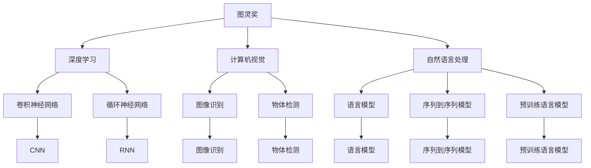

                 

# 图灵奖与AI算法的突破

## 1. 背景介绍

### 1.1 问题由来

图灵奖（Turing Award）是计算机科学界的最高荣誉，旨在奖励那些在计算机领域做出重大贡献的科学家和工程师。自从1966年设立以来，图灵奖已经成为全球计算技术发展的风向标，无数伟大的算法和理论被该奖项所认可。

在过去的几十年里，人工智能（AI）技术快速发展，特别是深度学习（Deep Learning）、自然语言处理（NLP）和计算机视觉等领域取得了巨大突破。这些技术的突破不仅仅体现在算法和架构上，更体现在算法设计和实现的突破上。本文将从图灵奖获奖者的工作出发，探索AI算法突破背后的关键原理和技术，为读者提供一个深入理解这些技术的机会。

### 1.2 问题核心关键点

图灵奖之所以成为计算机科学界的最高荣誉，是因为它奖励那些在算法和理论方面做出巨大贡献的科学家和工程师。而AI算法的发展离不开这些奖项的推动和认可。图灵奖获奖者的工作，不仅为AI算法的发展提供了重要的理论和实践指导，更为未来AI技术的发展指明了方向。

## 2. 核心概念与联系

### 2.1 核心概念概述

为更好地理解图灵奖与AI算法突破之间的联系，本节将介绍几个密切相关的核心概念：

- **图灵奖**：计算机科学领域的最高荣誉，旨在奖励那些在计算机理论和技术上做出杰出贡献的科学家和工程师。
- **AI算法**：包括深度学习、自然语言处理、计算机视觉等领域内用于解决具体问题的算法，如卷积神经网络（CNN）、循环神经网络（RNN）、长短期记忆网络（LSTM）、生成对抗网络（GAN）等。
- **计算机视觉**：研究如何让计算机“看”的能力，包括图像识别、物体检测、图像生成等。
- **自然语言处理**：研究如何让计算机“理解”和“生成”自然语言，包括语言模型、序列到序列模型、预训练语言模型等。
- **深度学习**：一种基于人工神经网络的机器学习技术，通过多层次的特征提取和抽象，实现对复杂问题的处理。

这些核心概念之间的逻辑关系可以通过以下Mermaid流程图来展示：



这个流程图展示了这个领域内各个核心概念之间的关系：

1. 图灵奖奖励的是在算法和理论方面做出杰出贡献的科学家和工程师。
2. AI算法包括深度学习、计算机视觉和自然语言处理等多个方向。
3. 深度学习中的关键算法包括卷积神经网络、循环神经网络和生成对抗网络等。
4. 计算机视觉和自然语言处理是深度学习的重要应用领域。

这些概念共同构成了AI算法发展的核心框架，为我们理解AI算法的突破提供了重要参考。

## 3. 核心算法原理 & 具体操作步骤

### 3.1 算法原理概述

图灵奖获奖者的工作在AI算法的发展中起到了关键作用。从最初的深度学习模型到最新的自监督学习技术，这些工作不仅推动了AI算法的突破，也为未来AI技术的发展提供了重要基础。

深度学习模型通过多层次的特征提取和抽象，实现对复杂问题的处理。在计算机视觉领域，卷积神经网络（CNN）和循环神经网络（RNN）成为了图像和序列数据处理的主流方法。在自然语言处理领域，语言模型、序列到序列模型和预训练语言模型等技术推动了NLP任务的突破。

图灵奖的获奖者，如Yann LeCun、Geoffrey Hinton和Yoshua Bengio，对深度学习模型的理论基础和实际应用做出了重要贡献。他们的工作不仅推动了深度学习模型在计算机视觉和自然语言处理中的应用，也为后续的算法改进和理论创新奠定了基础。

### 3.2 算法步骤详解

以深度学习模型的构建和训练为例，介绍AI算法的具体操作步骤：

**Step 1: 数据预处理**

1. **数据采集**：收集所需数据集，并进行数据清洗和标注。例如，对于计算机视觉任务，需要收集包含图像和标签的数据集。

2. **数据增强**：对数据集进行增强，如旋转、缩放、翻转等操作，以增加数据的多样性。

**Step 2: 模型构建**

1. **选择模型架构**：根据任务需求选择合适的模型架构，如CNN、RNN、LSTM等。

2. **设计模型结构**：设计模型的输入、隐藏层和输出层，以及各个层之间的连接方式。

**Step 3: 模型训练**

1. **选择损失函数**：根据任务类型选择合适的损失函数，如均方误差、交叉熵等。

2. **选择优化器**：选择合适的优化器，如SGD、Adam等，并设置学习率、批大小等参数。

3. **模型训练**：使用训练数据集对模型进行训练，通过前向传播和反向传播更新模型参数。

**Step 4: 模型评估**

1. **选择评估指标**：根据任务类型选择合适的评估指标，如准确率、召回率等。

2. **模型评估**：使用测试数据集对模型进行评估，获取模型的性能指标。

**Step 5: 模型应用**

1. **部署模型**：将训练好的模型部署到实际应用场景中，如移动应用、云服务等。

2. **优化模型**：根据实际应用中的反馈，对模型进行优化和调整。

### 3.3 算法优缺点

深度学习模型在AI算法中的应用具有以下优点：

1. **处理复杂问题**：深度学习模型通过多层次的特征提取和抽象，能够处理复杂的非线性问题。

2. **高效性**：深度学习模型在训练和推理时，具有较高的效率和速度。

3. **可解释性**：深度学习模型通常具备较好的可解释性，能够通过可视化等手段展示模型的特征和决策过程。

4. **应用广泛**：深度学习模型在计算机视觉、自然语言处理、语音识别等多个领域得到了广泛应用。

同时，深度学习模型也存在以下缺点：

1. **数据需求高**：深度学习模型通常需要大量的标注数据进行训练，获取高质量数据集的成本较高。

2. **计算资源要求高**：深度学习模型通常需要强大的计算资源进行训练和推理，增加了成本和复杂度。

3. **过拟合风险**：深度学习模型容易出现过拟合现象，需要通过正则化等技术进行缓解。

4. **可解释性不足**：深度学习模型往往被视为"黑盒"，难以解释其内部工作机制和决策逻辑。

尽管存在这些缺点，但深度学习模型在AI算法中的应用仍然广泛，特别是在处理复杂问题和高效性方面具有显著优势。未来，随着技术的发展和优化，这些缺点有望得到进一步改善。

### 3.4 算法应用领域

深度学习模型在AI算法中的应用非常广泛，涉及计算机视觉、自然语言处理、语音识别等多个领域。以下是几个典型的应用场景：

- **计算机视觉**：包括图像分类、物体检测、图像生成等任务。深度学习模型通过卷积神经网络（CNN）和生成对抗网络（GAN）等方法，实现对图像数据的处理和分析。

- **自然语言处理**：包括文本分类、机器翻译、文本生成等任务。深度学习模型通过循环神经网络（RNN）、长短期记忆网络（LSTM）和预训练语言模型等方法，实现对自然语言数据的处理和分析。

- **语音识别**：包括语音转文本、语音识别等任务。深度学习模型通过卷积神经网络（CNN）和循环神经网络（RNN）等方法，实现对语音数据的处理和分析。

除了上述这些经典应用外，深度学习模型还被创新性地应用于医学图像分析、推荐系统、智能客服等领域，推动了这些领域的智能化和自动化进程。

## 4. 数学模型和公式 & 详细讲解 & 举例说明

### 4.1 数学模型构建

深度学习模型通常由多层神经网络组成，每层网络包含若干个神经元，用于提取和抽象输入数据的高层次特征。以下是深度学习模型的一般数学模型构建过程：

1. **输入层**：将原始数据映射为模型输入，通常是一个向量。

2. **隐藏层**：包含多个神经元，用于提取输入数据的高层次特征。

3. **输出层**：根据任务需求，将隐藏层的输出映射为模型输出。

以卷积神经网络（CNN）为例，其数学模型可以表示为：

$$
f(x) = W^TF(x) + b
$$

其中，$f(x)$ 表示模型的输出，$x$ 表示输入，$W$ 和 $b$ 表示模型的权重和偏置，$F(x)$ 表示卷积核对输入数据的卷积操作。

### 4.2 公式推导过程

以卷积神经网络（CNN）为例，介绍其核心公式的推导过程：

**卷积操作**

卷积操作是CNN中最重要的部分，其公式可以表示为：

$$
F(x) = \sum_k \sum_l w_{k,l}x_{i-l,j-k}
$$

其中，$x_{i,j}$ 表示输入数据，$w_{k,l}$ 表示卷积核的权重，$i$ 和 $j$ 表示卷积核在输入数据上的位置。

**池化操作**

池化操作用于减小卷积核的输出尺寸，常用的池化操作包括最大池化和平均池化，其公式可以表示为：

$$
P(x) = \max(x) \text{ or } \frac{1}{n}\sum_k x_k
$$

其中，$P(x)$ 表示池化操作后的输出，$x$ 表示输入数据，$n$ 表示输入数据的尺寸。

**前向传播**

前向传播是CNN的核心部分，其公式可以表示为：

$$
f(x) = \sum_k \sum_l w_{k,l}F_k(x) + b
$$

其中，$f(x)$ 表示模型的输出，$F_k(x)$ 表示第 $k$ 层卷积操作的结果，$w_{k,l}$ 和 $b$ 表示第 $k$ 层的权重和偏置。

**反向传播**

反向传播是CNN训练的核心部分，其公式可以表示为：

$$
\frac{\partial L}{\partial w_{k,l}} = \sum_i \sum_j \frac{\partial L}{\partial o_i} \frac{\partial o_i}{\partial h_j} \frac{\partial h_j}{\partial w_{k,l}}
$$

其中，$L$ 表示损失函数，$o_i$ 表示第 $i$ 个神经元的输出，$h_j$ 表示第 $j$ 个神经元的输入，$\frac{\partial o_i}{\partial h_j}$ 表示第 $i$ 个神经元对第 $j$ 个神经元的激活函数导数。

### 4.3 案例分析与讲解

以图像分类任务为例，分析CNN的训练和推理过程：

**训练过程**

1. **数据集准备**：收集包含图像和标签的数据集，并进行数据增强和预处理。

2. **模型构建**：构建一个包含若干卷积层、池化层和全连接层的CNN模型。

3. **损失函数选择**：选择交叉熵损失函数，用于衡量模型输出与真实标签之间的差异。

4. **模型训练**：使用训练数据集对模型进行训练，通过反向传播更新模型参数。

**推理过程**

1. **数据预处理**：将测试数据集进行预处理，包括图像缩放、归一化等操作。

2. **模型推理**：使用训练好的CNN模型对测试数据进行推理，得到分类结果。

3. **评估指标**：根据测试数据集的评估指标，如准确率、召回率等，评估模型的性能。

## 5. 项目实践：代码实例和详细解释说明

### 5.1 开发环境搭建

在进行深度学习模型训练和推理时，需要搭建一个高性能的开发环境。以下是搭建深度学习开发环境的基本步骤：

1. **安装Python**：从官网下载并安装Python，安装版本为3.8或更高版本。

2. **安装PyTorch**：使用以下命令安装PyTorch：

   ```bash
   pip install torch torchvision torchaudio
   ```

3. **安装TensorFlow**：使用以下命令安装TensorFlow：

   ```bash
   pip install tensorflow
   ```

4. **安装其他库**：安装其他常用的深度学习库，如NumPy、Pandas、Matplotlib等。

5. **设置环境变量**：在Python环境中设置环境变量，如设置Python路径、环境变量等。

完成上述步骤后，即可在本地搭建一个高性能的深度学习开发环境。

### 5.2 源代码详细实现

以下是使用PyTorch框架实现CNN模型的Python代码：

```python
import torch
import torch.nn as nn
import torch.optim as optim
import torchvision.datasets as datasets
import torchvision.transforms as transforms

# 定义CNN模型
class CNN(nn.Module):
    def __init__(self):
        super(CNN, self).__init__()
        self.conv1 = nn.Conv2d(3, 32, 3, 1)
        self.pool = nn.MaxPool2d(2, 2)
        self.conv2 = nn.Conv2d(32, 64, 3, 1)
        self.fc1 = nn.Linear(64 * 6 * 6, 120)
        self.fc2 = nn.Linear(120, 84)
        self.fc3 = nn.Linear(84, 10)

    def forward(self, x):
        x = self.pool(nn.functional.relu(self.conv1(x)))
        x = self.pool(nn.functional.relu(self.conv2(x)))
        x = x.view(-1, 64 * 6 * 6)
        x = nn.functional.relu(self.fc1(x))
        x = nn.functional.relu(self.fc2(x))
        x = self.fc3(x)
        return x

# 加载数据集
train_dataset = datasets.CIFAR10(root='./data', train=True, download=True, transform=transforms.ToTensor())
test_dataset = datasets.CIFAR10(root='./data', train=False, download=True, transform=transforms.ToTensor())

# 定义数据加载器
train_loader = torch.utils.data.DataLoader(train_dataset, batch_size=64, shuffle=True)
test_loader = torch.utils.data.DataLoader(test_dataset, batch_size=64, shuffle=False)

# 定义模型、优化器和损失函数
model = CNN()
criterion = nn.CrossEntropyLoss()
optimizer = optim.Adam(model.parameters(), lr=0.001)

# 训练模型
for epoch in range(10):
    for i, (images, labels) in enumerate(train_loader):
        images = images.view(-1, 3, 32, 32)
        optimizer.zero_grad()
        outputs = model(images)
        loss = criterion(outputs, labels)
        loss.backward()
        optimizer.step()
        if (i + 1) % 100 == 0:
            print('Epoch [%d/%d], Step [%d/%d], Loss: %.4f' %
                  (epoch + 1, 10, i + 1, len(train_loader), loss.item()))

# 测试模型
correct = 0
total = 0
with torch.no_grad():
    for images, labels in test_loader:
        images = images.view(-1, 3, 32, 32)
        outputs = model(images)
        _, predicted = torch.max(outputs.data, 1)
        total += labels.size(0)
        correct += (predicted == labels).sum().item()

print('Accuracy of the network on the 10000 test images: %d %%' % (
    100 * correct / total))
```

### 5.3 代码解读与分析

以下是代码中关键部分的解读和分析：

**数据预处理**

1. **数据集准备**：使用`CIFAR10`数据集，并进行预处理，将图像转换为Tensor类型。

2. **数据加载器**：使用`DataLoader`对数据集进行批次化加载，以便模型训练。

**模型构建**

1. **CNN模型定义**：定义一个包含卷积层、池化层和全连接层的CNN模型。

2. **损失函数和优化器**：选择交叉熵损失函数和Adam优化器。

**模型训练**

1. **前向传播**：对训练数据进行前向传播，计算损失函数。

2. **反向传播**：对模型进行反向传播，更新模型参数。

**模型测试**

1. **测试数据加载**：对测试数据进行加载，进行模型推理。

2. **评估指标**：计算模型在测试数据集上的准确率。

## 6. 实际应用场景

### 6.1 智能图像识别

图像识别是深度学习模型在计算机视觉领域的重要应用之一，广泛应用于安防监控、自动驾驶、医疗诊断等领域。通过深度学习模型，可以自动识别图像中的物体、人脸、场景等，实现智能化管理和服务。

在智能安防监控领域，深度学习模型可以通过卷积神经网络（CNN）对监控视频中的图像进行实时分析，识别出可疑人物和行为，提高安防系统的智能度和安全性。

在自动驾驶领域，深度学习模型可以通过图像识别技术，自动识别道路标志、交通信号灯等，辅助驾驶决策，提高驾驶安全性。

在医疗诊断领域，深度学习模型可以通过图像识别技术，自动识别医学影像中的病变区域，辅助医生进行诊断和治疗决策。

### 6.2 自然语言处理

自然语言处理是深度学习模型在自然语言领域的重要应用之一，广泛应用于机器翻译、文本生成、语音识别等领域。通过深度学习模型，可以实现对自然语言的高效处理和生成。

在机器翻译领域，深度学习模型可以通过序列到序列（Seq2Seq）模型，实现不同语言之间的翻译，提升翻译的质量和效率。

在文本生成领域，深度学习模型可以通过生成对抗网络（GAN）和语言模型等技术，实现文本的自动生成和摘要，提升内容创作和编辑的速度和质量。

在语音识别领域，深度学习模型可以通过卷积神经网络（CNN）和循环神经网络（RNN）等技术，实现语音信号的特征提取和识别，提升语音识别的准确率和鲁棒性。

## 7. 工具和资源推荐

### 7.1 学习资源推荐

为了帮助开发者系统掌握深度学习模型的理论基础和实践技巧，这里推荐一些优质的学习资源：

1. **深度学习入门**：斯坦福大学开设的《CS231n: Convolutional Neural Networks for Visual Recognition》课程，介绍了深度学习模型在计算机视觉中的应用。

2. **自然语言处理入门**：斯坦福大学开设的《CS224N: Natural Language Processing with Deep Learning》课程，介绍了深度学习模型在自然语言处理中的应用。

3. **深度学习框架**：TensorFlow和PyTorch等深度学习框架的官方文档和教程，提供了丰富的学习资源和实践样例。

4. **深度学习书籍**：《深度学习》（Ian Goodfellow）、《神经网络与深度学习》（Michael Nielsen）等经典书籍，详细介绍了深度学习模型的理论基础和实践技巧。

5. **深度学习社区**：Kaggle、GitHub等深度学习社区，提供了大量的深度学习模型和代码资源，方便开发者学习和交流。

通过对这些资源的学习实践，相信你一定能够快速掌握深度学习模型的精髓，并用于解决实际的AI问题。

### 7.2 开发工具推荐

高效的开发离不开优秀的工具支持。以下是几款用于深度学习模型开发的常用工具：

1. **Python**：深度学习模型开发的首选语言，具有丰富的库和框架支持。

2. **PyTorch**：由Facebook开发的深度学习框架，提供了动态计算图和丰富的模型库，适合快速迭代研究和实验。

3. **TensorFlow**：由Google开发的深度学习框架，提供了静态计算图和分布式训练支持，适合大规模工程应用。

4. **Jupyter Notebook**：用于编写和分享代码的交互式编程环境，支持Python和R等语言。

5. **GitHub**：代码托管平台，支持代码版本控制和协作开发。

6. **Google Colab**：Google提供的免费Jupyter Notebook环境，支持GPU和TPU等高性能计算资源。

合理利用这些工具，可以显著提升深度学习模型的开发效率，加快创新迭代的步伐。

### 7.3 相关论文推荐

深度学习模型的发展离不开学界的持续研究。以下是几篇奠基性的相关论文，推荐阅读：

1. **AlexNet**：深度学习模型的经典之作，引入了卷积神经网络（CNN）和最大池化操作。

2. **Inception**：提出Inception模块，增强了深度学习模型在图像识别任务中的性能。

3. **ResNet**：提出残差网络（ResNet），通过残差连接解决了深度学习模型中的梯度消失问题。

4. **RNN**：提出了循环神经网络（RNN）和长短期记忆网络（LSTM），用于处理序列数据。

5. **Seq2Seq**：提出了序列到序列（Seq2Seq）模型，用于处理序列到序列的任务，如机器翻译和文本生成。

这些论文代表了大深度学习模型的发展脉络，通过学习这些前沿成果，可以帮助研究者把握学科前进方向，激发更多的创新灵感。

## 8. 总结：未来发展趋势与挑战

### 8.1 总结

本文对深度学习模型和图灵奖获奖者的工作进行了全面系统的介绍。首先阐述了深度学习模型在AI算法中的重要地位，明确了图灵奖对算法和理论研究的推动作用。其次，从原理到实践，详细讲解了深度学习模型的数学模型构建和核心算法原理，给出了深度学习模型的完整代码实例。同时，本文还广泛探讨了深度学习模型在图像识别、自然语言处理等领域的实际应用场景，展示了深度学习模型的广泛应用前景。此外，本文精选了深度学习模型的各类学习资源，力求为读者提供全方位的技术指引。

通过本文的系统梳理，可以看到，深度学习模型在AI算法中的重要地位和广泛应用，图灵奖对算法和理论研究的推动作用，以及深度学习模型的未来发展趋势和面临的挑战。这些内容不仅有助于读者深入理解深度学习模型的核心原理和实践技巧，也为我们未来的研究和应用提供了方向指引。

### 8.2 未来发展趋势

展望未来，深度学习模型在AI算法中的应用将呈现以下几个发展趋势：

1. **多模态深度学习**：深度学习模型将进一步扩展到多模态数据，如图像、语音、文本等，实现跨模态信息的融合和协同建模。

2. **自监督学习**：深度学习模型将更多地利用无标签数据进行预训练，减少对标注数据的依赖，提升模型的泛化能力和鲁棒性。

3. **小样本学习**：深度学习模型将更多地研究小样本学习（Few-shot Learning）和零样本学习（Zero-shot Learning）技术，提升模型在少量数据下的适应能力。

4. **增强学习**：深度学习模型将更多地研究增强学习（Reinforcement Learning）技术，提升模型在复杂环境中的决策能力和鲁棒性。

5. **联邦学习**：深度学习模型将更多地研究联邦学习（Federated Learning）技术，提升模型在分布式数据环境中的训练和推理能力。

以上趋势凸显了深度学习模型在AI算法中的重要地位和广泛应用前景，这些方向的探索发展，必将进一步推动深度学习模型的进步，为未来AI技术的发展提供重要支撑。

### 8.3 面临的挑战

尽管深度学习模型在AI算法中的应用取得了显著成效，但在迈向更加智能化、普适化应用的过程中，仍面临诸多挑战：

1. **数据需求高**：深度学习模型通常需要大量的标注数据进行训练，获取高质量数据集的成本较高。

2. **计算资源要求高**：深度学习模型通常需要强大的计算资源进行训练和推理，增加了成本和复杂度。

3. **过拟合风险**：深度学习模型容易出现过拟合现象，需要通过正则化等技术进行缓解。

4. **可解释性不足**：深度学习模型往往被视为"黑盒"，难以解释其内部工作机制和决策逻辑。

5. **安全性问题**：深度学习模型在应用过程中可能存在安全漏洞和隐私风险，如数据泄露、模型攻击等。

6. **公平性问题**：深度学习模型可能存在偏见和歧视，需要进行公平性测试和优化。

正视深度学习模型面临的这些挑战，积极应对并寻求突破，将深度学习模型推向更加智能化、普适化的应用场景。相信随着学界和产业界的共同努力，这些挑战终将一一被克服，深度学习模型必将在构建智能社会中扮演越来越重要的角色。

### 8.4 研究展望

面对深度学习模型面临的挑战，未来的研究需要在以下几个方面寻求新的突破：

1. **数据增强技术**：开发更加高效的数据增强技术，提升深度学习模型的泛化能力和鲁棒性。

2. **模型压缩技术**：开发更加高效的模型压缩技术，减少深度学习模型的计算资源需求。

3. **解释性研究**：研究更加可解释的深度学习模型，提升模型的透明度和可信度。

4. **安全隐私保护**：研究更加安全的深度学习模型，保护数据隐私和安全。

5. **公平性研究**：研究更加公平的深度学习模型，消除模型的偏见和歧视。

这些研究方向的探索，必将引领深度学习模型迈向更高的台阶，为构建安全、可靠、可解释、可控的智能系统铺平道路。面向未来，深度学习模型还需要与其他人工智能技术进行更深入的融合，如知识表示、因果推理、强化学习等，多路径协同发力，共同推动深度学习模型的发展和进步。

## 9. 附录：常见问题与解答

**Q1: 深度学习模型的训练和推理流程是怎样的？**

A: 深度学习模型的训练和推理流程主要包括以下几个步骤：

1. **数据预处理**：对原始数据进行预处理，如归一化、标准化、数据增强等。

2. **模型构建**：根据任务需求选择合适的模型架构，如CNN、RNN等。

3. **模型训练**：使用训练数据集对模型进行训练，通过前向传播和反向传播更新模型参数。

4. **模型推理**：使用测试数据集对模型进行推理，得到模型预测结果。

**Q2: 深度学习模型有哪些应用场景？**

A: 深度学习模型在AI算法中的应用非常广泛，涉及计算机视觉、自然语言处理、语音识别等多个领域。以下是几个典型的应用场景：

1. **计算机视觉**：包括图像分类、物体检测、图像生成等任务。

2. **自然语言处理**：包括文本分类、机器翻译、文本生成等任务。

3. **语音识别**：包括语音转文本、语音识别等任务。

4. **推荐系统**：包括基于用户行为的推荐、基于内容的推荐等任务。

5. **医疗诊断**：包括医学影像分析、疾病预测等任务。

**Q3: 如何缓解深度学习模型的过拟合问题？**

A: 深度学习模型容易出现过拟合现象，需要通过正则化等技术进行缓解。常用的缓解过拟合的方法包括：

1. **L2正则化**：在损失函数中加入L2正则化项，防止模型参数过大。

2. **Dropout**：在训练过程中随机丢弃一部分神经元，防止模型对某些特征过度依赖。

3. **Early Stopping**：在模型训练过程中，根据验证集性能进行提前停止，防止模型过度拟合。

4. **数据增强**：通过数据增强技术，如图像旋转、缩放、翻转等操作，增加训练数据的多样性。

5. **模型简化**：通过简化模型结构、减少参数数量等手段，降低模型复杂度。

这些方法可以综合使用，根据具体任务和数据特点进行灵活选择。

**Q4: 深度学习模型有哪些发展趋势？**

A: 深度学习模型在AI算法中的未来发展趋势主要包括以下几个方面：

1. **多模态深度学习**：深度学习模型将进一步扩展到多模态数据，如图像、语音、文本等，实现跨模态信息的融合和协同建模。

2. **自监督学习**：深度学习模型将更多地利用无标签数据进行预训练，减少对标注数据的依赖，提升模型的泛化能力和鲁棒性。

3. **小样本学习**：深度学习模型将更多地研究小样本学习（Few-shot Learning）和零样本学习（Zero-shot Learning）技术，提升模型在少量数据下的适应能力。

4. **增强学习**：深度学习模型将更多地研究增强学习（Reinforcement Learning）技术，提升模型在复杂环境中的决策能力和鲁棒性。

5. **联邦学习**：深度学习模型将更多地研究联邦学习（Federated Learning）技术，提升模型在分布式数据环境中的训练和推理能力。

这些趋势凸显了深度学习模型在AI算法中的重要地位和广泛应用前景，这些方向的探索发展，必将进一步推动深度学习模型的进步，为未来AI技术的发展提供重要支撑。

**Q5: 深度学习模型在应用过程中有哪些风险？**

A: 深度学习模型在应用过程中可能存在以下风险：

1. **数据隐私风险**：深度学习模型在处理敏感数据时，可能存在数据泄露和隐私风险。

2. **模型攻击风险**：深度学习模型可能受到对抗样本攻击，导致模型输出错误。

3. **公平性问题**：深度学习模型可能存在偏见和歧视，需要进行公平性测试和优化。

4. **可解释性问题**：深度学习模型往往被视为"黑盒"，难以解释其内部工作机制和决策逻辑。

5. **鲁棒性问题**：深度学习模型在面对新数据时，可能出现泛化能力不足的问题。

这些风险需要在使用深度学习模型时进行全面考虑，并采取相应的风险管理措施。

---

作者：禅与计算机程序设计艺术 / Zen and the Art of Computer Programming

