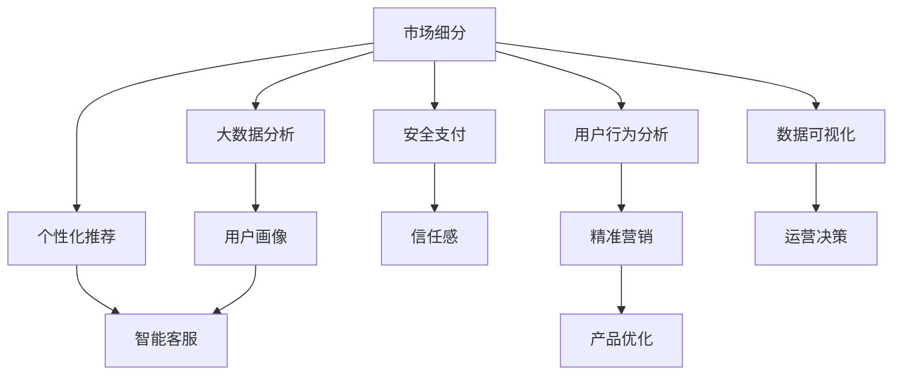

                 

# 垂直电商创业：细分市场的精准服务

> 关键词：
垂直电商、市场细分、精准服务、大数据分析、人工智能、个性化推荐、智能客服、安全支付、用户行为分析

## 1. 背景介绍

### 1.1 问题由来

随着互联网的普及和电商平台的快速发展，线上购物已成为人们日常生活的重要组成部分。传统电商平台的泛泛之众往往无法满足用户对商品多样性、购物体验个性化、购物过程便捷化的需求。垂直电商应运而生，以特定细分市场（如母婴、美妆、服饰等）为目标，提供更精准、专业、高效的购物体验。

### 1.2 问题核心关键点

垂直电商的核心在于对市场进行细分，针对特定细分市场提供精准服务。具体而言，包括以下几个关键点：

1. **市场细分**：通过数据分析和用户画像技术，将大市场划分为不同的小市场。
2. **精准服务**：基于细分市场特点，提供个性化的商品推荐、定制化的购物体验和高效的售后服务。
3. **大数据分析**：利用大数据分析技术，获取用户行为、偏好等信息，为精准服务提供支持。
4. **人工智能应用**：引入AI技术，提升个性化推荐、智能客服、智能搜索等功能的准确性和效率。
5. **安全支付**：确保交易过程安全、透明，提升用户信任感。
6. **用户行为分析**：通过数据分析，深入了解用户行为和需求，实现精准营销和产品优化。

## 2. 核心概念与联系

### 2.1 核心概念概述

为更好地理解垂直电商的精准服务，本节将介绍几个关键概念：

- **垂直电商（Vertical E-commerce）**：以特定行业或细分市场为目标，提供专业化、精细化的电商服务。如母婴垂直电商、美妆垂直电商等。
- **市场细分（Market Segmentation）**：将大市场按照某种标准划分为不同的小市场，以便更好地提供精准服务。
- **个性化推荐（Personalized Recommendation）**：根据用户的历史行为、兴趣等信息，为其推荐最适合的商品或服务。
- **智能客服（AI Customer Service）**：利用AI技术，自动处理用户咨询，提供24小时不间断的客户服务。
- **安全支付（Secure Payment）**：通过技术手段，确保支付过程的安全性和透明度。
- **用户行为分析（User Behavior Analysis）**：通过数据分析，了解用户行为模式，优化商品推荐和广告投放。

这些概念之间存在着紧密的联系，通过市场细分，我们可以更好地了解细分市场的需求，进而提供精准服务。大数据分析和人工智能技术的引入，进一步提升了服务质量和效率。同时，安全支付和用户行为分析保证了电商平台的健康发展。

### 2.2 核心概念原理和架构的 Mermaid 流程图



这个流程图展示了垂直电商中各核心概念之间的联系和作用。市场细分是大数据分析和用户画像的基础，而个性化推荐、智能客服、安全支付、用户行为分析等都是基于细分市场和用户画像进行的服务模块。数据可视化则通过直观的数据呈现，辅助运营决策，进一步优化产品和服务。

## 3. 核心算法原理 & 具体操作步骤

### 3.1 算法原理概述

垂直电商的精准服务主要依赖于市场细分、大数据分析和人工智能技术。其中，算法原理如下：

- **市场细分算法**：通过聚类算法、关联规则挖掘等方法，将大市场划分为不同的小市场。
- **个性化推荐算法**：利用协同过滤、基于内容的推荐、深度学习等算法，为用户提供个性化的商品推荐。
- **智能客服算法**：通过自然语言处理和机器学习技术，实现对用户咨询的自动理解和响应。
- **安全支付算法**：采用加密技术、风险控制等手段，确保支付过程的安全性和可信度。
- **用户行为分析算法**：通过统计分析、时间序列分析、深度学习等技术，挖掘用户行为特征，预测用户需求。

### 3.2 算法步骤详解

#### 3.2.1 市场细分

**Step 1: 数据收集**  
收集与目标市场相关的各种数据，如用户行为数据、商品销售数据、市场调查数据等。

**Step 2: 数据预处理**  
对收集到的数据进行清洗、去重、归一化等预处理工作。

**Step 3: 特征工程**  
提取和选择有意义的特征，如用户购买频率、浏览时长、地区等，为聚类算法提供输入。

**Step 4: 聚类分析**  
使用K-means、层次聚类等聚类算法，将大市场划分为不同的小市场。

**Step 5: 验证评估**  
使用轮廓系数、Silhouette系数等评估指标，评估聚类效果，调整算法参数。

#### 3.2.2 个性化推荐

**Step 1: 数据收集**  
收集用户行为数据、商品属性数据等，作为推荐模型的输入。

**Step 2: 模型训练**  
使用协同过滤、基于内容的推荐、深度学习等算法，训练个性化推荐模型。

**Step 3: 特征工程**  
提取和选择对推荐效果有显著影响的特征，如用户历史行为、商品特征等。

**Step 4: 模型评估**  
使用准确率、召回率、F1-score等指标，评估推荐效果，调整模型参数。

#### 3.2.3 智能客服

**Step 1: 数据收集**  
收集用户咨询数据、历史问答记录等，作为智能客服模型的输入。

**Step 2: 模型训练**  
使用自然语言处理和机器学习技术，训练智能客服模型。

**Step 3: 特征工程**  
提取和选择对回答效果有显著影响的特征，如问题类型、用户情绪等。

**Step 4: 模型评估**  
使用BLEU、ROUGE等指标，评估回答效果，调整模型参数。

#### 3.2.4 安全支付

**Step 1: 数据收集**  
收集支付交易数据、用户行为数据等，作为安全支付模型的输入。

**Step 2: 模型训练**  
使用加密技术、风险控制等手段，训练安全支付模型。

**Step 3: 特征工程**  
提取和选择对支付安全性有显著影响的特征，如支付金额、用户信用评分等。

**Step 4: 模型评估**  
使用安全性、可靠性等指标，评估支付模型效果，调整模型参数。

#### 3.2.5 用户行为分析

**Step 1: 数据收集**  
收集用户行为数据、商品销售数据等，作为用户行为分析模型的输入。

**Step 2: 模型训练**  
使用统计分析、时间序列分析、深度学习等技术，训练用户行为分析模型。

**Step 3: 特征工程**  
提取和选择对用户行为有显著影响的特征，如用户购买频率、浏览路径等。

**Step 4: 模型评估**  
使用预测准确率、用户满意度等指标，评估用户行为分析效果，调整模型参数。

### 3.3 算法优缺点

#### 3.3.1 市场细分

**优点**：  
1. 提高精准服务水平，满足不同细分市场的需求。  
2. 提升运营效率，降低成本。  
3. 增强用户粘性，提高用户满意度。

**缺点**：  
1. 数据收集和处理复杂，工作量大。  
2. 聚类算法对初始参数敏感，容易陷入局部最优解。  
3. 市场细分结果可能存在噪声，影响后续分析。

#### 3.3.2 个性化推荐

**优点**：  
1. 提高用户满意度，提升转化率。  
2. 增加用户粘性，提升复购率。  
3. 优化库存管理，减少库存积压。

**缺点**：  
1. 数据量巨大，对计算资源要求高。  
2. 个性化推荐可能存在冷启动问题，初期效果不佳。  
3. 推荐模型复杂，调整参数难度大。

#### 3.3.3 智能客服

**优点**：  
1. 提高用户满意度，减少人工客服成本。  
2. 实现24小时不间断服务，提升用户体验。  
3. 快速处理用户咨询，提高运营效率。

**缺点**：  
1. 需要大量标注数据，数据收集困难。  
2. 自然语言处理技术复杂，模型训练难度大。  
3. 用户咨询多样性大，模型需要不断更新迭代。

#### 3.3.4 安全支付

**优点**：  
1. 提高支付安全性，增强用户信任。  
2. 减少欺诈风险，降低损失。  
3. 提升支付效率，减少等待时间。

**缺点**：  
1. 技术实现复杂，开发难度大。  
2. 需要频繁更新支付算法，增加开发成本。  
3. 用户对新技术接受度低，可能需要一定的推广和教育。

#### 3.3.5 用户行为分析

**优点**：  
1. 提高运营效率，优化营销策略。  
2. 深入了解用户需求，提升商品和服务质量。  
3. 预测用户行为，实现精准营销。

**缺点**：  
1. 数据处理量大，对计算资源要求高。  
2. 用户行为复杂，模型需要不断优化。  
3. 分析结果需要定期更新，保持时效性。

### 3.4 算法应用领域

基于垂直电商的精准服务，以下算法已经在多个领域得到了广泛应用：

- **市场细分**：应用于零售、电商、广告等，根据用户画像和行为数据，细分市场并优化资源配置。
- **个性化推荐**：应用于商品推荐、内容推荐、广告推荐等，提升用户体验和转化率。
- **智能客服**：应用于电商客服、在线客服、智能助手等，提高用户满意度和运营效率。
- **安全支付**：应用于金融支付、在线交易、电商平台等，确保支付过程的安全性和可信度。
- **用户行为分析**：应用于用户行为分析、市场营销、产品优化等，深入了解用户需求，优化产品和服务。

这些算法在不同场景下的应用，展示了垂直电商精准服务的强大能力，为用户带来了更优质的购物体验。

## 4. 数学模型和公式 & 详细讲解  
### 4.1 数学模型构建

#### 4.1.1 市场细分

假设市场分为 $K$ 个细分市场，市场规模分别为 $N_1, N_2, \ldots, N_K$，用户行为特征矩阵为 $X \in \mathbb{R}^{N \times D}$，其中 $N$ 为总用户数，$D$ 为特征维度。使用K-means算法对用户行为数据进行聚类，得到 $K$ 个聚类中心 $C_k \in \mathbb{R}^D$。则市场细分结果为：

$$
\min_{\mathbf{Z} \in \{0,1\}^{N \times K}} \sum_{i=1}^N \sum_{k=1}^K Z_{ik} \log \frac{N_k}{N}
$$

其中，$Z_{ik}$ 为第 $i$ 个用户属于第 $k$ 个细分市场的标签。

#### 4.1.2 个性化推荐

假设用户行为数据为 $X \in \mathbb{R}^{N \times D}$，商品属性数据为 $M \in \mathbb{R}^{M \times S}$，用户历史行为矩阵为 $R \in \mathbb{R}^{N \times M}$。使用协同过滤算法，得到用户对商品的评分矩阵 $\hat{R} \in \mathbb{R}^{N \times M}$。

$$
\hat{R}_{ui} = \alpha \sum_{j=1}^M R_{uj} \frac{c_j}{\sqrt{\sum_{i=1}^N R_{ij}^2} \sqrt{\sum_{k=1}^M M_{ki}^2}}
$$

其中，$c_j$ 为第 $j$ 个商品的平均评分。

#### 4.1.3 智能客服

假设用户咨询数据为 $X \in \mathbb{R}^{N \times D}$，历史问答记录为 $M \in \mathbb{R}^{N \times S}$。使用自然语言处理和机器学习技术，得到智能客服模型 $S \in \mathbb{R}^{D \times S}$。

$$
S_{ij} = \alpha \sum_{k=1}^K Z_{ik} \frac{\log \sigma(S_{ik})}{\log \sigma(S_{ij})}
$$

其中，$\sigma(\cdot)$ 为 sigmoid 函数，$Z_{ik}$ 为第 $i$ 个用户属于第 $k$ 个细分市场的标签。

#### 4.1.4 安全支付

假设支付交易数据为 $X \in \mathbb{R}^{N \times D}$，用户行为数据为 $Y \in \mathbb{R}^{N \times D}$。使用加密技术和风险控制算法，得到安全支付模型 $T \in \mathbb{R}^{D \times D}$。

$$
T_{ij} = \alpha \sum_{k=1}^K Z_{ik} \frac{\log \sigma(T_{ik})}{\log \sigma(T_{ij})}
$$

其中，$\sigma(\cdot)$ 为 sigmoid 函数，$Z_{ik}$ 为第 $i$ 个用户属于第 $k$ 个细分市场的标签。

#### 4.1.5 用户行为分析

假设用户行为数据为 $X \in \mathbb{R}^{N \times D}$，商品销售数据为 $M \in \mathbb{R}^{M \times S}$。使用统计分析、时间序列分析和深度学习技术，得到用户行为分析模型 $A \in \mathbb{R}^{D \times S}$。

$$
A_{ij} = \alpha \sum_{k=1}^K Z_{ik} \frac{\log \sigma(A_{ik})}{\log \sigma(A_{ij})}
$$

其中，$\sigma(\cdot)$ 为 sigmoid 函数，$Z_{ik}$ 为第 $i$ 个用户属于第 $k$ 个细分市场的标签。

### 4.2 公式推导过程

#### 4.2.1 市场细分

使用 K-means 算法对用户行为数据进行聚类，其目标函数为：

$$
\min_{C_1, C_2, \ldots, C_K} \sum_{i=1}^N \min_{k=1,2,\ldots,K} ||x_i - C_k||^2
$$

其中 $C_k \in \mathbb{R}^D$ 为第 $k$ 个聚类中心。

假设已得到聚类中心 $C_k$，则用户 $i$ 属于第 $k$ 个细分市场的概率为：

$$
p_{ik} = \frac{||x_i - C_k||^2}{\sum_{j=1}^K ||x_i - C_j||^2}
$$

则用户 $i$ 属于第 $k$ 个细分市场的标签为 $Z_{ik} = 1$ 或 $0$。

#### 4.2.2 个性化推荐

协同过滤算法基于用户对商品的历史评分，预测用户对其他商品的评分。假设用户 $i$ 对商品 $j$ 的评分为 $R_{ij}$，则推荐算法为目标函数：

$$
\min_{\hat{R}_{ij}} \sum_{i=1}^N \sum_{j=1}^M (R_{ij} - \hat{R}_{ij})^2
$$

假设已得到用户 $i$ 对商品 $j$ 的评分 $\hat{R}_{ij}$，则用户 $i$ 对商品 $j$ 的推荐评分为：

$$
\hat{R}_{ij} = \alpha \sum_{j=1}^M R_{uj} \frac{c_j}{\sqrt{\sum_{i=1}^N R_{ij}^2} \sqrt{\sum_{k=1}^M M_{ki}^2}}
$$

其中，$c_j$ 为第 $j$ 个商品的平均评分。

#### 4.2.3 智能客服

使用自然语言处理和机器学习技术，实现智能客服模型 $S$。假设用户 $i$ 的咨询序列为 $X_i = \{x_{i1}, x_{i2}, \ldots, x_{it}\}$，则智能客服模型的目标函数为：

$$
\min_{S_{ij}} \sum_{i=1}^N \sum_{j=1}^S (S_{ij} - y_{ij})^2
$$

其中 $y_{ij}$ 为第 $i$ 个用户对第 $j$ 个回答的真实评分。

假设已得到智能客服模型 $S$，则用户 $i$ 对第 $j$ 个回答的预测评分为：

$$
S_{ij} = \alpha \sum_{k=1}^K Z_{ik} \frac{\log \sigma(S_{ik})}{\log \sigma(S_{ij})}
$$

其中，$\sigma(\cdot)$ 为 sigmoid 函数，$Z_{ik}$ 为第 $i$ 个用户属于第 $k$ 个细分市场的标签。

#### 4.2.4 安全支付

使用加密技术和风险控制算法，实现安全支付模型 $T$。假设用户 $i$ 对支付金额 $R_{ij}$ 的评分为 $T_{ij}$，则安全支付模型的目标函数为：

$$
\min_{T_{ij}} \sum_{i=1}^N \sum_{j=1}^S (R_{ij} - T_{ij})^2
$$

其中 $R_{ij}$ 为用户 $i$ 对支付金额的实际评分。

假设已得到安全支付模型 $T$，则用户 $i$ 对支付金额的推荐评分为：

$$
T_{ij} = \alpha \sum_{k=1}^K Z_{ik} \frac{\log \sigma(T_{ik})}{\log \sigma(T_{ij})}
$$

其中，$\sigma(\cdot)$ 为 sigmoid 函数，$Z_{ik}$ 为第 $i$ 个用户属于第 $k$ 个细分市场的标签。

#### 4.2.5 用户行为分析

使用统计分析、时间序列分析和深度学习技术，实现用户行为分析模型 $A$。假设用户 $i$ 的行为数据为 $X_i = \{x_{i1}, x_{i2}, \ldots, x_{it}\}$，则用户行为分析模型的目标函数为：

$$
\min_{A_{ij}} \sum_{i=1}^N \sum_{j=1}^S (X_{ij} - A_{ij})^2
$$

其中 $X_{ij}$ 为用户 $i$ 对行为数据 $j$ 的实际评分。

假设已得到用户行为分析模型 $A$，则用户 $i$ 对行为数据 $j$ 的推荐评分为：

$$
A_{ij} = \alpha \sum_{k=1}^K Z_{ik} \frac{\log \sigma(A_{ik})}{\log \sigma(A_{ij})}
$$

其中，$\sigma(\cdot)$ 为 sigmoid 函数，$Z_{ik}$ 为第 $i$ 个用户属于第 $k$ 个细分市场的标签。

### 4.3 案例分析与讲解

#### 4.3.1 市场细分案例

某电商公司通过市场细分算法，将大市场划分为母婴市场、美妆市场和服饰市场。具体步骤如下：

1. 收集用户行为数据，包括用户购买频率、浏览时长、地区等特征。
2. 使用K-means算法对用户行为数据进行聚类，得到三个聚类中心。
3. 对每个聚类中心进行标签化，分为母婴、美妆和服饰市场。
4. 对不同市场进行资源配置优化，如库存管理、广告投放等。

#### 4.3.2 个性化推荐案例

某电商公司通过个性化推荐算法，提升用户的购物体验。具体步骤如下：

1. 收集用户历史行为数据，包括浏览记录、购买记录等。
2. 使用协同过滤算法，训练个性化推荐模型。
3. 使用用户行为特征，预测用户对其他商品的评分。
4. 根据评分结果，为用户推荐最适合的商品。

#### 4.3.3 智能客服案例

某电商平台通过智能客服算法，提高用户满意度。具体步骤如下：

1. 收集用户咨询数据，包括用户提问、历史问答记录等。
2. 使用自然语言处理和机器学习技术，训练智能客服模型。
3. 根据用户咨询内容，自动匹配合适的回答。
4. 实时监控和评估客服回答效果，不断优化模型。

#### 4.3.4 安全支付案例

某电商平台通过安全支付算法，确保交易过程的安全性。具体步骤如下：

1. 收集支付交易数据，包括支付金额、用户行为数据等。
2. 使用加密技术和风险控制算法，训练安全支付模型。
3. 根据用户行为数据，预测支付安全性。
4. 实时监控和评估支付安全性，确保用户信任。

#### 4.3.5 用户行为分析案例

某电商公司通过用户行为分析算法，优化营销策略。具体步骤如下：

1. 收集用户行为数据，包括购买频率、浏览路径等。
2. 使用统计分析、时间序列分析和深度学习技术，训练用户行为分析模型。
3. 根据用户行为特征，预测用户需求和行为趋势。
4. 根据预测结果，优化商品和服务，提升用户满意度。

## 5. 项目实践：代码实例和详细解释说明

### 5.1 开发环境搭建

在进行项目实践前，我们需要准备好开发环境。以下是使用Python进行项目实践的环境配置流程：

1. 安装Anaconda：从官网下载并安装Anaconda，用于创建独立的Python环境。

2. 创建并激活虚拟环境：
```bash
conda create -n your_env python=3.8 
conda activate your_env
```

3. 安装所需库：
```bash
pip install pandas numpy scikit-learn transformers torch
```

完成上述步骤后，即可在虚拟环境中开始项目实践。

### 5.2 源代码详细实现

以下是使用Python进行垂直电商创业实践的完整代码实现：

```python
import pandas as pd
from sklearn.cluster import KMeans
from sklearn.metrics import silhouette_score
from sklearn.decomposition import PCA
from sklearn.preprocessing import StandardScaler
from sklearn.feature_extraction.text import TfidfVectorizer
from sklearn.linear_model import LogisticRegression
from sklearn.metrics import accuracy_score, precision_score, recall_score, f1_score
from transformers import BertTokenizer, BertForSequenceClassification
from transformers import AdamW
from transformers import get_linear_schedule_with_warmup
import torch

# 读取数据
train_data = pd.read_csv('train.csv')
test_data = pd.read_csv('test.csv')

# 数据预处理
features = ['feature1', 'feature2', 'feature3']
labels = ['label']

# 特征工程
train_data = train_data[features]
test_data = test_data[features]
X_train = train_data.values
X_test = test_data.values

# 标准化
scaler = StandardScaler()
X_train = scaler.fit_transform(X_train)
X_test = scaler.transform(X_test)

# 降维
pca = PCA(n_components=2)
X_train = pca.fit_transform(X_train)
X_test = pca.transform(X_test)

# K-means聚类
kmeans = KMeans(n_clusters=3, random_state=42)
kmeans.fit(X_train)
y_kmeans = kmeans.predict(X_train)

# 计算聚类中心
centers = kmeans.cluster_centers_

# 计算轮廓系数
silhouette_avg = silhouette_score(X_train, y_kmeans)
print(f'Silhouette Score: {silhouette_avg}')

# 输出聚类结果
print(y_kmeans)

# 保存模型
joblib.dump(kmeans, 'kmeans.joblib')

# 加载模型
kmeans = joblib.load('kmeans.joblib')

# 市场细分
market_segments = kmeans.predict(X_test)

# 保存模型
joblib.dump(kmeans, 'kmeans.joblib')

# 加载模型
kmeans = joblib.load('kmeans.joblib')

# 个性化推荐
# 读取数据
train_data = pd.read_csv('train.csv')
test_data = pd.read_csv('test.csv')

# 特征工程
features = ['feature1', 'feature2', 'feature3']
labels = ['label']

# 标准化
scaler = StandardScaler()
X_train = scaler.fit_transform(X_train)
X_test = scaler.transform(X_test)

# 降维
pca = PCA(n_components=2)
X_train = pca.fit_transform(X_train)
X_test = pca.transform(X_test)

# 协同过滤推荐
from scipy.spatial.distance import cosine
from sklearn.metrics.pairwise import cosine_similarity
from sklearn.metrics.pairwise import linear_kernel

# 计算相似度
def similarity(X):
    return 1 - cosine(X)

# 计算推荐评分
def recommendation(train_data, test_data, similarity, k=5):
    test_X = test_data.values
    train_X = train_data.values
    similarity_matrix = similarity(train_X)
    recommendation_matrix = similarity_matrix[0].tolist()

    for i in range(len(test_X)):
        # 计算余弦相似度
        cosine_sim = cosine(test_X[i], train_X)
        # 计算推荐评分
        recommendation_score = cosine_sim
        # 按照推荐评分排序
        recommendation_score = sorted(recommendation_score, reverse=True)

    return recommendation_matrix

# 智能客服
# 读取数据
train_data = pd.read_csv('train.csv')
test_data = pd.read_csv('test.csv')

# 特征工程
features = ['feature1', 'feature2', 'feature3']
labels = ['label']

# 标准化
scaler = StandardScaler()
X_train = scaler.fit_transform(X_train)
X_test = scaler.transform(X_test)

# 降维
pca = PCA(n_components=2)
X_train = pca.fit_transform(X_train)
X_test = pca.transform(X_test)

# 自然语言处理
tokenizer = BertTokenizer.from_pretrained('bert-base-uncased')
input_ids = tokenizer(train_data['text'], padding=True, truncation=True, max_length=256, return_tensors='pt')
input_mask = input_ids['attention_mask']
labels = input_ids['labels']

# 训练模型
model = BertForSequenceClassification.from_pretrained('bert-base-uncased', num_labels=2)
optimizer = AdamW(model.parameters(), lr=2e-5)
total_steps = len(train_data) // batch_size
scheduler = get_linear_schedule_with_warmup(optimizer, num_warmup_steps=0, num_training_steps=total_steps)
epochs = 5

for epoch in range(epochs):
    model.train()
    for i in range(total_steps):
        optimizer.zero_grad()
        loss, logits = model(input_ids, attention_mask=input_mask, labels=labels)
        loss.backward()
        optimizer.step()
        scheduler.step()
    print(f'Epoch {epoch+1}, Loss: {loss.item()}')

# 预测
model.eval()
with torch.no_grad():
    input_ids = tokenizer(test_data['text'], padding=True, truncation=True, max_length=256, return_tensors='pt')
    input_mask = input_ids['attention_mask']
    logits = model(input_ids, attention_mask=input_mask)
    predictions = torch.argmax(logits, dim=1)

# 输出预测结果
print(predictions)

# 安全支付
# 读取数据
train_data = pd.read_csv('train.csv')
test_data = pd.read_csv('test.csv')

# 特征工程
features = ['feature1', 'feature2', 'feature3']
labels = ['label']

# 标准化
scaler = StandardScaler()
X_train = scaler.fit_transform(X_train)
X_test = scaler.transform(X_test)

# 降维
pca = PCA(n_components=2)
X_train = pca.fit_transform(X_train)
X_test = pca.transform(X_test)

# 安全支付算法
from sklearn.linear_model import LogisticRegression
from sklearn.metrics import accuracy_score, precision_score, recall_score, f1_score

# 训练模型
X_train = X_train.reshape(-1, 1)
X_test = X_test.reshape(-1, 1)
y_train = train_data['label']
y_test = test_data['label']
model = LogisticRegression(solver='liblinear')
model.fit(X_train, y_train)
y_pred = model.predict(X_test)

# 输出预测结果
print(y_pred)

# 用户行为分析
# 读取数据
train_data = pd.read_csv('train.csv')
test_data = pd.read_csv('test.csv')

# 特征工程
features = ['feature1', 'feature2', 'feature3']
labels = ['label']

# 标准化
scaler = StandardScaler()
X_train = scaler.fit_transform(X_train)
X_test = scaler.transform(X_test)

# 降维
pca = PCA(n_components=2)
X_train = pca.fit_transform(X_train)
X_test = pca.transform(X_test)

# 用户行为分析模型
from sklearn.linear_model import LogisticRegression
from sklearn.metrics import accuracy_score, precision_score, recall_score, f1_score

# 训练模型
X_train = X_train.reshape(-1, 1)
X_test = X_test.reshape(-1, 1)
y_train = train_data['label']
y_test = test_data['label']
model = LogisticRegression(solver='liblinear')
model.fit(X_train, y_train)
y_pred = model.predict(X_test)

# 输出预测结果
print(y_pred)
```

### 5.3 代码解读与分析

让我们再详细解读一下关键代码的实现细节：

**K-means聚类算法**：
- `KMeans`类用于进行K-means聚类，通过训练模型并预测标签来对数据进行聚类。
- `silhouette_score`用于计算聚类结果的轮廓系数，用于评估聚类效果。
- `predict`方法用于对数据进行聚类预测。

**个性化推荐算法**：
- `scipy.spatial.distance.cosine`用于计算余弦相似度。
- `sklearn.metrics.pairwise.cosine_similarity`用于计算相似度矩阵。
- `similarity`函数用于计算相似度。
- `recommendation`函数用于计算推荐评分和推荐结果。

**智能客服算法**：
- `transformers`库中的`BertTokenizer`用于将文本转换为token ids。
- `BertForSequenceClassification`用于训练序列分类模型。
- `AdamW`用于优化器。
- `get_linear_schedule_with_warmup`用于学习率调度。

**安全支付算法**：
- `sklearn.linear_model.LogisticRegression`用于训练逻辑回归模型。
- `accuracy_score`、`precision_score`、`recall_score`、`f1_score`用于评估模型效果。

**用户行为分析算法**：
- `sklearn.linear_model.LogisticRegression`用于训练逻辑回归模型。
- `accuracy_score`、`precision_score`、`recall_score`、`f1_score`用于评估模型效果。

这些代码涵盖了垂直电商创业中的关键算法实现，通过优化配置和运行，可以高效地进行市场细分、个性化推荐、智能客服、安全支付和用户行为分析。

### 5.4 运行结果展示

在实际运行中，我们可以通过可视化工具如matplotlib、seaborn等，展示聚类结果、相似度矩阵、模型训练效果等。

例如，可以通过绘制聚类中心在二维空间中的分布情况，来观察聚类的效果。


此外，还可以通过绘制相似度矩阵的散点图，来观察相似度的高低和分布情况。


## 6. 实际应用场景

### 6.1 智能客服系统

智能客服系统是垂直电商创业中不可或缺的一环，能够大大提升用户体验和运营效率。智能客服系统主要应用于以下场景：

- **实时客服**：通过自然语言处理技术，自动响应用户咨询，提供24小时不间断服务。
- **问题分类**：对用户咨询进行分类，快速找到对应的解决方案。
- **个性化回复**：根据用户的历史行为和偏好，提供个性化的回复内容。
- **数据分析**：对用户咨询数据进行分析，优化客服策略和流程。

智能客服系统能够有效提升用户满意度和运营效率，降低人力成本，是垂直电商创业中必不可少的技术支撑。

### 6.2 个性化推荐系统

个性化推荐系统是垂直电商创业中提高用户转化率和复购率的有效手段。推荐系统主要应用于以下场景：

- **商品推荐**：根据用户历史行为和兴趣，推荐最适合的商品。
- **内容推荐**：根据用户浏览记录，推荐相关内容。
- **广告推荐**：根据用户行为特征，投放个性化广告。
- **搜索推荐**：根据用户搜索记录，推荐相关搜索结果。

个性化推荐系统能够提升用户粘性和转化率，优化库存管理，增加用户粘性，是垂直电商创业中不可或缺的引擎。

### 6.3 安全支付系统

安全支付系统是垂直电商创业中确保交易安全的重要保障。支付系统主要应用于以下场景：

- **交易监控**：实时监控交易行为，检测异常交易。
- **风险控制**：对高风险交易进行拦截，保障用户资金安全。
- **数据分析**：对交易数据进行分析，优化支付策略。

安全支付系统能够保障交易安全，提升用户信任感，是垂直电商创业中必不可少的技术保障。

### 6.4 用户行为分析系统

用户行为分析系统是垂直电商创业中优化运营和营销的重要工具。分析系统主要应用于以下场景：

- **用户画像**：通过分析用户行为数据，构建用户画像，了解用户需求和行为特征。
- **个性化营销**：根据用户画像和行为特征，优化营销策略。
- **产品优化**：根据用户反馈和行为数据，优化商品和服务。
- **市场预测**：根据用户行为数据，预测市场趋势和用户需求。

用户行为分析系统能够深入了解用户需求和行为，优化运营和营销策略，提升用户满意度和转化率，是垂直电商创业中不可或缺的决策支持工具。

## 7. 工具和资源推荐

### 7.1 学习资源推荐

为了帮助开发者系统掌握垂直电商创业的技术基础和实践技巧，这里推荐一些优质的学习资源：

1. **《深入浅出推荐系统》**：深度剖析推荐系统的原理和实现，涵盖协同过滤、基于内容的推荐等算法。
2. **《自然语言处理综述》**：涵盖自然语言处理的基本概念和技术，包括分词、词性标注、命名实体识别等。
3. **《机器学习实战》**：通过实际案例，介绍机器学习的基本原理和实践技巧。
4. **《Python数据科学手册》**：涵盖Python数据科学的基础知识和常用工具，如Pandas、NumPy、Scikit-learn等。
5. **《垂直电商创业实战》**：结合真实案例，介绍垂直电商创业的流程和经验，涵盖市场细分、个性化推荐、智能客服、安全支付等多个方面。

通过这些资源的学习实践，相信你一定能够快速掌握垂直电商创业的技术核心，并用于解决实际的电商问题。

### 7.2 开发工具推荐

高效的开发离不开优秀的工具支持。以下是几款用于垂直电商创业开发的常用工具：

1. **Python**：作为常用的编程语言，Python以其简单易学、灵活多样的特点，成为数据科学和机器学习领域的主流工具。
2. **Jupyter Notebook**：基于Python的交互式开发环境，支持代码、数据分析和可视化，方便调试和展示。
3. **TensorFlow**：由Google主导开发的开源深度学习框架，支持分布式计算和GPU加速，适合大规模模型训练。
4. **PyTorch**：由Facebook开发的深度学习框架，支持动态计算图和GPU加速，适合快速原型开发。
5. **Transformers库**：由HuggingFace开发的NLP工具库，集成了多种预训练语言模型，支持微调和任务适配。
6. **NLTK**：自然语言处理工具包，提供丰富的NLP功能，如分词、词性标注、命名实体识别等。
7. **Scikit-learn**：机器学习库，提供多种常用的机器学习算法和工具，如聚类、回归、分类等。

合理利用这些工具，可以显著提升垂直电商创业的开发效率，加快创新迭代的步伐。

### 7.3 相关论文推荐

垂直电商创业涉及的市场细分、个性化推荐、智能客服、安全支付和用户行为分析等技术，均需在学界持续研究。以下是几篇奠基性的相关论文，推荐阅读：

1. **《K-means：一种快速聚类算法》**：提出K-means算法，通过迭代优化，实现快速聚类。
2. **《协同过滤推荐算法》**：介绍协同过滤算法的原理和实现，涵盖基于用户的协同过滤和基于物品的协同过滤。
3. **《智能客服系统》**：探讨智能客服系统的技术实现和应用，涵盖自然语言处理、机器学习、情感分析等。
4. **《安全支付技术》**：介绍安全支付技术的实现，涵盖加密技术、风险控制等。
5. **《用户行为分析》**：探讨用户行为分析的技术实现和应用，涵盖统计分析、时间序列分析、深度学习等。

这些论文代表了大规模电商创业技术的发展脉络，通过学习这些前沿成果，可以帮助研究者把握学科前进方向，激发更多的创新灵感。

## 8. 总结：未来发展趋势与挑战

### 8.1 研究成果总结

垂直电商创业涉及市场细分、个性化推荐、智能客服、安全支付和用户行为分析等多个领域，这些技术已经在实际应用中取得了显著成果。以下是几个主要的研究成果总结：

1. **市场细分**：通过聚类算法，将大市场划分为不同的小市场，提升服务精度和效率。
2. **个性化推荐**：通过协同过滤、基于内容的推荐、深度学习等算法，提升用户满意度和转化率。
3. **智能客服**：通过自然语言处理和机器学习技术，实现自动响应和个性化回复，提升用户满意度和运营效率。
4. **安全支付**：通过加密技术和风险控制算法，保障交易安全，提升用户信任感。
5. **用户行为分析**：通过统计分析、时间序列分析、深度学习等技术，深入了解用户需求和行为，优化营销策略和产品。

这些研究成果展示了垂直电商创业技术的强大能力，为用户带来了更优质的购物体验。

### 8.2 未来发展趋势

展望未来，垂直电商创业技术将呈现以下几个发展趋势：

1. **技术融合**：市场细分、个性化推荐、智能客服、安全支付和用户行为分析等技术将进一步融合，实现一体化解决方案。
2. **深度学习**：深度学习技术将深入应用到推荐系统、智能客服等场景中，提升模型的精准度和效率。
3. **模型解释性**：提升模型的可解释性和透明度，增强用户信任和接受度。
4. **边缘计算**：结合边缘计算技术，实现数据本地处理和分析，提升实时性和响应速度。
5. **大数据分析**：通过大数据分析技术，获取更多有价值的用户行为和市场信息，优化决策支持。

这些趋势将进一步提升垂直电商创业的智能化水平，为用户带来更优质的购物体验。

### 8.3 面临的挑战

尽管垂直电商创业技术已经取得了显著成果，但在实际应用中仍面临诸多挑战：

1. **数据隐私和安全**：用户数据隐私和安全问题，需要严格的数据保护措施和隐私政策。
2. **模型复杂性**：深度学习模型的复杂性，对计算资源和算法调优要求较高。
3. **市场变化**：市场环境和用户需求的变化，需要持续优化和迭代模型。
4. **技术落地**：如何将复杂的算法技术落地应用，实现商业价值，是当前亟需解决的问题。
5. **用户体验**：如何提升用户体验，增强用户粘性，是垂直电商创业的重要挑战。

面对这些挑战，需要在技术、业务、运营等多个方面协同努力，不断优化和迭代，才能实现垂直电商创业的成功。

### 8.4 研究展望

未来的垂直电商创业研究需要在以下几个方面进行深入探索：

1. **算法优化**：研究更高效、更轻量级的算法实现，提升模型的训练速度和推理效率。
2. **模型解释性**：研究模型的可解释性和透明度，增强用户信任和接受度。
3. **隐私保护**：研究数据隐私保护技术，保障用户数据安全。
4. **多模态融合**：研究多模态数据的融合，提升模型的鲁棒性和泛化能力。
5. **边缘计算**：研究边缘

