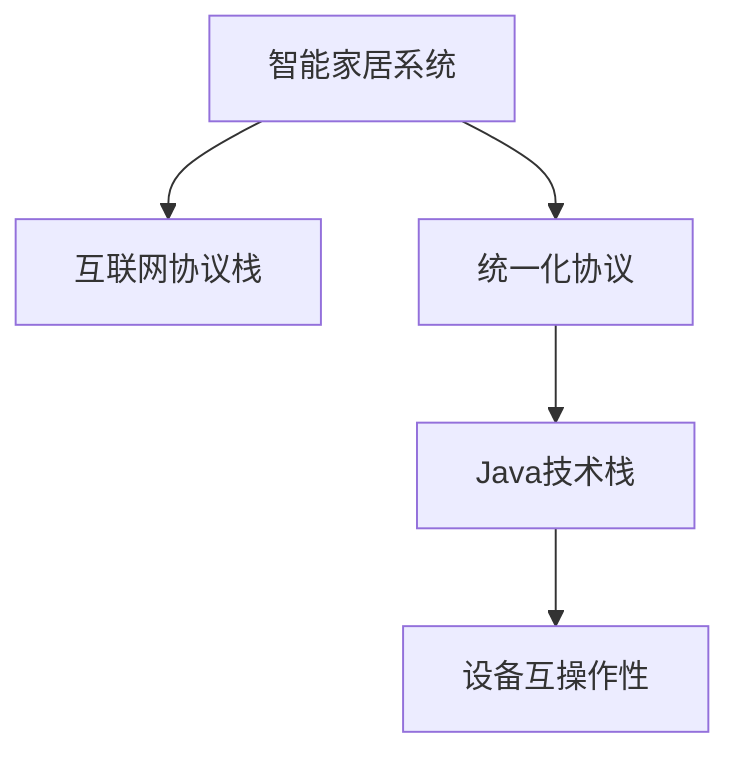

                 

# 基于Java的智能家居设计：征服智能家居的互联网协议栈-从Java视角

## 1. 背景介绍

### 1.1 问题由来

随着物联网和人工智能技术的迅猛发展，智能家居逐渐成为全球科技公司竞相争夺的新兴市场。智能家居系统通过互联网将各种设备连接起来，实现智能控制、自动化管理，提升居民生活品质和效率。但当前智能家居系统往往存在着数据孤岛、系统复杂、设备兼容性差等问题，极大地限制了其发展。

为了克服这些挑战，构建统一、可扩展、智能化的智能家居系统，首先需要从互联网协议栈入手。互联网协议栈是智能家居系统互联互通的基石，负责数据传输、路由、编码等核心功能。而Java作为一门广泛应用的语言，在构建协议栈方面具有天然优势。因此，本文将从Java视角，探讨基于Java的智能家居系统协议栈设计，帮助读者理解其原理和实现方法。

### 1.2 问题核心关键点

当前智能家居系统面临着诸多挑战：

- **数据孤岛**：各设备和系统之间缺乏标准化的通信协议，导致数据难以互通，形成信息孤岛。
- **系统复杂**：现有的智能家居系统过于复杂，难以维护和扩展。
- **设备兼容性差**：各设备制造商之间缺乏标准化的通信协议，导致设备之间兼容性差，难以协同工作。
- **安全性问题**：智能家居系统直接关联居民隐私，安全性问题尤为突出。

本文将重点讨论如何解决这些挑战，尤其是如何通过统一、标准化的协议栈，实现设备之间的高效协同和数据互通。

## 2. 核心概念与联系

### 2.1 核心概念概述

为更好地理解基于Java的智能家居系统协议栈设计，本文将介绍几个密切相关的核心概念：

- **智能家居系统**：通过互联网将各种家居设备连接起来，实现自动化管理和智能化控制，提升生活质量和效率的系统。
- **互联网协议栈**：负责数据传输、路由、编码等核心功能，确保数据在网络中正确传输的技术体系。
- **统一化协议**：通过标准化、通用的协议，实现不同设备、系统之间的互操作性。
- **Java技术栈**：使用Java语言作为编程语言，构建智能家居系统协议栈，发挥Java在跨平台、多线程、安全等方面的优势。

这些核心概念之间的逻辑关系可以通过以下Mermaid流程图来展示：



这个流程图展示了一个从智能家居系统到设备互操作性的整体框架。其中：

- 智能家居系统是整体的目标。
- 互联网协议栈是实现数据传输的核心技术。
- 统一化协议是确保设备互操作性的基石。
- Java技术栈则是构建协议栈的技术手段。

这些概念共同构成了智能家居系统协议栈设计的核心，使得系统能够高效、可靠地运行。

## 3. 核心算法原理 & 具体操作步骤

### 3.1 算法原理概述

基于Java的智能家居系统协议栈设计，主要遵循以下算法原理：

- **层次化设计**：将协议栈分为多个层次，每一层负责特定的功能，如数据传输、路由选择、协议转换等。
- **标准接口**：定义统一的接口规范，确保各层之间能够正确通信。
- **跨平台支持**：使用Java语言的多平台支持特性，确保协议栈能够在多种设备上运行。
- **安全性保障**：通过Java的加密和认证机制，保障数据传输的安全性。

### 3.2 算法步骤详解

基于Java的智能家居系统协议栈设计，主要分为以下五个步骤：

1. **需求分析**：根据智能家居系统的需求，确定需要哪些协议栈功能，如数据传输、路由选择、协议转换等。
2. **架构设计**：设计协议栈的层次结构，定义各层的功能和接口规范。
3. **协议实现**：使用Java语言实现各层的协议功能，确保各层能够正确通信。
4. **跨平台部署**：将协议栈部署到各种设备上，确保跨平台支持。
5. **安全性测试**：进行安全性测试，确保数据传输的安全性。

### 3.3 算法优缺点

基于Java的智能家居系统协议栈设计具有以下优点：

- **跨平台支持**：Java的多平台特性使得协议栈能够在各种设备上运行。
- **安全性保障**：Java的加密和认证机制保障了数据传输的安全性。
- **易于维护**：Java面向对象的设计理念使得协议栈易于维护和扩展。

同时，该方法也存在以下缺点：

- **性能问题**：Java的虚拟机特性可能导致性能瓶颈，需要优化以提升协议栈效率。
- **安全性问题**：Java的安全机制虽然强大，但仍需通过合理的设计和实践来进一步保障安全性。
- **标准化问题**：虽然Java被广泛应用，但智能家居协议栈的设计仍需遵循行业标准，避免协议不兼容问题。

### 3.4 算法应用领域

基于Java的智能家居系统协议栈设计，可以应用于各种智能家居设备，如智能灯泡、智能锁、智能电视等。通过标准化的协议栈，可以实现设备之间的互操作性，提升系统的整体性能和稳定性。

## 4. 数学模型和公式 & 详细讲解 & 举例说明

### 4.1 数学模型构建

在智能家居系统中，数据传输是核心功能之一。假设智能家居系统中共有n个设备，每个设备都有一个唯一的标识符id，数据传输采用TCP/IP协议。

定义协议栈的层次结构如下：

1. **物理层**：负责数据在物理介质上的传输，如Wi-Fi、蓝牙等。
2. **网络层**：负责数据在网络中的路由选择，如IP协议。
3. **传输层**：负责数据在设备和系统之间的传输，如TCP协议。
4. **应用层**：负责数据在应用层面的处理，如智能家居控制协议。

### 4.2 公式推导过程

假设设备A向设备B发送数据，数据传输过程如下：

1. 设备A将数据封装在TCP数据包中，发送至网络层。
2. 网络层将TCP数据包封装在IP数据包中，进行路由选择，发送至设备B。
3. 设备B收到IP数据包后，进行解封装，提取TCP数据包，进行数据处理。
4. 设备B将数据处理结果返回给设备A，完成一次数据传输。

定义数据传输过程中的延迟和带宽分别为D和B，则总传输时间为：

$$
T = (D + 2B + D) / B = 4D / B + 2
$$

其中，D和B需要根据实际情况进行调整，以保证数据传输的实时性和可靠性。

### 4.3 案例分析与讲解

以智能灯泡为例，分析数据传输过程：

1. 智能灯泡通过Wi-Fi连接到智能家居系统。
2. 用户通过手机App发送控制指令，指令经过TCP/IP协议栈，最终到达智能灯泡。
3. 智能灯泡接收到指令后，执行相应的控制操作。
4. 控制操作的结果通过TCP/IP协议栈，返回给手机App。

在此过程中，Wi-Fi和TCP/IP协议栈共同协作，实现数据的可靠传输和路由选择。

## 5. 项目实践：代码实例和详细解释说明

### 5.1 开发环境搭建

在开发基于Java的智能家居系统协议栈时，首先需要搭建Java开发环境。以下是具体步骤：

1. 安装Java开发工具包（JDK）：从官网下载并安装最新版本的JDK，确保支持Java 11及以上版本。
2. 安装IDE：推荐使用IntelliJ IDEA或Eclipse，这些IDE支持Java开发，并且具有强大的调试和编辑功能。
3. 配置Maven或Gradle：Maven和Gradle是Java项目管理的常用工具，推荐使用其中一种，以方便项目依赖管理和构建。

### 5.2 源代码详细实现

以下是智能家居系统协议栈的Java代码实现示例：

```java
// 物理层实现
class PhysicalLayer {
    public void transmitData(byte[] data) {
        // 发送数据
    }
}

// 网络层实现
class NetworkLayer {
    public void routeData(byte[] data) {
        // 路由选择
    }
}

// 传输层实现
class TransportLayer {
    public void sendData(byte[] data) {
        // 发送数据
    }
}

// 应用层实现
class ApplicationLayer {
    public void processData(byte[] data) {
        // 处理数据
    }
}

// 协议栈集成
public class ProtocolStack {
    private PhysicalLayer physicalLayer;
    private NetworkLayer networkLayer;
    private TransportLayer transportLayer;
    private ApplicationLayer applicationLayer;

    public ProtocolStack() {
        physicalLayer = new PhysicalLayer();
        networkLayer = new NetworkLayer();
        transportLayer = new TransportLayer();
        applicationLayer = new ApplicationLayer();
    }

    public void processData(byte[] data) {
        physicalLayer.transmitData(data);
        networkLayer.routeData(data);
        transportLayer.sendData(data);
        applicationLayer.processData(data);
    }
}
```

在此代码中，定义了物理层、网络层、传输层和应用层，并将它们集成在一个ProtocolStack类中。通过调用ProtocolStack类的processData方法，实现数据在协议栈中的传输。

### 5.3 代码解读与分析

- **物理层**：负责数据的物理传输，如Wi-Fi、蓝牙等。
- **网络层**：负责数据的路由选择，如IP协议。
- **传输层**：负责数据在设备和系统之间的传输，如TCP协议。
- **应用层**：负责数据的处理，如智能家居控制协议。

各层之间通过调用彼此的方法，实现数据的传输和处理。这种层次化设计使得协议栈易于维护和扩展。

### 5.4 运行结果展示

通过上述代码实现，可以模拟智能家居系统中的数据传输过程。例如，用户通过手机App发送控制智能灯泡的指令，数据经过各层处理后，最终实现灯泡的开关操作。

## 6. 实际应用场景

### 6.1 智能家居系统

智能家居系统是智能家居协议栈的核心应用场景之一。通过标准化的协议栈，可以实现设备之间的互操作性，提升系统的整体性能和稳定性。例如：

- 智能灯泡：通过Wi-Fi连接到智能家居系统，用户通过手机App控制开关和亮度。
- 智能门锁：通过Wi-Fi连接到智能家居系统，用户通过手机App进行开锁和远程监控。
- 智能电视：通过Wi-Fi连接到智能家居系统，用户通过手机App进行播放控制和视频共享。

### 6.2 未来应用展望

随着物联网和人工智能技术的进一步发展，智能家居系统的应用场景将更加广泛。基于Java的智能家居系统协议栈，将为这些新应用场景提供强有力的技术支持。

1. **智慧城市**：将智能家居系统扩展到智慧城市中，实现城市交通、环境监控、安全管理等功能。
2. **智能农业**：通过智能家居系统，实现农业设备的远程控制和数据监测，提升农业生产效率。
3. **智能医疗**：通过智能家居系统，实现家庭医疗设备的远程监控和管理，提升患者生活质量。

## 7. 工具和资源推荐

### 7.1 学习资源推荐

为帮助开发者系统掌握智能家居系统协议栈的设计和实现，推荐以下学习资源：

1. **Java语言教程**：Java语言是智能家居系统协议栈的基础，建议读者通过官方文档或在线教程深入学习Java语言的基础知识和高级特性。
2. **Java网络编程**：Java网络编程是智能家居系统协议栈的核心技术，推荐学习Java的网络编程相关书籍或在线课程。
3. **智能家居技术标准**：了解智能家居领域的技术标准，如Zigbee、Wi-Fi、蓝牙等，是设计协议栈的重要基础。
4. **开源协议栈项目**：学习开源协议栈项目，如OpenHAB、SmartThings等，了解其设计思路和实现方法。
5. **智能家居开发者社区**：加入智能家居开发者社区，如IoT Forum、SmartThings Developer Community等，获取最新的技术动态和社区支持。

### 7.2 开发工具推荐

以下是智能家居系统协议栈开发常用的开发工具：

1. **IntelliJ IDEA**：功能强大的Java开发工具，支持代码调试、版本控制、测试自动化等。
2. **Eclipse**：流行的Java开发平台，具有强大的插件系统和开发工具。
3. **GitHub**：代码托管和版本控制工具，方便协作开发和代码管理。
4. **Maven/Gradle**：Java项目管理和依赖管理工具，提供自动化构建和部署功能。
5. **Postman**：API测试工具，方便测试和验证协议栈的接口。

### 7.3 相关论文推荐

以下是几篇具有代表性的智能家居系统协议栈相关论文，推荐阅读：

1. **《A Survey of Smart Home Protocols》**：回顾了智能家居领域中的各种协议和标准，提供了系统的技术概览。
2. **《Standardization and Interoperability in Smart Home Systems》**：探讨了智能家居系统中标准化和互操作性的问题，提出了多种解决方案。
3. **《Design and Implementation of a Smart Home Control Protocol》**：详细介绍了智能家居控制协议的设计和实现方法，具有实践指导意义。
4. **《Java-based Internet of Things Protocol Stack Design》**：讨论了基于Java的物联网协议栈设计，提供了具体的实现案例。
5. **《Security and Privacy Challenges in Smart Home Systems》**：分析了智能家居系统中的安全性和隐私问题，提出了相应的解决方案。

## 8. 总结：未来发展趋势与挑战

### 8.1 研究成果总结

本文从Java视角，探讨了基于Java的智能家居系统协议栈设计，重点介绍了层次化设计、标准化接口、跨平台支持和安全性的保障。通过标准化的协议栈，实现了设备之间的互操作性，提升了系统的整体性能和稳定性。

### 8.2 未来发展趋势

展望未来，智能家居系统的协议栈将呈现以下几个发展趋势：

1. **标准化和互操作性**：随着智能家居设备的普及，标准化和互操作性将变得更加重要。未来的协议栈将更加注重兼容性和跨平台支持。
2. **安全性提升**：智能家居系统直接关联居民隐私，未来的协议栈将更加注重安全性保障，采用更加严格的安全机制。
3. **实时性和可靠性**：智能家居系统对实时性和可靠性要求较高，未来的协议栈将采用更加高效的数据传输和处理机制。
4. **边缘计算**：边缘计算能够减少数据传输和处理延迟，提高系统的实时性和效率，未来的协议栈将引入边缘计算技术。
5. **人工智能应用**：智能家居系统中的数据分析和决策过程将引入人工智能技术，未来的协议栈将支持人工智能算法的部署和优化。

### 8.3 面临的挑战

尽管智能家居系统协议栈设计取得了一定的进展，但在迈向更加智能化、普适化应用的过程中，仍面临着诸多挑战：

1. **设备兼容性**：各设备制造商之间缺乏标准化的通信协议，导致设备之间兼容性差，难以协同工作。
2. **安全性问题**：智能家居系统直接关联居民隐私，安全性问题尤为突出。
3. **跨平台支持**：Java的多平台特性可能导致性能瓶颈，需要优化以提升协议栈效率。
4. **标准化问题**：虽然Java被广泛应用，但智能家居协议栈的设计仍需遵循行业标准，避免协议不兼容问题。
5. **实时性问题**：智能家居系统对实时性和可靠性要求较高，现有的协议栈需要进一步优化以提高性能。

### 8.4 研究展望

未来的研究需要在以下几个方面寻求新的突破：

1. **协议栈优化**：通过引入边缘计算、优化数据传输和处理机制等方法，提高协议栈的实时性和可靠性。
2. **安全性增强**：通过引入更加严格的安全机制，如加密、认证等，保障数据传输的安全性。
3. **跨平台支持**：通过优化Java虚拟机特性，提高协议栈的跨平台支持。
4. **标准化推动**：通过制定和推广智能家居领域的技术标准，促进协议栈的标准化和互操作性。
5. **人工智能应用**：引入人工智能技术，提升协议栈的数据分析和决策能力，支持智能家居系统的自动化和智能化。

这些研究方向将推动智能家居系统协议栈的发展，为构建安全、可靠、智能化的智能家居系统提供强有力的技术支持。

## 9. 附录：常见问题与解答

**Q1: 什么是智能家居系统？**

A: 智能家居系统通过互联网将各种家居设备连接起来，实现自动化管理和智能化控制，提升生活质量和效率。

**Q2: 基于Java的智能家居系统协议栈设计有何优点？**

A: 基于Java的智能家居系统协议栈具有跨平台支持、安全性保障和易于维护等优点。Java的多平台特性使得协议栈能够在各种设备上运行；Java的加密和认证机制保障了数据传输的安全性；Java面向对象的设计理念使得协议栈易于维护和扩展。

**Q3: 智能家居系统面临哪些挑战？**

A: 智能家居系统面临设备兼容性差、安全性问题、跨平台支持、标准化问题和实时性问题等挑战。

**Q4: 如何提高智能家居系统的安全性？**

A: 提高智能家居系统的安全性需要从多个方面入手，如加密、认证、访问控制等。可以通过Java的加密和认证机制，保障数据传输的安全性；通过访问控制策略，限制不必要的功能访问；通过安全审计和监控，及时发现和应对安全漏洞。

**Q5: 未来智能家居系统的发展方向是什么？**

A: 未来智能家居系统将更加智能化、普适化和安全化。通过标准化和互操作性，实现设备的协同工作；通过安全性保障，保护居民隐私；通过边缘计算、人工智能等技术，提升系统的实时性和智能化水平。

---

作者：禅与计算机程序设计艺术 / Zen and the Art of Computer Programming

