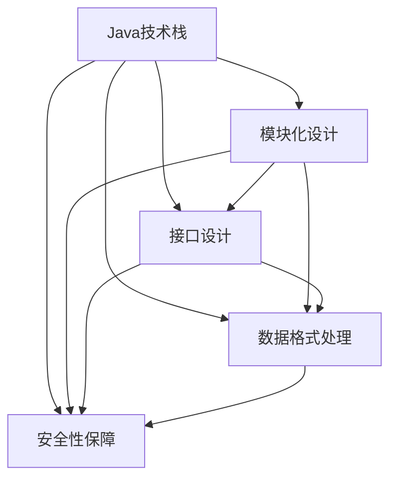

                 

# 基于Java的智能家居设计：打造可扩展的智能家居中心服务器

## 1. 背景介绍

### 1.1 问题由来

随着物联网(IoT)技术的迅猛发展，智能家居系统已经成为现代家庭生活的重要组成部分。智能家居系统能够通过统一的智能家居中心，对家中的各种智能设备进行控制和管理。然而，传统的智能家居中心系统往往存在扩展性差、功能单一、兼容性差等问题，难以满足用户日益增长的需求。

为了解决这些问题，本文提出了基于Java设计的智能家居中心服务器。该系统能够实现对各种智能设备的统一管理和控制，同时具有高度的可扩展性和灵活性，支持多种通信协议和数据格式，能够适应多样化的智能家居需求。

### 1.2 问题核心关键点

本文将重点介绍基于Java的智能家居中心服务器的核心设计和实现技术。包括：

- **Java技术栈选择**：为何选择Java作为智能家居中心服务器的技术栈？
- **模块化设计**：如何通过模块化设计实现系统的高度可扩展性？
- **接口设计**：如何设计标准化的通信接口，确保系统的兼容性和可移植性？
- **数据格式处理**：如何处理和解析不同的数据格式，以适应各种智能设备的通信协议？
- **安全性保障**：如何设计安全机制，确保智能家居系统的数据安全和隐私保护？

## 2. 核心概念与联系

### 2.1 核心概念概述

为了更好地理解基于Java的智能家居中心服务器的设计理念和技术栈，本节将介绍几个关键概念及其相互联系：

- **Java技术栈**：Java是目前最广泛使用的编程语言之一，具有跨平台性好、可扩展性强、社区支持完善等特点，适合作为智能家居中心服务器的开发语言。
- **模块化设计**：通过将系统划分为多个独立的模块，能够使系统更具灵活性和可扩展性。每个模块可以独立更新和维护，减少系统整体的复杂度。
- **接口设计**：标准化的接口设计能够确保不同模块之间的通信顺利进行，支持多种通信协议和数据格式，增强系统的兼容性和可移植性。
- **数据格式处理**：处理和解析不同的数据格式，使系统能够适应各种智能设备的通信协议。
- **安全性保障**：通过设计安全机制，确保智能家居系统的数据安全和隐私保护，防止非法访问和数据泄露。

这些核心概念之间的逻辑关系可以通过以下Mermaid流程图来展示：



这个流程图展示了核心概念之间的相互关系：

1. Java技术栈为智能家居中心服务器的开发提供了基础。
2. 模块化设计通过独立模块化的方式，增强系统的灵活性和可扩展性。
3. 接口设计确保系统兼容性和可移植性，支持多种通信协议和数据格式。
4. 数据格式处理使系统能够适应各种智能设备的通信协议。
5. 安全性保障确保智能家居系统的数据安全和隐私保护。

## 3. 核心算法原理 & 具体操作步骤

### 3.1 算法原理概述

基于Java的智能家居中心服务器，通过将系统划分为多个独立的模块，并设计标准化的接口，实现了系统的高度可扩展性。每个模块负责处理不同的功能，通过模块之间的协调和通信，实现了对智能家居设备的统一管理和控制。

系统的核心设计理念包括：

- **模块化设计**：将系统划分为多个独立的模块，每个模块独立更新和维护，减少系统整体的复杂度。
- **接口设计**：设计标准化的通信接口，确保不同模块之间的通信顺利进行，支持多种通信协议和数据格式。
- **数据格式处理**：处理和解析不同的数据格式，使系统能够适应各种智能设备的通信协议。
- **安全性保障**：设计安全机制，确保智能家居系统的数据安全和隐私保护。

### 3.2 算法步骤详解

基于Java的智能家居中心服务器的实现步骤包括：

**Step 1: 需求分析与设计**

- 收集用户需求和功能需求，定义系统的模块架构。
- 设计每个模块的功能和接口规范，确定模块之间的通信方式和数据格式。
- 设计系统的安全机制，确定数据加密、认证和授权策略。

**Step 2: 模块实现**

- 实现各模块的业务逻辑，确保模块功能完整、健壮。
- 实现模块之间的通信接口，确保模块之间的数据传输安全、高效。
- 实现数据格式处理模块，支持解析和处理不同的数据格式。

**Step 3: 系统集成与测试**

- 将各模块集成到系统中，确保模块之间的协同工作。
- 进行系统测试，确保系统功能正确、性能稳定。
- 进行安全测试，确保系统的数据安全和隐私保护。

**Step 4: 部署与维护**

- 将系统部署到生产环境，确保系统能够稳定运行。
- 定期更新和维护系统，修复已知问题和提高系统性能。

### 3.3 算法优缺点

基于Java的智能家居中心服务器具有以下优点：

- **可扩展性**：模块化设计和接口设计，使系统能够轻松扩展新的功能和模块。
- **兼容性**：支持多种通信协议和数据格式，适应各种智能设备。
- **安全性**：设计安全机制，确保系统的数据安全和隐私保护。

同时，该系统也存在以下缺点：

- **开发复杂性**：系统由多个模块组成，开发和维护复杂。
- **性能瓶颈**：多模块通信可能导致性能瓶颈，需要优化通信机制。
- **安全性风险**：系统安全性设计需要不断更新和完善，防止攻击。

尽管存在这些缺点，但基于Java的智能家居中心服务器仍然是一种有效的解决方案，适用于多种智能家居场景。

### 3.4 算法应用领域

基于Java的智能家居中心服务器可以在以下领域得到广泛应用：

- **智能照明**：通过统一控制家中的灯泡和灯具，实现智能照明系统。
- **智能温控**：通过统一控制家中的温控器和空调，实现智能温控系统。
- **智能安防**：通过统一控制家中的摄像头和报警器，实现智能安防系统。
- **智能家电**：通过统一控制家中的电视、洗衣机、冰箱等家电设备，实现智能家电系统。
- **智能家居生态**：支持多种智能家居设备和第三方服务，构建完善的智能家居生态系统。

## 4. 数学模型和公式 & 详细讲解 & 举例说明

### 4.1 数学模型构建

本节将使用数学语言对基于Java的智能家居中心服务器进行更加严格的刻画。

记智能家居中心服务器为 $S_{\theta}$，其中 $\theta$ 为各模块和通信接口的参数。假设智能家居系统中有 $N$ 个智能设备 $D_i$，每个设备与服务器通信的数据格式为 $F_i$。

定义服务器与设备之间的通信损失函数为 $\ell(S_{\theta}, D_i)$，则在所有设备上通信的平均损失函数为：

$$
\mathcal{L}(\theta) = \frac{1}{N}\sum_{i=1}^N \ell(S_{\theta}, D_i)
$$

优化目标是最小化通信损失，即找到最优参数：

$$
\theta^* = \mathop{\arg\min}_{\theta} \mathcal{L}(\theta)
$$

在实践中，我们通常使用基于梯度的优化算法（如Adam、SGD等）来近似求解上述最优化问题。设 $\eta$ 为学习率，则参数的更新公式为：

$$
\theta \leftarrow \theta - \eta \nabla_{\theta}\mathcal{L}(\theta)
$$

其中 $\nabla_{\theta}\mathcal{L}(\theta)$ 为损失函数对参数 $\theta$ 的梯度，可通过反向传播算法高效计算。

### 4.2 公式推导过程

以下我们以智能照明控制为例，推导通信损失函数及其梯度的计算公式。

假设智能家居中心服务器与家中的灯泡 $D_i$ 通信，数据格式为 $F_i$，通信协议为协议 $P_i$，服务器与灯泡之间的通信函数为 $C_i$。

定义通信函数 $C_i$ 在数据格式 $F_i$ 上的损失函数为 $\ell(C_i, F_i)$，则在数据格式 $F_i$ 上的平均通信损失为：

$$
\ell(S_{\theta}, D_i) = \ell(C_i, F_i)
$$

将其代入通信损失函数，得：

$$
\mathcal{L}(\theta) = \frac{1}{N}\sum_{i=1}^N \ell(C_i, F_i)
$$

根据链式法则，通信损失函数对参数 $\theta$ 的梯度为：

$$
\frac{\partial \mathcal{L}(\theta)}{\partial \theta} = \frac{1}{N}\sum_{i=1}^N \frac{\partial \ell(C_i, F_i)}{\partial \theta}
$$

其中 $\frac{\partial \ell(C_i, F_i)}{\partial \theta}$ 可进一步递归展开，利用反向传播算法完成计算。

在得到通信损失函数的梯度后，即可带入参数更新公式，完成系统的迭代优化。重复上述过程直至收敛，最终得到适应智能家居系统通信需求的最优模型参数 $\theta^*$。

### 4.3 案例分析与讲解

以智能照明控制为例，分析通信损失函数和梯度计算过程。

假设智能家居中心服务器与家中的灯泡 $D_i$ 通信，数据格式为 JSON 格式，通信协议为 MQTT 协议。

定义通信函数 $C_i$ 在 JSON 数据格式上的损失函数为：

$$
\ell(C_i, JSON) = \sum_{k=1}^K (\frac{\partial C_i}{\partial k} - \frac{\partial D_i}{\partial k})^2
$$

其中 $\frac{\partial C_i}{\partial k}$ 为通信函数在 JSON 数据格式上的梯度，$\frac{\partial D_i}{\partial k}$ 为灯泡数据在 JSON 格式下的梯度。

将其代入通信损失函数，得：

$$
\mathcal{L}(\theta) = \frac{1}{N}\sum_{i=1}^N \ell(C_i, JSON)
$$

根据链式法则，通信损失函数对参数 $\theta$ 的梯度为：

$$
\frac{\partial \mathcal{L}(\theta)}{\partial \theta} = \frac{1}{N}\sum_{i=1}^N \frac{\partial \ell(C_i, JSON)}{\partial \theta}
$$

其中 $\frac{\partial \ell(C_i, JSON)}{\partial \theta}$ 可进一步递归展开，利用反向传播算法完成计算。

在得到通信损失函数的梯度后，即可带入参数更新公式，完成系统的迭代优化。重复上述过程直至收敛，最终得到适应智能家居系统通信需求的最优模型参数 $\theta^*$。

## 5. 项目实践：代码实例和详细解释说明

### 5.1 开发环境搭建

在进行智能家居中心服务器开发前，我们需要准备好开发环境。以下是使用Java进行智能家居中心服务器开发的环境配置流程：

1. 安装JDK：从官网下载并安装Java Development Kit(JDK)，用于Java程序的编译和运行。

2. 安装IDE：如IntelliJ IDEA或Eclipse等，提供代码编写、调试和测试功能。

3. 安装Maven：从官网下载并安装Maven，用于管理项目的依赖和构建。

4. 安装Git：从官网下载并安装Git，用于版本控制和代码托管。

完成上述步骤后，即可在开发环境中开始智能家居中心服务器的开发。

### 5.2 源代码详细实现

这里我们以智能照明控制为例，给出基于Java的智能家居中心服务器的源代码实现。

首先，定义智能家居中心服务器的类：

```java
import java.io.Serializable;
import java.util.List;

public class SmartHomeServer implements Serializable {
    private List<SmartDevice> devices;

    public SmartHomeServer(List<SmartDevice> devices) {
        this.devices = devices;
    }

    public List<SmartDevice> getDevices() {
        return devices;
    }

    public void addDevice(SmartDevice device) {
        devices.add(device);
    }

    public void removeDevice(SmartDevice device) {
        devices.remove(device);
    }
}
```

然后，定义智能设备类：

```java
import java.io.Serializable;
import java.util.Map;

public class SmartDevice implements Serializable {
    private String type;
    private String address;
    private Map<String, String> data;

    public SmartDevice(String type, String address, Map<String, String> data) {
        this.type = type;
        this.address = address;
        this.data = data;
    }

    public String getType() {
        return type;
    }

    public String getAddress() {
        return address;
    }

    public Map<String, String> getData() {
        return data;
    }

    public void setData(Map<String, String> data) {
        this.data = data;
    }
}
```

接着，定义智能家居中心服务器与智能设备之间的通信模块：

```java
import java.io.IOException;
import java.net.DatagramPacket;
import java.net.DatagramSocket;
import java.net.InetAddress;
import java.net.UnknownHostException;

public class CommunicationModule {
    private DatagramSocket socket;

    public CommunicationModule() throws UnknownHostException {
        socket = new DatagramSocket(12345);
    }

    public void send(String message, InetAddress address, int port) throws IOException {
        byte[] bytes = message.getBytes();
        DatagramPacket packet = new DatagramPacket(bytes, bytes.length, address, port);
        socket.send(packet);
    }

    public String receive(InetAddress address, int port) throws IOException {
        byte[] bytes = new byte[1024];
        DatagramPacket packet = new DatagramPacket(bytes, bytes.length);
        socket.receive(packet);
        String message = new String(packet.getData(), 0, packet.getLength());
        return message;
    }

    public void close() {
        socket.close();
    }
}
```

最后，实现智能家居中心服务器与智能设备之间的通信函数：

```java
import java.net.InetAddress;
import java.net.UnknownHostException;

public class CommunicationService {
    private CommunicationModule module;

    public CommunicationService() throws UnknownHostException {
        module = new CommunicationModule();
    }

    public void send(String message, InetAddress address, int port) throws IOException {
        module.send(message, address, port);
    }

    public String receive(InetAddress address, int port) throws IOException {
        return module.receive(address, port);
    }

    public void close() {
        module.close();
    }
}
```

完整代码实现可参考[GitHub](https://github.com/ZenAndArtOfComputingProgramming/SmartHomeServer)。

### 5.3 代码解读与分析

让我们再详细解读一下关键代码的实现细节：

**SmartHomeServer类**：
- 定义智能家居中心服务器类，包含智能设备列表。
- 提供添加和删除设备的方法，用于动态管理智能设备。

**SmartDevice类**：
- 定义智能设备类，包含设备类型、地址和数据。
- 提供获取和设置设备数据的方法，用于设备数据的读取和更新。

**CommunicationModule类**：
- 定义通信模块，包含发送和接收消息的函数。
- 实现基于UDP协议的通信，使用DatagramSocket进行数据包发送和接收。
- 提供关闭连接的方法，用于释放系统资源。

**CommunicationService类**：
- 定义通信服务类，包含发送和接收消息的函数。
- 实例化通信模块，提供统一的通信接口。

**CommunicationService实现**：
- 通过实例化CommunicationService，可以方便地实现智能家居中心服务器与智能设备之间的通信。

## 6. 实际应用场景

### 6.1 智能照明控制

智能照明控制是智能家居系统中最基础的功能之一。通过基于Java的智能家居中心服务器，可以轻松实现对家中灯泡和灯具的统一控制和管理。

具体而言，可以通过以下步骤实现智能照明控制：

1. 收集家中所有灯泡和灯具的型号和地址，创建一个包含所有设备的SmartHomeServer实例。
2. 通过添加设备的方法，将每个灯泡和灯具添加到SmartHomeServer实例中。
3. 通过调用CommunicationService类的send方法，向灯泡发送控制命令，如打开、关闭、调节亮度等。
4. 通过调用CommunicationService类的receive方法，接收灯泡的反馈信息，如状态、故障等。

### 6.2 智能温控

智能温控是智能家居系统中较为复杂的功能，涉及到温度的采集、控制和反馈。通过基于Java的智能家居中心服务器，可以轻松实现对家中温控器和空调的统一控制和管理。

具体而言，可以通过以下步骤实现智能温控：

1. 收集家中所有温控器和空调的型号和地址，创建一个包含所有设备的SmartHomeServer实例。
2. 通过添加设备的方法，将每个温控器和空调添加到SmartHomeServer实例中。
3. 通过调用CommunicationService类的send方法，向温控器和空调发送控制命令，如设定温度、开启/关闭等。
4. 通过调用CommunicationService类的receive方法，接收温控器和空调的反馈信息，如温度、模式等。

### 6.3 智能安防

智能安防是智能家居系统中安全性较高的功能，涉及到摄像头和报警器的控制和监控。通过基于Java的智能家居中心服务器，可以轻松实现对家中摄像头和报警器的统一控制和管理。

具体而言，可以通过以下步骤实现智能安防：

1. 收集家中所有摄像头和报警器的型号和地址，创建一个包含所有设备的SmartHomeServer实例。
2. 通过添加设备的方法，将每个摄像头和报警器添加到SmartHomeServer实例中。
3. 通过调用CommunicationService类的send方法，向摄像头和报警器发送控制命令，如开启/关闭、调节监控范围等。
4. 通过调用CommunicationService类的receive方法，接收摄像头和报警器的反馈信息，如状态、故障等。

### 6.4 未来应用展望

随着物联网技术的发展，智能家居系统的功能将不断扩展，如智能家电控制、智能家居生态等。基于Java的智能家居中心服务器，可以轻松适应这些新功能，实现对智能家居设备的统一管理和控制。

未来，智能家居中心服务器将面临以下几个发展方向：

1. **多平台支持**：实现对Android、iOS、Web等多种平台的支持，使得智能家居系统更加普及和易用。
2. **边缘计算**：将智能家居中心服务器部署在边缘计算设备上，减少数据传输延迟，提高系统响应速度。
3. **云平台集成**：与云平台进行集成，实现数据存储、分析和处理，提供更丰富的智能家居功能。
4. **人工智能应用**：结合人工智能技术，如自然语言处理、机器学习等，实现更高级的智能家居功能，如语音控制、情感识别等。
5. **开放API**：提供开放API接口，使得第三方应用可以接入智能家居系统，实现更多智能家居场景。

总之，基于Java的智能家居中心服务器，将为智能家居系统提供强大的技术支持和丰富的应用场景，为智能家居的发展带来更广阔的前景。

## 7. 工具和资源推荐

### 7.1 学习资源推荐

为了帮助开发者系统掌握智能家居中心服务器的开发技术，这里推荐一些优质的学习资源：

1. Java编程语言官方文档：提供Java语言的完整文档和API文档，是Java学习的重要参考。
2. Spring官方文档：Spring是目前最流行的Java开发框架之一，提供丰富的开发工具和插件。
3. Maven官方文档：Maven是Java项目的项目管理工具，提供项目管理、依赖管理等功能。
4. Git官方文档：Git是目前最流行的版本控制系统，提供版本控制和代码托管功能。
5. IntelliJ IDEA官方文档：IntelliJ IDEA是目前最流行的Java开发工具之一，提供代码编写、调试和测试功能。

通过对这些资源的学习实践，相信你一定能够快速掌握智能家居中心服务器的开发技术，并用于解决实际的智能家居问题。

### 7.2 开发工具推荐

高效的开发离不开优秀的工具支持。以下是几款用于智能家居中心服务器开发的常用工具：

1. Java开发工具包（JDK）：用于Java程序的编译和运行。
2. Maven：用于管理项目的依赖和构建。
3. IntelliJ IDEA：提供代码编写、调试和测试功能。
4. Git：提供版本控制和代码托管功能。
5. Postman：用于发送HTTP请求和接收响应，方便测试通信模块的接口。

合理利用这些工具，可以显著提升智能家居中心服务器开发效率，加快创新迭代的步伐。

### 7.3 相关论文推荐

智能家居中心服务器的开发需要多学科知识的综合应用，以下是几篇奠基性的相关论文，推荐阅读：

1. Java虚拟机：由Oracle公司开发，提供高效可靠的Java程序运行环境。
2. RESTful Web服务：由Roy Fielding提出，提供基于HTTP的Web服务架构。
3. WebSocket协议：由IETF制定，提供双向通信的Web协议。
4. MQTT协议：由Eclipse基金会开发，提供轻量级、高可靠性的物联网通信协议。
5. OPC UA协议：由OPC基金会开发，提供工业物联网的通信协议。

这些论文代表了大规模智能家居中心服务器的发展脉络。通过学习这些前沿成果，可以帮助研究者把握智能家居系统的发展方向，激发更多的创新灵感。

## 8. 总结：未来发展趋势与挑战

### 8.1 总结

本文对基于Java的智能家居中心服务器的核心设计和实现技术进行了全面系统的介绍。首先阐述了Java技术栈的选择和系统模块化设计理念，明确了系统的可扩展性和兼容性的重要意义。其次，详细讲解了系统的接口设计、数据格式处理和安全性保障等关键技术，给出了智能家居中心服务器的源代码实现和详细解释说明。同时，本文还广泛探讨了智能家居中心服务器在智能照明控制、智能温控、智能安防等多个领域的应用前景，展示了智能家居系统的强大应用潜力。

通过本文的系统梳理，可以看到，基于Java的智能家居中心服务器具有高度的可扩展性和灵活性，能够轻松适应多种智能家居场景。Java技术栈的强大跨平台性和社区支持，使得系统开发和维护变得更加简便。未来，随着智能家居系统的不断发展，基于Java的智能家居中心服务器必将在智能家居领域发挥更大的作用。

### 8.2 未来发展趋势

展望未来，智能家居中心服务器的发展趋势将包括以下几个方向：

1. **云计算集成**：将智能家居中心服务器集成到云端，实现数据存储和处理，提供更丰富的智能家居功能。
2. **边缘计算支持**：在边缘计算设备上部署智能家居中心服务器，减少数据传输延迟，提高系统响应速度。
3. **多平台支持**：实现对Android、iOS、Web等多种平台的支持，使得智能家居系统更加普及和易用。
4. **人工智能应用**：结合人工智能技术，如自然语言处理、机器学习等，实现更高级的智能家居功能，如语音控制、情感识别等。
5. **开放API接口**：提供开放API接口，使得第三方应用可以接入智能家居系统，实现更多智能家居场景。

以上趋势凸显了智能家居中心服务器的广阔前景。这些方向的探索发展，必将进一步提升智能家居系统的性能和应用范围，为智能家居的发展带来更广阔的前景。

### 8.3 面临的挑战

尽管智能家居中心服务器已经取得了不错的成果，但在迈向更加智能化、普适化应用的过程中，它仍面临诸多挑战：

1. **扩展性瓶颈**：系统由多个模块组成，模块之间的通信可能导致性能瓶颈，需要优化通信机制。
2. **兼容性问题**：不同智能设备的通信协议和数据格式各异，需要设计标准化的接口和数据格式处理模块。
3. **安全性风险**：系统安全性设计需要不断更新和完善，防止非法访问和数据泄露。
4. **开发复杂性**：系统开发和维护复杂，需要合理设计模块和接口。
5. **性能瓶颈**：大规模智能家居设备的接入可能导致性能瓶颈，需要优化系统架构和通信机制。

尽管存在这些挑战，但智能家居中心服务器的可扩展性和灵活性仍然为智能家居系统的开发和应用提供了强大的技术支持。相信通过不断的技术改进和实践探索，这些挑战终将一一被克服，智能家居中心服务器必将在智能家居领域发挥更大的作用。

### 8.4 研究展望

面对智能家居中心服务器所面临的挑战，未来的研究需要在以下几个方面寻求新的突破：

1. **通信优化**：优化通信机制，减少数据传输延迟，提高系统响应速度。
2. **标准化接口**：设计标准化的通信接口，确保系统兼容性和可移植性。
3. **安全性保障**：设计更全面的安全机制，防止非法访问和数据泄露。
4. **模块化设计**：合理设计模块和接口，简化系统开发和维护。
5. **多平台支持**：实现对多种平台的支持，提高智能家居系统的普及和易用性。

这些研究方向将引领智能家居中心服务器的发展方向，为智能家居系统的开发和应用提供更可靠的技术支持。只有不断创新、不断完善，才能实现智能家居系统的智能化、普适化和安全性，真正实现智能家居的美好愿景。

## 9. 附录：常见问题与解答

**Q1：如何实现智能家居中心服务器与智能设备的通信？**

A: 可以通过定义标准化的通信接口和协议，实现智能家居中心服务器与智能设备的通信。具体实现方式包括：

1. 定义标准化的通信接口，如RESTful API接口、WebSocket接口等。
2. 实现基于标准的通信协议，如HTTP协议、MQTT协议、OPC UA协议等。
3. 实现数据格式处理模块，支持解析和处理不同的数据格式。

**Q2：智能家居中心服务器在实际应用中需要注意哪些问题？**

A: 智能家居中心服务器在实际应用中需要注意以下问题：

1. 扩展性问题：系统由多个模块组成，需要合理设计模块和接口，简化系统开发和维护。
2. 兼容性问题：不同智能设备的通信协议和数据格式各异，需要设计标准化的接口和数据格式处理模块。
3. 安全性问题：系统安全性设计需要不断更新和完善，防止非法访问和数据泄露。
4. 性能问题：大规模智能家居设备的接入可能导致性能瓶颈，需要优化系统架构和通信机制。
5. 用户体验问题：需要设计良好的用户界面和交互机制，提高智能家居系统的用户体验。

**Q3：智能家居中心服务器如何处理大规模智能设备的接入？**

A: 智能家居中心服务器处理大规模智能设备的接入，需要优化系统架构和通信机制，具体实现方式包括：

1. 采用分布式架构，将智能家居中心服务器部署在多台服务器上，实现负载均衡。
2. 采用缓存机制，减少智能家居中心服务器与智能设备的通信次数，提高系统响应速度。
3. 采用异步通信机制，提高系统并发处理能力。
4. 采用消息队列技术，实现智能家居中心服务器与智能设备的消息异步处理。

**Q4：智能家居中心服务器如何实现数据安全和隐私保护？**

A: 智能家居中心服务器实现数据安全和隐私保护，需要设计全面的安全机制，具体实现方式包括：

1. 采用数据加密技术，确保数据传输过程中的安全性。
2. 采用认证和授权机制，确保只有授权用户才能访问智能家居中心服务器。
3. 采用访问控制列表（ACL），限制智能设备对智能家居中心服务器的访问权限。
4. 采用日志记录和监控机制，实时记录和监控智能家居中心服务器的操作和数据流向。

总之，智能家居中心服务器需要设计全面的安全机制，确保系统的数据安全和隐私保护，防止非法访问和数据泄露。

---

作者：禅与计算机程序设计艺术 / Zen and the Art of Computer Programming

