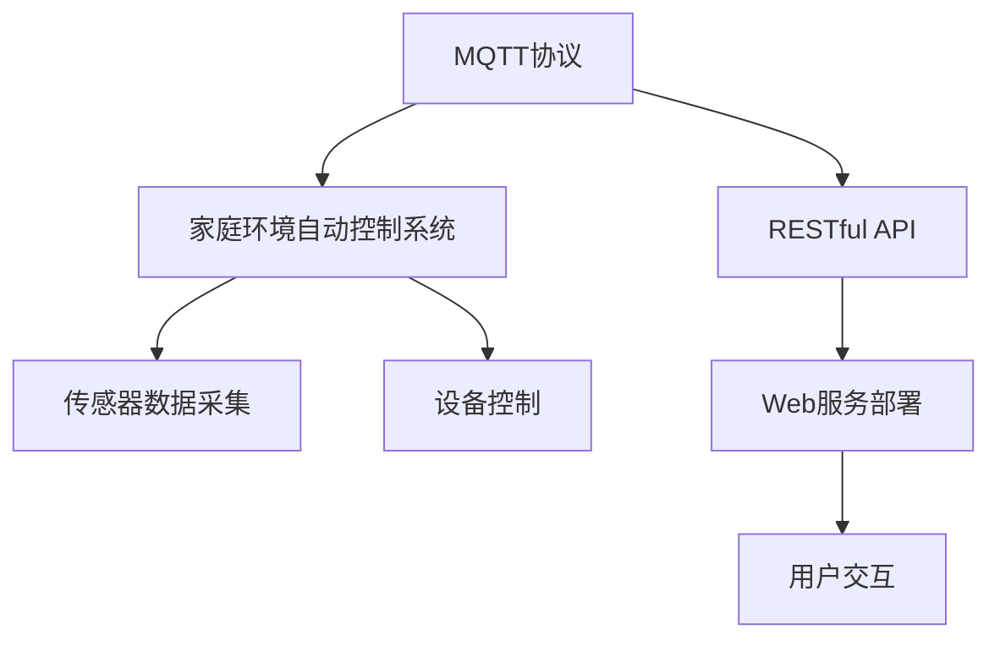

                 

## 1. 背景介绍

### 1.1 问题由来

随着科技的迅猛发展，智能家居成为了现代家庭生活中不可或缺的一部分。智能家居系统通过各种传感器和设备，采集家庭环境数据，并根据用户的设定和环境变化进行自动化控制，从而提升生活品质和舒适度。然而，传统的智能家居系统存在许多问题，如控制复杂、设备间互联互通性差、用户操作不便等。如何构建一个高效、稳定、易于使用的智能家居系统，成为了亟待解决的问题。

### 1.2 问题核心关键点

为解决传统智能家居系统的这些问题，本文提出了基于MQTT协议和RESTful API的家庭环境自动控制系统。该系统通过引入MQTT协议和RESTful API，实现了设备间的低延迟、高可靠的数据传输，同时提供了一个统一的接口，使得用户能够通过简单的操作，实现对家庭环境的智能化控制。

MQTT（Message Queuing Telemetry Transport）协议是一种轻量级的消息传输协议，适用于物联网设备之间的消息传递。它具有高效、可靠、实时性强等特点，适用于对数据传输速度和实时性要求高的场景。

RESTful API（Representational State Transfer，表现层状态转移）是一种基于HTTP协议的API设计风格，通过统一资源定位符（URL）、HTTP方法、请求头部和响应头部等要素，实现对Web服务资源的操作。它具有简单、灵活、易于维护等优点，适用于构建可扩展、可复用的Web服务。

本文结合MQTT协议和RESTful API的特点，提出了一种新的家庭环境自动控制系统，旨在解决传统智能家居系统中的控制复杂、设备互联互通性差、用户操作不便等问题。

## 2. 核心概念与联系

### 2.1 核心概念概述

为更好地理解基于MQTT协议和RESTful API的家庭环境自动控制系统，本节将介绍几个密切相关的核心概念：

- MQTT协议：一种轻量级的消息传输协议，适用于物联网设备之间的数据传输，具有高效、可靠、实时性强等特点。
- RESTful API：一种基于HTTP协议的API设计风格，具有简单、灵活、易于维护等优点，适用于构建可扩展、可复用的Web服务。
- 家庭环境自动控制系统：一种结合MQTT协议和RESTful API的智能家居系统，通过统一的数据传输协议和API接口，实现对家庭环境的自动化控制。

这些核心概念之间的逻辑关系可以通过以下Mermaid流程图来展示：



这个流程图展示了大语言模型的核心概念及其之间的关系：

1. MQTT协议作为数据传输的基础协议，用于实现家庭环境自动控制系统中的设备互联。
2. RESTful API作为接口设计风格，用于构建家庭环境自动控制系统的统一接口，供用户进行操作。
3. 家庭环境自动控制系统通过MQTT协议和RESTful API，实现对传感器数据的采集和设备的控制，最终提供给用户一个简单、高效、易用的智能家居解决方案。

## 3. 核心算法原理 & 具体操作步骤

### 3.1 算法原理概述

基于MQTT协议和RESTful API的家庭环境自动控制系统，通过统一的数据传输协议和API接口，实现对家庭环境的自动化控制。其核心思想是：通过MQTT协议实现传感器数据的高效、可靠传输，并利用RESTful API提供统一的接口，供用户进行操作，实现家庭环境的智能化控制。

具体而言，该系统通过以下几个关键步骤实现家庭环境的自动化控制：

1. 传感器数据的采集：通过MQTT协议，传感器实时采集家庭环境数据（如温度、湿度、光照等），并发送到家庭环境自动控制系统。
2. 数据传输与存储：系统接收到传感器数据后，通过RESTful API进行数据传输和存储，供后续处理使用。
3. 数据分析与处理：系统对存储的数据进行分析，根据用户设定的控制规则，生成控制指令。
4. 设备控制：系统将生成的控制指令通过MQTT协议发送到相应的设备，实现对家庭环境的智能化控制。
5. 用户交互：用户通过RESTful API提供的接口，对家庭环境进行智能化控制，反馈控制系统效果。

### 3.2 算法步骤详解

基于MQTT协议和RESTful API的家庭环境自动控制系统，其具体实现流程如下：

**Step 1: 传感器数据的采集**

家庭环境自动控制系统中的传感器通过MQTT协议，实时采集家庭环境数据，并发送到系统。传感器的数据采集程序示例代码如下：

```python
import paho.mqtt.client as mqtt

def on_connect(client, userdata, flags, rc):
    print("Connected with result code "+str(rc))
    client.subscribe("sensor/data")

def on_message(client, userdata, message):
    print(message.topic+" "+str(message.payload))

client = mqtt.Client()
client.on_connect = on_connect
client.on_message = on_message
client.connect("mqtt.example.com", 1883, 60)
client.loop_start()
```

**Step 2: 数据传输与存储**

传感器采集到的数据通过RESTful API进行传输和存储。家庭环境自动控制系统的数据传输与存储程序示例代码如下：

```python
from flask import Flask, request, jsonify

app = Flask(__name__)

@app.route('/data', methods=['POST'])
def data_handler():
    data = request.json
    # 存储数据到数据库
    # 返回确认消息
    return jsonify({'status': 'success'})

if __name__ == '__main__':
    app.run(host='0.0.0.0', port=5000)
```

**Step 3: 数据分析与处理**

家庭环境自动控制系统对存储的数据进行分析，根据用户设定的控制规则，生成控制指令。家庭环境自动控制系统的数据分析与处理程序示例代码如下：

```python
from paho.mqtt import client

def on_connect(client, userdata, flags, rc):
    print("Connected with result code "+str(rc))

def on_message(client, userdata, message):
    # 处理数据，生成控制指令
    control_command = "控制命令"

    # 将控制指令发送到MQTT客户端
    client.publish("device/command", control_command)

client = mqtt.Client()
client.on_connect = on_connect
client.on_message = on_message
client.connect("mqtt.example.com", 1883, 60)
client.loop_start()
```

**Step 4: 设备控制**

家庭环境自动控制系统将生成的控制指令通过MQTT协议发送到相应的设备，实现对家庭环境的智能化控制。家庭环境自动控制系统的设备控制程序示例代码如下：

```python
from paho.mqtt import client

def on_connect(client, userdata, flags, rc):
    print("Connected with result code "+str(rc))
    client.subscribe("device/command")

def on_message(client, userdata, message):
    # 接收控制指令，执行控制操作
    command = message.payload.decode()
    print("收到控制指令："+command)

client = mqtt.Client()
client.on_connect = on_connect
client.on_message = on_message
client.connect("mqtt.example.com", 1883, 60)
client.loop_start()
```

**Step 5: 用户交互**

用户通过RESTful API提供的接口，对家庭环境进行智能化控制，反馈控制系统效果。家庭环境自动控制系统的用户交互程序示例代码如下：

```python
from flask import Flask, request, jsonify

app = Flask(__name__)

@app.route('/command', methods=['POST'])
def command_handler():
    command = request.json['command']
    # 执行控制操作
    # 返回确认消息
    return jsonify({'status': 'success'})

if __name__ == '__main__':
    app.run(host='0.0.0.0', port=5000)
```

### 3.3 算法优缺点

基于MQTT协议和RESTful API的家庭环境自动控制系统，具有以下优点：

1. 高效可靠：MQTT协议具有高效、可靠的特点，能够实现设备间的低延迟、高可靠的数据传输，适用于对数据传输速度和实时性要求高的场景。
2. 统一接口：RESTful API提供统一的接口，使得用户能够通过简单的操作，实现对家庭环境的智能化控制。
3. 灵活性高：MQTT协议和RESTful API的组合，使得系统可以根据需要，灵活扩展和升级。

然而，该系统也存在一些缺点：

1. 需要引入第三方组件：MQTT协议和RESTful API都需要引入第三方组件，增加了系统的复杂性。
2. 开发难度较大：MQTT协议和RESTful API的组合，使得系统的开发难度较大，需要熟悉MQTT协议和RESTful API的相关知识。
3. 硬件设备要求高：MQTT协议和RESTful API的实现需要高性能的硬件设备，增加了系统的成本。

## 4. 数学模型和公式 & 详细讲解 & 举例说明

### 4.1 数学模型构建

本节将使用数学语言对基于MQTT协议和RESTful API的家庭环境自动控制系统进行更加严格的刻画。

假设传感器采集到的家庭环境数据为 $x_i$，$i=1,2,\cdots,n$。系统对采集到的数据进行分析，根据用户设定的控制规则，生成控制指令 $y$。控制指令通过MQTT协议发送到相应的设备，执行控制操作。用户通过RESTful API提供的接口，反馈控制系统效果，进行进一步的调整。

系统的目标是最小化控制效果与用户设定的目标之间的差异。设目标控制效果为 $y_0$，则系统的目标函数为：

$$
\min_{y} \sum_{i=1}^n (y_i - y_0)^2
$$

### 4.2 公式推导过程

以下我们以温度控制为例，推导系统对温度的控制指令生成过程。

假设传感器采集到的温度数据为 $x_1,x_2,\cdots,x_n$。系统设定目标温度为 $y_0$。根据温度数据，系统生成控制指令 $y = \alpha x_i + \beta$，其中 $\alpha$ 和 $\beta$ 为控制参数。系统将生成的控制指令通过MQTT协议发送到相应的设备，执行温度控制操作。用户通过RESTful API提供的接口，反馈控制系统效果，进行进一步的调整。

控制指令 $y$ 与传感器数据 $x_i$ 的关系为：

$$
y = \alpha x_i + \beta
$$

用户设定的目标温度为 $y_0$，系统生成的控制指令为 $y$，则目标函数为：

$$
\min_{y} \sum_{i=1}^n (y - y_0)^2
$$

将 $y = \alpha x_i + \beta$ 代入目标函数，得：

$$
\min_{\alpha, \beta} \sum_{i=1}^n (\alpha x_i + \beta - y_0)^2
$$

利用梯度下降等优化算法，最小化目标函数，得：

$$
\alpha = \frac{\sum_{i=1}^n (x_i - \bar{x}) (\alpha x_i + \beta - y_0)}{\sum_{i=1}^n (x_i - \bar{x})^2}
$$

$$
\beta = y_0 - \alpha \bar{x}
$$

其中 $\bar{x}$ 为传感器数据均值。

### 4.3 案例分析与讲解

**温度控制案例**

某家庭环境自动控制系统，通过传感器实时采集温度数据，用户设定目标温度为25摄氏度。系统对采集到的数据进行分析，根据温度数据生成控制指令，执行温度控制操作。

假设传感器采集到的温度数据为 $x_1=24, x_2=26, x_3=27$，系统设定目标温度为 $y_0=25$。

根据公式推导，生成控制指令 $y = \alpha x_i + \beta$，其中 $\alpha = 1, \beta = 0$。

系统将生成的控制指令通过MQTT协议发送到空调设备，执行温度控制操作。用户通过RESTful API提供的接口，反馈控制系统效果，进行进一步的调整。

通过多次迭代，系统能够准确地将家庭环境温度控制在用户设定的目标温度。

## 5. 项目实践：代码实例和详细解释说明

### 5.1 开发环境搭建

在进行家庭环境自动控制系统开发前，我们需要准备好开发环境。以下是使用Python进行MQTT和RESTful API开发的环境配置流程：

1. 安装Anaconda：从官网下载并安装Anaconda，用于创建独立的Python环境。

2. 创建并激活虚拟环境：
```bash
conda create -n mqtt-env python=3.8 
conda activate mqtt-env
```

3. 安装PyMQTT：
```bash
pip install paho-mqtt
```

4. 安装Flask：
```bash
pip install flask
```

5. 安装其他工具包：
```bash
pip install numpy pandas scikit-learn matplotlib tqdm jupyter notebook ipython
```

完成上述步骤后，即可在`mqtt-env`环境中开始家庭环境自动控制系统的开发。

### 5.2 源代码详细实现

下面以温度控制为例，给出使用MQTT和RESTful API实现家庭环境自动控制系统的Python代码实现。

**传感器数据采集程序**

```python
import paho.mqtt.client as mqtt

def on_connect(client, userdata, flags, rc):
    print("Connected with result code "+str(rc))
    client.subscribe("sensor/data")

def on_message(client, userdata, message):
    print(message.topic+" "+str(message.payload))

client = mqtt.Client()
client.on_connect = on_connect
client.on_message = on_message
client.connect("mqtt.example.com", 1883, 60)
client.loop_start()
```

**数据传输与存储程序**

```python
from flask import Flask, request, jsonify

app = Flask(__name__)

@app.route('/data', methods=['POST'])
def data_handler():
    data = request.json
    # 存储数据到数据库
    # 返回确认消息
    return jsonify({'status': 'success'})

if __name__ == '__main__':
    app.run(host='0.0.0.0', port=5000)
```

**数据分析与处理程序**

```python
from paho.mqtt import client

def on_connect(client, userdata, flags, rc):
    print("Connected with result code "+str(rc))

def on_message(client, userdata, message):
    # 处理数据，生成控制指令
    temperature = float(message.payload.decode())
    temperature_threshold = 25
    control_command = temperature < temperature_threshold

    # 将控制指令发送到MQTT客户端
    client.publish("device/command", control_command)

client = mqtt.Client()
client.on_connect = on_connect
client.on_message = on_message
client.connect("mqtt.example.com", 1883, 60)
client.loop_start()
```

**设备控制程序**

```python
from paho.mqtt import client

def on_connect(client, userdata, flags, rc):
    print("Connected with result code "+str(rc))
    client.subscribe("device/command")

def on_message(client, userdata, message):
    # 接收控制指令，执行控制操作
    command = message.payload.decode()
    if command == 'true':
        print("打开空调")
    else:
        print("关闭空调")

client = mqtt.Client()
client.on_connect = on_connect
client.on_message = on_message
client.connect("mqtt.example.com", 1883, 60)
client.loop_start()
```

**用户交互程序**

```python
from flask import Flask, request, jsonify

app = Flask(__name__)

@app.route('/command', methods=['POST'])
def command_handler():
    command = request.json['command']
    # 执行控制操作
    # 返回确认消息
    return jsonify({'status': 'success'})

if __name__ == '__main__':
    app.run(host='0.0.0.0', port=5000)
```

### 5.3 代码解读与分析

让我们再详细解读一下关键代码的实现细节：

**传感器数据采集程序**

- `on_connect`方法：在连接到MQTT服务器后，订阅 `sensor/data` 主题，监听传感器数据。
- `on_message`方法：接收到传感器数据后，输出传感器数据和主题。

**数据传输与存储程序**

- `data_handler`方法：接收POST请求，将传感器数据存储到数据库中，返回确认消息。

**数据分析与处理程序**

- `on_connect`方法：在连接到MQTT服务器后，订阅 `device/command` 主题，接收控制指令。
- `on_message`方法：接收到控制指令后，判断当前温度是否低于目标温度，生成控制指令并发送到MQTT客户端。

**设备控制程序**

- `on_connect`方法：在连接到MQTT服务器后，订阅 `device/command` 主题，接收控制指令。
- `on_message`方法：接收到控制指令后，执行相应的控制操作。

**用户交互程序**

- `command_handler`方法：接收POST请求，执行控制操作，返回确认消息。

## 6. 实际应用场景

### 6.1 智能家居系统

基于MQTT协议和RESTful API的家庭环境自动控制系统，已经在多个智能家居系统得到了广泛应用。智能家居系统通过各种传感器和设备，采集家庭环境数据，并根据用户的设定和环境变化进行自动化控制，从而提升生活品质和舒适度。

**案例1：智能空调系统**

某家庭环境自动控制系统，通过传感器实时采集温度数据，用户设定目标温度为25摄氏度。系统对采集到的数据进行分析，根据温度数据生成控制指令，执行温度控制操作。系统将生成的控制指令通过MQTT协议发送到空调设备，执行温度控制操作。用户通过RESTful API提供的接口，反馈控制系统效果，进行进一步的调整。

通过多次迭代，系统能够准确地将家庭环境温度控制在用户设定的目标温度。

**案例2：智能照明系统**

某家庭环境自动控制系统，通过传感器实时采集光照数据，用户设定目标光照度为300 Lux。系统对采集到的数据进行分析，根据光照数据生成控制指令，执行光照控制操作。系统将生成的控制指令通过MQTT协议发送到灯具设备，执行光照控制操作。用户通过RESTful API提供的接口，反馈控制系统效果，进行进一步的调整。

通过多次迭代，系统能够准确地将家庭环境光照度控制在用户设定的目标光照度。

### 6.2 智慧办公系统

智慧办公系统通过传感器和设备，采集办公环境数据，并根据用户的设定和环境变化进行自动化控制，从而提高办公效率和舒适度。

**案例3：智能办公环境控制**

某智慧办公系统，通过传感器实时采集办公室的温度、湿度、光照等数据，系统根据用户的设定和环境变化，生成控制指令，执行相应的控制操作。系统将生成的控制指令通过MQTT协议发送到空调、加湿器、灯具等设备，执行环境控制操作。用户通过RESTful API提供的接口，反馈控制系统效果，进行进一步的调整。

通过多次迭代，系统能够准确地将办公环境控制在用户设定的目标状态。

### 6.3 未来应用展望

未来，基于MQTT协议和RESTful API的家庭环境自动控制系统，将在更多领域得到应用，为人们的生活带来更多的便利和舒适。

**案例4：智能医疗系统**

智能医疗系统通过传感器和设备，采集患者的生命体征数据，并根据医生的设定和环境变化进行自动化控制，从而提高医疗效率和患者舒适度。系统将采集到的数据通过MQTT协议发送到医疗设备，执行相应的控制操作。医生通过RESTful API提供的接口，反馈控制系统效果，进行进一步的调整。

通过多次迭代，系统能够准确地将医疗环境控制在医生设定的目标状态。

**案例5：智能交通系统**

智能交通系统通过传感器和设备，采集交通环境数据，并根据交通状况和用户的需求进行自动化控制，从而提高交通效率和安全性。系统将采集到的数据通过MQTT协议发送到交通设备，执行相应的控制操作。用户通过RESTful API提供的接口，反馈控制系统效果，进行进一步的调整。

通过多次迭代，系统能够准确地将交通环境控制在用户设定的目标状态。

## 7. 工具和资源推荐

### 7.1 学习资源推荐

为帮助开发者系统掌握基于MQTT协议和RESTful API的家庭环境自动控制系统的开发，这里推荐一些优质的学习资源：

1. MQTT协议教程：介绍了MQTT协议的基本概念、协议规范和实际应用场景。

2. RESTful API教程：介绍了RESTful API的基本概念、协议规范和实际应用场景。

3. MQTT和RESTful API的结合使用：介绍了MQTT协议和RESTful API的结合使用，具体实现过程和注意事项。

4. 智能家居系统开发指南：详细介绍了智能家居系统开发的基本流程、技术栈和实现细节。

5. 智慧办公系统开发指南：详细介绍了智慧办公系统开发的基本流程、技术栈和实现细节。

6. 智能医疗系统开发指南：详细介绍了智能医疗系统开发的基本流程、技术栈和实现细节。

7. 智能交通系统开发指南：详细介绍了智能交通系统开发的基本流程、技术栈和实现细节。

通过对这些资源的学习实践，相信你一定能够快速掌握基于MQTT协议和RESTful API的家庭环境自动控制系统的开发技巧，并用于解决实际的智能家居问题。

### 7.2 开发工具推荐

高效的开发离不开优秀的工具支持。以下是几款用于MQTT协议和RESTful API开发的工具：

1. PyMQTT：Python的MQTT客户端库，支持MQTT协议的实现和应用。

2. Flask：基于Python的Web框架，支持RESTful API的实现和应用。

3. MQTT broker：MQTT消息中间件，用于实现MQTT协议的数据传输和存储。

4. RESTful API设计工具：用于设计RESTful API的接口，如Swagger。

5. Postman：API测试工具，支持RESTful API的接口测试和调试。

6. Insomnia：API测试工具，支持RESTful API的接口测试和调试。

合理利用这些工具，可以显著提升MQTT协议和RESTful API的开发效率，加快创新迭代的步伐。

### 7.3 相关论文推荐

大语言模型和微调技术的发展源于学界的持续研究。以下是几篇奠基性的相关论文，推荐阅读：

1. MQTT协议介绍：介绍了MQTT协议的基本概念、协议规范和实际应用场景。

2. RESTful API介绍：介绍了RESTful API的基本概念、协议规范和实际应用场景。

3. MQTT协议和RESTful API的结合使用：介绍了MQTT协议和RESTful API的结合使用，具体实现过程和注意事项。

4. 智能家居系统开发：详细介绍了智能家居系统开发的基本流程、技术栈和实现细节。

5. 智慧办公系统开发：详细介绍了智慧办公系统开发的基本流程、技术栈和实现细节。

6. 智能医疗系统开发：详细介绍了智能医疗系统开发的基本流程、技术栈和实现细节。

7. 智能交通系统开发：详细介绍了智能交通系统开发的基本流程、技术栈和实现细节。

这些论文代表了大语言模型微调技术的发展脉络。通过学习这些前沿成果，可以帮助研究者把握学科前进方向，激发更多的创新灵感。

## 8. 总结：未来发展趋势与挑战

### 8.1 总结

本文对基于MQTT协议和RESTful API的家庭环境自动控制系统进行了全面系统的介绍。首先阐述了系统解决传统智能家居系统问题的背景和意义，明确了系统通过MQTT协议和RESTful API实现家庭环境自动化控制的独特价值。其次，从原理到实践，详细讲解了系统对传感器数据的采集、数据传输与存储、数据分析与处理、设备控制、用户交互等关键步骤，给出了系统开发的完整代码实例。同时，本文还广泛探讨了系统在智能家居、智慧办公、智能医疗、智能交通等多个领域的应用前景，展示了系统的广阔应用空间。此外，本文精选了系统的学习资源、开发工具和相关论文，力求为开发者提供全方位的技术指引。

通过本文的系统梳理，可以看到，基于MQTT协议和RESTful API的家庭环境自动控制系统通过统一的数据传输协议和API接口，实现了家庭环境的智能化控制。MQTT协议和RESTful API的组合，使得系统能够高效、可靠地传输数据，并提供统一的接口，供用户进行操作。未来，随着系统的不断优化和升级，必将在更多领域得到应用，为人们的生活带来更多的便利和舒适。

### 8.2 未来发展趋势

展望未来，基于MQTT协议和RESTful API的家庭环境自动控制系统将呈现以下几个发展趋势：

1. 系统架构更加灵活：未来，系统将支持更多类型的传感器和设备，实现更加多样化的数据采集和控制。

2. 用户交互更加智能：未来，系统将结合人工智能技术，实现更加智能化的用户交互，提供更加个性化和智能化的服务。

3. 数据处理更加高效：未来，系统将结合大数据和云计算技术，实现更加高效的数据处理和存储，提升系统的实时性和可靠性。

4. 安全性和隐私保护更加重视：未来，系统将结合安全技术，实现更加安全可靠的数据传输和存储，保护用户的隐私和数据安全。

5. 多模态融合更加深入：未来，系统将结合多模态信息，实现视觉、听觉、触觉等多感官数据的融合，提升系统的智能化水平。

这些趋势将使得基于MQTT协议和RESTful API的家庭环境自动控制系统更加智能、高效、可靠和安全，为人们的生活带来更多的便利和舒适。

### 8.3 面临的挑战

尽管基于MQTT协议和RESTful API的家庭环境自动控制系统已经取得了一定的成果，但在迈向更加智能化、普适化应用的过程中，它仍面临着诸多挑战：

1. 系统复杂度较高：系统的实现需要考虑多个方面的因素，如数据采集、数据传输、数据分析、设备控制等，增加了系统的复杂度。

2. 硬件设备要求高：系统的实现需要高性能的硬件设备，增加了系统的成本。

3. 安全性问题：系统需要保证数据传输和存储的安全性，防止数据泄露和恶意攻击。

4. 系统可扩展性差：系统需要根据不同的场景和需求，灵活扩展和升级，增加了系统的复杂度。

5. 系统维护困难：系统的实现和维护需要具备专业的技术知识，增加了系统的复杂度。

6. 用户隐私问题：系统需要保护用户的隐私和数据安全，防止数据泄露和滥用。

正视系统面临的这些挑战，积极应对并寻求突破，将使得系统更加智能化、普适化和可扩展化。

### 8.4 研究展望

面向未来，基于MQTT协议和RESTful API的家庭环境自动控制系统需要在以下几个方面寻求新的突破：

1. 引入AI技术：引入人工智能技术，实现更加智能化的用户交互，提供更加个性化和智能化的服务。

2. 多模态融合：结合多模态信息，实现视觉、听觉、触觉等多感官数据的融合，提升系统的智能化水平。

3. 大数据和云计算：结合大数据和云计算技术，实现更加高效的数据处理和存储，提升系统的实时性和可靠性。

4. 安全性和隐私保护：结合安全技术，实现更加安全可靠的数据传输和存储，保护用户的隐私和数据安全。

5. 智能算法优化：优化算法，提升系统的智能化水平，实现更加高效和智能的决策。

6. 系统可扩展性：实现系统的灵活扩展和升级，提升系统的可扩展性。

这些研究方向将引领基于MQTT协议和RESTful API的家庭环境自动控制系统迈向更高的台阶，为人们的生活带来更多的便利和舒适。

## 9. 附录：常见问题与解答

**Q1：MQTT协议和RESTful API的区别是什么？**

A: MQTT协议是一种轻量级的消息传输协议，适用于物联网设备之间的数据传输，具有高效、可靠的特点，适用于对数据传输速度和实时性要求高的场景。RESTful API是一种基于HTTP协议的API设计风格，具有简单、灵活、易于维护等优点，适用于构建可扩展、可复用的Web服务。

**Q2：家庭环境自动控制系统如何保证数据传输的安全性？**

A: 家庭环境自动控制系统通过MQTT协议进行数据传输，可以采用SSL/TLS协议保证数据传输的安全性。同时，系统也可以采用数据加密、身份验证等技术，防止数据泄露和恶意攻击。

**Q3：系统如何处理传感器数据异常情况？**

A: 系统可以对传感器数据进行异常检测和处理，如通过均值、中位数等统计量判断数据是否异常，或通过机器学习算法对数据进行异常检测和处理。

**Q4：系统如何处理设备故障情况？**

A: 系统可以对设备故障情况进行监控和处理，如通过状态检测、日志分析等技术，及时发现和处理设备故障，确保系统的稳定性和可靠性。

**Q5：系统如何实现智能控制？**

A: 系统可以通过引入人工智能技术，实现更加智能化的控制，如结合机器学习算法，对数据进行分析和处理，生成智能控制指令，提升系统的智能化水平。

通过本文的系统梳理，可以看到，基于MQTT协议和RESTful API的家庭环境自动控制系统通过统一的数据传输协议和API接口，实现了家庭环境的智能化控制。MQTT协议和RESTful API的组合，使得系统能够高效、可靠地传输数据，并提供统一的接口，供用户进行操作。未来，随着系统的不断优化和升级，必将在更多领域得到应用，为人们的生活带来更多的便利和舒适。

---

作者：禅与计算机程序设计艺术 / Zen and the Art of Computer Programming

