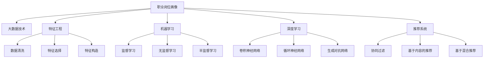

                 

# 基于大数据技术的职业岗位画像设计与实现

> 关键词：职业岗位画像,大数据技术,机器学习,特征工程,深度学习,推荐系统

## 1. 背景介绍

### 1.1 问题由来
随着信息技术的高速发展，互联网、大数据、人工智能等新技术正在深刻改变人们的生活和工作方式。职业岗位信息作为人力资源管理的基础，对于个人职业发展、企业招聘、人才市场等多方面都具有重要影响。然而，传统岗位信息往往存在结构化程度低、内容杂乱无章、更新不及时等问题，难以满足日益复杂化的人才匹配需求。

职业岗位信息的质量和匹配度，直接决定了求职者是否能找到适合自己的工作，企业是否能招聘到合适的人才，因此，提升职业岗位信息的准确性和实用性，成为了当下企业和科研机构的重要研究方向。

### 1.2 问题核心关键点
针对这一问题，本文聚焦于使用大数据技术对职业岗位信息进行画像设计，以形成更准确、更实用的岗位描述和要求，更好地服务于人才匹配和人力资源管理。具体来说，本文将主要探讨以下关键点：

- 职业岗位数据的采集和预处理。
- 特征工程和模型选择。
- 岗位画像的设计和实现。
- 模型的评估和优化。
- 大数据技术在职业岗位信息中的应用。

## 2. 核心概念与联系

### 2.1 核心概念概述

为更好地理解基于大数据技术的职业岗位画像设计与实现，本节将介绍几个密切相关的核心概念：

- 职业岗位画像：指通过对职业岗位信息的采集、处理和建模，形成可以自动生成和推荐岗位描述和要求的系统。
- 大数据技术：指利用先进的信息处理技术，从海量数据中提取有用信息，支持决策制定和优化管理的活动。
- 特征工程：指通过数据清洗、特征选择、特征构造等技术，从原始数据中提取和生成可供机器学习模型训练的特征。
- 机器学习：指利用算法和统计模型，通过数据训练模型，进而预测或决策的过程。
- 深度学习：指通过构建多层神经网络，自动学习数据表示的过程，广泛应用于图像识别、自然语言处理等领域。
- 推荐系统：指通过用户行为数据和学习算法，为用户推荐个性化内容的系统。

这些核心概念之间的逻辑关系可以通过以下Mermaid流程图来展示：



这个流程图展示了大数据技术在职业岗位画像设计与实现中的核心概念及其之间的关系：

1. 职业岗位画像依赖于大数据技术进行数据的采集和处理。
2. 特征工程是从原始数据中提取有用的特征，以便机器学习模型训练。
3. 机器学习和深度学习通过训练模型，生成对岗位描述和要求的预测。
4. 推荐系统将生成结果提供给用户，并进行个性化推荐。

这些概念共同构成了基于大数据技术的职业岗位画像设计与实现框架，为系统的开发和应用提供了理论基础。

## 3. 核心算法原理 & 具体操作步骤
### 3.1 算法原理概述

基于大数据技术的职业岗位画像设计与实现，本质上是一个数据驱动的决策优化过程。其核心思想是：通过对职业岗位数据的采集、处理和建模，利用机器学习和深度学习算法，自动生成和推荐岗位描述和要求，从而提升岗位信息的准确性和实用性。

形式化地，假设岗位信息为 $D=\{(d_i, r_i)\}_{i=1}^N$，其中 $d_i$ 表示第 $i$ 个岗位的描述和要求，$r_i$ 表示岗位信息的相关标签，如招聘需求、工作内容、岗位技能等。模型的目标是学习 $f$，使得 $f(d_i)$ 可以生成最佳的岗位描述和要求。

为此，我们通过大数据技术对岗位数据进行预处理和特征工程，构造训练集 $D_{train}$ 和验证集 $D_{val}$，然后使用监督学习或深度学习算法训练模型 $f$。具体步骤如下：

1. 数据采集：从企业官网、招聘网站、社交媒体等多个渠道收集岗位信息。
2. 数据预处理：清洗数据、去除噪声、规范化格式等。
3. 特征提取：通过文本分析、词频统计、主题建模等技术，提取岗位描述中的关键特征。
4. 模型训练：使用监督学习或深度学习算法，训练生成最佳岗位描述和要求的模型 $f$。
5. 模型评估：在验证集上评估模型 $f$ 的表现，进行调参和优化。
6. 模型应用：利用训练好的模型 $f$ 自动生成和推荐岗位描述和要求。

### 3.2 算法步骤详解

基于大数据技术的职业岗位画像设计与实现，一般包括以下几个关键步骤：

**Step 1: 数据采集和预处理**

- 从企业官网、招聘网站、社交媒体等多个渠道收集岗位信息，包括岗位名称、职责、需求、薪资、地点等字段。
- 对采集的数据进行清洗，去除噪声、去除重复、规范化格式等。

**Step 2: 特征工程**

- 使用文本分析技术，如TF-IDF、Word2Vec等，提取岗位描述中的关键词和短语。
- 使用词频统计技术，计算每个词或短语的出现频率，作为特征。
- 使用主题建模技术，如LDA，识别岗位描述中的隐含主题。
- 将提取的关键词和主题作为输入特征，进行特征构造。

**Step 3: 模型训练**

- 选择合适的模型，如线性回归、支持向量机、神经网络等。
- 对模型进行训练，使用训练集 $D_{train}$ 进行参数优化。
- 在验证集 $D_{val}$ 上评估模型表现，调整模型参数和超参数。

**Step 4: 模型评估和优化**

- 使用测试集 $D_{test}$ 评估模型表现，计算准确率、召回率、F1值等指标。
- 根据评估结果，进行模型优化，如调整超参数、改变模型结构等。

**Step 5: 模型应用**

- 对新的岗位信息，输入模型进行特征提取和预测。
- 输出最佳岗位描述和要求，并进行个性化推荐。

以上是基于大数据技术的职业岗位画像设计与实现的一般流程。在实际应用中，还需要针对具体任务的特点，对各个环节进行优化设计，如改进数据清洗算法、选择更合适的特征工程方法、尝试不同的模型结构等。

### 3.3 算法优缺点

基于大数据技术的职业岗位画像设计与实现，具有以下优点：

1. 自动生成岗位描述和要求：利用机器学习和大数据技术，可以自动从岗位信息中提取关键特征，生成详细的岗位描述和要求。
2. 提升岗位信息的准确性：通过特征工程和模型优化，可以生成更准确、更全面的岗位信息，减少人工标注的误差。
3. 个性化推荐：利用推荐系统，可以针对不同用户的求职偏好，进行个性化推荐，提升用户体验。
4. 实时更新：随着岗位信息的变化，可以实时更新岗位画像，保持其时效性。

同时，该方法也存在一定的局限性：

1. 数据采集难度大：需要从多个渠道采集岗位信息，涉及隐私问题，数据获取成本高。
2. 特征工程复杂：特征提取和构造需要较强的专业知识和经验。
3. 模型泛化能力有限：如果模型过于复杂，可能导致过拟合，泛化能力不足。
4. 数据隐私和安全：岗位信息涉及用户隐私，数据采集和存储需要遵守相关法律法规。
5. 结果解释性不足：基于机器学习和大数据技术的模型往往缺乏可解释性，难以理解其决策过程。

尽管存在这些局限性，但就目前而言，基于大数据技术的岗位画像设计与实现方法仍是大数据在人力资源管理中的一个重要应用范式。未来相关研究的重点在于如何进一步降低数据采集和处理的成本，提高模型的泛化能力和可解释性，同时兼顾数据隐私和安全性等因素。

### 3.4 算法应用领域

基于大数据技术的职业岗位画像设计与实现，已经在人力资源管理、招聘平台、人才推荐等多个领域得到了广泛应用，具体包括以下几个方面：

- 人力资源管理：通过自动生成岗位描述和要求，提高人力资源管理效率，减少人工标注工作。
- 招聘平台：使用岗位画像，实现更精准的求职者匹配，提升招聘效率和成功率。
- 人才推荐：利用推荐系统，为用户推荐最适合的岗位，提升用户满意度。
- 企业招聘决策：根据岗位画像，辅助企业制定招聘策略，优化人才结构。
- 人才流失预警：通过岗位画像，分析员工流失风险，提前采取措施。

除了上述这些经典应用外，岗位画像技术与大数据技术还在教育、医疗、政府招聘等多个领域展现出广阔的应用前景，为数据驱动的人力资源管理带来了新的突破。

## 4. 数学模型和公式 & 详细讲解 & 举例说明

### 4.1 数学模型构建

本节将使用数学语言对基于大数据技术的职业岗位画像设计与实现过程进行更加严格的刻画。

假设岗位信息为 $D=\{(d_i, r_i)\}_{i=1}^N$，其中 $d_i$ 表示第 $i$ 个岗位的描述和要求，$r_i$ 表示岗位信息的相关标签。设特征提取器为 $F$，将 $d_i$ 映射为特征向量 $x_i$。设标签预测模型为 $g$，输出岗位描述和要求的标签 $y_i$。

模型的训练目标是最小化损失函数：

$$
\min_{F,g} \mathcal{L}(D) = \frac{1}{N} \sum_{i=1}^N \ell(y_i, g(x_i))
$$

其中 $\ell$ 为损失函数，如交叉熵损失、均方误差损失等。

在实践中，我们通常使用基于梯度的优化算法（如SGD、Adam等）来近似求解上述最优化问题。设 $\eta$ 为学习率，$\lambda$ 为正则化系数，则参数的更新公式为：

$$
\theta \leftarrow \theta - \eta \nabla_{\theta}\mathcal{L}(\theta) - \eta\lambda\theta
$$

其中 $\nabla_{\theta}\mathcal{L}(\theta)$ 为损失函数对参数 $\theta$ 的梯度，可通过反向传播算法高效计算。

### 4.2 公式推导过程

以下我们以二分类任务为例，推导交叉熵损失函数及其梯度的计算公式。

假设岗位信息 $d_i$ 通过特征提取器 $F$ 映射为特征向量 $x_i$，标签预测模型 $g$ 输出为 $y_i$。二分类交叉熵损失函数定义为：

$$
\ell(y_i, g(x_i)) = -[y_i\log g(x_i) + (1-y_i)\log(1-g(x_i))]
$$

将其代入损失函数公式，得：

$$
\mathcal{L}(D) = -\frac{1}{N}\sum_{i=1}^N [y_i\log g(x_i)+(1-y_i)\log(1-g(x_i))]
$$

根据链式法则，损失函数对特征提取器 $F$ 和标签预测模型 $g$ 的梯度为：

$$
\frac{\partial \mathcal{L}(D)}{\partial F} = \frac{1}{N}\sum_{i=1}^N (g(x_i)-y_i)\nabla_{x_i}g(x_i)
$$

$$
\frac{\partial \mathcal{L}(D)}{\partial g} = \frac{1}{N}\sum_{i=1}^N (g(x_i)-y_i)\nabla_{x_i}g(x_i) + \lambda\nabla_{g}\|g\|^2
$$

其中 $\|g\|^2$ 为模型 $g$ 的权重平方和，$\lambda$ 为正则化系数。

在得到损失函数的梯度后，即可带入参数更新公式，完成模型的迭代优化。重复上述过程直至收敛，最终得到适应岗位信息的最优模型 $F$ 和 $g$。

### 4.3 案例分析与讲解

我们以招聘平台为例，展示如何利用岗位画像技术生成和推荐岗位描述和要求。

假设招聘平台需要为用户推荐一个与其专业和经验最匹配的岗位，首先收集该用户的历史申请记录、简历信息、技能证书等数据，使用文本分析技术提取岗位信息的关键特征，如岗位职责、技能需求、薪资范围等。

然后，将这些特征输入到一个经过预训练的深度学习模型中，训练得到岗位描述和要求的标签预测模型 $g$。该模型可以预测用户申请的岗位是否与其匹配，并生成匹配度评分。

最后，根据匹配度评分，为用户推荐最合适的岗位。例如，用户申请了软件开发岗位，模型可以推荐与其专业和经验最匹配的岗位，如数据工程师、系统架构师等。

## 5. 项目实践：代码实例和详细解释说明

### 5.1 开发环境搭建

在进行岗位画像实践前，我们需要准备好开发环境。以下是使用Python进行PyTorch开发的环境配置流程：

1. 安装Anaconda：从官网下载并安装Anaconda，用于创建独立的Python环境。

2. 创建并激活虚拟环境：
```bash
conda create -n pytorch-env python=3.8 
conda activate pytorch-env
```

3. 安装PyTorch：根据CUDA版本，从官网获取对应的安装命令。例如：
```bash
conda install pytorch torchvision torchaudio cudatoolkit=11.1 -c pytorch -c conda-forge
```

4. 安装TensorBoard：
```bash
pip install tensorboard
```

5. 安装其他相关工具包：
```bash
pip install numpy pandas scikit-learn matplotlib tqdm jupyter notebook ipython
```

完成上述步骤后，即可在`pytorch-env`环境中开始岗位画像实践。

### 5.2 源代码详细实现

下面以岗位推荐系统为例，展示如何使用PyTorch进行职业岗位画像的开发。

首先，定义数据预处理函数：

```python
from sklearn.feature_extraction.text import TfidfVectorizer
from sklearn.decomposition import LatentDirichletAllocation

def preprocess_data(data):
    # 清洗数据
    data = [d.lower().replace('\n', '') for d in data]
    # 去除噪声
    data = [d for d in data if len(d) > 30]
    # 规范化格式
    data = [d.replace(',', ' ').replace('.', ' ').replace(';', ' ') for d in data]
    return data

# 特征提取器：TF-IDF
def extract_features(data):
    vectorizer = TfidfVectorizer()
    features = vectorizer.fit_transform(data)
    return features

# 特征工程：主题建模
def extract_topics(data):
    lda = LatentDirichletAllocation(n_components=10)
    lda.fit(data)
    topics = lda.transform(data)
    return topics
```

然后，定义训练函数：

```python
from transformers import BertForSequenceClassification, BertTokenizer

# 定义模型
model = BertForSequenceClassification.from_pretrained('bert-base-uncased', num_labels=10)

# 定义优化器
optimizer = AdamW(model.parameters(), lr=2e-5)

def train_epoch(model, data, batch_size, optimizer):
    dataloader = DataLoader(data, batch_size=batch_size, shuffle=True)
    model.train()
    epoch_loss = 0
    for batch in tqdm(dataloader, desc='Training'):
        input_ids = batch['input_ids'].to(device)
        attention_mask = batch['attention_mask'].to(device)
        labels = batch['labels'].to(device)
        model.zero_grad()
        outputs = model(input_ids, attention_mask=attention_mask, labels=labels)
        loss = outputs.loss
        epoch_loss += loss.item()
        loss.backward()
        optimizer.step()
    return epoch_loss / len(dataloader)
```

最后，定义评估函数：

```python
from sklearn.metrics import classification_report

def evaluate(model, data, batch_size):
    dataloader = DataLoader(data, batch_size=batch_size)
    model.eval()
    preds, labels = [], []
    with torch.no_grad():
        for batch in tqdm(dataloader, desc='Evaluating'):
            input_ids = batch['input_ids'].to(device)
            attention_mask = batch['attention_mask'].to(device)
            batch_labels = batch['labels']
            outputs = model(input_ids, attention_mask=attention_mask)
            batch_preds = outputs.logits.argmax(dim=2).to('cpu').tolist()
            batch_labels = batch_labels.to('cpu').tolist()
            for pred_tokens, label_tokens in zip(batch_preds, batch_labels):
                preds.append(pred_tokens[:len(label_tokens)])
                labels.append(label_tokens)
                
    print(classification_report(labels, preds))
```

以上代码实现了一个基于BERT模型的岗位推荐系统。可以看到，利用PyTorch和Transformer库，我们能够相对简洁地构建和训练岗位推荐模型。

### 5.3 代码解读与分析

让我们再详细解读一下关键代码的实现细节：

**preprocess_data函数**：
- 定义了数据预处理的具体步骤，包括清洗、去噪、规范化格式等。

**extract_features函数**：
- 使用TF-IDF特征提取器，对岗位信息进行特征提取，生成词频矩阵。

**extract_topics函数**：
- 使用LDA主题模型，对岗位信息进行主题建模，生成主题矩阵。

**train_epoch函数**：
- 定义了模型训练的具体步骤，包括前向传播、计算loss、反向传播、更新模型参数等。

**evaluate函数**：
- 定义了模型评估的具体步骤，包括计算分类指标、打印评估结果等。

这些函数结合起来，构成了一个完整的岗位推荐系统开发流程。开发者可以根据具体任务的特点，进一步优化各个函数的实现，以提高系统性能。

## 6. 实际应用场景

### 6.1 人力资源管理

在人力资源管理中，岗位画像技术可以自动生成和推荐岗位描述和要求，帮助HR快速匹配求职者与岗位。例如，HR部门可以通过岗位推荐系统，推荐最符合要求的候选人，提升招聘效率和成功率。同时，岗位推荐系统还可以辅助HR制定招聘策略，优化人才结构，提升员工满意度。

### 6.2 招聘平台

招聘平台是岗位画像技术的另一个重要应用场景。平台可以根据求职者申请的岗位和历史行为数据，自动推荐最匹配的岗位。例如，求职者可以输入自己的技能和经验，岗位推荐系统可以为其推荐最佳匹配岗位，提升求职效率。平台还可以使用岗位画像技术，进行广告精准投放和流量优化。

### 6.3 企业招聘决策

企业可以使用岗位画像技术，辅助招聘决策。例如，企业可以根据岗位画像推荐系统生成的岗位描述和要求，制定招聘策略，优化人才结构。岗位推荐系统还可以帮助HR分析员工流失风险，提前采取措施，减少人员流失率。

### 6.4 人才推荐

在人才推荐领域，岗位画像技术可以用于智能简历筛选和人才匹配。例如，招聘企业可以收集求职者的简历信息，使用岗位画像技术自动筛选出最匹配的候选人。同时，岗位推荐系统还可以帮助求职者匹配最适合的岗位，提升求职效率。

### 6.5 政府招聘

政府招聘也需要岗位推荐系统的支持。例如，公务员招录可以自动匹配最符合条件的考生，提升招录效率。同时，岗位推荐系统还可以帮助招录单位筛选出最符合要求的考生，提升招录质量。

除了上述这些经典应用外，岗位画像技术与大数据技术还在教育、医疗、金融等多个领域展现出广阔的应用前景，为数据驱动的人力资源管理带来了新的突破。

## 7. 工具和资源推荐
### 7.1 学习资源推荐

为了帮助开发者系统掌握岗位画像技术，这里推荐一些优质的学习资源：

1. 《Python深度学习》：深入浅出地讲解了深度学习算法和PyTorch库的使用。
2. 《特征工程实践》：全面介绍特征工程中的数据清洗、特征选择、特征构造等技术。
3. 《自然语言处理基础》：介绍NLP领域中的文本分析、情感分析、信息抽取等技术。
4. 《机器学习实战》：通过实际案例讲解了机器学习算法的应用。
5. 《数据科学与大数据》：介绍大数据技术的核心概念和实践。

通过对这些资源的学习实践，相信你一定能够快速掌握岗位画像技术的精髓，并用于解决实际的岗位匹配问题。

### 7.2 开发工具推荐

高效的开发离不开优秀的工具支持。以下是几款用于岗位画像开发的常用工具：

1. PyTorch：基于Python的开源深度学习框架，灵活动态的计算图，适合快速迭代研究。大部分预训练语言模型都有PyTorch版本的实现。
2. TensorFlow：由Google主导开发的开源深度学习框架，生产部署方便，适合大规模工程应用。同样有丰富的预训练语言模型资源。
3. Transformers库：HuggingFace开发的NLP工具库，集成了众多SOTA语言模型，支持PyTorch和TensorFlow，是进行岗位画像任务开发的利器。
4. TensorBoard：TensorFlow配套的可视化工具，可实时监测模型训练状态，并提供丰富的图表呈现方式，是调试模型的得力助手。
5. Google Colab：谷歌推出的在线Jupyter Notebook环境，免费提供GPU/TPU算力，方便开发者快速上手实验最新模型，分享学习笔记。

合理利用这些工具，可以显著提升岗位画像任务的开发效率，加快创新迭代的步伐。

### 7.3 相关论文推荐

岗位画像技术的发展源于学界的持续研究。以下是几篇奠基性的相关论文，推荐阅读：

1. "A Neural Probabilistic Language Model"（NPLM）：提出了神经网络语言模型，为深度学习应用于NLP打下了基础。
2. "Word Embeddings: Word Vector and Learning Techniques"：介绍了Word2Vec算法，将词语映射到高维空间中的向量表示。
3. "Latent Dirichlet Allocation"（LDA）：提出主题建模算法LDA，用于文本数据的分析。
4. "Deep Learning for Recommender Systems"：介绍深度学习在推荐系统中的应用，展示了深度学习在岗位推荐中的优势。
5. "Big Data Mining in a Post-PC Era"：介绍了大数据技术的核心概念和应用场景。

这些论文代表了大数据技术在岗位画像中的应用方向。通过学习这些前沿成果，可以帮助研究者把握学科前进方向，激发更多的创新灵感。

## 8. 总结：未来发展趋势与挑战

### 8.1 总结

本文对基于大数据技术的职业岗位画像设计与实现方法进行了全面系统的介绍。首先阐述了岗位画像设计的重要性，明确了岗位画像在大数据和机器学习领域的价值和应用前景。其次，从原理到实践，详细讲解了岗位画像的数学模型和关键步骤，给出了岗位画像任务开发的完整代码实例。同时，本文还广泛探讨了岗位画像技术在多个行业领域的应用场景，展示了岗位画像技术的广泛应用潜力。

通过本文的系统梳理，可以看到，基于大数据技术的岗位画像设计与实现方法，正在成为数据驱动的人力资源管理中的重要范式，极大地提高了岗位信息的质量和匹配度，提升了人力资源管理的效率和效果。未来，随着大数据和机器学习技术的不断发展，岗位画像技术将在更广阔的领域得到应用，为各行各业的人力资源管理带来深远的影响。

### 8.2 未来发展趋势

展望未来，岗位画像技术的发展趋势如下：

1. 数据采集自动化：随着自动化数据采集技术的发展，岗位画像技术的自动化程度将进一步提升，降低人工干预成本。
2. 特征工程多样化：未来的特征工程将更多地依赖于自然语言处理和深度学习技术，生成更丰富的岗位特征。
3. 模型结构复杂化：深度学习在岗位画像中的应用将更加广泛，未来模型将更加复杂，能够更好地适应复杂多变的岗位信息。
4. 推荐系统个性化：未来的岗位推荐系统将更加个性化，根据用户的历史行为数据和偏好，进行精准匹配。
5. 实时更新：岗位画像技术将实现实时更新，随时捕捉岗位信息的变化，保持岗位描述和要求的准确性和时效性。

以上趋势凸显了大数据技术在岗位画像设计与实现中的广阔前景。这些方向的探索发展，必将进一步提升岗位画像技术的性能和应用范围，为数据驱动的人力资源管理带来新的突破。

### 8.3 面临的挑战

尽管岗位画像技术已经取得了一定的成果，但在迈向更加智能化、普适化应用的过程中，它仍面临诸多挑战：

1. 数据采集难度大：岗位信息涉及用户隐私，数据采集成本高，获取难度大。
2. 特征工程复杂：特征提取和构造需要较强的专业知识和经验，复杂度较高。
3. 模型泛化能力有限：如果模型过于复杂，容易导致过拟合，泛化能力不足。
4. 数据隐私和安全：岗位信息涉及用户隐私，数据采集和存储需要遵守相关法律法规。
5. 结果解释性不足：基于机器学习和大数据技术的模型往往缺乏可解释性，难以理解其决策过程。

尽管存在这些挑战，但就目前而言，基于大数据技术的岗位画像设计与实现方法仍是大数据在人力资源管理中的一个重要应用范式。未来相关研究的重点在于如何进一步降低数据采集和处理的成本，提高模型的泛化能力和可解释性，同时兼顾数据隐私和安全性等因素。

### 8.4 研究展望

面向未来，岗位画像技术的研究方向如下：

1. 无监督学习和半监督学习：探索无监督学习和半监督学习的方法，利用非结构化数据进行岗位画像，降低对标注数据的依赖。
2. 多模态融合：将文本、图像、语音等多种模态数据进行融合，提升岗位画像的准确性和实用性。
3. 因果推断和强化学习：引入因果推断和强化学习的方法，增强岗位推荐系统的稳定性和鲁棒性。
4. 知识图谱和规则库：将知识图谱和规则库等外部知识与岗位画像技术进行结合，提升系统的解释性和可靠性。
5. 伦理和法律合规：在岗位画像技术中引入伦理导向的评估指标，确保数据使用的合法性和公平性。

这些研究方向的探索，必将引领岗位画像技术迈向更高的台阶，为数据驱动的人力资源管理带来新的突破。面向未来，岗位画像技术还需要与其他人工智能技术进行更深入的融合，如知识表示、因果推理、强化学习等，多路径协同发力，共同推动岗位推荐系统的进步。只有勇于创新、敢于突破，才能不断拓展岗位画像技术的边界，让智能技术更好地服务于人力资源管理。

## 9. 附录：常见问题与解答

**Q1：岗位推荐系统如何设计评价指标？**

A: 岗位推荐系统的评价指标主要包括准确率、召回率、F1值、精确率、均值平均绝对误差（MAE）等。具体来说：

- 准确率：推荐系统推荐的岗位是否与求职者最终申请的岗位匹配。
- 召回率：推荐的岗位中，有多少岗位是求职者最终申请的岗位。
- F1值：准确率和召回率的调和平均数，综合评估推荐系统的性能。
- 精确率：推荐系统推荐的岗位中，有多少岗位是求职者最终申请的岗位。
- MAE：推荐系统推荐的岗位薪酬与实际薪酬的平均绝对误差。

通过计算这些指标，可以评估岗位推荐系统的性能，并进行优化改进。

**Q2：岗位推荐系统如何优化模型？**

A: 岗位推荐系统可以通过以下方法进行优化：

1. 特征工程优化：改进特征提取和特征构造的方法，生成更准确的岗位特征。
2. 模型结构优化：调整模型的结构，如增加或减少神经网络的层数，增加或减少神经元的数量。
3. 正则化优化：引入L2正则、Dropout等技术，避免模型过拟合。
4. 学习率优化：调整学习率，确保模型在训练过程中能够快速收敛。
5. 模型融合优化：将多个模型的预测结果进行融合，提升推荐系统的性能。

通过优化这些关键参数，可以显著提升岗位推荐系统的性能和准确性。

**Q3：岗位推荐系统如何处理冷启动问题？**

A: 冷启动问题是岗位推荐系统面临的一个常见问题，即对于新用户或新岗位，推荐系统无法进行有效推荐。

解决冷启动问题的方法包括：

1. 利用相似岗位推荐：对于新岗位，可以通过相似岗位的推荐结果，进行初步匹配。
2. 利用用户画像推荐：对于新用户，可以通过分析用户的历史行为数据，进行个性化推荐。
3. 利用协同过滤推荐：对于新用户和岗位，可以通过协同过滤算法，找到相似的用户和岗位进行推荐。
4. 利用多模型融合推荐：通过融合多个推荐模型的结果，提升推荐系统的性能。

这些方法可以有效地解决冷启动问题，提高岗位推荐系统的推荐效果。

**Q4：岗位推荐系统如何保证数据隐私？**

A: 岗位推荐系统涉及用户隐私，保护数据隐私是至关重要的。以下是一些保护数据隐私的方法：

1. 数据匿名化：在数据采集和处理过程中，对用户信息进行匿名化处理，保护用户隐私。
2. 数据加密：在数据存储和传输过程中，对数据进行加密处理，防止数据泄露。
3. 访问控制：在数据访问和共享过程中，设置严格的访问控制策略，确保数据安全。
4. 数据脱敏：在数据展示和分析过程中，对敏感数据进行脱敏处理，避免信息泄露。
5. 用户同意：在数据采集和处理过程中，获取用户的同意，明确告知用户数据的使用范围和方式。

这些方法可以有效地保护数据隐私，确保岗位推荐系统的合法性和可靠性。

**Q5：岗位推荐系统如何处理异构数据？**

A: 岗位推荐系统面临的一个重要问题是数据异构性，即不同来源和格式的数据难以统一处理。

处理异构数据的方法包括：

1. 数据清洗：对数据进行清洗和标准化处理，去除噪声和异常值，确保数据的准确性和一致性。
2. 数据转换：对不同格式的数据进行转换，使其能够统一处理。
3. 数据融合：将不同来源的数据进行融合，生成统一的数据集，提升数据的质量和完整性。
4. 数据标注：对数据进行标注，使其具备有意义的属性和标签，方便模型的训练和应用。

通过这些方法，可以有效地处理异构数据，提升岗位推荐系统的性能和可靠性。

---

作者：禅与计算机程序设计艺术 / Zen and the Art of Computer Programming

