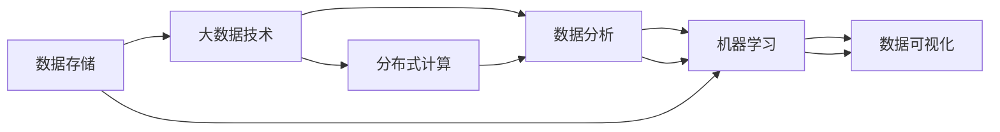

                 

# 基于大数据的游戏数据分析系统的设计与实现

> 关键词：游戏数据分析,大数据技术,机器学习,数据可视化,分布式计算

## 1. 背景介绍

### 1.1 问题由来
近年来，随着游戏行业的发展，数据量急剧增长，对游戏数据分析的需求日益增长。传统的游戏数据分析主要依赖人工统计和经验分析，耗费大量时间和人力，且难以处理大规模数据。因此，基于大数据技术的游戏数据分析系统应运而生，通过对海量游戏数据进行高效存储和分析，为游戏开发者和运营者提供有力的数据支持，优化游戏策略和运营决策。

### 1.2 问题核心关键点
本节将详细介绍基于大数据技术的游戏数据分析系统的主要问题和挑战：

- 数据存储：如何高效存储和处理海量游戏数据，避免数据丢失和冗余。
- 数据分析：如何在海量数据中提取有价值的信息，进行用户行为分析、游戏策略优化、市场趋势预测等。
- 数据可视化：如何将分析结果直观展示，帮助开发者和运营者理解数据，做出决策。
- 分布式计算：如何在多节点环境中高效计算，提升数据分析的实时性和稳定性。
- 数据隐私和安全：如何保护玩家隐私数据，防止数据泄露和安全攻击。

通过回答这些问题，我们可以更好地理解游戏数据分析系统的核心技术和实施策略。

### 1.3 问题研究意义
构建基于大数据的游戏数据分析系统，对于游戏行业的创新和发展具有重要意义：

- 优化游戏策略：通过数据分析，游戏开发者可以更精准地理解用户需求，优化游戏设计。
- 提升运营效率：游戏运营者可以通过数据分析，进行市场细分和用户行为分析，提升运营效果。
- 支持决策制定：大数据分析系统可以为游戏公司提供数据驱动的决策支持，减少决策风险。
- 促进业务创新：大数据技术可以应用于游戏内广告、推荐系统、个性化内容生成等场景，创新游戏体验。
- 增强用户粘性：通过个性化推荐和精准营销，提升用户留存率和游戏粘性。

因此，基于大数据的游戏数据分析系统是游戏行业数字化转型的重要工具，对于推动游戏行业的技术进步和业务创新具有重大价值。

## 2. 核心概念与联系

### 2.1 核心概念概述

为更好地理解基于大数据的游戏数据分析系统，本节将介绍几个核心概念：

- 游戏数据分析(Game Data Analytics)：通过数据挖掘和分析，从游戏中提取有价值的信息，帮助开发者和运营者做出决策。
- 大数据技术(Big Data Technology)：包括数据存储、数据处理、数据分析、数据可视化等技术，用于高效处理和分析海量数据。
- 分布式计算(Distributed Computing)：通过多台计算机协同工作，提升数据处理和计算的效率和稳定性。
- 机器学习(Machine Learning)：利用算法模型从数据中提取规律，进行预测和决策。
- 数据可视化(Data Visualization)：通过图表、图形等方式展示数据分析结果，便于理解和决策。

这些核心概念之间通过逻辑关系紧密相连，共同构成了基于大数据的游戏数据分析系统的技术基础。

### 2.2 核心概念原理和架构的 Mermaid 流程图

以下是一个简化版的Mermaid流程图，展示核心概念之间的关系：



这个流程图展示了数据存储、大数据技术、分布式计算、数据分析、机器学习和数据可视化之间的逻辑联系。

- 数据存储是基础，通过存储海量游戏数据，为后续分析提供数据来源。
- 大数据技术提供了高效的数据处理和分析能力，支持大规模数据分析。
- 分布式计算利用多台计算机的协同工作，提升了数据处理和计算的效率和稳定性。
- 数据分析从存储和处理的数据中提取有价值的信息，支持决策和优化。
- 机器学习利用数据分析结果，进行预测和决策。
- 数据可视化将分析结果直观展示，便于理解和决策。

通过这个流程图的展示，我们可以更直观地理解这些核心概念之间的联系和作用。

## 3. 核心算法原理 & 具体操作步骤

### 3.1 算法原理概述

基于大数据的游戏数据分析系统主要涉及以下算法和技术：

- 数据清洗和预处理：从原始数据中去除噪声和异常值，进行缺失值处理和特征工程。
- 分布式数据存储和处理：利用分布式数据库和计算框架，高效存储和处理海量数据。
- 机器学习模型构建：选择适当的机器学习模型，进行训练和优化。
- 数据可视化工具应用：利用可视化工具将分析结果直观展示，支持决策和优化。

### 3.2 算法步骤详解

基于大数据的游戏数据分析系统的构建主要包括以下几个关键步骤：

**Step 1: 数据收集与清洗**
- 从游戏服务器、移动应用、社交平台等渠道收集数据。
- 对收集的数据进行清洗和预处理，去除噪声和异常值，填补缺失值。

**Step 2: 数据存储与管理**
- 利用分布式数据库（如Hadoop、Spark）高效存储数据，避免数据丢失和冗余。
- 对数据进行分片和管理，提升查询效率。

**Step 3: 数据处理与分析**
- 利用分布式计算框架（如Spark、Flink）进行数据处理和分析。
- 提取用户行为数据、游戏策略数据、市场趋势数据等关键信息。

**Step 4: 机器学习模型构建**
- 根据业务需求，选择合适的机器学习模型，如回归模型、分类模型、聚类模型等。
- 对模型进行训练和优化，提升模型精度和泛化能力。

**Step 5: 数据分析与展示**
- 利用数据可视化工具（如Tableau、Power BI）将分析结果直观展示，支持决策和优化。
- 实时监控数据分析结果，及时调整策略。

**Step 6: 系统部署与维护**
- 将数据分析系统部署到生产环境，确保系统的稳定性和可靠性。
- 定期维护和更新系统，提升系统性能和安全性。

### 3.3 算法优缺点

基于大数据的游戏数据分析系统具有以下优点：

- 高效存储和处理海量数据：通过分布式存储和计算，提升数据处理效率和稳定性。
- 灵活的机器学习模型选择：可以根据不同的业务需求选择适当的机器学习模型，提升分析效果。
- 直观的数据可视化：通过可视化工具将分析结果直观展示，便于理解和决策。

同时，该系统也存在以下缺点：

- 高成本：需要高性能的硬件设备和先进的算法技术，成本较高。
- 复杂性：系统构建和维护需要较强的技术背景和专业知识。
- 数据隐私和安全：需要保护玩家隐私数据，防止数据泄露和安全攻击。

### 3.4 算法应用领域

基于大数据的游戏数据分析系统可以应用于以下领域：

- 用户行为分析：通过数据分析，了解用户游戏习惯和行为模式，优化游戏体验。
- 游戏策略优化：利用数据分析，进行游戏策略调整，提升游戏平衡性和趣味性。
- 市场趋势预测：通过数据分析，预测游戏市场趋势和用户需求，制定有效的市场策略。
- 个性化推荐：利用数据分析，进行个性化内容推荐，提升用户粘性和满意度。
- 风险监控：通过数据分析，监控游戏风险，及时发现和解决问题，保障游戏安全。

## 4. 数学模型和公式 & 详细讲解 & 举例说明

### 4.1 数学模型构建

以下是一个简单的游戏用户行为分析模型：

- 用户数据：包括用户ID、登录时间、游戏时长、消费金额等。
- 游戏数据：包括游戏ID、关卡难度、成就解锁情况等。
- 市场数据：包括广告投放、营销活动等。

构建数学模型的目标是从上述数据中提取用户行为规律，进行行为预测和优化。常用的模型包括：

- 回归模型：用于预测用户消费金额、游戏时长等连续型变量。
- 分类模型：用于预测用户是否流失、是否付费等离散型变量。
- 聚类模型：用于将用户分成不同群体，进行差异化营销。

### 4.2 公式推导过程

以用户消费金额的预测为例，常用的回归模型为线性回归模型：

$$
y = \beta_0 + \beta_1 x_1 + \beta_2 x_2 + ... + \beta_n x_n + \epsilon
$$

其中，$y$ 表示用户消费金额，$\beta_0$ 为截距，$\beta_1, \beta_2, ..., \beta_n$ 为回归系数，$x_1, x_2, ..., x_n$ 为自变量（如登录时间、游戏时长、成就解锁情况等），$\epsilon$ 为误差项。

线性回归模型的目标是最小化误差项 $\epsilon$，常用的损失函数为均方误差（MSE）：

$$
MSE = \frac{1}{N} \sum_{i=1}^{N} (y_i - \hat{y}_i)^2
$$

其中，$N$ 为样本数量，$\hat{y}_i$ 为模型预测值，$y_i$ 为实际值。

通过最小化MSE，可以得到回归系数的估计值：

$$
\beta_k = \frac{\sum_{i=1}^{N} (x_{ik} - \overline{x}_{ik}) \sum_{i=1}^{N} (y_i - \overline{y})}{\sum_{i=1}^{N} (x_{ik} - \overline{x}_{ik})^2}, k=1,2,...,n
$$

其中，$\overline{x}_{ik}$ 和 $\overline{y}$ 分别为自变量和因变量的均值。

### 4.3 案例分析与讲解

以游戏用户流失预测为例，常用的分类模型为逻辑回归模型：

$$
P(y=1|x) = \frac{1}{1+e^{-(\beta_0 + \beta_1 x_1 + \beta_2 x_2 + ... + \beta_n x_n)}}
$$

其中，$y=1$ 表示用户流失，$y=0$ 表示用户不流失，$x_1, x_2, ..., x_n$ 为自变量（如登录频率、游戏时长、消费金额等），$\beta_0, \beta_1, \beta_2, ..., \beta_n$ 为回归系数。

通过逻辑回归模型，可以预测用户流失的概率，从而进行预警和干预。

## 5. 项目实践：代码实例和详细解释说明

### 5.1 开发环境搭建

在进行游戏数据分析系统开发前，需要准备好开发环境。以下是使用Python进行PyTorch开发的环境配置流程：

1. 安装Anaconda：从官网下载并安装Anaconda，用于创建独立的Python环境。

2. 创建并激活虚拟环境：
```bash
conda create -n pytorch-env python=3.8 
conda activate pytorch-env
```

3. 安装PyTorch：根据CUDA版本，从官网获取对应的安装命令。例如：
```bash
conda install pytorch torchvision torchaudio cudatoolkit=11.1 -c pytorch -c conda-forge
```

4. 安装Pandas和Scikit-Learn等数据处理和机器学习库：
```bash
pip install pandas scikit-learn matplotlib tqdm jupyter notebook ipython
```

5. 安装Spark和Hadoop等分布式计算框架：
```bash
pip install py4j pyspark hadoop
```

完成上述步骤后，即可在`pytorch-env`环境中开始数据分析系统的开发。

### 5.2 源代码详细实现

以下是使用PyTorch进行游戏数据分析系统的代码实现：

```python
import pandas as pd
from sklearn.model_selection import train_test_split
from sklearn.linear_model import LinearRegression
from sklearn.metrics import mean_squared_error, r2_score

# 数据读取和预处理
data = pd.read_csv('game_data.csv')
data = data.dropna()

# 特征选择和数据划分
X = data[['login_time', 'game_duration', 'achievement解锁']]
y = data['消费金额']
X_train, X_test, y_train, y_test = train_test_split(X, y, test_size=0.2)

# 模型训练和预测
model = LinearRegression()
model.fit(X_train, y_train)
y_pred = model.predict(X_test)

# 模型评估
mse = mean_squared_error(y_test, y_pred)
r2 = r2_score(y_test, y_pred)
print(f"MSE: {mse:.2f}, R^2: {r2:.2f}")
```

在上述代码中，我们使用Pandas读取游戏数据，并进行数据预处理和特征选择。然后，使用Scikit-Learn库中的LinearRegression模型进行回归分析，最后计算模型评估指标（均方误差和R^2）。

### 5.3 代码解读与分析

代码解读：

- 数据读取和预处理：使用Pandas读取游戏数据，并去除缺失值。
- 特征选择和数据划分：选择与预测目标相关的特征，进行数据划分。
- 模型训练和预测：使用LinearRegression模型进行回归分析，并对测试集进行预测。
- 模型评估：计算模型的均方误差和R^2，评估模型性能。

分析：

- 数据预处理是数据分析系统的基础，通过去除噪声和缺失值，提升数据质量。
- 特征选择是数据分析的关键步骤，选择合适的特征对预测目标有重要影响。
- 模型训练和预测是数据分析的核心环节，选择适当的模型并进行训练和预测，提升预测效果。
- 模型评估是数据分析的最终环节，通过评估指标（如MSE和R^2）评估模型性能，并指导模型优化。

## 6. 实际应用场景

### 6.1 智能推荐系统

基于游戏数据分析系统，可以构建智能推荐系统，推荐用户感兴趣的游戏内容和道具。通过分析用户的游戏行为数据，了解用户偏好，进行个性化推荐，提升用户粘性和满意度。

在技术实现上，可以使用协同过滤算法、内容推荐算法等方法，结合游戏数据分析系统中的用户行为数据和游戏属性数据，构建推荐模型。

### 6.2 用户行为分析

游戏数据分析系统可以用于用户行为分析，帮助开发者和运营者了解用户的游戏习惯和行为模式，优化游戏体验和运营策略。

通过分析用户的游戏时长、消费金额、活跃度等数据，可以进行用户行为分析，了解用户流失原因和行为特征，进行精准干预和优化。

### 6.3 游戏策略优化

游戏数据分析系统可以用于游戏策略优化，提升游戏平衡性和趣味性。

通过分析用户的游戏数据和市场数据，可以进行游戏策略调整，如关卡难度调整、成就解锁方式优化等，提升游戏体验和用户满意度。

### 6.4 市场趋势预测

游戏数据分析系统可以用于市场趋势预测，制定有效的市场策略。

通过分析游戏下载量、用户增长率、市场广告投放等数据，可以进行市场趋势预测，了解市场变化和用户需求，制定有效的市场策略，提升市场份额和用户增长。

## 7. 工具和资源推荐

### 7.1 学习资源推荐

为了帮助开发者系统掌握游戏数据分析系统的理论和实践，这里推荐一些优质的学习资源：

1. 《数据科学基础》系列博文：涵盖数据收集、数据清洗、数据处理、数据分析等基础知识，适合初学者入门。
2. 《Python数据科学手册》书籍：详细讲解Pandas、NumPy、Scikit-Learn等数据处理和机器学习库的使用。
3. 《游戏数据分析实战》书籍：结合实际案例，讲解游戏数据分析的完整流程和实用技巧。
4. 《机器学习实战》课程：斯坦福大学开设的机器学习课程，有Lecture视频和配套作业，适合进阶学习。
5. Kaggle游戏数据分析比赛：参加Kaggle等平台的游戏数据分析比赛，提升实战经验。

通过对这些资源的学习实践，相信你一定能够快速掌握游戏数据分析系统的精髓，并用于解决实际的游戏问题。

### 7.2 开发工具推荐

高效的开发离不开优秀的工具支持。以下是几款用于游戏数据分析系统开发的常用工具：

1. PyTorch：基于Python的开源深度学习框架，灵活动态的计算图，适合快速迭代研究。
2. Pandas：数据处理和分析工具，提供强大的数据清洗和预处理功能。
3. Scikit-Learn：机器学习库，提供丰富的回归、分类、聚类等算法。
4. Spark：分布式计算框架，支持大规模数据处理和分析。
5. Hadoop：分布式存储框架，支持海量数据的存储和管理。
6. Tableau：数据可视化工具，提供丰富的图表和图形展示功能。
7. Power BI：微软推出的数据可视化工具，支持实时数据展示和交互。

合理利用这些工具，可以显著提升游戏数据分析系统的开发效率，加快创新迭代的步伐。

### 7.3 相关论文推荐

游戏数据分析系统的发展源于学界的持续研究。以下是几篇奠基性的相关论文，推荐阅读：

1. Data Mining Game Monitoring and Analysis：介绍游戏数据分析的基本方法和技术，涵盖用户行为分析、游戏策略优化等。
2. A Survey on Data Mining Applications in Online Games：综述游戏数据分析的各类应用，包括市场趋势预测、个性化推荐等。
3. Learning from Big Data for Game Analytics：探讨利用大数据技术进行游戏数据分析，提升分析效果。
4. Game Analytics and Virtual Economy Modeling：分析游戏数据分析中的经济模型和预测方法，提升游戏经济系统。
5. Predicting Player Attrition Using Machine Learning Techniques in Online Games：介绍利用机器学习进行玩家流失预测的案例，提升用户留存率。

这些论文代表了大数据游戏数据分析技术的发展脉络。通过学习这些前沿成果，可以帮助研究者把握学科前进方向，激发更多的创新灵感。

## 8. 总结：未来发展趋势与挑战

### 8.1 总结

本文对基于大数据的游戏数据分析系统的设计与实现进行了全面系统的介绍。首先阐述了游戏数据分析系统的背景和意义，明确了数据分析系统的核心技术和实施策略。其次，从原理到实践，详细讲解了数据收集、预处理、存储、处理、分析、可视化等关键步骤，给出了完整的代码实例和详细解释。同时，本文还广泛探讨了数据分析系统在智能推荐、用户行为分析、游戏策略优化、市场趋势预测等场景中的应用，展示了数据分析系统的巨大潜力。

通过本文的系统梳理，可以看到，基于大数据的游戏数据分析系统在提升游戏体验、优化运营策略、预测市场趋势等方面具有重要价值。未来，随着大数据技术和机器学习算法的不断进步，游戏数据分析系统将更加高效、智能，为游戏行业带来更多创新和突破。

### 8.2 未来发展趋势

展望未来，游戏数据分析系统的发展呈现以下几个趋势：

1. 数据分析自动化：通过机器学习算法，实现数据分析自动化，提升数据分析效率和准确性。
2. 实时数据处理：利用流式计算框架，实现实时数据处理和分析，提升数据分析的时效性。
3. 多模态数据融合：结合游戏数据、用户行为数据、市场数据等多种模态数据，提升数据分析效果。
4. 深度学习应用：引入深度学习算法，提升数据分析的复杂性和精确度。
5. 联邦学习：利用分布式计算和多节点协同，保护用户隐私数据，提升数据分析的安全性。

这些趋势凸显了游戏数据分析系统的智能化和自动化发展方向，推动游戏行业的数字化转型和业务创新。

### 8.3 面临的挑战

尽管游戏数据分析系统已经取得了一定的成果，但在迈向更加智能化、普适化应用的过程中，它仍面临诸多挑战：

1. 高成本：需要高性能的硬件设备和先进的算法技术，成本较高。
2. 数据隐私和安全：需要保护玩家隐私数据，防止数据泄露和安全攻击。
3. 数据质量：需要保证数据质量和完整性，避免数据缺失和噪声干扰。
4. 算法复杂性：需要选择适当的算法和模型，提升数据分析效果。
5. 实时性和效率：需要提升数据分析的实时性和计算效率，确保系统稳定。

解决这些问题需要跨学科的合作和技术的不断进步。未来，游戏数据分析系统还需要进一步优化，提升其性能和稳定性，才能更好地服务于游戏行业的数字化转型。

### 8.4 研究展望

面对游戏数据分析系统所面临的挑战，未来的研究需要在以下几个方面寻求新的突破：

1. 数据预处理技术：提升数据清洗和特征工程的质量，提升数据处理效率和精度。
2. 分布式计算框架：优化分布式计算框架，提升数据分析的实时性和稳定性。
3. 深度学习算法：引入深度学习算法，提升数据分析的复杂性和精确度。
4. 联邦学习技术：利用联邦学习技术，保护用户隐私数据，提升数据分析的安全性。
5. 自动化算法选择：通过自动化算法选择和优化，提升数据分析效果和效率。

这些研究方向的探索发展，必将引领游戏数据分析系统迈向更高的台阶，为游戏行业带来更多创新和突破。只有勇于创新、敢于突破，才能不断拓展数据分析系统的边界，让数据分析技术更好地服务于游戏行业的数字化转型。

## 9. 附录：常见问题与解答

**Q1：游戏数据分析系统如何保证数据隐私和安全？**

A: 游戏数据分析系统需要保证玩家隐私数据的安全和隐私保护。常见的方法包括：

1. 数据加密：对敏感数据进行加密处理，防止数据泄露。
2. 访问控制：设置数据访问权限，限制非法访问。
3. 匿名化处理：对数据进行去标识化处理，保护玩家隐私。
4. 数据脱敏：对敏感信息进行脱敏处理，防止信息泄露。
5. 安全传输：使用安全传输协议，如SSL/TLS，保障数据传输安全。

通过这些措施，可以最大程度地保护玩家隐私数据，防止数据泄露和安全攻击。

**Q2：游戏数据分析系统中如何处理大规模数据？**

A: 游戏数据分析系统需要处理海量数据，常见的方法包括：

1. 分布式存储：使用Hadoop、Spark等分布式存储框架，将数据分散存储在多台计算机上，提升数据处理效率。
2. 分布式计算：使用Spark、Flink等分布式计算框架，进行大规模数据处理和分析。
3. 数据压缩：对数据进行压缩处理，减少存储空间和传输带宽。
4. 数据分片：对数据进行分片处理，提升数据查询效率。

通过这些方法，可以高效处理海量数据，提升数据分析系统的性能和稳定性。

**Q3：游戏数据分析系统中如何进行实时数据分析？**

A: 游戏数据分析系统需要实时处理和分析数据，常见的方法包括：

1. 流式计算：使用流式计算框架，如Apache Flink，对实时数据进行流式处理和分析。
2. 窗口化处理：对实时数据进行窗口化处理，提升数据处理效率。
3. 缓存机制：使用缓存机制，减少数据读取和处理时间。
4. 异步处理：使用异步处理机制，提升数据处理效率。

通过这些方法，可以实时处理和分析数据，提升数据分析的时效性。

**Q4：游戏数据分析系统中如何进行数据可视化？**

A: 游戏数据分析系统需要进行数据可视化，常见的方法包括：

1. 图表展示：使用图表展示数据分析结果，如柱状图、折线图、饼图等。
2. 动态展示：使用动态展示工具，如D3.js，展示动态数据变化。
3. 可视化工具：使用可视化工具，如Tableau、Power BI，进行数据可视化。
4. 交互展示：使用交互展示工具，如Plotly，实现用户交互。

通过这些方法，可以直观展示数据分析结果，支持决策和优化。

**Q5：游戏数据分析系统中如何进行模型优化？**

A: 游戏数据分析系统需要进行模型优化，常见的方法包括：

1. 模型选择：选择适当的机器学习模型，提升预测效果。
2. 特征工程：进行特征选择和特征工程，提升模型性能。
3. 模型调参：进行模型调参，提升模型泛化能力。
4. 模型融合：进行模型融合，提升模型效果和稳定性。

通过这些方法，可以优化数据分析系统中的模型，提升预测效果和分析精度。

