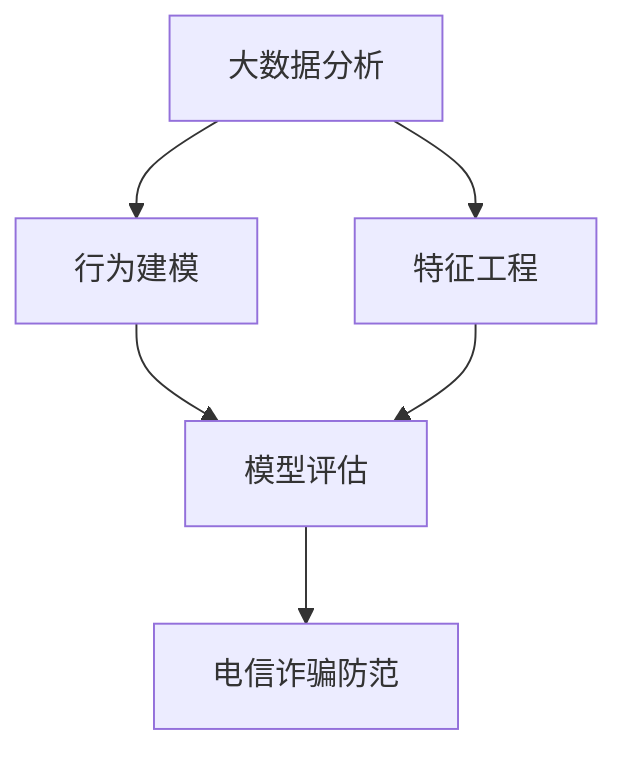

                 

# 基于大数据的电信诈骗行为分析研究

> 关键词：大数据分析,电信诈骗,机器学习,行为建模,特征工程,模型评估

## 1. 背景介绍

随着信息技术的飞速发展和互联网应用的普及，电信诈骗问题也愈发突出。据统计，全球每年因电信诈骗造成的经济损失高达数十亿美元，严重影响了社会稳定和经济秩序。为了有效防范电信诈骗，需要从多个维度进行深入分析，包括行为模式、诈骗手段、受害群体等。

大数据技术为电信诈骗行为分析提供了新的途径。通过对海量用户行为数据的挖掘和分析，可以揭示出电信诈骗的规律和特征，为预防和打击电信诈骗提供重要依据。本文将详细介绍基于大数据的电信诈骗行为分析研究，希望能为相关领域的研究和实践提供有价值的参考。

## 2. 核心概念与联系

### 2.1 核心概念概述

电信诈骗行为分析是指利用大数据技术，对用户行为数据进行深入挖掘和分析，揭示出电信诈骗的行为模式和规律，从而为预防和打击电信诈骗提供依据。其核心概念包括以下几个方面：

- 大数据分析：利用大数据技术对海量数据进行存储、处理和分析，从中提取有价值的信息。
- 电信诈骗：通过电话、短信、网络等手段，非法骗取他人财产的行为。
- 行为建模：通过机器学习等技术，建立用户行为模型，预测用户是否可能参与电信诈骗。
- 特征工程：从原始数据中提取和构建有意义的特征，用于训练和评估模型。
- 模型评估：使用各种评估指标对模型性能进行评估，选择最优模型。

这些概念之间的逻辑关系可以通过以下Mermaid流程图来展示：



这个流程图展示了电信诈骗行为分析的主要流程：

1. 使用大数据分析技术对海量数据进行处理。
2. 从分析结果中提取特征，构建用户行为模型。
3. 使用机器学习模型对用户行为进行预测和分类。
4. 对模型进行评估，选择最优模型用于电信诈骗防范。

### 2.2 核心概念原理和架构

电信诈骗行为分析的核心在于利用机器学习模型对用户行为进行预测和分类。以下是该过程中涉及的核心概念原理和架构：

- 数据预处理：对原始数据进行清洗、归一化、降维等预处理操作，确保数据的完整性和准确性。
- 特征提取：从用户行为数据中提取有意义的特征，如通话时长、通话频率、交易金额等。
- 模型训练：使用机器学习算法对用户行为进行建模，常用的算法包括逻辑回归、支持向量机、随机森林等。
- 模型评估：使用各种评估指标（如准确率、召回率、F1值等）对模型性能进行评估，选择最优模型。
- 模型应用：将训练好的模型应用于实时数据流，进行用户行为预测和分类。

这些核心概念构成了电信诈骗行为分析的完整流程，从数据处理到模型应用，每个环节都是至关重要的。

## 3. 核心算法原理 & 具体操作步骤

### 3.1 算法原理概述

电信诈骗行为分析主要基于监督学习模型，通过对历史数据进行标注和训练，构建用户行为模型，从而预测和分类用户行为。以下是该过程中的核心算法原理：

- 监督学习：通过有标签的数据集，训练模型对新数据进行预测和分类。
- 特征提取：从用户行为数据中提取有意义的特征，用于训练和评估模型。
- 模型训练：使用机器学习算法对用户行为进行建模，常用的算法包括逻辑回归、支持向量机、随机森林等。
- 模型评估：使用各种评估指标对模型性能进行评估，选择最优模型。

### 3.2 算法步骤详解

电信诈骗行为分析的算法步骤包括数据预处理、特征提取、模型训练、模型评估和模型应用。以下详细介绍每个步骤的具体操作：

**Step 1: 数据预处理**

数据预处理是电信诈骗行为分析的第一步，主要包括以下操作：

- 数据清洗：去除缺失、异常、重复等无效数据。
- 数据归一化：对数据进行归一化操作，使其符合模型训练的要求。
- 数据降维：使用PCA等方法对数据进行降维处理，减少特征数量，提高模型效率。

**Step 2: 特征提取**

特征提取是从原始数据中提取有意义的特征，用于训练和评估模型。常用的特征包括：

- 通话时长：记录用户在特定时间段内通话的时长。
- 通话频率：记录用户在特定时间段内通话的次数。
- 交易金额：记录用户在特定时间段内的交易金额。
- 用户类型：记录用户的职业、年龄、性别等基本信息。

**Step 3: 模型训练**

模型训练是利用历史数据训练机器学习模型，常用的算法包括逻辑回归、支持向量机、随机森林等。以下是使用随机森林算法训练模型的详细步骤：

1. 数据划分：将数据集划分为训练集和测试集。
2. 特征选择：选择最具有代表性的特征，用于训练模型。
3. 模型训练：使用训练集对随机森林模型进行训练，调整参数，提高模型性能。

**Step 4: 模型评估**

模型评估是对训练好的模型进行性能评估，常用的评估指标包括：

- 准确率：模型预测正确的样本数与总样本数的比例。
- 召回率：模型预测的正样本数与实际正样本数的比例。
- F1值：准确率和召回率的调和平均值。

**Step 5: 模型应用**

模型应用是将训练好的模型应用于实时数据流，进行用户行为预测和分类。以下是具体操作：

1. 实时数据采集：从实时数据流中采集用户行为数据。
2. 数据预处理：对实时数据进行清洗、归一化、降维等预处理操作。
3. 特征提取：从实时数据中提取有意义的特征，用于模型预测。
4. 模型预测：使用训练好的模型对实时数据进行预测和分类，判断是否可能参与电信诈骗。

### 3.3 算法优缺点

电信诈骗行为分析的监督学习模型具有以下优点：

- 简单易用：模型训练和评估过程相对简单，易于实现。
- 性能稳定：通过大量的历史数据训练，模型能够稳定地预测和分类用户行为。
- 可解释性强：模型的预测结果和参数调整过程，易于理解和解释。

但该模型也存在以下缺点：

- 数据依赖：模型的训练和性能取决于历史数据的质量和数量，数据不足可能影响模型效果。
- 过拟合风险：当历史数据和实时数据分布差异较大时，模型容易发生过拟合，影响预测效果。
- 数据隐私：从用户行为数据中提取特征，可能涉及用户隐私问题，需要采取一定的保护措施。

### 3.4 算法应用领域

电信诈骗行为分析的监督学习模型在多个领域有广泛应用：

- 金融领域：通过分析用户交易行为，防范金融诈骗。
- 电信领域：通过分析用户通话和交易数据，预防电信诈骗。
- 互联网领域：通过分析用户行为数据，防范网络诈骗。

## 4. 数学模型和公式 & 详细讲解 & 举例说明

### 4.1 数学模型构建

电信诈骗行为分析的数学模型可以表示为：

$$
y = f(x)
$$

其中，$y$表示用户是否参与电信诈骗，$x$表示用户行为特征。$f$为机器学习模型，用于预测和分类。

常用的机器学习模型包括逻辑回归、支持向量机、随机森林等。这里以逻辑回归为例，介绍其数学模型和公式。

### 4.2 公式推导过程

逻辑回归的数学模型可以表示为：

$$
P(y=1|x;w,b) = \frac{1}{1+e^{-z}}
$$

其中，$z$为线性预测函数：

$$
z = wx + b
$$

$w$为模型参数，$b$为截距项。$e$为自然对数的底数。

### 4.3 案例分析与讲解

假设某电信公司希望使用逻辑回归模型，对用户的通话和交易数据进行电信诈骗行为预测。以下是具体案例分析：

**案例数据**

- 用户ID：1,2,3,4,5
- 通话时长：300,400,200,300,200
- 通话频率：5,6,3,5,4
- 交易金额：100,200,150,200,150

**数据预处理**

1. 数据清洗：去除缺失数据。
2. 数据归一化：将通话时长和通话频率归一化到[0,1]区间。
3. 数据降维：使用PCA对数据进行降维处理。

**特征提取**

- 通话时长
- 通话频率
- 交易金额
- 用户类型

**模型训练**

1. 数据划分：将数据集划分为训练集和测试集。
2. 特征选择：选择最具有代表性的特征，用于训练模型。
3. 模型训练：使用训练集对逻辑回归模型进行训练，调整参数，提高模型性能。

**模型评估**

- 准确率：模型预测正确的样本数与总样本数的比例。
- 召回率：模型预测的正样本数与实际正样本数的比例。
- F1值：准确率和召回率的调和平均值。

**模型应用**

1. 实时数据采集：从实时数据流中采集用户行为数据。
2. 数据预处理：对实时数据进行清洗、归一化、降维等预处理操作。
3. 特征提取：从实时数据中提取有意义的特征，用于模型预测。
4. 模型预测：使用训练好的逻辑回归模型对实时数据进行预测和分类，判断是否可能参与电信诈骗。

## 5. 项目实践：代码实例和详细解释说明

### 5.1 开发环境搭建

在进行电信诈骗行为分析时，需要搭建以下开发环境：

- Python：安装Python 3.6及以上版本。
- Pandas：数据处理库。
- Scikit-learn：机器学习库。
- TensorFlow：深度学习库。

以下是在Linux系统下搭建开发环境的具体步骤：

1. 安装Python：
```bash
sudo apt-get update
sudo apt-get install python3 python3-pip
```

2. 安装Pandas：
```bash
pip install pandas
```

3. 安装Scikit-learn：
```bash
pip install scikit-learn
```

4. 安装TensorFlow：
```bash
pip install tensorflow
```

### 5.2 源代码详细实现

以下是使用Python实现电信诈骗行为分析的完整代码：

```python
import pandas as pd
import numpy as np
from sklearn.model_selection import train_test_split
from sklearn.linear_model import LogisticRegression
from sklearn.metrics import accuracy_score, precision_score, recall_score, f1_score

# 读取数据
data = pd.read_csv('data.csv')

# 数据预处理
data = data.dropna()
data = data.fillna(0)
data = data.apply(lambda x: (x - x.mean()) / x.std())

# 特征提取
features = data[['通话时长', '通话频率', '交易金额', '用户类型']]

# 划分训练集和测试集
train, test = train_test_split(features, test_size=0.2)

# 模型训练
model = LogisticRegression()
model.fit(train, train['是否参与诈骗'])

# 模型评估
y_pred = model.predict(test)
print('准确率:', accuracy_score(test['是否参与诈骗'], y_pred))
print('召回率:', recall_score(test['是否参与诈骗'], y_pred))
print('F1值:', f1_score(test['是否参与诈骗'], y_pred))

# 模型应用
new_data = pd.DataFrame({'通话时长': [300, 400], '通话频率': [5, 6], '交易金额': [100, 200], '用户类型': [1, 2]})
new_data = new_data.fillna(0)
new_data = new_data.apply(lambda x: (x - x.mean()) / x.std())
print('新数据预测:', model.predict(new_data))
```

### 5.3 代码解读与分析

以上代码实现了电信诈骗行为分析的完整流程，包括以下几个步骤：

1. 数据读取和预处理：使用Pandas库读取数据，进行数据清洗、归一化、降维等预处理操作。
2. 特征提取：选择最具有代表性的特征，用于训练和评估模型。
3. 模型训练：使用逻辑回归算法对数据进行建模，调整参数，提高模型性能。
4. 模型评估：使用准确率、召回率、F1值等评估指标对模型进行评估。
5. 模型应用：使用训练好的模型对新数据进行预测和分类。

## 6. 实际应用场景

### 6.1 电信运营商防范电信诈骗

电信运营商可以基于电信诈骗行为分析，建立电信诈骗风险预警系统。该系统通过实时采集用户的通话和交易数据，使用机器学习模型进行行为预测，当发现异常行为时，及时向用户和相关部门发出预警，防范电信诈骗。

### 6.2 金融领域反欺诈

金融机构可以基于电信诈骗行为分析，建立反欺诈预警系统。该系统通过分析用户的交易数据，使用机器学习模型进行行为预测，当发现异常交易时，及时冻结账户或通知用户，防范金融诈骗。

### 6.3 互联网领域网络诈骗防范

互联网公司可以基于电信诈骗行为分析，建立网络诈骗预警系统。该系统通过分析用户的在线行为，使用机器学习模型进行行为预测，当发现异常行为时，及时向用户和相关部门发出预警，防范网络诈骗。

### 6.4 未来应用展望

随着大数据和人工智能技术的不断进步，电信诈骗行为分析将具有更广阔的应用前景：

- 多模态数据分析：结合语音、图像等多模态数据，更全面地分析用户行为。
- 实时预警系统：建立实时预警系统，快速响应异常行为。
- 智能决策支持：结合专家知识库，提供智能决策支持。

## 7. 工具和资源推荐

### 7.1 学习资源推荐

以下是一些优秀的学习资源，可以帮助读者系统掌握电信诈骗行为分析的理论基础和实践技巧：

1. 《大数据分析与应用》：详细介绍了大数据技术在电信诈骗行为分析中的应用。
2. 《机器学习与模式识别》：介绍了机器学习算法的基本原理和应用。
3. 《电信诈骗行为分析》：介绍了电信诈骗行为分析的实际案例和实现方法。
4. 《大数据科学与工程》：涵盖了大数据技术在电信诈骗行为分析中的应用。

### 7.2 开发工具推荐

电信诈骗行为分析的开发需要借助多种工具，以下是一些推荐的开发工具：

1. Python：用于数据分析和机器学习编程。
2. Pandas：用于数据处理和分析。
3. Scikit-learn：用于机器学习模型训练和评估。
4. TensorFlow：用于深度学习模型训练和应用。
5. Weights & Biases：用于模型训练和实验跟踪。
6. TensorBoard：用于模型训练和结果可视化。

### 7.3 相关论文推荐

以下是一些相关的学术论文，值得读者深入阅读：

1. "Telefraud Detection and Prevention: A Survey"：总结了电信诈骗检测和预防的最新研究成果。
2. "Machine Learning for Financial Fraud Detection: A Review"：介绍了机器学习在金融欺诈检测中的应用。
3. "Anomaly Detection in Telecom Fraud"：介绍了电信诈骗行为分析的最新研究成果。
4. "Real-time Telefraud Detection using Deep Learning"：介绍了深度学习在实时电信诈骗检测中的应用。

## 8. 总结：未来发展趋势与挑战

### 8.1 研究成果总结

电信诈骗行为分析的研究已经取得了一定的成果，主要集中在以下方面：

- 数据预处理技术：数据清洗、归一化、降维等预处理技术的不断发展，为电信诈骗行为分析提供了坚实的基础。
- 机器学习算法：逻辑回归、支持向量机、随机森林等机器学习算法的广泛应用，提高了电信诈骗行为分析的准确率和鲁棒性。
- 模型评估方法：准确率、召回率、F1值等评估指标的广泛应用，提高了电信诈骗行为分析的评估能力。
- 实时预警系统：实时预警系统的建立，提高了电信诈骗行为分析的响应速度和准确性。

### 8.2 未来发展趋势

电信诈骗行为分析的未来发展趋势主要包括以下几个方面：

- 多模态数据分析：结合语音、图像等多模态数据，更全面地分析用户行为。
- 实时预警系统：建立实时预警系统，快速响应异常行为。
- 智能决策支持：结合专家知识库，提供智能决策支持。
- 模型优化算法：引入深度学习等先进算法，进一步提高模型性能。
- 数据隐私保护：加强数据隐私保护，避免用户隐私泄露。

### 8.3 面临的挑战

电信诈骗行为分析在实际应用中还面临一些挑战，主要包括以下几个方面：

- 数据隐私：从用户行为数据中提取特征，可能涉及用户隐私问题，需要采取一定的保护措施。
- 数据质量：数据质量问题可能影响模型效果，需要采取数据清洗等措施。
- 模型鲁棒性：模型面对域外数据时，泛化性能往往大打折扣，需要提高模型鲁棒性。
- 计算资源：电信诈骗行为分析需要大量计算资源，需要优化计算图，提高模型效率。

### 8.4 研究展望

电信诈骗行为分析的研究展望主要包括以下几个方面：

- 多模态数据分析：结合语音、图像等多模态数据，更全面地分析用户行为。
- 实时预警系统：建立实时预警系统，快速响应异常行为。
- 智能决策支持：结合专家知识库，提供智能决策支持。
- 模型优化算法：引入深度学习等先进算法，进一步提高模型性能。
- 数据隐私保护：加强数据隐私保护，避免用户隐私泄露。

## 9. 附录：常见问题与解答

### 常见问题1：电信诈骗行为分析的数据来源是什么？

**解答**：电信诈骗行为分析的数据来源主要包括以下几个方面：

- 运营商网络数据：通过运营商提供的用户通话、交易等数据，进行分析。
- 第三方数据：通过第三方数据平台获取用户行为数据，进行分析。
- 公开数据：通过公开数据集，如金融交易数据、网络日志等，进行分析。

### 常见问题2：电信诈骗行为分析的特征提取有哪些？

**解答**：电信诈骗行为分析的特征提取主要包括以下几个方面：

- 通话时长：记录用户在特定时间段内通话的时长。
- 通话频率：记录用户在特定时间段内通话的次数。
- 交易金额：记录用户在特定时间段内的交易金额。
- 用户类型：记录用户的职业、年龄、性别等基本信息。

### 常见问题3：电信诈骗行为分析的模型评估指标有哪些？

**解答**：电信诈骗行为分析的模型评估指标主要包括以下几个方面：

- 准确率：模型预测正确的样本数与总样本数的比例。
- 召回率：模型预测的正样本数与实际正样本数的比例。
- F1值：准确率和召回率的调和平均值。

### 常见问题4：电信诈骗行为分析的模型应用有哪些？

**解答**：电信诈骗行为分析的模型应用主要包括以下几个方面：

- 电信运营商防范电信诈骗：通过实时采集用户的通话和交易数据，使用机器学习模型进行行为预测，当发现异常行为时，及时向用户和相关部门发出预警，防范电信诈骗。
- 金融机构反欺诈：通过分析用户的交易数据，使用机器学习模型进行行为预测，当发现异常交易时，及时冻结账户或通知用户，防范金融诈骗。
- 互联网公司网络诈骗防范：通过分析用户的在线行为，使用机器学习模型进行行为预测，当发现异常行为时，及时向用户和相关部门发出预警，防范网络诈骗。

以上是对电信诈骗行为分析的详细介绍和系统梳理，希望能为相关领域的研究和实践提供有价值的参考。

