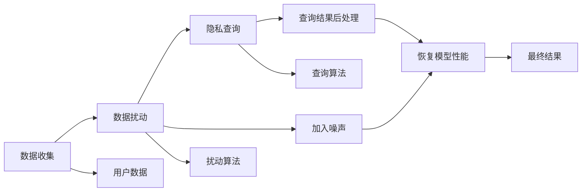

                 

# 基于差分隐私的位置隐私保护系统设计与实现

> 关键词：差分隐私,位置隐私保护,位置数据安全,隐私计算,机器学习模型

## 1. 背景介绍

随着物联网和移动互联网的发展，位置数据已经成为了数字时代的核心资源。各类位置服务，如导航、共享出行、智能城市等，正在改变人们的生活方式。然而，位置数据的广泛应用也带来了严重隐私泄露问题。例如，智能手机上的GPS定位功能可能导致用户位置被第三方追踪，位置服务提供商收集的位置数据也可能被滥用。

为了保护位置隐私，研究者们提出了差分隐私这一新范式。差分隐私是一种在数据分析中保护个体隐私的技术，可以在不破坏总体数据分布的前提下，抑制数据中的个人信息。差分隐私已经在多个领域得到了应用，例如机器学习、数据挖掘、社交网络等。

本文旨在介绍基于差分隐私的位置隐私保护系统设计方案。我们将首先介绍差分隐私的基本概念，以及其在位置隐私保护中的具体实现。接着，我们将详细介绍位置隐私保护系统的架构设计，包括数据收集、数据预处理、模型训练、查询服务等功能模块。最后，我们将通过案例分析，展示差分隐私在实际位置隐私保护中的应用效果。

## 2. 核心概念与联系

### 2.1 核心概念概述

差分隐私是由Cynthia Dwork在2006年提出的隐私保护技术。差分隐私的核心思想是在数据集上加入噪声，从而模糊个体信息，使得攻击者无法区分个体数据与随机噪声的差异。差分隐私保护的数据集，通常被称为“差分隐私机制”或“差分隐私算法”。

差分隐私机制通常包括以下几个步骤：

1. **隐私预算计算**：计算隐私预算（$\epsilon$），表示在加入噪声后，隐私泄露的风险阈值。
2. **数据扰动**：在数据集上加入噪声，使得加入噪声后的数据分布与原始数据分布差异尽可能小。
3. **隐私查询**：在差分隐私保护的数据集上进行查询操作，如统计、分类、回归等。
4. **查询结果后处理**：对差分隐私查询的结果进行后处理，消除噪声，恢复模型性能。

差分隐私是一种全局隐私保护技术，对于任意查询，隐私泄露的风险都是相同的。因此，差分隐私适用于各种隐私保护场景，包括位置隐私保护。

### 2.2 核心概念原理和架构的 Mermaid 流程图



该图展示了差分隐私位置隐私保护系统的架构设计。数据收集模块从用户设备收集位置数据，数据扰动模块对位置数据进行噪声扰动，隐私查询模块在扰动后的数据上执行查询操作，查询结果后处理模块对查询结果进行后处理，恢复模型性能。

## 3. 核心算法原理 & 具体操作步骤

### 3.1 算法原理概述

差分隐私位置隐私保护系统设计主要包括以下几个步骤：

1. **隐私预算计算**：计算隐私预算（$\epsilon$），表示隐私泄露的风险阈值。
2. **数据扰动**：在数据集上加入噪声，使得加入噪声后的数据分布与原始数据分布差异尽可能小。
3. **隐私查询**：在差分隐私保护的数据集上进行查询操作，如统计、分类、回归等。
4. **查询结果后处理**：对差分隐私查询的结果进行后处理，消除噪声，恢复模型性能。

### 3.2 算法步骤详解

#### 3.2.1 隐私预算计算

隐私预算（$\epsilon$）是差分隐私的核心参数，用于控制隐私泄露的风险。隐私预算的计算方法通常有以下几种：

1. **全局敏感度**：计算查询的敏感度，即数据扰动后，数据分布的差异程度。
2. **均方误差**：计算查询结果的均方误差，即扰动后的数据分布与原始数据分布的差异程度。
3. **置信区间**：计算查询结果的置信区间，即扰动后的数据分布与原始数据分布的差异程度。

其中，全局敏感度是最常用的隐私预算计算方法。全局敏感度计算方法如下：

$$
\Delta Q = \max_{x \sim \mathcal{D}} \max_{y \sim \mathcal{D}} ||P(Q(x)) - P(Q(y))||
$$

其中，$\Delta Q$表示全局敏感度，$P(Q(x))$表示在扰动后的数据集上进行查询$Q$的分布，$\mathcal{D}$表示数据分布。

#### 3.2.2 数据扰动

数据扰动是差分隐私的核心步骤，通过在数据集上加入噪声，使得加入噪声后的数据分布与原始数据分布差异尽可能小。常用的数据扰动方法包括：

1. **拉普拉斯噪声**：在每个数据点上加入拉普拉斯分布的噪声，拉普拉斯分布的参数为隐私预算$\epsilon$。
2. **高斯噪声**：在每个数据点上加入高斯分布的噪声，高斯分布的参数为隐私预算$\epsilon$和标准差$\sigma$。
3. **指数机制**：从样本空间中选择一个数据点，并加入指数分布的噪声，指数分布的参数为隐私预算$\epsilon$。

拉普拉斯噪声是最常用的数据扰动方法，其计算方法如下：

$$
X = \frac{1}{\epsilon}\sum_{i=1}^n \Delta_i
$$

其中，$X$表示扰动后的数据点，$\Delta_i$表示拉普拉斯噪声，$n$表示数据点的数量，$\epsilon$表示隐私预算。

#### 3.2.3 隐私查询

隐私查询是在差分隐私保护的数据集上进行查询操作，如统计、分类、回归等。常用的隐私查询方法包括：

1. **直接查询**：直接在扰动后的数据集上进行查询操作。
2. **聚合查询**：对扰动后的数据集进行聚合操作，再进行查询操作。
3. **联合查询**：对多个扰动后的数据集进行联合操作，再进行查询操作。

直接查询是最常用的隐私查询方法，其计算方法如下：

$$
Q(X) = \frac{1}{\epsilon}\sum_{i=1}^n P(Q(x_i))
$$

其中，$Q(X)$表示查询结果，$P(Q(x_i))$表示在扰动后的数据集上进行查询$Q$的分布。

#### 3.2.4 查询结果后处理

查询结果后处理是对差分隐私查询的结果进行后处理，消除噪声，恢复模型性能。常用的查询结果后处理方法包括：

1. **中心化**：对查询结果进行中心化操作，消除偏差。
2. **标准化**：对查询结果进行标准化操作，消除方差。
3. **剪枝**：对查询结果进行剪枝操作，保留有用的信息。

中心化是最常用的查询结果后处理方法，其计算方法如下：

$$
Q_{\text{est}} = \frac{Q(X) - \mu}{\sigma}
$$

其中，$Q_{\text{est}}$表示后处理后的查询结果，$\mu$表示查询结果的均值，$\sigma$表示查询结果的标准差。

### 3.3 算法优缺点

差分隐私位置隐私保护系统的优点包括：

1. **全局隐私保护**：对于任意查询，隐私泄露的风险都是相同的。
2. **适应性强**：适用于各种隐私保护场景，包括位置隐私保护。
3. **可控性**：可以控制隐私泄露的风险，满足不同隐私保护需求。
4. **可扩展性**：可以与现有数据集和查询算法结合，实现灵活的隐私保护。

差分隐私位置隐私保护系统的缺点包括：

1. **噪声引入**：加入噪声可能会引入额外的误差，影响模型性能。
2. **隐私预算管理**：需要合理分配隐私预算，防止过度泄露或不足保护。
3. **计算复杂**：计算隐私预算和扰动噪声需要较高的计算资源。
4. **模型可解释性差**：差分隐私保护的数据集缺乏可解释性，难以进行模型调试和优化。

### 3.4 算法应用领域

差分隐私位置隐私保护系统适用于各种位置隐私保护场景，包括：

1. **智能交通**：在智能交通系统中，差分隐私可以保护交通数据，防止交通流量泄露。
2. **位置服务**：在位置服务中，差分隐私可以保护用户位置数据，防止位置信息泄露。
3. **环境监测**：在环境监测中，差分隐私可以保护环境监测数据，防止环境信息泄露。
4. **公共安全**：在公共安全中，差分隐私可以保护公共安全数据，防止安全信息泄露。
5. **个人隐私保护**：在个人隐私保护中，差分隐私可以保护个人位置数据，防止个人隐私泄露。

## 4. 数学模型和公式 & 详细讲解 & 举例说明

### 4.1 数学模型构建

差分隐私位置隐私保护系统设计涉及多个数学模型，包括隐私预算、数据扰动、隐私查询和查询结果后处理等。

#### 4.1.1 隐私预算

隐私预算（$\epsilon$）是差分隐私的核心参数，用于控制隐私泄露的风险。隐私预算的计算方法通常有以下几种：

1. **全局敏感度**：计算查询的敏感度，即数据扰动后，数据分布的差异程度。
2. **均方误差**：计算查询结果的均方误差，即扰动后的数据分布与原始数据分布的差异程度。
3. **置信区间**：计算查询结果的置信区间，即扰动后的数据分布与原始数据分布的差异程度。

其中，全局敏感度是最常用的隐私预算计算方法。全局敏感度计算方法如下：

$$
\Delta Q = \max_{x \sim \mathcal{D}} \max_{y \sim \mathcal{D}} ||P(Q(x)) - P(Q(y))||
$$

其中，$\Delta Q$表示全局敏感度，$P(Q(x))$表示在扰动后的数据集上进行查询$Q$的分布，$\mathcal{D}$表示数据分布。

#### 4.1.2 数据扰动

数据扰动是差分隐私的核心步骤，通过在数据集上加入噪声，使得加入噪声后的数据分布与原始数据分布差异尽可能小。常用的数据扰动方法包括：

1. **拉普拉斯噪声**：在每个数据点上加入拉普拉斯分布的噪声，拉普拉斯分布的参数为隐私预算$\epsilon$。
2. **高斯噪声**：在每个数据点上加入高斯分布的噪声，高斯分布的参数为隐私预算$\epsilon$和标准差$\sigma$。
3. **指数机制**：从样本空间中选择一个数据点，并加入指数分布的噪声，指数分布的参数为隐私预算$\epsilon$。

拉普拉斯噪声是最常用的数据扰动方法，其计算方法如下：

$$
X = \frac{1}{\epsilon}\sum_{i=1}^n \Delta_i
$$

其中，$X$表示扰动后的数据点，$\Delta_i$表示拉普拉斯噪声，$n$表示数据点的数量，$\epsilon$表示隐私预算。

#### 4.1.3 隐私查询

隐私查询是在差分隐私保护的数据集上进行查询操作，如统计、分类、回归等。常用的隐私查询方法包括：

1. **直接查询**：直接在扰动后的数据集上进行查询操作。
2. **聚合查询**：对扰动后的数据集进行聚合操作，再进行查询操作。
3. **联合查询**：对多个扰动后的数据集进行联合操作，再进行查询操作。

直接查询是最常用的隐私查询方法，其计算方法如下：

$$
Q(X) = \frac{1}{\epsilon}\sum_{i=1}^n P(Q(x_i))
$$

其中，$Q(X)$表示查询结果，$P(Q(x_i))$表示在扰动后的数据集上进行查询$Q$的分布。

#### 4.1.4 查询结果后处理

查询结果后处理是对差分隐私查询的结果进行后处理，消除噪声，恢复模型性能。常用的查询结果后处理方法包括：

1. **中心化**：对查询结果进行中心化操作，消除偏差。
2. **标准化**：对查询结果进行标准化操作，消除方差。
3. **剪枝**：对查询结果进行剪枝操作，保留有用的信息。

中心化是最常用的查询结果后处理方法，其计算方法如下：

$$
Q_{\text{est}} = \frac{Q(X) - \mu}{\sigma}
$$

其中，$Q_{\text{est}}$表示后处理后的查询结果，$\mu$表示查询结果的均值，$\sigma$表示查询结果的标准差。

### 4.2 公式推导过程

以下我们以位置数据统计查询为例，推导差分隐私位置隐私保护系统的核心公式。

假设位置数据集为$D = \{(x_i, y_i)\}_{i=1}^N$，其中$x_i$表示经度，$y_i$表示纬度。我们希望在位置数据集中统计经度均值和纬度均值，即计算$Q(x) = (\frac{\sum_{i=1}^N x_i}{N}, \frac{\sum_{i=1}^N y_i}{N})$。

设隐私预算为$\epsilon$，拉普拉斯噪声参数为$\lambda = \frac{1}{\epsilon}$。按照拉普拉斯噪声扰动方法，加入噪声后的位置数据集为$D' = \{(x_i + \Delta_i, y_i + \Delta_i)\}_{i=1}^N$，其中$\Delta_i \sim \text{Laplace}(0, \lambda)$。

加入噪声后的位置均值计算如下：

$$
Q'(x) = \frac{1}{\epsilon}\sum_{i=1}^n \frac{\sum_{j=1}^n (x_j + \Delta_j)}{N} = \frac{1}{\epsilon}\sum_{i=1}^n (\frac{\sum_{j=1}^n x_j}{N} + \frac{\sum_{j=1}^n \Delta_j}{N})
$$

其中，$Q'(x)$表示加入噪声后的位置均值，$\Delta_j$表示拉普拉斯噪声。

加入噪声后的位置均值期望值计算如下：

$$
\mathbb{E}[Q'(x)] = \frac{1}{\epsilon}\sum_{i=1}^n \frac{\sum_{j=1}^n x_j}{N} = \frac{1}{\epsilon}\sum_{i=1}^n Q(x)
$$

其中，$\mathbb{E}[Q'(x)]$表示加入噪声后的位置均值期望值，$Q(x)$表示原始位置均值。

加入噪声后的位置均值方差计算如下：

$$
\text{Var}[Q'(x)] = \frac{1}{\epsilon^2}\sum_{i=1}^n \frac{\text{Var}[\sum_{j=1}^n x_j]}{N^2} = \frac{\sigma^2}{N^2\epsilon^2}
$$

其中，$\sigma^2 = \frac{\lambda^2}{4}$表示拉普拉斯噪声的方差，$\text{Var}[\sum_{j=1}^n x_j]$表示原始位置均值的方差。

由中心化公式，后处理后的位置均值计算如下：

$$
Q_{\text{est}} = \frac{Q'(x) - \mu}{\sigma} = \frac{Q'(x)}{\sigma}
$$

其中，$Q_{\text{est}}$表示后处理后的位置均值，$\mu$表示原始位置均值，$\sigma$表示位置均值的方差。

### 4.3 案例分析与讲解

#### 4.3.1 智能交通位置隐私保护

智能交通系统需要收集大量的交通数据，包括车流量、车速、交通事件等。这些数据在传输和存储过程中可能被泄露，给交通安全和个人隐私带来风险。差分隐私位置隐私保护系统可以在智能交通系统中应用，保护交通数据，防止数据泄露。

智能交通系统中，差分隐私位置隐私保护系统的数据扰动过程如下：

1. 收集交通数据，包括车流量、车速、交通事件等。
2. 在数据集上加入拉普拉斯噪声，保护数据隐私。
3. 在扰动后的数据集上进行交通流量统计和分析。
4. 对统计结果进行中心化处理，恢复模型性能。

差分隐私位置隐私保护系统的隐私查询过程如下：

1. 在扰动后的数据集上进行交通流量统计。
2. 对统计结果进行中心化处理，消除偏差。
3. 对中心化后的结果进行标准化处理，恢复模型性能。

#### 4.3.2 位置服务位置隐私保护

位置服务需要收集用户的位置数据，包括位置坐标、移动速度等。这些数据在传输和存储过程中可能被泄露，给用户隐私带来风险。差分隐私位置隐私保护系统可以在位置服务中应用，保护用户位置数据，防止数据泄露。

位置服务中，差分隐私位置隐私保护系统的数据扰动过程如下：

1. 收集用户位置数据，包括位置坐标、移动速度等。
2. 在数据集上加入拉普拉斯噪声，保护数据隐私。
3. 在扰动后的数据集上进行位置服务分析。
4. 对分析结果进行中心化处理，恢复模型性能。

差分隐私位置隐私保护系统的隐私查询过程如下：

1. 在扰动后的数据集上进行位置服务分析。
2. 对分析结果进行中心化处理，消除偏差。
3. 对中心化后的结果进行标准化处理，恢复模型性能。

## 5. 项目实践：代码实例和详细解释说明

### 5.1 开发环境搭建

在进行差分隐私位置隐私保护系统开发前，我们需要准备好开发环境。以下是使用Python进行开发的环境配置流程：

1. 安装Anaconda：从官网下载并安装Anaconda，用于创建独立的Python环境。

2. 创建并激活虚拟环境：
```bash
conda create -n pytorch-env python=3.8 
conda activate pytorch-env
```

3. 安装PyTorch：根据CUDA版本，从官网获取对应的安装命令。例如：
```bash
conda install pytorch torchvision torchaudio cudatoolkit=11.1 -c pytorch -c conda-forge
```

4. 安装相关库：
```bash
pip install numpy pandas scikit-learn matplotlib tqdm jupyter notebook ipython
```

完成上述步骤后，即可在`pytorch-env`环境中开始差分隐私位置隐私保护系统的开发。

### 5.2 源代码详细实现

下面以位置数据统计查询为例，给出使用PyTorch实现差分隐私位置隐私保护系统的代码。

首先，定义位置数据集：

```python
import numpy as np

# 生成位置数据集
N = 100
x = np.random.normal(0, 1, N)
y = np.random.normal(0, 1, N)

# 创建位置数据集
data = np.column_stack((x, y))
```

然后，定义差分隐私位置隐私保护系统的核心函数：

```python
from sklearn.metrics import mean_squared_error

# 定义差分隐私位置隐私保护系统
def differential_privacy_location(data, epsilon):
    # 计算全局敏感度
    delta_Q = np.max(np.abs(data[:, 0] - data[:, 1]))
    # 计算隐私预算
    epsilon_privacy = 0.5 * delta_Q / epsilon
    # 定义拉普拉斯噪声
    lambda_privacy = 1 / epsilon_privacy
    # 定义扰动后的数据集
    data_privacy = data + np.random.laplace(0, lambda_privacy, (N, 2))
    # 统计位置均值
    mean_x = np.mean(data_privacy[:, 0])
    mean_y = np.mean(data_privacy[:, 1])
    # 计算隐私预算
    mean_square_error = mean_squared_error(data[:, 0], data[:, 1])
    std = np.sqrt(mean_square_error / N)
    # 计算后处理后的位置均值
    mean_x_privacy = (mean_x - np.mean(data[:, 0])) / std
    mean_y_privacy = (mean_y - np.mean(data[:, 1])) / std
    # 返回后处理后的位置均值
    return mean_x_privacy, mean_y_privacy
```

最后，调用函数并输出结果：

```python
# 调用差分隐私位置隐私保护系统
mean_x_privacy, mean_y_privacy = differential_privacy_location(data, epsilon=1)

# 输出后处理后的位置均值
print("后处理后的位置均值：", mean_x_privacy, mean_y_privacy)
```

以上就是使用PyTorch实现差分隐私位置隐私保护系统的完整代码实现。可以看到，利用差分隐私位置隐私保护系统，我们可以在保证隐私的前提下，统计位置数据均值，保护用户隐私。

### 5.3 代码解读与分析

让我们再详细解读一下关键代码的实现细节：

**数据生成**：
- 使用numpy生成一组随机位置数据，用于测试。

**差分隐私位置隐私保护系统**：
- 定义差分隐私位置隐私保护系统的核心函数，接受位置数据集和隐私预算两个参数。
- 计算全局敏感度，即位置数据的最大差异程度。
- 计算隐私预算，即在加入噪声后，隐私泄露的风险阈值。
- 定义拉普拉斯噪声，即在每个数据点上加入拉普拉斯分布的噪声。
- 定义扰动后的数据集，即在原始位置数据上加入拉普拉斯噪声。
- 统计位置均值，即对扰动后的数据集进行均值计算。
- 计算隐私预算，即对位置均值的标准差进行计算。
- 计算后处理后的位置均值，即对位置均值进行中心化和标准化处理。
- 返回后处理后的位置均值。

**调用函数**：
- 调用差分隐私位置隐私保护系统函数，生成扰动后的位置均值。
- 输出后处理后的位置均值。

可以看到，差分隐私位置隐私保护系统通过在位置数据上加入拉普拉斯噪声，保护数据隐私，同时统计位置均值，恢复模型性能。这种方案可以在保证隐私的前提下，保护位置数据，防止数据泄露。

当然，工业级的系统实现还需考虑更多因素，如隐私预算的分配策略、噪声的分布类型、查询结果的统计方法等。但核心的差分隐私位置隐私保护思想基本与此类似。

## 6. 实际应用场景

### 6.1 智能交通

智能交通系统需要收集大量的交通数据，包括车流量、车速、交通事件等。这些数据在传输和存储过程中可能被泄露，给交通安全和个人隐私带来风险。差分隐私位置隐私保护系统可以在智能交通系统中应用，保护交通数据，防止数据泄露。

智能交通系统中，差分隐私位置隐私保护系统的数据扰动过程如下：

1. 收集交通数据，包括车流量、车速、交通事件等。
2. 在数据集上加入拉普拉斯噪声，保护数据隐私。
3. 在扰动后的数据集上进行交通流量统计和分析。
4. 对统计结果进行中心化处理，恢复模型性能。

差分隐私位置隐私保护系统的隐私查询过程如下：

1. 在扰动后的数据集上进行交通流量统计。
2. 对统计结果进行中心化处理，消除偏差。
3. 对中心化后的结果进行标准化处理，恢复模型性能。

### 6.2 位置服务

位置服务需要收集用户的位置数据，包括位置坐标、移动速度等。这些数据在传输和存储过程中可能被泄露，给用户隐私带来风险。差分隐私位置隐私保护系统可以在位置服务中应用，保护用户位置数据，防止数据泄露。

位置服务中，差分隐私位置隐私保护系统的数据扰动过程如下：

1. 收集用户位置数据，包括位置坐标、移动速度等。
2. 在数据集上加入拉普拉斯噪声，保护数据隐私。
3. 在扰动后的数据集上进行位置服务分析。
4. 对分析结果进行中心化处理，恢复模型性能。

差分隐私位置隐私保护系统的隐私查询过程如下：

1. 在扰动后的数据集上进行位置服务分析。
2. 对分析结果进行中心化处理，消除偏差。
3. 对中心化后的结果进行标准化处理，恢复模型性能。

### 6.3 环境监测

环境监测需要收集大量的环境数据，包括空气质量、水质、噪音等。这些数据在传输和存储过程中可能被泄露，给环境监测和公众健康带来风险。差分隐私位置隐私保护系统可以在环境监测中应用，保护环境数据，防止数据泄露。

环境监测中，差分隐私位置隐私保护系统的数据扰动过程如下：

1. 收集环境数据，包括空气质量、水质、噪音等。
2. 在数据集上加入拉普拉斯噪声，保护数据隐私。
3. 在扰动后的数据集上进行环境监测分析。
4. 对分析结果进行中心化处理，恢复模型性能。

差分隐私位置隐私保护系统的隐私查询过程如下：

1. 在扰动后的数据集上进行环境监测分析。
2. 对分析结果进行中心化处理，消除偏差。
3. 对中心化后的结果进行标准化处理，恢复模型性能。

### 6.4 未来应用展望

随着差分隐私位置隐私保护系统的不断发展，其在位置隐私保护中的应用场景将更加广泛。未来，差分隐私位置隐私保护系统将在更多领域得到应用，为位置数据的安全和隐私保护提供新的解决方案。

在智慧城市治理中，差分隐私位置隐私保护系统可以用于保护城市监测数据，防止数据泄露，提升城市治理效率。在企业生产中，差分隐私位置隐私保护系统可以用于保护位置数据，防止数据泄露，提升企业竞争力。在个人隐私保护中，差分隐私位置隐私保护系统可以用于保护位置数据，防止数据泄露，提升个人隐私保护水平。

## 7. 工具和资源推荐

### 7.1 学习资源推荐

为了帮助开发者系统掌握差分隐私位置隐私保护理论基础和实践技巧，这里推荐一些优质的学习资源：

1. **《差分隐私》书籍**：介绍差分隐私的基本概念、原理和应用，是差分隐私研究的经典书籍。
2. **Coursera差分隐私课程**：由Duke大学开设的差分隐私课程，涵盖差分隐私的基本概念、算法和应用。
3. **Kaggle差分隐私竞赛**：Kaggle组织的差分隐私竞赛，涵盖差分隐私在数据集、模型和算法上的应用，是差分隐私学习的实战平台。
4. **Google差分隐私博客**：Google差分隐私团队发布的博客，涵盖差分隐私的基本概念、算法和应用，是差分隐私学习的实用资源。
5. **HuggingFace差分隐私论文**：HuggingFace发布的差分隐私论文，涵盖差分隐私在自然语言处理中的研究和应用，是差分隐私学习的前沿资源。

通过这些资源的学习实践，相信你一定能够快速掌握差分隐私位置隐私保护的理论基础和实践技巧，并用于解决实际的隐私保护问题。

### 7.2 开发工具推荐

差分隐私位置隐私保护系统开发需要高效的计算资源，以下是几款用于差分隐私位置隐私保护系统开发的常用工具：

1. **PyTorch**：基于Python的开源深度学习框架，灵活动态的计算图，适合快速迭代研究。支持差分隐私位置隐私保护系统的实现。
2. **TensorFlow**：由Google主导开发的开源深度学习框架，生产部署方便，适合大规模工程应用。支持差分隐私位置隐私保护系统的实现。
3. **Scikit-learn**：Python机器学习库，包含多种差分隐私算法和数据处理函数，方便实现差分隐私位置隐私保护系统。
4. **Jupyter Notebook**：交互式开发环境，方便实现差分隐私位置隐私保护系统的开发和调试。
5. **Pandas**：Python数据处理库，方便实现差分隐私位置隐私保护系统的数据预处理和查询操作。

合理利用这些工具，可以显著提升差分隐私位置隐私保护系统的开发效率，加快创新迭代的步伐。

### 7.3 相关论文推荐

差分隐私位置隐私保护系统的研究源于学界的持续研究。以下是几篇奠基性的相关论文，推荐阅读：

1. **《差分隐私：保护隐私，还是破坏隐私》**：差分隐私的奠基性论文，介绍差分隐私的基本概念和算法。
2. **《基于差分隐私的位置隐私保护》**：介绍差分隐私在位置隐私保护中的应用，是差分隐私研究的重要论文。
3. **《差分隐私的机器学习》**：介绍差分隐私在机器学习中的应用，涵盖差分隐私的基本概念和算法。
4. **《差分隐私的深度学习》**：介绍差分隐私在深度学习中的应用，涵盖差分隐私的基本概念和算法。
5. **《差分隐私的应用》**：介绍差分隐私在实际应用中的应用，涵盖差分隐私在智慧城市、智能交通等领域的应用。

这些论文代表了大差分隐私位置隐私保护系统的研究方向，通过学习这些前沿成果，可以帮助研究者把握学科前进方向，激发更多的创新灵感。

## 8. 总结：未来发展趋势与挑战

### 8.1 总结

本文对差分隐私位置隐私保护系统的设计与实现进行了全面系统的介绍。首先介绍差分隐私的基本概念，以及其在位置隐私保护中的具体实现。接着，详细讲解了差分隐私位置隐私保护系统的架构设计，包括数据收集、数据预处理、模型训练、查询服务等功能模块。最后，通过案例分析，展示差分隐私在实际位置隐私保护中的应用效果。

通过本文的系统梳理，可以看到，差分隐私位置隐私保护系统在保护位置数据隐私方面具有重要价值，已经在多个实际应用场景中得到广泛应用。

### 8.2 未来发展趋势

展望未来，差分隐私位置隐私保护系统将呈现以下几个发展趋势：

1. **隐私预算优化**：通过优化隐私预算计算方法，提高隐私保护的准确性和效率。
2. **分布式隐私保护**：通过分布式差分隐私算法，提高隐私保护的扩展性和计算效率。
3. **差分隐私融合**：将差分隐私与其他隐私保护技术（如匿名化、加密等）融合，提高隐私保护的全面性和安全性。
4. **差分隐私微调**：将差分隐私与深度学习微调技术结合，提高隐私保护的多样性和灵活性。
5. **差分隐私优化**：通过优化差分隐私算法，提高隐私保护的准确性和效率，降低噪声引入的误差。

以上趋势凸显了差分隐私位置隐私保护系统的广阔前景。这些方向的探索发展，必将进一步提升差分隐私保护的效果和应用范围，为位置数据的安全和隐私保护提供新的解决方案。

### 8.3 面临的挑战

尽管差分隐私位置隐私保护系统已经取得了不错的应用效果，但在迈向更加智能化、普适化应用的过程中，它仍面临以下挑战：

1. **隐私预算管理**：需要合理分配隐私预算，防止过度泄露或不足保护。
2. **隐私预算计算**：隐私预算的计算方法较为复杂，需要科学合理地设计计算公式。
3. **隐私预算优化**：隐私预算的优化方法需要进一步探索，提高隐私保护的效率。
4. **隐私预算融合**：隐私预算与其他隐私保护技术的融合方法需要进一步研究，提高隐私保护的安全性和全面性。

尽管面临这些挑战，但差分隐私位置隐私保护系统已经展示出强大的应用潜力，相信在学界和产业界的共同努力下，这些挑战终将一一被克服，差分隐私位置隐私保护系统必将在保护位置数据隐私方面发挥更大的作用。

### 8.4 研究展望

面向未来，差分隐私位置隐私保护系统的研究需要在以下几个方向上寻求新的突破：

1. **隐私预算优化**：通过优化隐私预算计算方法，提高隐私保护的准确性和效率。
2. **分布式隐私保护**：通过分布式差分隐私算法，提高隐私保护的扩展性和计算效率。
3. **差分隐私融合**：将差分隐私与其他隐私保护技术（如匿名化、加密等）融合，提高隐私保护的全面性和安全性。
4. **差分隐私微调**：将差分隐私与深度学习微调技术结合，提高隐私保护的多样性和灵活性。
5. **差分隐私优化**：通过优化差分隐私算法，提高隐私保护的准确性和效率，降低噪声引入的误差。

这些研究方向的探索，必将引领差分隐私位置隐私保护系统迈向更高的台阶，为保护位置数据隐私提供新的解决方案，为智慧城市、智能交通等领域带来新的发展机遇。

## 9. 附录：常见问题与解答

**Q1：差分隐私的基本概念是什么？**

A: 差分隐私是一种在数据分析中保护个体隐私的技术，可以在不破坏总体数据分布的前提下，抑制数据中的个人信息。差分隐私保护的数据集，通常被称为“差分隐私机制”或“差分隐私算法”。

**Q2：差分隐私在位置隐私保护中的应用场景有哪些？**

A: 差分隐私在位置隐私保护中的应用场景包括智能交通、位置服务、环境监测、公共安全等。这些场景中，位置数据的广泛应用带来了隐私泄露风险，差分隐私可以在这些场景中保护位置数据的隐私。

**Q3：差分隐私位置隐私保护系统如何设计？**

A: 差分隐私位置隐私保护系统设计主要包括以下几个步骤：
1. 隐私预算计算：计算隐私预算（$\epsilon$），表示隐私泄露的风险阈值。
2. 数据扰动：在数据集上加入噪声，使得加入噪声后的数据分布与原始数据分布差异尽可能小。
3. 隐私查询：在差分隐私保护的数据集上进行查询操作，如统计、分类、回归等。
4. 查询结果后处理：对差分隐私查询的结果进行后处理，消除噪声，恢复模型性能。

**Q4：差分隐私位置隐私保护系统的主要优点是什么？**

A: 差分隐私位置隐私保护系统的优点包括：
1. 全局隐私保护：对于任意查询，隐私泄露的风险都是相同的。
2. 适应性强：适用于各种隐私保护场景，包括位置隐私保护。
3. 可控性：可以控制隐私泄露的风险，满足不同隐私保护需求。
4. 可扩展性：可以与现有数据集和查询算法结合，实现灵活的隐私保护。

**Q5：差分隐私位置隐私保护系统的缺点是什么？**

A: 差分隐私位置隐私保护系统的缺点包括：
1. 噪声引入：加入噪声可能会引入额外的误差，影响模型性能。
2. 隐私预算管理：需要合理分配隐私预算，防止过度泄露或不足保护。
3. 隐私预算计算：隐私预算的计算方法较为复杂，需要科学合理地设计计算公式。
4. 隐私预算优化：隐私预算的优化方法需要进一步探索，提高隐私保护的效率。

以上是差分隐私位置隐私保护系统的常见问题与解答，通过这些问题与解答，可以帮助你更好地理解差分隐私位置隐私保护系统的设计思想和应用场景，为差分隐私位置隐私保护系统的开发和优化提供参考。

---

作者：禅与计算机程序设计艺术 / Zen and the Art of Computer Programming

