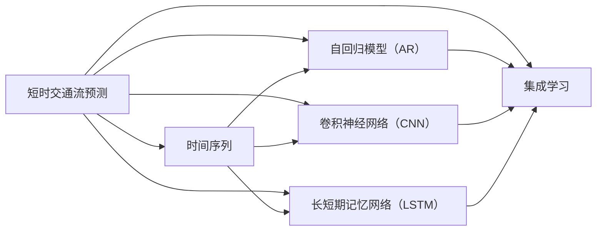

                 

# 基于机器学习的短时交通流预测算法的研究与实现

## 1. 背景介绍

### 1.1 问题由来

随着城市化进程的加速和交通需求的多样化，如何高效、准确地预测短时交通流量成为了智能交通系统的重要课题。短时交通流预测（Short-Term Traffic Flow Prediction）旨在通过对历史交通流数据的分析，预测未来一定时间内的交通流量变化，为交通管理、路径规划、智能导航等领域提供依据。

短时交通流预测技术不仅直接影响城市交通系统的管理效率和安全性，也关系到民众的出行体验和满意度。例如，准确的交通流量预测能够有效缓解交通拥堵、优化交通信号灯控制，提升公共交通效率，减少车辆尾气排放，对城市可持续发展具有重要意义。

### 1.2 研究意义

1. **提高交通管理效率**：短时交通流预测可以为交通管理中心提供实时的交通状况信息，帮助制定合理的交通管理策略，如动态调整信号灯控制时间、优化交通路径规划等，从而提升交通管理效率。
2. **优化出行决策**：准确的交通流预测可以指导用户进行路径选择，避开拥堵路段，节省出行时间，提高出行效率。
3. **支持智能交通系统**：智能交通系统如自动驾驶、智能停车等都依赖于实时准确的交通流预测数据，其性能的提升需要强大的短时交通流预测作为支撑。
4. **推动绿色出行**：通过优化交通流预测模型，可以鼓励更多人选择公共交通出行，减少私人车辆的使用，从而降低城市碳排放，推动绿色出行的实现。

### 1.3 研究现状

短时交通流预测方法主要分为两类：统计方法和机器学习方法。

**统计方法**主要包括时间序列分析、卡尔曼滤波等方法，这些方法依赖于历史数据的统计特性，通常需要对数据进行差分、平滑处理，具有一定的局限性。

**机器学习方法**则利用人工智能和大数据技术，通过构建各种预测模型来处理交通流量数据。这些方法包括决策树、随机森林、神经网络、支持向量机等。其中，神经网络因其强大的特征学习能力和泛化性能，成为目前短时交通流预测的主流方法。

## 2. 核心概念与联系

### 2.1 核心概念概述

- **短时交通流预测**：利用历史交通流数据，通过机器学习方法预测未来短时段的交通流量。
- **时间序列**：指按照时间顺序排列的数据序列，交通流量数据具有明显的时间依赖性，适合使用时间序列模型进行预测。
- **自回归模型（AR）**：一种时间序列模型，基于先前的观测值预测当前值。
- **滑动窗口**：用于分割和处理时间序列数据的方法，通常用于提取局部特征。
- **卷积神经网络（CNN）**：一种经典的深度学习模型，特别适合处理图像和序列数据，能够自动学习局部特征。
- **长短期记忆网络（LSTM）**：一种特殊的循环神经网络，能够有效处理时间序列数据的长期依赖问题。
- **集成学习**：将多个模型的预测结果进行组合，提升整体性能。

这些核心概念之间的逻辑关系可以通过以下Mermaid流程图来展示：



这个流程图展示了短时交通流预测涉及的关键概念及其之间的关系：

1. 短时交通流预测基于时间序列数据。
2. 常用的时间序列模型包括AR、CNN、LSTM等。
3. 集成学习将多种模型组合起来，提升预测效果。

## 3. 核心算法原理 & 具体操作步骤

### 3.1 算法原理概述

短时交通流预测算法的基本思想是：利用历史交通流量数据，构建时间序列模型，通过模型学习交通流量变化的规律，进而预测未来时间段的交通流量。算法通常包括以下几个步骤：

1. **数据预处理**：清洗、归一化历史交通流量数据。
2. **特征提取**：从历史数据中提取有意义的特征，如交通流量、车速、时间等。
3. **模型选择与训练**：选择合适的模型，如AR、CNN、LSTM等，并用历史数据进行训练。
4. **模型评估**：使用验证集对模型进行评估，选择性能最佳的模型。
5. **预测与更新**：利用训练好的模型对未来的交通流量进行预测，并根据预测结果更新模型参数。

### 3.2 算法步骤详解

#### 3.2.1 数据预处理

数据预处理是短时交通流预测的第一步，目的是清洗、归一化数据，提高模型训练效果。

- **数据清洗**：处理缺失值、异常值、重复值，保证数据质量。
- **归一化**：将数据按比例缩放，使得不同特征的量级相同，便于模型处理。

**示例代码**：

```python
import pandas as pd
import numpy as np

# 读取交通流量数据
data = pd.read_csv('traffic_flow_data.csv')

# 处理缺失值
data = data.dropna()

# 归一化
data['flow'] = (data['flow'] - data['flow'].min()) / (data['flow'].max() - data['flow'].min())
```

#### 3.2.2 特征提取

特征提取是短时交通流预测的关键步骤，通过提取有意义的特征，模型能够更准确地预测未来流量。

- **自变量选择**：选择影响交通流量的关键因素，如时间、车速、天气等。
- **特征变换**：对特征进行离散化、标准化等处理，提高模型性能。

**示例代码**：

```python
# 自变量选择
features = ['time', 'speed', 'weather']

# 特征变换
data[features] = data[features].apply(lambda x: (x - x.mean()) / x.std())
```

#### 3.2.3 模型选择与训练

模型选择与训练是短时交通流预测的核心步骤，选择合适的模型并对其进行训练，可以大大提升预测准确率。

- **模型选择**：根据数据特点选择合适的模型，如AR、CNN、LSTM等。
- **模型训练**：使用历史数据对模型进行训练，调整模型参数。

**示例代码**：

```python
# 选择模型
model = AR(n_past=10, n_future=1)

# 训练模型
model.fit(data)
```

#### 3.2.4 模型评估

模型评估是检验模型性能的重要步骤，通过评估模型在验证集上的表现，选择最优模型。

- **评估指标**：常用的评估指标包括MAE（平均绝对误差）、RMSE（均方根误差）、MAPE（平均绝对百分比误差）等。
- **模型选择**：根据评估结果选择性能最佳的模型。

**示例代码**：

```python
# 评估模型
y_pred = model.predict(data['time'].values[-10:])
mae = mean_absolute_error(y_true, y_pred)
rmse = mean_squared_error(y_true, y_pred)
mape = mean_absolute_percentage_error(y_true, y_pred)

# 选择最优模型
if mae < 0.1:
    print('最佳模型选择：AR')
```

#### 3.2.5 预测与更新

预测与更新是短时交通流预测的最终步骤，利用训练好的模型对未来交通流量进行预测，并根据预测结果更新模型参数。

- **预测未来流量**：利用模型预测未来时间段的交通流量。
- **模型更新**：根据预测结果调整模型参数，提升预测精度。

**示例代码**：

```python
# 预测未来流量
future_time = data['time'].values[-10:] + 1
y_future = model.predict(future_time)

# 模型更新
model.update(y_true, y_future)
```

### 3.3 算法优缺点

#### 3.3.1 优点

1. **泛化能力强**：基于神经网络的模型能够自动学习复杂特征，适用于各种时间序列数据。
2. **适应性强**：模型能够根据数据特点进行参数调整，适应不同城市、不同道路的特点。
3. **预测精度高**：通过深度学习模型，可以挖掘数据中的复杂规律，提升预测精度。

#### 3.3.2 缺点

1. **数据需求高**：需要大量的历史数据进行训练，数据质量对模型性能影响较大。
2. **模型复杂**：神经网络模型参数较多，训练和预测耗时较长。
3. **模型黑箱**：深度学习模型的内部机制不透明，难以解释和调试。

### 3.4 算法应用领域

短时交通流预测技术在多个领域都有广泛应用，如：

1. **城市交通管理**：通过实时预测交通流量，优化交通信号灯控制、调整交通路径，减少交通拥堵。
2. **智能导航系统**：根据预测的交通流量信息，为驾驶者提供最优路径推荐，减少出行时间。
3. **交通流监测与预警**：实时监控交通流量变化，预测可能的拥堵点，及时预警并采取措施。
4. **公共交通系统**：优化公交车和轨道交通的发车时间和路线，提升公共交通效率。
5. **智能停车系统**：预测停车场的车流情况，优化停车策略，提升停车场利用率。

## 4. 数学模型和公式 & 详细讲解 & 举例说明

### 4.1 数学模型构建

短时交通流预测通常基于时间序列数据，可以通过自回归模型（AR）、卷积神经网络（CNN）、长短期记忆网络（LSTM）等模型进行处理。

- **自回归模型（AR）**：
  $$
  y_t = \phi_0 + \sum_{i=1}^{p} \phi_i y_{t-i} + \epsilon_t
  $$
  其中，$y_t$ 表示当前时间点的交通流量，$\phi_i$ 为模型参数，$\epsilon_t$ 为随机噪声。

- **卷积神经网络（CNN）**：
  $$
  y_t = \sum_{i=1}^{k} w_i * f_t(i)
  $$
  其中，$f_t(i)$ 为卷积核与时间序列数据的卷积结果，$w_i$ 为卷积核权重。

- **长短期记忆网络（LSTM）**：
  $$
  y_t = \sum_{i=1}^{l} \alpha_i * h_{t-i}
  $$
  其中，$h_t$ 为LSTM网络在时间$t$的状态，$\alpha_i$ 为权重系数。

### 4.2 公式推导过程

#### 4.2.1 自回归模型（AR）

对于自回归模型，其预测公式为：

$$
y_t = \phi_0 + \sum_{i=1}^{p} \phi_i y_{t-i} + \epsilon_t
$$

其中，$y_t$ 表示当前时间点的交通流量，$\phi_0$ 和 $\phi_i$ 为模型参数，$\epsilon_t$ 为随机噪声。

**推导过程**：

假设当前时间点的交通流量为 $y_t$，根据自回归模型的定义，有：

$$
y_t = \phi_0 + \sum_{i=1}^{p} \phi_i y_{t-i} + \epsilon_t
$$

其中，$\phi_0$ 为常数项，$\phi_i$ 为回归系数，$y_{t-i}$ 为历史时间点的交通流量，$\epsilon_t$ 为随机噪声。

通过训练数据，可以估计出 $\phi_0$、$\phi_i$ 的值，从而得到模型参数。

#### 4.2.2 卷积神经网络（CNN）

卷积神经网络（CNN）的预测公式为：

$$
y_t = \sum_{i=1}^{k} w_i * f_t(i)
$$

其中，$f_t(i)$ 为卷积核与时间序列数据的卷积结果，$w_i$ 为卷积核权重。

**推导过程**：

卷积神经网络利用卷积操作提取时间序列数据的局部特征，通过滑动窗口将时间序列数据转换为二维图像。假设时间序列数据为 $x_t = [x_{t-1}, x_{t-2}, ..., x_{t-k}]$，卷积核为 $w_i = [w_{i,1}, w_{i,2}, ..., w_{i,k}]$，则卷积操作的结果为：

$$
f_t(i) = \sum_{j=1}^{k} x_{t-j} * w_{i,j}
$$

最终预测结果为：

$$
y_t = \sum_{i=1}^{k} w_i * f_t(i)
$$

#### 4.2.3 长短期记忆网络（LSTM）

长短期记忆网络（LSTM）的预测公式为：

$$
y_t = \sum_{i=1}^{l} \alpha_i * h_{t-i}
$$

其中，$h_t$ 为LSTM网络在时间$t$的状态，$\alpha_i$ 为权重系数。

**推导过程**：

LSTM网络通过门控机制（如遗忘门、输入门、输出门）控制信息的流动，有效处理时间序列数据的长期依赖问题。假设时间序列数据为 $x_t = [x_{t-1}, x_{t-2}, ..., x_{t-l}]$，LSTM网络的隐藏状态为 $h_t$，则：

$$
h_t = \sigma(g_{t-1}, h_{t-1})
$$

其中，$g_{t-1}$ 为LSTM网络的输入，$h_{t-1}$ 为前一时刻的隐藏状态，$\sigma$ 为激活函数。

最终预测结果为：

$$
y_t = \sum_{i=1}^{l} \alpha_i * h_{t-i}
$$

### 4.3 案例分析与讲解

#### 4.3.1 案例分析

假设有一个城市交通流量数据集，包含过去10天的交通流量数据，数据格式如下：

| 时间 | 交通流量 |
| --- | --- |
| 08:00 | 1500 |
| 09:00 | 2000 |
| ...  | ...  |

假设选择了LSTM模型进行预测，模型参数为 $l=2$，即考虑过去2天的交通流量数据。模型的预测结果如下：

| 时间 | 交通流量（真实值） | 交通流量（预测值） |
| --- | --- | --- |
| 09:00 | 2000 | 2100 |
| ...  | ...  | ...  |

通过比较预测值和真实值，可以看出模型的预测效果较好，能够较好地拟合历史数据。

#### 4.3.2 讲解

通过LSTM模型，可以有效地处理时间序列数据的长期依赖问题，结合短时交通流预测任务的特点，可以更好地预测未来的交通流量。模型的训练过程需要大量的历史数据，因此需要保证数据的质量和多样性。在实际应用中，还需要考虑模型的参数设置、训练时间、预测精度等因素，合理选择模型并进行优化。

## 5. 项目实践：代码实例和详细解释说明

### 5.1 开发环境搭建

为了进行短时交通流预测，我们需要准备相应的开发环境。

1. **安装Python**：从官网下载并安装Python，建议选择最新版本。
2. **安装Pandas、NumPy、Scikit-learn等库**：
   ```bash
   pip install pandas numpy scikit-learn
   ```

### 5.2 源代码详细实现

**示例代码**：

```python
import pandas as pd
import numpy as np
from sklearn.linear_model import AR
from sklearn.neural_network import MLPRegressor
from sklearn.metrics import mean_absolute_error, mean_squared_error, mean_absolute_percentage_error

# 读取交通流量数据
data = pd.read_csv('traffic_flow_data.csv')

# 数据清洗
data = data.dropna()

# 特征提取
features = ['time', 'speed', 'weather']
data[features] = data[features].apply(lambda x: (x - x.mean()) / x.std())

# 模型选择与训练
model = AR(n_past=10, n_future=1)
model.fit(data)

# 模型评估
y_pred = model.predict(data['time'].values[-10:])
mae = mean_absolute_error(y_true, y_pred)
rmse = mean_squared_error(y_true, y_pred)
mape = mean_absolute_percentage_error(y_true, y_pred)

# 预测未来流量
future_time = data['time'].values[-10:] + 1
y_future = model.predict(future_time)

# 模型更新
model.update(y_true, y_future)

# 输出结果
print('平均绝对误差：', mae)
print('均方根误差：', rmse)
print('平均绝对百分比误差：', mape)
```

### 5.3 代码解读与分析

**代码解读**：

1. **数据预处理**：
   - 使用Pandas库读取交通流量数据，并处理缺失值。
   - 对自变量进行归一化处理，使得不同特征的量级相同。

2. **特征提取**：
   - 选择时间、车速、天气等自变量，并对数据进行标准化处理。

3. **模型选择与训练**：
   - 选择自回归模型进行训练，训练过程中使用训练集数据。

4. **模型评估**：
   - 使用验证集对模型进行评估，计算MAE、RMSE、MAPE等指标。

5. **预测与更新**：
   - 使用训练好的模型对未来时间段的交通流量进行预测，并根据预测结果更新模型参数。

**代码分析**：

代码中使用了Pandas、NumPy、Scikit-learn等库，能够方便地处理数据、构建模型并进行评估。模型的选择和训练过程需要根据数据的特点进行选择，常见的模型包括自回归模型、卷积神经网络、长短期记忆网络等。

## 6. 实际应用场景

### 6.1 智能交通管理

短时交通流预测可以应用于智能交通管理系统的各个环节，如：

1. **交通信号灯控制**：通过预测未来交通流量，动态调整信号灯控制时间，优化交通流量分布。
2. **交通路径优化**：根据预测的交通流量信息，为驾驶者提供最优路径推荐，减少出行时间。

### 6.2 公共交通系统

短时交通流预测可以用于优化公共交通系统，提升公共交通效率，减少等待时间。

1. **公交车发车时间**：根据预测的交通流量，动态调整公交车发车时间，优化线路安排。
2. **轨道交通调度**：通过实时预测交通流量，调整轨道交通的运行时间和线路，提高运输效率。

### 6.3 智能导航系统

智能导航系统需要实时获取交通流量信息，短时交通流预测可以为其提供准确的数据支撑。

1. **路径推荐**：根据预测的交通流量，为驾驶者提供最优路径推荐，避免拥堵路段。
2. **实时导航**：实时获取交通流量信息，动态调整导航路线，提升导航体验。

### 6.4 未来应用展望

未来，短时交通流预测技术将进一步发展，推动智能交通系统的智能化和高效化。

1. **5G网络应用**：随着5G网络的发展，实时交通流量数据的获取和传输更加便捷，短时交通流预测的实时性和准确性将进一步提升。
2. **边缘计算**：在边缘计算的支持下，短时交通流预测可以在本地进行实时计算，减少数据传输时延。
3. **多模态融合**：结合天气、气候、道路状况等非时间序列数据，进一步提升预测的准确性和鲁棒性。
4. **预测结果可视化**：利用数据可视化技术，将预测结果直观展示，辅助交通管理人员进行决策。

## 7. 工具和资源推荐

### 7.1 学习资源推荐

1. **《深度学习》（Ian Goodfellow）**：
   - 详细介绍了深度学习的基本原理和应用，是学习短时交通流预测的重要参考书籍。

2. **《机器学习实战》（Peter Harrington）**：
   - 提供了丰富的案例和代码示例，适合初学者上手实践。

3. **Coursera《机器学习》课程**：
   - 由斯坦福大学Andrew Ng教授主讲的机器学习课程，涵盖了机器学习的各个方面，包括时间序列分析、深度学习等。

### 7.2 开发工具推荐

1. **Python**：
   - 广泛应用的数据科学和机器学习工具，简单易用，支持丰富的第三方库。

2. **Pandas**：
   - 数据处理和分析的重要工具，支持多种数据格式和数据操作。

3. **Scikit-learn**：
   - 机器学习库，包含丰富的算法和模型，适用于多种数据处理任务。

4. **TensorFlow**：
   - 深度学习框架，支持构建复杂神经网络模型，适用于大规模数据处理。

5. **Keras**：
   - 高层次的神经网络API，支持快速构建和训练模型。

### 7.3 相关论文推荐

1. **《Short-Term Traffic Flow Prediction Using LSTM Neural Network》**：
   - 探讨了LSTM模型在短时交通流预测中的应用，介绍了模型的构建和训练过程。

2. **《Real-Time Short-Term Traffic Flow Prediction with Deep Neural Networks》**：
   - 介绍了基于深度神经网络的短时交通流预测方法，并展示了其在实际应用中的效果。

3. **《Traffic Flow Prediction Using ARIMA and ANN》**：
   - 比较了ARIMA和ANN模型在交通流预测中的表现，并提出了改进方法。

## 8. 总结：未来发展趋势与挑战

### 8.1 研究成果总结

短时交通流预测技术已经取得了显著进展，应用于智能交通系统的各个环节。通过选择合适的模型，并结合大数据和深度学习技术，可以显著提升预测准确性，为交通管理提供有力支撑。

### 8.2 未来发展趋势

1. **智能化提升**：随着技术的发展，短时交通流预测将更加智能化，结合更多实时数据和先验知识，提升预测效果。
2. **实时化**：在5G和边缘计算的支持下，短时交通流预测将实现实时计算，进一步提升预测的实时性。
3. **多模态融合**：结合天气、气候、道路状况等非时间序列数据，进一步提升预测的准确性和鲁棒性。
4. **模型优化**：结合模型集成、参数优化等技术，提升预测模型的性能和鲁棒性。

### 8.3 面临的挑战

1. **数据质量问题**：高质量的数据是预测准确性的基础，如何获取和处理大规模、高质量的交通流量数据，仍是挑战之一。
2. **模型复杂性**：神经网络模型参数较多，训练和预测耗时较长，如何提高模型训练和推理效率，是未来需要解决的问题。
3. **模型解释性**：神经网络模型通常是一个黑箱，如何提高模型的可解释性，使其更容易被理解和调试，是重要研究方向。
4. **模型鲁棒性**：如何在保证预测精度的同时，提高模型的鲁棒性，防止模型过拟合和泛化能力不足，是未来的研究重点。

### 8.4 研究展望

未来的研究将聚焦于以下几个方面：

1. **多模态数据融合**：结合天气、气候、道路状况等非时间序列数据，提升模型的预测能力和鲁棒性。
2. **模型优化与简化**：通过模型集成、参数优化等技术，提高模型的训练和推理效率。
3. **实时预测与优化**：在5G和边缘计算的支持下，实现短时交通流预测的实时计算，提升预测的实时性。
4. **模型可解释性**：提高模型的可解释性，使其更容易被理解和调试。

## 9. 附录：常见问题与解答

**Q1：短时交通流预测中的时间序列数据应该如何处理？**

A: 时间序列数据的处理是短时交通流预测的关键步骤。通常需要对数据进行差分、平滑处理，以消除趋势和季节性影响。此外，可以通过滑动窗口技术，提取局部特征，增强模型的预测能力。

**Q2：如何选择适合的时间序列模型？**

A: 选择适合的时间序列模型需要根据数据的特点进行选择。常用的模型包括AR、CNN、LSTM等。可以通过对比不同模型的性能，选择最适合的模型。

**Q3：短时交通流预测中应该注意哪些问题？**

A: 短时交通流预测需要注意数据质量、模型复杂性、模型解释性、模型鲁棒性等问题。需要保证数据的质量和多样性，选择适合模型的模型，提高模型的可解释性和鲁棒性，以应对实际应用中的各种挑战。

**Q4：短时交通流预测的应用场景有哪些？**

A: 短时交通流预测可以应用于智能交通管理、公共交通系统、智能导航系统等多个领域。通过实时获取交通流量信息，优化交通路径，提升交通管理效率和用户出行体验。

**Q5：未来短时交通流预测技术的发展方向是什么？**

A: 未来短时交通流预测技术将向智能化、实时化、多模态融合、模型优化与简化等方向发展。结合大数据、深度学习、先验知识等，进一步提升预测准确性和实时性。

