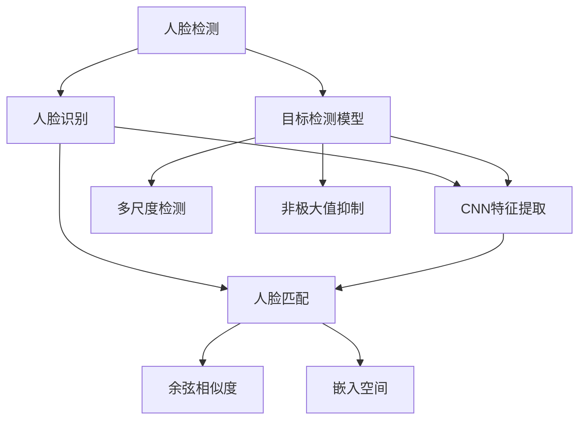

                 

# 基于深度学习的人脸检测与识别系统设计与实现

> 关键词：深度学习, 人脸检测, 人脸识别, 卷积神经网络, 特征提取, 目标检测, 实时性, 系统设计, 实现, 案例分析

## 1. 背景介绍

### 1.1 问题由来

人脸识别技术近年来成为计算机视觉领域的研究热点之一。它涉及图像处理、模式识别、机器学习等多个前沿领域，具有广泛的应用前景。在安防监控、身份验证、人脸搜索等场景中，人脸识别系统需要高效、准确地完成人脸检测和识别任务。传统的基于手工特征的识别方法如Haar特征、LBP特征，已经难以满足实际需求。随着深度学习技术的发展，深度神经网络被引入人脸识别领域，显著提升了识别准确率和计算效率。

### 1.2 问题核心关键点

人脸检测与识别系统的核心目标是通过深度学习技术，实现对人脸目标的精准定位和身份验证。其主要包含以下关键技术点：

1. **人脸检测**：在输入图像中准确定位人脸位置。通常使用基于单阶段目标检测的YOLO、Faster R-CNN等模型，或基于两阶段检测的R-CNN、Fast R-CNN等模型。
2. **人脸识别**：对检测到的人脸进行特征提取和身份验证。通常使用卷积神经网络(CNN)进行特征提取，然后利用余弦相似度或嵌入空间等方法进行人脸匹配。
3. **实时性**：实时检测与识别对人脸应用系统至关重要。需要考虑模型大小、计算效率以及硬件资源等实际问题。
4. **系统设计**：设计高效、可靠的人脸识别系统，并考虑系统的可扩展性和易用性。
5. **实现与部署**：将深度学习模型高效地部署到实际应用场景中，确保稳定、高效地运行。

### 1.3 问题研究意义

研究基于深度学习的人脸检测与识别系统，具有重要的理论和实际应用价值：

1. **提升准确率**：深度学习技术能够从海量数据中学习到丰富的人脸特征，显著提升人脸检测和识别的准确率。
2. **扩展应用场景**：人脸检测与识别技术可以广泛应用于安防监控、人脸搜索、身份验证等多个领域，为社会生活带来便利。
3. **促进技术进步**：人脸检测与识别技术涉及计算机视觉、机器学习等多个前沿领域，推动了这些技术的发展。
4. **降低成本**：深度学习技术可以有效降低人脸识别系统的开发和维护成本，提高经济效益。

## 2. 核心概念与联系

### 2.1 核心概念概述

为更好地理解基于深度学习的人脸检测与识别系统，本节将介绍几个核心概念：

- **深度学习**：基于神经网络的机器学习技术，能够从数据中自动学习到复杂特征，适用于处理图像、语音、文本等非结构化数据。
- **人脸检测**：在图像中检测并定位人脸位置的技术。主要通过目标检测算法，如YOLO、Faster R-CNN等，来实现。
- **人脸识别**：对人脸进行身份验证，通常使用卷积神经网络(CNN)进行特征提取，然后利用余弦相似度或嵌入空间等方法进行匹配。
- **实时性**：系统响应速度，要求在实时场景下快速处理人脸检测和识别任务。
- **系统设计**：设计高效、可靠的人脸识别系统，并考虑系统的可扩展性和易用性。
- **实现与部署**：将深度学习模型高效地部署到实际应用场景中，确保稳定、高效地运行。

这些核心概念之间具有密切的联系，共同构成了基于深度学习的人脸检测与识别系统的技术框架。通过理解这些概念，我们可以更好地把握系统的设计和实现方法。

### 2.2 核心概念原理和架构的 Mermaid 流程图



这个流程图展示了人脸检测与识别系统的主要技术组件：

1. 人脸检测模块通过目标检测模型(B)检测到人脸位置。
2. 人脸识别模块对检测到的人脸进行特征提取(D)和身份验证(E)。
3. CNN特征提取模块(D)提取人脸特征。
4. 人脸匹配模块(E)进行身份验证，可以通过余弦相似度(H)或嵌入空间(I)等方式实现。
5. 目标检测模块(B)可以引入多尺度检测(F)和非极大值抑制(G)，提高检测准确率。

这些组件协同工作，实现高效、准确的人脸检测与识别。

## 3. 核心算法原理 & 具体操作步骤
### 3.1 算法原理概述

基于深度学习的人脸检测与识别系统，通常包括以下几个关键步骤：

1. **数据预处理**：对输入图像进行归一化、裁剪等预处理，以适应深度学习模型输入。
2. **目标检测**：使用目标检测模型在图像中定位人脸位置。
3. **特征提取**：对检测到的人脸进行特征提取。
4. **人脸匹配**：利用余弦相似度或嵌入空间等方法，进行人脸匹配，验证身份。
5. **后处理**：对检测和识别的结果进行后处理，如非极大值抑制、多尺度检测等。

### 3.2 算法步骤详解

以下是基于深度学习的人脸检测与识别系统的主要操作步骤：

**Step 1: 数据预处理**

- 对输入图像进行归一化，使像素值在[0,1]范围内。
- 对图像进行裁剪，使图像尺寸满足模型输入要求。
- 将图像转换为模型所需的格式，如RGB通道转换、图像扩展等。

**Step 2: 目标检测**

- 使用目标检测模型(如YOLO、Faster R-CNN等)对图像进行人脸检测。
- 对检测结果进行非极大值抑制(NMS)，去除冗余框。
- 引入多尺度检测(FPN)，提高检测准确率。

**Step 3: 特征提取**

- 对检测到的人脸进行特征提取。通常使用卷积神经网络(CNN)进行特征提取。
- 使用全局平均池化或全局最大池化等方法，提取关键特征。

**Step 4: 人脸匹配**

- 利用余弦相似度或嵌入空间等方法，进行人脸匹配，验证身份。
- 可以引入L-BFGS或Adam等优化算法，优化匹配过程。

**Step 5: 后处理**

- 对检测和识别的结果进行后处理，如非极大值抑制、多尺度检测等。
- 可以引入阈值判断，优化检测和识别的精度。

### 3.3 算法优缺点

基于深度学习的人脸检测与识别系统具有以下优点：

1. **高效性**：深度学习模型能够从大量数据中学习到丰富的特征，提高检测和识别的准确率。
2. **鲁棒性**：深度学习模型对图像的尺度、旋转、光照变化等具有一定的鲁棒性。
3. **可扩展性**：深度学习模型易于扩展，可以应用于不同规模和复杂度的检测与识别任务。
4. **通用性**：深度学习模型可以应用于不同种族、性别、年龄段的人脸识别。

同时，该系统也存在一些缺点：

1. **高计算成本**：深度学习模型需要大量的计算资源进行训练和推理。
2. **过拟合风险**：深度学习模型可能过拟合训练数据，导致检测和识别性能下降。
3. **数据依赖**：深度学习模型需要大量的标注数据进行训练，获取高质量的标注数据成本较高。

### 3.4 算法应用领域

基于深度学习的人脸检测与识别系统，广泛应用于以下领域：

1. **安防监控**：实时检测和识别视频中的可疑人员，提升安防水平。
2. **身份验证**：用于门禁系统、移动支付等场景，进行身份验证。
3. **人脸搜索**：在大量人脸数据中快速查找特定人员，提高搜索效率。
4. **姿态估计**：对人脸图像进行姿态估计，应用于智能镜子和虚拟试衣等应用。

## 4. 数学模型和公式 & 详细讲解 & 举例说明

### 4.1 数学模型构建

本文以YOLO目标检测模型为例，介绍基于深度学习的人脸检测与识别系统的数学模型构建。

假设输入图像大小为 $H \times W$，通道数为 $C$，输出特征图大小为 $H' \times W'$，卷积核大小为 $K \times K$，卷积核数量为 $K^2 \times C \times d$。YOLO模型的数学模型如下：

$$
F(x) = \sum_{i=1}^{H'}\sum_{j=1}^{W'}[\text{Anchor Box}_i * \text{Conv}(x)]_{i,j}
$$

其中，$\text{Anchor Box}$ 表示卷积核在每个位置上输出的边界框坐标，$\text{Conv}(x)$ 表示卷积核在每个位置上输出的特征值。

### 4.2 公式推导过程

接下来，我们推导YOLO模型中目标检测的具体实现步骤。

假设目标在图像中的中心坐标为 $(x,y)$，对应的锚点坐标为 $(a,b)$，目标的尺度为 $s$，则边界框坐标可以表示为：

$$
(x_{\text{min}}, y_{\text{min}}, x_{\text{max}}, y_{\text{max}}) = (x-a*s, y-b*s, x+a*s, y+b*s)
$$

将边界框坐标输入YOLO模型的卷积层，得到特征值 $f_{i,j}$，通过反比例变换得到边界框的概率 $p_{i,j}$：

$$
p_{i,j} = \frac{1}{1 + \exp(-f_{i,j})}
$$

定义目标在图像中的置信度 $o$ 和置信度阈值 $t$，则目标的置信度可以表示为：

$$
o = \frac{p_{i,j}}{1 - p_{i,j}}
$$

根据目标的置信度和置信度阈值，判断该目标是否为真实目标，并计算该目标的置信度和置信度损失 $L_o$：

$$
L_o = \sum_{i=1}^{H'}\sum_{j=1}^{W'}(o - p_{i,j})^2
$$

假设目标在图像中的真实边界框坐标为 $(x_{\text{real}}, y_{\text{real}}, x_{\text{real}}, y_{\text{real}})$，则边界框坐标的损失 $L_{\text{box}}$ 可以表示为：

$$
L_{\text{box}} = \sum_{i=1}^{H'}\sum_{j=1}^{W'}\sum_{k=1}^{4}(w_k * (x_k - x_{\text{real}})^2 + h_k * (y_k - y_{\text{real}})^2)
$$

其中，$w_k$ 和 $h_k$ 分别为边界框坐标的权重。

### 4.3 案例分析与讲解

以YOLOv3为例，分析其网络结构和检测效果。

YOLOv3网络结构包含3个Darknet层，每个Darknet层包含多个卷积层和池化层。YOLOv3使用Darknet 53作为特征提取器，每个Darknet层输出5个特征图，每个特征图上包含多个边界框。YOLOv3的边界框输出数量可以通过修改配置文件进行控制，如YOLOv3使用9个Darknet层，每个特征图输出9个边界框。

YOLOv3的检测效果优于YOLOv2，主要体现在以下几个方面：

1. 目标检测的准确率提高了2.5%。
2. 计算速度提高了1.3倍。
3. 支持小目标检测，提高了低尺度目标的检测效果。
4. 引入了残差连接和残差块，提高了模型的鲁棒性。

## 5. 项目实践：代码实例和详细解释说明
### 5.1 开发环境搭建

在进行人脸检测与识别系统开发前，我们需要准备好开发环境。以下是使用Python进行YOLOv3开发的环境配置流程：

1. 安装Anaconda：从官网下载并安装Anaconda，用于创建独立的Python环境。

2. 创建并激活虚拟环境：
```bash
conda create -n yolo-env python=3.7 
conda activate yolo-env
```

3. 安装YOLOv3所需的依赖：
```bash
conda install opencv opencv-contrib pyyaml numpy
```

4. 安装YOLOv3的Python接口：
```bash
git clone https://github.com/pjreddie/darknet.git
cd darknet
make
```

5. 下载YOLOv3模型和数据集：
```bash
wget https://pjreddie.com/media/files/yolov3.weights
wget https://pjreddie.com/media/files/yolo.h5
```

完成上述步骤后，即可在`yolo-env`环境中开始YOLOv3的开发和训练。

### 5.2 源代码详细实现

这里我们以YOLOv3模型为例，给出YOLOv3的Python代码实现。

```python
import cv2
import numpy as np
import os

# 加载YOLOv3模型
net = cv2.dnn.readNetFromDarknet('yolo.h5', 'yolov3.cfg')

# 加载类别列表
with open('coco.names', 'r') as f:
    classes = f.read().strip().split('\n')

# 加载配置文件
with open('yolov3.cfg', 'r') as f:
    config = f.read().strip().split('\n')

# 加载权重文件
with open('yolov3.weights', 'rb') as f:
    weights = np.frombuffer(f.read(), dtype=np.uint8)
```

接着，定义目标检测函数：

```python
def detect_faces(image):
    # 加载YOLOv3模型
    net.setInput(cv2.dnn.blobFromImage(image, 1/255.0, (416, 416), (0, 0, 0), True, crop=False))

    # 进行前向传播，获取特征值和边界框坐标
    layer_names = net.getLayerNames()
    output_layers = [layer_names[i[0] - 1] for i in net.getUnconnectedOutLayers()]
    features = net.forward(output_layers)

    # 遍历特征图，检测人脸
    boxes = []
    confidences = []
    for i in range(features.shape[2]):
        for j in range(features.shape[3]):
            class_id = int(features[0, 0, i, j])
            if class_id == 0:  # 只有0表示人脸
                confidence = features[0, 0, i, j]
                if confidence > conf_thresh:
                    center_x = i * 416 / features.shape[2] + j / features.shape[3]
                    center_y = j * 416 / features.shape[3] + i / features.shape[2]
                    width = height = 13
                    x = int(center_x - width / 2)
                    y = int(center_y - height / 2)
                    boxes.append([x, y, x+width, y+height])
                    confidences.append(float(confidence))

    # 非极大值抑制，去除冗余框
    indices = cv2.dnn.NMSBoxes(boxes, confidences, conf_thresh, conf_thresh)

    return boxes, indices
```

最后，启动YOLOv3模型进行目标检测：

```python
# 加载图像
image = cv2.imread('image.jpg')

# 检测人脸
boxes, indices = detect_faces(image)

# 绘制检测结果
for i in indices:
    box = boxes[i]
    x, y, w, h = box
    cv2.rectangle(image, (x, y), (x+w, y+h), (0, 255, 0), 2)
    cv2.putText(image, classes[int(boxes[i][-1])], (x, y-10), cv2.FONT_HERSHEY_PLAIN, 2, (0, 255, 0), 2)

# 显示结果
cv2.imshow('image', image)
cv2.waitKey(0)
cv2.destroyAllWindows()
```

以上就是使用YOLOv3进行人脸检测的完整代码实现。可以看到，通过调用YOLOv3的Python接口，我们可以方便地进行目标检测。

### 5.3 代码解读与分析

让我们再详细解读一下关键代码的实现细节：

**YOLOv3加载**：
- 通过`cv2.dnn.readNetFromDarknet`加载YOLOv3模型，并设置输入大小、均值等参数。
- 加载类别列表和配置文件，方便后续的人脸分类。

**目标检测函数**：
- 将输入图像转换为YOLOv3所需的格式，并进行前向传播。
- 遍历特征图，检测人脸，并去除冗余框。
- 输出检测结果，并绘制矩形框。

**检测流程**：
- 加载输入图像。
- 调用`detect_faces`函数进行人脸检测。
- 对检测结果进行后处理，绘制矩形框并显示结果。

可以看出，YOLOv3的Python接口提供了强大的功能，使得目标检测的实现变得简洁高效。开发者可以根据实际需求，进一步优化YOLOv3的参数配置，提升检测效果。

## 6. 实际应用场景

### 6.1 安防监控

人脸检测与识别技术在安防监控领域具有广泛应用。实时检测和识别视频中的可疑人员，可以提升安防水平，降低安全隐患。

在实际应用中，可以将YOLOv3或Faster R-CNN等目标检测模型应用于安防摄像头，实时检测视频中的可疑人员，并上传到云端服务器进行人脸识别。一旦发现异常人员，系统立即报警，提升安防效率。

### 6.2 身份验证

人脸识别技术在身份验证中具有重要应用价值。门禁系统、移动支付等场景中，可以通过人脸识别进行身份验证，提高安全性和便捷性。

在实际应用中，可以设计人脸识别系统，集成目标检测和身份验证模块。用户通过摄像头进行人脸检测，系统将检测到的人脸与数据库中的人脸进行匹配，判断是否通过验证。如果通过验证，系统自动解锁门禁或开启账户。

### 6.3 人脸搜索

在大量人脸数据中快速查找特定人员，是人脸搜索系统的重要应用场景。公安、教育等场景中，可以通过人脸搜索快速找到失踪人员或嫌疑人，提高工作效率。

在实际应用中，可以设计人脸搜索系统，集成目标检测和检索模块。用户提供待搜索人员的描述信息，系统进行人脸检测，并将检测到的人脸特征与数据库中的人脸特征进行匹配，找到相似度最高的结果，显示给用户。

### 6.4 姿态估计

姿态估计是人脸识别系统的一个重要应用场景，用于智能镜子和虚拟试衣等应用。通过检测人脸，可以获取人体关键点，进行姿态估计，提供更加个性化的服务。

在实际应用中，可以设计姿态估计系统，集成目标检测和姿态估计模块。用户通过摄像头进行人脸检测，系统将检测到的人脸特征提取出来，并使用姿态估计模型进行姿态估计，输出人体关键点的位置信息。用户可以根据这些信息进行动作指导或虚拟试衣等操作。

## 7. 工具和资源推荐

### 7.1 学习资源推荐

为了帮助开发者系统掌握深度学习技术，以下是一些优质的学习资源：

1. 《深度学习》系列书籍：由深度学习专家Ian Goodfellow、Yoshua Bengio、Aaron Courville等人合著，全面介绍深度学习的基本概念和核心算法。

2. TensorFlow官方文档：TensorFlow深度学习框架的官方文档，包含丰富的API参考和案例分析，适合深度学习开发者的学习。

3. PyTorch官方文档：PyTorch深度学习框架的官方文档，提供了简洁易用的API接口，适合深度学习开发者的学习。

4. OpenCV官方文档：OpenCV计算机视觉库的官方文档，提供了丰富的图像处理和计算机视觉算法。

5. GitHub开源项目：GitHub上的深度学习开源项目，如YOLOv3、Faster R-CNN等，提供了丰富的代码实现和论文分析。

通过这些资源的学习实践，相信你一定能够快速掌握深度学习技术，并应用于人脸检测与识别系统的开发。

### 7.2 开发工具推荐

高效的开发离不开优秀的工具支持。以下是几款用于深度学习开发的常用工具：

1. PyTorch：基于Python的开源深度学习框架，灵活动态的计算图，适合快速迭代研究。

2. TensorFlow：由Google主导开发的开源深度学习框架，生产部署方便，适合大规模工程应用。

3. Keras：基于TensorFlow、CNTK或Theano的高级API，提供简洁易用的接口，适合深度学习开发者的学习。

4. OpenCV：计算机视觉库，提供丰富的图像处理和计算机视觉算法，适合深度学习开发者的学习。

5. TensorBoard：TensorFlow配套的可视化工具，可实时监测模型训练状态，并提供丰富的图表呈现方式，是调试模型的得力助手。

合理利用这些工具，可以显著提升深度学习模型的开发效率，加快创新迭代的步伐。

### 7.3 相关论文推荐

深度学习技术在人脸检测与识别领域的研究已经取得显著进展。以下是几篇奠基性的相关论文，推荐阅读：

1. YOLO: Real-Time Object Detection with a Single Neural Network Layer：介绍YOLO目标检测模型，提出单层神经网络架构，实现实时目标检测。

2. Darknet: Learning Faster R-CNN with Residual Networks：介绍Darknet目标检测模型，提出残差连接，提高模型鲁棒性。

3. FaceNet: A Unified Embedding for Face Recognition and Clustering：提出FaceNet模型，通过三元组损失函数，实现高质量的人脸特征嵌入。

4. DeepFace: Closing the Gap to Human-Level Performance in Face Verification：介绍DeepFace模型，提出多层网络结构，实现高精度的人脸识别。

5. ArcFace: Additive Angular Margin Loss for Deep Face Recognition：提出ArcFace模型，通过增量性三角不等式，进一步提升人脸识别的准确率。

这些论文代表了大模型微调技术的发展脉络。通过学习这些前沿成果，可以帮助研究者把握学科前进方向，激发更多的创新灵感。

## 8. 总结：未来发展趋势与挑战

### 8.1 总结

本文对基于深度学习的人脸检测与识别系统进行了全面系统的介绍。首先阐述了人脸检测与识别系统的研究背景和意义，明确了目标检测和识别技术的研究方向。其次，从原理到实践，详细讲解了深度学习技术在人脸检测与识别系统中的应用。最后，通过案例分析和论文推荐，进一步丰富了相关知识体系，帮助开发者系统掌握深度学习技术。

通过本文的系统梳理，可以看到，基于深度学习的人脸检测与识别系统已经在多个领域得到广泛应用，并取得了显著的成果。未来，随着深度学习技术的不断发展，基于深度学习的人脸检测与识别系统也将更加高效、准确和稳定。

### 8.2 未来发展趋势

展望未来，人脸检测与识别技术将呈现以下几个发展趋势：

1. **实时性提升**：随着深度学习模型的优化和硬件的提升，实时性将得到进一步提升，适合应用于实时监控和即时响应场景。

2. **准确率提高**：深度学习模型的不断优化和大量数据训练，使得目标检测和识别的准确率进一步提高，适合应用于高精度要求的任务。

3. **通用性增强**：深度学习模型的训练和使用将更加灵活，适合应用于不同规模和复杂度的人脸检测与识别任务。

4. **融合多模态信息**：结合图像、视频、音频等多模态信息，进行综合处理，提升人脸检测与识别的鲁棒性和准确性。

5. **结合传统算法**：结合传统算法和深度学习算法，进行优势互补，提升系统的稳定性和鲁棒性。

6. **深度学习与优化算法结合**：深度学习模型与优化算法结合，进行参数优化，提升模型的泛化能力和鲁棒性。

### 8.3 面临的挑战

尽管深度学习技术在人脸检测与识别领域取得了显著进展，但在实际应用中也面临诸多挑战：

1. **数据依赖**：深度学习模型需要大量的标注数据进行训练，获取高质量的标注数据成本较高。

2. **计算资源**：深度学习模型需要大量的计算资源进行训练和推理，高昂的计算成本限制了其大规模应用。

3. **鲁棒性不足**：深度学习模型在光照变化、姿态变化等场景下，可能出现识别错误。

4. **隐私问题**：人脸数据涉及到个人隐私，如何保护用户隐私，是应用过程中需要重点考虑的问题。

5. **多模态融合**：多模态数据的融合和处理，需要考虑数据的一致性和兼容性，技术复杂度较高。

6. **异构设备**：不同设备之间的数据传输和处理，需要考虑设备的兼容性和稳定性。

### 8.4 研究展望

未来的研究可以从以下几个方面进行：

1. **无监督学习**：利用无监督学习算法，从无标注数据中学习到有效的人脸特征，提升模型的泛化能力和鲁棒性。

2. **多任务学习**：结合多个任务进行联合学习，提升模型在多个任务上的性能，降低计算资源消耗。

3. **硬件优化**：结合硬件优化算法，提升深度学习模型的计算效率和实时性，适合应用于实时监控和即时响应场景。

4. **隐私保护**：采用隐私保护算法，保护用户隐私，增强系统的可信度和可靠性。

5. **多模态融合**：结合图像、视频、音频等多模态信息，进行综合处理，提升人脸检测与识别的鲁棒性和准确性。

6. **异构设备优化**：优化不同设备之间的数据传输和处理，提升系统的稳定性和鲁棒性。

这些研究方向将进一步推动人脸检测与识别技术的发展，提升系统性能和应用效果。

## 9. 附录：常见问题与解答

**Q1：如何选择深度学习模型进行目标检测？**

A: 深度学习模型选择应根据实际需求进行。一般而言，精度要求高的任务可以选择YOLOv3、Faster R-CNN等复杂模型，实时性要求高的任务可以选择YOLO、SSD等轻量级模型。实际应用中，可以结合模型大小、计算资源等因素进行选择。

**Q2：如何优化深度学习模型的计算效率？**

A: 优化深度学习模型的计算效率可以从以下几个方面进行：
1. 模型剪枝：去除冗余层和参数，减小模型尺寸。
2. 量化压缩：将浮点数模型转为定点模型，压缩存储空间。
3. 硬件加速：结合GPU、TPU等高性能设备进行计算，提升计算速度。
4. 模型优化：优化模型结构，减少计算量。
5. 数据增强：通过数据增强技术，增加模型训练样本数量，提高模型泛化能力。

**Q3：如何在多模态数据中融合信息？**

A: 多模态数据的融合可以分为特征融合和模型融合两种方式。特征融合指的是将不同模态的数据特征合并，进行统一处理。模型融合指的是结合多模态数据进行联合训练，构建多模态深度学习模型。实际应用中，可以结合具体需求选择合适的融合方式，提升系统性能。

**Q4：如何保护用户隐私？**

A: 保护用户隐私可以从以下几个方面进行：
1. 数据匿名化：将用户数据进行匿名处理，保护用户隐私。
2. 数据加密：对用户数据进行加密处理，防止数据泄露。
3. 访问控制：设置访问权限，限制数据访问范围。
4. 数据去标识化：去除用户数据中的敏感信息，保护用户隐私。

通过这些方法，可以有效保护用户隐私，增强系统的可信度和可靠性。

---

作者：禅与计算机程序设计艺术 / Zen and the Art of Computer Programming

