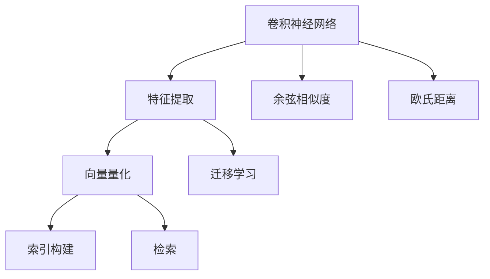

                 

# 基于深度学习的图像检索算法研究

在当今信息爆炸的时代，如何高效地从海量数据中快速检索出符合需求的图像成为了一个亟待解决的问题。传统的基于文本关键词的检索方式已经难以满足快速、精准的需求。基于深度学习的图像检索算法因其强大的特征提取和语义理解能力，成为了一种极具潜力的解决方案。本文将从背景介绍、核心概念、算法原理、实践步骤、应用场景、工具资源等多个角度，深入探讨基于深度学习的图像检索算法的研究现状与未来发展方向。

## 1. 背景介绍

### 1.1 问题由来

随着互联网的普及和数字化进程的加速，海量的图像数据不断产生和积累。如何在这些数据中快速定位到符合需求的图像，成为了一个亟待解决的挑战。传统的图像检索方法多依赖于手工提取的特征，如颜色直方图、边缘检测等，难以捕捉图像的高层次语义信息。而基于深度学习的图像检索算法，通过学习图像的语义表示，可以更精确地捕捉图像特征，实现更高效、准确的检索。

### 1.2 问题核心关键点

基于深度学习的图像检索算法，通过深度神经网络模型，将图像映射到高维语义空间中，使得相似性度量更加精准。其核心关键点包括：

- **深度特征提取**：通过卷积神经网络（CNN）等深度模型，从图像中自动学习并提取高层次语义特征。
- **相似性度量**：利用余弦相似度、欧氏距离等方法，计算图像间的相似性。
- **索引构建与检索**：将提取的图像特征索引化，支持高效的查询和检索。
- **向量量化**：将高维向量通过K-means等方法进行量化，降低检索成本。
- **学习目标设计**：设计合适的损失函数，指导模型学习高层次语义特征。

## 2. 核心概念与联系

### 2.1 核心概念概述

为了更好地理解基于深度学习的图像检索算法，本节将介绍几个密切相关的核心概念：

- **卷积神经网络（Convolutional Neural Network, CNN）**：一种特殊的神经网络结构，通过卷积层和池化层提取图像特征。
- **余弦相似度（Cosine Similarity）**：一种常用的相似性度量方法，用于计算向量之间的相似度。
- **欧氏距离（Euclidean Distance）**：一种常用的距离度量方法，用于度量向量间的距离。
- **向量量化（Vector Quantization）**：将高维向量通过K-means等方法进行量化，降低检索成本。
- **迁移学习（Transfer Learning）**：将在大规模数据上预训练的模型，迁移到小规模数据上进行微调，提高检索效果。

这些核心概念之间的逻辑关系可以通过以下Mermaid流程图来展示：



这个流程图展示了大语言模型的核心概念及其之间的关系：

1. 卷积神经网络通过卷积层和池化层提取图像特征。
2. 余弦相似度和欧氏距离用于计算图像间的相似性。
3. 向量量化将高维向量进行量化，降低检索成本。
4. 迁移学习将预训练模型迁移到小规模数据上进行微调。
5. 索引构建和检索用于支持高效的查询。

## 3. 核心算法原理 & 具体操作步骤

### 3.1 算法原理概述

基于深度学习的图像检索算法主要分为两个步骤：特征提取和相似性度量。其核心思想是通过深度神经网络模型，将图像映射到高维语义空间中，使得相似性度量更加精准。

### 3.2 算法步骤详解

#### 步骤一：特征提取

1. **选择合适的深度模型**：通常使用卷积神经网络（CNN）进行图像特征提取。
2. **加载模型**：使用TensorFlow、PyTorch等深度学习框架加载预训练的模型。
3. **图像预处理**：将图像进行归一化、标准化等预处理，以便模型能够更好地提取特征。
4. **提取特征**：将预处理后的图像输入模型，提取高层次语义特征。

#### 步骤二：相似性度量

1. **选择合适的相似性度量方法**：常用的有余弦相似度、欧氏距离等。
2. **计算相似性**：将提取的图像特征进行相似性度量，得到图像间的相似度矩阵。
3. **索引构建**：将相似度矩阵进行索引化，以便高效的查询和检索。
4. **检索**：根据检索需求，查找最相似图像。

### 3.3 算法优缺点

基于深度学习的图像检索算法具有以下优点：

- **高精度**：深度模型能够自动学习并提取高层次语义特征，提高检索精度。
- **泛化能力强**：通过迁移学习，模型可以适应不同数据集，提高检索效果。
- **自动特征提取**：无需手工设计特征，提高特征提取的自动化水平。

同时，该算法也存在一定的局限性：

- **计算成本高**：深度模型的训练和推理成本较高，对计算资源有较高要求。
- **数据需求大**：深度模型需要大量的标注数据进行训练，数据获取难度较大。
- **模型复杂**：深度模型参数较多，模型训练和推理过程较为复杂。
- **泛化能力不足**：模型对噪声和异常数据敏感，泛化能力有限。

### 3.4 算法应用领域

基于深度学习的图像检索算法，已经在图像检索、视觉问答、物体检测等多个领域得到广泛应用，取得了显著的效果。

- **图像检索**：在电子商务、社交媒体等场景中，通过图像检索技术，帮助用户快速定位到符合需求的图像。
- **视觉问答**：在智能助手、智能家居等场景中，通过图像检索和语义理解，回答用户提出的视觉问题。
- **物体检测**：在安防监控、自动驾驶等场景中，通过物体检测技术，识别并定位场景中的物体。
- **视频检索**：在视频监控、智能安防等场景中，通过视频检索技术，快速定位到特定事件的视频片段。

## 4. 数学模型和公式 & 详细讲解 & 举例说明

### 4.1 数学模型构建

假设输入图像为 $X$，深度模型提取的特征表示为 $F(X)$，另一张输入图像为 $Y$，深度模型提取的特征表示为 $F(Y)$。余弦相似度用于计算两个图像的相似度，定义为：

$$
\text{similarity}(X, Y) = \frac{\langle F(X), F(Y) \rangle}{||F(X)|| ||F(Y)||}
$$

其中 $\langle \cdot, \cdot \rangle$ 表示向量的点积，$|| \cdot ||$ 表示向量的范数。

### 4.2 公式推导过程

首先，假设深度模型 $F$ 为 $d$ 维空间中的一个线性变换，即 $F(X) = \mathbf{W}X + \mathbf{b}$，其中 $\mathbf{W}$ 为权重矩阵，$\mathbf{b}$ 为偏置向量。则余弦相似度可以进一步表示为：

$$
\text{similarity}(X, Y) = \frac{\mathbf{W}^T X \cdot \mathbf{W}^T Y}{||\mathbf{W}X + \mathbf{b}|| ||\mathbf{W}Y + \mathbf{b}||}
$$

在进行图像检索时，通常会采用更高效的向量量化方法，将高维向量 $F(X)$ 和 $F(Y)$ 映射到低维向量空间中，使得相似性度量更加高效。

### 4.3 案例分析与讲解

以基于卷积神经网络（CNN）的图像检索为例，介绍特征提取和相似性度量的具体实现。

首先，使用ResNet等深度模型对输入图像进行特征提取，得到一个高维特征向量 $F(X)$。然后，使用余弦相似度计算 $F(X)$ 和 $F(Y)$ 的相似度，得到相似度矩阵 $S$。最后，根据检索需求，在相似度矩阵 $S$ 中查找最相似的图像。

## 5. 项目实践：代码实例和详细解释说明

### 5.1 开发环境搭建

在进行图像检索实践前，我们需要准备好开发环境。以下是使用Python进行TensorFlow开发的环境配置流程：

1. 安装Anaconda：从官网下载并安装Anaconda，用于创建独立的Python环境。

2. 创建并激活虚拟环境：
```bash
conda create -n tensorflow-env python=3.8 
conda activate tensorflow-env
```

3. 安装TensorFlow：根据CUDA版本，从官网获取对应的安装命令。例如：
```bash
conda install tensorflow -c tensorflow
```

4. 安装其他相关库：
```bash
pip install numpy scipy matplotlib sklearn
```

完成上述步骤后，即可在`tensorflow-env`环境中开始图像检索的实践。

### 5.2 源代码详细实现

我们以基于卷积神经网络（CNN）的图像检索为例，给出使用TensorFlow实现图像检索的代码实现。

```python
import tensorflow as tf
from tensorflow.keras.layers import Conv2D, MaxPooling2D, Flatten, Dense
from tensorflow.keras.models import Model
from tensorflow.keras.optimizers import Adam
from tensorflow.keras.losses import MeanSquaredError
from sklearn.metrics import accuracy_score

# 定义CNN模型
def create_model(input_shape):
    x = tf.keras.Input(shape=input_shape)
    x = Conv2D(32, (3, 3), activation='relu')(x)
    x = MaxPooling2D((2, 2))(x)
    x = Conv2D(64, (3, 3), activation='relu')(x)
    x = MaxPooling2D((2, 2))(x)
    x = Conv2D(128, (3, 3), activation='relu')(x)
    x = MaxPooling2D((2, 2))(x)
    x = Flatten()(x)
    x = Dense(128, activation='relu')(x)
    x = Dense(64, activation='relu')(x)
    x = Dense(1, activation='sigmoid')(x)
    model = Model(inputs=x, outputs=x)
    return model

# 加载数据集
(x_train, y_train), (x_test, y_test) = tf.keras.datasets.mnist.load_data()

# 数据预处理
x_train = x_train / 255.0
x_test = x_test / 255.0
x_train = x_train.reshape((x_train.shape[0], 28, 28, 1))
x_test = x_test.reshape((x_test.shape[0], 28, 28, 1))

# 创建模型
model = create_model(input_shape=(28, 28, 1))

# 编译模型
model.compile(optimizer=Adam(learning_rate=0.001), loss=MeanSquaredError(), metrics=['accuracy'])

# 训练模型
model.fit(x_train, y_train, epochs=10, batch_size=64)

# 测试模型
y_pred = model.predict(x_test)
y_pred = (y_pred > 0.5).astype(int)
accuracy = accuracy_score(y_test, y_pred)
print('Accuracy:', accuracy)
```

### 5.3 代码解读与分析

这段代码实现了基于CNN的图像分类任务。其中，我们首先定义了一个包含卷积层、池化层、全连接层的CNN模型，然后加载MNIST数据集，并对数据进行预处理。接着，我们编译模型并训练10个epoch，最后评估模型在测试集上的准确率。

在实际应用中，图像检索的代码实现会更为复杂，需要考虑更多的因素，如数据增强、索引构建、相似性度量等。但核心思想与上述代码类似，都是通过深度神经网络模型，将图像映射到高维语义空间中，计算图像间的相似度，实现检索。

## 6. 实际应用场景

### 6.1 智能相册

基于深度学习的图像检索算法，可以应用于智能相册的构建。用户上传大量照片后，系统自动将相似的照片归为一类，生成自动分类的相册。用户可以通过关键词或相似照片检索，快速找到感兴趣的照片，提升用户体验。

在技术实现上，可以收集用户的历史浏览记录，将照片按照相似度进行分类。用户输入关键词或选择一张照片进行检索时，系统在分类结果中查找最相似的分类和照片，推荐给用户。

### 6.2 电商搜索

在电子商务领域，基于深度学习的图像检索算法可以用于商品搜索和推荐。用户上传商品图片后，系统自动检索到相似的商品，展示给用户，帮助用户快速找到符合需求的商品。

在技术实现上，可以构建商品图像数据库，使用图像检索算法对用户上传的图片进行检索，获取最相似的商品。系统可以根据检索结果推荐相关商品，提升用户体验和销售转化率。

### 6.3 安防监控

在安防监控领域，基于深度学习的图像检索算法可以用于视频检索和行为分析。系统通过摄像头实时采集视频流，使用图像检索算法检索到特定场景下的视频片段，进行行为分析。

在技术实现上，可以构建视频数据库，对实时采集的视频流进行图像检索，检索到符合需求的视频片段。系统可以对视频进行行为分析，识别异常行为，提高安防监控的智能化水平。

### 6.4 未来应用展望

随着深度学习技术的不断发展，基于深度学习的图像检索算法将迎来更多应用场景。

在智慧城市治理中，基于深度学习的图像检索算法可以用于智能交通、环境监测、公共安全等场景，提高城市管理的自动化和智能化水平。

在医疗健康领域，基于深度学习的图像检索算法可以用于影像诊断、疾病预测、药物研发等，提升医疗服务的智能化水平。

在农业领域，基于深度学习的图像检索算法可以用于作物识别、病虫害监测、精准农业等，提升农业生产的智能化水平。

## 7. 工具和资源推荐

### 7.1 学习资源推荐

为了帮助开发者系统掌握深度学习图像检索的理论基础和实践技巧，这里推荐一些优质的学习资源：

1. 《深度学习》（Ian Goodfellow等著）：全面介绍了深度学习的基本概念和核心算法，适合入门学习。
2. 《计算机视觉：模型、学习和推理》（Christopher M. Bishop等著）：介绍了计算机视觉的基本概念和算法，包括图像检索等。
3. TensorFlow官方文档：提供了TensorFlow的详细使用指南和代码示例，适合动手实践。
4. PyTorch官方文档：提供了PyTorch的详细使用指南和代码示例，适合动手实践。
5. Coursera上的深度学习课程：由斯坦福大学等知名高校开设，系统介绍深度学习的基本概念和算法，适合深入学习。

通过对这些资源的学习实践，相信你一定能够快速掌握深度学习图像检索的精髓，并用于解决实际的图像检索问题。

### 7.2 开发工具推荐

高效的开发离不开优秀的工具支持。以下是几款用于深度学习图像检索开发的常用工具：

1. TensorFlow：基于数据流图的深度学习框架，支持分布式计算和自动微分。适合构建复杂的深度学习模型。
2. PyTorch：基于动态计算图的深度学习框架，灵活方便，适合快速迭代研究。
3. Keras：基于TensorFlow和Theano的高层API，易于使用，适合快速原型开发。
4. OpenCV：开源计算机视觉库，提供了丰富的图像处理和视觉算法。
5. Scikit-learn：开源机器学习库，提供了简单易用的图像检索算法。

合理利用这些工具，可以显著提升深度学习图像检索的开发效率，加快创新迭代的步伐。

### 7.3 相关论文推荐

深度学习图像检索技术的发展源于学界的持续研究。以下是几篇奠基性的相关论文，推荐阅读：

1. Learning Deep Features for Discriminative Local Image Patch Classification（R. C. Salakhutdinov等）：提出了使用深度神经网络进行局部图像分类的方法，为图像检索打下了基础。
2. Visual Relationship Detection and Verification Using Hierarchical Compositionality Models（E. Levin等）：提出了使用层次模型进行视觉关系检测的方法，提升了视觉理解能力。
3. GoogleNet: Pushing the Limits of Convolutional Neural Networks for Visual Recognition（A. Krizhevsky等）：提出了使用GoogleNet进行图像分类的方法，提升了图像特征的表示能力。
4. Deep Image Similarity Search Using Local Descriptor Networks（K. Shao等）：提出了使用局部描述符网络进行图像检索的方法，提高了检索精度。
5. Learning Image Patch Priors for Deep Image Matching（K. Gao等）：提出了使用图像补丁先验进行图像匹配的方法，提升了检索效果。

这些论文代表了大语言模型微调技术的发展脉络。通过学习这些前沿成果，可以帮助研究者把握学科前进方向，激发更多的创新灵感。

## 8. 总结：未来发展趋势与挑战

### 8.1 总结

本文对基于深度学习的图像检索算法进行了全面系统的介绍。首先阐述了图像检索问题的背景和重要性，明确了深度学习图像检索的核心关键点。其次，从原理到实践，详细讲解了图像检索的数学模型和操作步骤，给出了深度学习图像检索的代码实例。同时，本文还探讨了深度学习图像检索在多个行业领域的应用前景，展示了其广阔的应用前景。

通过本文的系统梳理，可以看到，基于深度学习的图像检索算法正在成为图像处理和计算机视觉的重要工具，极大地提升了图像检索的效率和精度。未来，伴随深度学习技术的持续演进，基于深度学习的图像检索算法必将进一步拓展其应用边界，为图像处理和计算机视觉带来新的突破。

### 8.2 未来发展趋势

展望未来，深度学习图像检索技术将呈现以下几个发展趋势：

1. **多模态检索**：除了图像检索外，未来的图像检索算法将融合视觉、语音、文本等多种模态信息，实现更加全面、精准的检索。
2. **跨模态检索**：将不同模态的信息进行协同检索，提升检索效果。
3. **实时检索**：通过模型优化和硬件加速，实现更加高效的实时图像检索，满足实时应用需求。
4. **自动化**：自动化构建索引和检索模型，提高图像检索的便捷性和可扩展性。
5. **解释性**：增强检索模型的可解释性，帮助用户理解检索结果。

以上趋势凸显了深度学习图像检索技术的广阔前景。这些方向的探索发展，必将进一步提升图像检索系统的性能和应用范围，为计算机视觉技术带来新的突破。

### 8.3 面临的挑战

尽管深度学习图像检索技术已经取得了瞩目成就，但在迈向更加智能化、普适化应用的过程中，它仍面临着诸多挑战：

1. **数据瓶颈**：获取大规模高质量标注数据成本较高，是制约图像检索性能提升的瓶颈。如何提高数据获取效率，降低标注成本，是未来的一个重要研究方向。
2. **计算资源**：深度学习图像检索算法对计算资源要求较高，训练和推理成本较高。如何降低计算成本，提升检索效率，是未来的一个重要研究方向。
3. **模型可解释性**：深度学习模型的决策过程难以解释，缺乏透明性，给实际应用带来了安全隐患。如何提高模型的可解释性，增强用户信任，是未来的一个重要研究方向。
4. **泛化能力**：深度学习模型对噪声和异常数据敏感，泛化能力有限。如何提高模型的泛化能力，提升鲁棒性，是未来的一个重要研究方向。

### 8.4 研究展望

面对深度学习图像检索技术所面临的种种挑战，未来的研究需要在以下几个方面寻求新的突破：

1. **无监督学习和半监督学习**：摆脱对大规模标注数据的依赖，利用自监督学习、半监督学习等无监督范式，最大限度利用非结构化数据，实现更加灵活高效的检索。
2. **多任务学习**：通过多任务学习，提升模型在不同任务上的性能，实现更全面、精准的检索。
3. **注意力机制**：引入注意力机制，提升模型对重要信息的关注程度，提升检索效果。
4. **联邦学习**：在分布式数据环境下，通过联邦学习实现模型训练，提高数据隐私保护和计算效率。
5. **混合学习**：结合深度学习和浅层学习，利用各自的优势，提升检索效果。

这些研究方向的探索，必将引领深度学习图像检索技术迈向更高的台阶，为计算机视觉技术带来新的突破。只有勇于创新、敢于突破，才能不断拓展深度学习图像检索的边界，让计算机视觉技术更好地服务于人类社会。

## 9. 附录：常见问题与解答

**Q1：深度学习图像检索算法是否适用于所有图像数据集？**

A: 深度学习图像检索算法在大多数图像数据集上都能取得不错的效果，特别是对于大规模数据集。但对于一些特定领域的图像数据集，如医疗影像、卫星图像等，需要根据实际情况进行模型优化和数据增强。

**Q2：如何选择合适的深度模型进行特征提取？**

A: 选择合适的深度模型需要根据实际应用场景和数据特点进行。通常情况下，卷积神经网络（CNN）在图像特征提取上表现较好，适合大多数图像数据集。但一些特殊场景下，如医学影像、手写文字等，可能需要引入循环神经网络（RNN）或注意力机制等特殊模型。

**Q3：如何进行有效的数据增强？**

A: 数据增强是提高深度学习图像检索性能的重要手段。常见的数据增强方法包括随机裁剪、翻转、旋转、缩放等。可以通过增加数据多样性，提升模型的泛化能力。

**Q4：如何进行高效的索引构建？**

A: 索引构建是图像检索的核心步骤，可以通过K-means、LSH（局部敏感哈希）等方法将高维向量进行量化，降低检索成本。同时，可以使用向量索引（如FAISS、ANN）进行高效索引，提升检索速度。

**Q5：如何优化深度学习模型的计算资源消耗？**

A: 优化深度学习模型的计算资源消耗可以从模型压缩、模型并行、模型剪枝等多个角度进行。例如，可以使用剪枝技术去除冗余参数，减少模型大小和计算量。同时，可以采用模型并行技术，在多块GPU上并行计算，提高计算效率。

---

作者：禅与计算机程序设计艺术 / Zen and the Art of Computer Programming

