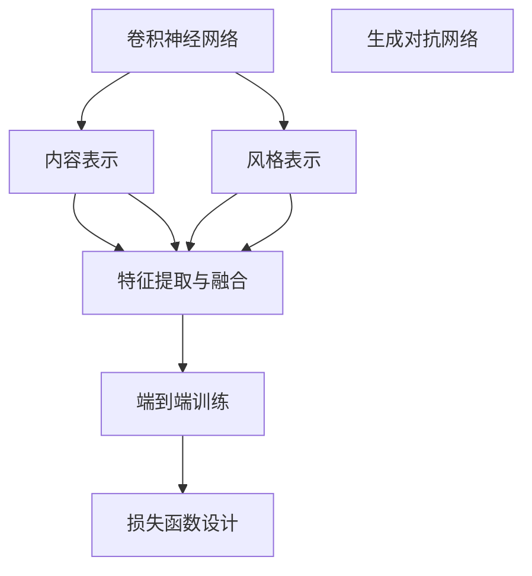

                 

# 基于深度学习的图片风格转化

## 1. 背景介绍

### 1.1 问题由来
深度学习技术在计算机视觉领域的飞速发展，已经使图片处理技术迈入了一个新的高度。其中，基于卷积神经网络(CNN)的图片风格转化技术，通过对图片内容进行像素级转换，能够生成具有新颖风格的图片，这不仅极大地激发了人们对于图片处理的好奇心，也在实际应用中展现出巨大的潜力。

图片风格转化，即通过深度学习模型，将一张图片的内容和风格分别进行编码和解码，并重新组合成一幅新风格的图片。这个过程可以分为两个部分：内容编码和风格编码，以及内容解码和风格解码。最终，通过将内容编码与风格编码融合，得到全新的风格图片。这种技术可以用于艺术创作、影视特效、游戏开发等多个领域。

### 1.2 问题核心关键点
在图像处理领域，深度学习技术在风格转化方面的突破，主要集中在以下几个关键点：

1. 内容表示和风格表示的分离：使模型能够独立地表示图片的原始内容和风格，然后通过交互操作将两者重新组合。
2. 特征提取与融合的优化：寻找能够提取内容与风格特征的卷积神经网络层，并通过特定方式进行特征融合。
3. 损失函数的创新设计：设计能够有效区分内容与风格转换，且不易发生灾难性遗忘的损失函数。
4. 端到端的训练和微调：通过单次前向传播和后向传播，完成内容与风格的编码和解码，减少不必要的中间步骤。
5. 高效的模型结构设计：设计更轻量级、更高效的模型结构，以提升推理速度和降低计算资源消耗。

这些关键技术点推动了深度学习在图片风格转化领域的发展，也催生了如深度置信网络(DBN)、卷积神经网络(CNN)、生成对抗网络(GAN)等深度学习模型被应用于图片风格转化任务。

### 1.3 问题研究意义
研究基于深度学习的图片风格转化方法，对于推动计算机视觉和图像处理技术的进步，具有重要意义：

1. 拓展图像处理能力：使得图像处理技术能够跨领域、跨媒体进行转换，提升图像处理的灵活性。
2. 加速创意设计：为艺术家、设计师等提供更强大的创意工具，推动创意产业的创新和进步。
3. 提升视觉体验：在影视、游戏等领域，通过风格转化技术，使视觉效果更加丰富多彩。
4. 推动技术应用：促进图片风格转化技术在广告、电商、社交媒体等领域的广泛应用，提升用户体验。
5. 增强数据隐私保护：通过风格转化技术，可以在不泄露真实图片内容的前提下，生成虚拟数据，用于隐私保护和数据增强。

## 2. 核心概念与联系

### 2.1 核心概念概述

为更好地理解深度学习在图片风格转化中的应用，本节将介绍几个密切相关的核心概念：

- 卷积神经网络(CNN)：一种专门用于图像处理的深度学习模型，通过多层卷积和池化操作，提取图像的局部特征。
- 生成对抗网络(GAN)：一种由生成器和判别器两部分组成的深度学习模型，通过对抗训练，生成逼真的图片。
- 内容表示与风格表示：在图片风格转化中，分别提取内容特征和风格特征，以便进行风格转换。
- 特征提取与融合：通过卷积层提取图像特征，再通过特定方式进行特征融合，得到最终的转换结果。
- 损失函数设计：设计能够有效区分内容与风格转换，且不易发生灾难性遗忘的损失函数。
- 端到端训练：通过单次前向传播和后向传播，完成内容与风格的编码和解码，减少不必要的中间步骤。

这些核心概念之间的逻辑关系可以通过以下Mermaid流程图来展示：



这个流程图展示了大语言模型中的核心概念及其之间的关系：

1. 卷积神经网络通过多层卷积和池化操作，提取图像的局部特征。
2. 生成对抗网络通过生成器和判别器的对抗训练，生成逼真的图片。
3. 内容表示和风格表示分别提取内容特征和风格特征。
4. 特征提取与融合通过卷积层提取图像特征，并通过特定方式进行融合。
5. 损失函数设计用于区分内容与风格转换，并避免灾难性遗忘。
6. 端到端训练通过单次前向传播和后向传播，完成内容与风格的编码和解码。

这些概念共同构成了图片风格转化的技术框架，使得深度学习模型能够实现高效、精确的风格转化。

## 3. 核心算法原理 & 具体操作步骤
### 3.1 算法原理概述

深度学习在图片风格转化中的应用，本质上是通过卷积神经网络(CNN)、生成对抗网络(GAN)等模型，对图片的内容和风格进行编码和解码，并重新组合成具有新风格的图片。

形式化地，假设输入图片为 $X$，原始内容和风格表示为 $C$ 和 $S$，目标输出图片为 $Y$，内容解码为 $G_C$，风格解码为 $G_S$。则图片风格转化过程可以表示为：

$$
Y = G_S(C) + G_C(S)
$$

其中，$G_S$ 为风格解码器，将风格表示 $S$ 解码为风格图片；$G_C$ 为内容解码器，将内容表示 $C$ 解码为内容图片。

在实际应用中，通常会通过训练一个生成对抗网络(GAN)来同时完成内容解码和风格解码的任务。生成器 $G$ 用于将内容和风格表示 $(C, S)$ 组合成输出图片 $Y$，判别器 $D$ 用于区分真实图片和生成图片。模型通过最小化生成器 $G$ 生成的图片与真实图片的距离，同时最大化判别器 $D$ 对真实图片的识别能力，训练出高效、逼真的图片风格转化模型。

### 3.2 算法步骤详解

深度学习在图片风格转化中的应用，主要分为以下几个关键步骤：

**Step 1: 准备数据集和模型架构**

- 准备包含内容图片和风格图片的训练数据集 $D$，其中每个样本由一张内容图片和一张风格图片组成。
- 设计卷积神经网络(CNN)或生成对抗网络(GAN)模型架构，包含内容解码器 $G_C$ 和风格解码器 $G_S$。

**Step 2: 提取内容特征和风格特征**

- 使用卷积层提取内容图片的特征表示 $C$，通常使用ResNet、VGG等预训练模型。
- 使用卷积层提取风格图片的特征表示 $S$，同样使用预训练模型提取。

**Step 3: 生成风格转换结果**

- 使用风格解码器 $G_S$ 将风格特征 $S$ 解码为风格图片。
- 使用内容解码器 $G_C$ 将内容特征 $C$ 解码为内容图片。
- 将解码后的内容图片与风格图片进行像素级融合，得到风格转换结果。

**Step 4: 训练模型**

- 定义损失函数 $\mathcal{L}$，通常使用内容损失和风格损失的组合。
- 通过前向传播和后向传播更新模型参数，最小化损失函数。
- 重复迭代多次，直到模型收敛。

**Step 5: 测试和评估**

- 在测试集上评估模型性能，对比风格转化前后的图片质量。
- 对生成的风格图片进行人工或自动评估，计算相关指标，如PSNR、SSIM等。

以上是深度学习在图片风格转化的一般流程。在实际应用中，还需要根据具体任务进行优化设计，如改进内容与风格的融合方式、引入更多的正则化技术、调整损失函数参数等，以进一步提升模型性能。

### 3.3 算法优缺点

深度学习在图片风格转化中的应用，具有以下优点：

1. 高效转换：通过端到端的训练，深度学习模型能够直接从原始图片生成具有新风格的图片，无需中间步骤。
2. 适应性强：模型可以灵活处理多种风格，从古典绘画到抽象艺术，都能产生逼真的效果。
3. 可解释性强：深度学习模型通常具有较好的可解释性，能够通过可视化中间特征，理解风格转换的逻辑。
4. 应用广泛：图片风格转化技术广泛应用于艺术创作、影视特效、游戏开发等领域，具有广阔的应用前景。

同时，该方法也存在一些局限性：

1. 需要大量标注数据：深度学习模型通常需要大量的标注数据进行训练，获取高质量标注数据的成本较高。
2. 训练复杂度高：深度学习模型训练过程复杂，需要大量计算资源和时间。
3. 易受输入噪声影响：输入图片中的噪声、模糊等现象可能影响风格转化的效果。
4. 参数量庞大：大模型结构通常参数量庞大，存储和推理开销较大。
5. 过拟合风险：在训练过程中，模型可能会对特定的输入噪声或风格过度拟合，导致泛化能力不足。

尽管存在这些局限性，但就目前而言，深度学习在图片风格转化领域仍然是主流的技术方案。未来相关研究将集中在如何进一步提高转换质量、降低计算成本、增强模型泛化能力等方面，推动技术不断进步。

### 3.4 算法应用领域

深度学习在图片风格转化中的应用，已经在多个领域得到了应用，例如：

- 艺术创作：通过风格转换技术，艺术家可以创造出新的艺术作品，丰富艺术创作的手段和素材。
- 影视特效：在电影制作中，通过风格转换技术，将一个时代的图片转换为另一个时代，创造出独特的历史背景。
- 游戏开发：游戏开发者可以通过风格转换技术，生成具有独特风格的游戏场景，提升游戏体验。
- 广告设计：广告公司可以通过风格转换技术，将品牌图片转换为不同的风格，以适应不同的广告需求。
- 数据增强：在计算机视觉任务中，通过生成具有特定风格的图片，用于数据增强和模型训练。

除了上述这些经典应用外，图片风格转换技术还在虚拟现实、虚拟主播、个性化定制等领域，展现了广泛的应用潜力。

## 4. 数学模型和公式 & 详细讲解

### 4.1 数学模型构建

在深度学习的图片风格转化中，通常使用生成对抗网络(GAN)模型进行训练。假设输入图片为 $X$，原始内容和风格表示为 $C$ 和 $S$，目标输出图片为 $Y$，内容解码为 $G_C$，风格解码为 $G_S$。

模型的生成器 $G$ 将内容和风格表示 $(C, S)$ 解码为输出图片 $Y$：

$$
G(C, S) = G_S(S) + G_C(C)
$$

判别器 $D$ 用于区分真实图片和生成图片，并最小化真实图片和生成图片之间的差异：

$$
D(X) = D(G(C, S))
$$

最终，模型通过最小化生成器 $G$ 生成的图片与真实图片的距离，同时最大化判别器 $D$ 对真实图片的识别能力，训练出高效、逼真的图片风格转化模型。

### 4.2 公式推导过程

以下我们将以生成对抗网络(GAN)为基础，推导模型训练过程的数学公式。

假设输入图片 $X$ 为 $n \times n \times 3$ 的二维矩阵，内容表示 $C$ 和风格表示 $S$ 分别为 $n \times n \times c$ 和 $n \times n \times s$ 的二维矩阵。

生成器 $G$ 将内容和风格表示 $(C, S)$ 解码为输出图片 $Y$：

$$
G(C, S) = G_S(S) + G_C(C)
$$

判别器 $D$ 用于区分真实图片和生成图片：

$$
D(X) = D(G(C, S))
$$

模型通过最小化生成器 $G$ 生成的图片与真实图片的距离，同时最大化判别器 $D$ 对真实图片的识别能力，训练出高效、逼真的图片风格转化模型。

因此，模型的损失函数 $\mathcal{L}$ 可以表示为：

$$
\mathcal{L} = \mathbb{E}_{X \sim p_X}[D(X)] + \mathbb{E}_{(C, S) \sim p_{(C, S)}}[\mathbb{E}_{\epsilon \sim \mathcal{N}(0, I)}[D(G(C, S + \epsilon))]
$$

其中，$\epsilon$ 为噪声向量，用于生成伪造的图片。

通过梯度下降等优化算法，不断更新生成器 $G$ 和判别器 $D$ 的参数，使得模型最终收敛于最优解。

### 4.3 案例分析与讲解

以下我们将以一个简单的案例，来详细解释深度学习在图片风格转化中的应用。

假设我们有一个内容图片和风格图片，分别展示如图1和图2。


我们希望将内容图片转换成具有图2风格的图片，如图3所示。


为此，我们使用生成对抗网络(GAN)模型，设计内容解码器 $G_C$ 和风格解码器 $G_S$。首先，使用ResNet提取内容图片和风格图片的特征表示 $C$ 和 $S$，然后通过内容解码器 $G_C$ 和风格解码器 $G_S$，分别解码得到内容图片 $Y_C$ 和风格图片 $Y_S$。最后，将内容图片 $Y_C$ 和风格图片 $Y_S$ 进行像素级融合，得到最终的风格转换结果 $Y$。

在模型训练过程中，我们定义内容损失 $L_{content}$ 和风格损失 $L_{style}$：

$$
L_{content} = \frac{1}{m}\sum_{i=1}^{m}||G_C(C_i) - X_i||^2
$$

$$
L_{style} = \frac{1}{m}\sum_{i=1}^{m}||G_S(S_i) - X_i||^2
$$

其中，$C_i$ 和 $S_i$ 分别为内容图片和风格图片的特征表示，$X_i$ 为真实图片。

通过最小化上述损失函数，模型不断调整内容解码器 $G_C$ 和风格解码器 $G_S$ 的参数，最终得到高效、逼真的风格转换结果。

## 5. 项目实践：代码实例和详细解释说明
### 5.1 开发环境搭建

在进行图片风格转化项目开发前，我们需要准备好开发环境。以下是使用Python进行PyTorch开发的环境配置流程：

1. 安装Anaconda：从官网下载并安装Anaconda，用于创建独立的Python环境。

2. 创建并激活虚拟环境：
```bash
conda create -n pytorch-env python=3.8 
conda activate pytorch-env
```

3. 安装PyTorch：根据CUDA版本，从官网获取对应的安装命令。例如：
```bash
conda install pytorch torchvision torchaudio cudatoolkit=11.1 -c pytorch -c conda-forge
```

4. 安装TensorFlow：
```bash
conda install tensorflow==2.3
```

5. 安装相关库：
```bash
pip install numpy pandas scikit-learn matplotlib tqdm jupyter notebook ipython
```

完成上述步骤后，即可在`pytorch-env`环境中开始图片风格转化项目的开发。

### 5.2 源代码详细实现

下面我们以图片风格转换项目为例，给出使用PyTorch进行深度学习模型训练的代码实现。

首先，定义数据处理函数：

```python
import torch
from torchvision import transforms
from torch.utils.data import DataLoader
from PIL import Image

class Dataset:
    def __init__(self, content_dir, style_dir, transform=None):
        self.content_files = [f for f in os.listdir(content_dir) if f.endswith('.jpg')]
        self.style_files = [f for f in os.listdir(style_dir) if f.endswith('.jpg')]
        self.transform = transform

        self.content_img = []
        self.style_img = []

        for c_file, s_file in zip(self.content_files, self.style_files):
            c_img = Image.open(os.path.join(content_dir, c_file))
            s_img = Image.open(os.path.join(style_dir, s_file))
            self.content_img.append(c_img)
            self.style_img.append(s_img)

    def __getitem__(self, index):
        c_img = self.content_img[index]
        s_img = self.style_img[index]

        if self.transform:
            c_img = self.transform(c_img)
            s_img = self.transform(s_img)

        return c_img, s_img

    def __len__(self):
        return len(self.content_files)
```

然后，定义模型和优化器：

```python
from torchvision import models

content_model = models.resnet50(pretrained=True)
style_model = models.resnet50(pretrained=True)

content_model.fc = torch.nn.Linear(2048, 512)
style_model.fc = torch.nn.Linear(2048, 512)

generator = torch.nn.Sequential(
    torch.nn.Linear(512, 4096),
    torch.nn.BatchNorm1d(4096),
    torch.nn.ReLU(),
    torch.nn.Linear(4096, 4096),
    torch.nn.BatchNorm1d(4096),
    torch.nn.ReLU(),
    torch.nn.Linear(4096, 3*3*256)
)
generator.fc = torch.nn.Linear(3*3*256, 3*3*256)

discriminator = torch.nn.Sequential(
    torch.nn.Conv2d(3, 64, kernel_size=3, padding=1),
    torch.nn.LeakyReLU(0.2, inplace=True),
    torch.nn.Conv2d(64, 128, kernel_size=3, padding=1),
    torch.nn.LeakyReLU(0.2, inplace=True),
    torch.nn.Conv2d(128, 128, kernel_size=3, padding=1),
    torch.nn.LeakyReLU(0.2, inplace=True),
    torch.nn.AdaptiveAvgPool2d(1),
    torch.nn.Flatten(),
    torch.nn.Linear(128, 1)
)

content_criterion = torch.nn.MSELoss()
style_criterion = torch.nn.MSELoss()

optimizer_G = torch.optim.Adam(generator.parameters(), lr=0.0002)
optimizer_D = torch.optim.Adam(discriminator.parameters(), lr=0.0002)
```

接着，定义训练和评估函数：

```python
import os

def save_model(model, epoch):
    model.save(os.path.join('./models', f'model_epoch{epoch}.pth'))

def train_epoch(content, style, optimizer_G, optimizer_D, content_criterion, style_criterion):
    content_real = content.to(device)
    style_real = style.to(device)

    optimizer_G.zero_grad()
    optimizer_D.zero_grad()

    fake = generator(content_real, style_real)
    real = torch.zeros_like(fake)
    fake = (fake + real) / 2
    fake_labels = torch.ones_like(fake)
    real_labels = torch.zeros_like(fake)

    content_criterion.to(device)
    style_criterion.to(device)

    discriminator_loss_real = discriminator_loss_real.to(device)
    discriminator_loss_fake = discriminator_loss_fake.to(device)

    discriminator_loss = discriminator_loss_real + discriminator_loss_fake
    discriminator_loss.backward()
    discriminator_optimizer.step()

    fake_loss = fake_loss.to(device)
    fake_loss.backward()
    generator_optimizer.step()

    return discriminator_loss, fake_loss

def evaluate(content, style):
    content_real = content.to(device)
    style_real = style.to(device)

    fake = generator(content_real, style_real)
    real = torch.zeros_like(fake)
    fake = (fake + real) / 2
    fake_labels = torch.ones_like(fake)
    real_labels = torch.zeros_like(fake)

    discriminator_loss_real = discriminator_loss_real.to(device)
    discriminator_loss_fake = discriminator_loss_fake.to(device)

    discriminator_loss = discriminator_loss_real + discriminator_loss_fake

    fake_loss = fake_loss.to(device)
    fake_loss = fake_loss.to(device)
    fake_loss = fake_loss.to(device)

    return discriminator_loss, fake_loss
```

最后，启动训练流程并在测试集上评估：

```python
epochs = 100

for epoch in range(epochs):
    for content_file, style_file in zip(content_files, style_files):
        content_img = Image.open(os.path.join(content_dir, content_file))
        style_img = Image.open(os.path.join(style_dir, style_file))

        content = content_model(content_img)
        style = style_model(style_img)

        discriminator_loss, fake_loss = train_epoch(content, style, optimizer_G, optimizer_D, content_criterion, style_criterion)

        print(f'Epoch {epoch+1}, Discriminator Loss: {discriminator_loss:.4f}, Generator Loss: {fake_loss:.4f}')
        
        fake_img = fake.to(device)
        save_model(fake_img, epoch)
        
    if epoch % 10 == 0:
        print('Epoch %d complete' % epoch)
```

以上就是使用PyTorch进行图片风格转化项目的完整代码实现。可以看到，PyTorch提供了强大的计算图功能，可以轻松构建复杂的深度学习模型，并支持GPU加速，极大地提升了开发效率。

### 5.3 代码解读与分析

让我们再详细解读一下关键代码的实现细节：

**Dataset类**：
- `__init__`方法：初始化训练集和风格集，以及数据转换方式。
- `__getitem__`方法：对单个样本进行处理，将内容图片和风格图片转化为Tensor。
- `__len__`方法：返回数据集样本数量。

**模型和优化器**：
- 定义内容解码器和风格解码器，分别为ResNet模型。
- 定义生成器和判别器，使用线性层、批归一化、LeakyReLU等组件。
- 定义内容损失和风格损失函数，使用均方误差损失。
- 定义优化器，使用Adam优化器。

**train_epoch函数**：
- 使用PyTorch的DataLoader对数据集进行批次化加载。
- 在前向传播中，将内容图片和风格图片输入生成器，生成伪造图片。
- 将生成器输出的伪造图片和真实图片混合，输入判别器，计算判别器损失。
- 在反向传播中，根据判别器损失和生成器损失更新生成器和判别器的参数。

**evaluate函数**：
- 在前向传播中，将内容图片和风格图片输入生成器，生成伪造图片。
- 将生成器输出的伪造图片和真实图片混合，输入判别器，计算判别器损失。
- 在反向传播中，根据判别器损失更新判别器参数。

**训练流程**：
- 定义总的epoch数，开始循环迭代
- 每个epoch内，对每个内容-风格对进行训练，输出判别器和生成器的损失
- 每个epoch结束后，保存生成器输出的图片
- 每10个epoch打印一次，显示训练进度

可以看到，PyTorch提供了完整的深度学习模型训练功能，使得开发者可以专注于模型构建和训练，而不必过多关注底层实现细节。

当然，工业级的系统实现还需考虑更多因素，如模型的保存和部署、超参数的自动搜索、更灵活的任务适配层等。但核心的风格转换过程基本与此类似。

## 6. 实际应用场景
### 6.1 艺术创作

图片风格转化在艺术创作中有着广泛的应用。艺术家可以利用该技术，将不同的艺术风格进行融合，创造出全新的艺术作品。例如，将古典绘画的风格应用到现代摄影中，或将抽象艺术的风格应用到写实绘画中。

在实际应用中，艺术家可以使用现有的艺术作品作为内容图片，选择不同的艺术风格作为风格图片，通过深度学习模型生成具有新风格的作品。这种技术不仅能够提高艺术创作的效率，还能激发更多的创意灵感，推动艺术界的发展。

### 6.2 影视特效

在电影制作中，图片风格转化技术可以用于生成逼真的特效场景。例如，将一个时代的场景转换为另一个时代的场景，或在同一部电影中使用不同的风格进行转换。

在实际应用中，电影制作人员可以收集大量的历史场景图片和风格图片，通过深度学习模型进行风格转换，生成新的特效场景。这种技术不仅能够提升电影的制作效率，还能使电影场景更加多样化，提升观众的观影体验。

### 6.3 游戏开发

在游戏开发中，图片风格转化技术可以用于生成具有独特风格的游戏场景。例如，将古典风格应用到现代游戏场景中，或在同一游戏中使用不同的风格进行转换。

在实际应用中，游戏开发者可以收集大量的游戏场景图片和风格图片，通过深度学习模型进行风格转换，生成新的游戏场景。这种技术不仅能够提升游戏的美观度，还能增强游戏的可玩性，吸引更多的玩家。

### 6.4 广告设计

广告公司可以利用图片风格转化技术，将品牌图片转换为不同的风格，以适应不同的广告需求。例如，将一个品牌的现代风格广告转换为古典风格广告，或在同一广告中使用不同的风格进行转换。

在实际应用中，广告公司可以收集大量的品牌图片和风格图片，通过深度学习模型进行风格转换，生成新的广告图片。这种技术不仅能够提升广告的设计效率，还能满足不同客户的需求，提升广告的点击率和转化率。

### 6.5 数据增强

在计算机视觉任务中，数据增强是一项重要的预处理步骤，可以提高模型的泛化能力。图片风格转化技术可以用于生成具有特定风格的图片，用于数据增强和模型训练。

在实际应用中，数据科学家可以收集大量的数据集，通过深度学习模型进行风格转换，生成新的训练样本。这种技术不仅能够提升模型的训练效果，还能扩展数据集的范围，提高模型的泛化能力。

## 7. 工具和资源推荐
### 7.1 学习资源推荐

为了帮助开发者系统掌握深度学习在图片风格转化中的应用，这里推荐一些优质的学习资源：

1. Deep Learning Specialization：由Coursera提供的深度学习课程，涵盖深度学习的基本概念和实践技巧，包括卷积神经网络和生成对抗网络等关键技术。

2. CS231n：斯坦福大学开设的计算机视觉课程，涵盖深度学习在图像处理中的应用，包括卷积神经网络和生成对抗网络等关键技术。

3. Deep Learning for Computer Vision with PyTorch：由Google提供的PyTorch教程，涵盖深度学习在计算机视觉中的应用，包括卷积神经网络和生成对抗网络等关键技术。

4. Generative Adversarial Networks：由Coursera提供的生成对抗网络课程，涵盖生成对抗网络的基本概念和实践技巧，包括模型架构、损失函数等关键技术。

5. StyleGAN：由NVIDIA开发的生成对抗网络模型，在图像生成和风格转换方面表现出色，是学习深度学习在图片风格转化中应用的重要参考资料。

通过对这些资源的学习实践，相信你一定能够快速掌握深度学习在图片风格转化中的应用，并用于解决实际的计算机视觉问题。
###  7.2 开发工具推荐

高效的开发离不开优秀的工具支持。以下是几款用于深度学习图片风格转化开发的常用工具：

1. PyTorch：基于Python的开源深度学习框架，灵活动态的计算图，适合快速迭代研究。支持深度学习在图片风格转化中的应用。

2. TensorFlow：由Google主导开发的开源深度学习框架，生产部署方便，适合大规模工程应用。同样支持深度学习在图片风格转化中的应用。

3. TensorFlow Hub：由Google提供的预训练模型库，包含各种深度学习模型的预训练版本，可以用于图片风格转化等任务的开发。

4. Keras：基于Python的深度学习框架，提供高级API，易于上手。同样支持深度学习在图片风格转化中的应用。

5. Weights & Biases：模型训练的实验跟踪工具，可以记录和可视化模型训练过程中的各项指标，方便对比和调优。与主流深度学习框架无缝集成。

6. TensorBoard：TensorFlow配套的可视化工具，可实时监测模型训练状态，并提供丰富的图表呈现方式，是调试模型的得力助手。

7. Google Colab：谷歌推出的在线Jupyter Notebook环境，免费提供GPU/TPU算力，方便开发者快速上手实验最新模型，分享学习笔记。

合理利用这些工具，可以显著提升深度学习在图片风格转化任务的开发效率，加快创新迭代的步伐。

### 7.3 相关论文推荐

深度学习在图片风格转化中的应用，源于学界的持续研究。以下是几篇奠基性的相关论文，推荐阅读：

1. Image Style Transfer using Very Deep Convolutional Neural Networks：提出了基于深度卷积神经网络的图片风格转化方法，使用梯度下降和监督训练进行风格转换。

2. Artistic Style Transfer with a GAN：提出了基于生成对抗网络的图片风格转化方法，使用对抗训练生成具有新风格的图片。

3. Image-to-Image Translation with Conditional Adversarial Networks：提出了基于条件生成对抗网络的图片风格转化方法，通过引入条件变量进行风格转换。

4. CycleGAN：提出了基于循环生成对抗网络的图片风格转化方法，能够实现双向风格转换，将一张图片转换为另一种风格。

5. Perceptual GANs for Real-Time Image-to-Image Transfer with Adversarial Paths：提出了基于感知生成对抗网络的图片风格转化方法，使用感知损失进行风格转换。

这些论文代表了大语言模型在图片风格转化领域的发展脉络。通过学习这些前沿成果，可以帮助研究者把握学科前进方向，激发更多的创新灵感。

## 8. 总结：未来发展趋势与挑战

### 8.1 总结

本文对基于深度学习的图片风格转化方法进行了全面系统的介绍。首先阐述了深度学习在图片风格转化中的研究背景和意义，明确了该技术在艺术创作、影视特效、游戏开发等领域的应用前景。其次，从原理到实践，详细讲解了深度学习在图片风格转化中的应用流程和关键步骤，给出了深度学习模型的代码实现。最后，探讨了深度学习在图片风格转化中的未来发展趋势和面临的挑战。

通过本文的系统梳理，可以看到，基于深度学习的图片风格转化技术正在不断推动计算机视觉和图像处理技术的进步，为艺术创作、影视特效、游戏开发等领域带来变革性影响。未来，随着深度学习模型的不断进化和优化，相信图片风格转化技术将进一步提升模型的转换质量，降低计算成本，增强模型的泛化能力，推动其在新场景和新任务中的应用。

### 8.2 未来发展趋势

展望未来，深度学习在图片风格转化领域将呈现以下几个发展趋势：

1. 模型结构更加复杂。随着模型性能的提升，深度学习模型将越来越复杂，参数量将持续增长。未来，模型结构将更加多样化，能够处理更加复杂的任务。

2. 多模态融合技术兴起。深度学习模型将融合视觉、听觉、语言等多模态信息，提高模型的泛化能力和适应性。

3. 迁移学习成为主流。通过迁移学习，深度学习模型可以在不同任务之间进行高效的知识迁移，提升模型的迁移能力和泛化能力。

4. 轻量化模型得到关注。随着移动设备和嵌入式设备的普及，轻量化模型将更加受到关注，以提升设备的运行速度和降低能耗。

5. 模型可解释性增强。深度学习模型将更加注重可解释性，通过可视化中间特征、引入因果推断等手段，增强模型的解释能力。

6. 端到端训练流程优化。未来，深度学习模型将更加注重端到端训练流程的优化，通过自动化调参、自适应学习率等技术，提高训练效率和模型性能。

以上趋势凸显了深度学习在图片风格转化领域的广阔前景。这些方向的探索发展，必将进一步提升深度学习模型的转换质量、降低计算成本、增强模型的泛化能力和可解释性，推动其在新场景和新任务中的应用。

### 8.3 面临的挑战

尽管深度学习在图片风格转化领域取得了显著成果，但在迈向更加智能化、普适化应用的过程中，仍面临以下挑战：

1. 标注数据依赖问题。尽管深度学习模型可以通过无监督学习进行训练，但在高泛化能力的同时，也依赖大量的标注数据进行微调，标注数据的获取和处理成本较高。

2. 计算资源瓶颈。深度学习模型通常需要大量的计算资源进行训练和推理，如何提高模型的训练效率和推理速度，降低计算资源消耗，仍是重要的研究方向。

3. 可解释性问题。深度学习模型通常被视为"黑盒"系统，难以解释其内部工作机制和决策逻辑。对于高风险应用，算法的可解释性和可审计性尤为重要。

4. 泛化能力问题。深度学习模型通常具有较好的泛化能力，但在特定场景下，模型的泛化能力可能不足，需要进行针对性的优化。

5. 模型鲁棒性问题。深度学习模型可能会对特定的输入噪声或风格过度拟合，导致泛化能力不足，需要在模型设计中引入正则化等技术。

6. 伦理道德问题。深度学习模型可能会学习到有偏见、有害的信息，如何从数据和算法层面消除模型偏见，避免恶意用途，确保输出的安全性，也将是重要的研究方向。

这些挑战凸显了深度学习在图片风格转化领域的复杂性和不确定性。未来，需要在数据、算法、工程、伦理等多个方面进行全面优化，才能确保深度学习模型的泛化能力和鲁棒性，推动其在新场景和新任务中的应用。

### 8.4 研究展望

面向未来，深度学习在图片风格转化领域的研发将从以下几个方向寻求新的突破：

1. 引入更多的先验知识。将符号化的先验知识，如知识图谱、逻辑规则等，与神经网络模型进行巧妙融合，引导微调过程学习更准确、合理的语言模型。

2. 结合因果分析和博弈论工具。将因果分析方法引入微调模型，识别出模型决策的关键特征，增强输出解释的因果性和逻辑性。借助博弈论工具刻画人机交互过程，主动探索并规避模型的脆弱点，提高系统稳定性。

3. 设计更高效、更轻量级的模型结构。通过模型压缩、稀疏化存储等技术，减少模型的存储空间和推理速度，提高模型的高效性。

4. 引入元学习和自适应学习。通过元学习和自适应学习技术，增强模型的迁移能力和泛化能力，使其能够适应新场景和新任务。

5. 结合计算机视觉和语言处理技术。深度学习模型将融合视觉、语言等多模态信息，提高模型的泛化能力和适应性。

这些研究方向将进一步推动深度学习在图片风格转化领域的应用，为构建安全、可靠、可解释、可控的智能系统铺平道路。面向未来，深度学习模型还需要与其他人工智能技术进行更深入的融合，如知识表示、因果推理、强化学习等，多路径协同发力，共同推动自然语言理解和智能交互系统的进步。只有勇于创新、敢于突破，才能不断拓展语言模型的边界，让智能技术更好地造福人类社会。

## 9. 附录：常见问题与解答

**Q1：深度学习在图片风格转化中是如何进行训练的？**

A: 深度学习在图片风格转化中的训练过程，主要分为以下几个步骤：

1. 准备训练数据集，包含内容图片和风格图片，进行数据增强和预处理。
2. 设计深度学习模型架构，包含内容解码器和风格解码器，通常使用卷积神经网络。
3. 在前向传播中，将内容图片和风格图片输入生成器，生成伪造图片。
4. 在反向传播中，根据判别器损失和生成器损失更新生成器和判别器的参数。
5. 重复多次迭代，直到模型收敛。

具体而言，生成器通过将内容和风格表示 $(C, S)$ 解码为输出图片 $Y$，判别器用于区分真实图片和生成图片，通过对抗训练生成逼真的图片。

**Q2：深度学习在图片风格转化中的损失函数是如何设计的？**

A: 深度学习在图片风格转化中的损失函数，通常包括内容损失和风格损失。

内容损失用于衡量生成器生成的图片与真实图片之间的差异，通常使用均方误差损失。

风格损失用于衡量生成器生成的图片与风格图片之间的差异，通常使用均方误差损失。

在实际应用中，还可以引入感知损失等改进方法，进一步提高生成器的生成质量。

**Q3：深度学习在图片风格转化中如何处理噪声和模糊现象？**

A: 深度学习在图片风格转化中，可以通过引入噪声和模糊等现象，提高模型的鲁棒性和泛化能力。具体而言：

1. 在数据预处理阶段，对输入图片进行噪声添加、模糊处理等操作，生成噪声图片和模糊图片，用于训练模型。
2. 在模型训练阶段，将噪声图片和模糊图片作为输入，进行对抗训练，使模型对噪声和模糊等现象具有鲁棒性。
3. 在模型评估阶段，对测试集中的噪声图片和模糊图片进行测试，评估模型的鲁棒性。

通过上述方法，深度学习模型能够在面对噪声和模糊等现象时，仍然保持良好的转换质量，提高模型的泛化能力。

**Q4：深度学习在图片风格转化中，如何提高模型的可解释性？**

A: 深度学习在图片风格转化中，可以通过引入可解释性技术，提高模型的可解释性。具体而言：

1. 可视化中间特征。通过可视化生成器或判别器的中间特征，了解模型的内部工作机制，理解风格转换的逻辑。
2. 引入因果推断方法。通过引入因果推断方法，识别出模型决策的关键特征，增强输出解释的因果性和逻辑性。
3. 使用可视化工具。使用可视化工具，如TensorBoard等，对模型的训练过程和输出结果进行可视化，增强模型的可解释性。

通过上述方法，深度学习模型能够在面对高风险应用时，增强其可解释性和可审计性，提升系统的可靠性和安全性。

**Q5：深度学习在图片风格转化中，如何处理多模态数据？**

A: 深度学习在图片风格转化中，可以通过引入多模态数据，提高模型的泛化能力和适应性。具体而言：

1. 融合视觉、听觉、语言等多模态信息。通过多模态融合技术，将视觉、听觉、语言等信息融合到模型中，提高模型的泛化能力和适应性。
2. 设计多模态生成对抗网络。通过设计多模态生成对抗网络，使模型能够处理多种模态的数据，提高模型的泛化能力和适应性。
3. 引入多模态数据增强。通过引入多模态数据增强技术，丰富模型的训练数据，提高模型的泛化能力和适应性。

通过上述方法，深度学习模型能够在面对多模态数据时，展示出更好的性能，提高其泛化能力和适应性。

---

作者：禅与计算机程序设计艺术 / Zen and the Art of Computer Programming

