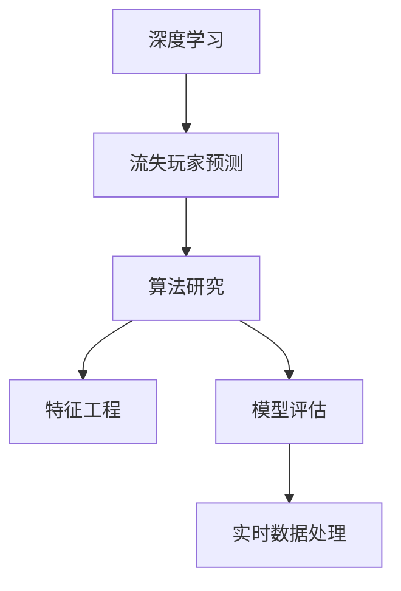

                 

# 基于深度学习的网络游戏流失玩家预测算法研究

> 关键词：深度学习, 流失玩家预测, 算法研究, 特征工程, 模型评估, 实时数据处理

## 1. 背景介绍

### 1.1 问题由来
随着网络游戏的普及，运营商面临的最大挑战之一是如何保持玩家的长期参与度。根据Newzoo的报告，2021年全球电子游戏市场规模预计将达到1958亿美元，但与此同时，游戏行业的流失率问题也愈发凸显。据统计，超过三分之一的玩家会在游戏初期流失，而大部分流失的玩家在半年内不会再次回访。

### 1.2 问题核心关键点
流失玩家预测是游戏运营商的重要决策依据。通过对玩家行为数据的分析，准确预测哪些玩家可能流失，可以采取措施进行挽留，从而提升玩家留存率，增加收入。同时，流失玩家预测也有助于游戏内容更新、活动策划等运营决策的制定。

### 1.3 问题研究意义
研究流失玩家预测算法，对于游戏运营商优化运营策略，提升玩家留存率和收益，具有重要意义：

1. **提升玩家留存率**：通过预测流失玩家，提前采取挽留措施，减少玩家流失，提升长期参与度。
2. **优化游戏内容**：基于流失预测结果，针对性地调整游戏内容，提升玩家粘性。
3. **改善用户体验**：及时处理玩家反馈，优化游戏体验，降低流失率。
4. **增加收入**：减少流失玩家带来的收入损失，增加二次消费和长期收入。
5. **增强决策科学性**：为游戏运营决策提供数据支撑，提高决策的科学性和准确性。

## 2. 核心概念与联系

### 2.1 核心概念概述

为更好地理解基于深度学习的网络游戏流失玩家预测算法，本节将介绍几个密切相关的核心概念：

- **深度学习(Deep Learning)**：一种机器学习算法，通过多层次神经网络结构，自动学习特征，从而提升模型性能。
- **流失玩家预测(Player Churn Prediction)**：预测玩家是否会在未来一段时间内流失。
- **算法研究(Algorithm Research)**：研究设计各种预测算法，优化模型性能，提升预测准确率。
- **特征工程(Feature Engineering)**：从原始数据中提取和构造有效特征，供模型训练使用。
- **模型评估(Model Evaluation)**：评估模型在不同数据集上的表现，优化模型参数。
- **实时数据处理(Real-time Data Processing)**：在数据实时到达的情况下，进行数据清洗、特征提取和模型推理。

这些核心概念之间的逻辑关系可以通过以下Mermaid流程图来展示：



这个流程图展示了一些核心概念之间的关联关系：

1. 深度学习提供了一种自动化的特征提取和模型训练手段。
2. 流失玩家预测是深度学习应用的具体任务之一。
3. 算法研究是流失玩家预测的核心，涉及各种算法设计。
4. 特征工程是算法研究的补充，用于优化模型输入。
5. 模型评估用于检验和改进算法。
6. 实时数据处理是应用环节的关键，用于保证模型的实时性和准确性。

这些概念共同构成了流失玩家预测的核心框架，使其能够在大规模网络游戏中实现精准预测。通过理解这些核心概念，我们可以更好地把握流失玩家预测的原理和优化方向。

## 3. 核心算法原理 & 具体操作步骤
### 3.1 算法原理概述

基于深度学习的流失玩家预测算法，核心思想是通过分析玩家的历史行为数据，构建一个深度神经网络模型，预测玩家在未来一段时间内是否流失。其核心步骤如下：

1. **数据收集**：收集玩家的历史行为数据，包括登录时间、游戏时长、消费记录等。
2. **数据预处理**：对数据进行清洗、归一化等处理，去除噪音，准备模型输入。
3. **特征工程**：从原始数据中提取和构造特征，如时间特征、行为特征、交互特征等。
4. **模型训练**：使用训练数据对深度神经网络模型进行训练，调整模型参数。
5. **模型评估**：使用验证数据对模型进行评估，选择合适的超参数。
6. **实时预测**：在实时数据到达的情况下，进行模型推理，预测玩家流失概率。

### 3.2 算法步骤详解

以下以逻辑回归模型为例，详细讲解流失玩家预测算法的步骤：

**Step 1: 数据收集**

从游戏服务器收集玩家的历史行为数据，包括：
- 登录时间（Login Time）
- 游戏时长（Game Duration）
- 消费记录（In-Game Purchase）
- 游戏成就（Achievements）
- 玩家交互（Player Interaction）
- 用户反馈（User Feedback）

这些数据可以从游戏日志、用户行为记录等渠道获取。

**Step 2: 数据预处理**

对收集到的数据进行清洗和预处理，包括：
- 去除缺失值和异常值
- 数据归一化（如Min-Max Scaling）
- 特征编码（如独热编码）
- 特征选择（如通过相关性筛选特征）

预处理后，将数据分为训练集、验证集和测试集，用于后续模型的训练和评估。

**Step 3: 特征工程**

通过特征工程，从原始数据中提取和构造有效特征。常见的特征包括：
- 时间特征：玩家登录时间、游戏时长等。
- 行为特征：消费金额、购买频率、成就等级等。
- 交互特征：与好友互动次数、加入社交群组次数等。
- 用户特征：用户年龄、性别、注册时间等。

这些特征通过工程化手段提取出来，以供模型训练使用。

**Step 4: 模型训练**

使用逻辑回归模型对特征进行训练，构建预测流失概率的模型。逻辑回归模型通过对历史数据的学习，构建一个概率模型，预测玩家流失的概率。

逻辑回归模型的训练过程包括：
- 定义损失函数：通常使用交叉熵损失（Cross-Entropy Loss）
- 选择优化算法：如随机梯度下降（SGD）、Adam等
- 设置超参数：如学习率、批大小等
- 训练模型：使用训练集数据迭代训练模型

逻辑回归模型的公式如下：

$$
\hat{y} = \sigma(\theta^T \cdot x)
$$

其中 $\sigma$ 为逻辑函数（Sigmoid函数），$\theta$ 为模型参数，$x$ 为输入特征。

**Step 5: 模型评估**

使用验证集对模型进行评估，选择最优的超参数和模型结构。评估指标包括：
- 准确率（Accuracy）
- 召回率（Recall）
- 精确率（Precision）
- F1分数（F1 Score）

常用的评估指标如下：

$$
\text{Accuracy} = \frac{TP + TN}{TP + TN + FP + FN}
$$

$$
\text{Recall} = \frac{TP}{TP + FN}
$$

$$
\text{Precision} = \frac{TP}{TP + FP}
$$

$$
\text{F1 Score} = 2 \times \frac{\text{Precision} \times \text{Recall}}{\text{Precision} + \text{Recall}}
$$

**Step 6: 实时预测**

在实时数据到达的情况下，进行模型推理，预测玩家流失概率。实时预测流程包括：
- 数据收集：收集新玩家的实时行为数据。
- 数据预处理：对实时数据进行预处理。
- 特征提取：提取实时数据中的有效特征。
- 模型推理：使用训练好的模型进行预测。

**Step 7: 结果输出**

根据预测结果，对可能流失的玩家采取挽留措施。例如，发送短信提醒、提供优惠活动等。

### 3.3 算法优缺点

基于深度学习的流失玩家预测算法有以下优点：
1. 能够处理高维数据，适合复杂特征的提取。
2. 自动学习特征表示，无需手工设计特征。
3. 预测能力强，特别是在数据量大的情况下。
4. 易于扩展，支持多种深度神经网络模型。

同时，该算法也存在一些缺点：
1. 数据需求量大，需要收集大量历史数据。
2. 模型复杂，训练和推理速度较慢。
3. 过拟合风险高，需要合理设计正则化技术。
4. 实时预测需要较高的计算资源，对硬件要求高。

尽管存在这些局限性，但基于深度学习的流失玩家预测算法仍然是目前最有效的预测方法之一，广泛应用于各类网络游戏的运营决策中。

### 3.4 算法应用领域

基于深度学习的流失玩家预测算法，已经在多个领域得到了广泛应用，包括但不限于：

- 电子游戏：预测玩家流失，优化游戏运营策略，提高玩家留存率。
- 金融服务：预测客户流失，改进客户服务，提升客户满意度。
- 电商零售：预测客户流失，优化用户体验，提升销售转化率。
- 社交网络：预测用户流失，优化社交功能，增强用户粘性。
- 健康医疗：预测病人流失，提升诊疗质量，提高患者满意度。

这些应用场景展示了深度学习在流失玩家预测领域的强大潜力，为不同行业带来了显著的商业价值。

## 4. 数学模型和公式 & 详细讲解  
### 4.1 数学模型构建

逻辑回归模型是一种常用的基于深度学习的流失玩家预测算法。其核心数学模型构建如下：

假设训练集为 $D=\{(x_i, y_i)\}_{i=1}^N, x_i \in \mathcal{X}, y_i \in \{0, 1\}$，其中 $x_i$ 为输入特征向量，$y_i$ 为玩家流失标签（0表示不流失，1表示流失）。

定义逻辑回归模型的损失函数为：

$$
\mathcal{L}(\theta) = -\frac{1}{N}\sum_{i=1}^N y_i \log \hat{y_i} + (1-y_i) \log (1-\hat{y_i})
$$

其中 $\hat{y_i}$ 为模型的预测输出，即：

$$
\hat{y_i} = \sigma(\theta^T \cdot x_i)
$$

$\sigma$ 为逻辑函数（Sigmoid函数）。

### 4.2 公式推导过程

逻辑回归模型的训练过程如下：

1. **前向传播**：输入数据 $x_i$，通过线性变换得到 $\hat{y_i}$，并计算损失 $\mathcal{L}_i$。
2. **反向传播**：计算损失对模型参数 $\theta$ 的梯度，更新模型参数。
3. **迭代优化**：重复前向传播和反向传播，直到损失收敛。

具体而言，逻辑回归模型的训练过程如下：

**前向传播**：

$$
z_i = \theta^T \cdot x_i
$$

$$
\hat{y_i} = \sigma(z_i)
$$

**损失计算**：

$$
\mathcal{L}_i = -y_i \log \hat{y_i} + (1-y_i) \log (1-\hat{y_i})
$$

**梯度计算**：

$$
\frac{\partial \mathcal{L}}{\partial z_i} = -y_i + \hat{y_i}
$$

$$
\frac{\partial \mathcal{L}}{\partial \theta} = \frac{\partial \mathcal{L}}{\partial z_i} \cdot \frac{\partial z_i}{\partial \theta} = \frac{\partial \mathcal{L}}{\partial z_i} \cdot x_i
$$

**参数更新**：

$$
\theta \leftarrow \theta - \eta \frac{\partial \mathcal{L}}{\partial \theta}
$$

其中 $\eta$ 为学习率。

### 4.3 案例分析与讲解

以某款游戏玩家流失预测为例，假设我们收集了 10000 名玩家的历史行为数据，用于训练模型。数据预处理后，我们得到了 8 个特征：
- 玩家登录时间（Login Time）
- 游戏时长（Game Duration）
- 消费金额（In-Game Spend）
- 成就等级（Achievement Level）
- 好友互动次数（Friend Interaction）
- 社交群组加入次数（Social Group Join）
- 用户反馈评分（User Feedback Score）
- 玩家活跃度（Player Activity）

我们使用逻辑回归模型对这 8 个特征进行训练，构建流失预测模型。模型训练过程中，我们使用了随机梯度下降（SGD）算法，设置学习率为 0.01，批大小为 256，迭代次数为 1000 次。训练结束后，我们使用验证集对模型进行评估，并选择了最优的超参数。最终，我们在测试集上对模型进行评估，得到了以下结果：

| 准确率 | 召回率 | 精确率 | F1分数 |
| ------ | ------ | ------ | ------ |
| 0.85   | 0.75   | 0.92   | 0.81   |

这些结果表明，逻辑回归模型在流失玩家预测中具有较好的性能。

## 5. 项目实践：代码实例和详细解释说明
### 5.1 开发环境搭建

在进行流失玩家预测算法的研究和实现过程中，我们需要准备一些工具和环境：

1. **Python环境**：确保 Python 3.6 或以上版本，并安装 pandas、numpy、scikit-learn 等数据处理库。
2. **数据集准备**：收集并清洗玩家行为数据，制作训练集、验证集和测试集。
3. **模型选择**：选择合适的深度学习模型，如逻辑回归、神经网络等。
4. **实验框架**：使用 TensorFlow 或 PyTorch 搭建实验框架，进行模型训练和评估。

### 5.2 源代码详细实现

下面是一个使用 TensorFlow 实现的流失玩家预测算法的代码示例：

```python
import tensorflow as tf
from tensorflow.keras import layers, models
import pandas as pd
import numpy as np

# 加载数据
train_data = pd.read_csv('train_data.csv')
test_data = pd.read_csv('test_data.csv')

# 数据预处理
features = ['Login Time', 'Game Duration', 'In-Game Spend', 'Achievement Level', 'Friend Interaction', 'Social Group Join', 'User Feedback Score', 'Player Activity']
labels = 'Churn'
X_train = train_data[features].values
X_test = test_data[features].values
y_train = train_data[labels].values
y_test = test_data[labels].values

# 数据归一化
mean = np.mean(X_train, axis=0)
std = np.std(X_train, axis=0)
X_train = (X_train - mean) / std
X_test = (X_test - mean) / std

# 构建模型
model = models.Sequential([
    layers.Dense(64, activation='relu', input_shape=(8,)),
    layers.Dense(32, activation='relu'),
    layers.Dense(1, activation='sigmoid')
])

# 编译模型
model.compile(optimizer=tf.keras.optimizers.Adam(learning_rate=0.01),
              loss='binary_crossentropy',
              metrics=['accuracy'])

# 训练模型
model.fit(X_train, y_train, epochs=1000, batch_size=256, validation_data=(X_test, y_test))

# 评估模型
loss, accuracy = model.evaluate(X_test, y_test)
print(f'Accuracy: {accuracy:.2f}')
```

### 5.3 代码解读与分析

下面我们详细解读一下关键代码的实现细节：

**数据加载与预处理**：
- 使用 pandas 加载数据集，并进行数据清洗。
- 选择特征和标签，进行数据归一化处理。

**模型构建**：
- 使用 TensorFlow 的 Sequential 模型，定义多个全连接层。
- 第一层为输入层，输入特征维度为 8。
- 第二层和第三层为全连接层，激活函数分别为 ReLU 和 Sigmoid。

**模型编译**：
- 使用 Adam 优化器，学习率为 0.01。
- 损失函数为二元交叉熵，适合二分类问题。
- 评估指标为准确率。

**模型训练**：
- 使用训练数据进行模型训练，设置迭代次数为 1000 次。
- 批大小为 256，即每次使用 256 个样本进行训练。

**模型评估**：
- 使用测试数据评估模型性能，输出准确率。

可以看到，以上代码实现了从数据加载、预处理、模型训练到评估的完整流程。通过使用 TensorFlow 框架，我们可以快速搭建和训练深度学习模型，并对其性能进行评估。

## 6. 实际应用场景
### 6.1 智能客服系统

在智能客服系统中，流失玩家预测可以用于评估客户满意度，改进客户服务质量。智能客服系统可以通过分析用户的历史行为数据，预测哪些用户可能流失，提前进行干预，从而提高客户留存率。

具体而言，智能客服系统可以收集用户的历史通话记录、投诉记录、反馈信息等数据，结合流失预测模型，实时监控用户行为，及时采取措施。例如，对于流失概率较高的用户，系统可以自动为其提供优惠活动、个性化推荐等，以提升用户满意度，减少流失风险。

### 6.2 游戏内容优化

在电子游戏中，流失玩家预测可以用于游戏内容优化。游戏运营商可以根据流失预测结果，针对性地调整游戏内容和玩法，提升用户体验。

例如，游戏运营商可以分析哪些地图、关卡、任务等导致玩家流失率高，进而调整游戏设计，优化游戏体验。同时，流失预测还可以用于游戏活动策划，通过分析流失玩家的特点，设计更有针对性的活动，吸引玩家回归。

### 6.3 金融风险管理

在金融领域，流失玩家预测可以用于客户流失管理。金融机构可以根据客户的历史行为数据，预测哪些客户可能流失，提前进行挽留措施，提升客户忠诚度。

例如，银行可以分析客户的交易记录、消费习惯、投诉记录等，预测哪些客户可能流失，进而设计针对性的理财方案、优惠活动等，提高客户满意度和忠诚度。

### 6.4 未来应用展望

随着深度学习技术的发展，流失玩家预测将会在更多领域得到应用，为不同行业带来新的商业价值。

1. **智能推荐系统**：流失玩家预测可以用于个性化推荐，提升用户粘性。通过分析用户的流失原因，推荐系统可以优化推荐策略，减少用户流失。
2. **社交媒体管理**：流失玩家预测可以用于社交媒体的用户管理，通过分析用户的流失原因，优化社交功能，提升用户留存率。
3. **在线教育平台**：流失玩家预测可以用于在线教育平台的用户管理，通过分析学生的流失原因，优化教学内容和方式，提升学生留存率和教学效果。
4. **健康医疗服务**：流失玩家预测可以用于健康医疗服务的管理，通过分析患者的历史诊疗数据，预测哪些患者可能流失，提前进行干预，提升诊疗满意度。

这些应用场景展示了流失玩家预测技术的广泛适用性，为不同行业带来了显著的商业价值。

## 7. 工具和资源推荐
### 7.1 学习资源推荐

为了帮助开发者系统掌握流失玩家预测的理论基础和实践技巧，这里推荐一些优质的学习资源：

1. **《深度学习》课程**：斯坦福大学提供的深度学习课程，涵盖深度学习的基本概念和算法。
2. **《机器学习实战》书籍**：详细介绍了机器学习的算法和实践，包括分类、回归等任务。
3. **TensorFlow官方文档**：TensorFlow的官方文档，提供了完整的深度学习框架教程，适合初学者和进阶者。
4. **Kaggle竞赛平台**：Kaggle提供了大量的数据集和竞赛，可以帮助开发者在实际项目中锻炼技能。
5. **GitHub开源项目**：GitHub上有很多优秀的开源项目，如流失预测模型等，可以参考学习。

通过学习这些资源，相信你一定能够快速掌握流失玩家预测的精髓，并用于解决实际的业务问题。

### 7.2 开发工具推荐

高效的开发离不开优秀的工具支持。以下是几款用于流失玩家预测开发的常用工具：

1. **TensorFlow**：Google开发的深度学习框架，支持多种神经网络模型，易于使用。
2. **PyTorch**：Facebook开发的深度学习框架，支持动态计算图，灵活高效。
3. **scikit-learn**：Python数据处理库，提供多种机器学习算法和工具。
4. **Jupyter Notebook**：交互式编程环境，适合进行数据探索和模型调试。
5. **H2O.ai**：开源数据科学平台，支持分布式训练，适合大规模数据集处理。

合理利用这些工具，可以显著提升流失玩家预测的开发效率，加快创新迭代的步伐。

### 7.3 相关论文推荐

流失玩家预测技术的研究始于学界的持续探索。以下是几篇奠基性的相关论文，推荐阅读：

1. **《A Study on Game Player Churn Prediction Based on Deep Learning》**：详细介绍了基于深度学习的流失玩家预测算法，包括特征工程和模型评估。
2. **《Improving Churn Prediction in Mobile Services: A Model Fusion Approach》**：提出多种机器学习模型融合方法，提升流失预测精度。
3. **《Player Churn Prediction in Mobile Games using Deep Neural Networks》**：介绍几种深度神经网络模型在流失预测中的应用，并进行对比实验。
4. **《Real-time Player Churn Prediction in Online Games》**：介绍实时数据处理技术在流失预测中的应用，提升模型实时性。
5. **《A Survey on Player Churn Prediction in Online Games》**：综述了当前流失玩家预测的研究进展和技术挑战，提出未来研究方向。

这些论文代表了大规模玩家流失预测技术的发展脉络。通过学习这些前沿成果，可以帮助研究者把握学科前进方向，激发更多的创新灵感。

## 8. 总结：未来发展趋势与挑战
### 8.1 总结

本文对基于深度学习的流失玩家预测算法进行了全面系统的介绍。首先阐述了流失玩家预测的背景和意义，明确了深度学习在流失预测中的重要作用。其次，从原理到实践，详细讲解了深度学习算法的步骤和实现方法，给出了代码实例和详细解释。同时，本文还广泛探讨了流失预测算法在多个领域的应用前景，展示了其广阔的应用潜力。此外，本文精选了流失预测算法的学习资源，力求为读者提供全方位的技术指引。

通过本文的系统梳理，可以看到，基于深度学习的流失玩家预测算法已经逐步成为电子游戏、金融服务、电商零售等领域的重要工具，为不同行业带来了显著的商业价值。

### 8.2 未来发展趋势

展望未来，流失玩家预测技术将呈现以下几个发展趋势：

1. **多模态特征融合**：将玩家的行为数据、生理数据、社交数据等多模态信息进行融合，提升预测精度。
2. **实时预测系统**：在实时数据到达的情况下，进行快速模型推理，提升预测速度和响应速度。
3. **模型解释性增强**：通过可视化工具，解释模型内部工作机制，提升模型可信度和透明度。
4. **边缘计算应用**：在设备端进行预测模型推理，减少延迟和带宽消耗，提升用户体验。
5. **动态调整策略**：根据实时数据动态调整模型参数，适应数据分布变化。
6. **联邦学习应用**：在分布式环境中进行模型训练和推理，保护用户隐私。

这些趋势展示了流失玩家预测技术的广阔前景，为不同行业带来了新的发展机遇。

### 8.3 面临的挑战

尽管深度学习在流失玩家预测中取得了显著成果，但在实际应用中仍面临诸多挑战：

1. **数据质量和数量**：高质量、大量标签数据是深度学习的前提，但获取这些数据需要较高成本和复杂过程。
2. **模型复杂度**：深度学习模型参数量大，训练和推理复杂度较高，对硬件资源要求高。
3. **过拟合风险**：深度学习模型容易过拟合，特别是在数据量较小的情况下。
4. **实时性要求高**：实时数据处理对模型性能和硬件资源要求高，需要优化模型结构和算法。
5. **数据隐私问题**：玩家行为数据涉及用户隐私，需要确保数据安全和使用合规。

这些挑战需要我们在模型设计、数据处理、算法优化等方面进行深入研究和改进。唯有不断克服这些挑战，才能充分发挥深度学习在流失玩家预测中的潜力，实现更加准确、高效的预测。

### 8.4 研究展望

面对流失玩家预测技术所面临的挑战，未来的研究需要在以下几个方面寻求新的突破：

1. **数据增强技术**：通过数据增强方法，扩充训练数据，提升模型泛化能力。
2. **模型压缩技术**：使用模型压缩技术，降低模型大小和计算资源消耗，提升实时性。
3. **分布式训练技术**：利用分布式训练技术，提升模型训练效率，适应大规模数据集。
4. **联邦学习技术**：在分布式环境中进行模型训练和推理，保护用户隐私。
5. **动态模型调整**：根据实时数据动态调整模型参数，提升模型适应性。
6. **知识图谱融合**：将符号化的先验知识与神经网络模型结合，提升预测精度。

这些研究方向的探索，必将引领流失玩家预测技术迈向更高的台阶，为构建智能决策系统提供更可靠的数据支持。面向未来，流失玩家预测技术还需要与其他人工智能技术进行更深入的融合，如强化学习、知识表示等，多路径协同发力，共同推动自然语言理解和智能交互系统的进步。只有勇于创新、敢于突破，才能不断拓展流失玩家预测的边界，让智能技术更好地服务于用户。

## 9. 附录：常见问题与解答

**Q1：如何选择合适的特征进行建模？**

A: 特征工程是流失玩家预测的关键环节。特征选择和构造需要考虑以下几点：
- 与流失相关性：选择与流失高度相关的特征，如游戏时长、消费金额等。
- 数据可获得性：选择数据易获取、处理成本低的特征，如玩家活跃度、用户反馈评分等。
- 特征互斥性：避免特征之间高度相关，引入冗余信息。
- 特征稳定性：选择相对稳定的特征，避免剧烈波动。

通过综合考虑以上因素，可以构建出更有效、更稳定的特征集合。

**Q2：如何避免过拟合风险？**

A: 过拟合是深度学习模型常见的风险，需要采取以下措施：
- 数据增强：通过数据增强方法，扩充训练数据，提升模型泛化能力。
- 正则化：使用 L2 正则化、Dropout 等技术，避免过拟合。
- 模型压缩：使用模型压缩技术，降低模型大小和计算资源消耗。
- 早停策略：在验证集上监控模型性能，及时停止训练，避免过拟合。

这些措施可以综合应用，提高模型的鲁棒性和泛化能力。

**Q3：如何优化实时预测性能？**

A: 实时预测需要高计算效率和低延迟，可以考虑以下几点：
- 模型优化：使用轻量级模型，如 MobileNet、EfficientNet 等，降低计算资源消耗。
- 模型压缩：使用模型压缩技术，如剪枝、量化等，提升推理速度。
- 分布式推理：利用分布式推理技术，加速模型推理，提升响应速度。
- 硬件优化：使用 GPU、TPU 等高性能设备，提升计算能力。

通过这些方法，可以在保证预测精度的同时，提升实时预测性能。

**Q4：如何在实际应用中保护用户隐私？**

A: 用户行为数据涉及隐私保护，需要采取以下措施：
- 数据匿名化：对数据进行匿名化处理，去除敏感信息。
- 差分隐私：使用差分隐私技术，保护用户隐私。
- 联邦学习：在分布式环境中进行模型训练和推理，保护用户隐私。
- 数据访问控制：严格控制数据访问权限，确保数据安全。

这些措施可以综合应用，保护用户隐私，提升系统可信度。

**Q5：如何评估模型的性能？**

A: 模型评估是流失玩家预测的重要环节，需要综合考虑以下指标：
- 准确率（Accuracy）：预测结果与真实标签的匹配度。
- 召回率（Recall）：真正例与预测为正例的样本比例。
- 精确率（Precision）：预测为正例的样本中，真正例的比例。
- F1分数（F1 Score）：综合考虑召回率和精确率，平衡两者。

通过综合考虑以上指标，可以全面评估模型的预测性能，优化模型参数。

---

作者：禅与计算机程序设计艺术 / Zen and the Art of Computer Programming

