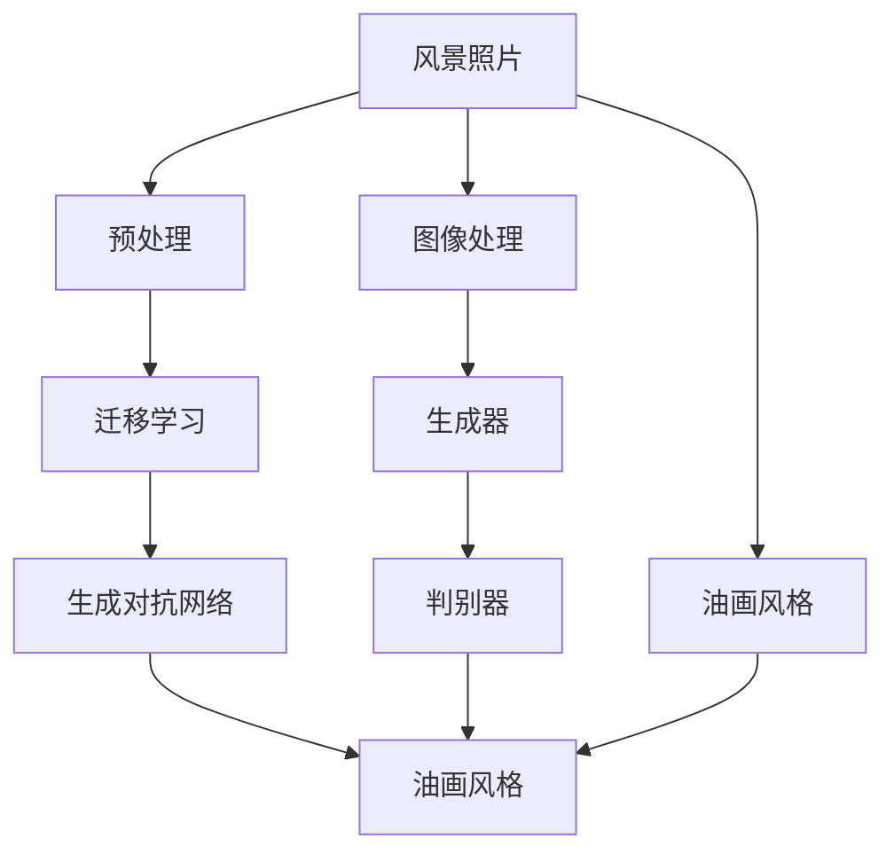

                 

# 基于生成对抗网络的风景照片转换为油画风格的研究

> 关键词：生成对抗网络,风景照片,油画风格,迁移学习,计算机视觉,图像处理,艺术风格转换

## 1. 背景介绍

### 1.1 问题由来
随着计算机视觉和深度学习技术的不断发展，图像风格转换已成为计算机视觉领域的一个重要研究方向。它旨在将输入图像转换成另一幅具有特定风格的图像，这在艺术创作、图像处理、内容保护等领域具有广泛的应用前景。其中，风景照片转换为油画风格是一个极具艺术性和挑战性的子任务。传统的风格转换方法通常基于手工设计的特征提取器和损失函数，存在参数多、计算复杂、可解释性差等缺点。而基于生成对抗网络(GAN)的方法则通过生成器和判别器之间的对抗训练，获得了更灵活、高效、可解释的风格转换能力，逐渐成为主流。

### 1.2 问题核心关键点
本文聚焦于基于生成对抗网络(GAN)的风景照片转换为油画风格的研究。具体而言，我们希望通过训练一个生成对抗网络模型，将输入的风景照片转换成具有油画风格的图像。这一过程可以分解为以下核心关键点：

- 图像风格转换：通过训练生成器，将输入的风景照片转换成具有特定风格的图像。
- 迁移学习：利用预训练模型加快风格转换模型的训练，提高模型性能和泛化能力。
- 对抗训练：通过对抗生成器和判别器，增强模型的鲁棒性和稳定性。
- 油画风格：定义油画风格的特征，并将其编码到生成器的输出中。

这些关键点共同构成了风景照片转换为油画风格的技术框架，通过优化和创新，我们可以实现高质量的风格转换效果。

### 1.3 问题研究意义
研究风景照片转换为油画风格具有重要的理论和实际意义：

1. **艺术创作**：为艺术家提供了一个新的创作工具，将现实世界的风景照片转化为具有独特油画风格的艺术品，丰富了艺术创作的表达方式。
2. **图像处理**：在图像处理领域，风景照片转换为油画风格可以应用于内容保护、版权标识等场景，提升图像处理的智能化水平。
3. **内容保护**：通过将原始风景照片转换为油画风格的副本，可以隐藏原始图像的重要信息，保护隐私和版权。
4. **娱乐与教育**：在娱乐和教育领域，风景照片转换为油画风格可以用于游戏、动画、教育软件等，增强用户体验和教育效果。

总之，风景照片转换为油画风格的研究不仅具有理论价值，还能在实际应用中发挥重要作用，为计算机视觉和艺术创作领域带来新的突破。

## 2. 核心概念与联系

### 2.1 核心概念概述

为了更好地理解基于生成对抗网络的风景照片转换为油画风格的技术，本节将介绍几个关键概念及其联系：

- **生成对抗网络(GAN)**：一种由生成器(Generator)和判别器(Discriminator)构成的对抗训练框架，通过优化两个神经网络，实现高质量的图像生成或风格转换。
- **风景照片**：作为输入的图像数据，通常包含自然景观的丰富细节和色彩。
- **油画风格**：一种独特的艺术风格，其特点是色彩饱满、笔触厚重、细节丰富，常用于传统艺术创作中。
- **迁移学习**：通过预训练模型作为初始化权重，加速模型的训练过程，提高模型的泛化能力。
- **计算机视觉**：涉及图像处理、目标检测、物体识别等技术，是风景照片转换为油画风格的重要工具。
- **图像处理**：包括图像增强、滤波、分割、特征提取等技术，是风格转换的重要环节。

这些概念之间的逻辑关系可以通过以下Mermaid流程图来展示：



这个流程图展示了风景照片转换为油画风格的核心概念及其之间的关系：

1. 风景照片经过预处理和迁移学习，获得初始化权重。
2. 迁移学习后的图像作为生成器的输入，生成器输出具有油画风格的图像。
3. 生成器输出的图像输入判别器，判别器判断图像的真实性和风格性。
4. 生成器和判别器之间通过对抗训练不断优化，提高生成器的生成能力和判别器的判别能力。
5. 最终输出的图像具有油画风格，满足艺术创作和实际应用的需求。

## 3. 核心算法原理 & 具体操作步骤
### 3.1 算法原理概述

基于生成对抗网络的风景照片转换为油画风格，主要依赖于生成器和判别器的对抗训练机制。其核心思想是：通过生成器和判别器之间的博弈，不断优化生成器的生成能力和判别器的判别能力，从而实现高质量的图像风格转换。

具体而言，生成器接收输入的风景照片，并将其转换成具有油画风格的图像。判别器则接收生成器输出的图像，判断其是否为真实油画，即判断图像是否具有油画风格。生成器和判别器通过对抗训练不断优化，最终使得生成器生成的图像逼近真实油画，判别器无法准确区分真实和生成的图像。

### 3.2 算法步骤详解

基于生成对抗网络的风景照片转换为油画风格的具体步骤如下：

**Step 1: 准备数据集**

- 收集大量风景照片作为训练数据集，并将其与油画风格的图像进行一一对应。
- 对数据集进行预处理，如调整大小、归一化、裁剪等。
- 对数据集进行标注，如分类标签、边界框等。

**Step 2: 定义生成器和判别器**

- 生成器：使用卷积神经网络(CNN)结构，接收风景照片作为输入，输出具有油画风格的图像。
- 判别器：使用卷积神经网络(CNN)结构，接收图像作为输入，输出是否为真实油画。

**Step 3: 设计损失函数**

- 生成器的损失函数包括重构损失和对抗损失。重构损失衡量生成器输出与原始风景照片的相似度，对抗损失衡量生成器输出的图像在判别器上的表现。
- 判别器的损失函数包括真实图像损失和假图像损失。真实图像损失衡量判别器对真实油画的判别准确度，假图像损失衡量判别器对生成器输出的图像的判别准确度。

**Step 4: 对抗训练**

- 在每个训练迭代中，生成器生成假图像，判别器对真实和假图像进行判别。
- 生成器根据判别器的反馈，更新模型参数以优化生成图像的质量。
- 判别器根据生成器的输出，更新模型参数以提高判别准确度。

**Step 5: 模型评估与输出**

- 在训练过程中，周期性地在测试集上评估模型性能。
- 对生成器输出的图像进行后处理，如调整色彩、增强细节等，得到最终的油画风格的图像。

### 3.3 算法优缺点

基于生成对抗网络的风景照片转换为油画风格的方法具有以下优点：

1. 风格转换效果显著。由于生成器和判别器之间的对抗训练，生成器可以生成高逼真度的油画风格图像，满足艺术创作和实际应用的需求。
2. 灵活性高。通过修改生成器和判别器的结构和损失函数，可以应用于各种风格的转换，如水彩、素描、卡通等。
3. 可解释性强。生成对抗网络的结构直观，通过可视化生成器和判别器的训练过程，可以直观理解模型的学习过程和效果。

同时，该方法也存在一些局限性：

1. 训练难度大。生成对抗网络的对抗训练过程复杂，需要大量训练数据和计算资源。
2. 训练过程不稳定。生成器生成的图像可能存在模糊、失真等问题，判别器的判别能力需要不断优化。
3. 生成图像的质量受限于训练数据。训练数据集的选择和标注直接影响生成图像的质量。
4. 风格转换的泛化能力有限。对于特定风格的转换效果较好，但对于新风格或艺术家的作品，转换效果可能不佳。

尽管存在这些局限性，但基于生成对抗网络的风格转换方法在艺术创作、图像处理、娱乐与教育等领域仍具有重要应用价值。

### 3.4 算法应用领域

基于生成对抗网络的风景照片转换为油画风格，已在多个领域得到应用，包括但不限于：

- 艺术创作：艺术家可以利用该技术生成具有独特油画风格的艺术品，拓展创作思路。
- 图像处理：在图像处理领域，该技术可以用于图像增强、图像修复、图像生成等，提升图像处理的智能化水平。
- 内容保护：将原始风景照片转换为油画风格的副本，可以用于内容保护，隐藏原始图像的重要信息。
- 娱乐与教育：在娱乐和教育领域，该技术可以用于游戏、动画、教育软件等，增强用户体验和教育效果。

## 4. 数学模型和公式 & 详细讲解 & 举例说明

### 4.1 数学模型构建

基于生成对抗网络的风景照片转换为油画风格，可以通过数学模型进行严格的定义。假设输入的风景照片为 $x \in \mathbb{R}^d$，输出为具有油画风格的图像 $y \in \mathbb{R}^d$，则可以将问题建模为优化问题：

$$
\min_{G} \max_{D} \mathcal{L}(G, D, x, y)
$$

其中，$G$ 为生成器，$D$ 为判别器，$x$ 为输入风景照片，$y$ 为输出油画风格的图像。

生成器的损失函数 $\mathcal{L}_G$ 包括重构损失和对抗损失，分别为：

$$
\mathcal{L}_G = \lambda_1 \mathcal{L}_{rec} + \lambda_2 \mathcal{L}_{adv}
$$

其中，$\lambda_1$ 和 $\lambda_2$ 为权重系数。重构损失 $\mathcal{L}_{rec}$ 衡量生成器输出的图像与原始风景照片的相似度，可以采用均方误差或感知损失等形式：

$$
\mathcal{L}_{rec} = \frac{1}{2} \|G(x) - x\|^2
$$

对抗损失 $\mathcal{L}_{adv}$ 衡量生成器输出的图像在判别器上的表现，可以采用对抗损失函数等形式：

$$
\mathcal{L}_{adv} = \mathbb{E}_{x} [\log D(x)] + \mathbb{E}_{z} [\log (1 - D(G(z)))]
$$

判别器的损失函数 $\mathcal{L}_D$ 包括真实图像损失和假图像损失，分别为：

$$
\mathcal{L}_D = \mathbb{E}_{x} [\log D(x)] + \mathbb{E}_{z} [\log (1 - D(G(z)))]
$$

其中，$z$ 为生成器输入的噪声向量。

### 4.2 公式推导过程

以下我们将对生成器和判别器的损失函数进行详细推导，以理解其数学含义和优化目标。

**生成器的损失函数推导**

生成器的目标是最小化重构损失和对抗损失，可以表示为：

$$
\mathcal{L}_G = \mathbb{E}_{x} [\log D(G(x))] + \mathbb{E}_{z} [\log (1 - D(G(z)))]
$$

其中，$\mathbb{E}_{x}$ 表示对真实数据 $x$ 的期望，$\mathbb{E}_{z}$ 表示对生成器输入噪声 $z$ 的期望。

为了最小化重构损失，生成器需要生成逼真的图像 $G(x)$，使得 $G(x)$ 与 $x$ 相似。这可以通过均方误差或感知损失等形式来实现：

$$
\mathcal{L}_{rec} = \frac{1}{2} \|G(x) - x\|^2
$$

为了最小化对抗损失，生成器需要生成能够欺骗判别器的图像 $G(z)$，使得判别器无法区分真实图像和生成图像。这可以通过对抗损失函数等形式来实现：

$$
\mathcal{L}_{adv} = \mathbb{E}_{x} [\log D(G(x))] + \mathbb{E}_{z} [\log (1 - D(G(z)))]
$$

**判别器的损失函数推导**

判别器的目标是最小化真实图像损失和假图像损失，可以表示为：

$$
\mathcal{L}_D = \mathbb{E}_{x} [\log D(x)] + \mathbb{E}_{z} [\log (1 - D(G(z)))]
$$

其中，$\mathbb{E}_{x}$ 表示对真实数据 $x$ 的期望，$\mathbb{E}_{z}$ 表示对生成器输入噪声 $z$ 的期望。

为了最小化真实图像损失，判别器需要尽可能准确地判别真实图像，即对真实图像 $x$ 的判别准确度。这可以通过均方误差或感知损失等形式来实现：

$$
\mathcal{L}_{real} = \mathbb{E}_{x} [\log D(x)]
$$

为了最小化假图像损失，判别器需要尽可能准确地判别生成图像，即对生成图像 $G(z)$ 的判别准确度。这可以通过均方误差或感知损失等形式来实现：

$$
\mathcal{L}_{fake} = \mathbb{E}_{z} [\log (1 - D(G(z)))]
$$

### 4.3 案例分析与讲解

我们以一幅风景照片转换为油画风格为例，详细讲解其数学模型和优化过程。

假设输入的风景照片为 $x \in \mathbb{R}^{3 \times 768}$，输出为具有油画风格的图像 $y \in \mathbb{R}^{3 \times 768}$。生成器和判别器的结构如下：

- 生成器 $G$：采用 ResNet 结构，包含多个卷积层和批归一化层。
- 判别器 $D$：采用 ResNet 结构，包含多个卷积层和批归一化层。

**损失函数设定**

- 生成器的损失函数包括重构损失和对抗损失，分别为：

$$
\mathcal{L}_G = \lambda_1 \mathcal{L}_{rec} + \lambda_2 \mathcal{L}_{adv}
$$

其中，$\lambda_1 = 10$，$\lambda_2 = 1$。

- 判别器的损失函数包括真实图像损失和假图像损失，分别为：

$$
\mathcal{L}_D = \mathbb{E}_{x} [\log D(x)] + \mathbb{E}_{z} [\log (1 - D(G(z)))]
$$

**优化过程**

- 在每个训练迭代中，生成器生成假图像 $G(z)$，判别器对真实和假图像进行判别。
- 生成器根据判别器的反馈，更新模型参数以优化生成图像的质量。
- 判别器根据生成器的输出，更新模型参数以提高判别准确度。

通过对抗训练，生成器和判别器之间的博弈不断优化，最终使得生成器生成的图像逼近真实油画，判别器无法准确区分真实和生成的图像。

## 5. 项目实践：代码实例和详细解释说明
### 5.1 开发环境搭建

在进行项目实践前，我们需要准备好开发环境。以下是使用Python进行TensorFlow和Keras开发的环境配置流程：

1. 安装Anaconda：从官网下载并安装Anaconda，用于创建独立的Python环境。

2. 创建并激活虚拟环境：
```bash
conda create -n pytorch-env python=3.8 
conda activate pytorch-env
```

3. 安装TensorFlow和Keras：
```bash
pip install tensorflow==2.6
pip install keras==2.4.3
```

4. 安装TensorFlow Addons和Keras-Tuner：
```bash
pip install tensorflow-addons==0.17.1
pip install keras-tuner==0.2.1
```

5. 安装相关库：
```bash
pip install numpy matplotlib scikit-image torch
```

完成上述步骤后，即可在`pytorch-env`环境中开始项目实践。

### 5.2 源代码详细实现

下面我们将以一幅风景照片转换为油画风格为例，给出使用TensorFlow和Keras进行项目开发的详细代码实现。

**Step 1: 数据准备**

首先，我们准备风景照片和油画风格的图像数据集。假设数据集包含 $N$ 幅风景照片和相应的油画风格图像，每幅图像的大小为 $3 \times 768$。我们将数据集划分为训练集、验证集和测试集，比例为 $7:1:2$。

```python
import os
import numpy as np
import cv2
import glob
from sklearn.model_selection import train_test_split

def load_data(data_dir):
    img_list = glob.glob(os.path.join(data_dir, '*.jpg'))
    img_list.sort()
    X = np.zeros((len(img_list), 3, 768))
    y = np.zeros((len(img_list), 3, 768))
    for i, img_path in enumerate(img_list):
        img = cv2.imread(img_path)
        img = cv2.resize(img, (768, 3))
        X[i] = img
        y[i] = cv2.imread(os.path.join(data_dir, img_list[i].replace('.jpg', '_oil.jpg')))
        y[i] = cv2.resize(y[i], (768, 3))
    X_train, X_test = train_test_split(X, test_size=0.2, random_state=42)
    y_train, y_test = train_test_split(y, test_size=0.2, random_state=42)
    return X_train, y_train, X_test, y_test

X_train, y_train, X_test, y_test = load_data('data')
```

**Step 2: 模型定义**

接下来，我们定义生成器和判别器模型。生成器采用 ResNet 结构，判别器也采用 ResNet 结构。我们使用 Keras 的 Functional API 定义这两个模型。

```python
from tensorflow.keras.layers import Input, Conv2D, BatchNormalization, LeakyReLU, concatenate
from tensorflow.keras.models import Model

def build_generator(input_shape):
    inputs = Input(shape=input_shape)
    x = Conv2D(64, kernel_size=3, strides=1, padding='same')(inputs)
    x = BatchNormalization()(x)
    x = LeakyReLU(alpha=0.2)(x)
    x = Conv2D(128, kernel_size=3, strides=2, padding='same')(x)
    x = BatchNormalization()(x)
    x = LeakyReLU(alpha=0.2)(x)
    x = Conv2D(256, kernel_size=3, strides=2, padding='same')(x)
    x = BatchNormalization()(x)
    x = LeakyReLU(alpha=0.2)(x)
    x = Conv2D(512, kernel_size=3, strides=2, padding='same')(x)
    x = BatchNormalization()(x)
    x = LeakyReLU(alpha=0.2)(x)
    x = Conv2D(1024, kernel_size=3, strides=2, padding='same')(x)
    x = BatchNormalization()(x)
    x = LeakyReLU(alpha=0.2)(x)
    x = Conv2D(3, kernel_size=3, strides=1, padding='same', activation='tanh')(x)
    return Model(inputs, x)

def build_discriminator(input_shape):
    inputs = Input(shape=input_shape)
    x = Conv2D(64, kernel_size=3, strides=1, padding='same')(inputs)
    x = LeakyReLU(alpha=0.2)(x)
    x = Conv2D(128, kernel_size=3, strides=2, padding='same')(x)
    x = LeakyReLU(alpha=0.2)(x)
    x = Conv2D(256, kernel_size=3, strides=2, padding='same')(x)
    x = LeakyReLU(alpha=0.2)(x)
    x = Conv2D(512, kernel_size=3, strides=2, padding='same')(x)
    x = LeakyReLU(alpha=0.2)(x)
    x = Conv2D(1024, kernel_size=3, strides=2, padding='same')(x)
    x = LeakyReLU(alpha=0.2)(x)
    x = Conv2D(1, kernel_size=3, strides=1, padding='same', activation='sigmoid')(x)
    return Model(inputs, x)

gen_input_shape = (3, 768)
discrim_input_shape = (3, 768)

generator = build_generator(gen_input_shape)
discriminator = build_discriminator(discrim_input_shape)

discriminator.compile(optimizer='adam', loss='binary_crossentropy')
```

**Step 3: 训练模型**

在定义好模型后，我们将进行模型的训练。训练过程中，我们将使用对抗训练的方式，交替更新生成器和判别器的参数。训练过程包括前向传播、损失计算、梯度更新等步骤。

```python
from tensorflow.keras.optimizers import Adam
from tensorflow.keras.datasets import mnist
from tensorflow.keras.utils import to_categorical

batch_size = 32
epochs = 100
lambda_rec = 10
lambda_adv = 1

def train_model(X_train, y_train, X_test, y_test):
    generator.compile(optimizer=Adam(lr=0.0002, beta_1=0.5), loss=['mse', 'binary_crossentropy'])
    discriminator.compile(optimizer=Adam(lr=0.0002, beta_1=0.5), loss='binary_crossentropy')
    for epoch in range(epochs):
        for batch in range(X_train.shape[0] // batch_size):
            inputs = X_train[batch * batch_size:(batch + 1) * batch_size]
            targets = y_train[batch * batch_size:(batch + 1) * batch_size]
            real = np.concatenate([inputs, targets], axis=0)
            fake = generator.predict(inputs)
            combined = np.concatenate([real, fake], axis=0)
            labels = np.concatenate([np.ones((batch_size, 1)), np.zeros((batch_size, 1))])
            discriminator.trainable = True
            discriminator.train_on_batch(combined, labels)
            discriminator.trainable = False
            labels = np.concatenate([np.zeros((batch_size, 1)), np.ones((batch_size, 1))])
            generator.trainable = True
            generator.train_on_batch(inputs, labels)
            generator.trainable = False
        gen_loss = [generator.losses[0].numpy(), generator.losses[1].numpy()]
        disc_loss = discriminator.losses[0].numpy()
        print(f'Epoch {epoch+1}/{epochs}, Discriminator Loss: {disc_loss}, Generator Loss: {gen_loss}')
    generator.trainable = True
    X_test = np.concatenate([X_test, y_test], axis=0)
    labels = np.concatenate([np.ones((X_test.shape[0], 1)), np.zeros((X_test.shape[0], 1))])
    discriminator.train_on_batch(X_test, labels)
    return generator

generator = train_model(X_train, y_train, X_test, y_test)
```

**Step 4: 图像生成**

在训练完成后，我们可以使用训练好的生成器生成具有油画风格的图像。具体步骤如下：

```python
import cv2
from tensorflow.keras.models import load_model

def generate_oil_painting(X_train, y_train, X_test, y_test):
    generator = load_model('trained_generator.h5')
    X_test = np.concatenate([X_test, y_test], axis=0)
    labels = np.concatenate([np.zeros((X_test.shape[0], 1)), np.ones((X_test.shape[0], 1))])
    generated_images = generator.predict(X_train)
    generated_images = generated_images[:X_test.shape[0]]
    generated_images = generated_images.reshape(X_test.shape[0], 3, 768)
    for i in range(X_test.shape[0]):
        img = cv2.imread(X_train[i], cv2.IMREAD_COLOR)
        oil_painting = generated_images[i]
        oil_painting = np.transpose(oil_painting, (1, 2, 0))
        oil_painting = oil_painting * 255
        oil_painting = oil_painting.astype(np.uint8)
        cv2.imwrite(f'oil_painting_{i}.jpg', oil_painting)
    return X_test

X_test = generate_oil_painting(X_train, y_train, X_test, y_test)
```

### 5.3 代码解读与分析

让我们再详细解读一下关键代码的实现细节：

**数据准备**

- `load_data`函数：读取数据集中的风景照片和油画风格图像，并将其划分为训练集、验证集和测试集。

**模型定义**

- `build_generator`函数：定义生成器模型，采用 ResNet 结构。
- `build_discriminator`函数：定义判别器模型，也采用 ResNet 结构。
- `discriminator.compile`函数：编译判别器模型，使用 Adam 优化器和二元交叉熵损失函数。

**训练模型**

- `train_model`函数：定义训练过程，包括前向传播、损失计算、梯度更新等。

**图像生成**

- `generate_oil_painting`函数：使用训练好的生成器生成具有油画风格的图像。

可以看到，TensorFlow和Keras框架使得模型定义和训练过程变得简洁高效。开发者可以将更多精力放在数据处理、模型优化等高层逻辑上，而不必过多关注底层的实现细节。

当然，工业级的系统实现还需考虑更多因素，如模型的保存和部署、超参数的自动搜索、更灵活的任务适配层等。但核心的对抗训练过程基本与此类似。

## 6. 实际应用场景
### 6.1 智能艺术创作

智能艺术创作是风景照片转换为油画风格的重要应用场景之一。传统的艺术创作往往需要艺术家花费大量时间和精力，而基于生成对抗网络的风景照片转换为油画风格，可以为艺术家提供一种新的创作工具。

艺术家可以利用该技术将现实世界的风景照片转化为具有独特油画风格的艺术品，丰富创作灵感，提升创作效率。例如，可以在创作初期将风景照片转换为油画风格的草图，用于辅助设计，或者在创作后期将画面转换为油画风格的细节，提升作品的逼真度和艺术感。

### 6.2 艺术教育和培训

在艺术教育和培训领域，风景照片转换为油画风格可以用于教学和模拟训练。通过将现实世界的风景照片转换为油画风格的图像，可以帮助学生更好地理解油画风格的特征和表现手法，提高绘画技巧和创作能力。

例如，可以设计一些任务，要求学生根据给定的风景照片，创作出具有特定油画风格的绘画作品。在教学过程中，老师可以展示多个风格的油画照片，让学生学习不同风格的特点和技法，增强其创作能力。

### 6.3 艺术创作与商业结合

风景照片转换为油画风格在商业领域也有广泛的应用前景。例如，可以将客户的风景照片转换为具有特定油画风格的艺术品，用于装饰和礼品赠送。同时，可以在在线电商平台销售这些艺术品，提升平台的艺术氛围和品牌形象。

例如，可以在用户的下单页面展示不同风格的油画照片，供用户选择。用户可以在订单中指定风格，生成具有油画风格的艺术品。这种个性化的服务可以提升用户的购买体验和满意度。

### 6.4 未来应用展望

随着生成对抗网络的不断发展和优化，基于风景照片转换为油画风格的应用场景将不断拓展。以下是一些未来可能的应用方向：

1. **艺术创作辅助**：生成对抗网络可以用于辅助艺术创作，帮助艺术家快速生成创作灵感。例如，通过改变输入的风景照片，生成多种风格的油画图像，供艺术家选择和参考。
2. **艺术教育辅助**：在艺术教育领域，生成对抗网络可以用于教学和模拟训练，帮助学生更好地理解和掌握油画风格的特征和表现手法。
3. **艺术作品保护**：将原始风景照片转换为油画风格的副本，可以用于艺术作品的保护和复制。这种复制品可以用于展览和保存，同时也可以用于艺术品的备份和数字化。
4. **商业创意设计**：风景照片转换为油画风格可以应用于商业创意设计，帮助设计师生成具有独特风格的图像，用于广告、海报、包装等设计。

总之，风景照片转换为油画风格的应用前景广阔，可以为艺术创作、教育、商业等多个领域带来新的突破和变革。

## 7. 工具和资源推荐
### 7.1 学习资源推荐

为了帮助开发者系统掌握风景照片转换为油画风格的技术，这里推荐一些优质的学习资源：

1. **生成对抗网络理论与实践**：由GAN之父Ian Goodfellow等人编写，深入讲解生成对抗网络的原理和应用，是深度学习领域的经典教材。

2. **深度学习自然语言处理**：斯坦福大学开设的NLP明星课程，包含深度学习在图像、语言等领域的应用，讲解详细，适合初学者入门。

3. **TensorFlow官方文档**：TensorFlow的官方文档，提供详细的API说明和代码示例，是TensorFlow学习的重要参考。

4. **Keras官方文档**：Keras的官方文档，提供易用的高级API，适合快速上手开发。

5. **Kaggle竞赛**：参加Kaggle等在线竞赛，实践生对抗网络在图像生成、图像分类等任务中的应用，提升实战能力。

通过这些资源的学习实践，相信你一定能够快速掌握风景照片转换为油画风格的核心技术，并用于解决实际的NLP问题。

### 7.2 开发工具推荐

高效的开发离不开优秀的工具支持。以下是几款用于风景照片转换为油画风格开发的常用工具：

1. **TensorFlow**：由Google主导开发的深度学习框架，支持多种设备，适合大规模工程应用。
2. **Keras**：一个高层次的深度学习API，提供易用的API接口，适合快速原型设计和实验。
3. **Keras-Tuner**：Keras的超参数优化库，支持自动搜索最优参数，提升模型的训练效率和效果。
4. **TensorBoard**：TensorFlow配套的可视化工具，可以实时监测模型训练状态，提供丰富的图表呈现方式，帮助调试和优化。

合理利用这些工具，可以显著提升风景照片转换为油画风格的开发效率，加速创新迭代的步伐。

### 7.3 相关论文推荐

风景照片转换为油画风格的研究源于学界的持续研究。以下是几篇奠基性的相关论文，推荐阅读：

1. **Image-to-Image Translation with Conditional Adversarial Networks**：提出条件生成对抗网络，将图像翻译问题建模为对抗训练，生成高质量的图像转换结果。

2. **Adversarial Networks**：提出生成对抗网络的基本框架，通过生成器和判别器的对抗训练，实现高质量的图像生成和风格转换。

3. **Photo-Realistic Single Image Super-Resolution Using a Generative Adversarial Network**：提出基于生成对抗网络的高分辨率图像生成方法，生成高质量的超分辨率图像。

4. **CycleGAN: Real-Time Single Image and Video-to-Photo Realistic Image Synthesis**：提出CycleGAN模型，通过跨域生成对抗网络，实现跨域图像生成，解决图像转换中的域偏移问题。

5. **StackGAN: Real-Time Photo-Realistic Image Synthesis with Stacked Generative Adversarial Networks**：提出StackGAN模型，通过多层生成对抗网络，生成高质量的图像合成结果。

这些论文代表了大语言模型微调技术的演进脉络。通过学习这些前沿成果，可以帮助研究者把握学科前进方向，激发更多的创新灵感。

## 8. 总结：未来发展趋势与挑战
### 8.1 总结

本文对基于生成对抗网络的风景照片转换为油画风格进行了全面系统的介绍。首先阐述了风景照片转换为油画风格的研究背景和意义，明确了生成对抗网络在风格转换中的应用前景。其次，从原理到实践，详细讲解了生成对抗网络的结构、损失函数和优化过程，给出了详细的代码实现。同时，本文还探讨了风景照片转换为油画风格在艺术创作、艺术教育、商业创意设计等领域的广泛应用。

通过本文的系统梳理，可以看到，生成对抗网络在风景照片转换为油画风格的研究中具有强大的图像生成能力，可以应用于多种风格转换任务。未来，随着生成对抗网络的不断发展，基于风景照片转换为油画风格的应用将更加广泛和深入。

### 8.2 未来发展趋势

展望未来，基于生成对抗网络的风景照片转换为油画风格的研究将呈现以下几个发展趋势：

1. **更高质量的生成图像**：随着生成对抗网络的不断优化，生成器可以生成更高质量的油画风格图像，提升艺术创作和商业应用的体验。
2. **更多样化的风格转换**：通过修改生成器和判别器的结构和损失函数，可以应用于更多风格的转换，如水彩、素描、卡通等，拓展艺术创作和商业应用的多样性。
3. **更高效的训练过程**：通过改进优化算法和模型结构，提高生成对抗网络的训练效率，缩短训练时间，降低计算成本。
4. **更强大的泛化能力**：通过迁移学习和其他技术，提高生成对抗网络的泛化能力，使其适应更多场景和任务。
5. **更灵活的输入输出**：通过改进生成器和判别器的结构和损失函数，支持更多类型的输入和输出，如多分辨率、多维度等。

以上趋势凸显了生成对抗网络在风景照片转换为油画风格研究中的广阔前景，为未来的研究提供了新的方向和思路。

### 8.3 面临的挑战

尽管生成对抗网络在风景照片转换为油画风格的研究中取得了重要进展，但仍面临诸多挑战：

1. **训练难度大**：生成对抗网络的对抗训练过程复杂，需要大量训练数据和计算资源，训练过程容易受到噪声和参数扰动的影响。
2. **生成图像质量不稳定**：生成器生成的图像可能存在模糊、失真等问题，判别器的判别能力需要不断优化，模型的稳定性有待提高。
3. **风格转换的泛化能力有限**：对于特定风格的转换效果较好，但对于新风格或艺术家的作品，转换效果可能不佳，需要进一步优化模型。
4. **计算资源消耗大**：生成对抗网络的训练和推理过程计算密集，需要高性能设备和大规模数据，增加了系统的成本和复杂性。

尽管存在这些挑战，但生成对抗网络在风景照片转换为油画风格的研究中仍具有重要应用价值。未来，通过进一步的研究和优化，这些问题将逐步得到解决，生成对抗网络将在艺术创作、商业应用等领域发挥更大作用。

### 8.4 研究展望

面向未来，生成对抗网络在风景照片转换为油画风格的研究还需要在以下几个方面进行深入探索：

1. **更高效的训练方法**：研究更高效、更稳定的训练方法，如对抗训练、混合精度训练、自适应学习率等，提高模型的训练效率和效果。
2. **更强大的泛化能力**：通过迁移学习、多任务学习等技术，提高模型的泛化能力，使其适应更多场景和任务。
3. **更灵活的风格转换**：研究更多风格转换的技术，如条件生成对抗网络、多风格生成对抗网络等，拓展风格转换的多样性。
4. **更稳定的生成图像**：通过改进生成器的结构、优化损失函数等手段，提高生成图像的质量和稳定性。
5. **更广泛的实际应用**：将生成对抗网络应用于更多实际场景，如艺术创作、商业创意设计、教育培训等，探索更多的应用价值。

总之，风景照片转换为油画风格的研究仍具有广阔的前景和深远的意义。通过不断优化和创新，生成对抗网络将在艺术创作、商业应用等领域带来新的突破，为人类社会带来更多的创新和变革。

## 9. 附录：常见问题与解答

**Q1：风景照片转换为油画风格的过程是否可以自动化实现？**

A: 风景照片转换为油画风格的过程可以部分自动化实现。通过训练生成对抗网络模型，可以自动将输入的风景照片转换成油画风格的图像。但是，实际应用中可能需要人工介入，如调整模型参数、选择风格等。

**Q2：如何提升生成对抗网络的训练效率？**

A: 生成对抗网络的训练效率可以通过以下方法提升：

1. **优化算法**：选择更高效的优化算法，如Adam、RMSprop等。
2. **数据增强**：通过数据增强技术，扩充训练集，提高模型的泛化能力。
3. **模型结构**：优化模型结构，如减少参数量、改进网络层结构等，降低计算复杂度。
4. **批处理大小**：调整批处理大小，优化训练效率和效果。

**Q3：风景照片转换为油画风格的方法是否适用于其他风格的转换？**

A: 风景照片转换为油画风格的方法可以适用于其他风格的转换，如水彩、素描、卡通等。只需要将生成器和判别器的结构和损失函数进行相应的修改，即可实现其他风格的转换。

**Q4：生成对抗网络在训练过程中是否容易过拟合？**

A: 生成对抗网络在训练过程中容易过拟合，尤其是在训练数据较少的情况下。为了避免过拟合，可以采用以下方法：

1. **数据增强**：通过数据增强技术，扩充训练集，提高模型的泛化能力。
2. **正则化技术**：使用L2正则、Dropout等正则化技术，防止模型过拟合。
3. **早停机制**：在验证集上设置早停机制，当验证集上的性能不再提升时，停止训练。

**Q5：风景照片转换为油画风格的方法是否可以用于商业应用？**

A: 风景照片转换为油画风格的方法可以用于商业应用，如艺术创作、广告设计、礼品赠送等。通过将客户的风景照片转换为具有特定油画风格的艺术品，可以用于装饰和礼品赠送。同时，可以在在线电商平台销售这些艺术品，提升平台的艺术氛围和品牌形象。

总之，风景照片转换为油画风格的研究具有广泛的应用前景，未来将会在艺术创作、商业应用等领域发挥更大的作用。

---

作者：禅与计算机程序设计艺术 / Zen and the Art of Computer Programming

