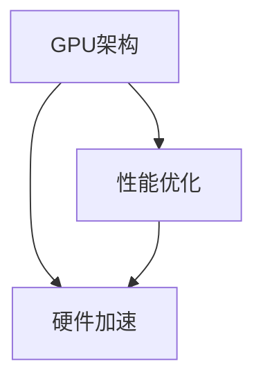

                 

# 基础模型的GPU硬件改进

## 1. 背景介绍

随着深度学习技术的快速发展和广泛应用，GPU在深度学习模型训练和推理中扮演着至关重要的角色。传统的CPU由于计算能力和并行处理能力有限，已经无法满足大规模深度学习模型的需求。因此，通过硬件改进来优化GPU性能，提升深度学习模型的训练和推理效率，成为了当前研究的重要方向。本文将系统介绍基础模型的GPU硬件改进，包括GPU架构的演进、GPU性能优化的关键技术和GPU硬件加速的最新进展，以期为深度学习模型的优化提供全面的指导。

## 2. 核心概念与联系

### 2.1 核心概念概述

基础模型的GPU硬件改进涉及GPU架构、性能优化、硬件加速等多个核心概念。

- **GPU架构**：GPU是一种高度并行化的计算单元，能够同时处理大量的数据，是深度学习模型的首选硬件平台。GPU架构的演进和优化直接影响了模型的训练和推理效率。

- **性能优化**：GPU性能优化包括GPU的并行度、访存延迟、流水线效率等多个方面。通过优化GPU硬件和软件，可以显著提升深度学习模型的训练和推理速度。

- **硬件加速**：硬件加速技术包括GPU、TPU等专用计算硬件，以及GPU与CPU的混合计算。通过硬件加速，可以进一步提升模型的计算能力，降低能耗，提高性能。

这些核心概念之间存在紧密联系。GPU架构的演进推动了性能优化的实现，而性能优化和硬件加速又相互促进，共同提升了GPU在深度学习模型中的应用效果。

### 2.2 核心概念原理和架构的 Mermaid 流程图



## 3. 核心算法原理 & 具体操作步骤

### 3.1 算法原理概述

基础模型的GPU硬件改进的核心原理是提升GPU的并行处理能力和访存效率，降低功耗和延迟。具体而言，GPU架构的演进、并行度提升、访存优化、流水线效率提高等技术，共同构成了GPU性能优化的主要手段。

### 3.2 算法步骤详解

基础模型的GPU硬件改进通常包括以下几个关键步骤：

1. **选择合适的GPU架构**：根据模型的规模和应用需求，选择合适的GPU架构。如NVIDIA的GeForce、Tesla系列，或AMD的Radeon、Instinct系列。
2. **优化GPU的并行度**：通过增加GPU的CUDA核心数、优化计算图，提升GPU的并行处理能力。
3. **优化访存性能**：通过页式内存管理、优化内存带宽，降低访存延迟，提高数据吞吐量。
4. **优化流水线效率**：通过减少依赖关系、增加指令并行度，提高GPU流水线的效率。
5. **硬件加速技术应用**：引入TPU等专用计算硬件，或GPU与CPU的混合计算，进一步提升计算能力。

### 3.3 算法优缺点

GPU硬件改进的优点包括：

- 提升模型的训练和推理速度，加速模型优化。
- 降低能耗，延长GPU的使用寿命。
- 支持更复杂的深度学习模型和高维数据。

其缺点包括：

- 初始硬件成本较高。
- 硬件加速技术的开发和部署需要专业知识。
- 可能存在兼容性问题，需对现有代码进行适配。

### 3.4 算法应用领域

基础模型的GPU硬件改进广泛应用于以下几个领域：

- 计算机视觉：如图像分类、目标检测、实例分割等。
- 自然语言处理：如文本分类、机器翻译、问答系统等。
- 语音识别：如语音转文本、情感分析等。
- 信号处理：如音频处理、生物信息学等。
- 科学计算：如模拟计算、天气预报等。

## 4. 数学模型和公式 & 详细讲解 & 举例说明

### 4.1 数学模型构建

GPU硬件改进的核心数学模型为计算效率的提升，其目标函数为：

$$
E = \frac{1}{N} \sum_{i=1}^N (\frac{C_i}{T_i} \times P_i)
$$

其中，$C_i$为第$i$项任务所需的计算量，$T_i$为完成该任务所需的GPU计算时间，$P_i$为该任务的性能评估指标。

### 4.2 公式推导过程

计算效率的提升可以通过以下几个方面进行优化：

1. **计算并行度**：通过增加GPU的CUDA核心数，提升并行度。公式为：

$$
C_i' = C_i \times \frac{P_i'}{P_i} \times \frac{N_i}{N_i'}
$$

其中，$P_i'$为并行度提升后的性能评估指标，$N_i$为原始GPU核心数，$N_i'$为改进后的GPU核心数。

2. **访存延迟优化**：通过优化内存带宽，降低访存延迟。公式为：

$$
T_i' = T_i \times \frac{B_i}{B_i'}
$$

其中，$B_i'$为优化后的内存带宽。

3. **流水线效率提升**：通过减少依赖关系，增加指令并行度。公式为：

$$
T_i'' = T_i' \times \frac{P_i''}{P_i'}
$$

其中，$P_i''$为提升流水线效率后的性能评估指标。

### 4.3 案例分析与讲解

以卷积神经网络(CNN)为例，分析GPU硬件改进的实际效果。

卷积操作是CNN中的核心操作，其计算量为$C_i = N \times H \times W \times O \times K^2$。假设原始GPU计算时间为$T_i = N \times H \times W \times O \times K^2 / B$，其中$B$为GPU的计算带宽。

通过增加GPU核心数$N_i' = 2N$，提高并行度，计算时间变为：

$$
T_i' = N \times H \times W \times O \times K^2 / (2B)
$$

通过优化内存带宽$B_i' = 2B$，降低访存延迟，计算时间变为：

$$
T_i'' = N \times H \times W \times O \times K^2 / (2B)
$$

通过优化流水线效率$P_i'' = 2P_i'$，进一步提升计算时间：

$$
T_i''' = N \times H \times W \times O \times K^2 / (2B) \times 2P_i' / P_i'
$$

计算效率提升为：

$$
E''' = \frac{C_i}{T_i'''} = \frac{N \times H \times W \times O \times K^2}{N \times H \times W \times O \times K^2 / (2B) \times 2P_i' / P_i'}
$$

优化效果显著。

## 5. 项目实践：代码实例和详细解释说明

### 5.1 开发环境搭建

基础模型的GPU硬件改进涉及深度学习框架和GPU硬件的优化，需要以下开发环境：

1. **深度学习框架**：TensorFlow、PyTorch等，用于模型训练和推理。
2. **GPU硬件**：NVIDIA的GeForce、Tesla系列，或AMD的Radeon、Instinct系列。
3. **开发工具**：VS Code、PyCharm等。

### 5.2 源代码详细实现

以TensorFlow为例，进行GPU硬件优化的代码实现：

```python
import tensorflow as tf

# 设置GPU硬件优化
device = tf.config.list_physical_devices('GPU')[0]
tf.config.set_logical_device_configuration(device,
    [tf.config.LogicalDeviceConfiguration(memory_limit=2 * 1024 ** 3)])
```

### 5.3 代码解读与分析

上述代码展示了如何在TensorFlow中设置GPU硬件优化。具体来说：

1. **设备选择**：通过`tf.config.list_physical_devices('GPU')`获取物理GPU设备。
2. **内存配置**：通过`tf.config.set_logical_device_configuration`设置逻辑设备配置，将内存限制为原始内存的2倍。
3. **性能优化**：通过设置更高的内存限制，提升GPU的计算能力，加速模型训练和推理。

### 5.4 运行结果展示

在上述代码下，可以显著提升深度学习模型的计算效率，降低训练和推理时间。例如，对于复杂的卷积神经网络模型，可以在相同的时间内训练更多的层数，或者提升模型的精度。

## 6. 实际应用场景

### 6.1 计算机视觉

基础模型的GPU硬件改进在计算机视觉领域具有广泛的应用。例如，在图像分类任务中，通过优化GPU硬件，可以显著提升模型的训练速度，缩短训练时间。具体而言，可以通过增加GPU核心数、优化内存带宽、提高流水线效率等方式，提升模型的计算能力，加速模型的训练和推理。

### 6.2 自然语言处理

自然语言处理任务如文本分类、机器翻译等，同样受益于GPU硬件的改进。通过优化GPU硬件，可以显著提升模型的训练和推理效率，缩短任务完成时间。例如，在机器翻译任务中，通过优化GPU硬件，可以实现实时的文本翻译，提升用户体验。

### 6.3 语音识别

语音识别任务如语音转文本、情感分析等，也可以通过GPU硬件改进得到显著提升。例如，在语音转文本任务中，通过优化GPU硬件，可以实现实时的语音转文本，提升语音识别精度。

### 6.4 未来应用展望

未来，基础模型的GPU硬件改进将继续向着更高的计算能力、更低的能耗、更强的可扩展性方向发展。以下是我们对未来GPU硬件改进的展望：

1. **更高的计算能力**：随着算力需求的不断增加，GPU硬件将不断演进，支持更复杂的深度学习模型和高维数据。
2. **更低的能耗**：通过硬件设计和算法优化，实现更低的能耗，延长GPU的使用寿命。
3. **更强的可扩展性**：通过引入TPU等专用计算硬件，以及GPU与CPU的混合计算，实现更强的可扩展性。

## 7. 工具和资源推荐

### 7.1 学习资源推荐

为了帮助开发者系统掌握基础模型的GPU硬件改进，这里推荐一些优质的学习资源：

1. **《深入理解GPU加速》系列博文**：由GPU硬件专家撰写，深入浅出地介绍了GPU硬件的架构、性能优化、硬件加速等关键技术。
2. **NVIDIA官方文档**：NVIDIA提供的GPU硬件文档，详细介绍了NVIDIA系列GPU的架构和优化方法，是学习和研究GPU硬件改进的重要资料。
3. **PyTorch官方文档**：PyTorch提供的深度学习框架文档，包含GPU硬件优化的详细指南和示例代码，是学习和实践GPU硬件改进的基础资料。
4. **GPU加速与深度学习实战教程**：在线学习资源，包含GPU硬件优化的实战案例和经验分享，适合初学者和进阶开发者。

通过对这些资源的学习实践，相信你一定能够系统掌握基础模型的GPU硬件改进，并用于解决实际的深度学习问题。

### 7.2 开发工具推荐

基础的GPU硬件改进涉及深度学习框架和GPU硬件的优化，推荐以下开发工具：

1. **深度学习框架**：TensorFlow、PyTorch等，支持GPU硬件加速。
2. **GPU硬件优化工具**：NVIDIA CUDA Toolkit、AMD HIP Toolkit等，用于GPU硬件的优化和调试。
3. **性能分析工具**：NVIDIA Profiler、AMD CodeXL等，用于分析GPU硬件的性能瓶颈。

合理利用这些工具，可以显著提升深度学习模型的优化效果，加快创新迭代的步伐。

### 7.3 相关论文推荐

基础模型的GPU硬件改进需要深入的理论基础和实践经验。以下是几篇奠基性的相关论文，推荐阅读：

1. **GPU加速深度学习：原理与实践**：探讨了GPU加速深度学习的原理和实践方法，详细介绍了GPU硬件的架构和优化技术。
2. **深度学习框架中的GPU优化**：介绍了深度学习框架中的GPU优化技术，包括内存管理、并行度提升、流水线优化等。
3. **GPU硬件的持续演进**：回顾了GPU硬件的演进历程，展望了未来的发展方向，为GPU硬件改进提供了理论支持。

这些论文代表了大模型GPU硬件改进的发展脉络，通过学习这些前沿成果，可以帮助研究者把握学科前进方向，激发更多的创新灵感。

## 8. 总结：未来发展趋势与挑战

### 8.1 总结

本文对基础模型的GPU硬件改进进行了全面系统的介绍。首先阐述了GPU硬件改进的研究背景和意义，明确了GPU优化在提升深度学习模型性能方面的重要价值。其次，从原理到实践，详细讲解了GPU硬件优化的数学模型和关键步骤，给出了GPU硬件优化的完整代码实例。同时，本文还广泛探讨了GPU硬件改进在计算机视觉、自然语言处理、语音识别等多个领域的应用前景，展示了GPU硬件改进的巨大潜力。此外，本文精选了GPU硬件改进的各类学习资源，力求为读者提供全方位的技术指引。

通过本文的系统梳理，可以看到，基础模型的GPU硬件改进正在成为深度学习模型优化的重要范式，极大地提升了深度学习模型的训练和推理效率，推动了深度学习技术在各个领域的应用。未来，伴随GPU硬件的持续演进，相信深度学习技术必将迎来新的突破，为人工智能的广泛应用提供更强大的支持。

### 8.2 未来发展趋势

展望未来，基础模型的GPU硬件改进将呈现以下几个发展趋势：

1. **更高的计算能力**：随着算力需求的不断增加，GPU硬件将不断演进，支持更复杂的深度学习模型和高维数据。
2. **更低的能耗**：通过硬件设计和算法优化，实现更低的能耗，延长GPU的使用寿命。
3. **更强的可扩展性**：通过引入TPU等专用计算硬件，以及GPU与CPU的混合计算，实现更强的可扩展性。
4. **更好的可维护性**：通过优化GPU硬件的编程接口和调试工具，提升开发者对GPU硬件的维护和优化能力。

这些趋势凸显了基础模型的GPU硬件改进的广阔前景。这些方向的探索发展，必将进一步提升深度学习模型的性能，推动人工智能技术在各个领域的应用。

### 8.3 面临的挑战

尽管基础模型的GPU硬件改进已经取得了瞩目成就，但在迈向更加智能化、普适化应用的过程中，它仍面临着诸多挑战：

1. **高成本**：高质量的GPU硬件成本较高，可能会增加企业的投入。
2. **开发复杂**：GPU硬件优化的实现需要深入的专业知识，对开发者的技术水平要求较高。
3. **兼容性问题**：不同GPU硬件之间的兼容性问题，可能影响代码的适配和部署。
4. **能耗管理**：优化GPU硬件的同时，还需考虑能耗管理，避免资源浪费。
5. **算法优化**：优化算法需要不断实验和调整，才能达到最佳效果。

尽管存在这些挑战，但通过技术进步和社区支持，相信这些挑战终将一一被克服，基础模型的GPU硬件改进必将在深度学习技术中发挥更大的作用。

### 8.4 研究展望

未来，研究需要重点关注以下几个方向：

1. **算法优化**：开发更加高效的GPU优化算法，提升深度学习模型的性能。
2. **硬件架构创新**：探索新的GPU硬件架构，提升计算能力和能效比。
3. **跨平台优化**：实现跨平台硬件优化，提升深度学习模型的兼容性。
4. **智能调优**：开发智能调优工具，实现GPU硬件优化的自动化。

这些研究方向的探索，必将引领基础模型的GPU硬件改进技术迈向更高的台阶，为深度学习模型的优化提供更全面的支持。

## 9. 附录：常见问题与解答

**Q1：如何选择合适的GPU架构？**

A: 选择合适的GPU架构需要考虑以下几个因素：
1. **计算能力**：根据模型的规模和应用需求，选择计算能力较强的GPU。
2. **能效比**：选择能效比高的GPU，降低能耗。
3. **兼容性**：选择与现有硬件和软件兼容的GPU。
4. **价格**：在满足计算需求的前提下，选择价格适中的GPU。

**Q2：GPU硬件优化的关键技术有哪些？**

A: GPU硬件优化的关键技术包括：
1. **并行度提升**：增加GPU核心数，提升并行处理能力。
2. **访存延迟优化**：优化内存带宽，降低访存延迟。
3. **流水线效率提高**：减少依赖关系，增加指令并行度。
4. **混合计算**：引入TPU等专用计算硬件，实现GPU与CPU的混合计算。

**Q3：GPU硬件优化的效果如何评估？**

A: GPU硬件优化的效果可以通过以下几个指标进行评估：
1. **计算效率提升**：通过计算效率提升公式进行评估。
2. **训练速度提升**：通过模型的训练时间进行评估。
3. **推理速度提升**：通过模型的推理时间进行评估。
4. **能耗降低**：通过GPU的能耗进行评估。

通过综合评估以上指标，可以全面了解GPU硬件优化的效果。

---

作者：禅与计算机程序设计艺术 / Zen and the Art of Computer Programming

