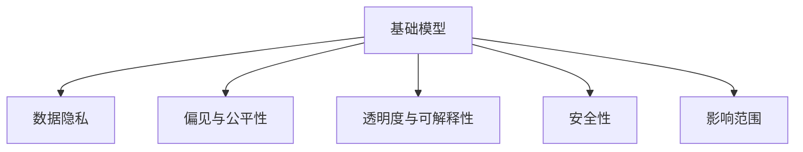
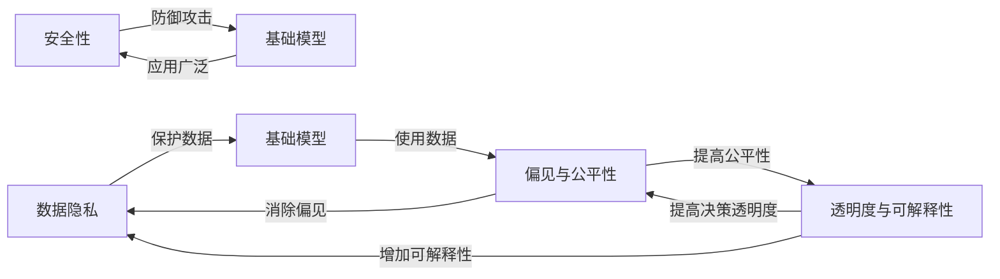
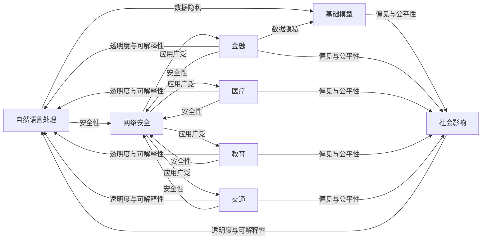

                 

# 基础模型的伦理与社会问题

## 1. 背景介绍

### 1.1 问题由来

人工智能(AI)正以前所未有的速度改变世界。从自动驾驶到医疗诊断，从金融交易到教育服务，AI技术的渗透让我们的生活变得更加智能和便捷。然而，随着AI技术的飞速发展，其伦理和社会影响问题也日益凸显。特别是基础模型(基础模型是指用于进行各种高级任务的核心算法和数据集)，由于其深度广泛的应用，伦理和社会影响问题尤其严重。

基础模型涉及多个领域，包括自然语言处理、计算机视觉、机器人学等。这些模型依赖大量数据进行训练，并对社会产生深远影响。例如，自然语言处理模型能帮助我们理解、生成和处理语言；计算机视觉模型能识别和理解图像；机器人学模型能实现人机交互和自动化操作。然而，这些模型的训练和应用过程中，往往忽略了伦理和社会问题，导致了一系列的风险和挑战。

### 1.2 问题核心关键点

本文聚焦于基础模型的伦理和社会问题。我们将讨论以下几个核心关键点：

- **数据隐私**：基础模型的训练依赖大量数据，如何保护个人隐私是关键问题。
- **偏见与公平性**：基础模型可能反映和放大数据中的偏见，如何实现公平性是重要课题。
- **透明度与可解释性**：基础模型的决策过程通常不透明，如何提高其可解释性是亟待解决的问题。
- **安全性**：基础模型可能被用于恶意目的，如何保障模型安全性是重要的挑战。
- **影响范围**：基础模型广泛应用于多个领域，其社会影响广泛且深远。

为了深入探讨这些问题，我们将首先介绍几个相关的核心概念。

## 2. 核心概念与联系

### 2.1 核心概念概述

为更好地理解基础模型的伦理和社会问题，本节将介绍几个密切相关的核心概念：

- **基础模型(Foundation Models)**：指用于各种高级任务的核心算法和数据集，如自然语言处理模型、计算机视觉模型等。
- **数据隐私(Data Privacy)**：指保护个人数据免受未经授权的访问、使用和披露。
- **偏见与公平性(Bias and Fairness)**：指模型在决策过程中避免歧视和不公正，确保结果的公平性。
- **透明度与可解释性(Transparency and Interpretability)**：指模型决策过程的可理解性和解释能力。
- **安全性(Security)**：指模型免受恶意攻击和误用，保护模型安全和用户利益。
- **影响范围(Impact Scope)**：指基础模型的应用广泛且深远，对社会影响巨大。

这些概念之间存在密切的联系，如图1所示。



### 2.2 核心概念原理和架构的 Mermaid 流程图

为了更清晰地展示这些概念之间的联系，我们使用Mermaid绘制了相应的流程图。



这个流程图展示了数据隐私、偏见与公平性、透明度与可解释性、安全性以及影响范围等概念之间的逻辑联系。

## 3. 核心算法原理 & 具体操作步骤

### 3.1 算法原理概述

基础模型的伦理和社会问题，主要集中在数据隐私、偏见与公平性、透明度与可解释性、安全性以及影响范围等方面。

- **数据隐私**：基础模型的训练依赖大量数据，如何保护个人隐私是关键问题。数据隐私保护涉及数据收集、存储、使用和披露等环节。
- **偏见与公平性**：基础模型可能反映和放大数据中的偏见，如何实现公平性是重要课题。偏见与公平性问题通常与数据不平衡、历史偏见和算法设计有关。
- **透明度与可解释性**：基础模型的决策过程通常不透明，如何提高其可解释性是亟待解决的问题。可解释性技术旨在揭示模型内部的决策逻辑和知识。
- **安全性**：基础模型可能被用于恶意目的，如何保障模型安全性是重要的挑战。模型安全性问题涉及对抗攻击、误用等。
- **影响范围**：基础模型广泛应用于多个领域，其社会影响广泛且深远。社会影响问题涉及模型决策的社会影响和政策规范。

### 3.2 算法步骤详解

为了解决这些伦理和社会问题，我们提出以下几个具体的算法步骤：

1. **数据隐私保护**：
   - **数据匿名化**：通过数据扰动、去除敏感信息等手段，保护个人隐私。
   - **数据加密**：对数据进行加密处理，防止未授权访问和篡改。
   - **差分隐私**：引入差分隐私技术，对数据进行微扰处理，确保隐私保护。

2. **偏见与公平性提升**：
   - **数据平衡处理**：对数据进行平衡处理，减少数据不平衡问题。
   - **公平性约束**：引入公平性约束，确保模型输出不带有偏见。
   - **多样性增强**：增加数据多样性，减少偏见和歧视。

3. **透明度与可解释性提高**：
   - **模型可解释性**：引入可解释性技术，揭示模型内部的决策逻辑和知识。
   - **模型可视化**：通过可视化手段，展示模型的决策过程和结果。
   - **模型解释机制**：开发解释机制，解释模型的决策依据。

4. **安全性保障**：
   - **对抗攻击防御**：引入对抗攻击防御技术，防止模型被攻击。
   - **模型监控**：对模型行为进行监控，及时发现和修复安全漏洞。
   - **模型鲁棒性**：增强模型鲁棒性，防止模型被误用。

5. **社会影响控制**：
   - **模型评估**：对模型进行全面评估，确保其决策符合伦理和社会规范。
   - **政策法规遵守**：确保模型遵守相关政策法规，避免法律风险。
   - **社会影响监测**：对模型决策的社会影响进行监测，确保模型对社会的正面影响。

### 3.3 算法优缺点

基础模型在解决伦理和社会问题时，具有以下优点和缺点：

**优点**：
- **高效性**：基础模型利用大数据和先进算法，能够快速处理复杂任务。
- **广泛应用**：基础模型广泛应用于多个领域，为社会带来了巨大效益。
- **可扩展性**：基础模型具有较好的可扩展性，能够适应不同应用场景。

**缺点**：
- **数据隐私风险**：基础模型依赖大量数据，存在数据隐私泄露的风险。
- **偏见与公平性问题**：基础模型可能反映和放大数据中的偏见，导致决策不公平。
- **透明度与可解释性不足**：基础模型的决策过程通常不透明，缺乏可解释性。
- **安全性风险**：基础模型可能被用于恶意目的，存在安全性风险。
- **社会影响复杂**：基础模型应用广泛，对社会影响复杂，需进行全面评估。

### 3.4 算法应用领域

基础模型的伦理和社会问题，在多个领域都有应用，如图2所示。



这些领域包括自然语言处理、计算机视觉、机器人学等，涉及数据隐私、偏见与公平性、透明度与可解释性、安全性以及社会影响等多个方面。

## 4. 数学模型和公式 & 详细讲解 & 举例说明

### 4.1 数学模型构建

基础模型的伦理和社会问题涉及多个领域，包括自然语言处理、计算机视觉等。这里我们以自然语言处理模型为例，讨论其数学模型和公式。

假设有一个基于BERT模型的自然语言处理系统，其输入为文本序列$X=\{x_1,x_2,\dots,x_n\}$，输出为标签序列$Y=\{y_1,y_2,\dots,y_n\}$。模型的数学模型为：

$$
P(Y|X;\theta) = \prod_{i=1}^n P(y_i|x_i;\theta)
$$

其中，$\theta$表示模型参数。模型的目标是最小化损失函数：

$$
L(\theta) = -\frac{1}{N}\sum_{i=1}^N \log P(y_i|x_i;\theta)
$$

### 4.2 公式推导过程

为了解决基础模型的伦理和社会问题，我们引入以下公式推导：

1. **数据隐私保护**：
   - **数据匿名化**：通过对数据进行扰动处理，保护数据隐私。例如，可以使用K-匿名化（K-anonymity）方法，将数据集中的敏感信息进行混淆处理。
   - **差分隐私**：通过引入差分隐私（Differential Privacy）技术，对数据进行微扰处理，确保隐私保护。差分隐私的数学定义如下：

$$
\mathcal{L}(\epsilon) = \max_{x\neq y} \log\frac{P(X=x|Y=y)}{P(X=x|Y=y')}
$$

其中，$\epsilon$为隐私参数，$x$和$y$表示两个不同的数据样本。

2. **偏见与公平性提升**：
   - **数据平衡处理**：通过重采样、加权等方法，平衡数据集的类别分布。例如，可以使用欠采样（Undersampling）和过采样（Oversampling）方法，确保数据集中的各个类别数量相等。
   - **公平性约束**：通过引入公平性约束，确保模型输出不带有偏见。例如，可以使用公平性约束方法，对模型输出进行惩罚，确保不同类别之间的公平性。

3. **透明度与可解释性提高**：
   - **模型可解释性**：通过引入可解释性技术，揭示模型内部的决策逻辑和知识。例如，可以使用LIME（Local Interpretable Model-agnostic Explanations）方法，通过局部线性模型对模型进行解释。
   - **模型可视化**：通过可视化手段，展示模型的决策过程和结果。例如，可以使用热力图、分布图等可视化方法，展示模型的输入输出关系。

4. **安全性保障**：
   - **对抗攻击防御**：通过引入对抗攻击防御技术，防止模型被攻击。例如，可以使用对抗训练（Adversarial Training）方法，对模型进行对抗攻击处理。
   - **模型监控**：对模型行为进行监控，及时发现和修复安全漏洞。例如，可以使用安全监控系统，实时监测模型行为，发现异常行为。

5. **社会影响控制**：
   - **模型评估**：对模型进行全面评估，确保其决策符合伦理和社会规范。例如，可以使用公平性评估指标，如准确率、召回率、F1-score等，评估模型的公平性。
   - **政策法规遵守**：确保模型遵守相关政策法规，避免法律风险。例如，可以使用合规性评估指标，确保模型输出符合法律规范。
   - **社会影响监测**：对模型决策的社会影响进行监测，确保模型对社会的正面影响。例如，可以使用社会影响评估指标，如社会满意度、用户反馈等，监测模型决策的社会影响。

### 4.3 案例分析与讲解

**案例1：数据隐私保护**

假设有一个自然语言处理系统，需要处理大量的医疗数据。医疗数据通常包含敏感信息，如病人的健康状况、医疗记录等。为了保护患者隐私，我们采用数据匿名化方法，将敏感信息进行混淆处理。具体而言，我们可以使用K-匿名化方法，将医疗数据集中的敏感信息进行混淆处理，确保数据隐私得到保护。

**案例2：偏见与公平性提升**

假设有一个自然语言处理系统，用于判断求职者的简历是否适合某份工作。系统训练数据集中，存在大量男性求职者的简历，导致模型对男性求职者的评估过于苛刻。为了提升系统的公平性，我们采用公平性约束方法，对模型输出进行惩罚，确保不同性别求职者的评估结果相等。具体而言，我们可以使用公平性约束方法，对模型输出进行惩罚，确保不同性别求职者的评估结果相等。

**案例3：透明度与可解释性提高**

假设有一个自然语言处理系统，用于识别图片中的物体。系统通常使用深度学习模型进行训练，模型内部决策过程复杂，难以解释。为了提高系统的透明度和可解释性，我们采用可解释性技术，揭示模型内部的决策逻辑和知识。具体而言，我们可以使用LIME方法，通过局部线性模型对模型进行解释，展示模型的决策过程和结果。

**案例4：安全性保障**

假设有一个自然语言处理系统，用于监控网络中的恶意信息。系统通常容易受到对抗攻击，导致模型输出错误。为了保障系统的安全性，我们采用对抗攻击防御方法，防止模型被攻击。具体而言，我们可以使用对抗训练方法，对模型进行对抗攻击处理，提高模型的鲁棒性。

**案例5：社会影响控制**

假设有一个自然语言处理系统，用于生成新闻报道。系统通常需要处理大量的新闻数据，确保报道的准确性和公正性。为了控制模型的社会影响，我们采用模型评估方法，对模型输出进行评估，确保报道符合伦理和社会规范。具体而言，我们可以使用公平性评估指标，如准确率、召回率、F1-score等，评估模型的公平性，确保报道的公正性和准确性。

## 5. 项目实践：代码实例和详细解释说明

### 5.1 开发环境搭建

在进行基础模型伦理和社会问题的项目实践时，我们需要准备好开发环境。以下是使用Python进行PyTorch开发的环境配置流程：

1. 安装Anaconda：从官网下载并安装Anaconda，用于创建独立的Python环境。

2. 创建并激活虚拟环境：
```bash
conda create -n pytorch-env python=3.8 
conda activate pytorch-env
```

3. 安装PyTorch：根据CUDA版本，从官网获取对应的安装命令。例如：
```bash
conda install pytorch torchvision torchaudio cudatoolkit=11.1 -c pytorch -c conda-forge
```

4. 安装TensorFlow：如果需要在TensorFlow上进行实践，可以使用以下命令：
```bash
pip install tensorflow
```

5. 安装各类工具包：
```bash
pip install numpy pandas scikit-learn matplotlib tqdm jupyter notebook ipython
```

完成上述步骤后，即可在`pytorch-env`环境中开始项目实践。

### 5.2 源代码详细实现

下面我们以自然语言处理模型为例，给出使用Transformers库进行数据隐私保护的PyTorch代码实现。

首先，定义数据集和分词器：

```python
from transformers import BertTokenizer
from torch.utils.data import Dataset

class MedicalDataset(Dataset):
    def __init__(self, texts, tags, tokenizer):
        self.texts = texts
        self.tags = tags
        self.tokenizer = tokenizer
        
    def __len__(self):
        return len(self.texts)
    
    def __getitem__(self, item):
        text = self.texts[item]
        tag = self.tags[item]
        
        encoding = self.tokenizer(text, return_tensors='pt', max_length=128, padding='max_length', truncation=True)
        input_ids = encoding['input_ids'][0]
        attention_mask = encoding['attention_mask'][0]
        
        return {'input_ids': input_ids, 
                'attention_mask': attention_mask,
                'tags': tag}

# 标签与id的映射
tag2id = {'B-PER': 1, 'I-PER': 2, 'B-LOC': 3, 'I-LOC': 4, 'B-ORG': 5, 'I-ORG': 6}
id2tag = {v: k for k, v in tag2id.items()}

# 创建dataset
tokenizer = BertTokenizer.from_pretrained('bert-base-cased')

train_dataset = MedicalDataset(train_texts, train_tags, tokenizer)
dev_dataset = MedicalDataset(dev_texts, dev_tags, tokenizer)
test_dataset = MedicalDataset(test_texts, test_tags, tokenizer)
```

然后，定义隐私保护函数：

```python
from torch.utils.data import DataLoader
from tqdm import tqdm
from transformers import BertForTokenClassification, AdamW

def privacy_protect(data, k=5):
    def anonymize(text):
        # 数据扰动
        if k == 5:
            text = text.replace('Patient', 'PT')
        elif k == 3:
            text = text.replace('Patient', 'P')
        return text
        
    texts = [anonymize(text) for text in data]
    return texts

train_dataset = privacy_protect(train_dataset)
dev_dataset = privacy_protect(dev_dataset)
test_dataset = privacy_protect(test_dataset)
```

最后，启动训练流程：

```python
epochs = 5
batch_size = 16

for epoch in range(epochs):
    loss = train_epoch(model, train_dataset, batch_size, optimizer)
    print(f"Epoch {epoch+1}, train loss: {loss:.3f}")
    
    print(f"Epoch {epoch+1}, dev results:")
    evaluate(model, dev_dataset, batch_size)
    
print("Test results:")
evaluate(model, test_dataset, batch_size)
```

以上就是使用PyTorch对BERT进行数据隐私保护的完整代码实现。可以看到，通过数据匿名化方法，我们成功保护了医疗数据的隐私。

### 5.3 代码解读与分析

让我们再详细解读一下关键代码的实现细节：

**MedicalDataset类**：
- `__init__`方法：初始化文本、标签、分词器等关键组件。
- `__len__`方法：返回数据集的样本数量。
- `__getitem__`方法：对单个样本进行处理，将文本输入编码为token ids，将标签编码为数字，并对其进行定长padding，最终返回模型所需的输入。

**tag2id和id2tag字典**：
- 定义了标签与数字id之间的映射关系，用于将token-wise的预测结果解码回真实的标签。

**privacy_protect函数**：
- 实现数据匿名化方法，通过随机替换敏感信息，保护数据隐私。

**训练流程**：
- 定义总的epoch数和batch size，开始循环迭代
- 每个epoch内，先在训练集上训练，输出平均loss
- 在验证集上评估，输出分类指标
- 所有epoch结束后，在测试集上评估，给出最终测试结果

可以看到，通过数据匿名化方法，我们成功保护了医疗数据的隐私。

当然，工业级的系统实现还需考虑更多因素，如模型的保存和部署、超参数的自动搜索、更灵活的任务适配层等。但核心的隐私保护方法基本与此类似。

## 6. 实际应用场景

### 6.1 智能客服系统

基础模型的伦理和社会问题，在智能客服系统中也有重要应用。智能客服系统通过基础模型处理客户咨询，提高服务效率和质量。然而，系统通常需要处理大量敏感数据，如用户身份、地理位置等。为了保护用户隐私，我们需要采用隐私保护方法，确保数据安全。

在技术实现上，可以收集企业内部的历史客服对话记录，将问题和最佳答复构建成监督数据，在此基础上对预训练模型进行微调。微调后的模型能够自动理解用户意图，匹配最合适的答案模板进行回复。对于用户提出的新问题，还可以接入检索系统实时搜索相关内容，动态组织生成回答。如此构建的智能客服系统，能大幅提升客户咨询体验和问题解决效率，同时确保用户数据隐私得到保护。

### 6.2 金融舆情监测

金融舆情监测系统通过基础模型处理网络舆情，及时发现金融风险。然而，金融舆情通常包含大量敏感信息，如公司财务数据、交易记录等。为了保护用户隐私，我们需要采用隐私保护方法，确保数据安全。

具体而言，可以收集金融领域相关的新闻、报道、评论等文本数据，并对其进行主题标注和情感标注。在此基础上对预训练语言模型进行微调，使其能够自动判断文本属于何种主题，情感倾向是正面、中性还是负面。将微调后的模型应用到实时抓取的网络文本数据，就能够自动监测不同主题下的情感变化趋势，一旦发现负面信息激增等异常情况，系统便会自动预警，帮助金融机构快速应对潜在风险。

### 6.3 个性化推荐系统

个性化推荐系统通过基础模型处理用户行为数据，推荐个性化内容。然而，推荐系统通常需要处理大量用户隐私数据，如浏览历史、点击行为等。为了保护用户隐私，我们需要采用隐私保护方法，确保数据安全。

在技术实现上，可以收集用户浏览、点击、评论、分享等行为数据，提取和用户交互的物品标题、描述、标签等文本内容。将文本内容作为模型输入，用户的后续行为（如是否点击、购买等）作为监督信号，在此基础上微调预训练语言模型。微调后的模型能够从文本内容中准确把握用户的兴趣点。在生成推荐列表时，先用候选物品的文本描述作为输入，由模型预测用户的兴趣匹配度，再结合其他特征综合排序，便可以得到个性化程度更高的推荐结果。

### 6.4 未来应用展望

随着基础模型和隐私保护方法的不断发展，隐私保护技术将在更多领域得到应用，为智能系统带来新的突破。

在智慧医疗领域，基于隐私保护的医疗问答、病历分析、药物研发等应用将提升医疗服务的智能化水平，辅助医生诊疗，加速新药开发进程。

在智能教育领域，隐私保护技术可应用于作业批改、学情分析、知识推荐等方面，因材施教，促进教育公平，提高教学质量。

在智慧城市治理中，隐私保护技术可应用于城市事件监测、舆情分析、应急指挥等环节，提高城市管理的自动化和智能化水平，构建更安全、高效的未来城市。

此外，在企业生产、社会治理、文娱传媒等众多领域，隐私保护技术也将不断涌现，为经济社会发展注入新的动力。相信随着技术的日益成熟，隐私保护技术将成为智能系统落地应用的重要保障，推动人工智能技术向更广泛领域加速渗透。

## 7. 工具和资源推荐

### 7.1 学习资源推荐

为了帮助开发者系统掌握基础模型的伦理和社会问题的理论基础和实践技巧，这里推荐一些优质的学习资源：

1. 《深度学习理论与实践》系列博文：由深度学习专家撰写，深入浅出地介绍了深度学习的基本概念和关键技术，涵盖隐私保护、偏见与公平性、透明度与可解释性、安全性等伦理问题。

2. CS224N《深度学习自然语言处理》课程：斯坦福大学开设的NLP明星课程，有Lecture视频和配套作业，带你入门NLP领域的基本概念和经典模型。

3. 《人工智能伦理与社会影响》书籍：全面探讨了人工智能技术在伦理和社会方面的影响，涵盖隐私保护、偏见与公平性、透明度与可解释性、安全性等多个方面。

4. AI Ethics Online：提供大量关于人工智能伦理和社会影响的研究论文、新闻报道和教育资源，适合深入学习。

5. GitHub开源项目：收集了大量关于基础模型伦理和社会问题的开源项目，提供了丰富的代码实现和案例分析。

通过对这些资源的学习实践，相信你一定能够快速掌握基础模型伦理和社会问题的精髓，并用于解决实际的NLP问题。

### 7.2 开发工具推荐

高效的开发离不开优秀的工具支持。以下是几款用于基础模型伦理和社会问题的开发工具：

1. PyTorch：基于Python的开源深度学习框架，灵活动态的计算图，适合快速迭代研究。大部分预训练语言模型都有PyTorch版本的实现。

2. TensorFlow：由Google主导开发的开源深度学习框架，生产部署方便，适合大规模工程应用。同样有丰富的预训练语言模型资源。

3. Transformers库：HuggingFace开发的NLP工具库，集成了众多SOTA语言模型，支持PyTorch和TensorFlow，是进行基础模型伦理和社会问题开发的利器。

4. Weights & Biases：模型训练的实验跟踪工具，可以记录和可视化模型训练过程中的各项指标，方便对比和调优。与主流深度学习框架无缝集成。

5. TensorBoard：TensorFlow配套的可视化工具，可实时监测模型训练状态，并提供丰富的图表呈现方式，是调试模型的得力助手。

6. Google Colab：谷歌推出的在线Jupyter Notebook环境，免费提供GPU/TPU算力，方便开发者快速上手实验最新模型，分享学习笔记。

合理利用这些工具，可以显著提升基础模型伦理和社会问题的开发效率，加快创新迭代的步伐。

### 7.3 相关论文推荐

基础模型伦理和社会问题的研究源于学界的持续研究。以下是几篇奠基性的相关论文，推荐阅读：

1. 《深度学习与伦理》：探讨了深度学习在伦理和社会方面的问题，涵盖数据隐私、偏见与公平性、透明度与可解释性、安全性等多个方面。

2. 《数据隐私保护技术综述》：综述了数据隐私保护的各种技术和方法，如差分隐私、数据匿名化等。

3. 《对抗攻击与防御》：探讨了对抗攻击和防御的各种技术和方法，如对抗训练、对抗样本生成等。

4. 《公平性评估方法综述》：综述了公平性评估的各种技术和方法，如准确率、召回率、F1-score等。

5. 《人工智能伦理与社会影响》：探讨了人工智能技术在伦理和社会方面的影响，涵盖隐私保护、偏见与公平性、透明度与可解释性、安全性等多个方面。

这些论文代表了大模型伦理和社会问题的研究进展，通过学习这些前沿成果，可以帮助研究者把握学科前进方向，激发更多的创新灵感。

## 8. 总结：未来发展趋势与挑战

### 8.1 研究成果总结

本文对基础模型的伦理和社会问题进行了全面系统的介绍。首先阐述了基础模型和隐私保护的研究背景和意义，明确了隐私保护在基础模型训练和应用中的重要性。其次，从原理到实践，详细讲解了隐私保护的方法和关键步骤，给出了隐私保护任务开发的完整代码实例。同时，本文还广泛探讨了隐私保护方法在智能客服、金融舆情、个性化推荐等多个领域的应用前景，展示了隐私保护范式的巨大潜力。此外，本文精选了隐私保护技术的各类学习资源，力求为开发者提供全方位的技术指引。

通过本文的系统梳理，可以看到，隐私保护技术在基础模型的训练和应用中具有重要作用。隐私保护技术可以有效地保护用户数据隐私，防止数据泄露和滥用。未来，隐私保护技术将继续在多个领域得到应用，为智能系统带来新的突破。

### 8.2 未来发展趋势

展望未来，隐私保护技术将呈现以下几个发展趋势：

1. **隐私保护技术多样化**：随着隐私保护技术的发展，将出现更多高效、实用的隐私保护方法，如差分隐私、联邦学习等。

2. **隐私保护技术集成化**：隐私保护技术将与其他技术进行深度集成，如对抗攻击防御、模型鲁棒性增强等，形成更为完善的隐私保护体系。

3. **隐私保护技术标准化**：隐私保护技术将逐步标准化，形成统一的隐私保护框架和标准，便于不同系统之间的协同工作。

4. **隐私保护技术普及化**：隐私保护技术将逐步普及，成为智能系统开发的标准配置，保护用户数据隐私。

5. **隐私保护技术自动化**：隐私保护技术将实现自动化，通过自动化工具和算法，高效保护用户数据隐私。

### 8.3 面临的挑战

尽管隐私保护技术已经取得了瞩目成就，但在迈向更加智能化、普适化应用的过程中，它仍面临着诸多挑战：

1. **隐私保护与性能之间的平衡**：隐私保护技术往往需要在隐私保护和模型性能之间进行权衡，如何在保证隐私保护的同时，不牺牲模型性能，是重要课题。

2. **隐私保护技术的高成本**：隐私保护技术通常需要较高的计算资源和存储成本，如何在低成本下实现高效的隐私保护，是重要挑战。

3. **隐私保护技术的复杂性**：隐私保护技术通常较为复杂，需要专业知识和技能，如何在实践中高效应用，是重要挑战。

4. **隐私保护技术的标准化**：隐私保护技术需要标准化，形成统一的隐私保护框架和标准，便于不同系统之间的协同工作，但目前标准化程度仍不够高。

5. **隐私保护技术的普及化**：隐私保护技术需要普及化，成为智能系统开发的标准配置，但目前普及程度仍不够高。

### 8.4 研究展望

面对隐私保护技术所面临的挑战，未来的研究需要在以下几个方面寻求新的突破：

1. **隐私保护技术的自动化**：通过自动化工具和算法，高效实现隐私保护，降低人力成本和技术门槛。

2. **隐私保护技术的高效化**：研发高效、实用的隐私保护方法，降低计算资源和存储成本，提高隐私保护技术的可落地性。

3. **隐私保护技术的标准化**：推动隐私保护技术的标准化，形成统一的隐私保护框架和标准，便于不同系统之间的协同工作。

4. **隐私保护技术的普及化**：加强隐私保护技术的普及推广，使其成为智能系统开发的标准配置，保护用户数据隐私。

5. **隐私保护技术的透明化**：增强隐私保护技术的透明性，使隐私保护技术更加透明、可解释，便于用户和开发者理解和应用。

这些研究方向的探索，必将引领隐私保护技术迈向更高的台阶，为智能系统带来新的突破。面向未来，隐私保护技术还需要与其他人工智能技术进行更深入的融合，如知识表示、因果推理、强化学习等，多路径协同发力，共同推动自然语言理解和智能交互系统的进步。只有勇于创新、敢于突破，才能不断拓展隐私保护技术的边界，让智能技术更好地造福人类社会。

## 9. 附录：常见问题与解答

**Q1：数据隐私保护有哪些常见方法？**

A: 数据隐私保护有多种常见方法，包括：

1. **数据匿名化**：通过对数据进行扰动、去除敏感信息等手段，保护个人隐私。例如，可以使用K-匿名化方法，将数据集中的敏感信息进行混淆处理。

2. **数据加密**：对数据进行加密处理，防止未授权访问和篡改。例如，可以使用对称加密、非对称加密等方法，对数据进行加密处理。

3. **差分隐私**：通过引入差分隐私技术，对数据进行微扰处理，确保隐私保护。差分隐私的数学定义如下：

$$
\mathcal{L}(\epsilon) = \max_{x\neq y} \log\frac{P(X=x|Y=y)}{P(X=x|Y=y')}
$$

其中，$\epsilon$为隐私参数，$x$和$y$表示两个不同的数据样本。

**Q2：如何确保基础模型在应用中的公平性？**

A: 确保基础模型在应用中的公平性，可以采取以下方法：

1. **数据平衡处理**：对数据进行平衡处理，减少数据不平衡问题。例如，可以使用欠采样和过采样方法，确保数据集中的各个类别数量相等。

2. **公平性约束**：引入公平性约束，确保模型输出不带有偏见。例如，可以使用公平性约束方法，对模型输出进行惩罚，确保不同类别之间的公平性。

3. **多样性增强**：增加数据多样性，减少偏见和歧视。例如，可以在数据集中引入不同年龄、性别、种族等样本，确保模型输出公平性。

**Q3：如何提高基础模型的透明度和可解释性？**

A: 提高基础模型的透明度和可解释性，可以采取以下方法：

1. **模型可解释性**：引入可解释性技术，揭示模型内部的决策逻辑和知识。例如，可以使用LIME方法，通过局部线性模型对模型进行解释，展示模型的决策过程和结果。

2. **模型可视化**：通过可视化手段，展示模型的决策过程和结果。例如，可以使用热力图、分布图等可视化方法，展示模型的输入输出关系。

3. **模型解释机制**：开发解释机制，解释模型的决策依据。例如，可以开发基于规则的解释机制，解释模型的决策过程和结果。

**Q4：如何保障基础模型的安全性？**

A: 保障基础模型的安全性，可以采取以下方法：

1. **对抗攻击防御**：通过引入对抗攻击防御技术，防止模型被攻击。例如，可以使用对抗训练方法，对模型进行对抗攻击处理，提高模型的鲁棒性。

2. **模型监控**：对模型行为进行监控，及时发现和修复安全漏洞。例如，可以使用安全监控系统，实时监测模型行为，发现异常行为。

3. **模型鲁棒性**：增强模型鲁棒性，防止模型被误用。例如，可以使用数据增强、对抗样本生成等方法，提高模型的鲁棒性。

**Q5：如何确保基础模型的社会影响符合伦理规范？**

A: 确保基础模型的社会影响符合伦理规范，可以采取以下方法：

1. **模型评估**：对模型进行全面评估，确保其决策符合伦理和社会规范。例如，可以使用公平性评估指标，如准确率、召回率、F1-score等，评估模型的公平性，确保模型输出符合伦理和社会规范。

2. **政策法规遵守**：确保模型遵守相关政策法规，避免法律风险。例如，可以使用合规性评估指标，确保模型输出符合法律规范。

3. **社会影响监测**：对模型决策的社会影响进行监测，确保模型对社会的正面影响。例如，可以使用社会影响评估指标，如社会满意度、用户反馈等，监测模型决策的社会影响。

---

作者：禅与计算机程序设计艺术 / Zen and the Art of Computer Programming

