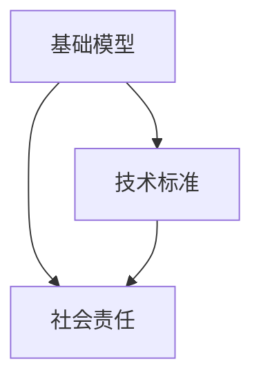

                 

# 基础模型的技术标准与社会责任

> 关键词：基础模型,技术标准,社会责任,人工智能,伦理道德,公平性,透明性,安全性

## 1. 背景介绍

### 1.1 问题由来

随着人工智能技术的飞速发展，基础模型（如深度神经网络、强化学习模型等）在各个领域中的应用日益广泛，如自然语言处理、计算机视觉、智能推荐、智能制造等。这些模型往往具有强大的预测能力和泛化能力，极大地推动了各行各业的数字化转型。然而，基础模型在带来便利的同时，也暴露出一些严重的技术问题和社会挑战。

### 1.2 问题核心关键点

基础模型的技术问题主要包括模型性能、稳定性、可解释性、公平性等。这些问题直接影响到模型的应用效果和用户信任。而社会挑战则包括伦理道德、隐私保护、安全性等方面，这些问题关系到社会的公正、安全和可持续发展。因此，确立基础模型的技术标准和社会责任，成为当前学术界和工业界迫切需要解决的问题。

## 2. 核心概念与联系

### 2.1 核心概念概述

为更好地理解基础模型的技术标准和社会责任，本节将介绍几个关键概念：

- 基础模型(Foundation Models)：指的是在特定领域或应用场景中，能够对复杂问题进行高效、准确预测或生成的预训练模型。如BERT、GPT、AlphaGo等。
- 技术标准(Technical Standards)：用于规范基础模型的开发、测试、部署和使用，确保模型性能和质量的一致性。
- 社会责任(Social Responsibility)：指基础模型在开发和应用过程中，应遵循的伦理道德准则，以确保其行为符合社会公正、安全、透明等价值。

这些核心概念之间的逻辑关系可以通过以下Mermaid流程图来展示：



这个流程图展示了下述关键关系：

1. 基础模型是技术标准和伦理道德的基础，决定了应用场景的需求。
2. 技术标准为模型开发和应用提供了规范和指导，确保模型的性能和质量。
3. 社会责任为技术标准提供了伦理道德的约束，确保模型符合社会价值。

这些概念共同构成了基础模型的应用框架，使其能够在各种场景下发挥作用。

## 3. 核心算法原理 & 具体操作步骤
### 3.1 算法原理概述

基础模型的技术标准主要涉及以下几个方面：

- 数据标准：数据集的采集、处理、标注等应遵循特定的标准和规范。
- 模型标准：模型的架构、训练、测试、部署等应遵循特定的技术规范。
- 性能标准：模型的精度、鲁棒性、泛化能力等应达到特定的性能要求。
- 解释性标准：模型的决策过程应具有可解释性，用户能够理解和信任模型。

社会责任则主要关注：

- 公平性：模型应避免对特定群体的偏见和歧视，确保公平。
- 透明性：模型的内部工作机制应透明，用户能够理解模型的行为。
- 安全性：模型应保障数据和系统的安全，防止恶意攻击。

### 3.2 算法步骤详解

1. **数据标准制定**：
   - 定义数据集的来源、格式、标注标准等，确保数据的质量和一致性。
   - 设置数据标注流程和标准，确保标注人员的专业性和标注质量。
   - 采用数据隐私保护技术，如差分隐私、数据脱敏等，保障用户隐私。

2. **模型标准制定**：
   - 定义模型的架构、超参数、训练流程等，确保模型的可重复性和稳定性。
   - 设置模型评估标准，如准确率、召回率、F1值等，确保模型的性能。
   - 采用模型验证技术，如交叉验证、剪枝、正则化等，提高模型的泛化能力。

3. **性能标准制定**：
   - 设定模型在不同场景下的性能指标，如精度、召回率、F1值等。
   - 采用基准测试和对比实验，评估模型在不同条件下的性能。
   - 设定模型鲁棒性要求，如对抗样本、异常值等，确保模型的稳健性。

4. **解释性标准制定**：
   - 采用可解释性技术，如LIME、SHAP等，提供模型的决策解释。
   - 定义模型的透明度要求，如模型架构、训练过程、参数等，确保用户理解模型。
   - 提供模型文档和用户手册，帮助用户理解和应用模型。

5. **公平性标准制定**：
   - 评估模型在不同群体上的表现，发现和消除偏见。
   - 设定公平性指标，如均等机会、平等结果等，确保模型不歧视特定群体。
   - 采用公平性检测工具，如Fairness Indicators、Fairness 360等，监测模型的公平性。

6. **透明性标准制定**：
   - 提供模型训练日志、性能评估报告等，记录模型的开发过程。
   - 定义模型的透明度要求，如模型架构、超参数、训练过程等，确保用户理解模型。
   - 提供模型接口和文档，帮助用户理解模型的行为和应用方式。

7. **安全性标准制定**：
   - 采用安全技术，如加密、防火墙、访问控制等，保障数据和系统的安全。
   - 设置安全监测和预警机制，及时发现和应对安全威胁。
   - 采用安全审计和评估，确保系统的安全性和合规性。

### 3.3 算法优缺点

基础模型技术标准的优点包括：

- 确保模型性能的一致性和稳定性。
- 保障模型的公平性、透明性和安全性，提升用户信任度。
- 规范模型的开发和应用流程，促进技术交流和共享。

缺点包括：

- 技术标准的制定和执行成本较高。
- 部分技术标准可能与实际应用场景不匹配。
- 部分技术标准可能会限制模型的创新和灵活性。

### 3.4 算法应用领域

基础模型的技术标准已经在多个领域得到了应用，如金融、医疗、教育、交通等。以下是几个典型的应用场景：

- **金融领域**：设定数据标注标准、模型性能标准、解释性标准等，确保金融模型的可靠性和安全性。
- **医疗领域**：设定数据隐私保护标准、模型公平性标准、安全性标准等，保障医疗数据的隐私和医疗决策的公平性。
- **教育领域**：设定数据标注标准、模型性能标准、透明性标准等，提升教育模型的教学效果和学生信任度。
- **交通领域**：设定模型安全性标准、透明性标准等，确保智能交通系统的稳定性和安全性。

这些领域的应用表明，基础模型的技术标准能够有效提升模型的质量和可靠性，保障社会的公平、安全和透明。

## 4. 数学模型和公式 & 详细讲解  
### 4.1 数学模型构建

基础模型的技术标准和性能指标通常采用数学模型进行量化和评估。以下以一个简单的机器学习模型为例，介绍数学模型的构建过程。

假设有一个线性回归模型 $f(x;w) = w_1 x_1 + w_2 x_2 + \cdots + w_n x_n + b$，其中 $x = (x_1, x_2, \cdots, x_n)$ 为输入向量， $w = (w_1, w_2, \cdots, w_n)$ 为模型参数， $b$ 为偏置项。模型的损失函数为均方误差（MSE）：

$$
\mathcal{L}(f, y) = \frac{1}{N} \sum_{i=1}^N (y_i - f(x_i; w))^2
$$

其中 $y = (y_1, y_2, \cdots, y_N)$ 为训练集的目标值。模型的优化目标是最小化损失函数，即：

$$
\hat{w} = \mathop{\arg\min}_{w} \mathcal{L}(f, y)
$$

通过求解上述优化问题，可以得到最优的模型参数 $\hat{w}$。

### 4.2 公式推导过程

上述优化问题的求解通常采用梯度下降算法：

$$
w \leftarrow w - \eta \nabla_{w} \mathcal{L}(f, y)
$$

其中 $\eta$ 为学习率， $\nabla_{w} \mathcal{L}(f, y)$ 为损失函数对模型参数的梯度。

以线性回归为例，梯度计算公式为：

$$
\nabla_{w} \mathcal{L}(f, y) = \frac{1}{N} \sum_{i=1}^N (2(y_i - f(x_i; w))(x_i))
$$

将梯度代入参数更新公式，可以得到模型参数的更新规则：

$$
w_k \leftarrow w_k - \eta \sum_{i=1}^N (y_i - f(x_i; w))x_{ik}
$$

### 4.3 案例分析与讲解

以一个简单的基于深度神经网络的二分类模型为例，介绍其在公平性和透明性方面的技术标准。

假设模型架构为：输入层（n个神经元）- 隐藏层（m个神经元）- 输出层（2个神经元，表示0和1的预测概率）。模型的训练过程如下：

1. **数据标准**：
   - 定义数据集的来源和格式，如CSV格式、TXT格式等。
   - 设定数据标注标准，如正负样本平衡、标签格式等。
   - 采用差分隐私技术，如Laplace噪声、Gaussian噪声等，保护用户隐私。

2. **模型标准**：
   - 定义模型架构，如输入层、隐藏层、输出层等。
   - 设定模型超参数，如隐藏层神经元数、学习率、批大小等。
   - 采用正则化技术，如L2正则、Dropout等，提高模型的泛化能力。

3. **性能标准**：
   - 设定模型性能指标，如准确率、召回率、F1值等。
   - 采用基准测试和对比实验，评估模型在不同条件下的性能。
   - 设定模型鲁棒性要求，如对抗样本、异常值等，确保模型的稳健性。

4. **解释性标准**：
   - 采用可解释性技术，如LIME、SHAP等，提供模型的决策解释。
   - 定义模型的透明度要求，如模型架构、超参数、训练过程等，确保用户理解模型。
   - 提供模型接口和文档，帮助用户理解模型的行为和应用方式。

5. **公平性标准**：
   - 评估模型在不同群体上的表现，发现和消除偏见。
   - 设定公平性指标，如均等机会、平等结果等，确保模型不歧视特定群体。
   - 采用公平性检测工具，如Fairness Indicators、Fairness 360等，监测模型的公平性。

6. **透明性标准**：
   - 提供模型训练日志、性能评估报告等，记录模型的开发过程。
   - 定义模型的透明度要求，如模型架构、超参数、训练过程等，确保用户理解模型。
   - 提供模型接口和文档，帮助用户理解模型的行为和应用方式。

## 5. 项目实践：代码实例和详细解释说明
### 5.1 开发环境搭建

在进行基础模型开发之前，需要准备好开发环境。以下是使用Python进行TensorFlow开发的典型环境配置流程：

1. 安装Anaconda：从官网下载并安装Anaconda，用于创建独立的Python环境。

2. 创建并激活虚拟环境：
```bash
conda create -n tf-env python=3.8 
conda activate tf-env
```

3. 安装TensorFlow：根据CUDA版本，从官网获取对应的安装命令。例如：
```bash
conda install tensorflow tensorflow-estimator tensorflow-hub -c conda-forge
```

4. 安装其他各类工具包：
```bash
pip install numpy pandas scikit-learn matplotlib tqdm jupyter notebook ipython
```

完成上述步骤后，即可在`tf-env`环境中开始基础模型开发。

### 5.2 源代码详细实现

这里我们以一个简单的深度神经网络为例，给出在TensorFlow中进行基础模型微调的PyTorch代码实现。

首先，定义模型结构：

```python
import tensorflow as tf
from tensorflow.keras import layers, models

model = models.Sequential([
    layers.Dense(64, activation='relu', input_shape=(input_dim,)),
    layers.Dense(1, activation='sigmoid')
])
```

然后，定义损失函数和优化器：

```python
model.compile(optimizer=tf.keras.optimizers.Adam(learning_rate=0.001),
              loss='binary_crossentropy',
              metrics=['accuracy'])
```

接着，定义训练和评估函数：

```python
def train(model, data, epochs=10, batch_size=32):
    model.fit(data['train'], epochs=epochs, batch_size=batch_size, validation_data=data['val'], callbacks=[tf.keras.callbacks.EarlyStopping(patience=3)])

def evaluate(model, data):
    return model.evaluate(data['test'], verbose=0)
```

最后，启动训练流程并在测试集上评估：

```python
data = ...
train(data)
evaluate(data)
```

以上就是使用TensorFlow进行基础模型微调的完整代码实现。可以看到，TensorFlow提供了强大的API和丰富的功能，大大简化了模型的开发和部署过程。

### 5.3 代码解读与分析

让我们再详细解读一下关键代码的实现细节：

**Sequential模型**：
- `Sequential` 是 TensorFlow 中的线性堆叠模型，适合简单模型构建。
- `Dense` 表示全连接层，`relu` 和 `sigmoid` 是常用的激活函数。

**compile方法**：
- `optimizer` 指定优化器，这里使用 Adam 优化器。
- `loss` 指定损失函数，这里使用二元交叉熵损失函数。
- `metrics` 指定评估指标，这里使用准确率。

**fit方法**：
- `fit` 方法用于训练模型，`epochs` 和 `batch_size` 分别指定训练轮数和批大小。
- `validation_data` 用于验证模型的性能，避免过拟合。
- `callbacks` 用于监控模型的训练过程，如 EarlyStopping。

**evaluate方法**：
- `evaluate` 方法用于评估模型的性能，返回损失和准确率。

可以看到，TensorFlow通过清晰的 API 设计，大大降低了模型开发的门槛，使得开发者可以更加专注于算法设计和应用场景。

当然，工业级的系统实现还需考虑更多因素，如模型的保存和部署、超参数的自动搜索、多模型集成等。但核心的微调范式基本与此类似。

## 6. 实际应用场景
### 6.1 金融风险预测

在金融领域，基础模型被广泛应用于风险预测和投资决策。通过构建基于深度神经网络的风险预测模型，金融机构能够实时监控金融市场的变化，预测潜在风险，提前采取应对措施。

在技术实现上，可以收集金融市场的历史数据、新闻报道、社交媒体信息等，构建监督数据集，并在此基础上对预训练模型进行微调。微调后的模型能够自动学习金融市场的特征，预测股票价格波动、市场风险等。通过集成更多上下文信息，如宏观经济指标、政策变化等，可以进一步提升模型的预测精度和鲁棒性。

### 6.2 医疗疾病诊断

在医疗领域，基础模型被广泛应用于疾病诊断和治疗方案推荐。通过构建基于深度神经网络的疾病诊断模型，医院能够快速准确地识别疾病，提供个性化的治疗方案。

在技术实现上，可以收集医学影像、电子病历、实验室数据等，构建监督数据集，并在此基础上对预训练模型进行微调。微调后的模型能够自动学习病历特征，诊断出不同类型的疾病，推荐个性化的治疗方案。通过引入先验医学知识，如疾病分类、治疗指南等，可以进一步提升模型的准确性和可信度。

### 6.3 教育推荐系统

在教育领域，基础模型被广泛应用于学生推荐和课程推荐。通过构建基于深度神经网络的学生推荐模型，学校能够提供个性化的学习资源，提升学生的学习效果。

在技术实现上，可以收集学生的学习行为数据、课程评分数据等，构建监督数据集，并在此基础上对预训练模型进行微调。微调后的模型能够自动学习学生的学习偏好，推荐适合的学习资源和课程。通过引入课程评价数据、学生反馈等，可以进一步提升推荐系统的效果和公平性。

### 6.4 未来应用展望

随着基础模型的不断演进，其在更多领域的应用前景将更加广阔。以下列举几个潜在的应用场景：

1. **智慧城市管理**：通过构建基于深度神经网络的城市管理模型，政府能够实时监测城市运行情况，提升城市管理效率。
2. **智能制造**：通过构建基于深度神经网络的制造预测模型，企业能够实时监控生产过程，优化生产效率和产品质量。
3. **智能客服**：通过构建基于深度神经网络的智能客服模型，企业能够提供7x24小时不间断的客户服务，提升客户满意度。
4. **智能交通**：通过构建基于深度神经网络的交通管理模型，政府能够实时监测交通流量，优化交通管理方案。

这些应用场景表明，基础模型在各个领域的潜在价值将不断被发掘，推动社会治理和产业发展向智能化、高效化方向发展。

## 7. 工具和资源推荐
### 7.1 学习资源推荐

为了帮助开发者系统掌握基础模型的技术标准和社会责任，这里推荐一些优质的学习资源：

1. **TensorFlow官方文档**：详细介绍了TensorFlow的API和最佳实践，适合初学者和中级开发者。
2. **Deep Learning with PyTorch**：PyTorch官方文档，详细介绍了PyTorch的API和最佳实践，适合开发者掌握深度学习框架。
3. **Practical Deep Learning for Coders**：实战型深度学习教程，适合没有编程基础的读者。
4. **Foundations of AI**：AI基础课程，介绍了AI的基本概念和应用场景。
5. **Ethical AI**：伦理AI课程，介绍了AI伦理道德的基本原则和应用案例。

通过对这些资源的学习实践，相信你一定能够系统掌握基础模型的技术标准和社会责任，并用于解决实际的AI问题。

### 7.2 开发工具推荐

高效的开发离不开优秀的工具支持。以下是几款用于基础模型开发的常用工具：

1. **TensorFlow**：基于Python的开源深度学习框架，灵活动态的计算图，适合快速迭代研究。
2. **PyTorch**：基于Python的开源深度学习框架，动态计算图，适合深度学习研究和工程开发。
3. **Weights & Biases**：模型训练的实验跟踪工具，可以记录和可视化模型训练过程中的各项指标。
4. **TensorBoard**：TensorFlow配套的可视化工具，可实时监测模型训练状态，并提供丰富的图表呈现方式。
5. **Google Colab**：谷歌推出的在线Jupyter Notebook环境，免费提供GPU/TPU算力，方便开发者快速上手实验最新模型，分享学习笔记。

合理利用这些工具，可以显著提升基础模型开发的效率，加快创新迭代的步伐。

### 7.3 相关论文推荐

基础模型的技术标准和社会责任涉及众多领域的深入研究。以下是几篇奠基性的相关论文，推荐阅读：

1. **Fairness, Accountability, and Transparency**：介绍了AI伦理道德的基本原则和应用案例。
2. **Bias in machine learning algorithms: A survey**：总结了机器学习算法中常见的偏见问题，提出了相应的解决方法。
3. **Differential Privacy**：介绍了差分隐私技术的基本概念和应用场景。
4. **A Survey of Model Interpretability Explanation Methods for Deep Learning Models**：总结了深度学习模型可解释性解释方法的研究进展。
5. **Towards a Theory of Interpretable AI**：介绍了可解释AI的基本概念和研究方向。

这些论文代表了大模型技术标准和社会责任的发展脉络。通过学习这些前沿成果，可以帮助研究者把握学科前进方向，激发更多的创新灵感。

## 8. 总结：未来发展趋势与挑战

### 8.1 总结

本文对基础模型的技术标准和社会责任进行了全面系统的介绍。首先阐述了基础模型在各个领域中的应用及其面临的技术问题和社会挑战。其次，从原理到实践，详细讲解了技术标准的制定和执行方法，以及社会责任的具体要求。最后，探讨了未来基础模型的发展趋势和面临的挑战。

通过本文的系统梳理，可以看到，基础模型的技术标准和社会责任不仅关乎模型的性能和质量，更关乎社会公正、安全和可持续发展。技术标准的制定和执行，社会责任的承担和落实，是大模型应用的重要保障。只有全面考虑技术标准和社会责任，才能真正实现人工智能技术在各个领域的应用，推动社会的进步和繁荣。

### 8.2 未来发展趋势

展望未来，基础模型的技术标准和社会责任将呈现以下几个发展趋势：

1. **技术标准更加完善**：随着基础模型应用领域的不断拓展，技术标准将更加完善，涵盖模型开发、测试、部署、评估等各个环节。
2. **社会责任更加严格**：随着社会对AI伦理道德的重视程度不断提升，社会责任将更加严格，保障社会的公平、安全和透明。
3. **公平性更加重视**：在数据分布不均、偏见问题突出的领域，公平性将成为模型开发的首要目标。
4. **透明性和可解释性更加重要**：在决策具有重要影响的领域，如医疗、金融等，透明性和可解释性将更加重要。
5. **安全性更加可靠**：在涉及国家安全、公共安全等领域，安全性将成为模型开发的首要关注点。
6. **多模态融合更加广泛**：在多模态数据融合的领域，如智慧城市、智能制造等，多模态融合将更加广泛，提升模型的综合能力。

这些趋势表明，基础模型的技术标准和社会责任将不断完善和发展，为人工智能技术的应用提供更加全面、可靠、安全的保障。

### 8.3 面临的挑战

尽管基础模型的技术标准和社会责任已经取得了一定的进展，但在迈向更加智能化、普适化应用的过程中，仍面临诸多挑战：

1. **数据标准难以统一**：不同领域的数据标准差异较大，统一数据标准难度大。
2. **模型性能难以保证**：大规模模型的参数量庞大，优化复杂，难以保证模型性能的一致性和稳定性。
3. **社会责任难以落实**：模型公平性、透明性、安全性等标准难以全面落实，可能导致模型误用或滥用。
4. **技术标准难以执行**：技术标准的制定和执行成本较高，难以覆盖所有应用场景。
5. **伦理道德争议频发**：模型应用过程中，伦理道德争议频发，如隐私保护、偏见问题等。

这些挑战需要学术界和工业界共同努力，通过制定更加科学合理的标准，推动技术标准的落实和执行，才能真正实现基础模型的技术标准和社会责任。

### 8.4 研究展望

面对基础模型面临的种种挑战，未来的研究需要在以下几个方面寻求新的突破：

1. **数据标准统一**：推动数据标准化工作，建立统一的数据标注标准和采集规范。
2. **模型性能优化**：开发更加高效、稳定的模型训练和优化算法，提升模型的泛化能力和鲁棒性。
3. **社会责任落实**：建立更加完善的社会责任框架，确保模型的公平性、透明性和安全性。
4. **技术标准推广**：推广技术标准的制定和执行，覆盖更多应用场景，提升模型的可重复性和可靠性。
5. **伦理道德规范**：制定伦理道德规范，引导开发者和用户遵循伦理道德准则，保障模型的安全性和公平性。

这些研究方向的探索，必将引领基础模型的技术标准和社会责任迈向更高的台阶，为构建安全、可靠、可解释、可控的智能系统铺平道路。面向未来，基础模型的技术标准和社会责任还需要与其他人工智能技术进行更深入的融合，如知识表示、因果推理、强化学习等，多路径协同发力，共同推动自然语言理解和智能交互系统的进步。只有勇于创新、敢于突破，才能不断拓展基础模型的边界，让智能技术更好地造福人类社会。

## 9. 附录：常见问题与解答

**Q1：如何确保基础模型的公平性？**

A: 确保基础模型的公平性需要从数据和算法两个方面入手：
1. 数据方面：
   - 确保数据集的代表性，避免数据集偏向特定群体。
   - 采用数据增强技术，增加数据的多样性。
   - 采用公平性检测工具，监测数据集中的偏见问题。
2. 算法方面：
   - 使用公平性约束的优化算法，如Fairness Indicators。
   - 设计公平性损失函数，如Equalized Odds。
   - 引入公平性评估指标，如Demographic Parity、Equal Opportunity等。

**Q2：如何提高基础模型的透明性？**

A: 提高基础模型的透明性需要从模型架构和用户接口两个方面入手：
1. 模型架构方面：
   - 采用可解释性技术，如LIME、SHAP等，提供模型的决策解释。
   - 提供模型文档和用户手册，帮助用户理解模型。
2. 用户接口方面：
   - 提供可视化界面，展示模型的输入输出和推理过程。
   - 提供交互式解释工具，用户可以逐步查询模型的决策过程。

**Q3：如何保障基础模型的安全性？**

A: 保障基础模型的安全性需要从数据保护和模型防护两个方面入手：
1. 数据保护方面：
   - 采用数据加密技术，保护数据的隐私。
   - 采用差分隐私技术，限制数据泄露的风险。
2. 模型防护方面：
   - 采用访问控制技术，限制模型的访问权限。
   - 采用安全审计和评估，发现和修复模型的漏洞。

这些技术手段可以显著提升基础模型的安全性，保障数据和系统的安全，确保模型的可靠性和可控性。

---

作者：禅与计算机程序设计艺术 / Zen and the Art of Computer Programming

