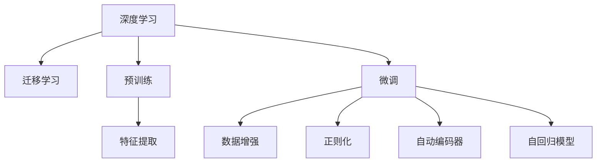
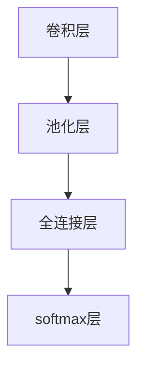

                 

# 基础模型的深度学习与迁移学习

> 关键词：基础模型,深度学习,迁移学习,预训练,微调,泛化,特征提取,数据增强,正则化,自动编码器,自回归模型,领域自适应,知识图谱

## 1. 背景介绍

### 1.1 问题由来
在深度学习领域，深度神经网络(DNNs)以其强大的特征表示和抽象能力，成为现代机器学习的主流方法。深度网络可以自动从原始数据中提取高级特征，通过若干层次的非线性变换，实现对复杂数据的建模。然而，训练大规模的深度网络需要大量的数据和计算资源，尤其是当数据规模和特征维度巨大时，普通的监督学习任务变得极为困难。

为了解决这个问题，研究人员提出了预训练(Pre-training)的概念。预训练是指在大规模无标签数据上，使用无监督学习方法预先训练模型，使其能够学习到通用的数据特征。这种方法不仅减少了对标注数据的依赖，还能提升模型的泛化能力和推理能力。预训练模型在图像、文本、语音等领域取得了显著的效果。

但是，预训练模型通常依赖于特定的任务，难以在不同的任务之间进行转移。例如，一个在大规模图片数据上预训练的卷积神经网络(CNN)，可能在处理文字数据时效果不佳。为了解决这一问题，迁移学习(Transfer Learning)应运而生。迁移学习将预训练模型的知识迁移到新的任务中，通过微调(Fine-tuning)使模型能够适应特定的任务需求。迁移学习不仅减少了标注数据的需要，还能加速模型的训练，提升模型的性能。

本文将对基础模型的深度学习和迁移学习进行全面介绍，从基础概念、算法原理、应用实践到未来趋势，带领读者深入理解这一领域的前沿技术。

## 2. 核心概念与联系

### 2.1 核心概念概述

为了更好地理解深度学习和迁移学习的核心概念，我们将首先介绍几个关键术语和它们之间的联系。

- **深度学习**：一种基于深度神经网络的人工智能技术，能够自动从数据中学习特征，并进行高层次的抽象表示。

- **迁移学习**：在预训练的基础上，利用已经学到的知识，对特定任务进行微调，以提升模型在新任务上的性能。

- **预训练**：在大规模无标签数据上，使用无监督学习方法预先训练模型，使其能够学习到通用的数据特征。

- **微调**：在预训练模型的基础上，使用下游任务的少量标注数据，通过有监督学习优化模型在特定任务上的性能。

- **特征提取**：通过预训练模型对原始数据进行编码，提取出高层次的特征表示，用于下游任务的进一步处理。

- **数据增强**：通过对训练数据进行随机变换，扩充数据集，增加模型的泛化能力。

- **正则化**：通过在损失函数中添加惩罚项，抑制模型过拟合，增强模型的泛化能力。

- **自动编码器**：一种无监督学习的神经网络，通过压缩和重构输入数据，学习数据的低维表示。

- **自回归模型**：通过预测未来数据的序列，学习数据的内在规律。

这些概念之间的逻辑关系可以通过以下Mermaid流程图来展示：



这个流程图展示了大模型学习和迁移学习的基本框架：

1. 深度学习通过神经网络模型对数据进行特征提取和表示。
2. 预训练模型在大规模无标签数据上进行预训练，学习通用的特征表示。
3. 迁移学习将预训练模型的知识迁移到特定任务中，通过微调提升模型性能。
4. 特征提取通过预训练模型对数据进行编码，得到高层次的特征表示。
5. 数据增强通过随机变换扩充数据集，增强模型的泛化能力。
6. 正则化通过添加惩罚项抑制过拟合，提升模型的泛化能力。
7. 自动编码器通过压缩和重构学习数据的低维表示。
8. 自回归模型通过预测未来数据序列，学习数据的内在规律。

这些概念共同构成了深度学习和迁移学习的基本框架，使得模型能够在各种场景下实现高效、泛化的性能。

## 3. 核心算法原理 & 具体操作步骤

### 3.1 算法原理概述

深度学习的核心在于神经网络的层次结构。神经网络由若干个层次构成，每个层次包含多个神经元，通过一系列的非线性变换，将输入数据映射到高维空间。深度网络的层次结构可以自动学习数据的复杂特征表示，从而实现对数据的建模和预测。

迁移学习的核心在于预训练和微调。预训练是指在大规模无标签数据上，使用无监督学习方法预先训练模型，使其能够学习到通用的数据特征。微调是指在预训练模型的基础上，使用下游任务的少量标注数据，通过有监督学习优化模型在特定任务上的性能。迁移学习的核心在于将预训练模型的知识迁移到新的任务中，减少对标注数据的依赖，加速模型的训练，提升模型的性能。

### 3.2 算法步骤详解

基于深度学习和迁移学习的算法步骤如下：

**Step 1: 准备预训练模型和数据集**
- 选择合适的预训练模型，如VGG、ResNet、BERT等。
- 准备下游任务的标注数据集，划分为训练集、验证集和测试集。

**Step 2: 预训练模型微调**
- 将预训练模型作为初始化参数，在训练集上进行微调。
- 定义微调任务的损失函数，如交叉熵损失、均方误差损失等。
- 使用优化器，如SGD、Adam等，进行模型参数的优化。
- 在验证集上评估模型性能，根据性能指标决定是否停止训练。

**Step 3: 测试和部署**
- 在测试集上评估微调后模型的性能，对比微调前后的精度提升。
- 使用微调后的模型对新样本进行推理预测，集成到实际的应用系统中。
- 持续收集新的数据，定期重新微调模型，以适应数据分布的变化。

以上是深度学习和迁移学习的基本流程。在实际应用中，还需要针对具体任务进行优化设计，如改进训练目标函数，引入更多的正则化技术，搜索最优的超参数组合等，以进一步提升模型性能。

### 3.3 算法优缺点

深度学习和迁移学习具有以下优点：
1. 减少对标注数据的依赖。预训练模型在大规模无标签数据上进行训练，可以大幅减少对标注数据的需要。
2. 提高模型的泛化能力。通过预训练，模型学习到通用的数据特征，能够在新的任务中表现优异。
3. 加速模型的训练。迁移学习可以显著减少模型的训练时间，提升模型的收敛速度。
4. 提高模型的性能。通过微调，模型可以在特定任务上获得更高的精度和泛化能力。

同时，这些方法也存在一些局限性：
1. 模型结构复杂。深度网络具有复杂的层次结构，训练和调试难度较高。
2. 计算资源需求高。深度网络需要大量的计算资源进行训练，成本较高。
3. 泛化能力有限。深度网络的泛化能力受限于训练数据，一旦训练数据存在偏差，模型可能无法泛化到新的数据集。
4. 数据增强效果不确定。数据增强技术需要精心设计，效果取决于具体数据和任务。
5. 正则化效果不确定。正则化技术需要选择合适的参数，效果取决于具体数据和任务。

尽管存在这些局限性，深度学习和迁移学习仍然是大数据时代的主流技术，为许多实际应用场景提供了强有力的支持。

### 3.4 算法应用领域

深度学习和迁移学习在各个领域都有广泛的应用，以下是一些典型的应用场景：

- **图像识别**：使用卷积神经网络(CNN)进行图像分类、物体检测、人脸识别等任务。通过在大规模图像数据上预训练，然后微调以适应特定的识别任务。

- **自然语言处理(NLP)**：使用语言模型、Transformer等深度学习模型进行文本分类、命名实体识别、情感分析等任务。通过在大规模文本数据上预训练，然后微调以适应特定的文本处理任务。

- **语音识别**：使用卷积神经网络(CNN)、循环神经网络(RNN)等深度学习模型进行语音识别、情感分析等任务。通过在大规模语音数据上预训练，然后微调以适应特定的语音识别任务。

- **推荐系统**：使用深度学习模型进行个性化推荐、协同过滤等任务。通过在大规模用户行为数据上预训练，然后微调以适应特定的推荐任务。

- **游戏AI**：使用深度强化学习进行游戏策略优化、智能对抗等任务。通过在游戏环境中预训练，然后微调以适应特定的游戏任务。

以上是深度学习和迁移学习在实际应用中的典型场景。随着深度学习技术的不断发展，未来这些方法将在更多领域得到应用，为各行各业带来新的突破。

## 4. 数学模型和公式 & 详细讲解 & 举例说明

### 4.1 数学模型构建

深度学习的数学模型通常使用神经网络来表示。假设输入数据为 $x$，输出数据为 $y$，神经网络由若干个层次构成，每个层次包含多个神经元。神经网络的输出可以表示为：

$$
y = f_\theta(x)
$$

其中 $f_\theta$ 表示神经网络的参数化函数，$\theta$ 表示神经网络的参数。

### 4.2 公式推导过程

以卷积神经网络(CNN)为例，其基本结构如下图所示：



卷积神经网络由卷积层、池化层、全连接层和softmax层构成。卷积层和池化层用于提取输入数据的特征表示，全连接层和softmax层用于进行分类。

假设输入数据为 $x$，卷积核为 $k$，卷积层输出的特征图为 $f$，则卷积操作的公式为：

$$
f_{i,j} = \sum_{m,n} w_{m,n} \cdot x_{i-m,j-n} + b
$$

其中 $w_{m,n}$ 表示卷积核的权重，$b$ 表示卷积层的偏置项。

池化层用于对特征图进行下采样，常用的池化方式有最大池化和平均池化。假设池化窗口为 $w$，池化层输出的特征图为 $f'$，则最大池化操作的公式为：

$$
f'_{i,j} = \max_{m,n} f_{i+m,j+n}
$$

卷积层和池化层通过多次卷积和池化，提取输入数据的特征表示。全连接层将特征图展开为向量，通过若干个神经元的非线性变换，得到最终输出。假设全连接层的权重为 $w$，偏置项为 $b$，输出为 $y$，则全连接层的操作公式为：

$$
y = \sigma(w \cdot f' + b)
$$

其中 $\sigma$ 表示激活函数，常用的激活函数有ReLU、Sigmoid等。

softmax层将输出转换为概率分布，用于分类任务。假设类别数为 $c$，softmax层输出的概率分布为 $p$，则softmax层的操作公式为：

$$
p_i = \frac{e^{\logits_i}}{\sum_{j=1}^c e^{\logits_j}}
$$

其中 $\logits_i$ 表示第 $i$ 个类别的输出。

### 4.3 案例分析与讲解

以图像识别任务为例，使用卷积神经网络进行分类。假设训练数据为 $\{x_1, x_2, ..., x_n\}$，标注数据为 $\{y_1, y_2, ..., y_n\}$，卷积神经网络作为预训练模型，其输出为 $\{z_1, z_2, ..., z_n\}$，微调后的输出为 $\{y_1, y_2, ..., y_n\}$，则微调任务的损失函数为：

$$
\mathcal{L} = \frac{1}{n} \sum_{i=1}^n \log \left( p(y_i | z_i) \right)
$$

其中 $p(y_i | z_i)$ 表示输出 $z_i$ 对应标注 $y_i$ 的概率。通过最小化损失函数，可以使得模型在训练数据上的表现最优。

## 5. 项目实践：代码实例和详细解释说明

### 5.1 开发环境搭建

在进行深度学习和迁移学习实践前，我们需要准备好开发环境。以下是使用Python进行TensorFlow开发的环境配置流程：

1. 安装Anaconda：从官网下载并安装Anaconda，用于创建独立的Python环境。

2. 创建并激活虚拟环境：
```bash
conda create -n tf-env python=3.8 
conda activate tf-env
```

3. 安装TensorFlow：根据CUDA版本，从官网获取对应的安装命令。例如：
```bash
conda install tensorflow tensorflow-gpu=2.5.0 -c conda-forge -c pytorch -c nvidia
```

4. 安装各类工具包：
```bash
pip install numpy pandas scikit-learn matplotlib tqdm jupyter notebook ipython
```

完成上述步骤后，即可在`tf-env`环境中开始深度学习和迁移学习实践。

### 5.2 源代码详细实现

这里我们以图像分类任务为例，给出使用TensorFlow进行卷积神经网络微调的代码实现。

首先，定义图像分类任务的数据处理函数：

```python
from tensorflow.keras.preprocessing.image import ImageDataGenerator
from tensorflow.keras.models import Sequential
from tensorflow.keras.layers import Conv2D, MaxPooling2D, Flatten, Dense, Dropout

class ImageDataset:
    def __init__(self, train_data, train_labels, test_data, test_labels, batch_size=32):
        self.train_data = train_data
        self.train_labels = train_labels
        self.test_data = test_data
        self.test_labels = test_labels
        self.batch_size = batch_size
        self.train_generator = ImageDataGenerator(
            rescale=1./255,
            validation_split=0.2
        ).flow_from_directory(
            self.train_data,
            target_size=(224, 224),
            batch_size=self.batch_size,
            class_mode='binary',
            subset='training'
        )
        self.test_generator = ImageDataGenerator(
            rescale=1./255
        ).flow_from_directory(
            self.test_data,
            target_size=(224, 224),
            batch_size=self.batch_size,
            class_mode='binary',
            subset='validation'
        )

    def train_epoch(self, model, optimizer, epochs=10):
        for epoch in range(epochs):
            loss = 0.0
            accuracy = 0.0
            for batch, (x_train, y_train) in enumerate(self.train_generator):
                x_train = x_train / 255.0
                y_train = to_categorical(y_train)
                model.train_on_batch(x_train, y_train)
                loss += model.loss(x_train, y_train)
                accuracy += model.accuracy(x_train, y_train)
                print(f"Epoch {epoch+1}/{epochs} Batch {batch+1}/{self.train_generator.n // self.batch_size} Loss: {loss/batch:.4f} Accuracy: {accuracy/batch:.4f}")
            print(f"Epoch {epoch+1}/{epochs} Loss: {loss/self.train_generator.n:.4f} Accuracy: {accuracy/self.train_generator.n:.4f}")

    def evaluate(self, model, batch_size=32):
        loss = 0.0
        accuracy = 0.0
        for batch, (x_test, y_test) in enumerate(self.test_generator):
            x_test = x_test / 255.0
            y_test = to_categorical(y_test)
            model.evaluate_on_batch(x_test, y_test)
            loss += model.loss(x_test, y_test)
            accuracy += model.accuracy(x_test, y_test)
        print(f"Test Loss: {loss/self.test_generator.n:.4f} Test Accuracy: {accuracy/self.test_generator.n:.4f}")
```

然后，定义模型和优化器：

```python
from tensorflow.keras.applications import VGG16

model = VGG16(weights='imagenet', include_top=False)
model.trainable = False
model.add(Flatten())
model.add(Dense(256, activation='relu'))
model.add(Dropout(0.5))
model.add(Dense(1, activation='sigmoid'))

optimizer = Adam(lr=0.0001)
```

接着，定义训练和评估函数：

```python
from tensorflow.keras.utils import to_categorical
from sklearn.metrics import classification_report

model.compile(
    loss='binary_crossentropy',
    optimizer=optimizer,
    metrics=['accuracy']
)

train_dataset = ImageDataset(train_data, train_labels, test_data, test_labels)

train_dataset.train_epoch(model, optimizer)

test_dataset = ImageDataset(test_data, test_labels, None, None)

test_dataset.evaluate(model)
```

以上就是使用TensorFlow进行卷积神经网络图像分类任务微调的完整代码实现。可以看到，借助TensorFlow的高级API，我们可以用相对简洁的代码完成模型的加载和微调。

### 5.3 代码解读与分析

让我们再详细解读一下关键代码的实现细节：

**ImageDataset类**：
- `__init__`方法：初始化训练集、验证集、测试集，并创建数据生成器。
- `train_epoch`方法：对训练集数据进行迭代，进行模型训练，并输出每个epoch的平均损失和准确率。
- `evaluate`方法：对测试集数据进行迭代，进行模型评估，并输出测试集的平均损失和准确率。

**train_data、train_labels、test_data、test_labels**：
- 定义训练集和测试集的目录路径和标签，用于数据生成器。

**model.compile**方法：
- 配置模型的损失函数、优化器和评估指标，准备进行模型训练和评估。

**to_categorical**函数：
- 将标签转换为独热编码，用于模型训练和评估。

通过上述代码的详细解读，我们可以看到，TensorFlow提供了一系列的高级API，可以显著简化深度学习和迁移学习模型的开发和训练。借助这些API，研究人员和工程师能够快速迭代和调试模型，提升模型的性能和稳定性。

当然，工业级的系统实现还需考虑更多因素，如模型的保存和部署、超参数的自动搜索、更灵活的任务适配层等。但核心的微调范式基本与此类似。

## 6. 实际应用场景

### 6.1 图像识别

在图像识别领域，深度学习和迁移学习已经得到了广泛的应用。传统的手工特征提取方法，如SIFT、HOG等，需要手动设计特征，且效果难以保证。而深度学习模型，如卷积神经网络(CNN)，可以自动学习图像的特征表示，在图像分类、物体检测、人脸识别等任务上取得了优异的效果。

在实际应用中，可以收集大规模的图像数据，使用预训练的卷积神经网络模型，如VGG、ResNet、Inception等，进行迁移学习微调，适应特定的图像识别任务。通过微调，模型能够学习到与任务相关的特征，提升识别精度和泛化能力。

### 6.2 自然语言处理(NLP)

在自然语言处理领域，深度学习和迁移学习也得到了广泛的应用。传统的NLP方法，如词袋模型、SVM等，需要手动设计特征，且效果难以保证。而深度学习模型，如语言模型、Transformer等，可以自动学习文本的特征表示，在文本分类、命名实体识别、情感分析等任务上取得了优异的效果。

在实际应用中，可以收集大规模的文本数据，使用预训练的语言模型，如BERT、GPT等，进行迁移学习微调，适应特定的文本处理任务。通过微调，模型能够学习到与任务相关的特征，提升处理精度和泛化能力。

### 6.3 语音识别

在语音识别领域，深度学习和迁移学习也得到了广泛的应用。传统的语音识别方法，如HMM、MFCC等，需要手动设计特征，且效果难以保证。而深度学习模型，如卷积神经网络(CNN)、循环神经网络(RNN)等，可以自动学习语音的特征表示，在语音识别、情感分析等任务上取得了优异的效果。

在实际应用中，可以收集大规模的语音数据，使用预训练的深度学习模型，如CTC、Attention等，进行迁移学习微调，适应特定的语音识别任务。通过微调，模型能够学习到与任务相关的特征，提升识别精度和泛化能力。

### 6.4 推荐系统

在推荐系统领域，深度学习和迁移学习也得到了广泛的应用。传统的推荐系统，如协同过滤、基于内容的推荐等，需要手动设计特征，且效果难以保证。而深度学习模型，如深度神经网络(DNN)、卷积神经网络(CNN)、循环神经网络(RNN)等，可以自动学习用户的特征表示，在个性化推荐、协同过滤等任务上取得了优异的效果。

在实际应用中，可以收集大规模的用户行为数据，使用预训练的深度学习模型，如AutoRec、Wide & Deep等，进行迁移学习微调，适应特定的推荐任务。通过微调，模型能够学习到与任务相关的特征，提升推荐精度和泛化能力。

### 6.5 游戏AI

在游戏AI领域，深度学习和迁移学习也得到了广泛的应用。传统的AI方法，如规则系统、状态空间搜索等，需要手动设计策略，且效果难以保证。而深度学习模型，如深度强化学习(DRL)、卷积神经网络(CNN)等，可以自动学习游戏策略，在游戏策略优化、智能对抗等任务上取得了优异的效果。

在实际应用中，可以收集大规模的游戏数据，使用预训练的深度学习模型，如AlphaGo、DQN等，进行迁移学习微调，适应特定的游戏任务。通过微调，模型能够学习到与游戏相关的策略，提升游戏性能和智能化水平。

以上是深度学习和迁移学习在实际应用中的典型场景。随着深度学习技术的不断发展，未来这些方法将在更多领域得到应用，为各行各业带来新的突破。

## 7. 工具和资源推荐
### 7.1 学习资源推荐

为了帮助开发者系统掌握深度学习和迁移学习的理论基础和实践技巧，这里推荐一些优质的学习资源：

1. 《深度学习》书籍：Ian Goodfellow、Yoshua Bengio和Aaron Courville合著的经典教材，全面介绍了深度学习的理论基础和实践技巧。

2. 《TensorFlow官方文档》：Google开发的深度学习框架TensorFlow的官方文档，提供了丰富的学习资源和示例代码。

3. 《PyTorch官方文档》：Facebook开发的深度学习框架PyTorch的官方文档，提供了丰富的学习资源和示例代码。

4. 《自然语言处理综述》：Yoav Goldberg等合著的综述性论文，介绍了自然语言处理领域的最新研究成果和应用实践。

5. 《计算机视觉基础》：Ian Goodfellow等合著的综述性书籍，介绍了计算机视觉领域的最新研究成果和应用实践。

通过对这些资源的学习实践，相信你一定能够快速掌握深度学习和迁移学习的精髓，并用于解决实际的NLP问题。

### 7.2 开发工具推荐

高效的开发离不开优秀的工具支持。以下是几款用于深度学习和迁移学习开发的常用工具：

1. TensorFlow：由Google主导开发的深度学习框架，生产部署方便，适合大规模工程应用。

2. PyTorch：由Facebook主导开发的深度学习框架，灵活性高，适合研究和原型开发。

3. Keras：基于TensorFlow和Theano的高级API，提供了简单易用的接口，适合快速原型开发。

4. MXNet：由亚马逊主导开发的深度学习框架，支持分布式训练，适合大规模工程应用。

5. JAX：由Google主导开发的深度学习框架，支持自动微分和JIT编译，适合研究和高效开发。

6. PyTorch Lightning：基于PyTorch的轻量级框架，提供了简单易用的接口，适合快速原型开发。

7. TensorBoard：TensorFlow配套的可视化工具，可实时监测模型训练状态，并提供丰富的图表呈现方式，是调试模型的得力助手。

8. Weights & Biases：模型训练的实验跟踪工具，可以记录和可视化模型训练过程中的各项指标，方便对比和调优。

合理利用这些工具，可以显著提升深度学习和迁移学习任务的开发效率，加快创新迭代的步伐。

### 7.3 相关论文推荐

深度学习和迁移学习的发展源于学界的持续研究。以下是几篇奠基性的相关论文，推荐阅读：

1. ImageNet Classification with Deep Convolutional Neural Networks（AlexNet论文）：提出深度卷积神经网络，在ImageNet图像分类任务上取得了巨大成功。

2. Inception-v3：Google提出的深度卷积神经网络，通过多层并行卷积层的设计，提升了模型的泛化能力和识别精度。

3. VGG：Karen Simonyan和Andrew Zisserman提出的深度卷积神经网络，通过多个小卷积层的叠加，提升了模型的深度和泛化能力。

4. ResNet：Microsoft提出的深度卷积神经网络，通过残差连接的机制，解决了深度网络训练的退化问题。

5. BERT: Pre-training of Deep Bidirectional Transformers for Language Understanding（BERT论文）：提出BERT语言模型，通过预训练和微调，在多项NLP任务上取得了优异的效果。

6. Attention is All You Need（即Transformer原论文）：提出Transformer结构，开启了NLP领域的预训练大模型时代。

这些论文代表了大深度学习和迁移学习的发展脉络。通过学习这些前沿成果，可以帮助研究者把握学科前进方向，激发更多的创新灵感。

## 8. 总结：未来发展趋势与挑战

### 8.1 总结

本文对深度学习和迁移学习的核心概念、算法原理和应用实践进行了全面系统的介绍。首先，阐述了深度学习和迁移学习的背景和意义，明确了预训练模型在大数据时代的重要性。其次，从原理到实践，详细讲解了深度学习模型的结构和训练流程，给出了微调任务的代码实现。同时，本文还广泛探讨了深度学习在图像识别、自然语言处理、语音识别、推荐系统、游戏AI等多个领域的应用前景，展示了深度学习技术的广阔前景。此外，本文精选了深度学习和迁移学习的各类学习资源，力求为读者提供全方位的技术指引。

通过本文的系统梳理，可以看到，深度学习和迁移学习技术已经在各个领域得到了广泛的应用，取得了显著的成效。未来，随着深度学习技术的不断发展，预训练模型和迁移学习技术将在更多领域得到应用，为各行各业带来新的突破。

### 8.2 未来发展趋势

展望未来，深度学习和迁移学习将呈现以下几个发展趋势：

1. 模型规模持续增大。随着算力成本的下降和数据规模的扩张，深度学习模型的参数量还将持续增长。超大规模模型蕴含的丰富特征表示，有望支撑更加复杂多变的下游任务。

2. 迁移学习范式多样化。除了传统的迁移学习，未来将涌现更多迁移学习范式，如自监督学习、半监督学习、零样本学习等，在减少对标注数据的依赖的同时，提升模型的泛化能力和推理能力。

3. 迁移学习应用广泛化。深度学习模型在图像识别、自然语言处理、语音识别、推荐系统、游戏AI等诸多领域得到了广泛应用。未来，深度学习技术将在更多领域得到应用，为各行各业带来新的突破。

4. 数据增强技术创新化。数据增强技术是提升模型泛化能力的重要手段，未来将涌现更多数据增强技术，如基于对抗样本的数据增强、基于生成对抗网络(GAN)的数据增强等，提升模型的泛化能力和鲁棒性。

5. 模型可解释性增强化。深度学习模型的黑盒特性使得其可解释性较差，未来将涌现更多可解释性技术，如可视化工具、符号化解释等，增强模型的可解释性。

6. 模型安全性强化化。深度学习模型容易学习到有害信息，未来将涌现更多安全技术，如模型鲁棒性评估、对抗样本生成等，保障模型的安全性。

以上趋势凸显了深度学习和迁移学习技术的广阔前景。这些方向的探索发展，必将进一步提升深度学习模型的性能和应用范围，为人工智能技术在各行各业的应用奠定坚实的基础。

### 8.3 面临的挑战

尽管深度学习和迁移学习技术已经取得了瞩目成就，但在迈向更加智能化、普适化应用的过程中，它仍面临着诸多挑战：

1. 数据质量问题。深度学习模型依赖于大量的高质量数据，数据质量差将影响模型的性能和泛化能力。

2. 计算资源需求高。深度学习模型通常需要大量的计算资源进行训练，成本较高。

3. 模型可解释性不足。深度学习模型的黑盒特性使得其可解释性较差，难以解释其内部工作机制和决策逻辑。

4. 模型安全性有待加强。深度学习模型容易学习到有害信息，模型输出可能存在偏见、歧视等。

5. 数据隐私问题。深度学习模型需要大量的标注数据进行训练，标注数据可能包含敏感信息，如何保护数据隐私成为一大难题。

6. 模型泛化能力有限。深度学习模型的泛化能力受限于训练数据，一旦训练数据存在偏差，模型可能无法泛化到新的数据集。

尽管存在这些挑战，深度学习和迁移学习技术仍然是大数据时代的主流技术，为许多实际应用场景提供了强有力的支持。

### 8.4 研究展望

面对深度学习和迁移学习所面临的挑战，未来的研究需要在以下几个方面寻求新的突破：

1. 探索更多迁移学习范式。除了传统的迁移学习，未来将涌现更多迁移学习范式，如自监督学习、半监督学习、零样本学习等，在减少对标注数据的依赖的同时，提升模型的泛化能力和推理能力。

2. 研究模型可解释性技术。提升深度学习模型的可解释性，增强其透明度和可信度，保障其在高风险领域的应用。

3. 研究模型安全性技术。保障深度学习模型的安全性，防止模型输出存在偏见、歧视等有害信息。

4. 研究数据隐私保护技术。保护标注数据中的敏感信息，保障数据隐私和安全。

5. 研究模型泛化能力提升技术。提升深度学习模型的泛化能力，使其能够在新的数据集上表现优异。

6. 研究更多深度学习模型结构。创新深度学习模型结构，提升模型的性能和可解释性。

这些研究方向的研究突破，将使深度学习和迁移学习技术走向成熟，为人工智能技术在各行各业的应用提供坚实的理论基础和技术支持。

## 9. 附录：常见问题与解答

**Q1: 深度学习和迁移学习有什么区别？**

A: 深度学习是指使用深度神经网络对数据进行特征提取和表示，再通过监督学习进行训练和优化。迁移学习是在预训练的基础上，利用已经学到的知识，对特定任务进行微调，以提升模型在新任务上的性能。深度学习侧重于模型的结构和参数优化，迁移学习侧重于模型的泛化和知识迁移。

**Q2: 深度学习模型的泛化能力如何提升？**

A: 深度学习模型的泛化能力受限于训练数据，可以通过数据增强技术、正则化技术、对抗训练等方法提升模型的泛化能力。数据增强技术可以扩充数据集，增强模型的泛化能力。正则化技术可以抑制模型过拟合，提高模型的泛化能力。对抗训练可以通过对抗样本学习，提高模型的鲁棒性和泛化能力。

**Q3: 如何选择合适的深度学习模型结构？**

A: 选择合适的深度学习模型结构需要考虑任务的特征和数据分布。一般而言，复杂任务需要更深层次的模型结构，简单任务可以使用浅层次的模型结构。此外，深度学习模型结构还需要考虑模型的可解释性和计算效率。可以通过对比不同模型的性能和复杂度，选择合适的模型结构。

**Q4: 如何应对深度学习模型的过拟合问题？**

A: 深度学习模型容易出现过拟合问题，可以通过以下方法进行应对：
1. 数据增强技术：通过扩充数据集，增强模型的泛化能力。
2. 正则化技术：通过在损失函数中添加正则项，抑制模型过拟合。
3. 对抗训练：通过对抗样本学习，提高模型的鲁棒性和泛化能力。
4. 提前停止训练：通过在验证集上评估模型性能，及时停止训练，防止过拟合。

**Q5: 深度学习模型的可解释性如何提升？**

A: 深度学习模型的可解释性可以通过以下方法进行提升：
1. 可视化工具：通过可视化工具，展示模型内部的特征表示和推理过程，增强模型的可解释性。
2. 符号化解释：通过符号化解释技术，将模型输出的特征进行解释，增强模型的透明度。
3. 对比学习：通过对比学习技术，学习模型在不同数据上的差异，增强模型的可解释性。

通过这些方法的综合应用，可以提升深度学习模型的可解释性，增强其透明度和可信度。

---

作者：禅与计算机程序设计艺术 / Zen and the Art of Computer Programming

