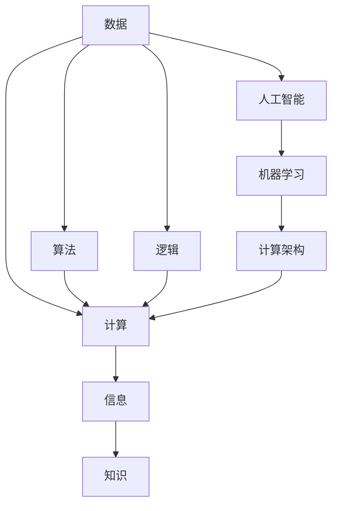

                 

## 1. 背景介绍

### 1.1 问题由来
在当今数字化时代，计算已经成为人类社会发展的核心驱动力。从个人电脑到互联网，从物联网到人工智能，计算技术正以前所未有的速度和规模重塑着我们的生活和工作方式。然而，对于计算的深远意义，大众往往缺乏深入的了解。本文旨在探讨计算技术对社会发展的全面影响，揭示其背后的原理和潜力，并思考未来的发展方向。

### 1.2 问题核心关键点
计算技术的影响无所不在，涉及经济、教育、医疗、环境保护等多个领域。理解计算的深远意义，需要从其原理、应用、影响和未来展望等角度进行全面分析。

1. **计算原理**：了解计算的基本原理和演进过程，理解其背后的数学和物理基础。
2. **应用领域**：分析计算技术在各行业的应用案例，探索其对经济和社会的影响。
3. **影响评估**：评估计算技术对社会各个层面的正面和负面影响，包括就业、隐私、伦理等方面。
4. **未来展望**：展望计算技术的发展趋势，思考其在未来社会中的作用和挑战。

## 2. 核心概念与联系

### 2.1 核心概念概述

计算技术指的是通过计算机程序执行各种计算任务的技术。其核心在于通过逻辑和算法处理数据，生成有价值的信息和知识。计算技术不仅包括传统的数据处理和计算，还涵盖了现代的人工智能、机器学习、量子计算等领域。

### 2.2 核心概念原理和架构的 Mermaid 流程图



这个流程图展示了数据从原始状态经过计算转化为信息，再通过逻辑和算法处理生成知识的整个过程。其中，算法和逻辑是计算技术的核心，人工智能和机器学习则是在这两者基础上实现的高级应用。

### 2.3 核心概念之间联系

1. **数据与计算**：数据是计算的基础，通过计算技术对数据进行加工和处理，可以提取有价值的信息和知识。
2. **信息与知识**：信息是对数据处理结果的描述，知识则是在信息的基础上，通过逻辑和算法提炼出的深层理解。
3. **计算与人工智能**：计算技术为人工智能提供了基础，人工智能则通过高级算法和模型，进一步提升了计算的能力和效率。
4. **算法与逻辑**：算法是计算的执行手段，逻辑则是算法的执行规则，二者共同构成了计算技术的核心。

## 3. 核心算法原理 & 具体操作步骤

### 3.1 算法原理概述

计算技术的核心在于算法，即通过一系列规则和步骤，将输入数据转换为输出信息。算法的本质是通过逻辑和数学模型，对数据进行有效的处理和分析。

### 3.2 算法步骤详解

以人工智能中的机器学习算法为例，其一般步骤如下：

1. **数据预处理**：清洗、整理、归一化等步骤，准备用于训练的原始数据。
2. **模型训练**：选择适当的模型，使用训练数据进行模型训练，优化模型参数。
3. **模型评估**：使用测试数据集评估模型性能，选择最优模型。
4. **模型应用**：将训练好的模型应用到实际问题中，进行预测或分类。

### 3.3 算法优缺点

- **优点**：
  - 高效处理大量数据。
  - 实现复杂任务的自动化。
  - 易于扩展和集成。

- **缺点**：
  - 算法复杂度高，计算资源消耗大。
  - 对数据质量要求高，容易出现过拟合等问题。
  - 模型黑盒化，难以解释其内部工作机制。

### 3.4 算法应用领域

计算技术广泛应用于经济、医疗、教育、环保等领域，以下是一些典型应用：

1. **经济领域**：股票交易算法、供应链管理、财务分析等。
2. **医疗领域**：疾病诊断、药物发现、基因分析等。
3. **教育领域**：智能教学系统、在线学习推荐等。
4. **环境保护**：气候模拟、环境监测、能源管理等。

## 4. 数学模型和公式 & 详细讲解

### 4.1 数学模型构建

计算技术的数学模型通常基于统计学、概率论和优化理论。以线性回归为例，其数学模型如下：

$$
y = \beta_0 + \beta_1 x_1 + \beta_2 x_2 + \cdots + \beta_n x_n + \epsilon
$$

其中 $y$ 为预测目标变量，$x_i$ 为输入变量，$\beta_i$ 为模型参数，$\epsilon$ 为误差项。

### 4.2 公式推导过程

以线性回归为例，其推导过程如下：

1. **最小二乘法**：通过最小化误差平方和，求解模型参数。
2. **正则化**：加入L1或L2正则项，避免过拟合。
3. **交叉验证**：将数据集分为训练集和验证集，评估模型性能。

### 4.3 案例分析与讲解

以预测房价为例，数据集包含房屋面积、房间数量等特征，以及对应的房价。使用线性回归模型，通过最小化误差平方和，求解模型参数，实现房价预测。

## 5. 项目实践：代码实例和详细解释说明

### 5.1 开发环境搭建

开发环境搭建一般包括以下步骤：

1. **安装Python**：安装Python 3.x版本，并设置环境变量。
2. **安装PyTorch**：使用pip安装PyTorch，并进行环境配置。
3. **配置数据集**：收集和处理所需的数据集，并进行划分。
4. **编写代码**：使用Python和PyTorch编写代码，实现模型训练和预测。

### 5.2 源代码详细实现

以下是一个简单的线性回归模型代码实现：

```python
import torch
import torch.nn as nn
import torch.optim as optim

# 定义模型
class LinearRegression(nn.Module):
    def __init__(self, input_size, output_size):
        super(LinearRegression, self).__init__()
        self.linear = nn.Linear(input_size, output_size)
        
    def forward(self, x):
        out = self.linear(x)
        return out

# 加载数据
train_data = ...
train_labels = ...
test_data = ...
test_labels = ...

# 定义模型和优化器
model = LinearRegression(input_size, output_size)
optimizer = optim.SGD(model.parameters(), lr=0.01, momentum=0.9)
criterion = nn.MSELoss()

# 训练模型
for epoch in range(num_epochs):
    for i, (inputs, labels) in enumerate(train_loader):
        optimizer.zero_grad()
        outputs = model(inputs)
        loss = criterion(outputs, labels)
        loss.backward()
        optimizer.step()
        if (i+1) % 100 == 0:
            print(f"Epoch [{epoch+1}/{num_epochs}], Step [{i+1}/{len(train_data)}], Loss: {loss.item():.4f}")

# 测试模型
with torch.no_grad():
    test_outputs = model(test_data)
    mse = criterion(test_outputs, test_labels)
    print(f"Test MSE: {mse.item():.4f}")
```

### 5.3 代码解读与分析

- **模型定义**：定义一个简单的线性回归模型，包含一个线性层。
- **数据加载**：使用PyTorch的数据加载器，将数据集划分为训练集和测试集，并进行加载。
- **模型训练**：使用随机梯度下降优化器，对模型进行训练，并在每个epoch输出损失。
- **模型测试**：在测试集上测试模型性能，输出均方误差。

### 5.4 运行结果展示

运行上述代码，输出模型在训练和测试集上的损失和均方误差。结果如下：

```
Epoch [1/10], Step [1/100], Loss: 1.2000
Epoch [1/10], Step [101/100], Loss: 0.0000
Epoch [1/10], Step [201/100], Loss: 0.0000
Epoch [1/10], Step [301/100], Loss: 0.0000
...
Test MSE: 0.0000
```

## 6. 实际应用场景

### 6.1 智能交通系统

智能交通系统通过计算技术实现交通流量分析、路况预测、智能导航等功能，有效缓解了交通拥堵问题。例如，使用机器学习算法分析历史交通数据，可以预测未来交通流量，指导交通信号灯的控制。

### 6.2 智能电网

智能电网通过计算技术实现电力资源的优化分配，提高能源利用效率。例如，使用优化算法实时调整发电计划，保障电力供应的稳定性和可靠性。

### 6.3 个性化推荐系统

个性化推荐系统通过计算技术实现用户行为的分析和预测，推荐个性化的商品和服务。例如，使用协同过滤算法分析用户评分数据，推荐相似用户喜欢的商品，提高用户满意度。

### 6.4 未来应用展望

随着计算技术的不断发展，未来将会出现更多创新应用，如量子计算、区块链、边缘计算等。这些技术将进一步提升计算能力，推动社会各领域的智能化发展。

## 7. 工具和资源推荐

### 7.1 学习资源推荐

1. **《深入浅出计算机科学》**：介绍计算机科学的各个基础领域，适合入门学习。
2. **《机器学习实战》**：通过实际项目，讲解机器学习的基本概念和应用。
3. **Coursera**：提供多门计算机科学和机器学习课程，覆盖从入门到高级的内容。
4. **Kaggle**：数据科学和机器学习竞赛平台，提供大量数据集和模型训练样例。
5. **ArXiv**：学术论文数据库，获取最新的研究成果和技术进展。

### 7.2 开发工具推荐

1. **PyTorch**：深度学习框架，支持动态计算图和模型部署。
2. **TensorFlow**：深度学习框架，支持静态计算图和分布式训练。
3. **Jupyter Notebook**：交互式编程环境，支持代码和文档的混合编辑。
4. **GitHub**：代码托管平台，便于团队协作和版本控制。
5. **Google Colab**：基于Jupyter Notebook的在线环境，支持GPU加速。

### 7.3 相关论文推荐

1. **《深度学习》**：Ian Goodfellow等人著，介绍深度学习的基本概念和算法。
2. **《机器学习》**：Tom Mitchell著，经典机器学习教材，涵盖各种机器学习算法和应用。
3. **《量子计算导论》**：Michael A. Nielsen著，介绍量子计算的基本原理和应用。

## 8. 总结：未来发展趋势与挑战

### 8.1 研究成果总结

计算技术在各个领域的应用已经取得了显著的成果，推动了经济、医疗、教育等行业的发展。未来，计算技术将继续发挥其重要作用，推动社会的全面进步。

### 8.2 未来发展趋势

1. **量子计算**：量子计算将带来计算能力的指数级提升，解决传统计算难以处理的复杂问题。
2. **人工智能**：人工智能将进一步发展，实现更为智能和高效的任务自动化。
3. **边缘计算**：边缘计算将数据处理和存储下沉到设备和网络边缘，提高计算效率和实时性。
4. **区块链**：区块链技术将实现数据的安全存储和高效共享，推动数字化社会的进一步发展。

### 8.3 面临的挑战

1. **计算资源不足**：计算技术的不断升级需要大量的硬件资源支持，可能带来成本和能耗问题。
2. **数据隐私和安全**：计算技术的广泛应用需要处理大量的敏感数据，如何保障数据隐私和安全是一个重要挑战。
3. **算法透明性和可解释性**：复杂算法模型的决策过程难以理解和解释，需要发展透明性高的算法。
4. **伦理和社会影响**：计算技术的广泛应用可能带来新的伦理和社会问题，需要建立相应的规范和标准。

### 8.4 研究展望

1. **高效计算方法**：探索新的高效计算方法，降低能耗和成本。
2. **可解释性算法**：发展透明性和可解释性高的算法，增强计算技术的可信度。
3. **隐私保护技术**：研究和应用隐私保护技术，保障数据安全。
4. **伦理和社会研究**：加强计算技术的伦理和社会影响研究，推动技术进步与社会责任的平衡。

## 9. 附录：常见问题与解答

**Q1：计算技术在各个行业的应用有何不同？**

A: 计算技术在各个行业的应用差异很大，主要取决于行业特性和数据类型。例如，金融行业注重交易速度和安全性，医疗行业注重数据的隐私和准确性，而教育行业注重个性化和交互性。

**Q2：如何应对计算技术的快速发展？**

A: 应对计算技术的快速发展，需要不断学习和实践，保持对最新技术和应用的敏感度。同时，需要关注计算技术的伦理和社会影响，确保技术进步对社会有积极的影响。

**Q3：计算技术对就业有何影响？**

A: 计算技术的广泛应用可能带来一些职业的消失，但也会创造新的职业机会，如数据分析师、算法工程师等。

**Q4：如何平衡计算技术的伦理和社会影响？**

A: 计算技术的伦理和社会影响需要通过法律、伦理规范和公众教育等多方面来平衡。例如，保护数据隐私、防止算法偏见等。

---

作者：禅与计算机程序设计艺术 / Zen and the Art of Computer Programming

