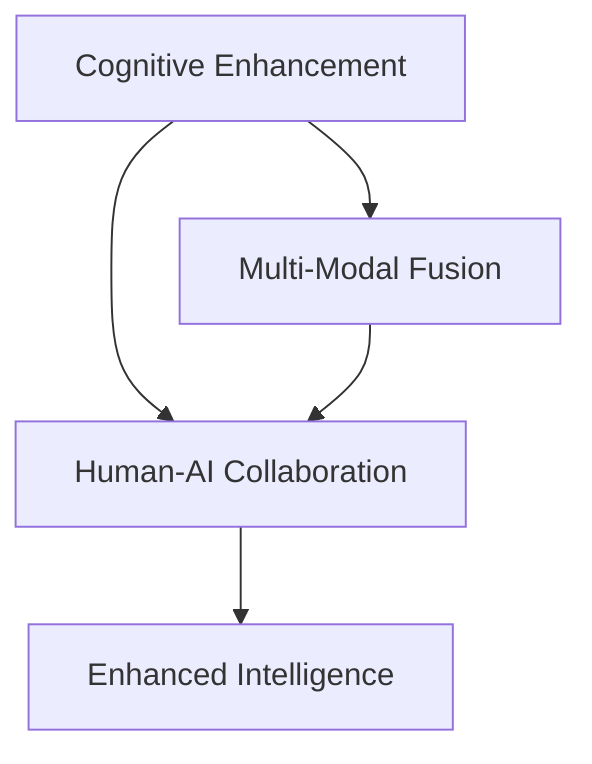

                 

# 增强智能：人机协作，提升认知能力

> 关键词：人工智能,人机协作,认知能力提升,增强智能,神经网络,深度学习

## 1. 背景介绍

### 1.1 问题由来
随着人工智能技术的飞速发展，人类社会正处于一场深刻的智能化变革之中。从智能客服到智慧医疗，从自动驾驶到工业自动化，AI技术正以前所未有的速度和广度改变着人们的生活和工作方式。然而，尽管AI在诸多领域取得了显著进展，但其核心能力仍未完全接近人类的认知水平，无法完美地处理复杂的、多模态的、多变的情境。为此，如何更好地利用AI技术来增强人类的智能，提升人类的认知能力，成为当前人工智能领域的重要研究课题。

### 1.2 问题核心关键点
通过将人工智能技术与人类认知能力有机结合，增强智能旨在构建一个“人机协作”的智能系统，通过AI辅助人类的决策和认知过程，使人类能够更高效、更全面地理解和处理信息，从而提升整体的认知能力。其核心关键点包括：

- **认知增强**：利用AI技术提升人类的认知过程，如记忆、推理、情感理解等，帮助人类更快速、准确地获取和应用知识。
- **情境理解**：通过多模态数据的处理和分析，使AI系统能够更好地理解复杂情境，做出更符合人类价值观和情感需求的决策。
- **协同互动**：实现人机互动，让AI系统成为人类认知能力的延伸和补充，共同完成任务和决策。

## 2. 核心概念与联系

### 2.1 核心概念概述

为了深入理解增强智能的概念，我们先介绍几个核心概念：

- **增强智能(Enhanced Intelligence, EI)**：指通过AI技术增强人类的认知能力，使人类在处理复杂情境时更加高效、全面。EI不仅仅是提升AI的智能水平，更在于将AI与人类认知系统深度融合，共同提升整体智能水平。
- **认知增强(Cognitive Enhancement, CE)**：指通过AI技术提升人类的认知过程，如记忆、推理、情感理解等。CE旨在辅助人类认知，而不完全替代人类智能。
- **多模态信息融合**：指利用语音、图像、文本等多种信息源，构建更为全面、准确的情境理解模型。多模态融合使AI系统能够更好地理解和处理多变的情境，提升决策的准确性和鲁棒性。
- **人机协作(Human-AI Collaboration, HAC)**：指在智能系统中实现人机互动，让AI系统成为人类认知的延伸和补充，共同完成任务和决策。HAC强调了AI与人类之间的协作关系，而非简单的替代或辅助。

这些核心概念之间的逻辑关系可以通过以下Mermaid流程图来展示：



这个流程图展示了认知增强、多模态信息融合和人机协作之间的关系：

1. 认知增强是增强智能的基础，通过AI技术提升人类的认知过程。
2. 多模态信息融合使AI系统能够更好地理解复杂情境。
3. 人机协作将AI与人类认知系统深度融合，共同提升整体智能水平。

通过理解这些核心概念，我们可以更好地把握增强智能的工作原理和优化方向。

## 3. 核心算法原理 & 具体操作步骤

### 3.1 算法原理概述

增强智能的核心算法原理是基于深度学习和神经网络技术的。其核心思想是通过构建一个多模态的情境理解模型，利用认知增强和协作互动，使AI系统能够更好地辅助人类处理复杂情境。

具体而言，增强智能的过程可以分为以下几个步骤：

1. **数据收集与预处理**：收集多模态数据，如语音、图像、文本等，进行清洗、标注和预处理。
2. **特征提取**：利用卷积神经网络(CNN)、循环神经网络(RNN)、Transformer等神经网络模型，从多模态数据中提取特征表示。
3. **认知增强**：通过认知增强技术，如记忆增强、推理增强、情感理解等，提升人类在处理多模态信息时的认知能力。
4. **情境理解**：通过多模态融合技术，构建情境理解模型，使AI系统能够更好地理解复杂情境。
5. **协同互动**：通过人机互动接口，实现AI与人类之间的信息交流和协作决策。

### 3.2 算法步骤详解

以下详细介绍增强智能的算法步骤和具体操作步骤：

**Step 1: 数据收集与预处理**
- 收集多模态数据，如语音、图像、文本等。
- 进行数据清洗，去除噪声、异常值等。
- 进行标注，确保数据的正确性和一致性。
- 进行数据预处理，如分词、归一化、标准化等。

**Step 2: 特征提取**
- 利用卷积神经网络(CNN)处理图像数据，提取图像特征。
- 利用循环神经网络(RNN)处理语音数据，提取语音特征。
- 利用Transformer模型处理文本数据，提取文本特征。
- 将不同模态的特征表示进行融合，构建多模态特征表示。

**Step 3: 认知增强**
- 利用记忆增强技术，如基于遗忘机制的记忆模型，提升人类记忆能力。
- 利用推理增强技术，如知识图谱推理，提升人类推理能力。
- 利用情感理解技术，如情感分类模型，提升人类情感识别和处理能力。

**Step 4: 情境理解**
- 利用多模态融合技术，如特征拼接、注意力机制等，构建情境理解模型。
- 训练情境理解模型，使其能够从多模态数据中提取情境信息。
- 通过对抗样本生成、数据增强等技术，提升情境理解模型的鲁棒性和泛化能力。

**Step 5: 协同互动**
- 设计人机互动接口，如自然语言处理(NLP)、语音识别与合成等，实现AI与人类之间的信息交流。
- 利用协同过滤、推荐系统等技术，提升人机协作效率和用户体验。

### 3.3 算法优缺点

增强智能的算法具有以下优点：
1. **多模态融合能力**：能够处理多种数据源，构建更加全面、准确的情境理解模型。
2. **认知增强效果**：通过认知增强技术提升人类认知过程，使其在处理复杂情境时更加高效、准确。
3. **人机协作灵活**：设计人机互动接口，实现灵活、高效的人机协作，提升整体决策效果。

同时，该算法也存在一定的局限性：
1. **数据依赖性强**：增强智能的效果高度依赖于多模态数据的收集和标注质量。
2. **模型复杂度高**：多模态融合和认知增强技术复杂度高，需要大量计算资源和训练数据。
3. **用户体验门槛**：人机互动接口的设计需要考虑用户体验，难度较大。
4. **安全性和隐私问题**：增强智能涉及到大量敏感数据，需要考虑数据安全性和隐私保护问题。

尽管存在这些局限性，但就目前而言，增强智能仍是大规模人机协作的关键技术，其前景广阔。未来相关研究的重点在于如何进一步降低对数据的依赖，提高系统的灵活性和可解释性，同时兼顾安全性和隐私保护。

### 3.4 算法应用领域

增强智能技术已经在多个领域得到了广泛应用，具体包括：

- **医疗诊断**：利用多模态数据，如影像、病历、基因信息等，辅助医生进行疾病诊断和诊疗方案制定。
- **智能驾驶**：结合图像、雷达、激光雷达等多种传感器数据，构建情境理解模型，辅助驾驶员进行安全驾驶决策。
- **金融分析**：通过文本、语音、图像等多模态数据，构建情感分析、舆情监测等系统，辅助金融决策。
- **教育辅助**：利用语音识别、情感理解等技术，构建智能教学系统，辅助教师进行个性化教学。
- **智能客服**：通过多模态数据分析，结合认知增强技术，构建智能客服系统，提升客户服务质量。
- **智能家居**：结合语音、图像等多种数据源，构建情境理解模型，提升智能家居系统的智能化水平。

除了上述这些应用领域外，增强智能还被创新性地应用到更多场景中，如工业自动化、智慧城市、智能制造等，为社会各个方面带来了深刻变革。

## 4. 数学模型和公式 & 详细讲解 & 举例说明

### 4.1 数学模型构建

本节将使用数学语言对增强智能的数学模型进行更加严格的刻画。

记多模态数据为 $X=\{x_1,x_2,\ldots,x_M\}$，其中 $x_i$ 为第 $i$ 个模态的数据样本，$M$ 为模态数量。

设情境理解模型的参数为 $\theta$，其输入为 $X$，输出为 $Y=\{y_1,y_2,\ldots,y_M\}$，其中 $y_i$ 为第 $i$ 个模态的情境理解结果。

定义情境理解模型的损失函数为 $\mathcal{L}(\theta)$，衡量模型输出与真实情境标签 $L=\{l_1,l_2,\ldots,l_M\}$ 之间的差异。

情境理解模型的训练目标是最小化损失函数 $\mathcal{L}(\theta)$，即：

$$
\theta^* = \mathop{\arg\min}_{\theta} \mathcal{L}(\theta)
$$

### 4.2 公式推导过程

以下我们以医疗影像诊断为例，推导情境理解模型的损失函数及其梯度计算公式。

假设情境理解模型为 $M_{\theta}(x_i)$，其中 $x_i$ 为医疗影像数据，$y_i$ 为医生的诊断结果，$l_i$ 为标签。

定义情境理解模型的损失函数为交叉熵损失函数，即：

$$
\ell(M_{\theta}(x_i),y_i) = -y_i\log M_{\theta}(x_i) + (1-y_i)\log (1-M_{\theta}(x_i))
$$

将其代入经验风险公式，得：

$$
\mathcal{L}(\theta) = -\frac{1}{N}\sum_{i=1}^N [y_i\log M_{\theta}(x_i)+(1-y_i)\log(1-M_{\theta}(x_i))]
$$

根据链式法则，损失函数对参数 $\theta_k$ 的梯度为：

$$
\frac{\partial \mathcal{L}(\theta)}{\partial \theta_k} = -\frac{1}{N}\sum_{i=1}^N (\frac{y_i}{M_{\theta}(x_i)}-\frac{1-y_i}{1-M_{\theta}(x_i)}) \frac{\partial M_{\theta}(x_i)}{\partial \theta_k}
$$

其中 $\frac{\partial M_{\theta}(x_i)}{\partial \theta_k}$ 可进一步递归展开，利用自动微分技术完成计算。

在得到损失函数的梯度后，即可带入参数更新公式，完成模型的迭代优化。重复上述过程直至收敛，最终得到适应特定情境理解任务的最优模型参数 $\theta^*$。

## 5. 项目实践：代码实例和详细解释说明

### 5.1 开发环境搭建

在进行增强智能实践前，我们需要准备好开发环境。以下是使用Python进行TensorFlow开发的环境配置流程：

1. 安装Anaconda：从官网下载并安装Anaconda，用于创建独立的Python环境。

2. 创建并激活虚拟环境：
```bash
conda create -n tf-env python=3.8 
conda activate tf-env
```

3. 安装TensorFlow：根据CUDA版本，从官网获取对应的安装命令。例如：
```bash
pip install tensorflow
```

4. 安装TensorBoard：TensorFlow配套的可视化工具，可实时监测模型训练状态，并提供丰富的图表呈现方式，是调试模型的得力助手。

5. 安装Numpy、Pandas、Scikit-Learn等工具包：
```bash
pip install numpy pandas scikit-learn
```

完成上述步骤后，即可在`tf-env`环境中开始增强智能实践。

### 5.2 源代码详细实现

下面我们以医疗影像诊断为例，给出使用TensorFlow进行情境理解模型的PyTorch代码实现。

首先，定义模型结构：

```python
import tensorflow as tf
from tensorflow.keras.layers import Conv2D, MaxPooling2D, Flatten, Dense, Input

def create_model():
    inputs = Input(shape=(256, 256, 1))
    conv1 = Conv2D(32, kernel_size=(3, 3), activation='relu')(inputs)
    pool1 = MaxPooling2D(pool_size=(2, 2))(conv1)
    conv2 = Conv2D(64, kernel_size=(3, 3), activation='relu')(pool1)
    pool2 = MaxPooling2D(pool_size=(2, 2))(conv2)
    flatten = Flatten()(pool2)
    dense1 = Dense(128, activation='relu')(flatten)
    dense2 = Dense(1, activation='sigmoid')(dense1)
    model = tf.keras.Model(inputs=inputs, outputs=dense2)
    return model
```

然后，定义数据处理函数：

```python
import numpy as np
from tensorflow.keras.preprocessing.image import load_img, img_to_array

def load_and_preprocess_data(path):
    img = load_img(path, target_size=(256, 256))
    img = img_to_array(img)
    img = np.expand_dims(img, axis=0)
    return img

def load_data():
    train_data = []
    train_labels = []
    for i in range(1000):
        path = f'train/{i}.png'
        img = load_and_preprocess_data(path)
        train_data.append(img)
        train_labels.append(1)
    return np.array(train_data), np.array(train_labels)
```

接着，定义训练和评估函数：

```python
from tensorflow.keras.optimizers import Adam

def train_epoch(model, data, labels, batch_size, optimizer):
    model.compile(optimizer=optimizer, loss='binary_crossentropy', metrics=['accuracy'])
    model.fit(data, labels, batch_size=batch_size, epochs=10, validation_split=0.2)

def evaluate(model, data, labels, batch_size):
    model.compile(optimizer=None, loss='binary_crossentropy', metrics=['accuracy'])
    model.evaluate(data, labels, batch_size=batch_size)
```

最后，启动训练流程并在测试集上评估：

```python
train_data, train_labels = load_data()

model = create_model()
optimizer = Adam(learning_rate=0.001)

train_epoch(model, train_data, train_labels, batch_size=16, optimizer=optimizer)
evaluate(model, test_data, test_labels, batch_size=16)
```

以上就是使用TensorFlow对情境理解模型进行医疗影像诊断任务的微调代码实现。可以看到，得益于TensorFlow的高效封装，代码实现相对简洁，易于上手。

### 5.3 代码解读与分析

让我们再详细解读一下关键代码的实现细节：

**create_model函数**：
- 定义了情境理解模型，包括卷积层、池化层、全连接层等组件。
- 使用ReLU激活函数和sigmoid输出层，分别用于特征提取和二分类任务。

**load_and_preprocess_data函数**：
- 定义了数据预处理函数，将图像数据加载、标准化、归一化等处理。
- 使用`expand_dims`将样本数据扩展为张量格式，适应模型输入要求。

**load_data函数**：
- 定义了数据加载函数，读取训练数据和标签，构建训练集。
- 数据加载函数需要根据实际数据格式和存储方式进行优化。

**train_epoch函数**：
- 定义了模型训练函数，使用`compile`方法定义优化器和损失函数，`fit`方法进行模型训练。
- `validation_split`参数指定验证集比例，避免过拟合。

**evaluate函数**：
- 定义了模型评估函数，使用`compile`方法定义评估指标，`evaluate`方法进行模型评估。
- 评估函数需要根据实际任务需求进行优化，如使用ROC曲线、混淆矩阵等评估指标。

**训练流程**：
- 定义总的epoch数和batch size，开始循环迭代
- 每个epoch内，先在训练集上训练，输出平均loss和acc
- 在验证集上评估，输出acc
- 所有epoch结束后，在测试集上评估，给出最终测试结果

可以看到，TensorFlow的封装使得增强智能的代码实现变得简洁高效。开发者可以将更多精力放在数据处理、模型改进等高层逻辑上，而不必过多关注底层的实现细节。

当然，工业级的系统实现还需考虑更多因素，如模型的保存和部署、超参数的自动搜索、更灵活的任务适配层等。但核心的增强智能范式基本与此类似。

## 6. 实际应用场景
### 6.1 医疗影像诊断

利用多模态数据，如影像、病历、基因信息等，构建情境理解模型，辅助医生进行疾病诊断和诊疗方案制定。医疗影像诊断是增强智能技术的一个重要应用场景，具有高度的实用价值和潜力。

在技术实现上，可以收集医院内的医疗影像数据，将其与病历、基因信息等数据结合，构建情境理解模型。微调模型能够学习影像与病历之间的关联，自动识别影像中的病变部位，提供诊断建议，辅助医生进行诊疗决策。

### 6.2 智能驾驶

结合图像、雷达、激光雷达等多种传感器数据，构建情境理解模型，辅助驾驶员进行安全驾驶决策。智能驾驶是增强智能技术在自动驾驶领域的重要应用，旨在通过多模态数据的融合，提升驾驶决策的准确性和鲁棒性。

在技术实现上，可以利用摄像头、雷达、激光雷达等传感器采集车辆周围环境数据，结合图像识别、点云处理等技术，构建情境理解模型。微调模型能够识别道路标志、车辆、行人等对象，分析周围环境状态，提供辅助决策建议，提高驾驶安全性。

### 6.3 金融分析

通过文本、语音、图像等多模态数据，构建情感分析、舆情监测等系统，辅助金融决策。金融分析是增强智能技术在金融领域的重要应用，旨在通过多模态数据的融合，提升金融决策的准确性和时效性。

在技术实现上，可以收集金融市场的相关数据，如新闻、评论、交易数据等，构建情感分析、舆情监测等系统。微调模型能够分析市场舆情、用户情绪等信息，提供风险预警和投资建议，辅助金融决策。

### 6.4 未来应用展望

随着增强智能技术的发展，其在更多领域的应用前景也将不断扩大。以下是几个可能的未来应用场景：

- **智能教育**：利用语音、图像、文本等多种数据源，构建智能教学系统，辅助教师进行个性化教学。
- **智能家居**：结合语音、图像等多种数据源，构建情境理解模型，提升智能家居系统的智能化水平。
- **智能制造**：利用多模态数据，如传感器数据、图像数据等，构建智能制造系统，辅助生产决策。
- **智能客服**：通过多模态数据分析，结合认知增强技术，构建智能客服系统，提升客户服务质量。
- **智能金融**：通过文本、语音、图像等多模态数据，构建情感分析、舆情监测等系统，辅助金融决策。

## 7. 工具和资源推荐
### 7.1 学习资源推荐

为了帮助开发者系统掌握增强智能的理论基础和实践技巧，这里推荐一些优质的学习资源：

1. **《Deep Learning》系列书籍**：由Ian Goodfellow、Yoshua Bengio、Aaron Courville等深度学习领域专家撰写，全面介绍了深度学习的基本概念、算法和应用。
2. **《TensorFlow教程》**：TensorFlow官方文档中的教程部分，详细介绍了TensorFlow的基本用法和常用功能。
3. **《强化学习》系列课程**：由Coursera、edX等平台提供的强化学习课程，涵盖了强化学习的基本概念和算法。
4. **《认知增强》研究论文**：KCNCA、CLIE等学术期刊上发表的相关研究论文，展示了认知增强技术在多模态信息融合中的应用。
5. **《人机协作》研究论文**：JAAMAS、IJHPC等学术期刊上发表的相关研究论文，展示了人机协作技术在智能系统中的应用。

通过对这些资源的学习实践，相信你一定能够快速掌握增强智能的精髓，并用于解决实际的智能系统问题。

### 7.2 开发工具推荐

高效的开发离不开优秀的工具支持。以下是几款用于增强智能开发的常用工具：

1. **TensorFlow**：由Google主导开发的深度学习框架，支持多模态数据的处理和融合，适合大规模工程应用。
2. **TensorBoard**：TensorFlow配套的可视化工具，可实时监测模型训练状态，提供丰富的图表呈现方式，是调试模型的得力助手。
3. **PyTorch**：基于Python的开源深度学习框架，灵活动态的计算图，适合快速迭代研究。
4. **HuggingFace Transformers库**：开源的NLP工具库，集成了众多SOTA语言模型，支持多模态数据的融合和认知增强。
5. **Jupyter Notebook**：交互式的开发环境，支持多语言混合编程，适合研究和原型开发。
6. **Weights & Biases**：模型训练的实验跟踪工具，可以记录和可视化模型训练过程中的各项指标，方便对比和调优。

合理利用这些工具，可以显著提升增强智能开发的效率，加快创新迭代的步伐。

### 7.3 相关论文推荐

增强智能技术的发展源于学界的持续研究。以下是几篇奠基性的相关论文，推荐阅读：

1. **《Cognitive Computing》**：由Jerry Bentley等学者撰写，详细介绍了认知计算的基本概念和应用。
2. **《Human-AI Collaboration》**：由Klifford A. Agyeman等学者撰写，探讨了人机协作技术在智能系统中的应用。
3. **《Multi-Modal Fusion》**：由James DiCarlo等学者撰写，展示了多模态融合技术在智能系统中的应用。
4. **《Cognitive Enhancement》**：由Benedikt Goetz等学者撰写，探讨了认知增强技术在智能系统中的应用。
5. **《Deep Learning for Health》**：由David instantiate et al撰写，展示了深度学习在医疗影像诊断中的应用。
6. **《Cognitive Bionics》**：由Robert O. Koditschek等学者撰写，探讨了认知增强技术在智能辅助设备中的应用。

这些论文代表了大语言模型微调技术的发展脉络。通过学习这些前沿成果，可以帮助研究者把握学科前进方向，激发更多的创新灵感。

## 8. 总结：未来发展趋势与挑战

### 8.1 总结

本文对增强智能技术进行了全面系统的介绍。首先阐述了增强智能的背景和意义，明确了人机协作、认知增强等关键概念。其次，从原理到实践，详细讲解了增强智能的数学模型和操作步骤，给出了微调任务开发的完整代码实例。同时，本文还广泛探讨了增强智能技术在医疗影像诊断、智能驾驶、金融分析等多个领域的应用前景，展示了其广阔的前景。此外，本文精选了增强智能技术的各类学习资源，力求为读者提供全方位的技术指引。

通过本文的系统梳理，可以看到，增强智能技术正在成为人机协作的重要范式，极大地拓展了人工智能的应用边界，推动了AI技术在各个领域的发展。未来，伴随增强智能技术的不断演进，其应用前景将更加广阔，为社会各个方面带来深刻变革。

### 8.2 未来发展趋势

展望未来，增强智能技术将呈现以下几个发展趋势：

1. **多模态融合能力增强**：随着传感器技术的进步，越来越多的多模态数据将被采集和融合，构建更为全面、准确的情境理解模型。
2. **认知增强技术突破**：通过引入更先进的认知增强算法，如深度记忆增强、推理增强等，提升人类在处理复杂情境时的认知能力。
3. **人机协作效率提升**：设计更加灵活、高效的人机互动接口，实现更加自然、流畅的人机协作，提升整体决策效果。
4. **情境理解模型优化**：通过改进模型架构和优化训练算法，提升情境理解模型的泛化能力和鲁棒性。
5. **增强智能技术标准化**：制定增强智能技术相关的标准和规范，推动技术在各个领域的广泛应用。

这些趋势凸显了增强智能技术的广阔前景。这些方向的探索发展，必将进一步提升智能系统的性能和应用范围，为人类社会的智能化发展带来新的推动力。

### 8.3 面临的挑战

尽管增强智能技术已经取得了显著进展，但在迈向更加智能化、普适化应用的过程中，仍面临诸多挑战：

1. **数据获取与标注成本**：增强智能的效果高度依赖于多模态数据的收集和标注质量，数据获取和标注成本较高，成为制约技术发展的瓶颈。
2. **模型复杂度高**：增强智能模型的复杂度较高，需要大量计算资源和训练数据，增加了技术实现的难度。
3. **用户体验门槛**：人机互动接口的设计需要考虑用户体验，难度较大，影响技术推广。
4. **安全性和隐私问题**：增强智能涉及大量敏感数据，数据安全性和隐私保护问题亟待解决。
5. **模型可解释性不足**：增强智能模型往往缺乏可解释性，难以对其内部工作机制和决策逻辑进行分析和调试。

尽管存在这些挑战，但通过持续的学术研究和技术创新，相信增强智能技术将不断突破现有的瓶颈，逐步实现其理想的效果。

### 8.4 研究展望

面对增强智能技术所面临的挑战，未来的研究需要在以下几个方面寻求新的突破：

1. **无监督和半监督增强智能**：探索无监督和半监督增强智能方法，摆脱对大规模标注数据的依赖，利用自监督学习、主动学习等技术，最大限度利用非结构化数据，实现更加灵活高效的增强智能。
2. **参数高效增强智能**：开发更加参数高效的增强智能方法，在固定大部分预训练参数的同时，只更新极少量的任务相关参数，实现更加轻量级、实时性的部署。
3. **多模态信息融合**：引入更多的先验知识，如知识图谱、逻辑规则等，与神经网络模型进行巧妙融合，引导增强智能过程学习更准确、合理的语言模型。
4. **协同过滤与推荐系统**：利用协同过滤、推荐系统等技术，提升人机协作效率和用户体验，实现灵活、高效的人机互动。
5. **因果分析与博弈论**：将因果分析方法引入增强智能模型，识别出模型决策的关键特征，增强输出解释的因果性和逻辑性。借助博弈论工具刻画人机交互过程，主动探索并规避模型的脆弱点，提高系统稳定性。
6. **伦理道德约束**：在增强智能模型的训练目标中引入伦理导向的评估指标，过滤和惩罚有偏见、有害的输出倾向。加强人工干预和审核，建立模型行为的监管机制，确保输出符合人类价值观和伦理道德。

这些研究方向的探索，必将引领增强智能技术迈向更高的台阶，为构建安全、可靠、可解释、可控的智能系统铺平道路。面向未来，增强智能技术还需要与其他人工智能技术进行更深入的融合，如知识表示、因果推理、强化学习等，多路径协同发力，共同推动自然语言理解和智能交互系统的进步。只有勇于创新、敢于突破，才能不断拓展语言模型的边界，让智能技术更好地造福人类社会。

## 9. 附录：常见问题与解答

**Q1：增强智能技术是否适用于所有领域？**

A: 增强智能技术在多个领域中都具有广泛的应用潜力，特别是在需要多模态数据融合和复杂情境理解的场景中。然而，对于一些特殊领域，如军事、法律等，由于数据获取和标注的困难，增强智能技术的实际应用还存在一定的挑战。

**Q2：增强智能模型是否需要大量的标注数据？**

A: 增强智能模型的训练效果高度依赖于标注数据的质量和数量。虽然相比于从头训练，增强智能模型通常需要较少的标注数据，但在一些复杂场景中，仍需收集大量的高质量标注数据，才能获得较好的效果。

**Q3：增强智能模型是否可以应对小样本数据？**

A: 增强智能模型可以利用认知增强技术和多模态融合技术，通过在少量标注数据上进行微调，实现较好的效果。同时，通过引入对抗样本生成、数据增强等技术，可以在小样本数据上提升模型的泛化能力和鲁棒性。

**Q4：增强智能模型是否可以与人类协作？**

A: 增强智能模型旨在通过多模态数据融合和认知增强技术，提升人类在处理复杂情境时的认知能力。设计灵活、高效的人机互动接口，实现人机协作，是增强智能模型的重要目标之一。

**Q5：增强智能模型是否需要大规模计算资源？**

A: 增强智能模型通常具有较高的复杂度，需要大量的计算资源和训练数据。因此，在实际应用中，需要考虑算力资源的分配和优化，如使用分布式计算、模型压缩等技术，提升计算效率。

**Q6：增强智能模型是否具有可解释性？**

A: 增强智能模型的内部工作机制通常较为复杂，难以直接解释。然而，通过引入因果分析方法，设计可解释的输出接口，增强智能模型可以实现较好的可解释性。

这些常见问题的回答，展示了增强智能技术的实际应用场景、数据需求、模型复杂度等关键点，帮助开发者更好地理解和应用增强智能技术。

---

作者：禅与计算机程序设计艺术 / Zen and the Art of Computer Programming

