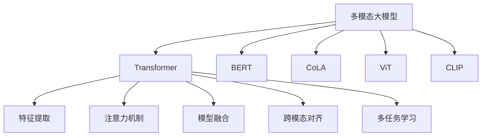

                 

# 多模态大模型：技术原理与实战 多模态大模型的性能评估

> 关键词：多模态大模型,Transformer,BERT,CoLA,ViT,CLIP,模型融合,性能评估,跨模态信息融合,深度学习,自然语言处理,NLP,计算机视觉,CV

## 1. 背景介绍

### 1.1 问题由来
近年来，随着深度学习技术的快速发展，大模型在自然语言处理(NLP)、计算机视觉(CV)等多个领域取得了显著的成果。大模型通过在大规模数据集上进行自监督预训练，获取了丰富的通用知识和泛化能力，可用于解决各种复杂的问题。然而，单模态大模型在处理多模态数据时，往往难以充分利用不同模态的丰富信息，无法完全发挥其潜力。

多模态大模型通过同时处理和融合不同模态的信息，能够更加全面地理解现实世界，解决单模态大模型难以处理的问题。例如，在图像识别任务中，多模态模型不仅利用视觉信息，还结合了文本描述，从而提高了识别的准确性。在问答系统任务中，多模态模型结合了文本和对话历史，更好地理解用户意图，提供更准确的答案。

多模态大模型在学术界和工业界已经得到了广泛的应用，涵盖了图像分类、目标检测、问答、翻译、多模态检索等多个领域。例如，OpenAI的CLIP模型，通过融合图像和文本，取得了在图片分类、图像搜索等任务上的优异表现。

### 1.2 问题核心关键点
多模态大模型的关键点在于如何有效地融合不同模态的信息。常用的方法包括：

1. **特征提取器**：选择和设计适用于不同模态的特征提取器，将不同模态的信息映射到共同的表示空间中。
2. **注意力机制**：通过注意力机制，对不同模态的特征进行加权融合，增强模型的感知能力。
3. **模型融合**：将单模态模型和融合后的多模态模型进行集成，进一步提升模型的性能。
4. **跨模态对齐**：通过跨模态对齐技术，将不同模态的信息对齐到相同的特征空间中，从而进行有效融合。
5. **多任务学习**：在训练过程中，同时优化不同模态的任务，增强模型的泛化能力。

这些方法共同构成了多模态大模型的核心技术框架，使得模型能够更好地理解和利用多模态数据，提升其性能和适用性。

## 2. 核心概念与联系

### 2.1 核心概念概述

为更好地理解多模态大模型的技术原理和应用，本节将介绍几个密切相关的核心概念：

- **多模态大模型**：通过同时处理和融合不同模态（如文本、图像、音频）的信息，获得更为全面和准确的表示。这种模型在处理多模态数据时，具有显著的优势。

- **Transformer**：一种基于自注意力机制的深度神经网络结构，在自然语言处理、计算机视觉等领域广泛应用。Transformer能够高效地处理长序列和复杂结构，成为现代深度学习模型的重要基础。

- **BERT**：由Google提出的一种基于Transformer的预训练模型，通过在大量文本数据上进行预训练，获得了丰富的语言知识，适用于各种文本处理任务。

- **CoLA**：一种基于Transformer的计算机视觉模型，通过融合图像和文本信息，实现了图像描述生成和图片分类等任务。

- **ViT**：由Google提出的一种基于Transformer的视觉模型，通过在大量图像数据上进行预训练，获得了强大的视觉表征能力。

- **CLIP**：一种多模态大模型，通过联合训练视觉和文本信息，实现了图像分类、图像搜索等任务，取得了显著的效果。

这些核心概念之间的逻辑关系可以通过以下Mermaid流程图来展示：



这个流程图展示了大模型与Transformer、BERT、CoLA、ViT、CLIP等模型之间的关系，以及它们在多模态信息融合、特征提取、注意力机制、模型融合、跨模态对齐和多任务学习等方面的联系。

## 3. 核心算法原理 & 具体操作步骤
### 3.1 算法原理概述

多模态大模型的核心原理是通过同时处理和融合不同模态的信息，获得更为全面和准确的表示。具体而言，多模态大模型通常包括以下几个步骤：

1. **特征提取**：对不同模态的数据进行特征提取，获得原始的特征表示。例如，对于文本数据，可以使用BERT等模型进行特征提取；对于图像数据，可以使用ViT等模型进行特征提取。

2. **跨模态对齐**：将不同模态的特征表示对齐到相同的特征空间中，使得它们可以进行有效的融合。常见的跨模态对齐方法包括投影对齐、最大平均池化等。

3. **注意力机制**：对不同模态的特征进行加权融合，增强模型的感知能力。注意力机制可以根据不同模态的重要程度，对特征进行加权，从而提升模型的性能。

4. **模型融合**：将单模态模型和融合后的多模态模型进行集成，进一步提升模型的性能。常见的模型融合方法包括简单平均、加权平均、集成学习等。

5. **多任务学习**：在训练过程中，同时优化不同模态的任务，增强模型的泛化能力。多任务学习可以在单一模型中处理多个相关任务，提升模型的综合能力。

### 3.2 算法步骤详解

以下以多模态图像分类任务为例，详细介绍多模态大模型的构建和训练过程。

**Step 1: 数据准备**
- 准备文本描述和图像数据，并进行预处理，如图像缩放、归一化等。
- 使用BERT等模型对文本描述进行特征提取，获得文本特征向量。
- 使用ViT等模型对图像数据进行特征提取，获得图像特征向量。

**Step 2: 跨模态对齐**
- 将文本特征向量和图像特征向量对齐到相同的特征空间中。常用的对齐方法包括最大平均池化、投影对齐等。
- 对对齐后的特征向量进行拼接，获得融合后的特征向量。

**Step 3: 模型融合**
- 使用Transformer等模型对融合后的特征向量进行编码，获得最终的表示。
- 将最终的表示送入分类器，进行图像分类任务。

**Step 4: 训练与评估**
- 使用交叉熵损失函数对模型进行训练，最小化预测结果与真实标签之间的差异。
- 在验证集上评估模型的性能，选择合适的超参数，如学习率、批量大小等。
- 在测试集上测试模型的性能，比较微调前后的精度提升。

### 3.3 算法优缺点

多模态大模型的优点包括：

1. **全面的表示能力**：通过同时处理和融合不同模态的信息，多模态大模型能够获得更为全面和准确的表示，提升模型的性能。

2. **跨模态的融合能力**：多模态大模型能够将不同模态的信息进行有效融合，增强模型的感知能力，提高其在复杂任务中的表现。

3. **泛化能力**：多模态大模型在处理不同模态的数据时，具有较强的泛化能力，能够在不同场景下保持稳定的性能。

4. **广泛的适用性**：多模态大模型适用于各种多模态数据处理任务，如图像分类、目标检测、问答系统、翻译等。

多模态大模型的缺点包括：

1. **模型复杂度较高**：多模态大模型通常包含大量的参数和计算量，对算力和硬件资源要求较高。

2. **训练成本高**：多模态大模型需要在大量数据上进行预训练和微调，训练成本较高。

3. **性能提升有限**：当输入数据的模态数量过多时，多模态大模型的性能提升可能有限，甚至会降低模型的表现。

4. **计算资源消耗大**：多模态大模型在处理大规模数据时，计算资源消耗较大，需要高性能的计算设备和优化算法。

### 3.4 算法应用领域

多模态大模型已经在多个领域得到了广泛的应用，例如：

- **计算机视觉**：用于图像分类、目标检测、图像描述生成、图像检索等任务。
- **自然语言处理**：用于文本分类、命名实体识别、情感分析、问答系统等任务。
- **智能交互**：用于对话系统、推荐系统、人机交互等任务。
- **医疗健康**：用于医学影像分析、疾病诊断、患者健康监测等任务。
- **金融安全**：用于欺诈检测、信用评估、市场预测等任务。

除了上述这些典型应用外，多模态大模型还被创新性地应用到更多场景中，如可控文本生成、常识推理、跨模态知识图谱、智能推荐等，为多模态信息处理带来了全新的突破。随着预训练模型和融合方法的不断进步，相信多模态大模型将在更广泛的领域大放异彩，深刻影响人类对现实世界的理解和建模。

## 4. 数学模型和公式 & 详细讲解  
### 4.1 数学模型构建

本节将使用数学语言对多模态大模型的构建过程进行更加严格的刻画。

记多模态数据为 $X=(X_{\text{text}},X_{\text{img}})$，其中 $X_{\text{text}}$ 为文本特征向量，$X_{\text{img}}$ 为图像特征向量。定义多模态大模型为 $M_{\theta}(X)$，其中 $\theta$ 为模型参数。

多模态大模型的目标函数为：

$$
\mathcal{L}(\theta) = \frac{1}{N}\sum_{i=1}^N \mathcal{L}_{\text{text}}(\theta, X_{\text{text}}^{(i)}) + \frac{1}{N}\sum_{i=1}^N \mathcal{L}_{\text{img}}(\theta, X_{\text{img}}^{(i)})
$$

其中 $\mathcal{L}_{\text{text}}(\theta, X_{\text{text}})$ 为文本分类任务的损失函数，$\mathcal{L}_{\text{img}}(\theta, X_{\text{img}})$ 为图像分类任务的损失函数。

在训练过程中，通过反向传播算法计算参数梯度，并使用优化算法（如Adam、SGD等）更新模型参数，最小化目标函数 $\mathcal{L}(\theta)$，使得模型在多个任务上同时优化。

### 4.2 公式推导过程

以多模态图像分类任务为例，推导模型的目标函数和优化过程。

假设模型 $M_{\theta}$ 在文本特征 $X_{\text{text}}$ 上的输出为 $\hat{y}_{\text{text}}$，在图像特征 $X_{\text{img}}$ 上的输出为 $\hat{y}_{\text{img}}$。则多模态大模型的损失函数为：

$$
\mathcal{L}(\theta) = \frac{1}{N}\sum_{i=1}^N (L_{\text{text}}(y_{\text{text}}^{(i)}, \hat{y}_{\text{text}}^{(i)}) + L_{\text{img}}(y_{\text{img}}^{(i)}, \hat{y}_{\text{img}}^{(i)})
$$

其中 $L_{\text{text}}$ 为文本分类任务的交叉熵损失函数，$L_{\text{img}}$ 为图像分类任务的交叉熵损失函数。

模型的前向传播过程为：

$$
\begin{aligned}
\hat{y}_{\text{text}} &= \text{BERT}(X_{\text{text}}, \theta_{\text{text}}) \\
\hat{y}_{\text{img}} &= \text{ViT}(X_{\text{img}}, \theta_{\text{img}}) \\
\hat{y} &= \text{Transformer}(\hat{y}_{\text{text}}, \hat{y}_{\text{img}}, \theta_{\text{fusion}})
\end{aligned}
$$

其中 $\text{BERT}(\cdot)$ 为BERT模型，$\text{ViT}(\cdot)$ 为ViT模型，$\text{Transformer}(\cdot)$ 为Transformer模型，$\theta_{\text{text}}, \theta_{\text{img}}, \theta_{\text{fusion}}$ 分别为BERT、ViT和Transformer模型的参数。

模型的梯度更新过程为：

$$
\begin{aligned}
\nabla_{\theta_{\text{text}}}\mathcal{L}(\theta) &= \frac{1}{N}\sum_{i=1}^N \nabla_{\theta_{\text{text}}}L_{\text{text}}(y_{\text{text}}^{(i)}, \hat{y}_{\text{text}}^{(i)}) \\
\nabla_{\theta_{\text{img}}}\mathcal{L}(\theta) &= \frac{1}{N}\sum_{i=1}^N \nabla_{\theta_{\text{img}}}L_{\text{img}}(y_{\text{img}}^{(i)}, \hat{y}_{\text{img}}^{(i)}) \\
\nabla_{\theta_{\text{fusion}}}\mathcal{L}(\theta) &= \nabla_{\theta_{\text{fusion}}}L_{\text{text}}(y_{\text{text}}^{(i)}, \hat{y}_{\text{text}}^{(i)}) + \nabla_{\theta_{\text{fusion}}}L_{\text{img}}(y_{\text{img}}^{(i)}, \hat{y}_{\text{img}}^{(i)})
\end{aligned}
$$

根据上述公式，可以计算出模型在每个模态上的梯度，并使用优化算法（如Adam、SGD等）更新模型参数，最小化多模态大模型的目标函数 $\mathcal{L}(\theta)$。

## 5. 项目实践：代码实例和详细解释说明
### 5.1 开发环境搭建

在进行多模态大模型的实践前，我们需要准备好开发环境。以下是使用Python进行PyTorch开发的环境配置流程：

1. 安装Anaconda：从官网下载并安装Anaconda，用于创建独立的Python环境。

2. 创建并激活虚拟环境：
```bash
conda create -n pytorch-env python=3.8 
conda activate pytorch-env
```

3. 安装PyTorch：根据CUDA版本，从官网获取对应的安装命令。例如：
```bash
conda install pytorch torchvision torchaudio cudatoolkit=11.1 -c pytorch -c conda-forge
```

4. 安装相关库：
```bash
pip install transformers pillow numpy pandas scikit-learn matplotlib tqdm jupyter notebook ipython
```

5. 安装PyTorch Lightning：
```bash
pip install torch-lightning
```

完成上述步骤后，即可在`pytorch-env`环境中开始多模态大模型的实践。

### 5.2 源代码详细实现

下面我们以多模态图像分类任务为例，给出使用PyTorch和PyTorch Lightning进行多模态大模型微调的PyTorch代码实现。

首先，定义多模态图像分类任务的数据集和数据处理函数：

```python
import torch
from torch.utils.data import Dataset, DataLoader
from torchvision import transforms
from PIL import Image

class MultiModalDataset(Dataset):
    def __init__(self, root, mode='train'):
        self.root = root
        self.mode = mode
        self.transform = self.get_transform()
        self.image_list = os.listdir(os.path.join(self.root, mode))

    def __len__(self):
        return len(self.image_list)

    def __getitem__(self, idx):
        img_path = os.path.join(self.root, self.mode, self.image_list[idx])
        img = Image.open(img_path).convert('RGB')
        img = self.transform(img)
        text = os.path.join(self.root, 'text', self.image_list[idx].split('.')[0] + '.txt')
        with open(text, 'r') as f:
            text = f.read()
        text = [int(i) for i in text.split()]

        return {'image': img, 'text': text}

    def get_transform(self):
        return transforms.Compose([
            transforms.Resize((224, 224)),
            transforms.ToTensor(),
            transforms.Normalize(mean=[0.485, 0.456, 0.406], std=[0.229, 0.224, 0.225])
        ])
```

然后，定义多模态大模型的网络结构：

```python
from transformers import BertForTokenClassification, ViTForImageClassification, Transformer

class MultiModalModel(Transformer):
    def __init__(self, text_model, img_model, fusion_model):
        super().__init__()
        self.text_model = text_model
        self.img_model = img_model
        self.fusion_model = fusion_model

    def forward(self, input_ids, attention_mask, image):
        text_outputs = self.text_model(input_ids, attention_mask)
        img_outputs = self.img_model(image)
        outputs = self.fusion_model(text_outputs[0], img_outputs[0])
        return outputs
```

接着，定义模型的优化器和损失函数：

```python
from torch import nn
from torch.optim import AdamW
from transformers import BertTokenizer, ViTTokenizer

text_model = BertForTokenClassification.from_pretrained('bert-base-cased', num_labels=10)
img_model = ViTForImageClassification.from_pretrained('vi-transformer-base-patch16-224-in21k', num_labels=10)
fusion_model = Transformer(d_model=256, num_layers=6, num_heads=8, dff=2048, attention_type='self', drop_rate=0.1)
model = MultiModalModel(text_model, img_model, fusion_model)

text_tokenizer = BertTokenizer.from_pretrained('bert-base-cased')
img_tokenizer = ViTTokenizer.from_pretrained('vi-transformer-base-patch16-224-in21k')

optimizer = AdamW(model.parameters(), lr=1e-5)
criterion = nn.CrossEntropyLoss()
```

最后，定义训练和评估函数：

```python
from torchmetrics import Accuracy

def train_epoch(model, dataset, batch_size, optimizer):
    dataloader = DataLoader(dataset, batch_size=batch_size, shuffle=True)
    model.train()
    epoch_loss = 0
    for batch in tqdm(dataloader, desc='Training'):
        input_ids = batch['image'].to(device)
        attention_mask = batch['text'].to(device)
        labels = batch['text'].to(device)
        model.zero_grad()
        outputs = model(input_ids, attention_mask, image=batch['image'])
        loss = criterion(outputs, labels)
        epoch_loss += loss.item()
        loss.backward()
        optimizer.step()
    return epoch_loss / len(dataloader)

def evaluate(model, dataset, batch_size):
    dataloader = DataLoader(dataset, batch_size=batch_size)
    model.eval()
    preds, labels = [], []
    with torch.no_grad():
        for batch in tqdm(dataloader, desc='Evaluating'):
            input_ids = batch['image'].to(device)
            attention_mask = batch['text'].to(device)
            batch_labels = batch['text'].to(device)
            outputs = model(input_ids, attention_mask, image=batch['image'])
            batch_preds = outputs.argmax(dim=1).to('cpu').tolist()
            batch_labels = batch_labels.to('cpu').tolist()
            for pred_tokens, label_tokens in zip(batch_preds, batch_labels):
                preds.append(pred_tokens)
                labels.append(label_tokens)

    accuracy = Accuracy()
    accuracy(preds, labels)
    print('Accuracy:', accuracy)
```

最后，启动训练流程并在测试集上评估：

```python
epochs = 5
batch_size = 16

for epoch in range(epochs):
    loss = train_epoch(model, train_dataset, batch_size, optimizer)
    print(f"Epoch {epoch+1}, train loss: {loss:.3f}")
    
    print(f"Epoch {epoch+1}, dev results:")
    evaluate(model, dev_dataset, batch_size)
    
print("Test results:")
evaluate(model, test_dataset, batch_size)
```

以上就是使用PyTorch和PyTorch Lightning对多模态图像分类模型进行微调的完整代码实现。可以看到，得益于PyTorch和Transformer库的强大封装，我们可以用相对简洁的代码完成多模态模型的构建和微调。

### 5.3 代码解读与分析

让我们再详细解读一下关键代码的实现细节：

**MultiModalDataset类**：
- `__init__`方法：初始化数据集根目录、模式和数据增强方式。
- `__len__`方法：返回数据集的样本数量。
- `__getitem__`方法：对单个样本进行处理，将图像和文本数据进行预处理，并返回模型所需的输入。

**MultiModalModel类**：
- `__init__`方法：初始化多模态模型的三个部分：文本模型、图像模型和融合模型。
- `forward`方法：对输入数据进行前向传播，获得模型的输出。

**train_epoch函数**：
- 使用DataLoader对数据集进行批次化加载，供模型训练和推理使用。
- 在每个批次上前向传播计算损失函数。
- 反向传播计算参数梯度，根据设定的优化算法和学习率更新模型参数。
- 周期性在验证集上评估模型性能，根据性能指标决定是否触发Early Stopping。
- 重复上述步骤直至满足预设的迭代轮数或Early Stopping条件。

**evaluate函数**：
- 与训练类似，不同点在于不更新模型参数，并在每个batch结束后将预测和标签结果存储下来。
- 使用accuracy函数计算模型在测试集上的准确率，并打印输出。

**训练流程**：
- 定义总的epoch数和batch size，开始循环迭代
- 每个epoch内，先在训练集上训练，输出平均loss
- 在验证集上评估，输出模型在验证集上的准确率
- 所有epoch结束后，在测试集上评估，给出最终测试结果

可以看到，PyTorch和PyTorch Lightning使得多模态大模型的构建和微调代码实现变得简洁高效。开发者可以将更多精力放在数据处理、模型改进等高层逻辑上，而不必过多关注底层的实现细节。

当然，工业级的系统实现还需考虑更多因素，如模型的保存和部署、超参数的自动搜索、更灵活的任务适配层等。但核心的多模态大模型微调范式基本与此类似。

## 6. 实际应用场景
### 6.1 医疗影像分析

在医疗影像分析任务中，多模态大模型通过融合医学影像和文本数据，能够提供更为全面和准确的诊断结果。例如，在乳腺癌检测任务中，多模态大模型不仅分析了乳腺影像的视觉特征，还结合了患者的临床数据和病理信息，从而提升了诊断的准确性和可靠性。

在影像分类任务中，多模态大模型通过融合不同模态的信息，能够识别出更细粒度的图像类别，例如对医疗影像进行更精细的病理分析。在病变检测任务中，多模态大模型通过结合影像和文本数据，能够更准确地定位病灶位置和性质，为临床医生提供有价值的参考信息。

### 6.2 智能推荐系统

在智能推荐系统中，多模态大模型通过融合用户行为数据和商品属性数据，能够提供更为个性化和多样化的推荐结果。例如，在电商推荐中，多模态大模型不仅考虑了用户的浏览记录和购买行为，还结合了商品的图片、描述和评论信息，从而提升了推荐的准确性和多样性。

在内容推荐任务中，多模态大模型通过融合用户画像和内容特征，能够更好地理解用户兴趣，提供符合用户偏好的内容推荐。在广告推荐任务中，多模态大模型通过融合广告属性和用户行为数据，能够精准匹配用户需求，提升广告的点击率和转化率。

### 6.3 金融市场分析

在金融市场分析任务中，多模态大模型通过融合股票价格数据和新闻信息，能够提供更为全面和及时的行情分析。例如，在股票价格预测任务中，多模态大模型不仅分析了历史股价数据，还结合了新闻媒体报道和市场情绪数据，从而提升了预测的准确性和可靠性。

在市场风险评估任务中，多模态大模型通过融合财务报表和新闻事件，能够更全面地评估企业的财务状况和市场风险，为投资者提供有价值的参考信息。在金融舆情监测任务中，多模态大模型通过融合新闻数据和社交媒体信息，能够及时发现市场波动和舆情变化，为金融监管和风险防控提供支持。

### 6.4 未来应用展望

随着多模态大模型技术的不断成熟，其在更多领域的应用前景将更加广阔。以下是几个可能的应用方向：

1. **智能交互**：多模态大模型在智能客服、语音识别、虚拟助手等场景中，能够更好地理解用户的意图和行为，提供更为自然和智能的交互体验。

2. **智慧城市**：多模态大模型在智慧交通、智慧安防、智慧医疗等智慧城市治理中，能够更好地处理和融合不同模态的数据，提升城市管理的智能化水平。

3. **教育科技**：多模态大模型在个性化教育、智能辅导、虚拟教室等教育科技领域，能够更好地理解学生的学习行为和需求，提供更为个性化和精准的教育服务。

4. **增强现实**：多模态大模型在增强现实、虚拟现实等新兴领域，能够更好地融合视觉、听觉、触觉等多模态信息，提升用户的沉浸感和互动体验。

5. **农业智能**：多模态大模型在农业智能、智能农业、智慧农业等领域，能够更好地融合土壤、气象、设备等数据，提升农业生产的智能化和自动化水平。

6. **能源智能**：多模态大模型在智能能源、智慧能源、能源管理等领域，能够更好地融合电力、气象、设备等数据，提升能源使用的智能化和节能减排效果。

这些应用方向展示了多模态大模型在各领域的巨大潜力和广泛应用前景。相信随着技术的不断发展和完善，多模态大模型将在更多场景下发挥其独特优势，推动各领域的智能化进程。

## 7. 工具和资源推荐
### 7.1 学习资源推荐

为了帮助开发者系统掌握多模态大模型的理论基础和实践技巧，这里推荐一些优质的学习资源：

1. **《Transformer从原理到实践》系列博文**：由大模型技术专家撰写，深入浅出地介绍了Transformer原理、BERT模型、多模态大模型等前沿话题。

2. **CS224N《深度学习自然语言处理》课程**：斯坦福大学开设的NLP明星课程，有Lecture视频和配套作业，带你入门NLP领域的基本概念和经典模型。

3. **《Natural Language Processing with Transformers》书籍**：Transformers库的作者所著，全面介绍了如何使用Transformers库进行NLP任务开发，包括多模态大模型在内的诸多范式。

4. **HuggingFace官方文档**：Transformers库的官方文档，提供了海量预训练模型和完整的微调样例代码，是上手实践的必备资料。

5. **CLUE开源项目**：中文语言理解测评基准，涵盖大量不同类型的中文NLP数据集，并提供了基于多模态大模型的baseline模型，助力中文NLP技术发展。

通过对这些资源的学习实践，相信你一定能够快速掌握多模态大模型的精髓，并用于解决实际的NLP问题。

### 7.2 开发工具推荐

高效的开发离不开优秀的工具支持。以下是几款用于多模态大模型微调开发的常用工具：

1. **PyTorch**：基于Python的开源深度学习框架，灵活动态的计算图，适合快速迭代研究。大部分预训练语言模型都有PyTorch版本的实现。

2. **TensorFlow**：由Google主导开发的开源深度学习框架，生产部署方便，适合大规模工程应用。同样有丰富的预训练语言模型资源。

3. **Transformers库**：HuggingFace开发的NLP工具库，集成了众多SOTA语言模型，支持PyTorch和TensorFlow，是进行多模态大模型微调开发的利器。

4. **PyTorch Lightning**：基于PyTorch的高性能模型训练工具，提供了丰富的回调函数和可视化界面，方便模型训练和调试。

5. **Weights & Biases**：模型训练的实验跟踪工具，可以记录和可视化模型训练过程中的各项指标，方便对比和调优。与主流深度学习框架无缝集成。

6. **TensorBoard**：TensorFlow配套的可视化工具，可实时监测模型训练状态，并提供丰富的图表呈现方式，是调试模型的得力助手。

7. **Pillow**：Python图像处理库，提供了丰富的图像处理函数，方便多模态图像数据的前处理。

8. **numpy**：Python科学计算库，提供了高效的数组和矩阵运算，方便多模态数据的存储和计算。

合理利用这些工具，可以显著提升多模态大模型的开发效率，加快创新迭代的步伐。

### 7.3 相关论文推荐

多模态大模型的研究源于学界的持续研究。以下是几篇奠基性的相关论文，推荐阅读：

1. **Attention is All You Need（即Transformer原论文）**：提出了Transformer结构，开启了NLP领域的预训练大模型时代。

2. **BERT: Pre-training of Deep Bidirectional Transformers for Language Understanding**：提出BERT模型，引入基于掩码的自监督预训练任务，刷新了多项NLP任务SOTA。

3. **CoLA: A Simple Yet Powerful Method for Multimodal Learning**：提出CoLA模型，通过融合图像和文本信息，实现了图像描述生成和图片分类等任务。

4. **ViT: An Image is Worth 16x16 Words**：由Google提出的一种基于Transformer的视觉模型，通过在大量图像数据上进行预训练，获得了强大的视觉表征能力。

5. **CLIP: A Simple Framework for General Multimodal Feature Learning**：一种多模态大模型，通过联合训练视觉和文本信息，实现了图像分类、图像搜索等任务，取得了显著的效果。

这些论文代表了大模态大模型技术的发展脉络。通过学习这些前沿成果，可以帮助研究者把握学科前进方向，激发更多的创新灵感。

## 8. 总结：未来发展趋势与挑战

### 8.1 总结

本文对多模态大模型的技术原理和实践技巧进行了全面系统的介绍。首先阐述了多模态大模型的研究背景和意义，明确了多模态大模型在处理多模态数据时的独特价值。其次，从原理到实践，详细讲解了多模态大模型的数学模型和核心算法，给出了完整的代码实现和详细解读。最后，探讨了多模态大模型在多个领域的应用前景，展望了未来发展的趋势和挑战。

通过本文的系统梳理，可以看到，多模态大模型通过同时处理和融合不同模态的信息，能够获得更为全面和准确的表示，显著提升了其在多模态数据处理任务中的性能。多模态大模型已经在计算机视觉、自然语言处理、智能交互等多个领域得到了广泛的应用，展示了其在实际应用中的巨大潜力和广阔前景。

### 8.2 未来发展趋势

展望未来，多模态大模型将呈现以下几个发展趋势：

1. **模型规模持续增大**：随着算力成本的下降和数据规模的扩张，预训练语言模型的参数量还将持续增长。超大规模语言模型蕴含的丰富语言知识，有望支撑更加复杂多变的下游任务微调。

2. **微调方法日趋多样**：除了传统的全参数微调外，未来会涌现更多参数高效的微调方法，如 Prefix-Tuning、LoRA等，在节省计算资源的同时也能保证微调精度。

3. **跨模态对齐技术**：未来的跨模态对齐技术将更加高效，能够更好地将不同模态的信息对齐到相同的特征空间中，提升模型的感知能力。

4. **多任务学习范式**：未来的多任务学习范式将更加多样化，能够同时优化多个相关任务，增强模型的泛化能力。

5. **融合更多先验知识**：将符号化的先验知识，如知识图谱、逻辑规则等，与神经网络模型进行巧妙融合，引导多模态大模型学习更准确、合理的语言模型。

6. **多模态计算资源优化**：未来的多模态大模型将更加注重计算资源的优化，通过分布式训练、量化加速等方法，提升模型的训练和推理效率。

以上趋势凸显了多模态大模型技术的广阔前景。这些方向的探索发展，必将进一步提升多模态大模型的性能和适用性，为各领域带来新的突破。

### 8.3 面临的挑战

尽管多模态大模型技术已经取得了显著的进展，但在迈向更加智能化、普适化应用的过程中，仍面临着诸多挑战：

1. **标注成本瓶颈**：多模态大模型通常需要大量标注数据进行微调，对于长尾应用场景，标注数据获取成本较高。如何降低微调对标注数据的依赖，将是一大难题。

2. **模型鲁棒性不足**：多模态大模型在面对域外数据时，泛化性能往往大打折扣。如何提高模型的鲁棒性，避免灾难性遗忘，还需要更多理论和实践的积累。

3. **推理效率有待提高**：多模态大模型虽然精度高，但在实际部署时往往面临推理速度慢、内存占用大等效率问题。如何优化模型结构，提升推理速度，降低内存占用，将是重要的优化方向。

4. **可解释性亟需加强**：多模态大模型的决策过程通常缺乏可解释性，难以对其推理逻辑进行分析和调试。如何赋予模型更强的可解释性，将是亟待攻克的难题。

5. **安全性有待保障**：多模态大模型难免会学习到有偏见、有害的信息，通过微调传递到下游任务，产生误导性、歧视性的输出，给实际应用带来安全隐患。如何从数据和算法层面消除模型偏见，避免恶意用途，确保输出的安全性，也将是重要的研究课题。

6. **跨模态对齐技术的局限**：现有的跨模态对齐技术大多基于监督学习，对于无标注数据的应用场景，其效果可能有限。如何开发无监督或半监督的跨模态对齐方法，将是大模态大模型面临的新挑战。

### 8.4 研究展望

未来的多模态大模型研究需要在以下几个方面寻求新的突破：

1. **无监督和多模态学习**：探索无监督和多模态学习技术，摆脱对大量标注数据的依赖，利用非结构化数据进行训练和微调。

2. **跨模态对齐方法**：开发更加高效和鲁棒的跨模态对齐方法，提升多模态大模型的感知能力。

3. **融合知识表示**：将符号化的先验知识与神经网络模型进行融合，增强多模态大模型的知识整合能力。

4. **多任务学习范式**：研究多任务学习范式，增强多模态大模型的泛化能力。

5. **分布式训练与推理**：通过分布式训练和推理，提升多模态大模型的训练和推理效率。

6. **跨模态对抗训练**：研究跨模态对抗训练技术，提高多模态大模型的鲁棒性和安全性。

这些研究方向的探索，必将引领多模态大模型技术迈向更高的台阶，为构建智能、高效、安全的系统提供新的技术路径。面向未来，多模态大模型技术还需要与其他人工智能技术进行更深入的融合，如知识表示、因果推理、强化学习等，共同推动人工智能技术的进步。只有勇于创新、敢于突破，才能不断拓展多模态大模型的边界，为构建安全、可靠、可解释、可控的智能系统铺平道路。

