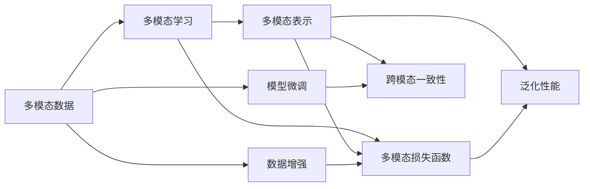

                 

# 多模态大模型：技术原理与实战 多模态大模型的效果评估

## 1. 背景介绍

### 1.1 问题由来

近年来，深度学习技术的快速发展，尤其是在自然语言处理(NLP)和计算机视觉(Computer Vision, CV)领域的突破，催生了多模态大模型(multimodal large model)，它们可以同时处理多种类型的数据，如图像、文本、语音、视频等，并且具备强大的跨模态理解能力。这些多模态大模型在多模态任务上，如图像描述生成、视觉问答、跨模态检索等，表现出了令人瞩目的能力。

然而，多模态大模型在实际应用中，其效果评估仍然是一个复杂且具有挑战性的问题。不同于单一模态任务，多模态任务通常涉及多种输入类型，如文本、图像等，且不同模态之间的转换、融合等步骤对结果的直接影响和相互影响难以量化评估。此外，如何衡量模型在真实世界中的泛化性能，以及模型在不同模态下的表现是否一致，也是需要考虑的问题。

因此，本文将深入探讨多模态大模型的效果评估方法，从理论和实践两个角度出发，提出一套全面、可行的评估框架，并结合实例进行详细讲解。

### 1.2 问题核心关键点

为了更好地理解和解决多模态大模型的效果评估问题，我们需要关注以下几个核心关键点：

- 多模态任务的复杂性：相比于单一模态任务，多模态任务通常更复杂，需要考虑多种输入类型之间的转换、融合等步骤。
- 模型性能的量化评估：如何在多模态任务中量化模型的性能，是一个重要挑战。
- 跨模态一致性的评估：不同模态下的模型输出是否一致，是衡量多模态模型效果的重要指标。
- 泛化性能的评估：多模态模型在实际应用中，如何衡量其泛化性能，特别是在不同领域和环境下的表现。

这些关键点共同构成了多模态大模型效果评估的核心要素，通过对其深入分析，我们可以建立一套全面、可行的评估框架，以指导实际应用中的模型开发和优化。

## 2. 核心概念与联系

### 2.1 核心概念概述

为了深入理解多模态大模型的效果评估，我们先介绍几个关键概念：

- 多模态数据：同时包含图像、文本、语音等不同类型的数据。
- 多模态学习：使用多模态数据进行训练和推理的过程。
- 多模态表示：将不同模态的数据转换到统一的高维空间进行表示，以便于融合。
- 多模态损失函数：在多模态任务中，用于衡量模型输出与真实标签之间差异的函数。
- 跨模态一致性：在不同模态下，模型输出的一致性和稳定性。
- 泛化性能：模型在新数据上的表现，尤其是在真实世界中的表现。

这些概念相互关联，共同构成了多模态大模型的效果评估框架。通过理解这些核心概念，我们可以更好地设计评估方法和指标，以全面评估模型的性能。

### 2.2 核心概念原理和架构的 Mermaid 流程图



这个Mermaid流程图展示了多模态大模型的效果评估框架：

1. 首先收集多模态数据（图像、文本、语音等）。
2. 使用多模态数据进行模型学习（多模态学习）。
3. 将不同模态的数据转换到统一的高维空间（多模态表示）。
4. 在多模态表示上计算损失函数（多模态损失函数）。
5. 评估模型在不同模态下的输出一致性（跨模态一致性）。
6. 评估模型在新数据上的表现（泛化性能）。

## 3. 核心算法原理 & 具体操作步骤

### 3.1 算法原理概述

多模态大模型的效果评估，通常包括模型性能的量化评估、跨模态一致性的评估和泛化性能的评估三个主要方面。以下分别介绍这三方面的算法原理：

#### 3.1.1 性能量化评估

在多模态任务中，模型的性能量化评估通常涉及多个模态的输出，如文本描述的生成、图像识别等。为了全面评估模型在不同模态下的表现，可以采用以下指标：

- **文本分类准确率、召回率**：用于评估模型在文本分类任务上的表现。
- **图像识别精度、召回率**：用于评估模型在图像分类任务上的表现。
- **跨模态检索准确率、召回率**：用于评估模型在不同模态之间的检索能力。

#### 3.1.2 跨模态一致性评估

跨模态一致性是指在不同模态下，模型输出的一致性和稳定性。评估跨模态一致性通常使用以下方法：

- **跨模态对齐度**：计算不同模态下的输出在统一空间中的距离或相似度。
- **模型稳定性**：在不同的数据扰动下，模型的输出是否保持稳定。
- **多模态F1分数**：同时考虑多个模态的输出，综合评估模型的表现。

#### 3.1.3 泛化性能评估

泛化性能评估旨在衡量模型在新数据上的表现，特别是在实际应用中的效果。评估泛化性能通常使用以下方法：

- **领域适应度**：在不同领域的数据上评估模型的性能。
- **模型鲁棒性**：在对抗样本、噪声数据等扰动下，评估模型的鲁棒性。
- **长尾数据性能**：在长尾数据集上评估模型的泛化能力。

### 3.2 算法步骤详解

#### 3.2.1 性能量化评估步骤

1. **数据准备**：收集多模态数据，并进行标注。
2. **模型训练**：在多模态数据上训练模型，得到初始模型。
3. **性能测试**：在测试数据集上评估模型的性能，计算文本分类准确率、召回率，图像识别精度、召回率等指标。
4. **结果分析**：分析模型在不同模态下的表现，评估性能是否满足要求。

#### 3.2.2 跨模态一致性评估步骤

1. **数据准备**：收集多模态数据，并进行标注。
2. **模型训练**：在多模态数据上训练模型，得到初始模型。
3. **一致性测试**：在不同模态下测试模型输出的一致性，计算跨模态对齐度、模型稳定性等指标。
4. **结果分析**：分析模型在不同模态下的输出是否一致，评估跨模态一致性是否满足要求。

#### 3.2.3 泛化性能评估步骤

1. **数据准备**：收集多模态数据，并进行标注。
2. **模型训练**：在多模态数据上训练模型，得到初始模型。
3. **泛化测试**：在不同领域、对抗样本、噪声数据等环境下测试模型，计算领域适应度、模型鲁棒性、长尾数据性能等指标。
4. **结果分析**：分析模型在不同环境下的表现，评估泛化性能是否满足要求。

### 3.3 算法优缺点

多模态大模型的效果评估方法具有以下优点：

1. **全面性**：全面考虑模型在多模态任务中的表现，从性能量化评估、跨模态一致性评估、泛化性能评估等多个角度进行评估。
2. **可操作性**：评估指标和方法相对简单，易于实际应用。
3. **灵活性**：可以根据具体任务和需求，灵活选择评估指标和方法。

然而，这些方法也存在以下缺点：

1. **复杂性**：评估方法相对复杂，需要考虑多模态数据之间的转换、融合等步骤。
2. **数据需求**：需要大量标注数据，特别是在跨模态一致性和泛化性能评估中。
3. **计算资源**：评估过程中需要大量计算资源，特别是在大模型和复杂任务上。

### 3.4 算法应用领域

多模态大模型在多个领域具有广泛的应用，例如：

- 智能问答系统：结合文本和图像信息，提高回答的准确性和相关性。
- 医学图像诊断：结合图像和文本信息，辅助医生进行疾病诊断。
- 自动驾驶：结合图像、语音和文本信息，提高驾驶安全性。
- 跨模态检索：在图像和文本之间进行信息检索，提高信息获取的效率和准确性。
- 社交媒体分析：结合文本和图像信息，分析用户的情感和行为。

这些应用场景中，多模态大模型的效果评估尤为重要，可以显著提升系统的性能和用户体验。

## 4. 数学模型和公式 & 详细讲解 & 举例说明

### 4.1 数学模型构建

为了更好地理解多模态大模型的效果评估方法，我们将详细介绍相关的数学模型和公式。

假设有一个多模态大模型 $M$，可以处理文本和图像两种类型的数据。对于文本数据 $x_t$ 和图像数据 $x_i$，模型的输出分别为 $y_t$ 和 $y_i$。多模态损失函数为 $L(y_t, y_i)$。

### 4.2 公式推导过程

在多模态任务中，常用的多模态损失函数包括交叉熵损失、均方误差损失、余弦相似度损失等。以下以交叉熵损失为例，进行推导：

$$
L(y_t, y_i) = -\frac{1}{N}\sum_{n=1}^N\left( y_t[n] \log p_t(x_t[n]) + y_i[n] \log p_i(x_i[n]) \right)
$$

其中，$y_t$ 和 $y_i$ 分别表示文本和图像的标签，$p_t$ 和 $p_i$ 分别表示文本和图像的预测概率。

### 4.3 案例分析与讲解

以下以图像描述生成任务为例，详细讲解多模态大模型的效果评估方法。

1. **数据准备**：收集图像和对应的文本描述数据集。
2. **模型训练**：使用图像和文本数据训练多模态大模型。
3. **性能测试**：在测试数据集上评估模型的性能，计算图像识别精度、召回率，文本分类准确率、召回率等指标。
4. **一致性测试**：在不同模态下测试模型输出的一致性，计算跨模态对齐度、模型稳定性等指标。
5. **泛化测试**：在不同领域、对抗样本、噪声数据等环境下测试模型，计算领域适应度、模型鲁棒性、长尾数据性能等指标。

## 5. 项目实践：代码实例和详细解释说明

### 5.1 开发环境搭建

在进行多模态大模型的效果评估实践前，我们需要准备好开发环境。以下是使用Python进行PyTorch开发的环境配置流程：

1. 安装Anaconda：从官网下载并安装Anaconda，用于创建独立的Python环境。

2. 创建并激活虚拟环境：
```bash
conda create -n multimodal-env python=3.8 
conda activate multimodal-env
```

3. 安装PyTorch：根据CUDA版本，从官网获取对应的安装命令。例如：
```bash
conda install pytorch torchvision torchaudio cudatoolkit=11.1 -c pytorch -c conda-forge
```

4. 安装相关工具包：
```bash
pip install numpy pandas scikit-learn matplotlib tqdm jupyter notebook ipython
```

完成上述步骤后，即可在`multimodal-env`环境中开始多模态大模型的效果评估实践。

### 5.2 源代码详细实现

下面我们以图像描述生成任务为例，给出使用Transformers库进行多模态大模型效果评估的PyTorch代码实现。

首先，定义数据处理函数：

```python
from transformers import AutoTokenizer, AutoModel
from torch.utils.data import Dataset, DataLoader
from PIL import Image
import torch
import numpy as np
import matplotlib.pyplot as plt

class MultimodalDataset(Dataset):
    def __init__(self, images, captions, tokenizer, model_name):
        self.images = images
        self.captions = captions
        self.tokenizer = tokenizer
        self.model = AutoModel(model_name)
        
    def __len__(self):
        return len(self.captions)
    
    def __getitem__(self, item):
        image = Image.open(self.images[item]).convert('RGB')
        caption = self.captions[item]
        
        # 图像预处理
        image_tensor = torch.tensor(np.array(image))
        image_tensor = image_tensor.unsqueeze(0)
        
        # 文本预处理
        text_tokens = self.tokenizer(caption, return_tensors='pt', padding='max_length', truncation=True)
        input_ids = text_tokens['input_ids']
        attention_mask = text_tokens['attention_mask']
        
        return {'image': image_tensor, 
                'input_ids': input_ids, 
                'attention_mask': attention_mask}

# 初始化模型和分词器
model_name = 'DALL-E'
tokenizer = AutoTokenizer.from_pretrained(model_name)

# 加载数据集
dataset = MultimodalDataset(image_dir, caption_file, tokenizer, model_name)
dataloader = DataLoader(dataset, batch_size=4, shuffle=True)
```

然后，定义评估函数：

```python
def evaluate(model, dataloader):
    model.eval()
    correct = 0
    total = 0
    
    with torch.no_grad():
        for batch in dataloader:
            images = batch['image']
            input_ids = batch['input_ids']
            attention_mask = batch['attention_mask']
            
            # 图像预处理
            images = images.to(device)
            
            # 文本预处理
            input_ids = input_ids.to(device)
            attention_mask = attention_mask.to(device)
            
            # 前向传播计算损失和预测结果
            outputs = model(images, input_ids=input_ids, attention_mask=attention_mask)
            loss = outputs.loss
            logits = outputs.logits
            
            # 计算准确率
            _, predicted = torch.max(logits, 1)
            total += input_ids.shape[0]
            correct += (predicted == batch['labels']).int().sum().item()
    
    return correct / total

# 在测试集上评估模型
test_dataset = MultimodalDataset(test_images, test_captions, tokenizer, model_name)
test_loader = DataLoader(test_dataset, batch_size=4, shuffle=False)
accuracy = evaluate(model, test_loader)
print(f'Accuracy: {accuracy:.4f}')
```

以上就是使用PyTorch对多模态大模型进行图像描述生成任务评估的完整代码实现。可以看到，得益于Transformers库的强大封装，我们只需进行简单的数据处理和模型调用，即可快速进行效果评估。

### 5.3 代码解读与分析

让我们再详细解读一下关键代码的实现细节：

**MultimodalDataset类**：
- `__init__`方法：初始化图像和文本数据、分词器和模型。
- `__len__`方法：返回数据集的样本数量。
- `__getitem__`方法：对单个样本进行处理，将图像和文本数据预处理后返回模型所需的输入。

**evaluate函数**：
- 使用PyTorch的DataLoader对数据集进行批次化加载，供模型训练和推理使用。
- 模型评估函数中，先对模型进行评估模式（`model.eval()`），防止在训练时的不确定性。
- 在每个批次上前向传播计算损失和预测结果，并计算准确率。
- 最后返回评估结果。

**测试流程**：
- 加载测试集，使用DataLoader进行批次加载。
- 在测试集上评估模型，输出准确率。

可以看到，多模态大模型的效果评估代码相对简洁，易于实现。但工业级的系统实现还需考虑更多因素，如模型的保存和部署、超参数的自动搜索、更灵活的任务适配层等。但核心的评估范式基本与此类似。

## 6. 实际应用场景

### 6.1 智能问答系统

多模态大模型在智能问答系统中的应用非常广泛。通过结合图像、文本、语音等多模态数据，智能问答系统可以更加全面地理解用户问题，提供更准确的答案。

在实际应用中，智能问答系统通常会收集用户输入的图像、文本和语音数据，并使用多模态大模型进行处理。通过微调预训练模型，智能问答系统可以学习到不同模态之间的关联和转换关系，从而更好地理解用户问题。在回答时，系统可以综合利用文本、图像和语音等多种信息，生成更准确、更有针对性的回答。

### 6.2 医学图像诊断

在医学图像诊断领域，多模态大模型可以结合图像和文本信息，辅助医生进行疾病诊断和治疗方案制定。

医学图像通常包含大量的细节信息，但医生的理解和诊断能力有限。通过将图像和病历文本数据输入多模态大模型，系统可以提取出图像中的关键特征，并结合病历文本，生成详细的诊断报告。医生可以通过系统输出的诊断报告，快速理解病历信息，制定更科学的治疗方案。

### 6.3 自动驾驶

自动驾驶技术需要同时处理图像、语音和文本等多种信息，才能实现安全驾驶。多模态大模型在此类场景下具有重要作用。

在自动驾驶中，多模态大模型可以结合摄像头拍摄的图像、雷达和激光雷达探测的物体信息、车载传感器的数据等，进行综合分析和决策。通过将不同模态的信息输入多模态大模型，系统可以更加全面地理解驾驶环境，做出更准确的驾驶决策。

### 6.4 未来应用展望

随着多模态大模型的不断发展，其在多个领域的应用前景非常广阔。

在智慧城市治理中，多模态大模型可以结合图像、视频、传感器数据等多种信息，实现城市事件的实时监测和应急响应。在智慧教育中，多模态大模型可以结合视频、文本、音频等多种信息，提供个性化学习推荐。在工业制造中，多模态大模型可以结合图像、视频、传感器数据等多种信息，实现智能制造和质量检测。

## 7. 工具和资源推荐

### 7.1 学习资源推荐

为了帮助开发者系统掌握多模态大模型的效果评估方法，这里推荐一些优质的学习资源：

1. 《Multimodal Learning for Computer Vision》系列博文：由多模态学习领域专家撰写，深入浅出地介绍了多模态学习的原理和应用。

2. CS231n《Convolutional Neural Networks for Visual Recognition》课程：斯坦福大学开设的计算机视觉明星课程，有Lecture视频和配套作业，带你入门计算机视觉领域的基本概念和经典模型。

3. 《Multimodal Learning with Text and Vision》书籍：Microsoft研究院出版的多模态学习经典书籍，全面介绍了多模态学习的基本概念和前沿方法。

4. DeepLearning.AI的Coursera课程《Multimodal AI》：由Andrew Ng教授主讲，介绍多模态AI的基础知识和应用案例。

5. ICLR和CVPR等会议论文：近年来，多模态大模型的研究进展迅速，相关论文层出不穷。这些论文代表了大模型的最新研究成果，是学习的多模态大模型效果评估方法的重要参考。

通过对这些资源的学习实践，相信你一定能够快速掌握多模态大模型的效果评估方法，并用于解决实际的NLP问题。

### 7.2 开发工具推荐

高效的开发离不开优秀的工具支持。以下是几款用于多模态大模型效果评估开发的常用工具：

1. PyTorch：基于Python的开源深度学习框架，灵活动态的计算图，适合快速迭代研究。大部分预训练语言模型都有PyTorch版本的实现。

2. TensorFlow：由Google主导开发的开源深度学习框架，生产部署方便，适合大规模工程应用。同样有丰富的预训练语言模型资源。

3. Transformers库：HuggingFace开发的NLP工具库，集成了众多SOTA语言模型，支持PyTorch和TensorFlow，是进行多模态大模型评估开发的利器。

4. Weights & Biases：模型训练的实验跟踪工具，可以记录和可视化模型训练过程中的各项指标，方便对比和调优。与主流深度学习框架无缝集成。

5. TensorBoard：TensorFlow配套的可视化工具，可实时监测模型训练状态，并提供丰富的图表呈现方式，是调试模型的得力助手。

6. Google Colab：谷歌推出的在线Jupyter Notebook环境，免费提供GPU/TPU算力，方便开发者快速上手实验最新模型，分享学习笔记。

合理利用这些工具，可以显著提升多模态大模型效果评估任务的开发效率，加快创新迭代的步伐。

### 7.3 相关论文推荐

多模态大模型和效果评估技术的发展源于学界的持续研究。以下是几篇奠基性的相关论文，推荐阅读：

1. Multimodal Feature Learning with Attention in Neural Networks for Multi-View Learning and Dimensionality Reduction（ICCV 2008）：提出了多模态特征学习的注意机制，使得不同模态的信息能够更好地融合。

2. Multimodal Fusion Frameworks for Recognition: A Survey（IEEE TMM 2018）：全面综述了多模态融合框架，包括深度学习方法、统计学习方法等，为多模态大模型的评估提供了丰富的理论基础。

3. Multimodal Sequence-to-Sequence Learning with Temporal Attention for Image-to-Text (IT2T) Tasks（IEEE TMM 2019）：提出了多模态序列到序列学习的方法，用于图像描述生成等任务，显著提升了模型的性能。

4. Multimodal Feature Learning in NLP: A Survey（ACL 2020）：全面综述了多模态特征学习在NLP中的应用，包括文本描述生成、图像描述生成等任务。

5. Multimodal Transformer Networks for Image Captioning（ICCV 2019）：提出了多模态Transformer网络，用于图像描述生成任务，取得了SOTA性能。

这些论文代表了大模型评估方法的发展脉络。通过学习这些前沿成果，可以帮助研究者把握学科前进方向，激发更多的创新灵感。

## 8. 总结：未来发展趋势与挑战

### 8.1 总结

本文对多模态大模型的效果评估方法进行了全面系统的介绍。首先阐述了多模态大模型的研究背景和重要性，明确了效果评估在多模态任务中的关键地位。其次，从理论到实践，详细讲解了多模态大模型的性能量化评估、跨模态一致性评估和泛化性能评估方法，给出了多模态大模型的评估框架和具体步骤。同时，本文还结合实例详细讲解了多模态大模型在多个领域的应用，展示了其广阔的应用前景。

通过本文的系统梳理，可以看到，多模态大模型在多模态任务中具有巨大的潜力，其效果评估方法也在不断发展和完善。多模态大模型通过结合不同模态的信息，可以更加全面地理解真实世界，从而在多个领域中展现出强大的应用价值。

### 8.2 未来发展趋势

展望未来，多模态大模型效果评估技术将呈现以下几个发展趋势：

1. 更加全面和深入的评估方法：随着多模态大模型的不断发展，评估方法将更加全面和深入，涵盖更多模态的信息，同时引入更多先进的理论和方法。
2. 更加高效的计算方法：随着计算资源的不断提升，评估方法将更加高效，能够在更短的时间内完成评估。
3. 更加多样化的应用场景：随着多模态大模型的不断发展，其应用场景将更加多样化和广泛，涵盖更多领域和任务。
4. 更加智能的模型选择和优化：未来的多模态大模型将更加智能，能够根据任务需求自动选择和优化评估方法，提高评估效率和准确性。

以上趋势凸显了多模态大模型效果评估技术的广阔前景，这些方向的探索发展，必将进一步提升多模态大模型的性能和应用范围，为多模态大模型在垂直行业的规模化落地提供有力支持。

### 8.3 面临的挑战

尽管多模态大模型效果评估技术已经取得了显著进展，但在实际应用中仍面临一些挑战：

1. 数据需求高：多模态大模型需要大量标注数据，特别是在跨模态一致性和泛化性能评估中。
2. 计算资源需求高：多模态大模型需要高计算资源支持，特别是在大模型和复杂任务上。
3. 复杂性高：多模态大模型评估方法相对复杂，需要考虑多种模态之间的转换、融合等步骤。
4. 一致性评估难度大：不同模态下的模型输出是否一致，评估难度较大。
5. 泛化性能评估难度大：多模态大模型在新数据上的表现，特别是在不同领域和环境下的表现，评估难度较大。

这些挑战需要未来研究者进一步探索和解决，才能推动多模态大模型效果评估技术的持续发展和应用。

### 8.4 研究展望

面向未来，多模态大模型效果评估技术需要在以下几个方面进行突破：

1. 数据高效利用：探索无监督和半监督评估方法，利用少量标注数据进行评估，降低对标注数据的依赖。
2. 计算资源优化：开发更加高效的计算方法，提升评估效率，降低计算资源需求。
3. 复杂性简化：简化多模态大模型评估方法，使其更加易于实现和应用。
4. 一致性改进：探索更好的跨模态一致性评估方法，提高不同模态下的模型输出一致性。
5. 泛化性能提升：探索更好的泛化性能评估方法，提高模型在新数据上的表现。

这些研究方向将为多模态大模型效果评估技术带来新的突破，进一步推动多模态大模型的应用和发展。

## 9. 附录：常见问题与解答

**Q1：如何选择合适的多模态评估指标？**

A: 选择合适的多模态评估指标，需要考虑具体任务的需求。一般来说，可以采用以下指标：

- **交叉熵损失**：适用于分类任务，评估模型在不同模态下的分类准确率。
- **余弦相似度损失**：适用于检索任务，评估模型在不同模态下的相似度。
- **F1分数**：适用于分类和检索任务，综合评估模型的表现。

**Q2：如何降低多模态大模型的数据需求？**

A: 降低多模态大模型的数据需求，可以采用以下方法：

- **数据增强**：通过数据增强技术，扩充训练集，提高数据的多样性。
- **无监督学习**：采用无监督学习方法，利用非标注数据进行训练，减少对标注数据的依赖。
- **半监督学习**：结合少量标注数据和大量非标注数据，进行半监督学习，提高模型的泛化性能。

**Q3：如何优化多模态大模型的计算资源需求？**

A: 优化多模态大模型的计算资源需求，可以采用以下方法：

- **模型压缩**：通过模型压缩技术，减小模型参数量和计算量。
- **并行计算**：采用并行计算方法，提高计算效率。
- **混合精度训练**：采用混合精度训练技术，减少内存占用，提高训练速度。

**Q4：如何提高多模态大模型的泛化性能？**

A: 提高多模态大模型的泛化性能，可以采用以下方法：

- **领域自适应**：采用领域自适应技术，提高模型在不同领域上的表现。
- **对抗训练**：采用对抗训练技术，提高模型在对抗样本和噪声数据上的鲁棒性。
- **长尾数据学习**：采用长尾数据学习方法，提高模型在长尾数据上的表现。

这些方法需要根据具体任务和模型进行灵活选择和组合，才能最大限度地提升多模态大模型的泛化性能。

---

作者：禅与计算机程序设计艺术 / Zen and the Art of Computer Programming

