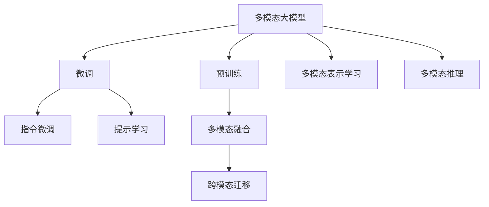

                 

# 多模态大模型：技术原理与实战 提示学习与指令微调

> 关键词：多模态大模型,提示学习,Prompt Learning,指令微调,多模态融合,跨模态迁移,自然语言处理(NLP),计算机视觉(CV),语音识别(SR),深度学习,预训练,微调(Fine-Tuning)

## 1. 背景介绍

### 1.1 问题由来

近年来，随着深度学习技术的快速发展，预训练语言模型(Pretrained Language Models, PLMs)在自然语言处理(NLP)领域取得了巨大的突破。其中，大规模预训练模型如BERT、GPT-3等，通过在大规模无标签文本数据上进行预训练，学习到了丰富的语言知识和常识，展现了惊人的泛化能力和生成能力。这些大模型在各种NLP任务中表现优异，推动了NLP技术在搜索、问答、翻译、摘要等众多领域的突破性进展。

然而，预训练语言模型在处理非文本数据（如图像、音频等）时，往往难以直接应用，亟需发展能够处理多模态数据的大模型。随着计算机视觉(CV)、语音识别(SR)等领域的迅猛发展，多模态数据源越来越丰富，迫切需要引入大模型技术，将多模态数据与语言数据进行有效融合，从而实现更强的跨模态理解和生成能力。

在此背景下，多模态大模型(Multimodal Large Models)应运而生。与单模态大模型相比，多模态大模型不仅能处理文本数据，还能处理图像、音频等多模态数据，能够实现更为复杂和丰富的多模态任务，如多模态语义理解、图像描述生成、视觉问答等。本文将重点介绍多模态大模型的技术原理和实战方法，探讨提示学习(Prompt Learning)和指令微调(Instruction Fine-Tuning)在其中的应用，以期为相关领域的研究者提供一些有益的参考。

## 2. 核心概念与联系

### 2.1 核心概念概述

为更好地理解多模态大模型及其相关技术，本节将介绍几个密切相关的核心概念：

- 多模态大模型：同时处理文本、图像、音频等多种模态数据的大型深度学习模型。该模型通过多模态数据进行预训练，能够融合不同模态的语义信息，提升模型的多模态理解和生成能力。
- 预训练(Pre-training)：指在大规模无标签数据上，通过自监督学习任务训练深度学习模型，学习通用的数据表示。预训练过程是构建多模态大模型的关键步骤，可以使得模型获得丰富的知识。
- 微调(Fine-tuning)：指在预训练模型的基础上，使用特定任务的数据进行有监督训练，优化模型在该任务上的性能。微调过程是实现模型任务适配的常用方法。
- 提示学习(Prompt Learning)：通过在输入数据中引入特定格式的提示模板，引导多模态大模型进行特定任务推理和生成。提示学习可以在不更新模型参数的情况下，实现零样本或少样本学习。
- 指令微调(Instruction Fine-Tuning)：通过将自然语言指令与输入数据一起传递给多模态大模型，指导模型进行任务执行。指令微调旨在实现任务的精细控制和复杂交互。

这些核心概念之间的逻辑关系可以通过以下Mermaid流程图来展示：



这个流程图展示了大模型的核心概念及其之间的关系：

1. 多模态大模型通过预训练获得基础能力。
2. 微调是对预训练模型进行任务特定的优化，可以实现模型的多模态适配。
3. 提示学习可以通过对输入数据的形式化，引导模型进行多模态推理和生成。
4. 指令微调通过自然语言指令实现对模型的精细控制和复杂交互。
5. 多模态融合旨在将不同模态的语义信息进行有效的整合，提升模型的跨模态迁移能力。
6. 跨模态迁移使得模型能够跨模态理解和生成，解决不同模态之间的信息融合问题。
7. 多模态表示学习关注如何更好地表示多模态数据，提升模型的泛化能力。
8. 多模态推理关注如何结合不同模态的证据，进行推理和生成。

这些核心概念共同构成了多模态大模型的学习和应用框架，使其能够在各种场景下发挥强大的跨模态理解和生成能力。通过理解这些核心概念，我们可以更好地把握多模态大模型的工作原理和优化方向。

## 3. 核心算法原理 & 具体操作步骤
### 3.1 算法原理概述

多模态大模型的核心思想是：通过在大规模多模态数据上进行预训练，学习多模态数据之间的复杂语义关系，然后利用微调和提示学习等技术，将模型适配到具体的多模态任务中，实现高精度的推理和生成。

具体而言，多模态大模型在预训练过程中，通过同时处理多种模态的数据，学习到每种模态的特征表示，并在模型内部通过多模态融合的方式，将不同模态的信息进行整合，形成联合表示。这种联合表示可以用于多种多模态任务，通过微调将模型适配到具体任务上，进一步优化模型的任务性能。

### 3.2 算法步骤详解

多模态大模型的训练过程通常包括以下几个关键步骤：

**Step 1: 准备预训练模型和数据集**
- 选择合适的预训练语言模型（如BERT、GPT）或预训练图像模型（如ResNet、VGG），作为多模态大模型的初始化参数。
- 准备多模态任务的数据集，包括文本数据、图像数据、音频数据等，进行数据标注和预处理。

**Step 2: 设计预训练任务**
- 定义多模态数据的多样性，如文本描述图像、图像描述文本、图像分类、图像标注等任务。
- 设计自监督预训练任务，如图像掩码预测、文本掩码预测等，引导模型学习多模态数据的语义信息。
- 设计多模态联合训练任务，如视频-文本匹配、音频-图像联合学习等，提升模型跨模态融合能力。

**Step 3: 模型架构设计**
- 设计多模态大模型的架构，如使用Transformer架构处理多模态数据。
- 设计多模态融合策略，如使用多模态注意机制，将不同模态的信息进行有效整合。
- 设计多模态推理机制，如使用多模态图神经网络，结合不同模态的信息进行推理。

**Step 4: 微调与提示学习**
- 在预训练模型的基础上，使用多模态任务的少量标注数据进行微调，优化模型在特定任务上的性能。
- 引入提示学习技术，通过设计特定的提示模板，引导模型进行任务推理和生成，实现零样本或少样本学习。

**Step 5: 评估与部署**
- 在多模态数据集上评估微调后的模型性能，确保模型在多模态任务上表现良好。
- 将微调后的模型部署到实际应用系统中，实现多模态任务的高效推理和生成。

### 3.3 算法优缺点

多模态大模型微调方法具有以下优点：
1. 简单高效。只需准备少量标注数据，即可对预训练模型进行快速适配，获得较大的性能提升。
2. 通用适用。适用于各种多模态任务，包括图像分类、文本描述生成、视觉问答等，设计简单的任务适配层即可实现微调。
3. 跨模态迁移能力。通过多模态预训练，模型具备跨模态迁移能力，能高效处理不同模态的数据。
4. 参数高效。利用参数高效微调技术，在固定大部分预训练权重不变的情况下，仍可取得不错的微调效果。
5. 适应性广。模型能在多种模态数据上发挥作用，适用于不同领域的多模态应用。

同时，该方法也存在一定的局限性：
1. 数据依赖。微调的效果很大程度上取决于标注数据的质量和数量，获取高质量标注数据的成本较高。
2. 泛化能力。当目标任务与预训练数据的分布差异较大时，微调的性能提升有限。
3. 模型复杂。多模态大模型通常比单模态模型复杂，训练和推理的计算成本更高。
4. 可解释性不足。多模态大模型的内部决策过程复杂，难以进行可解释性分析。
5. 资源需求高。多模态大模型的训练和推理需要高性能的硬件设备，如GPU、TPU等。

尽管存在这些局限性，但就目前而言，基于多模态大模型的微调方法仍然是多模态任务处理的重要手段。未来相关研究的重点在于如何进一步降低微调对标注数据的依赖，提高模型的跨模态迁移能力，同时兼顾可解释性和计算资源。

### 3.4 算法应用领域

多模态大模型微调技术在多个领域得到了广泛应用，涵盖了视觉、语音、文本等不同模态的任务，具体包括：

- 图像分类与标注：对图片进行语义分类和标注，如物体识别、场景分类等。
- 图像描述生成：生成图片的文本描述，提升图片信息表达能力。
- 视觉问答：回答关于图片的问题，如描述图片内容、检测图片中物体等。
- 多模态语义理解：结合文本和图像信息，进行语义推理和理解，如图像中的文字识别、图片中人名的标注等。
- 多模态对话系统：结合文本和语音信息，构建智能对话系统，实现人机交互。
- 视频描述生成：对视频内容进行描述和生成，如自动生成视频字幕、视频内容总结等。
- 多模态推荐系统：结合用户行为数据和商品信息，实现更加个性化的推荐。

除了上述这些经典任务外，多模态大模型微调还被创新性地应用到更多场景中，如可控文本生成、跨模态检索、多模态情感分析等，为多模态任务的智能化和自动化提供了新的解决方案。随着预训练模型和微调方法的不断进步，相信多模态大模型微调将在更多领域得到应用，为多模态数据处理带来新的突破。

## 4. 数学模型和公式 & 详细讲解  
### 4.1 数学模型构建

本节将使用数学语言对多模态大模型的微调过程进行更加严格的刻画。

记预训练模型为 $M_{\theta}$，其中 $\theta$ 为模型参数。假设多模态任务 $T$ 的数据集为 $D=\{(x_i,y_i)\}_{i=1}^N, x_i = (x_{i,t}, x_{i,v})$，其中 $x_{i,t}$ 为文本数据，$x_{i,v}$ 为图像数据或音频数据，$y_i$ 为标注数据。

定义模型 $M_{\theta}$ 在数据样本 $(x,y)$ 上的损失函数为 $\ell(M_{\theta}(x),y)$，则在数据集 $D$ 上的经验风险为：

$$
\mathcal{L}(\theta) = \frac{1}{N} \sum_{i=1}^N \ell(M_{\theta}(x_i),y_i)
$$

微调的优化目标是最小化经验风险，即找到最优参数：

$$
\theta^* = \mathop{\arg\min}_{\theta} \mathcal{L}(\theta)
$$

在实践中，我们通常使用基于梯度的优化算法（如SGD、Adam等）来近似求解上述最优化问题。设 $\eta$ 为学习率，$\lambda$ 为正则化系数，则参数的更新公式为：

$$
\theta \leftarrow \theta - \eta \nabla_{\theta}\mathcal{L}(\theta) - \eta\lambda\theta
$$

其中 $\nabla_{\theta}\mathcal{L}(\theta)$ 为损失函数对参数 $\theta$ 的梯度，可通过反向传播算法高效计算。

### 4.2 公式推导过程

以下我们以图像分类任务为例，推导交叉熵损失函数及其梯度的计算公式。

假设模型 $M_{\theta}$ 在输入 $x$ 上的输出为 $\hat{y}=M_{\theta}(x) \in [0,1]$，表示样本属于某一类别的概率。真实标签 $y \in \{0,1\}$。则二分类交叉熵损失函数定义为：

$$
\ell(M_{\theta}(x),y) = -[y\log \hat{y} + (1-y)\log (1-\hat{y})]
$$

将其代入经验风险公式，得：

$$
\mathcal{L}(\theta) = -\frac{1}{N}\sum_{i=1}^N [y_i\log M_{\theta}(x_i)+(1-y_i)\log(1-M_{\theta}(x_i))]
$$

根据链式法则，损失函数对参数 $\theta_k$ 的梯度为：

$$
\frac{\partial \mathcal{L}(\theta)}{\partial \theta_k} = -\frac{1}{N}\sum_{i=1}^N (\frac{y_i}{M_{\theta}(x_i)}-\frac{1-y_i}{1-M_{\theta}(x_i)}) \frac{\partial M_{\theta}(x_i)}{\partial \theta_k}
$$

其中 $\frac{\partial M_{\theta}(x_i)}{\partial \theta_k}$ 可进一步递归展开，利用自动微分技术完成计算。

在得到损失函数的梯度后，即可带入参数更新公式，完成模型的迭代优化。重复上述过程直至收敛，最终得到适应下游任务的最优模型参数 $\theta^*$。

## 5. 项目实践：代码实例和详细解释说明
### 5.1 开发环境搭建

在进行多模态大模型微调实践前，我们需要准备好开发环境。以下是使用Python进行PyTorch开发的环境配置流程：

1. 安装Anaconda：从官网下载并安装Anaconda，用于创建独立的Python环境。

2. 创建并激活虚拟环境：
```bash
conda create -n pytorch-env python=3.8 
conda activate pytorch-env
```

3. 安装PyTorch：根据CUDA版本，从官网获取对应的安装命令。例如：
```bash
conda install pytorch torchvision torchaudio cudatoolkit=11.1 -c pytorch -c conda-forge
```

4. 安装Transformers库：
```bash
pip install transformers
```

5. 安装各类工具包：
```bash
pip install numpy pandas scikit-learn matplotlib tqdm jupyter notebook ipython
```

完成上述步骤后，即可在`pytorch-env`环境中开始多模态大模型微调实践。

### 5.2 源代码详细实现

下面我们以多模态图像分类任务为例，给出使用Transformers库对BERT模型进行微调的PyTorch代码实现。

首先，定义多模态图像分类的数据处理函数：

```python
from transformers import BertForSequenceClassification, BertTokenizer, AutoModelForSequenceClassification
from torch.utils.data import Dataset
import torch

class MultiModalDataset(Dataset):
    def __init__(self, texts, tags, images, tokenizer, max_len=128):
        self.texts = texts
        self.tags = tags
        self.images = images
        self.tokenizer = tokenizer
        self.max_len = max_len
        
    def __len__(self):
        return len(self.texts)
    
    def __getitem__(self, item):
        text = self.texts[item]
        tag = self.tags[item]
        image = self.images[item]
        
        encoding = self.tokenizer(text, return_tensors='pt', max_length=self.max_len, padding='max_length', truncation=True)
        input_ids = encoding['input_ids'][0]
        attention_mask = encoding['attention_mask'][0]
        
        # 对文本进行编码，并将图像转换为Tensor形式
        image_tensor = torch.from_numpy(image).float().unsqueeze(0)
        
        # 对token-wise的标签进行编码
        encoded_tags = [tag2id[tag] for tag in tag]
        encoded_tags.extend([tag2id['O']] * (self.max_len - len(encoded_tags)))
        labels = torch.tensor(encoded_tags, dtype=torch.long)
        
        return {'input_ids': input_ids, 
                'attention_mask': attention_mask,
                'labels': labels,
                'image': image_tensor}

# 标签与id的映射
tag2id = {'O': 0, 'cat': 1, 'dog': 2, 'bird': 3}
id2tag = {v: k for k, v in tag2id.items()}

# 创建dataset
tokenizer = BertTokenizer.from_pretrained('bert-base-cased')

train_dataset = MultiModalDataset(train_texts, train_tags, train_images, tokenizer)
dev_dataset = MultiModalDataset(dev_texts, dev_tags, dev_images, tokenizer)
test_dataset = MultiModalDataset(test_texts, test_tags, test_images, tokenizer)
```

然后，定义模型和优化器：

```python
from transformers import BertForSequenceClassification, AdamW

model = BertForSequenceClassification.from_pretrained('bert-base-cased', num_labels=len(tag2id))

optimizer = AdamW(model.parameters(), lr=2e-5)
```

接着，定义训练和评估函数：

```python
from torch.utils.data import DataLoader
from tqdm import tqdm
from sklearn.metrics import classification_report

device = torch.device('cuda') if torch.cuda.is_available() else torch.device('cpu')
model.to(device)

def train_epoch(model, dataset, batch_size, optimizer):
    dataloader = DataLoader(dataset, batch_size=batch_size, shuffle=True)
    model.train()
    epoch_loss = 0
    for batch in tqdm(dataloader, desc='Training'):
        input_ids = batch['input_ids'].to(device)
        attention_mask = batch['attention_mask'].to(device)
        labels = batch['labels'].to(device)
        image = batch['image'].to(device)
        model.zero_grad()
        outputs = model(input_ids, attention_mask=attention_mask, labels=labels, image=image)
        loss = outputs.loss
        epoch_loss += loss.item()
        loss.backward()
        optimizer.step()
    return epoch_loss / len(dataloader)

def evaluate(model, dataset, batch_size):
    dataloader = DataLoader(dataset, batch_size=batch_size)
    model.eval()
    preds, labels = [], []
    with torch.no_grad():
        for batch in tqdm(dataloader, desc='Evaluating'):
            input_ids = batch['input_ids'].to(device)
            attention_mask = batch['attention_mask'].to(device)
            labels = batch['labels'].to(device)
            image = batch['image'].to(device)
            batch_labels = batch['labels']
            outputs = model(input_ids, attention_mask=attention_mask, labels=labels, image=image)
            batch_preds = outputs.logits.argmax(dim=2).to('cpu').tolist()
            batch_labels = batch_labels.to('cpu').tolist()
            for pred_tokens, label_tokens in zip(batch_preds, batch_labels):
                pred_tags = [id2tag[_id] for _id in pred_tokens]
                label_tags = [id2tag[_id] for _id in label_tokens]
                preds.append(pred_tags[:len(label_tokens)])
                labels.append(label_tags)
                
    print(classification_report(labels, preds))
```

最后，启动训练流程并在测试集上评估：

```python
epochs = 5
batch_size = 16

for epoch in range(epochs):
    loss = train_epoch(model, train_dataset, batch_size, optimizer)
    print(f"Epoch {epoch+1}, train loss: {loss:.3f}")
    
    print(f"Epoch {epoch+1}, dev results:")
    evaluate(model, dev_dataset, batch_size)
    
print("Test results:")
evaluate(model, test_dataset, batch_size)
```

以上就是使用PyTorch对BERT进行多模态图像分类任务微调的完整代码实现。可以看到，得益于Transformers库的强大封装，我们可以用相对简洁的代码完成BERT模型的加载和微调。

### 5.3 代码解读与分析

让我们再详细解读一下关键代码的实现细节：

**MultiModalDataset类**：
- `__init__`方法：初始化文本、标签、图像等关键组件。
- `__len__`方法：返回数据集的样本数量。
- `__getitem__`方法：对单个样本进行处理，将文本输入编码为token ids，将图像转换为Tensor形式，将标签编码为数字，并对其进行定长padding，最终返回模型所需的输入。

**tag2id和id2tag字典**：
- 定义了标签与数字id之间的映射关系，用于将token-wise的预测结果解码回真实的标签。

**训练和评估函数**：
- 使用PyTorch的DataLoader对数据集进行批次化加载，供模型训练和推理使用。
- 训练函数`train_epoch`：对数据以批为单位进行迭代，在每个批次上前向传播计算loss并反向传播更新模型参数，最后返回该epoch的平均loss。
- 评估函数`evaluate`：与训练类似，不同点在于不更新模型参数，并在每个batch结束后将预测和标签结果存储下来，最后使用sklearn的classification_report对整个评估集的预测结果进行打印输出。

**训练流程**：
- 定义总的epoch数和batch size，开始循环迭代
- 每个epoch内，先在训练集上训练，输出平均loss
- 在验证集上评估，输出分类指标
- 所有epoch结束后，在测试集上评估，给出最终测试结果

可以看到，PyTorch配合Transformers库使得BERT微调的多模态图像分类任务代码实现变得简洁高效。开发者可以将更多精力放在数据处理、模型改进等高层逻辑上，而不必过多关注底层的实现细节。

当然，工业级的系统实现还需考虑更多因素，如模型的保存和部署、超参数的自动搜索、更灵活的任务适配层等。但核心的微调范式基本与此类似。

## 6. 实际应用场景
### 6.1 智能安防监控

基于多模态大模型微调的图像识别技术，可以广泛应用于智能安防监控领域。传统安防监控系统主要依赖人工进行行为检测和异常识别，不仅耗时费力，而且容易产生误判和漏判。使用微调后的图像分类模型，可以实时监测监控视频中的人脸、车辆、行人体型等关键信息，自动进行行为分析和异常识别。

在技术实现上，可以收集监控视频中的多模态数据，如图像、音频、行为等，构建多模态数据集。利用大模型微调技术，训练多模态图像分类模型，实现对视频中多种行为模式的识别和分类。对于异常行为，系统可以自动发出告警，或进行进一步的人工审核。如此构建的智能安防监控系统，能够大幅提升安防监控的智能化水平，确保监控视频的安全性。

### 6.2 医疗影像诊断

多模态大模型在医疗影像诊断中同样大有可为。传统的影像诊断主要依靠放射科医生的人工阅片，耗时耗力，且诊断结果可能因个体差异而存在误差。利用多模态大模型微调技术，结合医疗影像数据、文本报告、病理信息等多模态数据，训练多模态影像分类模型，实现对影像数据的自动诊断。

在具体应用中，可以收集不同疾病类型的医疗影像数据，以及相应的文本报告和病理信息，构建多模态数据集。利用多模态大模型微调技术，训练影像分类模型，实现对影像中的病变部位、病变类型等的自动诊断。对于复杂病例，系统可以自动调取专家库，辅助放射科医生进行诊断。如此构建的多模态影像诊断系统，能够提升诊断效率和诊断准确性，减少误诊和漏诊，为患者提供更好的医疗服务。

### 6.3 智能交互界面

多模态大模型还可以应用于智能交互界面的构建，如智能助手、虚拟现实等。传统的交互界面通常只支持单一模态输入，如语音、文本等。通过多模态大模型微调技术，可以实现对多模态数据的融合，构建更加自然、智能的交互界面。

在技术实现上，可以收集用户的语音、手势、表情等多元数据，构建多模态数据集。利用多模态大模型微调技术，训练多模态对话模型，实现对用户多模态输入的自动理解与响应。对于复杂任务，系统可以引入强化学习等技术，进一步提升交互界面的人机协同能力。如此构建的智能交互界面，能够提供更加自然、智能的交互体验，提升用户的使用满意度。

### 6.4 未来应用展望

随着多模态大模型微调技术的不断发展，其在多个领域的应用前景将更加广阔。未来，多模态大模型微调技术将在智慧城市、智慧交通、智慧医疗等领域得到广泛应用，为各行各业带来全新的变革。

在智慧城市治理中，多模态大模型可以应用于城市事件监测、交通流量预测、环境污染监控等场景，提升城市管理的智能化和自动化水平，构建更安全、高效的未来城市。

在智慧交通管理中，多模态大模型可以应用于交通数据分析、自动驾驶导航、交通信号优化等场景，提升交通系统的效率和安全性，为出行者提供更便捷、安全的交通服务。

在智慧医疗中，多模态大模型可以应用于影像诊断、基因组学分析、个性化医疗等场景，提升医疗服务的智能化和个性化水平，为患者提供更精准、全面的医疗服务。

此外，在娱乐、教育、金融等领域，多模态大模型微调技术也将得到广泛应用，为经济社会发展带来新的动力。相信随着技术的不断进步，多模态大模型微调将展现出更加强大的生命力，推动人工智能技术的进一步普及和应用。

## 7. 工具和资源推荐
### 7.1 学习资源推荐

为了帮助开发者系统掌握多模态大模型微调的理论基础和实践技巧，这里推荐一些优质的学习资源：

1. 《Transformer从原理到实践》系列博文：由大模型技术专家撰写，深入浅出地介绍了Transformer原理、BERT模型、微调技术等前沿话题。

2. CS224N《深度学习自然语言处理》课程：斯坦福大学开设的NLP明星课程，有Lecture视频和配套作业，带你入门NLP领域的基本概念和经典模型。

3. 《Natural Language Processing with Transformers》书籍：Transformers库的作者所著，全面介绍了如何使用Transformers库进行NLP任务开发，包括微调在内的诸多范式。

4. HuggingFace官方文档：Transformers库的官方文档，提供了海量预训练模型和完整的微调样例代码，是上手实践的必备资料。

5. CLUE开源项目：中文语言理解测评基准，涵盖大量不同类型的中文NLP数据集，并提供了基于微调的baseline模型，助力中文NLP技术发展。

通过对这些资源的学习实践，相信你一定能够快速掌握多模态大模型微调的精髓，并用于解决实际的NLP问题。
###  7.2 开发工具推荐

高效的开发离不开优秀的工具支持。以下是几款用于多模态大模型微调开发的常用工具：

1. PyTorch：基于Python的开源深度学习框架，灵活动态的计算图，适合快速迭代研究。大部分预训练语言模型都有PyTorch版本的实现。

2. TensorFlow：由Google主导开发的开源深度学习框架，生产部署方便，适合大规模工程应用。同样有丰富的预训练语言模型资源。

3. Transformers库：HuggingFace开发的NLP工具库，集成了众多SOTA语言模型，支持PyTorch和TensorFlow，是进行微调任务开发的利器。

4. Weights & Biases：模型训练的实验跟踪工具，可以记录和可视化模型训练过程中的各项指标，方便对比和调优。与主流深度学习框架无缝集成。

5. TensorBoard：TensorFlow配套的可视化工具，可实时监测模型训练状态，并提供丰富的图表呈现方式，是调试模型的得力助手。

6. Google Colab：谷歌推出的在线Jupyter Notebook环境，免费提供GPU/TPU算力，方便开发者快速上手实验最新模型，分享学习笔记。

合理利用这些工具，可以显著提升多模态大模型微调任务的开发效率，加快创新迭代的步伐。

### 7.3 相关论文推荐

多模态大模型和微调技术的发展源于学界的持续研究。以下是几篇奠基性的相关论文，推荐阅读：

1. Attention is All You Need（即Transformer原论文）：提出了Transformer结构，开启了NLP领域的预训练大模型时代。

2. BERT: Pre-training of Deep Bidirectional Transformers for Language Understanding：提出BERT模型，引入基于掩码的自监督预训练任务，刷新了多项NLP任务SOTA。

3. Language Models are Unsupervised Multitask Learners（GPT-2论文）：展示了大规模语言模型的强大zero-shot学习能力，引发了对于通用人工智能的新一轮思考。

4. Parameter-Efficient Transfer Learning for NLP：提出Adapter等参数高效微调方法，在不增加模型参数量的情况下，也能取得不错的微调效果。

5. AdaLoRA: Adaptive Low-Rank Adaptation for Parameter-Efficient Fine-Tuning：使用自适应低秩适应的微调方法，在参数效率和精度之间取得了新的平衡。

6. Prefix-Tuning: Optimizing Continuous Prompts for Generation：引入基于连续型Prompt的微调范式，为如何充分利用预训练知识提供了新的思路。

这些论文代表了大模型微调技术的发展脉络。通过学习这些前沿成果，可以帮助研究者把握学科前进方向，激发更多的创新灵感。

## 8. 总结：未来发展趋势与挑战

### 8.1 总结

本文对基于多模态大模型的微调方法进行了全面系统的介绍。首先阐述了多模态大模型的背景和意义，明确了微调在拓展多模态数据处理能力、提升多模态任务性能方面的独特价值。其次，从原理到实践，详细讲解了多模态大模型的数学原理和关键步骤，给出了多模态大模型微调的完整代码实例。同时，本文还广泛探讨了多模态大模型在多个领域的应用前景，展示了微调范式的广阔前景。此外，本文精选了微调技术的各类学习资源，力求为读者提供全方位的技术指引。

通过本文的系统梳理，可以看到，基于多模态大模型的微调方法正在成为多模态任务处理的重要手段，极大地拓展了预训练大模型的应用边界，催生了更多的落地场景。受益于大规模语料的预训练和多模态微调方法的不断进步，相信多模态大模型微调必将在多模态数据处理中发挥更大的作用，为各行各业带来新的突破。

### 8.2 未来发展趋势

展望未来，多模态大模型微调技术将呈现以下几个发展趋势：

1. 模型规模持续增大。随着算力成本的下降和数据规模的扩张，预训练大模型的参数量还将持续增长。超大规模多模态大模型蕴含的丰富语义信息，有望支撑更加复杂多变的多模态任务。

2. 微调方法日趋多样。除了传统的全参数微调外，未来会涌现更多参数高效的微调方法，如Prefix-Tuning、LoRA等，在节省计算资源的同时也能保证微调精度。

3. 跨模态迁移能力增强。随着模型对多模态数据处理能力的提升，跨模态迁移能力将得到显著增强。模型能够在不同模态之间进行高效的信息融合和推理。

4. 多模态数据融合技术发展。多模态数据融合是提升模型性能的重要手段，未来的研究将重点关注如何更好地将不同模态的数据进行融合，形成更全面的联合表示。

5. 多模态推理能力提升。多模态推理是实现复杂任务的关键，未来的研究将重点关注如何提高模型对多模态数据的推理能力，实现更准确的推理和生成。

6. 知识图谱与多模态结合。知识图谱作为结构化知识库，能够提供丰富的背景知识，与多模态大模型结合，提升模型的知识整合能力。

以上趋势凸显了多模态大模型微调技术的广阔前景。这些方向的探索发展，必将进一步提升多模态大模型微调的性能和应用范围，为多模态数据处理带来新的突破。

### 8.3 面临的挑战

尽管多模态大模型微调技术已经取得了瞩目成就，但在迈向更加智能化、普适化应用的过程中，它仍面临着诸多挑战：

1. 标注成本瓶颈。尽管多模态数据源丰富，但多模态数据的标注成本相对较高。如何降低标注成本，提高数据质量，是未来需要重点解决的问题。

2. 模型复杂度。多模态大模型通常比单模态模型复杂，训练和推理的计算成本更高。如何优化模型架构，提升计算效率，是未来研究的重要方向。

3. 数据异质性。不同模态的数据往往具有不同的语义特性，如何更好地进行数据预处理和融合，提升模型对不同模态的泛化能力，仍需深入研究。

4. 可解释性不足。多模态大模型的内部决策过程复杂，难以进行可解释性分析。如何提升模型的可解释性，增强其透明性和可信度，是未来需要重点解决的问题。

5. 安全性有待保障。多模态大模型可能会学习到有害信息，或受到对抗攻击，如何提高模型的鲁棒性和安全性，是未来研究的重要课题。

6. 知识整合能力不足。现有的多模态大模型往往局限于模型内部，难以灵活吸收和运用外部的知识图谱、逻辑规则等专家知识。如何更好地与外部知识库结合，形成更加全面、准确的信息整合能力，还有很大的想象空间。

正视多模态大模型微调面临的这些挑战，积极应对并寻求突破，将是多模态大模型微调走向成熟的必由之路。相信随着学界和产业界的共同努力，这些挑战终将一一被克服，多模态大模型微调必将在构建智能未来中扮演越来越重要的角色。

### 8.4 研究展望

面对多模态大模型微调所面临的种种挑战，未来的研究需要在以下几个方面寻求新的突破：

1. 探索无监督和半监督微调方法。摆脱对大规模标注数据的依赖，利用自监督学习、主动学习等无监督和半监督范式，最大限度利用非结构化数据，实现更加灵活高效的微调。

2. 研究参数高效和计算高效的微调范式。开发更加参数高效的微调方法，在固定大部分预训练权重不变的情况下，只更新极少量的任务相关参数。同时优化微调模型的计算图，减少前向传播和反向传播的资源消耗，实现更加轻量级、实时性的部署。

3. 引入因果和对比学习范式。通过引入因果推断和对比学习思想，增强多模态大模型建立稳定因果关系的能力，学习更加普适、鲁棒的多模态语义表示，从而提升模型泛化性和抗干扰能力。

4. 融合符号化的先验知识。将符号化的先验知识，如知识图谱、逻辑规则等，与神经网络模型进行巧妙融合，引导多模态大模型进行任务推理和生成，实现跨模态的知识整合。

5. 结合因果分析和博弈论工具。将因果分析方法引入多模态大模型，识别出模型决策的关键特征，增强输出解释的因果性和逻辑性。借助博弈论工具刻画人机交互过程，主动探索并规避模型的脆弱点，提高系统稳定性。

6. 纳入伦理道德约束。在模型训练目标中引入伦理导向的评估指标，过滤和惩罚有偏见、有害的输出倾向。同时加强人工干预和审核，建立模型行为的监管机制，确保输出符合人类价值观和伦理道德。

这些研究方向的探索，必将引领多模态大模型微调技术迈向更高的台阶，为构建安全、可靠、可解释、可控的智能系统铺平道路。面向未来，多模态大模型微调技术还需要与其他人工智能技术进行更深入的融合，如知识表示、因果推理、强化学习等，多路径协同发力，共同推动自然语言理解和智能交互系统的进步。只有勇于创新、敢于突破，才能不断拓展语言模型的边界，让智能技术更好地造福人类社会。

## 9. 附录：常见问题与解答

**Q1：多模态大模型微调是否适用于所有NLP任务？**

A: 多模态大模型微调在处理多模态数据时具有显著优势，但在单模态NLP任务上并不一定比单模态模型表现更好。多模态大模型适用于需要同时处理文本、图像、音频等多模态数据的任务，如视觉问答、多模态对话系统等。对于只涉及文本数据的NLP任务，如文本分类、命名实体识别等，单模态模型可能更加适用。

**Q2：多模态大模型微调需要准备哪些数据？**

A: 多模态大模型微调需要准备多模态数据集，包括文本数据、图像数据、音频数据等。数据集的规模和多样性直接影响微调效果。具体来说，需要准备标注好的文本数据、图像数据和音频数据，这些数据应该覆盖多种场景和领域，以提高模型的泛化能力。此外，还需要对数据进行预处理和增强，如数据增强、文本分段、图像归一化等，以提升模型性能。

**Q3：多模态大模型微调需要哪些计算资源？**

A: 多模态大模型微调需要高性能的计算资源，如GPU、TPU等。模型的参数量较大，训练和推理的计算成本较高，需要高效的计算平台支持。此外，多模态数据的预处理和增强也需要大量的计算资源。因此，在多模态大模型微调过程中，需要合理规划计算资源，确保微调任务的高效执行。

**Q4：多模态大模型微调如何提高可解释性？**

A: 提高多模态大模型的可解释性，可以从多个方面入手：

1. 引入可解释性模型。使用如LIME、SHAP等可解释性工具，对模型的推理过程进行可视化分析，揭示模型的决策机制。
2. 设计可解释性提示模板。通过设计特定的提示模板，引导模型进行任务推理和生成，使得模型的输出更加透明和可解释。
3. 引入符号化的先验知识。将知识图谱、逻辑规则等结构化知识引入模型，增强模型的可解释性。
4. 多模态数据融合。将不同模态的数据进行融合，形成更加全面和准确的联合表示，提升模型的可解释性。

通过以上措施，可以显著提高多模态大模型的可解释性，增强其透明性和可信度。

**Q5：多模态大模型微调在实际应用中需要注意哪些问题？**

A: 多模态大模型微调在实际应用中需要注意以下几个问题：

1. 数据准备。多模态数据集的准备是一个耗时且复杂的过程，需要收集、标注、预处理多模态数据，确保数据的质量和多样性。
2. 模型架构。多模态大模型的架构设计需要充分考虑不同模态数据的融合和处理，选择合适的融合策略和推理机制。
3. 参数高效微调。多模态大模型通常参数量较大，为避免过拟合和计算资源的浪费，需要选择参数高效微调方法，只更新少量任务相关参数。
4. 跨模态迁移能力。模型的跨模态迁移能力是关键，需要设计合适的跨模态迁移任务，提升模型在不同模态数据上的泛化能力。
5. 多模态数据融合。多模态数据融合是提升模型性能的重要手段，需要设计合适的数据融合策略，提升模型对不同模态数据的处理能力。

合理应对以上问题，可以显著提升多模态大模型微调的效果，实现高效的多模态数据处理和推理。

总之，多模态大模型微调技术在多模态数据处理和推理中具有广阔的应用前景，但也需要面对诸多挑战和问题。只有不断探索和优化，才能充分发挥多模态大模型的优势，构建更加智能、高效、可解释的多模态系统。相信随着技术的发展和研究的深入，多模态大模型微调必将带来更多的突破和创新。

