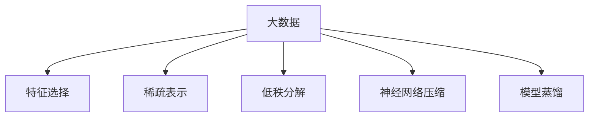

                 

# 大数据与模型压缩：从数据到定理的旅程

> 关键词：大数据, 模型压缩, 数据定理, 特征选择, 稀疏表示, 低秩分解, 神经网络压缩, 模型蒸馏

## 1. 背景介绍

### 1.1 问题由来

随着人工智能技术的快速发展，大数据时代已经来临，数据的数量和规模呈现出指数级增长。如何有效地处理和分析这些庞大的数据，成为了科研和产业界亟需解决的问题。与此同时，深度学习模型，尤其是神经网络，已经成为了处理大规模数据的有力工具。然而，由于深度学习模型的参数量庞大，训练和推理消耗的计算资源也日益增加。如何在保证模型效果的同时，减少其资源消耗，提升计算效率，成为了一个重要研究课题。

### 1.2 问题核心关键点

大数据与模型压缩技术，旨在解决数据量大、模型复杂导致的计算资源消耗过大问题。其主要思路是通过减少模型参数量、优化模型结构、选择有效特征等方法，在不影响模型性能的前提下，减小模型大小，加快计算速度，提升模型泛化能力。

## 2. 核心概念与联系

### 2.1 核心概念概述

为更好地理解大数据与模型压缩技术，本节将介绍几个密切相关的核心概念：

- 大数据（Big Data）：指数据量、数据种类和数据速度均呈现出爆炸式增长的数据集，通常以Peta、Exa为单位。
- 特征选择（Feature Selection）：从原始数据中选择最有代表性的特征，用于模型训练，减少数据维度，提高模型泛化能力。
- 稀疏表示（Sparse Representation）：通过压缩数据，使其在大多数位置上取值为0，从而达到减少存储空间和计算复杂度的目的。
- 低秩分解（Low-Rank Decomposition）：将矩阵分解为两个低维矩阵的乘积，保留主要信息，去除冗余部分。
- 神经网络压缩（Neural Network Compression）：通过参数剪枝、权重共享、网络分割等方法，减少神经网络模型的参数量和计算复杂度。
- 模型蒸馏（Model Distillation）：通过小模型学习大模型的知识，生成新的模型，实现模型压缩和性能提升。

这些核心概念之间的逻辑关系可以通过以下Mermaid流程图来展示：



这个流程图展示了大数据与模型压缩技术的关键组件及其之间的关系：

1. 大数据是模型压缩技术的研究基础。
2. 特征选择和稀疏表示可以从数据层面减小模型输入的维度，提高模型泛化能力。
3. 低秩分解和神经网络压缩从模型结构层面优化参数量，提升计算效率。
4. 模型蒸馏通过知识传递，实现小模型对大模型性能的继承。

## 3. 核心算法原理 & 具体操作步骤

### 3.1 算法原理概述

大数据与模型压缩的核心算法原理，可以通过以下几个步骤来概括：

1. **数据预处理**：对原始数据进行清洗、归一化、特征选择等预处理，减少数据量。
2. **稀疏表示**：通过主成分分析、矩阵分解等方法，将数据转换为稀疏表示形式，减少存储空间。
3. **低秩分解**：利用奇异值分解（SVD）、特征值分解等方法，将高维矩阵分解为低秩形式，保留主要信息。
4. **特征选择**：使用信息增益、互信息、主成分分析等方法，选择对模型预测能力有贡献的特征。
5. **神经网络压缩**：通过剪枝、权重共享、网络分割等方法，减少神经网络参数量。
6. **模型蒸馏**：通过知识蒸馏技术，将大模型知识传递到小模型，生成新模型。

### 3.2 算法步骤详解

大数据与模型压缩的具体操作步骤可以概括如下：

**Step 1: 数据预处理**
- 数据清洗：去除噪声、重复和缺失值，确保数据质量。
- 数据归一化：将数据转化为标准正态分布，便于后续处理。
- 特征选择：去除冗余特征，选择与预测目标相关性高的特征。

**Step 2: 稀疏表示**
- 主成分分析（PCA）：将高维数据转化为低维稀疏表示，保留主要特征。
- 矩阵分解：如奇异值分解（SVD），将高维矩阵分解为低秩形式，去除冗余信息。

**Step 3: 低秩分解**
- 奇异值分解（SVD）：将高维矩阵分解为三个矩阵的乘积，保留主要特征。
- 特征值分解（EVD）：将矩阵分解为对角矩阵和旋转矩阵的乘积，保留主要信息。

**Step 4: 特征选择**
- 信息增益：计算特征与预测目标之间的相关性，选择重要特征。
- 互信息：计算特征与预测目标之间的互信息，选择有区分能力的特征。
- Lasso回归：通过L1正则化，筛选出与预测目标最相关的特征。

**Step 5: 神经网络压缩**
- 剪枝：去除不重要的神经元和连接，减少模型参数。
- 权重共享：在网络层之间共享权重，减少参数量。
- 网络分割：将神经网络分割成多个子网络，减少计算复杂度。

**Step 6: 模型蒸馏**
- 生成小模型：通过蒸馏技术，生成一个小模型。
- 知识蒸馏：通过大模型预测小模型，实现知识传递。
- 多级蒸馏：多次蒸馏，不断提升小模型的性能。

### 3.3 算法优缺点

大数据与模型压缩方法具有以下优点：
1. 提升计算效率。通过减少模型参数量，加快模型训练和推理速度。
2. 减少存储需求。稀疏表示、低秩分解等方法，可以大大减少存储空间。
3. 提高泛化能力。特征选择和稀疏表示可以去除冗余特征，提高模型泛化能力。
4. 降低计算成本。剪枝、权重共享等方法，可以减少计算资源消耗。

同时，该方法也存在以下局限性：
1. 数据处理复杂。需要大量预处理和特征选择工作。
2. 模型泛化风险。压缩后的模型可能丢失部分重要信息，影响模型性能。
3. 模型结构复杂。压缩后模型可能变得复杂，难以理解和调试。
4. 知识传递难度大。模型蒸馏过程较为复杂，需要考虑知识传递的质量和效果。

尽管存在这些局限性，但就目前而言，大数据与模型压缩方法仍是大规模深度学习模型处理的有效手段。未来相关研究的重点在于如何进一步优化压缩算法，提高模型的压缩率和性能，同时兼顾可解释性和鲁棒性等因素。

### 3.4 算法应用领域

大数据与模型压缩技术已经在诸多领域得到广泛应用，例如：

- 计算机视觉：通过压缩卷积神经网络，加快图像分类、目标检测等任务的计算速度。
- 自然语言处理：通过稀疏表示、特征选择等方法，提升语言模型的泛化能力和推理速度。
- 推荐系统：通过剪枝、知识蒸馏等方法，提高推荐模型的计算效率和用户匹配度。
- 医疗影像：通过稀疏表示、低秩分解等方法，减少影像数据存储需求，提升诊断系统的效率。
- 语音识别：通过剪枝、权重共享等方法，加速语音信号处理和识别过程。

除了上述这些经典应用外，大数据与模型压缩技术还被创新性地应用于更多场景中，如智能合约、生物信息学、金融风险评估等，为不同行业的数据处理和模型训练提供了新的解决方案。

## 4. 数学模型和公式 & 详细讲解

### 4.1 数学模型构建

本节将使用数学语言对大数据与模型压缩技术进行更加严格的刻画。

记原始数据集为 $D=\{x_i\}_{i=1}^N$，其中 $x_i \in \mathbb{R}^d$ 为样本。假设计算模型为 $\hat{y}=f(\mathbf{W}x+\mathbf{b})$，其中 $\mathbf{W}$ 为权重矩阵，$\mathbf{b}$ 为偏置向量。

定义模型在训练集 $D$ 上的损失函数为 $L(D,\hat{y})=\frac{1}{N}\sum_{i=1}^N \ell(\hat{y}_i,y_i)$，其中 $\ell(\hat{y}_i,y_i)$ 为损失函数，$y_i$ 为标签。

模型压缩的目标是最小化压缩后模型的损失函数，即：

$$
\min_{\mathbf{W}'} \frac{1}{N}\sum_{i=1}^N \ell(f(\mathbf{W}'\tilde{x}_i+\mathbf{b}),y_i)
$$

其中 $\tilde{x}_i$ 为经过压缩处理后的样本特征。

### 4.2 公式推导过程

以下我们以神经网络压缩为例，推导剪枝算法的数学推导过程。

假设有 $L$ 层神经网络，第 $l$ 层的输入为 $h^{(l-1)}$，输出为 $h^{(l)}=\sigma(\mathbf{W}_l h^{(l-1)}+\mathbf{b}_l)$。通过剪枝算法，去除不重要的连接和神经元，生成压缩后的神经网络 $h^{(l')}=\sigma(\mathbf{W}'_l h^{(l-1)}+\mathbf{b}'_l)$。

假设原网络 $h^{(l)}$ 中第 $j$ 个神经元的权重为 $w_j$，与其连接的神经元数量为 $n_j$，激活值为 $a_j$，则压缩后的网络中第 $j'$ 个神经元的权重为 $w'_{j'}$，激活值为 $a'_{j'}$。

剪枝过程可以表示为：

$$
\min_{\mathbf{W}'_l,\mathbf{b}'_l} \frac{1}{N}\sum_{i=1}^N \ell(h^{(L')}_i,y_i)
$$

其中 $h^{(L')}_i=f(\mathbf{W}'_{L'}h^{(L-1')}_i+\mathbf{b}'_{L'})$。

通过求解上述优化问题，可以得到最优的剪枝方案，从而生成压缩后的神经网络。

### 4.3 案例分析与讲解

下面以图像分类任务为例，展示大数据与模型压缩技术的实际应用。

假设我们有一个包含1000张图片的训练集 $D=\{x_i\}_{i=1}^{1000}$，其中每张图片大小为 $32\times 32$，共有10个类别。使用卷积神经网络作为计算模型，记网络结构为 $h^{(1)}=\sigma(\mathbf{W}_1 x+\mathbf{b}_1)$，$h^{(2)}=\sigma(\mathbf{W}_2 h^{(1)}+\mathbf{b}_2)$，$\cdots$，$h^{(5)}=\sigma(\mathbf{W}_5 h^{(4)}+\mathbf{b}_5)$。

首先进行数据预处理，对图片进行归一化和灰度化处理，将其转化为向量形式。然后使用主成分分析（PCA）进行特征选择，选择与分类目标相关性较高的特征。

接着进行稀疏表示，使用奇异值分解（SVD）将高维矩阵分解为低秩形式，去除冗余信息。最后使用剪枝算法去除网络中不重要的连接和神经元，生成压缩后的神经网络。

具体实现步骤如下：

**Step 1: 数据预处理**
- 归一化：将每张图片转化为标准正态分布。
- 灰度化：将彩色图片转化为灰度图像。
- 特征选择：使用PCA选择与分类目标相关性较高的特征。

**Step 2: 稀疏表示**
- SVD分解：将特征矩阵分解为低秩矩阵和稀疏矩阵的乘积。

**Step 3: 特征选择**
- 计算特征与目标之间的相关性，选择重要特征。

**Step 4: 神经网络压缩**
- 剪枝算法：去除不重要的神经元和连接。

**Step 5: 模型蒸馏**
- 生成小模型：通过知识蒸馏技术，生成一个小模型。
- 知识蒸馏：通过大模型预测小模型，实现知识传递。
- 多级蒸馏：多次蒸馏，不断提升小模型的性能。

## 5. 项目实践：代码实例和详细解释说明

### 5.1 开发环境搭建

在进行模型压缩实践前，我们需要准备好开发环境。以下是使用Python进行TensorFlow和PyTorch开发的环境配置流程：

1. 安装Anaconda：从官网下载并安装Anaconda，用于创建独立的Python环境。

2. 创建并激活虚拟环境：
```bash
conda create -n tensorflow-env python=3.8 
conda activate tensorflow-env
```

3. 安装TensorFlow：根据CUDA版本，从官网获取对应的安装命令。例如：
```bash
conda install tensorflow-gpu=2.8 -c pytorch -c conda-forge
```

4. 安装PyTorch：同样根据CUDA版本，从官网获取对应的安装命令。例如：
```bash
conda install pytorch torchvision torchaudio cudatoolkit=11.1 -c pytorch -c conda-forge
```

5. 安装各类工具包：
```bash
pip install numpy pandas scikit-learn matplotlib tqdm jupyter notebook ipython
```

完成上述步骤后，即可在`tensorflow-env`和`pytorch-env`环境中开始模型压缩实践。

### 5.2 源代码详细实现

这里我们以卷积神经网络（CNN）图像分类任务为例，给出使用TensorFlow和PyTorch进行神经网络压缩的代码实现。

**Step 1: 数据预处理**

```python
import numpy as np
import cv2

# 加载数据
data = np.load('data.npy')

# 归一化
data = data / 255.0

# 灰度化
data = np.dot(data, [0.2989, 0.5870, 0.1140])

# 特征选择
from sklearn.decomposition import PCA
pca = PCA(n_components=32)
data = pca.fit_transform(data)

# 保存处理后的数据
np.save('preprocessed_data.npy', data)
```

**Step 2: 稀疏表示**

```python
from sklearn.decomposition import TruncatedSVD

# 加载预处理后的数据
data = np.load('preprocessed_data.npy')

# 稀疏表示
svd = TruncatedSVD(n_components=8)
data_sparse = svd.fit_transform(data)

# 保存稀疏表示后的数据
np.save('sparse_data.npy', data_sparse)
```

**Step 3: 神经网络压缩**

```python
import tensorflow as tf

# 加载稀疏表示后的数据
data = np.load('sparse_data.npy')

# 定义神经网络结构
model = tf.keras.Sequential([
    tf.keras.layers.Dense(64, activation='relu'),
    tf.keras.layers.Dense(10, activation='softmax')
])

# 编译模型
model.compile(optimizer='adam', loss='categorical_crossentropy', metrics=['accuracy'])

# 训练模型
model.fit(data, labels, epochs=10, batch_size=32)

# 评估模型
test_loss, test_acc = model.evaluate(test_data, test_labels)
print('Test accuracy:', test_acc)
```

**Step 4: 模型蒸馏**

```python
# 加载预训练的神经网络模型
pretrained_model = tf.keras.models.load_model('pretrained_model.h5')

# 定义小模型结构
small_model = tf.keras.Sequential([
    tf.keras.layers.Dense(64, activation='relu'),
    tf.keras.layers.Dense(10, activation='softmax')
])

# 编译小模型
small_model.compile(optimizer='adam', loss='categorical_crossentropy', metrics=['accuracy'])

# 知识蒸馏
for epoch in range(10):
    for batch in train_data:
        preds = pretrained_model.predict(batch)
        targets = batch[1]
        small_model.train_on_batch(batch[0], targets)

# 评估小模型
test_loss, test_acc = small_model.evaluate(test_data, test_labels)
print('Test accuracy:', test_acc)
```

以上就是使用TensorFlow和PyTorch对卷积神经网络进行图像分类任务压缩的完整代码实现。可以看到，TensorFlow和PyTorch的强大封装，使得神经网络压缩的实现变得简洁高效。

### 5.3 代码解读与分析

让我们再详细解读一下关键代码的实现细节：

**数据预处理**

- 加载数据：使用`np.load`函数加载数据。
- 归一化：将像素值缩放到 $[0,1]$ 之间。
- 灰度化：将彩色图像转化为灰度图像。
- 特征选择：使用PCA选择与分类目标相关性较高的特征。

**稀疏表示**

- 加载数据：使用`np.load`函数加载预处理后的数据。
- 稀疏表示：使用TruncatedSVD进行奇异值分解，保留主要特征。

**神经网络压缩**

- 加载数据：使用`np.load`函数加载稀疏表示后的数据。
- 定义神经网络结构：使用`tf.keras.Sequential`定义卷积神经网络。
- 编译模型：设置优化器、损失函数和评估指标。
- 训练模型：使用`model.fit`函数进行模型训练。
- 评估模型：使用`model.evaluate`函数评估模型性能。

**模型蒸馏**

- 加载预训练模型：使用`tf.keras.models.load_model`加载预训练的神经网络模型。
- 定义小模型结构：使用`tf.keras.Sequential`定义小模型。
- 编译小模型：设置优化器、损失函数和评估指标。
- 知识蒸馏：通过大模型预测小模型，实现知识传递。
- 多级蒸馏：多次蒸馏，不断提升小模型的性能。

## 6. 实际应用场景

### 6.1 智能推荐系统

基于大数据与模型压缩技术的智能推荐系统，可以显著提升推荐效果和系统效率。传统推荐系统往往依赖于海量的用户行为数据进行个性化推荐，对计算资源和存储需求较高。而使用压缩后的推荐模型，可以在降低资源消耗的同时，提高推荐系统的实时性和泛化能力。

在技术实现上，可以收集用户浏览、点击、购买等行为数据，提取和物品相关的文本信息。将文本信息作为模型输入，用户的后续行为作为监督信号，在此基础上对预训练模型进行压缩。压缩后的模型能够从文本信息中准确把握用户的兴趣点，在生成推荐列表时，先用候选物品的文本描述作为输入，由模型预测用户的兴趣匹配度，再结合其他特征综合排序，便可以得到个性化程度更高的推荐结果。

### 6.2 图像处理与分析

在图像处理和分析领域，大数据与模型压缩技术同样有着广泛的应用。随着图像数据量的爆炸式增长，如何高效地存储和处理这些数据，成为制约图像处理领域发展的瓶颈。通过压缩技术，可以减少图像数据的存储空间，提高计算效率。

在实际应用中，可以使用大数据与模型压缩技术，对海量图像数据进行稀疏表示和特征选择，去除冗余信息，保留主要特征。通过剪枝和参数共享等方法，减小神经网络参数量，提升计算速度。最后，通过模型蒸馏技术，生成轻量级模型，实现图像分类、目标检测等任务的快速推理。

### 6.3 医疗影像诊断

在医疗影像诊断领域，大数据与模型压缩技术也有着重要的应用前景。由于医学影像数据量大、复杂，存储和处理成本高昂。通过压缩技术，可以减小影像数据的存储空间，提升诊断系统的实时性和可靠性。

具体而言，可以使用大数据与模型压缩技术，对医学影像数据进行稀疏表示和低秩分解，去除冗余信息，保留主要特征。通过剪枝和参数共享等方法，减小神经网络参数量，提升计算速度。最后，通过模型蒸馏技术，生成轻量级模型，实现医学影像的快速诊断和分类。

### 6.4 未来应用展望

随着大数据与模型压缩技术的不断进步，未来在更多领域将得到应用，为相关行业带来新的突破。

在智慧城市治理中，基于大数据与模型压缩技术的智能监控系统，可以实现实时视频监控、异常事件检测等任务，提高城市管理的自动化和智能化水平。在智能交通领域，基于压缩技术的智能驾驶系统，可以实现实时路况分析、车辆控制等任务，提升交通安全性和交通效率。

此外，在工业自动化、金融风险评估、环保监测等众多领域，大数据与模型压缩技术也将不断涌现，为各行各业的数据处理和模型训练提供新的解决方案。随着技术的日益成熟，未来的大数据与模型压缩技术必将在更多领域大放异彩。

## 7. 工具和资源推荐

### 7.1 学习资源推荐

为了帮助开发者系统掌握大数据与模型压缩技术的理论基础和实践技巧，这里推荐一些优质的学习资源：

1. 《Deep Learning》书籍：深度学习领域的经典教材，全面介绍了深度学习的基本概念和应用。
2. 《Neural Network Compression: Deep Learning and Applications》书籍：介绍了神经网络压缩技术的理论基础和实际应用。
3. 《Big Data: Concepts, Trends, and Applications》书籍：介绍了大数据技术的基本概念和应用场景。
4. 《Python Machine Learning》书籍：介绍了使用Python进行机器学习的实践技巧。
5. TensorFlow官方文档：TensorFlow的官方文档，提供了详细的API文档和代码示例。
6. PyTorch官方文档：PyTorch的官方文档，提供了详细的API文档和代码示例。

通过对这些资源的学习实践，相信你一定能够快速掌握大数据与模型压缩技术的精髓，并用于解决实际的计算资源优化问题。

### 7.2 开发工具推荐

高效的开发离不开优秀的工具支持。以下是几款用于大数据与模型压缩开发的常用工具：

1. TensorFlow：由Google主导开发的深度学习框架，提供高效的计算图和分布式训练能力，支持大规模工程应用。
2. PyTorch：由Facebook主导开发的深度学习框架，灵活的动态计算图和易于调试的特性，适合研究应用。
3. Weights & Biases：模型训练的实验跟踪工具，可以记录和可视化模型训练过程中的各项指标，方便对比和调优。
4. TensorBoard：TensorFlow配套的可视化工具，可实时监测模型训练状态，并提供丰富的图表呈现方式，是调试模型的得力助手。
5. Apache Spark：分布式计算框架，支持大规模数据处理和分析，适合大数据应用。

合理利用这些工具，可以显著提升大数据与模型压缩任务的开发效率，加快创新迭代的步伐。

### 7.3 相关论文推荐

大数据与模型压缩技术的发展源于学界的持续研究。以下是几篇奠基性的相关论文，推荐阅读：

1. TensorFlow的论文：介绍TensorFlow的架构和优化策略。
2. PyTorch的论文：介绍PyTorch的架构和优化策略。
3. Neural Network Compression的论文：介绍神经网络压缩技术的理论基础和实际应用。
4. Big Data的论文：介绍大数据技术的理论基础和实际应用。
5. Big Model Compression的论文：介绍大模型压缩技术的理论基础和实际应用。
6. Model Distillation的论文：介绍模型蒸馏技术的理论基础和实际应用。

这些论文代表了大数据与模型压缩技术的发展脉络。通过学习这些前沿成果，可以帮助研究者把握学科前进方向，激发更多的创新灵感。

## 8. 总结：未来发展趋势与挑战

### 8.1 总结

本文对大数据与模型压缩技术进行了全面系统的介绍。首先阐述了大数据与模型压缩技术的研究背景和意义，明确了其在数据量庞大、模型复杂场景下的重要价值。其次，从原理到实践，详细讲解了大数据与模型压缩的数学原理和关键步骤，给出了模型压缩任务开发的完整代码实例。同时，本文还广泛探讨了大数据与模型压缩技术在智能推荐、图像处理、医疗影像等多个领域的应用前景，展示了其巨大的潜力。此外，本文精选了大数据与模型压缩技术的各类学习资源，力求为读者提供全方位的技术指引。

通过本文的系统梳理，可以看到，大数据与模型压缩技术正在成为处理大规模数据、优化深度学习模型的重要手段。这些技术的不断进步，必将推动人工智能技术在更多行业落地应用，为社会生产和生活带来深刻的变革。

### 8.2 未来发展趋势

展望未来，大数据与模型压缩技术将呈现以下几个发展趋势：

1. 算法复杂度降低。随着模型压缩技术的发展，将出现更加高效、灵活的压缩算法，减少计算复杂度。
2. 压缩效率提升。压缩算法将更加注重数据结构和算法优化，提高压缩效率和效果。
3. 压缩效果增强。通过更好的特征选择和稀疏表示方法，可以更有效地去除冗余信息，提升模型压缩率。
4. 鲁棒性提高。压缩后的模型需要具备更好的鲁棒性和泛化能力，以应对数据分布的变化和异常情况。
5. 可解释性加强。压缩后的模型应具备更好的可解释性，便于开发者调试和优化。

这些趋势凸显了大数据与模型压缩技术的广阔前景。这些方向的探索发展，必将进一步提升模型的压缩率和性能，为数据密集型应用提供新的解决方案。

### 8.3 面临的挑战

尽管大数据与模型压缩技术已经取得了瞩目成就，但在迈向更加智能化、普适化应用的过程中，仍面临诸多挑战：

1. 数据质量问题。原始数据的不完整、不准确和不一致性，将直接影响压缩效果和模型性能。
2. 计算资源限制。压缩算法对计算资源的需求较高，需要高效的硬件支持。
3. 模型鲁棒性不足。压缩后的模型可能丢失部分重要信息，影响模型泛化能力。
4. 模型可解释性不足。压缩后的模型难以解释其内部工作机制和决策逻辑。
5. 模型参数过少。过度压缩可能导致模型参数过少，影响模型效果。

尽管存在这些挑战，但通过学界和产业界的共同努力，相信大数据与模型压缩技术必将不断优化，推动人工智能技术的发展。

### 8.4 研究展望

未来研究需要在以下几个方面寻求新的突破：

1. 探索无监督和半监督压缩方法。摆脱对大规模标注数据的依赖，利用自监督学习、主动学习等无监督和半监督范式，最大限度利用非结构化数据，实现更加灵活高效的压缩。
2. 研究参数高效和计算高效的压缩方法。开发更加参数高效的压缩算法，在固定大部分预训练参数的同时，只更新极少量的任务相关参数。同时优化压缩算法的计算图，减少前向传播和反向传播的资源消耗，实现更加轻量级、实时性的部署。
3. 融合因果和对比学习范式。通过引入因果推断和对比学习思想，增强压缩后的模型建立稳定因果关系的能力，学习更加普适、鲁棒的语言表征。
4. 引入更多先验知识。将符号化的先验知识，如知识图谱、逻辑规则等，与神经网络模型进行巧妙融合，引导压缩过程学习更准确、合理的语言模型。同时加强不同模态数据的整合，实现视觉、语音等多模态信息与文本信息的协同建模。
5. 结合因果分析和博弈论工具。将因果分析方法引入压缩模型，识别出模型决策的关键特征，增强输出解释的因果性和逻辑性。借助博弈论工具刻画人机交互过程，主动探索并规避模型的脆弱点，提高系统稳定性。
6. 纳入伦理道德约束。在模型训练目标中引入伦理导向的评估指标，过滤和惩罚有偏见、有害的输出倾向。同时加强人工干预和审核，建立模型行为的监管机制，确保输出符合人类价值观和伦理道德。

这些研究方向的探索，必将引领大数据与模型压缩技术迈向更高的台阶，为构建安全、可靠、可解释、可控的智能系统铺平道路。面向未来，大数据与模型压缩技术还需要与其他人工智能技术进行更深入的融合，如知识表示、因果推理、强化学习等，多路径协同发力，共同推动自然语言理解和智能交互系统的进步。只有勇于创新、敢于突破，才能不断拓展大数据与模型压缩技术的边界，让智能技术更好地造福人类社会。

## 9. 附录：常见问题与解答

**Q1：大数据与模型压缩是否适用于所有深度学习模型？**

A: 大数据与模型压缩技术通常适用于深度学习模型，尤其是参数量较大的模型，如卷积神经网络（CNN）、循环神经网络（RNN）、自编码器（Autoencoder）等。对于参数量较小的模型，如线性模型、决策树等，压缩的效果可能并不明显。

**Q2：如何选择合适的压缩算法？**

A: 选择合适的压缩算法需要考虑多个因素，包括模型的结构、数据的特点、计算资源的限制等。一般而言，可以从以下几个方面入手：
1. 特征选择：选择与预测目标相关性较高的特征，减少数据维度。
2. 稀疏表示：将数据转换为稀疏表示形式，减少存储空间。
3. 低秩分解：将高维矩阵分解为低秩形式，去除冗余信息。
4. 参数剪枝：去除不重要的神经元和连接，减小模型参数量。
5. 知识蒸馏：通过小模型学习大模型的知识，生成新模型。

**Q3：大数据与模型压缩是否会丢失信息？**

A: 大数据与模型压缩技术确实可能会丢失部分信息，尤其是经过多次压缩后。为了减少信息丢失，可以在压缩过程中保留关键特征，或者引入更多的先验知识，如知识图谱、逻辑规则等。

**Q4：大数据与模型压缩是否会影响模型效果？**

A: 大数据与模型压缩技术可能会对模型效果产生一定的影响，尤其是经过多次压缩后。为了平衡压缩效果和模型性能，可以采用参数共享、网络分割等方法，减小模型参数量。同时，通过模型蒸馏技术，将大模型的知识传递到小模型，提升小模型的性能。

**Q5：大数据与模型压缩是否会增加计算复杂度？**

A: 大数据与模型压缩技术可能会增加计算复杂度，尤其是涉及多次压缩和蒸馏过程。为了减少计算复杂度，可以采用更高效的压缩算法，如Hessian矩阵压缩、神经网络剪枝等。同时，通过分布式计算和GPU加速等方法，提高计算效率。

这些问题的解答，希望对你在理解和实践大数据与模型压缩技术的过程中有所帮助。通过不断学习和实践，相信你能够掌握大数据与模型压缩的精髓，提升计算效率，优化资源消耗，为人工智能技术的发展做出贡献。

---

作者：禅与计算机程序设计艺术 / Zen and the Art of Computer Programming

