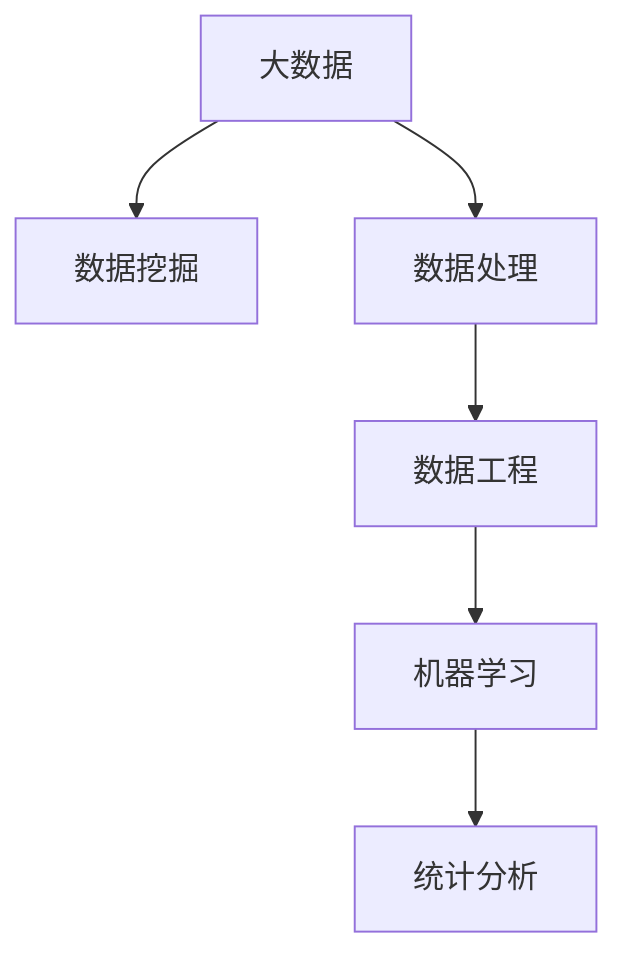

                 

# 大数据分析 原理与代码实例讲解

> 关键词：大数据分析, 数据挖掘, 数据处理, 机器学习, 统计分析, 代码实例, 数据可视化, 数据工程

## 1. 背景介绍

### 1.1 问题由来
随着互联网和物联网技术的飞速发展，人类社会产生的数据量呈爆炸式增长。根据国际数据公司(IDC)预测，到2025年，全球数据量将达到175ZB（175万亿亿字节）。在这样的背景下，数据已经成为了一种全新的生产要素，分析和挖掘其中的价值，成为了各行各业的核心竞争力之一。

然而，传统的统计分析方法已经难以应对大规模数据带来的复杂性和多样性。基于机器学习和统计学的现代数据分析方法应运而生，利用计算机算法从数据中挖掘出有价值的知识和模式，帮助人们做出更加精准的决策。

大数据分析（Big Data Analytics）作为一门交叉学科，结合了计算机科学、统计学、数学等多个领域的知识，旨在高效、准确地处理和分析海量数据，提取有价值的商业洞察，为企业决策提供有力支持。

## 2. 核心概念与联系

### 2.1 核心概念概述

为更好地理解大数据分析的方法和原理，本节将介绍几个密切相关的核心概念：

- 大数据（Big Data）：指数据量巨大、数据种类多样、数据来源广泛的数据集合。包括结构化数据、半结构化数据和无结构化数据等多种类型。
- 数据挖掘（Data Mining）：通过统计、机器学习等方法，从大量数据中发现有用的模式、趋势和知识的过程。数据挖掘是大数据分析的重要组成部分。
- 数据处理（Data Processing）：对原始数据进行清洗、转换、汇总、过滤等操作，为数据分析提供干净的输入数据。
- 数据工程（Data Engineering）：构建、维护和管理数据仓库，设计高效的数据管道和算法，以支持大规模数据处理和分析。
- 机器学习（Machine Learning）：通过算法训练模型，实现对数据的自动分析和预测。
- 统计分析（Statistical Analysis）：利用统计学方法，对数据进行描述性分析和推断性分析，提取数据的分布特征和规律。

这些概念之间的逻辑关系可以通过以下Mermaid流程图来展示：



这个流程图展示了大数据分析的主要流程：

1. 从各种来源收集数据。
2. 对原始数据进行处理和清洗，提取有用的信息。
3. 构建高效的数据管道和算法，支持大规模数据分析。
4. 利用机器学习和统计学方法，提取数据中的知识。

## 3. 核心算法原理 & 具体操作步骤
### 3.1 算法原理概述

大数据分析的核心算法通常包括以下几个步骤：

- **数据收集（Data Collection）**：从各种来源收集数据，包括日志文件、传感器数据、社交媒体数据、数据库等。
- **数据清洗（Data Cleaning）**：对收集到的数据进行去重、缺失值处理、异常值检测等操作，保证数据质量。
- **数据转换（Data Transformation）**：对数据进行格式化、归一化、特征工程等操作，使其适合进一步分析。
- **数据挖掘（Data Mining）**：使用分类、聚类、关联规则等算法，从数据中发现有用的模式和规律。
- **模型训练（Model Training）**：使用机器学习算法，训练模型进行预测或分类。
- **结果评估（Result Evaluation）**：对模型结果进行评估和优化，验证其准确性和泛化能力。

### 3.2 算法步骤详解

以下是大数据分析的主要算法步骤和具体操作步骤的详细讲解：

**Step 1: 数据收集**

数据收集是大数据分析的第一步，数据来源广泛，包括日志文件、传感器数据、社交媒体数据、数据库等。在实际应用中，通常采用ETL（Extract, Transform, Load）的方式进行数据收集和处理。

**Step 2: 数据清洗**

数据清洗是指对原始数据进行去重、缺失值处理、异常值检测等操作，保证数据质量。常用的数据清洗方法包括：

- 去重：通过唯一标识符去重，避免重复数据。
- 缺失值处理：采用均值、中位数、众数等方法填补缺失值。
- 异常值检测：通过统计学方法检测和修正异常值。

**Step 3: 数据转换**

数据转换是指对数据进行格式化、归一化、特征工程等操作，使其适合进一步分析。常用的数据转换方法包括：

- 格式化：将数据转换为标准格式，如日期格式化、文本标准化等。
- 归一化：对数据进行标准化处理，使数据在相同的量级下进行比较。
- 特征工程：提取和构造数据特征，如统计特征、时间特征、文本特征等。

**Step 4: 数据挖掘**

数据挖掘是指使用分类、聚类、关联规则等算法，从数据中发现有用的模式和规律。常用的数据挖掘方法包括：

- 分类：将数据分成不同的类别，如决策树、随机森林、支持向量机等。
- 聚类：将数据分成不同的组，如K-Means、层次聚类等。
- 关联规则：发现数据之间的关联性，如Apriori算法。

**Step 5: 模型训练**

模型训练是指使用机器学习算法，训练模型进行预测或分类。常用的机器学习算法包括：

- 线性回归、逻辑回归、支持向量机等传统机器学习算法。
- 决策树、随机森林、梯度提升树等集成学习算法。
- 神经网络、深度学习等深度学习算法。

**Step 6: 结果评估**

结果评估是指对模型结果进行评估和优化，验证其准确性和泛化能力。常用的结果评估方法包括：

- 混淆矩阵：评估分类算法的准确性、召回率、F1分数等指标。
- ROC曲线：评估二分类算法的准确性和稳定性。
- 均方误差、平均绝对误差等指标：评估回归算法的准确性。

### 3.3 算法优缺点

大数据分析算法具有以下优点：

- 高准确性：利用先进的机器学习算法，能够从海量数据中提取出准确的规律和模式。
- 自动化：通过算法自动化处理数据，减少了人工干预，提高了效率。
- 灵活性：算法可以根据不同场景进行调整，具有高度的灵活性。

同时，这些算法也存在一些局限性：

- 数据质量要求高：大数据分析对数据质量的要求较高，数据清洗和处理需要投入大量的时间和资源。
- 复杂度高：大数据分析算法较为复杂，需要深入理解其原理和实现。
- 计算资源需求大：大数据分析需要大量的计算资源，如高性能计算集群、GPU等。

### 3.4 算法应用领域

大数据分析广泛应用于各个领域，以下是几个典型的应用场景：

- **金融行业**：利用数据分析进行风险评估、信用评分、反欺诈等。
- **电商行业**：通过用户行为数据分析，进行个性化推荐、用户画像构建等。
- **医疗行业**：通过患者数据进行分析，进行疾病预测、药物研发等。
- **交通行业**：利用交通数据进行分析，进行交通流量预测、路线优化等。
- **社交媒体**：通过社交媒体数据进行分析，进行舆情分析、用户行为分析等。

## 4. 数学模型和公式 & 详细讲解

### 4.1 数学模型构建

本节将使用数学语言对大数据分析的主要算法进行更加严格的刻画。

记数据集为 $D=\{(x_i, y_i)\}_{i=1}^N$，其中 $x_i$ 为输入特征，$y_i$ 为输出标签。大数据分析的目标是通过学习模型 $M(x)$，将输入特征 $x$ 映射到输出标签 $y$。常见的数学模型包括：

- 线性回归模型：$M(x) = w_0 + \sum_{j=1}^n w_j x_j$
- 逻辑回归模型：$M(x) = \frac{1}{1+e^{-w_0 - \sum_{j=1}^n w_j x_j}}$
- 决策树模型：构建一棵决策树，根据特征进行分类。
- 随机森林模型：由多棵决策树组成的集成模型。
- 支持向量机模型：通过构造最优超平面进行分类。
- 神经网络模型：多层神经元组成的非线性模型。

### 4.2 公式推导过程

以下我们以线性回归模型为例，推导其训练和预测过程。

**训练过程**：

给定训练集 $D=\{(x_i, y_i)\}_{i=1}^N$，线性回归模型的训练过程可以表示为：

$$
\hat{w} = \arg\min_{w} \sum_{i=1}^N (y_i - \hat{y}_i)^2
$$

其中 $\hat{y}_i = w_0 + \sum_{j=1}^n w_j x_{ij}$ 为模型预测值，$w_0, w_j$ 为模型参数。

使用最小二乘法求解上述最优化问题，得到：

$$
\hat{w} = (X^TX)^{-1}X^Ty
$$

其中 $X$ 为特征矩阵，$y$ 为标签向量，$(X^TX)^{-1}$ 为矩阵的逆矩阵。

**预测过程**：

给定新的输入 $x$，使用训练好的模型进行预测：

$$
\hat{y} = w_0 + \sum_{j=1}^n w_j x_j
$$

其中 $x_j$ 为输入 $x$ 的第 $j$ 个特征。

### 4.3 案例分析与讲解

下面以一个简单的电商用户数据分析为例，展示大数据分析的应用。

**数据集**：假设我们有一个电商网站的销售数据，包含了用户ID、购买时间、购买金额、商品ID等字段。

**数据处理**：
1. 去重：通过用户ID去重，避免重复数据。
2. 缺失值处理：对于购买金额缺失的数据，采用均值填补。
3. 归一化：对购买时间进行归一化处理，使数据在相同的量级下进行比较。
4. 特征工程：提取用户ID、商品ID、购买时间等特征。

**数据挖掘**：
1. 用户画像构建：通过聚类算法对用户进行分组，识别不同用户群体的消费特征。
2. 购买行为分析：通过分类算法预测用户是否会继续购买，提高用户留存率。

**模型训练**：
1. 线性回归模型：通过历史销售数据训练模型，预测用户的购买金额。
2. 随机森林模型：通过用户画像和购买行为，训练模型进行用户分类。

**结果评估**：
1. 混淆矩阵：评估用户分类模型的准确性和召回率。
2. ROC曲线：评估用户分类模型的稳定性和泛化能力。

通过以上步骤，我们可以从电商数据中提取出有用的信息，为电商平台的运营提供有力的支持。

## 5. 项目实践：代码实例和详细解释说明

### 5.1 开发环境搭建

在进行大数据分析项目开发前，我们需要准备好开发环境。以下是使用Python进行Pandas和Scikit-learn开发的环境配置流程：

1. 安装Anaconda：从官网下载并安装Anaconda，用于创建独立的Python环境。

2. 创建并激活虚拟环境：
```bash
conda create -n data-env python=3.8 
conda activate data-env
```

3. 安装Pandas：
```bash
conda install pandas
```

4. 安装Scikit-learn：
```bash
conda install scikit-learn
```

5. 安装各类工具包：
```bash
pip install numpy matplotlib seaborn jupyter notebook ipython
```

完成上述步骤后，即可在`data-env`环境中开始数据分析实践。

### 5.2 源代码详细实现

下面我们以电商用户数据分析为例，给出使用Pandas和Scikit-learn进行数据分析的Python代码实现。

首先，定义数据处理函数：

```python
import pandas as pd
from sklearn.preprocessing import MinMaxScaler, StandardScaler
from sklearn.decomposition import PCA
from sklearn.cluster import KMeans
from sklearn.ensemble import RandomForestClassifier

def preprocess_data(data, scale=True, pca=False, kmeans=False):
    # 去重
    data.drop_duplicates(inplace=True)
    
    # 缺失值处理
    data.fillna(data.mean(), inplace=True)
    
    # 归一化
    if scale:
        scaler = MinMaxScaler()
        data = scaler.fit_transform(data)
    
    # PCA降维
    if pca:
        pca = PCA(n_components=2)
        data = pca.fit_transform(data)
    
    # K-Means聚类
    if kmeans:
        kmeans = KMeans(n_clusters=3, random_state=42)
        data['cluster'] = kmeans.fit_predict(data[['购买金额', '购买时间']])
    
    return data
```

然后，定义数据挖掘函数：

```python
def cluster_analysis(data, feature):
    # 聚类分析
    kmeans = KMeans(n_clusters=3, random_state=42)
    data['cluster'] = kmeans.fit_predict(data[[feature]])
    
    return data
```

接着，定义模型训练和评估函数：

```python
from sklearn.linear_model import LinearRegression
from sklearn.metrics import mean_squared_error, r2_score

def train_model(data, feature, target):
    # 训练线性回归模型
    model = LinearRegression()
    X = data[[feature]]
    y = data[target]
    model.fit(X, y)
    y_pred = model.predict(X)
    
    return model, y_pred
```

最后，启动数据分析流程并在测试集上评估：

```python
# 读取数据集
data = pd.read_csv('sales_data.csv')

# 数据处理
data = preprocess_data(data, scale=True, pca=False, kmeans=True)

# 数据挖掘
data = cluster_analysis(data, feature='购买金额')

# 模型训练
model, y_pred = train_model(data, feature='购买金额', target='购买金额')

# 结果评估
mse = mean_squared_error(data['购买金额'], y_pred)
r2 = r2_score(data['购买金额'], y_pred)
print(f"MSE: {mse:.2f}, R^2: {r2:.2f}")
```

以上就是使用Python进行电商用户数据分析的完整代码实现。可以看到，Pandas和Scikit-learn为数据分析提供了强有力的工具，使得数据分析任务变得简单易行。

### 5.3 代码解读与分析

让我们再详细解读一下关键代码的实现细节：

**preprocess_data函数**：
- `drop_duplicates`方法：去除数据集中的重复记录。
- `fillna`方法：将缺失值填补为均值。
- `MinMaxScaler`类：对数据进行归一化处理。
- `PCA`类：进行主成分分析，降维处理。
- `KMeans`类：进行K-Means聚类，识别不同用户群体。

**cluster_analysis函数**：
- 调用K-Means聚类算法，识别用户集群。

**train_model函数**：
- 使用线性回归算法，训练模型进行预测。
- `mean_squared_error`和`r2_score`函数：评估模型预测的误差和拟合度。

通过以上步骤，我们完成了电商用户数据分析的完整流程。代码简洁高效，易于理解和扩展。

## 6. 实际应用场景

### 6.1 电商推荐系统

电商推荐系统通过分析用户行为数据，推荐用户可能感兴趣的商品，从而提高用户购买率和满意度。大数据分析技术在此类推荐系统中得到广泛应用，能够从海量用户数据中提取出有价值的特征，构建个性化的推荐模型。

在技术实现上，可以收集用户的浏览、点击、购买等行为数据，提取和构造数据特征，如购买历史、浏览历史、评价、收藏等。通过K-Means聚类算法，识别不同用户群体，并训练线性回归模型，预测用户可能感兴趣的物品。将预测结果与实际购买行为进行比较，不断优化模型参数，提升推荐效果。

### 6.2 医疗数据分析

医疗数据分析通过分析患者数据，提取疾病规律和特征，辅助医生诊断和治疗。大数据分析技术在此类应用中同样重要，能够从大量患者数据中提取出有用的信息，为医疗决策提供支持。

在具体实现中，可以收集患者的病历、检查报告、治疗记录等数据，提取和构造数据特征，如年龄、性别、疾病类型、治疗效果等。通过随机森林算法，训练模型进行疾病预测和诊断，辅助医生制定治疗方案。同时，可以利用聚类算法，识别不同的疾病类型，对疾病进行分类和研究。

### 6.3 交通流量预测

交通流量预测通过分析历史交通数据，预测未来的交通流量变化，帮助城市交通管理部门制定合理的交通策略。大数据分析技术在此类应用中具有重要意义，能够从海量的交通数据中提取出有用的信息，指导交通管理。

在具体实现中，可以收集历史交通流量数据，提取和构造数据特征，如时间、天气、节假日等。通过线性回归和决策树算法，训练模型进行交通流量预测，预测未来的交通流量变化。同时，可以利用PCA降维算法，对数据进行降维处理，提高模型的泛化能力。

### 6.4 未来应用展望

随着大数据分析技术的不断进步，其在各个领域的应用前景将更加广阔。以下是几个可能的发展方向：

1. **自动化数据分析**：通过自动化数据分析工具，提高数据分析的效率和准确性，减少人工干预。
2. **实时数据分析**：利用流计算技术，实现对实时数据的分析和处理，为实时决策提供支持。
3. **跨领域数据分析**：将不同领域的数据进行融合分析，提取有价值的跨领域知识。
4. **智能化数据分析**：利用机器学习算法，实现对数据的智能化分析和预测，提升数据分析的智能水平。
5. **隐私保护分析**：在数据分析过程中，保护用户隐私和数据安全，防止数据泄露和滥用。

## 7. 工具和资源推荐
### 7.1 学习资源推荐

为了帮助开发者系统掌握大数据分析的理论基础和实践技巧，这里推荐一些优质的学习资源：

1. 《Python数据科学手册》：一本全面介绍Python数据科学的书籍，涵盖Pandas、NumPy、Scikit-learn等核心库的使用。
2. Coursera《数据科学导论》课程：由约翰霍普金斯大学开设，提供从数据收集到模型训练的完整课程。
3. Kaggle平台：提供丰富的数据集和竞赛平台，通过实战练习提高数据分析能力。
4. DataCamp：提供大量数据分析实战课程，涵盖Pandas、SQL、Python等工具的使用。
5. Google Cloud BigQuery：提供强大的大数据分析和存储解决方案，支持SQL查询和数据可视化。

通过对这些资源的学习实践，相信你一定能够快速掌握大数据分析的精髓，并用于解决实际的业务问题。

### 7.2 开发工具推荐

高效的数据分析离不开优秀的工具支持。以下是几款用于大数据分析开发的常用工具：

1. Jupyter Notebook：支持Python和其他语言的交互式编程，支持代码编辑、可视化展示、实时计算等功能。
2. Apache Spark：提供大规模数据处理和分析能力，支持SQL查询和流计算。
3. Apache Hadoop：提供大规模数据存储和处理能力，支持分布式计算和数据挖掘。
4. Apache Flink：提供实时流处理能力，支持流计算和数据管道。
5. Apache Hive：提供大数据分析能力，支持SQL查询和数据仓库。

合理利用这些工具，可以显著提升大数据分析的开发效率，加快创新迭代的步伐。

### 7.3 相关论文推荐

大数据分析的发展离不开学界的持续研究。以下是几篇奠基性的相关论文，推荐阅读：

1. "The Google BigQuery Mode: A Unified Model for Big Data"：介绍Google BigQuery模式，一种高效的大数据存储和查询方式。
2. "Machine Learning for Healthcare: The Case for Programmable Healthcare"：探讨机器学习在医疗中的应用，强调数据分析的重要性。
3. "Big Data: Principles and Best Practices of Scalable Realtime Data Systems"：介绍大数据处理和分析的最佳实践，涵盖数据收集、存储、处理、分析等多个方面。
4. "A Survey of Big Data Analytics Tools and Technologies"：综述当前主流的大数据分析工具和技术，提供全面的参考。
5. "Real-time Big Data Analytics: Trends and Future Directions"：探讨实时大数据分析的发展趋势和技术方向，展望未来应用前景。

这些论文代表了大数据分析的发展脉络。通过学习这些前沿成果，可以帮助研究者把握学科前进方向，激发更多的创新灵感。

## 8. 总结：未来发展趋势与挑战

### 8.1 总结

本文对大数据分析的方法和原理进行了全面系统的介绍。首先阐述了大数据分析的现状和重要性，明确了数据分析在大数据时代的重要地位。其次，从原理到实践，详细讲解了大数据分析的主要算法步骤和技术实现。同时，本文还广泛探讨了大数据分析技术在电商推荐、医疗分析、交通预测等多个领域的应用前景，展示了大数据分析技术的巨大潜力。此外，本文精选了大数据分析的各类学习资源，力求为读者提供全方位的技术指引。

通过本文的系统梳理，可以看到，大数据分析技术正在成为各个领域的重要工具，极大地提升了数据处理和分析的效率和质量，推动了行业的数字化转型。未来，伴随大数据分析技术的不断演进，大数据将进一步释放其潜在的价值，为人类社会带来更深远的变革。

### 8.2 未来发展趋势

展望未来，大数据分析技术将呈现以下几个发展趋势：

1. **自动化和智能化**：随着人工智能技术的发展，大数据分析将变得更加自动化和智能化，减少人工干预，提升分析效率和准确性。
2. **实时化和交互化**：利用流计算和大数据平台，实现对实时数据的分析和处理，支持交互式数据分析和可视化。
3. **跨领域融合**：大数据分析将与其他技术（如物联网、区块链等）进行深度融合，拓展应用场景和领域。
4. **隐私保护和安全性**：在数据分析过程中，将更加注重隐私保护和数据安全，防止数据泄露和滥用。
5. **边缘计算和云计算结合**：结合边缘计算和云计算技术，提高数据处理和分析的速度和效率，支持大规模数据处理和分析。

### 8.3 面临的挑战

尽管大数据分析技术已经取得了显著成就，但在迈向更加智能化、普适化应用的过程中，它仍面临诸多挑战：

1. **数据质量问题**：大数据分析对数据质量的要求较高，数据收集和处理需要投入大量的时间和资源。如何保证数据质量，是一个重要的挑战。
2. **计算资源需求大**：大数据分析需要大量的计算资源，如高性能计算集群、GPU等。如何在有限的资源条件下，实现高效的分析，是一个重要的挑战。
3. **模型复杂度高**：大数据分析模型较为复杂，需要深入理解其原理和实现。如何在保证模型效果的同时，简化模型结构，是一个重要的挑战。
4. **跨领域融合难度大**：不同领域的数据具有不同的特征和规律，跨领域融合分析需要更多的领域知识和经验。如何在跨领域融合分析中提取有用的信息，是一个重要的挑战。

### 8.4 研究展望

面对大数据分析所面临的种种挑战，未来的研究需要在以下几个方面寻求新的突破：

1. **自动化数据分析工具**：开发更加自动化和智能化的数据分析工具，减少人工干预，提升分析效率和准确性。
2. **实时数据分析技术**：利用流计算和大数据平台，实现对实时数据的分析和处理，支持实时决策和交互式分析。
3. **跨领域数据融合技术**：将不同领域的数据进行深度融合，提取跨领域知识，支持跨领域应用。
4. **数据隐私和安全保护技术**：在数据分析过程中，注重隐私保护和数据安全，防止数据泄露和滥用。
5. **大数据分析与人工智能结合**：结合人工智能技术，实现对数据的智能化分析和预测，提升分析的智能水平。

这些研究方向的探索，必将引领大数据分析技术迈向更高的台阶，为各个领域的数字化转型提供更加强有力的支持。总之，大数据分析技术需要与其他技术进行更深入的融合，共同推动数据驱动的智慧社会发展。面向未来，大数据分析技术需要在自动化、智能化、实时化等方面进行持续创新，为人类社会的数字化转型提供更加坚实的技术保障。

## 9. 附录：常见问题与解答

**Q1：大数据分析是否适用于所有行业？**

A: 大数据分析技术具有很强的泛用性，适用于各行各业。不同行业的数据特征和业务需求有所不同，但基本的数据收集、清洗、分析和建模流程是相似的。大数据分析能够从数据中提取有价值的商业洞察，为行业决策提供有力支持。

**Q2：如何进行数据清洗？**

A: 数据清洗是数据分析的重要环节，主要包括以下步骤：
1. 去重：去除数据集中的重复记录。
2. 缺失值处理：填补缺失值，通常采用均值、中位数、众数等方法。
3. 异常值检测：识别并修正异常值，可以使用箱线图、IQR等方法。
4. 数据格式化：对数据进行格式化处理，如日期格式化、文本标准化等。

**Q3：如何选择合适的数据分析算法？**

A: 选择合适的数据分析算法需要根据具体业务场景和数据特征进行选择。常见的数据分析算法包括：
1. 分类算法：用于预测分类问题，如决策树、随机森林、支持向量机等。
2. 回归算法：用于预测连续值，如线性回归、逻辑回归等。
3. 聚类算法：用于识别数据中的群体，如K-Means、层次聚类等。
4. 关联规则算法：用于发现数据之间的关联性，如Apriori算法。

**Q4：如何进行数据可视化？**

A: 数据可视化是大数据分析的重要环节，可以使用Python中的Matplotlib、Seaborn、Plotly等工具进行可视化。常用的数据可视化方法包括：
1. 散点图：用于展示两个变量之间的关系。
2. 折线图：用于展示时间序列数据的变化趋势。
3. 柱状图：用于展示不同类别之间的对比关系。
4. 热力图：用于展示二维数据的变化情况。

通过以上步骤，我们可以从大数据中提取出有用的信息，为决策提供有力的支持。大数据分析技术的应用前景广阔，未来将更加深入地融入到各个行业的发展中，推动数据驱动的智慧社会发展。

---

作者：禅与计算机程序设计艺术 / Zen and the Art of Computer Programming

