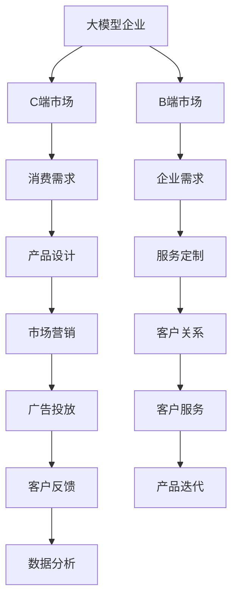

                 

## 1. 背景介绍

### 1.1 问题由来
在人工智能快速发展的大背景下，大模型企业如同雨后春笋般涌现。这些企业大多依托于大语言模型、深度学习等前沿技术，提供各式各样的AI服务。但这些企业该如何选择产品方向？是发力C端消费市场，还是深耕B端企业市场？这是一个事关企业战略和发展方向的核心问题。

### 1.2 问题核心关键点
在讨论这个问题时，我们需要考虑以下几个核心关键点：
1. **市场需求**：C端和B端市场的需求有何不同？哪种市场需求更大？
2. **技术门槛**：哪种市场的产品开发难度和复杂度更低？
3. **商业模型**：哪种市场的商业模式更具有可持续性和盈利性？
4. **用户群体**：不同用户群体对AI产品的接受度和需求差异如何？
5. **竞争格局**：目前市场上的主要竞争者是谁？他们的战略和优势是什么？

### 1.3 问题研究意义
确定企业的产品方向，有助于其聚焦核心竞争力，形成差异化竞争优势。对C端市场和B端市场的不同选择，将直接影响企业的发展路径、市场定位和长期发展战略。

## 2. 核心概念与联系

### 2.1 核心概念概述

为更好地理解大模型企业选择C端还是B端市场的逻辑，本节将介绍几个密切相关的核心概念：

- **大模型企业**：利用深度学习、自然语言处理等前沿技术，提供AI服务的企业。
- **C端市场**：面向消费者的市场，如智能音箱、智能家居、手机App等。
- **B端市场**：面向企业、机构等B类用户的市场，如智能客服、金融风控、医疗诊断等。
- **商业模式**：企业盈利和生存的主要方式，如订阅制、按需付费、SaaS等。
- **市场份额**：企业在某个市场中的销售额占比，反映企业的市场竞争力和影响力。
- **用户需求**：不同市场用户的需求特点和使用习惯，影响产品设计和营销策略。

这些核心概念之间的逻辑关系可以通过以下Mermaid流程图来展示：



这个流程图展示了企业与不同市场之间的连接关系，以及各个环节如何相互影响。

## 3. 核心算法原理 & 具体操作步骤

### 3.1 算法原理概述

选择C端还是B端市场，本质上是一个市场细分和资源配置的过程。通过数据分析和业务评估，企业可以在两者之间做出最优选择。

- **C端市场**：主要通过消费数据和用户行为分析，识别用户需求和痛点，设计易于使用的产品，通过广告和营销推广吸引用户，形成用户粘性和品牌忠诚度。
- **B端市场**：主要通过企业调研和行业分析，了解企业需求和挑战，提供定制化的解决方案，通过合同和订阅费获取稳定收入，通过优质的服务和客户关系管理保持客户忠诚。

### 3.2 算法步骤详解

选择C端市场：
1. **市场调研**：分析消费者行为、偏好、痛点等，收集市场需求和竞争情报。
2. **产品设计**：基于调研结果，设计易于使用、功能强大的产品，确保用户体验和满意度。
3. **营销推广**：通过社交媒体、广告投放、KOL合作等手段，广泛宣传产品，吸引目标用户。
4. **用户运营**：通过数据分析和用户反馈，持续优化产品和服务，提升用户粘性和满意度。
5. **收益模式**：主要通过广告、应用内购、订阅费等手段获取收益。

选择B端市场：
1. **行业分析**：调研目标行业的特性、挑战和痛点，识别企业需求和机会。
2. **服务定制**：基于行业需求，定制化和专业化的解决方案，确保企业客户能得到最大化的价值。
3. **销售渠道**：通过企业客户经理、销售渠道、行业展会等手段，接触和拓展目标客户。
4. **客户关系**：建立和维护良好的客户关系，提供卓越的售后服务和技术支持。
5. **收益模式**：主要通过合同、订阅费、定制开发费等手段获取收益。

### 3.3 算法优缺点

选择C端市场：
- **优点**：市场规模大，用户粘性好，盈利模式清晰，竞争壁垒相对较低。
- **缺点**：用户需求多样且变化快，产品迭代周期短，营销成本高，用户数据隐私保护压力大。

选择B端市场：
- **优点**：用户需求明确且稳定，高毛利，客户关系管理收益高，专业性服务差异化优势明显。
- **缺点**：市场规模相对较小，客户获取难度大，前期投资高，客户需求复杂，服务成本高。

### 3.4 算法应用领域

C端市场：
- **智能家居**：智能音箱、智能门锁、智能空调等。
- **娱乐应用**：视频平台、游戏应用、音乐服务。
- **生活服务**：电商、在线旅游、金融服务。

B端市场：
- **智能客服**：自动化客户服务、智能客服系统。
- **企业风控**：信用评分、欺诈检测、风险管理。
- **医疗诊断**：AI辅助诊断、个性化治疗、远程医疗。

## 4. 数学模型和公式 & 详细讲解 & 举例说明

### 4.1 数学模型构建

选择C端市场时，可以使用用户行为数据分析模型，衡量用户使用产品的情况和满意度。常用的数学模型包括：

- **用户留存率模型**：
$$
R(t) = \frac{N(t)}{N(0)}
$$
其中，$N(t)$ 表示在$t$时间后继续使用的用户数，$N(0)$ 表示初始用户数。

- **用户流失率模型**：
$$
L(t) = \frac{N(0) - N(t)}{N(0)}
$$

- **客户满意度模型**：
$$
S = \frac{\sum_{i=1}^n (X_i - \mu)^2}{n \sigma^2}
$$
其中，$X_i$ 表示每个用户对产品的满意度评分，$\mu$ 表示平均满意度评分，$\sigma^2$ 表示方差。

选择B端市场时，可以使用企业需求分析模型，衡量企业的业务效益和需求满足度。常用的数学模型包括：

- **企业ROI模型**：
$$
ROI = \frac{收益}{成本}
$$

- **需求满足度模型**：
$$
DS = \frac{满足需求的用户数}{总用户数}
$$

### 4.2 公式推导过程

以用户留存率模型为例，推导其基本原理：

设用户数为$N(0)$，经过时间$t$后，仍然在使用的用户数为$N(t)$。设每日流失率为$p$，则经过$t$天后，仍在使用产品的用户数为$N(t) = N(0) (1 - p)^t$。

代入公式，得：
$$
R(t) = \frac{N(0) (1 - p)^t}{N(0)} = (1 - p)^t
$$

其中，$p$ 是一个每日流失率的常数，$t$ 表示时间。

通过推导，我们可以得出用户留存率的公式，并根据实际数据计算用户留存率，评估产品对用户的吸引力。

### 4.3 案例分析与讲解

假设某智能音箱企业，每月新增用户数为1000，每日流失率为0.02，求用户留存率和流失率。

设$t=30$，代入公式，得：
$$
R(t) = (1 - 0.02)^{30} = 0.9^{30} = 0.75
$$
$$
L(t) = 1 - R(t) = 1 - 0.75 = 0.25
$$

因此，在一个月后，用户留存率为75%，流失率为25%。这表明产品的用户粘性相对较高，但仍有25%的用户流失。企业需要进一步优化产品功能和用户体验，以提升留存率。

## 5. 项目实践：代码实例和详细解释说明

### 5.1 开发环境搭建

在进行市场细分和选择时，开发环境搭建是基础。以下是使用Python进行数据分析和决策的环境配置流程：

1. 安装Anaconda：从官网下载并安装Anaconda，用于创建独立的Python环境。
2. 创建并激活虚拟环境：
```bash
conda create -n market-analysis python=3.8 
conda activate market-analysis
```
3. 安装数据分析和可视化工具：
```bash
pip install pandas numpy matplotlib seaborn jupyter notebook
```
4. 配置Jupyter Notebook：
```bash
jupyter notebook --notebook-dir=notebooks --allowed-notebooks='.*'
```
5. 安装必要的Python库：
```bash
pip install requests beautifulsoup4
```

完成上述步骤后，即可在`market-analysis`环境中进行数据分析和决策。

### 5.2 源代码详细实现

这里我们以用户留存率模型为例，给出Python代码实现。

首先，定义用户留存率计算函数：

```python
import pandas as pd
import numpy as np

def calculate_retention_rate(t, initial_users, daily_churn):
    remaining_users = initial_users * (1 - daily_churn)**t
    retention_rate = remaining_users / initial_users
    return retention_rate
```

然后，加载用户行为数据：

```python
data = pd.read_csv('user_behavior.csv')

# 提取初始用户数和每日流失率
initial_users = data['user_id'].nunique()
daily_churn = data.groupby('date')['user_id'].count().pct().iloc[0]
```

最后，计算用户留存率：

```python
retention_rate = calculate_retention_rate(30, initial_users, daily_churn)
print(f'用户留存率: {retention_rate:.2%}')
```

以上代码实现了用户留存率的计算，并输出结果。在实际应用中，企业可以根据不同的需求和场景，进一步扩展和优化数据处理和分析函数。

### 5.3 代码解读与分析

让我们再详细解读一下关键代码的实现细节：

**calculate_retention_rate函数**：
- 输入参数包括时间$t$、初始用户数$initial_users$和每日流失率$daily_churn$。
- 通过数学公式计算留存率$R(t)$，并返回结果。

**数据加载和处理**：
- 使用pandas库读取用户行为数据，提取初始用户数和每日流失率。
- 通过groupby和count函数计算每日流失率。

**计算和输出**：
- 调用自定义函数计算用户留存率，并输出结果。

可以看到，Python结合pandas等库，可以轻松实现用户行为数据的处理和分析，为市场细分和选择提供有力支撑。

## 6. 实际应用场景

### 6.1 智能客服系统

在智能客服系统中，企业可以选择C端和B端市场，以满足不同用户的需求。例如，对于电商平台，可以提供智能客服应用，帮助用户查询订单、退换货等。而对于大型企业集团，可以提供定制化的智能客服解决方案，帮助其内部机构进行客户管理和客户服务。

### 6.2 金融风控系统

金融风控系统是典型的B端市场应用，主要为企业提供风险管理、信用评分等服务。例如，保险公司可以利用大模型进行理赔审批、欺诈检测，减少人工审核成本，提高审批效率和准确性。而银行可以利用大模型进行客户信用评估，防范金融风险。

### 6.3 医疗诊断系统

医疗诊断系统是另一个典型的B端市场应用。大模型可以通过自然语言处理技术，辅助医生进行疾病诊断、治疗方案制定等工作。医院可以通过订阅服务，获取大模型的诊断工具和专家知识库，提升医疗服务水平。

### 6.4 未来应用展望

未来，随着大模型技术的发展和普及，市场细分和选择将更加灵活和多样。企业可以根据自身优势和市场需求，探索不同的市场细分和选择策略。例如，可以利用大模型的多模态能力，同时发力C端和B端市场，如智能家居和智能客服系统。还可以探索跨领域的融合应用，如利用医疗影像数据进行疾病诊断，同时提供智能客服。

## 7. 工具和资源推荐

### 7.1 学习资源推荐

为了帮助企业更好地进行市场细分和选择，这里推荐一些优质的学习资源：

1. **《市场细分与定位》课程**：由知名大学和市场专家开设，详细介绍市场细分的理论基础和方法论。
2. **《消费者行为学》书籍**：系统讲解消费者心理、需求分析、市场调研等基础知识，为C端市场的产品设计提供理论支撑。
3. **《企业需求分析》课程**：由企业咨询专家开设，讲解如何识别和满足企业需求，为B端市场的解决方案提供指导。
4. **《数据分析与建模》书籍**：详细介绍数据分析、机器学习、模型评估等技术，为市场选择提供数据支持。
5. **《市场分析工具》视频教程**：介绍如何使用Python、R等工具进行市场分析，包括数据清洗、数据可视化、统计分析等。

通过这些资源的学习，企业可以更好地理解和应用市场细分和选择理论，提升市场竞争力和决策能力。

### 7.2 开发工具推荐

高效的工具是市场细分和选择不可或缺的辅助手段。以下是几款用于市场细分和选择的常用工具：

1. **Python**：通用编程语言，适用于数据处理、算法实现、模型评估等。
2. **Jupyter Notebook**：交互式数据科学和数据分析环境，支持代码编写、数据可视化和模型评估。
3. **Tableau**：数据可视化工具，支持复杂的报表制作和数据探索，适合进行市场分析。
4. **Google Analytics**：网站流量和用户行为分析工具，提供详细的用户行为数据，支持市场细分和选择。
5. **Kaggle**：数据科学竞赛平台，提供丰富的数据集和模型评估，适合进行市场分析和决策。

合理利用这些工具，可以显著提升市场细分和选择的效率和准确性，帮助企业做出更好的决策。

### 7.3 相关论文推荐

市场细分和选择是市场营销学的重要研究方向，相关的理论和实践研究如下：

1. **《市场细分理论与方法》**：系统介绍市场细分的理论基础和常用方法，如地理细分、人口细分、心理细分等。
2. **《消费者行为分析》**：通过消费者行为数据，识别需求和痛点，为产品设计和市场推广提供指导。
3. **《企业需求识别与分析》**：讲解如何识别和满足企业需求，提供定制化解决方案的思路和方法。
4. **《市场分析与决策》**：详细分析市场细分、需求识别、客户关系管理等过程，为市场选择提供理论支持。
5. **《数据驱动的市场选择》**：介绍数据科学在市场细分和选择中的应用，提供实证分析和案例分析。

这些论文代表了大模型市场细分和选择的理论发展脉络，为企业的决策提供科学依据。

## 8. 总结：未来发展趋势与挑战

### 8.1 总结

本文对大模型企业选择C端还是B端市场的逻辑进行了全面系统的介绍。首先阐述了市场细分和选择的理论基础和重要性，明确了C端和B端市场的需求、技术门槛和商业模型等特点。其次，从原理到实践，详细讲解了市场细分和选择的方法和步骤，提供了市场细分和选择的完整代码实例。最后，本文还探讨了市场细分和选择在不同行业中的应用场景，并展望了未来的发展趋势。

通过本文的系统梳理，可以看到，大模型企业选择市场细分和选择需要考虑多方面因素，通过数据分析和业务评估，企业可以在C端和B端市场之间做出最优选择。

### 8.2 未来发展趋势

展望未来，大模型企业选择市场细分和选择将呈现以下几个发展趋势：

1. **数据驱动决策**：利用大数据和机器学习技术，进行精准的市场细分和选择，提升决策的科学性和准确性。
2. **多模态市场细分**：结合图像、语音、视频等多模态数据，进行更全面和深入的市场细分和选择，提升产品设计的个性化和差异化。
3. **定制化服务**：根据不同用户的需求和特点，提供定制化的解决方案，实现精准营销和客户服务。
4. **跨领域融合**：将不同领域的知识和技术进行整合，实现跨领域的市场细分和选择，提供更全面和创新的产品和服务。
5. **自动化和智能化**：利用人工智能技术，实现市场细分和选择的自动化和智能化，提升效率和准确性。

这些趋势凸显了大模型企业市场细分和选择的广阔前景。通过数据分析和业务评估，企业可以更好地理解和应用市场细分和选择的理论，提升市场竞争力和决策能力。

### 8.3 面临的挑战

尽管大模型企业选择市场细分和选择取得了一定的进展，但在迈向更加智能化、普适化应用的过程中，仍面临诸多挑战：

1. **数据获取难度**：获取高质量的市场数据和用户数据，成本较高，数据获取难度大。
2. **数据隐私保护**：用户数据的隐私保护问题，需要企业制定严格的数据保护政策和措施。
3. **市场需求多样**：不同用户和企业的需求差异较大，产品设计和定制化难度高。
4. **竞争激烈**：市场细分和选择面临激烈的市场竞争，需要企业具备较强的技术实力和市场竞争力。
5. **技术复杂性**：市场细分和选择涉及多方面的技术和业务问题，需要跨学科的团队合作和综合能力。

### 8.4 研究展望

面对市场细分和选择面临的挑战，未来的研究需要在以下几个方面寻求新的突破：

1. **数据获取和处理**：利用机器学习和大数据技术，提升市场数据的获取和处理能力，降低数据获取成本和难度。
2. **个性化定制**：通过多模态数据融合和用户画像分析，提供更加个性化和差异化的产品和服务。
3. **跨领域整合**：将不同领域的知识和技术进行整合，实现跨领域的市场细分和选择，提供更全面和创新的产品和服务。
4. **自动化决策**：利用人工智能和自动化技术，实现市场细分和选择的自动化和智能化，提升效率和准确性。
5. **市场规则制定**：建立市场规则和标准，规范市场行为，保障市场公平竞争。

这些研究方向和突破，将帮助大模型企业更好地进行市场细分和选择，提升市场竞争力和决策能力，实现可持续发展。

## 9. 附录：常见问题与解答

**Q1：大模型企业选择C端还是B端市场，主要考虑哪些因素？**

A: 大模型企业选择C端还是B端市场，主要考虑以下因素：
1. **市场需求**：C端市场规模大，但竞争激烈，B端市场客户需求明确，但获取难度大。
2. **技术门槛**：C端市场产品开发难度较低，但用户数据隐私保护压力大，B端市场需要较强的技术实力和业务理解能力。
3. **商业模型**：C端市场主要通过广告和应用内购盈利，B端市场主要通过定制化服务和订阅费盈利。
4. **用户群体**：C端用户需求多样化且变化快，B端企业客户需求稳定且复杂。
5. **竞争格局**：C端市场竞争激烈，B端市场需要较强的市场竞争力。

**Q2：大模型企业如何选择适合的市场细分策略？**

A: 大模型企业选择市场细分策略时，需要综合考虑市场需求、技术门槛、商业模型、用户群体和竞争格局等因素。一般步骤如下：
1. **市场调研**：了解目标市场的需求和竞争情况。
2. **需求分析**：识别目标用户的需求和痛点，设计符合需求的产品。
3. **竞争分析**：分析竞争对手的优势和劣势，制定差异化策略。
4. **数据分析**：利用大数据和机器学习技术，进行精准的市场细分和选择。
5. **试点验证**：进行小规模试点，验证市场策略的有效性。

**Q3：大模型企业如何进行市场细分和选择？**

A: 大模型企业进行市场细分和选择时，可以通过以下步骤：
1. **数据采集**：采集用户行为数据和市场数据，构建数据集。
2. **数据清洗**：处理缺失值、异常值，进行数据清洗和预处理。
3. **特征提取**：从数据中提取有用的特征，如用户行为、企业需求等。
4. **模型训练**：利用机器学习算法，训练市场细分模型。
5. **结果评估**：通过评估指标（如用户留存率、企业ROI等），评估模型效果。
6. **优化迭代**：根据评估结果，优化模型和策略，进行迭代改进。

**Q4：大模型企业如何选择适合的市场细分模型？**

A: 大模型企业选择市场细分模型时，需要考虑以下因素：
1. **数据类型**：选择适合数据类型和特点的模型，如C端市场用户行为数据适合聚类分析，B端市场企业需求数据适合分类分析。
2. **模型复杂度**：根据市场规模和数据复杂度，选择适合复杂度的模型，如简单的聚类算法适合小型市场，复杂的机器学习算法适合大型市场。
3. **模型效果**：评估模型的准确性和泛化能力，选择效果较好的模型。
4. **模型可解释性**：选择可解释性较好的模型，便于理解和优化。

**Q5：大模型企业如何进行市场细分和选择的持续优化？**

A: 大模型企业进行市场细分和选择的持续优化，可以采取以下措施：
1. **实时监控**：实时监控市场数据和用户行为，及时调整策略。
2. **数据分析**：利用大数据和机器学习技术，进行持续的市场分析和评估。
3. **用户反馈**：收集用户反馈，进行持续的产品优化和改进。
4. **竞争分析**：持续分析竞争对手的市场策略和表现，进行差异化调整。
5. **模型更新**：根据市场变化和用户需求，及时更新和优化模型。

通过持续优化，大模型企业可以在市场细分和选择中不断提升竞争力，实现可持续发展。

---

作者：禅与计算机程序设计艺术 / Zen and the Art of Computer Programming

