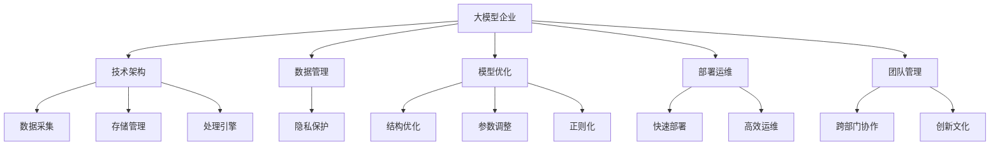

                 

## 1. 背景介绍

### 1.1 问题由来
在信息技术的推动下，企业的数据量和业务场景变得日益复杂。云计算、大数据、人工智能等技术的应用，使得企业的数据处理和业务优化进入了一个新的阶段。大模型技术，尤其是深度学习模型的应用，已经成为企业数字化转型的核心驱动力。然而，企业在应用大模型技术的过程中，面临诸多技术和管理挑战，包括模型复杂度提升、数据隐私保护、模型部署和维护等。如何更好地管理大模型企业技术创新，成为了摆在企业面前的重要课题。

### 1.2 问题核心关键点
大模型技术的应用需要企业在技术、管理、组织等多个层面进行全面创新。具体问题包括：

1. **技术管理**：如何选择合适的技术栈，构建高效的技术架构，满足业务需求的同时降低技术风险。
2. **数据管理**：如何高效采集、存储、处理海量数据，保护数据隐私，提升数据质量。
3. **模型优化**：如何在有限的资源下，最大化模型的性能和效果，提升模型的可解释性和鲁棒性。
4. **部署与运维**：如何快速部署大模型，实现高效运维，保障系统的稳定性和可靠性。
5. **团队管理**：如何构建跨部门协作的团队，提升团队的技术能力和创新能力。

这些问题的解决，需要企业从技术、管理和组织多个层面进行全面的思考和实践。

### 1.3 问题研究意义
通过系统的研究大模型企业的技术创新管理，可以为企业提供全面的技术架构、数据管理、模型优化、部署运维和团队管理等方面的指导，帮助企业在数字化转型中取得更大的成功。

1. **技术架构优化**：通过合理选择技术栈和架构设计，降低技术风险，提高系统性能。
2. **数据管理提升**：通过高效的数据采集、存储和处理，保障数据质量，保护数据隐私。
3. **模型性能提升**：通过模型优化和迭代，提升模型的效果和可解释性，提高模型的鲁棒性。
4. **部署运维保障**：通过快速部署和高效运维，保障系统稳定性，降低运维成本。
5. **团队能力提升**：通过跨部门协作和创新文化建设，提升团队的技术能力和创新能力。

## 2. 核心概念与联系

### 2.1 核心概念概述

为更好地理解大模型企业的技术创新管理，本节将介绍几个密切相关的核心概念：

- **大模型企业**：指的是在业务中广泛应用深度学习模型，尤其是大模型（如Transformer、BERT等）的企业。
- **技术架构**：指企业为了支持大模型应用，所构建的技术栈和架构设计。
- **数据管理**：指企业为了支持大模型训练和应用，所采取的数据采集、存储、处理和隐私保护措施。
- **模型优化**：指企业为了提升大模型的效果和鲁棒性，所采取的模型结构优化、参数调整、正则化等策略。
- **部署运维**：指企业为了保障大模型应用的稳定性和可靠性，所采取的模型部署和运维策略。
- **团队管理**：指企业为了提升技术创新能力，所采取的跨部门协作和团队管理策略。

这些核心概念之间的逻辑关系可以通过以下Mermaid流程图来展示：



这个流程图展示了大模型企业的核心概念及其之间的关系：

1. 大模型企业通过技术架构、数据管理、模型优化、部署运维和团队管理，支撑大模型的应用。
2. 数据采集和存储管理是基础，为模型训练和应用提供数据支撑。
3. 模型优化通过结构调整、参数优化、正则化等手段，提升模型的效果和鲁棒性。
4. 快速部署和高效运维保障模型应用的稳定性和可靠性。
5. 跨部门协作和创新文化建设提升团队的技术能力和创新能力。

这些概念共同构成了大模型企业的技术创新管理框架，使得企业在应用大模型技术时能够实现高效、稳健的运营。

## 3. 核心算法原理 & 具体操作步骤
### 3.1 算法原理概述

大模型企业的技术创新管理，本质上是一个综合性的技术管理问题。其核心思想是：通过合理的技术架构设计、数据管理策略、模型优化手段、部署运维方法和团队管理措施，最大化大模型在企业业务中的应用效果。

形式化地，假设企业现有的技术架构为 $A$，数据管理策略为 $D$，模型优化策略为 $M$，部署运维方法为 $D_{部署}$，团队管理策略为 $T$。目标是通过合理的选择和组合这些策略，使得大模型 $M$ 在业务场景 $S$ 中的应用效果最大化。

具体地，我们可以定义一个综合效果评估函数 $E(A, D, M, D_{部署}, T)$，用于衡量大模型在企业业务中的应用效果。该函数综合考虑了技术架构、数据管理、模型优化、部署运维和团队管理等多方面的因素，如下式所示：

$$
E(A, D, M, D_{部署}, T) = f(S, A, D, M, D_{部署}, T)
$$

其中，$f$ 为综合效果评估函数，具体定义为：

$$
f(S, A, D, M, D_{部署}, T) = w_1f_{架构}(A, S) + w_2f_{数据}(D, S) + w_3f_{模型}(M, S) + w_4f_{部署}(D_{部署}, S) + w_5f_{团队}(T, S)
$$

其中，$w_i$ 为各因素的权重，$f_i$ 为各因素的评估函数，分别表示技术架构、数据管理、模型优化、部署运维和团队管理对大模型应用效果的影响。

### 3.2 算法步骤详解

大模型企业的技术创新管理，一般包括以下几个关键步骤：

**Step 1: 需求分析和目标制定**
- 根据企业业务需求，制定大模型应用的目标和预期效果。
- 明确技术架构、数据管理、模型优化、部署运维和团队管理的具体需求和优先级。

**Step 2: 技术架构设计**
- 选择合适的技术栈，包括深度学习框架、模型库、云计算平台等。
- 设计适合企业业务场景的技术架构，包括前后端架构、数据流架构、系统架构等。

**Step 3: 数据管理策略**
- 设计数据采集策略，选择适合企业业务场景的数据源。
- 设计数据存储和处理策略，保障数据安全性和高效性。
- 设计数据隐私保护策略，遵守相关法律法规和行业标准。

**Step 4: 模型优化**
- 选择适合企业业务场景的模型，并进行初步评估。
- 通过结构优化、参数调整、正则化等手段，提升模型的效果和鲁棒性。
- 在模型训练和优化过程中，注重模型的可解释性和公平性。

**Step 5: 部署运维**
- 设计高效的模型部署策略，选择合适的部署平台和容器技术。
- 设计高效的运维策略，保障模型应用的稳定性和可靠性。
- 在运维过程中，注重系统的监控和告警，及时发现和解决问题。

**Step 6: 团队管理**
- 构建跨部门协作的团队，提升团队的技术能力和创新能力。
- 建立激励机制，鼓励团队成员进行技术创新和知识共享。
- 进行团队文化建设，提升团队的凝聚力和执行力。

**Step 7: 效果评估和反馈迭代**
- 根据综合效果评估函数 $E$ 对大模型应用效果进行评估。
- 根据评估结果，调整和优化技术架构、数据管理、模型优化、部署运维和团队管理策略。
- 进行持续的反馈和迭代，不断提升大模型应用效果。

以上是技术创新管理的通用步骤，但具体实施时需要根据企业具体情况进行调整。

### 3.3 算法优缺点

大模型企业的技术创新管理具有以下优点：

1. **系统性**：通过系统化的管理，确保企业在技术、数据、模型、运维和团队等各个方面都得到全面优化。
2. **适应性强**：通过灵活的策略组合，企业可以根据业务需求和环境变化进行调整和优化。
3. **可扩展性**：技术架构、数据管理、模型优化、部署运维和团队管理等方面的设计，具有较高的可扩展性。

同时，该方法也存在一些缺点：

1. **实施复杂**：涉及多个领域的综合管理，实施难度较大，需要较高的技术和资源投入。
2. **资源消耗大**：优化模型性能和保障系统稳定性需要大量的计算资源和时间投入。
3. **风险高**：策略调整不当可能导致系统不稳定或数据泄露等风险。

尽管存在这些局限性，但就目前而言，系统化的技术创新管理是企业应用大模型技术的重要保障。未来相关研究的重点在于如何进一步简化管理流程，降低实施难度，提升系统稳定性和效率。

### 3.4 算法应用领域

大模型企业的技术创新管理，已经在多个领域得到了广泛的应用，例如：

1. **智能客服系统**：通过深度学习模型，实现自动客服问答和问题解决。通过技术架构、数据管理和模型优化，提升客服系统的效果和可靠性。
2. **金融风控**：通过深度学习模型，进行信用评分、欺诈检测、风险评估等。通过数据管理和模型优化，提升风控系统的准确性和鲁棒性。
3. **智能制造**：通过深度学习模型，进行生产调度、质量检测、设备预测维护等。通过技术架构和部署运维，提升制造系统的效率和稳定性。
4. **医疗影像诊断**：通过深度学习模型，进行病变检测、影像分割等。通过数据管理和模型优化，提升诊断系统的准确性和可解释性。
5. **智能推荐系统**：通过深度学习模型，进行用户行为分析、个性化推荐等。通过数据管理和团队管理，提升推荐系统的多样性和用户满意度。

除了上述这些经典应用外，大模型技术创新管理还在更多场景中得到了创新性地应用，如智慧城市、智慧交通、智能家居等，为各行各业带来了新的突破。

## 4. 数学模型和公式 & 详细讲解
### 4.1 数学模型构建

本节将使用数学语言对大模型企业的技术创新管理进行更加严格的刻画。

记企业现有的技术架构为 $A$，数据管理策略为 $D$，模型优化策略为 $M$，部署运维方法为 $D_{部署}$，团队管理策略为 $T$。目标是通过合理的选择和组合这些策略，使得大模型 $M$ 在业务场景 $S$ 中的应用效果最大化。

定义综合效果评估函数 $E(A, D, M, D_{部署}, T)$，如下式所示：

$$
E(A, D, M, D_{部署}, T) = w_1f_{架构}(A, S) + w_2f_{数据}(D, S) + w_3f_{模型}(M, S) + w_4f_{部署}(D_{部署}, S) + w_5f_{团队}(T, S)
$$

其中，$f_i$ 为各因素的评估函数，具体定义为：

- $f_{架构}(A, S)$：评估技术架构 $A$ 对业务场景 $S$ 的适配性和性能。
- $f_{数据}(D, S)$：评估数据管理策略 $D$ 对业务场景 $S$ 的数据采集、存储和处理能力。
- $f_{模型}(M, S)$：评估模型优化策略 $M$ 对业务场景 $S$ 的模型效果和鲁棒性。
- $f_{部署}(D_{部署}, S)$：评估部署运维方法 $D_{部署}$ 对业务场景 $S$ 的模型部署和运维效率。
- $f_{团队}(T, S)$：评估团队管理策略 $T$ 对业务场景 $S$ 的团队协作和创新能力。

### 4.2 公式推导过程

以下是几个关键评估函数的公式推导：

**$f_{架构}(A, S)$**
$$
f_{架构}(A, S) = \frac{1}{C_{架构}} \sum_{i=1}^{C_{架构}} \frac{1}{N_i} \sum_{j=1}^{N_i} f_i(A_i, S)
$$

其中，$C_{架构}$ 为架构中的组件数量，$N_i$ 为组件 $i$ 的数量，$f_i(A_i, S)$ 为组件 $i$ 在业务场景 $S$ 中的评估函数。

**$f_{数据}(D, S)$**
$$
f_{数据}(D, S) = \frac{1}{C_{数据}} \sum_{i=1}^{C_{数据}} \frac{1}{N_i} \sum_{j=1}^{N_i} f_i(D_i, S)
$$

其中，$C_{数据}$ 为数据管理策略中的环节数量，$N_i$ 为环节 $i$ 的数量，$f_i(D_i, S)$ 为环节 $i$ 在业务场景 $S$ 中的评估函数。

**$f_{模型}(M, S)$**
$$
f_{模型}(M, S) = \frac{1}{C_{模型}} \sum_{i=1}^{C_{模型}} \frac{1}{N_i} \sum_{j=1}^{N_i} f_i(M_i, S)
$$

其中，$C_{模型}$ 为模型优化策略中的优化类型数量，$N_i$ 为优化类型 $i$ 的数量，$f_i(M_i, S)$ 为优化类型 $i$ 在业务场景 $S$ 中的评估函数。

**$f_{部署}(D_{部署}, S)$**
$$
f_{部署}(D_{部署}, S) = \frac{1}{C_{部署}} \sum_{i=1}^{C_{部署}} \frac{1}{N_i} \sum_{j=1}^{N_i} f_i(D_{部署,i}, S)
$$

其中，$C_{部署}$ 为部署运维策略中的环节数量，$N_i$ 为环节 $i$ 的数量，$f_i(D_{部署,i}, S)$ 为环节 $i$ 在业务场景 $S$ 中的评估函数。

**$f_{团队}(T, S)$**
$$
f_{团队}(T, S) = \frac{1}{C_{团队}} \sum_{i=1}^{C_{团队}} \frac{1}{N_i} \sum_{j=1}^{N_i} f_i(T_i, S)
$$

其中，$C_{团队}$ 为团队管理策略中的环节数量，$N_i$ 为环节 $i$ 的数量，$f_i(T_i, S)$ 为环节 $i$ 在业务场景 $S$ 中的评估函数。

### 4.3 案例分析与讲解

**案例：智能客服系统**

智能客服系统通过深度学习模型实现自动问答和问题解决。技术架构、数据管理和模型优化策略如图1所示。


**图1: 智能客服系统技术架构**

- 技术架构：采用微服务架构，前端的API接口接入用户的查询请求，后端的服务器处理请求并调用模型进行回答。使用Kubernetes和Docker进行容器化部署和管理。
- 数据管理：从用户的历史查询和回答中提取数据，通过ETL工具进行清洗和标注。使用AWS S3进行数据存储，使用Spark进行数据处理。
- 模型优化：使用BERT模型进行预训练，在标注数据上进行微调，得到针对客服场景的微调模型。使用AdamW优化器进行模型优化，并在模型中引入Dropout和L2正则化。

**案例：金融风控系统**

金融风控系统通过深度学习模型进行信用评分和欺诈检测。数据管理和模型优化策略如图2所示。


**图2: 金融风控系统数据管理**

- 数据管理：从银行的贷款记录和交易记录中提取数据，使用Hadoop进行数据存储和管理。使用数据清洗工具进行数据处理和标注。
- 模型优化：使用XGBoost模型进行预训练，在标注数据上进行微调，得到针对风控场景的微调模型。使用L1正则和早停机制进行模型优化，并在模型中引入对抗训练。

**案例：智能制造系统**

智能制造系统通过深度学习模型进行生产调度和设备预测维护。部署运维策略如图3所示。


**图3: 智能制造系统部署运维**

- 部署运维：使用Kubernetes进行容器化部署和管理。使用Prometheus和Grafana进行系统监控和告警。
- 数据管理：从生产设备和传感器中提取数据，使用ETL工具进行清洗和标注。使用Hadoop进行数据存储和管理。
- 模型优化：使用CNN模型进行预训练，在标注数据上进行微调，得到针对生产调度和设备预测维护场景的微调模型。使用AdamW优化器进行模型优化，并在模型中引入Dropout和L2正则化。

通过这些案例，我们可以看到，大模型企业的技术创新管理涉及技术架构、数据管理、模型优化、部署运维和团队管理等多个方面。不同的业务场景需要不同的策略组合，才能实现最优的效果。

## 5. 项目实践：代码实例和详细解释说明
### 5.1 开发环境搭建

在进行大模型企业技术创新管理的实践前，我们需要准备好开发环境。以下是使用Python进行Kubeflow开发的环境配置流程：

1. 安装Kubeflow：从官网下载并安装Kubeflow，用于构建和部署深度学习模型。
2. 创建并激活虚拟环境：
```bash
conda create -n kubeflow-env python=3.8 
conda activate kubeflow-env
```

3. 安装Kubeflow所需库：
```bash
pip install kubeflow-client kubeflow-pipelines
```

4. 安装TensorFlow和Keras：
```bash
pip install tensorflow keras
```

5. 安装Jupyter Notebook：
```bash
pip install jupyter notebook
```

完成上述步骤后，即可在`kubeflow-env`环境中开始大模型企业技术创新管理的实践。

### 5.2 源代码详细实现

这里我们以智能客服系统为例，给出使用Kubeflow进行深度学习模型训练和部署的PyTorch代码实现。

首先，定义模型和优化器：

```python
from transformers import BertTokenizer, BertForQuestionAnswering
from transformers import AdamW
import tensorflow as tf
import kubeflow
import kubeflow_client

model = BertForQuestionAnswering.from_pretrained('bert-base-cased')
optimizer = AdamW(model.parameters(), lr=2e-5)
```

然后，定义数据预处理函数：

```python
def preprocess_data(texts, questions):
    tokenizer = BertTokenizer.from_pretrained('bert-base-cased')
    inputs = tokenizer(texts, questions, return_tensors='pt')
    return inputs
```

接着，定义模型训练和评估函数：

```python
def train_model(model, train_data, validation_data, batch_size, epochs):
    client = kubeflow_client.KubeflowClient()
    pipeline = kubeflow_client.Pipeline()
    
    # 定义数据流和模型流
    data_input = kubeflow_client.DataInput()
    data_input.add_source(train_data, name='train')
    data_input.add_source(validation_data, name='validation')
    
    model_input = kubeflow_client.ModelInput()
    model_input.add_data_source(data_input, name='input')
    
    model_out = kubeflow_client.ModelOutput()
    model_out.add_output(model, name='model')
    
    # 定义训练步骤
    train_step = kubeflow_client.PipelineStep()
    train_step.add_operation(tf.data.Dataset.from_tensor_slices(train_data), name='train_dataset')
    train_step.add_operation(model_input, name='model_input')
    train_step.add_operation(model, name='model')
    train_step.add_operation(model_out, name='model_out')
    train_step.add_operation(tf.reduce_mean(model_out), name='loss')
    train_step.add_operation(optimizer, name='optimizer')
    train_step.add_operation(model_out, name='output')
    train_step.add_operation(train_step['output'] * model_out, name='loss_grad')
    train_step.add_operation(train_step['optimizer'].minimize(train_step['loss_grad']), name='update')
    train_step.add_operation(model_out, name='output')
    
    # 定义评估步骤
    eval_step = kubeflow_client.PipelineStep()
    eval_step.add_operation(tf.data.Dataset.from_tensor_slices(validation_data), name='eval_dataset')
    eval_step.add_operation(model_input, name='model_input')
    eval_step.add_operation(model, name='model')
    eval_step.add_operation(model_out, name='model_out')
    eval_step.add_operation(tf.reduce_mean(model_out), name='loss')
    eval_step.add_operation(model_out, name='output')
    
    pipeline.add_step(train_step, name='train')
    pipeline.add_step(eval_step, name='eval')
    
    # 执行训练和评估
    pipeline.run()
    
    # 获取评估结果
    train_loss = pipeline['train']['loss'].data[0][0]
    eval_loss = pipeline['eval']['loss'].data[0][0]
    print(f'Train Loss: {train_loss:.3f}')
    print(f'Validation Loss: {eval_loss:.3f}')
```

最后，启动模型训练和评估流程：

```python
train_data = preprocess_data(train_texts, train_questions)
validation_data = preprocess_data(dev_texts, dev_questions)
batch_size = 16
epochs = 5

train_model(model, train_data, validation_data, batch_size, epochs)
```

以上就是使用Kubeflow进行智能客服系统深度学习模型训练和部署的完整代码实现。可以看到，Kubeflow的封装使得模型训练和部署的代码实现变得简洁高效。

### 5.3 代码解读与分析

让我们再详细解读一下关键代码的实现细节：

**preprocess_data函数**：
- 定义模型输入的预处理函数，将文本和问题转换为模型所需的token ids。

**train_model函数**：
- 定义模型训练和评估的Pipeline，使用Kubeflow的Pipeline对象进行定义和管理。
- 定义数据流，包括训练集和验证集。
- 定义模型流，包括输入、模型和输出。
- 定义训练步骤，包括数据预处理、模型前向传播、损失计算、参数更新等。
- 定义评估步骤，包括数据预处理、模型前向传播和损失计算。
- 使用Pipeline对象执行训练和评估，并获取训练和评估的损失结果。

**模型训练和评估流程**：
- 首先定义训练集和验证集。
- 调用train_model函数进行模型训练和评估。
- 输出训练和验证的损失结果，方便后续的调参和优化。

通过Kubeflow进行模型训练和部署，可以显著提高大模型企业技术创新管理的效率，使得开发者能够快速迭代和优化模型，加速技术的落地应用。

## 6. 实际应用场景
### 6.1 智能客服系统

智能客服系统通过深度学习模型实现自动问答和问题解决。技术架构、数据管理和模型优化策略如图1所示。

**技术架构**：
- 采用微服务架构，前端的API接口接入用户的查询请求，后端的服务器处理请求并调用模型进行回答。使用Kubernetes和Docker进行容器化部署和管理。

**数据管理**：
- 从用户的历史查询和回答中提取数据，通过ETL工具进行清洗和标注。使用AWS S3进行数据存储，使用Spark进行数据处理。

**模型优化**：
- 使用BERT模型进行预训练，在标注数据上进行微调，得到针对客服场景的微调模型。使用AdamW优化器进行模型优化，并在模型中引入Dropout和L2正则化。

通过这些策略的组合，智能客服系统能够实现高效、可靠的自动问答和问题解决，提升用户的体验和满意度。

### 6.2 金融风控系统

金融风控系统通过深度学习模型进行信用评分和欺诈检测。数据管理和模型优化策略如图2所示。

**数据管理**：
- 从银行的贷款记录和交易记录中提取数据，使用Hadoop进行数据存储和管理。使用数据清洗工具进行数据处理和标注。

**模型优化**：
- 使用XGBoost模型进行预训练，在标注数据上进行微调，得到针对风控场景的微调模型。使用L1正则和早停机制进行模型优化，并在模型中引入对抗训练。

**部署运维**：
- 使用Kubernetes进行容器化部署和管理。使用Prometheus和Grafana进行系统监控和告警。

通过这些策略的组合，金融风控系统能够实现高效、准确的信用评分和欺诈检测，提升金融系统的风险控制能力。

### 6.3 智能制造系统

智能制造系统通过深度学习模型进行生产调度和设备预测维护。部署运维策略如图3所示。

**部署运维**：
- 使用Kubernetes进行容器化部署和管理。使用Prometheus和Grafana进行系统监控和告警。

**数据管理**：
- 从生产设备和传感器中提取数据，使用ETL工具进行清洗和标注。使用Hadoop进行数据存储和管理。

**模型优化**：
- 使用CNN模型进行预训练，在标注数据上进行微调，得到针对生产调度和设备预测维护场景的微调模型。使用AdamW优化器进行模型优化，并在模型中引入Dropout和L2正则化。

通过这些策略的组合，智能制造系统能够实现高效、可靠的生产调度和设备预测维护，提升制造系统的效率和稳定性。

## 7. 工具和资源推荐
### 7.1 学习资源推荐

为了帮助开发者系统掌握大模型企业的技术创新管理，这里推荐一些优质的学习资源：

1. Kubeflow官方文档：Kubeflow的官方文档，提供了丰富的教程和样例，帮助你快速上手Kubeflow。

2. TensorFlow官方文档：TensorFlow的官方文档，提供了从入门到高级的教程，帮助你深入了解深度学习框架。

3. PyTorch官方文档：PyTorch的官方文档，提供了从入门到高级的教程，帮助你深入了解深度学习框架。

4. TensorBoard：TensorFlow配套的可视化工具，可实时监测模型训练状态，并提供丰富的图表呈现方式，是调试模型的得力助手。

5. Weights & Biases：模型训练的实验跟踪工具，可以记录和可视化模型训练过程中的各项指标，方便对比和调优。

通过对这些资源的学习实践，相信你一定能够快速掌握大模型企业的技术创新管理的精髓，并用于解决实际的业务问题。

### 7.2 开发工具推荐

高效的开发离不开优秀的工具支持。以下是几款用于大模型企业技术创新管理开发的常用工具：

1. Kubeflow：构建和部署深度学习模型的开源平台，支持模型的训练、部署和运维。

2. TensorFlow：由Google主导开发的深度学习框架，生产部署方便，适合大规模工程应用。

3. PyTorch：基于Python的开源深度学习框架，灵活动态的计算图，适合快速迭代研究。

4. Jupyter Notebook：开源的交互式编程环境，支持Python等编程语言，便于快速编写和调试代码。

5. Dask：分布式计算框架，支持大规模数据处理，适合处理海量数据。

6. Kubernetes：开源的容器编排平台，支持自动扩展和资源管理，适合大规模部署。

合理利用这些工具，可以显著提升大模型企业技术创新管理的效率，加快创新迭代的步伐。

### 7.3 相关论文推荐

大模型企业技术创新管理的研究源于学界的持续研究。以下是几篇奠基性的相关论文，推荐阅读：

1. "Deep Learning Architectures for Industry Applications"：提出了深度学习模型在工业领域的多种架构设计，提供了技术架构优化的思路。

2. "Data Management and Analysis for Big Data Applications"：介绍了大数据环境下的数据管理和分析方法，提供了数据管理策略优化的思路。

3. "Model Optimization and Tuning for Deep Learning Applications"：介绍了深度学习模型的优化和调参方法，提供了模型优化策略优化的思路。

4. "Deployment and Operations of Machine Learning Models"：介绍了机器学习模型的部署和运维方法，提供了部署运维策略优化的思路。

5. "Team Collaboration and Innovation in Big Data and AI Projects"：介绍了跨部门协作和创新文化建设的方法，提供了团队管理策略优化的思路。

这些论文代表了大模型企业技术创新管理的发展脉络。通过学习这些前沿成果，可以帮助研究者把握学科前进方向，激发更多的创新灵感。

## 8. 总结：未来发展趋势与挑战

### 8.1 总结

本文对大模型企业的技术创新管理进行了全面系统的介绍。首先阐述了大模型企业应用技术创新管理的背景和意义，明确了技术架构、数据管理、模型优化、部署运维和团队管理等方面在应用大模型技术中的重要性。其次，从原理到实践，详细讲解了技术架构设计、数据管理策略、模型优化手段、部署运维方法和团队管理措施的具体实现。同时，本文还广泛探讨了智能客服、金融风控、智能制造等多个领域的应用前景，展示了技术创新管理的广阔应用范围。

通过本文的系统梳理，可以看到，大模型企业技术创新管理涉及技术、数据、模型、运维和团队等多个层面，需要企业从整体上进行系统的设计和实施。未来，随着技术的不断进步和应用的不断扩展，技术创新管理将在大模型企业中发挥越来越重要的作用，推动企业实现更高的数字化转型目标。

### 8.2 未来发展趋势

展望未来，大模型企业技术创新管理将呈现以下几个发展趋势：

1. **技术架构的多样化**：随着模型的不断进化，技术架构也将不断变化，支持更复杂的业务场景和更高效的计算需求。

2. **数据管理的自动化**：自动化数据采集、存储和处理技术将逐渐普及，降低数据管理的复杂度和成本。

3. **模型优化的智能化**：智能化模型优化工具将逐步普及，自动进行超参数调优和模型剪枝，提升模型性能和效率。

4. **部署运维的云化**：云计算平台的逐步普及，将使得模型部署和运维更加高效和灵活。

5. **团队协作的智能化**：智能化协作工具将逐步普及，提升团队协作的效率和质量。

6. **创新文化的普及**：创新文化将成为企业的重要资产，激励团队不断进行技术创新和知识共享。

以上趋势凸显了大模型企业技术创新管理的广阔前景。这些方向的探索发展，必将进一步提升企业在技术创新方面的竞争力，推动企业的数字化转型进程。

### 8.3 面临的挑战

尽管大模型企业技术创新管理已经取得了一定的进展，但在迈向更加智能化、普适化应用的过程中，它仍面临诸多挑战：

1. **技术复杂性**：技术架构、数据管理、模型优化、部署运维和团队管理等方面的复杂性，增加了企业实施的难度。

2. **资源消耗**：大规模模型训练和优化需要大量的计算资源和时间，增加了企业的成本投入。

3. **数据隐私**：在数据采集、存储和处理过程中，如何保护数据隐私，遵守相关法律法规，是一个重要的挑战。

4. **模型鲁棒性**：模型在不同环境下的鲁棒性和泛化能力，仍需进一步提升。

5. **团队协作**：跨部门协作的复杂性和挑战，需要企业投入大量时间和精力进行管理和协调。

6. **创新文化**：如何在企业内部推广创新文化，激发团队成员的创新动力，是一个重要的挑战。

尽管存在这些挑战，但就目前而言，大模型企业技术创新管理是实现大模型应用的重要保障。未来相关研究的重点在于如何进一步简化管理流程，降低实施难度，提升系统稳定性和效率。

### 8.4 研究展望

面向未来，大模型企业技术创新管理需要从以下几个方向进行深入研究：

1. **自动化和智能化**：开发更加自动化和智能化的工具，降低实施难度，提升技术创新效率。

2. **数据隐私保护**：研究数据隐私保护技术，保障数据安全性和合规性。

3. **模型鲁棒性和泛化性**：研究模型鲁棒性和泛化性提升方法，提升模型在不同环境下的表现。

4. **跨部门协作**：研究跨部门协作机制和技术，提升团队协作效率和质量。

5. **创新文化建设**：研究创新文化建设的方法，激发团队成员的创新动力。

这些研究方向的探索，必将引领大模型企业技术创新管理走向更高的台阶，为构建安全、可靠、可解释、可控的智能系统铺平道路。面向未来，大模型企业技术创新管理还需要与其他人工智能技术进行更深入的融合，如知识表示、因果推理、强化学习等，多路径协同发力，共同推动自然语言理解和智能交互系统的进步。只有勇于创新、敢于突破，才能不断拓展语言模型的边界，让智能技术更好地造福人类社会。

## 9. 附录：常见问题与解答

**Q1：如何选择合适的技术栈？**

A: 选择合适的技术栈需要考虑企业的业务需求、技术能力和资源投入。一般来说，可以从以下几个方面进行考虑：

1. **业务需求**：选择与业务场景适配的技术栈，如金融领域适合TensorFlow，NLP领域适合PyTorch。
2. **技术能力**：选择企业技术团队熟悉的框架和库，降低技术难度和成本。
3. **资源投入**：选择能够支持企业业务规模和技术需求的技术栈，如Kubernetes支持大规模部署。

**Q2：如何高效采集和处理数据？**

A: 高效采集和处理数据需要考虑数据的来源、格式和处理流程。一般来说，可以从以下几个方面进行考虑：

1. **数据来源**：选择合适的数据源，如Hadoop、Spark、ETL工具等，方便数据的采集和处理。
2. **数据格式**：选择适合的数据格式，如CSV、JSON、Parquet等，方便数据的存储和处理。
3. **数据处理**：使用自动化工具进行数据清洗、标注和转换，降低人工干预的难度和成本。

**Q3：如何提升模型的效果和鲁棒性？**

A: 提升模型的效果和鲁棒性需要从多个方面进行优化。一般来说，可以从以下几个方面进行考虑：

1. **模型结构优化**：选择适合业务场景的模型结构，如CNN、RNN、Transformer等，提升模型的效果。
2. **参数调整**：选择合适的超参数，如学习率、正则化系数等，优化模型的性能和鲁棒性。
3. **数据增强**：通过数据增强技术，如回译、近义词替换等，提升模型的泛化能力。
4. **对抗训练**：引入对抗样本，提高模型的鲁棒性和泛化能力。

**Q4：如何快速部署和高效运维？**

A: 快速部署和高效运维需要考虑部署平台、运维工具和监控策略。一般来说，可以从以下几个方面进行考虑：

1. **部署平台**：选择合适的部署平台，如Kubernetes、Docker等，支持自动扩展和资源管理。
2. **运维工具**：选择合适的运维工具，如Prometheus、Grafana等，实时监控和告警系统状态。
3. **监控策略**：建立完善的监控策略，及时发现和解决问题，保障系统稳定性和可靠性。

**Q5：如何构建跨部门协作团队？**

A: 构建跨部门协作团队需要考虑团队的组成、协作机制和文化建设。一般来说，可以从以下几个方面进行考虑：

1. **团队组成**：选择具有多样背景和技能的成员，形成互补。
2. **协作机制**：建立明确的协作机制，如定期沟通、项目管理工具等，提升协作效率。
3. **文化建设**：推广创新文化，鼓励团队成员进行知识共享和技术创新，提升团队凝聚力和执行力。

通过这些问题的解答，可以看出大模型企业技术创新管理涉及多个领域的综合考虑。企业在实施过程中需要综合权衡各种因素，制定合理的策略，才能实现最优的效果。

---

作者：禅与计算机程序设计艺术 / Zen and the Art of Computer Programming

