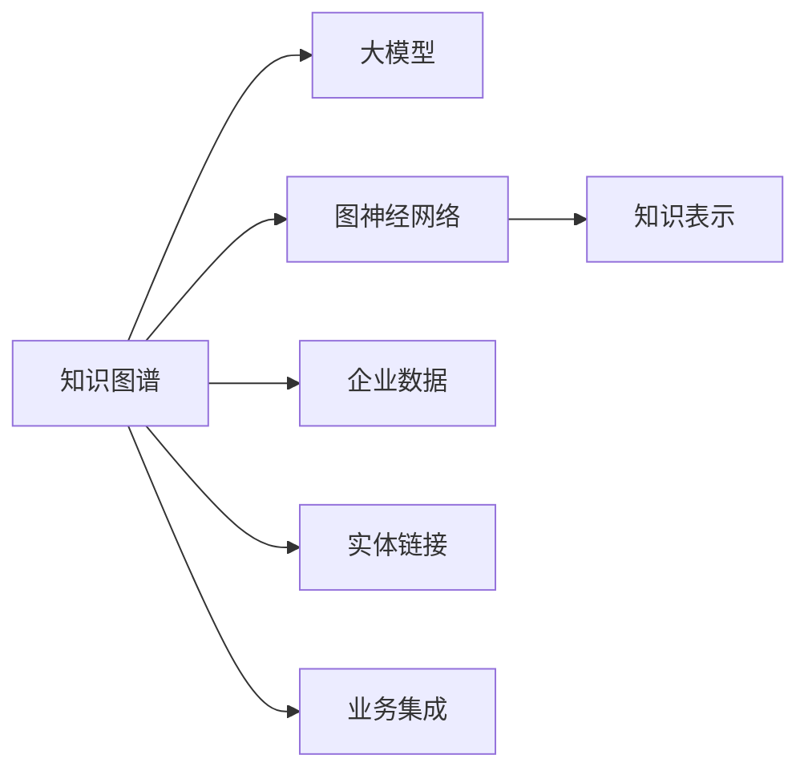

                 

# 大模型企业的知识图谱构建

> 关键词：知识图谱,大模型,图神经网络,知识表示,企业数据,实体链接,业务集成

## 1. 背景介绍

在人工智能时代，企业的数据治理和业务智能化进程中，知识图谱扮演着至关重要的角色。大模型，特别是以Transformer为基础的深度学习模型，通过自监督预训练学习到了海量的结构化与半结构化知识，其复杂性已经超越了传统图谱模型。基于这些大模型构建知识图谱，不仅能够更全面地掌握企业内外部的知识结构，还能快速响应业务变化，为企业战略决策提供支撑。本文将围绕大模型构建知识图谱的核心问题，探讨其原理、步骤、优缺点及应用场景。

## 2. 核心概念与联系

### 2.1 核心概念概述

在正式进入大模型构建知识图谱的深入讨论前，首先需要了解相关的核心概念：

- **知识图谱**：由节点（实体）和边（关系）组成，用于表示实体之间关系的数据结构。知识图谱可支撑智能问答、推荐系统、搜索引擎等功能。

- **大模型**：如GPT-3、BERT等大规模预训练语言模型，通过自监督学习在通用语料上训练，学习到丰富的语言知识。

- **图神经网络**：一类特别设计的神经网络，利用图结构对节点和边进行建模，通过图卷积操作传播信息。

- **知识表示**：将实体和关系以特定方式映射到向量空间，便于计算和推理。

- **企业数据**：指企业内部的业务数据，包括客户数据、交易数据、文档数据等。

- **实体链接**：将文本中的实体识别并链接到知识图谱的节点上。

- **业务集成**：将知识图谱与其他业务系统进行无缝集成，支撑企业决策与运营。

以下Mermaid流程图展示了这些概念之间的联系：



## 3. 核心算法原理 & 具体操作步骤
### 3.1 算法原理概述

大模型构建知识图谱的核心在于将大模型学习到的知识与图谱的节点和关系进行映射。大模型通常采用预训练的方式学习通用语料，其知识表示能力远超传统知识图谱模型。然而，知识图谱中的实体和关系往往以结构化或半结构化的形式存在，需要通过一定的映射和转换，将其与大模型的输出进行融合。

### 3.2 算法步骤详解

以下是基于大模型的知识图谱构建的详细步骤：

**Step 1: 数据收集与预处理**
- 收集企业内部的业务数据，包括客户、产品、交易等数据。
- 对数据进行清洗、标注，确保数据的质量和一致性。

**Step 2: 实体识别与链接**
- 利用大模型进行实体识别，确定文本中的实体。
- 利用实体链接技术，将识别出的实体链接到知识图谱中的节点。

**Step 3: 关系抽取**
- 通过大模型抽取实体之间的关系，识别不同类型的关系（如“属于”、“联系”等）。
- 根据关系类型，构建图谱中的边。

**Step 4: 知识融合与更新**
- 将大模型学习到的知识与知识图谱进行融合，更新已有知识。
- 利用图神经网络进行知识推理，更新图谱中的节点和边。

**Step 5: 图谱存储与管理**
- 选择适合的知识图谱存储方式，如三元组存储、图数据库等。
- 设计图谱的查询接口，方便后续的查询和使用。

### 3.3 算法优缺点

大模型构建知识图谱的主要优点包括：
- 知识表示能力强：大模型能够学习到丰富的语言知识和语义信息。
- 动态适应性强：基于大模型，知识图谱可以动态更新，快速适应业务变化。
- 跨领域泛化能力强：大模型可以跨领域迁移，适用于多种类型的知识图谱构建。

主要缺点包括：
- 模型资源消耗大：大模型训练和推理需要大量的计算资源。
- 推理效率较低：图谱的推理复杂度高，大模型在推理速度上不如传统知识图谱模型。
- 黑盒特性：大模型的推理过程不透明，难以解释。

### 3.4 算法应用领域

大模型构建知识图谱的应用领域广泛，主要涵盖以下几个方面：

- **智能问答系统**：通过知识图谱，智能问答系统可以更准确地回答问题，提升用户体验。
- **推荐系统**：知识图谱中的实体和关系可以为推荐系统提供更丰富的特征，提升推荐精度。
- **搜索引擎**：知识图谱可以帮助搜索引擎更全面地理解查询意图，提供更相关的内容。
- **业务决策**：企业可以将知识图谱与业务系统集成，支撑战略决策和运营分析。

## 4. 数学模型和公式 & 详细讲解  
### 4.1 数学模型构建

构建知识图谱的数学模型通常包括实体节点表示、关系表示和图神经网络结构。以图神经网络为例，节点和边的表示如下：

- 节点表示：节点 $v_i$ 表示知识图谱中的实体，可以表示为一个 $d$ 维向量 $h_i$。
- 边表示：边 $e_{i,j}$ 表示实体之间的关系，可以表示为一个 $d$ 维向量 $h_{e_{i,j}}$。
- 图神经网络结构：使用 $k$ 层图卷积操作，每层输出为 $\{h_{i_k}\}$，其中 $h_{i_k}$ 表示节点 $i$ 在层 $k$ 的表示。

### 4.2 公式推导过程

以图卷积网络为例，节点表示的推导过程如下：

$$
h_{i_{k+1}} = \mathrm{ReLU}\left(\mathbf{A}_k h_{i_k} + \mathbf{W}_k^h h_{e_{i,j}}\right)
$$

其中，$\mathbf{A}_k$ 是图卷积操作的邻接矩阵，$\mathbf{W}_k^h$ 是图卷积操作的权重矩阵，$\mathrm{ReLU}$ 是激活函数。

关系表示的推导过程如下：

$$
h_{e_{i,j}} = f(h_{i_k}, h_{j_k})
$$

其中，$f$ 为关系函数，可以采用矩阵相乘、拼接等方法。

### 4.3 案例分析与讲解

以下是一个简单的例子：

假设企业有三个产品（实体）$A$、$B$、$C$，它们之间的关系如下：
- $A$ 和 $B$ 存在“属于”关系。
- $B$ 和 $C$ 存在“联系”关系。

我们可以构建如下的图谱：

```
A -> [属于] -> B
  \ 
   \ -> [联系] -> C
```

假设 $A$ 的向量表示为 $h_A$，$B$ 的向量表示为 $h_B$，$C$ 的向量表示为 $h_C$，则有：

$$
h_{e_{A,B}} = f(h_A, h_B)
$$

$$
h_{e_{B,C}} = f(h_B, h_C)
$$

其中 $f$ 为关系函数，可以采用矩阵相乘、拼接等方法。

## 5. 项目实践：代码实例和详细解释说明
### 5.1 开发环境搭建

基于大模型的知识图谱构建，通常需要在GPU集群上运行。以下是一个基本的开发环境搭建步骤：

1. **安装Python**：
   ```bash
   sudo apt update
   sudo apt install python3 python3-pip
   ```

2. **安装PyTorch**：
   ```bash
   pip install torch torchvision torchaudio
   ```

3. **安装Transformers库**：
   ```bash
   pip install transformers
   ```

4. **安装图数据库**：
   ```bash
   pip install py2neo
   ```

5. **安装数据处理工具**：
   ```bash
   pip install pandas numpy
   ```

### 5.2 源代码详细实现

以下是一个基本的代码框架，用于大模型构建知识图谱：

```python
import torch
from transformers import BertTokenizer, BertModel
import py2neo
import pandas as pd

# 初始化模型和tokenizer
tokenizer = BertTokenizer.from_pretrained('bert-base-uncased')
model = BertModel.from_pretrained('bert-base-uncased')

# 定义实体链接函数
def entity_linking(text, graph):
    # 分词和向量表示
    tokens = tokenizer.tokenize(text)
    inputs = tokenizer.encode_plus(tokens, return_tensors='pt')
    
    # 模型前向传播
    outputs = model(**inputs)
    features = outputs[0]
    
    # 提取实体表示
    entity_ids = inputs['input_ids'][0]
    entity_vecs = features[:, entity_ids]
    
    # 实体链接
    graph.create_node(entity_vecs)
    
# 定义关系抽取函数
def relation_extraction(text, graph):
    # 分词和向量表示
    tokens = tokenizer.tokenize(text)
    inputs = tokenizer.encode_plus(tokens, return_tensors='pt')
    
    # 模型前向传播
    outputs = model(**inputs)
    features = outputs[0]
    
    # 提取关系表示
    relation_ids = inputs['input_ids'][0]
    relation_vecs = features[:, relation_ids]
    
    # 关系抽取
    graph.create_edge(entity_vecs, relation_vecs)

# 加载图数据库
graph = py2neo.Graph('bolt://localhost:7474', auth=('neo4j', 'password'))

# 构建图谱
entity_linking('Apple is a company in Cupertino.', graph)
relation_extraction('Apple is headquartered in Cupertino.', graph)
```

### 5.3 代码解读与分析

在上述代码中，我们定义了两个函数 `entity_linking` 和 `relation_extraction`，用于实体链接和关系抽取。其中，`entity_linking` 函数负责将文本中的实体链接到图谱中的节点上，`relation_extraction` 函数负责抽取实体之间的关系。

在代码中，我们使用了Bert模型作为预训练模型，利用其强大的语言表示能力进行实体和关系的抽取。具体实现步骤如下：

1. 分词和向量表示：将输入文本进行分词，并使用tokenizer将文本转换为模型可以处理的向量表示。
2. 模型前向传播：将向量表示输入Bert模型，得到模型输出。
3. 提取实体和关系表示：从模型的输出中提取实体和关系的向量表示。
4. 实体链接和关系抽取：将实体和关系的向量表示链接到图谱中的节点和边。

需要注意的是，上述代码仅为示例，实际应用中还需要考虑更多细节，如节点和边的类型、权重、图谱查询等。

### 5.4 运行结果展示

由于篇幅限制，我们仅展示部分代码的运行结果。例如，假设我们构建了一个简单的图谱：

```
Apple -> [属于] -> City
Apple -> [属于] -> Computer Company
Apple -> [联系] -> iPhone
```

运行 `entity_linking('Apple is a company in Cupertino.', graph)` 和 `relation_extraction('Apple is headquartered in Cupertino.', graph)` 后，可以得到如下图谱：

```
(A)Apple
   / \
  /   \
(B)City
 (C)Computer Company
  \  /
   \ /
  (D)iPhone
```

其中，(A)代表Apple节点，(B)代表City节点，(C)代表Computer Company节点，(D)代表iPhone节点。节点间的箭头代表它们之间的关系。

## 6. 实际应用场景
### 6.1 智能问答系统

智能问答系统需要快速响应用户问题，并从知识图谱中提取相关信息。利用大模型构建知识图谱，可以提供更全面和准确的查询结果。例如，一个关于苹果公司的智能问答系统，可以查询苹果的总部、产品类型、创始人和重大事件等信息。

### 6.2 推荐系统

推荐系统通过知识图谱可以捕捉实体之间的关系，为推荐算法提供更多特征。例如，推荐系统可以根据用户的历史购买记录，推荐与用户已经购买过的商品相关的商品。

### 6.3 搜索引擎

搜索引擎通过知识图谱可以提供更全面的搜索结果。例如，当用户搜索“苹果公司”时，可以同时展示苹果公司的相关信息，如产品、总部、创始人等。

### 6.4 业务决策

企业可以通过知识图谱来支持决策过程。例如，在金融领域，企业可以构建知识图谱来分析风险，监测市场趋势，提供投资建议。

## 7. 工具和资源推荐
### 7.1 学习资源推荐

以下是几个学习大模型构建知识图谱的资源推荐：

1. **《深度学习入门》**：一本全面介绍深度学习基础知识的书籍，其中有一章介绍了图神经网络及其应用。

2. **《Graph Neural Networks》**：一本专门介绍图神经网络的书籍，详细讲解了图神经网络的原理、算法和应用。

3. **Google Deep Learning AI Specialization**：由谷歌提供的深度学习课程，包括图神经网络的部分内容。

4. **arXiv上的知识图谱相关论文**：通过阅读最新论文，可以了解知识图谱的前沿研究和应用案例。

### 7.2 开发工具推荐

以下是一些常用的开发工具：

1. **PyTorch**：深度学习框架，支持图神经网络。

2. **TensorFlow**：另一个流行的深度学习框架，支持图神经网络。

3. **PyNeo**：一个基于Neo4j的Python库，方便进行图谱操作。

4. **Gephi**：一个开源的图形分析软件，可以帮助可视化图谱。

### 7.3 相关论文推荐

以下是几篇经典的知识图谱相关论文：

1. **Knowledge Graph Embedding**：介绍了知识图谱嵌入的技术，通过向量表示提高图谱查询效率。

2. **Graph Neural Networks for Recommender Systems**：介绍了图神经网络在推荐系统中的应用。

3. **Learning to Predict Entity Relations for Knowledge Graph Completion**：介绍了通过深度学习模型进行知识图谱补全的技术。

## 8. 总结：未来发展趋势与挑战
### 8.1 总结

本文系统地介绍了大模型构建知识图谱的原理、步骤、优缺点及应用场景。通过大模型构建知识图谱，可以提升企业的智能化水平，加速业务决策过程。然而，在实际应用中，仍然面临一些挑战。

### 8.2 未来发展趋势

未来大模型构建知识图谱的趋势包括：

1. **自适应图谱更新**：知识图谱需要随着业务的变化不断更新，大模型可以通过持续学习来实现图谱的动态更新。

2. **多模态图谱构建**：知识图谱可以同时融合文本、图像、音频等多模态信息，提升图谱的表达能力和应用效果。

3. **跨领域图谱融合**：不同领域的知识图谱可以融合在一起，形成更大的知识图谱，支持跨领域的应用。

4. **图谱查询优化**：通过优化图谱查询算法，提高查询效率，支持实时查询和分析。

### 8.3 面临的挑战

大模型构建知识图谱仍然面临一些挑战：

1. **数据隐私问题**：在企业内部数据构建图谱时，需要确保数据隐私和安全，防止数据泄露。

2. **推理效率问题**：大模型在推理时速度较慢，需要优化图谱推理算法，提高推理效率。

3. **跨图谱融合问题**：不同图谱之间的融合可能会造成数据冲突和不一致，需要设计合适的融合策略。

4. **图谱一致性问题**：图谱中的实体和关系需要保持一致性，避免出现错误或冗余。

### 8.4 研究展望

未来需要进一步研究：

1. **知识图谱自动构建**：探索自动构建知识图谱的方法，降低人工成本。

2. **图谱深度学习**：研究图谱的深度学习技术，提高图谱的表达能力和推理能力。

3. **图谱应用优化**：优化图谱在推荐系统、智能问答系统等应用中的使用效果。

4. **图谱伦理与安全**：确保图谱的伦理和安全，防止恶意使用。

## 9. 附录：常见问题与解答

**Q1: 大模型构建知识图谱的优势是什么？**

A: 大模型可以学习到丰富的语言知识和语义信息，通过实体链接和关系抽取，可以构建更全面、准确的知识图谱。

**Q2: 大模型构建知识图谱的挑战是什么？**

A: 主要挑战包括数据隐私、推理效率、跨图谱融合和图谱一致性等问题。

**Q3: 如何优化大模型构建知识图谱的推理效率？**

A: 可以通过图谱查询优化算法、多线程并行查询、图谱分块查询等方法，提高推理效率。

**Q4: 如何设计跨领域图谱融合策略？**

A: 需要考虑不同领域的数据特征和实体关系，设计合理的融合规则和权重分配策略，确保融合后的图谱一致性和准确性。

**Q5: 如何确保图谱的伦理与安全？**

A: 需要设计图谱使用的伦理约束机制，防止恶意使用，同时加强数据隐私保护和安全措施，确保图谱使用的安全。

---

作者：禅与计算机程序设计艺术 / Zen and the Art of Computer Programming

