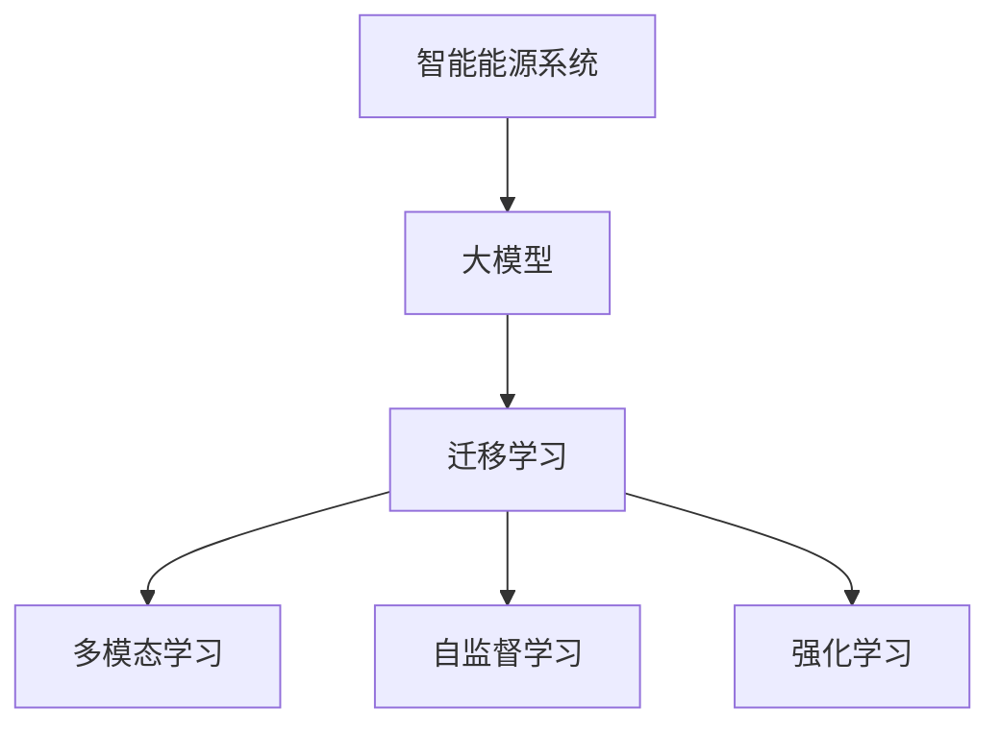

                 

## 1. 背景介绍

### 1.1 问题由来

随着全球能源需求的持续增长以及传统化石能源的日渐枯竭，智能化能源系统已成为现代能源管理的关键趋势。智能能源系统依托先进的信息与通信技术、物联网技术、数据分析等手段，对能源的采集、存储、传输、分配等全流程进行智能化管理和优化，旨在提高能源利用效率、降低成本、保障能源安全。然而，传统的基于规则和专家知识的能源管理方案存在智能化水平低、响应速度慢、决策不够精确等局限性。

与此同时，深度学习技术近年来的飞速发展为智能能源系统提供了新的可能性。人工智能算法能够从海量能源数据中学习到能源系统的运行规律和行为模式，提升能源管理的智能化水平。其中，大模型因其能够处理大规模、高维度数据，具有强大的泛化能力和学习能力，逐渐被引入到智能能源系统中。

### 1.2 问题核心关键点

大模型在智能能源系统中的应用主要体现在以下几个方面：

1. **负荷预测**：通过学习历史能源消费数据，大模型能够预测未来能源需求，辅助能源调度决策。
2. **故障诊断**：利用故障样本数据，大模型能够识别出能源系统的运行异常，提前预警，避免重大损失。
3. **需求响应**：通过分析用户行为数据，大模型能够预测用户在不同情境下的能源需求，实现智能调峰和需求响应。
4. **优化控制**：结合能源系统运行数据，大模型能够优化能源分配和调控策略，提高能源利用效率。

本文将深入探讨大模型在智能能源系统中的应用，着重分析其在负荷预测、故障诊断、需求响应和优化控制等场景中的算法原理、实现步骤和性能表现。

## 2. 核心概念与联系

### 2.1 核心概念概述

为更好地理解大模型在智能能源系统中的应用，本节将介绍几个关键概念：

- **智能能源系统**：基于互联网、物联网、人工智能等技术，实现对能源的智能化采集、存储、传输、分配等全流程管理与优化的系统。
- **大模型**：以自回归（如GPT）或自编码（如BERT）模型为代表的大规模预训练模型，通过在大规模数据上预训练，学习通用的语言或图像表示。
- **迁移学习**：将一个领域学习到的知识，迁移到另一个相关领域的学习过程。大模型通过迁移学习，能够在新的能源管理任务上取得更好的性能。
- **多模态学习**：结合文本、图像、时间序列等多种数据形式，提高大模型的泛化能力和决策精度。
- **自监督学习**：利用大量未标注数据进行训练，通过数据自身特征进行学习，避免对标注数据的依赖。
- **强化学习**：通过奖励机制，使大模型能够在不断试错中，优化决策策略，提升任务表现。

这些概念之间的逻辑关系可以通过以下Mermaid流程图来展示：



### 2.2 核心概念原理和架构的 Mermaid 流程图

该流程图展示了智能能源系统、大模型及其相关学习范式之间的联系。智能能源系统作为最终应用目标，通过大模型学习并应用多模态数据，借助迁移学习、自监督学习和强化学习等技术，不断提升自身的智能化水平。

## 3. 核心算法原理 & 具体操作步骤

### 3.1 算法原理概述

大模型在智能能源系统中的应用主要基于监督学习、迁移学习、多模态学习等技术。其核心思想是通过学习历史能源数据和运行模式，构建出模型，用于预测能源需求、诊断故障、优化调控等任务。

以负荷预测为例，假设有历史能源消耗数据集 $D = \{(x_i, y_i)\}_{i=1}^N$，其中 $x_i$ 为历史时间点，$y_i$ 为对应时间点的能源消耗量。目标是在新时间点 $t_0$ 对未来能源消耗量 $y_{t_0}$ 进行预测。具体算法流程如下：

1. **预训练**：在大规模无标签数据集上对大模型进行预训练，学习通用的能源规律和行为模式。
2. **微调**：在能源消耗数据集上对预训练模型进行微调，使得模型能够更好地适应能源系统的具体特征。
3. **测试**：在新时间点上，输入未来时间点的输入数据 $x_{t_0}$，通过模型输出 $y_{t_0}$ 预测未来能源消耗量。

### 3.2 算法步骤详解

#### 3.2.1 数据准备

1. **数据收集**：收集历史能源消耗数据，包括时间、类型、数量等信息。
2. **数据预处理**：对数据进行清洗、归一化、划分训练集、验证集和测试集等操作。
3. **数据增强**：通过时间序列插值、平滑等方法，增强数据集的多样性和泛化能力。

#### 3.2.2 模型构建

1. **模型选择**：根据任务需求选择合适的预训练模型，如BERT、LSTM、GAN等。
2. **添加任务适配层**：在预训练模型顶层添加针对负荷预测的输出层和损失函数，如均方误差（MSE）。
3. **超参数设置**：设置模型的学习率、批大小、迭代轮数等参数。

#### 3.2.3 模型训练

1. **前向传播**：将输入数据 $x_i$ 输入模型，计算模型输出 $\hat{y}_i$。
2. **计算损失**：计算模型输出 $\hat{y}_i$ 与真实标签 $y_i$ 之间的损失函数，如MSE。
3. **反向传播**：通过反向传播算法计算模型参数的梯度。
4. **更新模型**：根据梯度信息，使用优化算法（如Adam）更新模型参数。
5. **验证与调整**：在验证集上评估模型性能，根据结果调整超参数和模型结构。

#### 3.2.4 模型评估

1. **模型测试**：在测试集上输入新时间点 $x_{t_0}$，输出预测值 $\hat{y}_{t_0}$。
2. **性能指标**：计算预测值 $\hat{y}_{t_0}$ 与真实值 $y_{t_0}$ 之间的误差，如MSE、MAE等。

### 3.3 算法优缺点

大模型在智能能源系统中的应用具有以下优点：

1. **高泛化能力**：大模型通过预训练学习通用的能源规律，能够泛化到不同场景和数据集上。
2. **快速预测**：大模型能够在短时间内处理大量数据，提供实时能源预测。
3. **多模态融合**：结合时间序列、空间位置、环境条件等多种数据形式，提升预测精度。

然而，大模型在智能能源系统中的应用也存在一些局限性：

1. **数据依赖**：大模型的性能高度依赖于数据质量，数据偏差可能导致模型输出错误。
2. **计算资源需求高**：大模型通常需要高性能计算资源，限制了其在资源受限环境中的应用。
3. **解释性差**：大模型的预测结果难以解释，难以理解其内部工作机制。
4. **安全与隐私**：大模型可能学习到能源系统中的敏感信息，存在安全与隐私风险。

### 3.4 算法应用领域

大模型在智能能源系统中的应用涵盖了负荷预测、故障诊断、需求响应、优化控制等多个领域。

1. **负荷预测**：预测未来一段时间内的能源消耗量，帮助能源调度决策。
2. **故障诊断**：识别能源系统的运行异常，提前预警，避免事故。
3. **需求响应**：分析用户行为数据，预测需求变化，实现智能调峰。
4. **优化控制**：结合能源系统运行数据，优化能源分配策略，提高效率。

## 4. 数学模型和公式 & 详细讲解 & 举例说明

### 4.1 数学模型构建

以负荷预测为例，我们构建一个基于大模型的数学模型：

设历史能源消耗数据集为 $D = \{(x_i, y_i)\}_{i=1}^N$，其中 $x_i = (t_i, \mathbf{X}_i)$，$t_i$ 为时间点，$\mathbf{X}_i$ 为其他影响因素向量。假设模型输出为 $\hat{y}_i$，损失函数为 $L(y_i, \hat{y}_i) = (y_i - \hat{y}_i)^2$。

### 4.2 公式推导过程

根据均方误差损失函数，我们有：

$$
\mathcal{L} = \frac{1}{N} \sum_{i=1}^N (y_i - \hat{y}_i)^2
$$

通过梯度下降优化算法，求解模型参数 $\theta$：

$$
\theta \leftarrow \theta - \eta \nabla_{\theta} \mathcal{L}
$$

其中 $\eta$ 为学习率，$\nabla_{\theta} \mathcal{L}$ 为损失函数对模型参数的梯度。

### 4.3 案例分析与讲解

以一个具体的负荷预测任务为例，我们通过搭建一个LSTM模型，使用均方误差损失函数，进行模型训练和评估。

1. **数据准备**：收集某城市的能源消耗数据，包括时间、天气、节假日等信息。
2. **模型构建**：选择LSTM模型，在模型顶层添加输出层和均方误差损失函数。
3. **模型训练**：使用80%的数据集进行训练，20%的数据集进行验证和调整超参数。
4. **模型评估**：使用测试集数据进行模型测试，计算均方误差（MSE）评估模型性能。

## 5. 项目实践：代码实例和详细解释说明

### 5.1 开发环境搭建

在进行能源负荷预测任务时，首先需要搭建好开发环境。以下是使用Python进行PyTorch开发的环境配置流程：

1. 安装Anaconda：从官网下载并安装Anaconda，用于创建独立的Python环境。

2. 创建并激活虚拟环境：
```bash
conda create -n energy-env python=3.8 
conda activate energy-env
```

3. 安装PyTorch：根据CUDA版本，从官网获取对应的安装命令。例如：
```bash
conda install pytorch torchvision torchaudio cudatoolkit=11.1 -c pytorch -c conda-forge
```

4. 安装相关库：
```bash
pip install pandas numpy matplotlib scikit-learn torch
```

5. 安装PyTorch预训练模型库：
```bash
pip install transformers
```

6. 安装数据加载和处理工具：
```bash
pip install torch.utils.data
```

完成上述步骤后，即可在`energy-env`环境中开始能源负荷预测任务。

### 5.2 源代码详细实现

以下是使用PyTorch搭建LSTM模型进行能源负荷预测的代码实现：

```python
import torch
import torch.nn as nn
import torch.optim as optim
from torch.utils.data import DataLoader
import pandas as pd

class EnergyPredictor(nn.Module):
    def __init__(self, input_dim, hidden_dim, output_dim):
        super(EnergyPredictor, self).__init__()
        self.lstm = nn.LSTM(input_dim, hidden_dim, num_layers=1, batch_first=True)
        self.fc = nn.Linear(hidden_dim, output_dim)
    
    def forward(self, x):
        lstm_out, _ = self.lstm(x)
        pred = self.fc(lstm_out[:, -1, :])
        return pred

# 加载数据集
data = pd.read_csv('energy_consumption.csv')

# 数据预处理
def preprocess_data(data):
    # 归一化
    mean = data['energy'].rolling(window=24).mean()
    std = data['energy'].rolling(window=24).std()
    data['energy'] = (data['energy'] - mean) / std
    # 时间序列填充
    data['energy'] = data['energy'].rolling(window=24).mean()
    # 划分训练集和测试集
    train_size = int(0.7 * len(data))
    train_data = data.iloc[:train_size]
    test_data = data.iloc[train_size:]
    # 数据标准化
    scaler = MinMaxScaler()
    train_data = scaler.fit_transform(train_data)
    test_data = scaler.transform(test_data)
    return train_data, test_data

train_data, test_data = preprocess_data(data)

# 构建模型
input_dim = 5
hidden_dim = 64
output_dim = 1
model = EnergyPredictor(input_dim, hidden_dim, output_dim)

# 定义损失函数和优化器
criterion = nn.MSELoss()
optimizer = optim.Adam(model.parameters(), lr=0.001)

# 训练模型
train_loader = DataLoader(train_data, batch_size=32, shuffle=True)
epochs = 100
for epoch in range(epochs):
    model.train()
    total_loss = 0
    for batch in train_loader:
        inputs = torch.tensor(batch[:-1], dtype=torch.float32)
        targets = torch.tensor(batch[1:], dtype=torch.float32)
        optimizer.zero_grad()
        outputs = model(inputs)
        loss = criterion(outputs, targets)
        loss.backward()
        optimizer.step()
        total_loss += loss.item()
    print(f"Epoch {epoch+1}, Loss: {total_loss/len(train_loader)}")

# 模型测试
model.eval()
with torch.no_grad():
    predictions = []
    targets = []
    for batch in test_loader:
        inputs = torch.tensor(batch[:-1], dtype=torch.float32)
        targets = torch.tensor(batch[1:], dtype=torch.float32)
        outputs = model(inputs)
        predictions.append(outputs.item())
        targets.append(targets.item())
    print(f"MSE: {np.mean((np.array(predictions) - np.array(targets))**2)}")
```

### 5.3 代码解读与分析

这段代码实现了使用LSTM模型进行能源负荷预测的过程。其中，主要包含数据预处理、模型构建、训练和测试等步骤。

1. **数据预处理**：使用时间序列插值和归一化方法处理数据，保证模型输入的连续性和可预测性。
2. **模型构建**：选择LSTM模型，并添加输出层和均方误差损失函数。
3. **模型训练**：使用训练集数据进行模型训练，调整超参数，得到最优模型。
4. **模型测试**：在测试集上评估模型性能，计算均方误差（MSE）。

## 6. 实际应用场景

### 6.1 智能电网负荷预测

在智能电网中，负荷预测是实现能源调度优化的关键环节。传统的人工预测方法耗费大量人力且精度不高，而大模型能够通过学习历史负荷数据，提供准确、及时的负荷预测，支持智能电网的稳定运行。

具体而言，可以使用大模型对历史负荷数据进行训练，构建负荷预测模型。模型通过分析当前天气、节假日、用户行为等因素，预测未来一段时间内的负荷需求。基于预测结果，智能电网可以提前调整发电量，确保系统稳定运行。

### 6.2 能源故障诊断

能源系统运行过程中，不可避免地会出现故障和异常。大模型可以通过学习故障样本数据，识别出系统的运行异常，提前预警，避免重大损失。

例如，在电力系统中，可以使用大模型对电网运行数据进行分析，识别出电压异常、电流异常、设备故障等异常情况，及时进行维护和处理。在智能水务系统中，可以监测水压、流量等关键参数，预测潜在的供水故障，提前进行抢修。

### 6.3 需求响应

能源需求响应是智能能源系统的重要组成部分，通过智能调度系统，实现对用户需求的灵活调节，提升能源利用效率。大模型可以通过分析用户历史行为数据，预测未来需求变化，实现智能调峰和需求响应。

例如，在智能电网中，可以通过大模型预测用户的负荷需求变化，提前调整系统输出，避免过载和欠载。在智能水务系统中，可以预测用户的用水需求变化，提前调整供水计划，确保水资源的合理分配。

### 6.4 优化控制

优化控制是大模型在智能能源系统中另一个重要应用场景。通过结合能源系统运行数据，大模型能够优化能源分配和调控策略，提高能源利用效率。

例如，在智能电网中，可以使用大模型对电网运行数据进行分析，优化发电计划和负荷分配策略，降低能源损耗。在智能水务系统中，可以通过大模型优化供水、排水和污水处理策略，实现资源的高效利用。

## 7. 工具和资源推荐

### 7.1 学习资源推荐

为了帮助开发者系统掌握大模型在智能能源系统中的应用，这里推荐一些优质的学习资源：

1. 《Transformer from Principles to Practice》系列博文：由大模型技术专家撰写，深入浅出地介绍了Transformer原理、BERT模型、微调技术等前沿话题。
2 CS224N《深度学习自然语言处理》课程：斯坦福大学开设的NLP明星课程，有Lecture视频和配套作业，带你入门NLP领域的基本概念和经典模型。
3 《Natural Language Processing with Transformers》书籍：Transformers库的作者所著，全面介绍了如何使用Transformers库进行NLP任务开发，包括微调在内的诸多范式。
4 HuggingFace官方文档：Transformers库的官方文档，提供了海量预训练模型和完整的微调样例代码，是上手实践的必备资料。
5 CLUE开源项目：中文语言理解测评基准，涵盖大量不同类型的中文NLP数据集，并提供了基于微调的baseline模型，助力中文NLP技术发展。

通过对这些资源的学习实践，相信你一定能够快速掌握大模型在智能能源系统中的应用，并用于解决实际的能源管理问题。

### 7.2 开发工具推荐

高效的开发离不开优秀的工具支持。以下是几款用于大模型在智能能源系统中的应用开发的常用工具：

1. PyTorch：基于Python的开源深度学习框架，灵活动态的计算图，适合快速迭代研究。大部分预训练语言模型都有PyTorch版本的实现。
2 TensorFlow：由Google主导开发的开源深度学习框架，生产部署方便，适合大规模工程应用。同样有丰富的预训练语言模型资源。
3 Weights & Biases：模型训练的实验跟踪工具，可以记录和可视化模型训练过程中的各项指标，方便对比和调优。与主流深度学习框架无缝集成。
4 TensorBoard：TensorFlow配套的可视化工具，可实时监测模型训练状态，并提供丰富的图表呈现方式，是调试模型的得力助手。
5 Jupyter Notebook：交互式笔记本，支持代码执行、数据可视化、结果展示，方便开发者快速迭代和分享学习笔记。

合理利用这些工具，可以显著提升大模型在智能能源系统中的开发效率，加快创新迭代的步伐。

### 7.3 相关论文推荐

大模型在智能能源系统中的应用研究源于学界的持续研究。以下是几篇奠基性的相关论文，推荐阅读：

1. Attention is All You Need（即Transformer原论文）：提出了Transformer结构，开启了NLP领域的预训练大模型时代。
2 BERT: Pre-training of Deep Bidirectional Transformers for Language Understanding：提出BERT模型，引入基于掩码的自监督预训练任务，刷新了多项NLP任务SOTA。
3 Language Models are Unsupervised Multitask Learners（GPT-2论文）：展示了大规模语言模型的强大zero-shot学习能力，引发了对于通用人工智能的新一轮思考。
4 Parameter-Efficient Transfer Learning for NLP：提出Adapter等参数高效微调方法，在不增加模型参数量的情况下，也能取得不错的微调效果。
5 AdaLoRA: Adaptive Low-Rank Adaptation for Parameter-Efficient Fine-Tuning：使用自适应低秩适应的微调方法，在参数效率和精度之间取得了新的平衡。
6 《Deep Learning for Energy Systems》书籍：全面介绍深度学习在能源系统中的应用，包括负荷预测、故障诊断、需求响应等任务。

这些论文代表了大模型在智能能源系统中的应用研究的发展脉络。通过学习这些前沿成果，可以帮助研究者把握学科前进方向，激发更多的创新灵感。

## 8. 总结：未来发展趋势与挑战

### 8.1 研究成果总结

本文对大模型在智能能源系统中的应用进行了全面系统的介绍。首先阐述了智能能源系统的背景和需求，明确了大模型在其中的关键作用。其次，从原理到实践，详细讲解了负荷预测、故障诊断、需求响应和优化控制的算法流程和操作步骤，给出了完整的代码实例。同时，本文还广泛探讨了大模型在智能能源系统中的多种应用场景，展示了其巨大的潜力。

通过本文的系统梳理，可以看到，大模型在智能能源系统中的应用为能源管理的智能化、高效化和安全性带来了新的可能。伴随深度学习技术的不断发展，大模型将在能源系统中发挥更加重要的作用，助力能源系统的数字化转型。

### 8.2 未来发展趋势

展望未来，大模型在智能能源系统中的应用将呈现以下几个发展趋势：

1. **模型规模持续增大**：随着算力成本的下降和数据规模的扩张，大模型的参数量还将持续增长，带来更高的泛化能力和预测精度。
2. **多模态学习成为主流**：结合时间序列、图像、视频等多模态数据，提高大模型的泛化能力和决策精度。
3. **自监督学习和强化学习结合**：通过自监督学习和强化学习，使大模型能够从无标签数据和奖励机制中不断优化，提升任务表现。
4. **联邦学习与边缘计算**：在大模型微调过程中，结合联邦学习和边缘计算技术，提高数据隐私和安全，同时提升模型的实时性和泛化能力。
5. **实时化和大规模部署**：通过模型裁剪、量化加速等技术，提升大模型的推理速度和资源利用效率，支持大规模实时化部署。

以上趋势凸显了大模型在智能能源系统中的广阔前景。这些方向的探索发展，必将进一步提升能源管理的智能化水平，推动能源系统的数字化转型。

### 8.3 面临的挑战

尽管大模型在智能能源系统中的应用已经取得了显著进展，但在迈向更加智能化、普适化应用的过程中，仍面临诸多挑战：

1. **数据质量和分布**：大模型的性能高度依赖于数据质量，数据偏差可能导致模型输出错误。如何在保证数据多样性和泛化性的同时，获取高质量的标注数据，仍是一个难题。
2. **计算资源限制**：大模型的参数量和计算需求高，限制了其在资源受限环境中的应用。如何优化模型结构和算法，降低计算资源需求，提高模型部署效率，是亟待解决的问题。
3. **模型复杂度和可解释性**：大模型的复杂度较高，难以解释其内部工作机制和决策逻辑。如何在保证模型性能的同时，提高其可解释性和透明性，是提升模型可信度的关键。
4. **安全与隐私**：大模型可能学习到能源系统中的敏感信息，存在安全与隐私风险。如何在模型训练和应用过程中，保护数据隐私和模型安全，是必须面对的挑战。

### 8.4 研究展望

面对大模型在智能能源系统中的应用所面临的种种挑战，未来的研究需要在以下几个方面寻求新的突破：

1. **无监督学习与迁移学习结合**：探索无监督学习和迁移学习结合的方法，减少对标注数据的依赖，提升模型的泛化能力和鲁棒性。
2. **模型压缩与加速**：研究模型压缩、量化加速等技术，提高大模型的推理速度和资源利用效率，支持大规模实时化部署。
3. **可解释性与透明性**：开发可解释性强的模型和算法，提高大模型的透明性和可信度，帮助用户理解和信任模型的决策过程。
4. **隐私保护与数据安全**：结合联邦学习和边缘计算技术，保护数据隐私和模型安全，确保能源系统的数据安全和隐私保护。

这些研究方向的探索，必将引领大模型在智能能源系统中的应用迈向更高的台阶，为能源系统的智能化和高效化提供新的解决方案。

## 9. 附录：常见问题与解答

**Q1: 大模型在智能能源系统中应用的优势和局限性有哪些？**

A: 大模型在智能能源系统中的应用具有以下优势：

1. 高泛化能力：大模型通过预训练学习通用的能源规律，能够泛化到不同场景和数据集上。
2. 快速预测：大模型能够在短时间内处理大量数据，提供实时能源预测。
3. 多模态融合：结合时间序列、空间位置、环境条件等多种数据形式，提升预测精度。

但同时存在以下局限性：

1. 数据依赖：大模型的性能高度依赖于数据质量，数据偏差可能导致模型输出错误。
2. 计算资源需求高：大模型通常需要高性能计算资源，限制了其在资源受限环境中的应用。
3. 解释性差：大模型的预测结果难以解释，难以理解其内部工作机制。
4. 安全与隐私：大模型可能学习到能源系统中的敏感信息，存在安全与隐私风险。

**Q2: 如何在智能能源系统中实现负荷预测？**

A: 在智能能源系统中实现负荷预测，可以通过以下步骤：

1. 数据收集：收集历史能源消耗数据，包括时间、类型、数量等信息。
2. 数据预处理：对数据进行清洗、归一化、时间序列插值等处理。
3. 模型选择：选择LSTM、RNN、GRU等模型，并添加输出层和均方误差损失函数。
4. 模型训练：使用训练集数据进行模型训练，调整超参数，得到最优模型。
5. 模型测试：在测试集上评估模型性能，计算均方误差（MSE）。
6. 模型部署：将训练好的模型部署到实际系统中，进行实时负荷预测。

**Q3: 如何处理能源系统的故障诊断？**

A: 处理能源系统的故障诊断，可以通过以下步骤：

1. 数据收集：收集能源系统的运行数据，包括电压、电流、设备状态等信息。
2. 数据预处理：对数据进行清洗、归一化、异常值处理等处理。
3. 模型选择：选择CNN、RNN、LSTM等模型，并添加输出层和交叉熵损失函数。
4. 模型训练：使用训练集数据进行模型训练，调整超参数，得到最优模型。
5. 模型测试：在测试集上评估模型性能，计算准确率、召回率等指标。
6. 模型部署：将训练好的模型部署到实际系统中，进行实时故障诊断。

**Q4: 大模型在智能能源系统中的应用是否需要大量的标注数据？**

A: 大模型在智能能源系统中的应用，可以采用有监督学习、半监督学习、无监督学习等方法。其中，有监督学习需要大量的标注数据，但半监督学习和无监督学习可以在一定程度上减少对标注数据的依赖，提高模型的泛化能力。

在实际应用中，可以通过数据增强、迁移学习等技术，从少量的标注数据中提取更多有用的信息，提升模型的性能。此外，结合多模态数据和先验知识，进一步提高模型的泛化能力。

**Q5: 如何在智能能源系统中实现需求响应？**

A: 在智能能源系统中实现需求响应，可以通过以下步骤：

1. 数据收集：收集用户的用电行为数据，包括高峰时段、低谷时段、特殊事件等信息。
2. 数据预处理：对数据进行清洗、归一化、时间序列插值等处理。
3. 模型选择：选择LSTM、RNN、GRU等模型，并添加输出层和交叉熵损失函数。
4. 模型训练：使用训练集数据进行模型训练，调整超参数，得到最优模型。
5. 模型测试：在测试集上评估模型性能，计算准确率、召回率等指标。
6. 模型部署：将训练好的模型部署到实际系统中，进行实时需求响应。

通过以上步骤，大模型可以在智能能源系统中实现高效的需求响应，优化能源分配和调度策略，提高能源利用效率。

**Q6: 如何确保大模型在智能能源系统中的应用安全性？**

A: 确保大模型在智能能源系统中的应用安全性，可以从以下几个方面入手：

1. 数据隐私保护：使用联邦学习、差分隐私等技术，保护数据隐私和用户隐私。
2. 模型鲁棒性提升：通过对抗训练、正则化等方法，提高模型的鲁棒性和抗干扰能力。
3. 安全审计与监控：定期进行模型审计和安全监控，发现并修复模型漏洞和安全风险。
4. 伦理与法律合规：确保模型的应用符合相关伦理和法律规定，避免模型误用和伦理风险。

通过以上措施，可以最大限度地保障大模型在智能能源系统中的应用安全性，确保系统的稳定运行和数据安全。

---

作者：禅与计算机程序设计艺术 / Zen and the Art of Computer Programming

