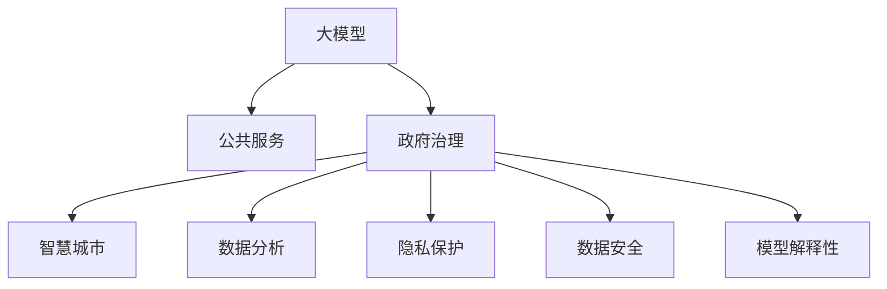

                 

# 大模型技术在政府和公共服务领域的应用

> 关键词：大模型,公共服务,政府治理,智慧城市,数据分析,隐私保护

## 1. 背景介绍

### 1.1 问题由来
近年来，随着人工智能(AI)技术的飞速发展，大模型（Large Model）在政府和公共服务领域的应用引起了广泛的关注。大模型凭借其强大的数据分析和处理能力，能够在医疗、教育、交通、环境、公共安全等多个领域提供高效、精准的决策支持。在数据驱动的治理时代，如何有效利用大模型技术，提升政府和公共服务效能，成为亟待解决的问题。

### 1.2 问题核心关键点
大模型技术在政府和公共服务领域的应用，主要集中在以下几个关键点：
- 数据驱动决策：利用大数据分析技术，辅助政府进行政策制定、资源调配、公共服务优化等。
- 智能辅助治理：通过AI技术，提升公共服务质量，如智能客服、智能监控、灾害预警等。
- 隐私保护与数据安全：在公共服务过程中，如何保护公民的隐私，确保数据安全，是大模型应用过程中必须考虑的重要因素。
- 模型解释性与透明度：确保大模型在决策过程中具备可解释性，提升公共信任度。

### 1.3 问题研究意义
大模型技术在政府和公共服务领域的应用，有助于提升治理效能，推动智能化转型，具体意义如下：
- 提高决策效率：通过大数据分析和智能算法，政府能够快速获取并处理海量数据，优化决策流程，提高治理效率。
- 增强服务质量：AI技术能够提供24/7的公共服务，提升服务响应速度和质量。
- 提升公共信任：大模型的透明性和可解释性，有助于提升公众对政府的信任度。
- 促进数据共享与协同：大模型技术为不同部门之间的数据共享和协同提供了新的工具和平台。

## 2. 核心概念与联系

### 2.1 核心概念概述

为更好地理解大模型在政府和公共服务领域的应用，本节将介绍几个核心概念：

- 大模型（Large Model）：以Transformer架构为代表的大规模预训练语言模型，如BERT、GPT等。通过在海量数据上预训练，学习到丰富的语言知识和结构化信息。
- 公共服务（Public Services）：政府和公共机构向公众提供的各种服务，包括医疗、教育、交通、环境、公共安全等。
- 政府治理（Government Governance）：通过制定和执行政策，管理国家和社会事务，提升公共服务效能。
- 智慧城市（Smart City）：通过信息技术和AI技术，提升城市管理和居民生活质量。
- 数据分析（Data Analytics）：利用大数据分析技术，挖掘和分析海量数据，辅助决策。
- 隐私保护（Privacy Protection）：在数据处理过程中，保护公民隐私，确保数据安全。
- 数据安全（Data Security）：通过加密、访问控制等技术，保障数据在传输和存储过程中的安全。
- 模型解释性（Model Interpretability）：确保AI模型的决策过程可解释，提升公众信任。

这些核心概念之间的逻辑关系可以通过以下Mermaid流程图来展示：



这个流程图展示了大模型技术的核心概念及其之间的关系：

1. 大模型通过预训练学习到丰富的语言知识，能够辅助公共服务领域的多项任务。
2. 政府治理、智慧城市、数据分析等公共服务领域，都受益于大模型的广泛应用。
3. 隐私保护、数据安全、模型解释性等，是大模型应用过程中必须考虑的重要因素。

## 3. 核心算法原理 & 具体操作步骤
### 3.1 算法原理概述

大模型在政府和公共服务领域的应用，通常基于以下算法原理：

- **数据预处理**：收集、清洗、标注数据，构建数据集。
- **模型训练**：利用大模型在标注数据上进行微调，适应特定任务。
- **模型评估**：在测试集上评估模型性能，选择最优模型。
- **模型部署**：将训练好的模型部署到实际应用中，提供公共服务。

### 3.2 算法步骤详解

大模型在公共服务领域的应用，通常包括以下几个关键步骤：

**Step 1: 数据预处理**
- 收集领域相关数据，清洗噪声和异常值，去除无用数据。
- 对数据进行标注，构建训练集、验证集和测试集。

**Step 2: 模型选择与配置**
- 选择适合的大模型架构，如BERT、GPT等。
- 配置模型参数，包括学习率、批量大小、迭代轮数等。

**Step 3: 模型训练**
- 使用GPU/TPU等高性能设备，在大模型上进行微调。
- 在训练集上迭代优化模型参数，最小化损失函数。
- 在验证集上评估模型性能，防止过拟合。

**Step 4: 模型评估**
- 在测试集上评估模型性能，对比训练前后的精度提升。
- 通过F1分数、ROC曲线等指标，综合评估模型效果。

**Step 5: 模型部署**
- 将训练好的模型部署到实际应用中，如政府网站、移动应用等。
- 监控模型性能，收集用户反馈，不断优化模型。

### 3.3 算法优缺点

大模型在公共服务领域的应用，具有以下优点：
1. 高效处理大数据：大模型能够处理大规模数据集，快速提供决策支持。
2. 提升服务质量：AI技术能够提供全天候、高效率的公共服务，提升服务质量。
3. 支持多领域应用：大模型在医疗、教育、交通、环境等多个领域均有应用，提供全面的支持。
4. 促进数据共享：大模型技术为不同部门的数据共享和协同提供了新的工具。

同时，也存在一些局限性：
1. 数据隐私问题：大模型需要大量的标注数据，涉及隐私保护问题。
2. 模型解释性不足：AI模型往往缺乏可解释性，难以解释决策过程。
3. 计算资源需求高：大模型训练和推理需要高性能设备，成本较高。
4. 模型鲁棒性不足：大模型在面对新数据时，可能表现不佳。

### 3.4 算法应用领域

大模型技术在公共服务领域的应用，主要包括以下几个方面：

- **医疗服务**：利用大模型进行疾病预测、健康监测、诊断辅助等。
- **教育服务**：提供个性化学习推荐、智能辅导等。
- **交通管理**：进行交通流量分析、智能交通控制等。
- **环境监测**：进行空气、水质、土壤等环境数据监测与分析。
- **公共安全**：进行犯罪预测、灾害预警、反恐监控等。
- **智慧城市**：提供城市管理、智能服务、公共安全等方面的支持。

此外，大模型技术还可应用于城市规划、农业、公共卫生等多个领域，提供综合性的决策支持。

## 4. 数学模型和公式 & 详细讲解 & 举例说明（备注：数学公式请使用latex格式，latex嵌入文中独立段落使用 $$，段落内使用 $)
### 4.1 数学模型构建

假设政府部门收集了关于交通流量的大规模数据集 $\mathcal{D}=\{(x_i, y_i)\}_{i=1}^N$，其中 $x_i$ 表示某个交通节点在第 $i$ 时刻的流量数据，$y_i$ 表示该节点是否发生交通事故（$y_i=1$ 表示发生交通事故，$y_i=0$ 表示未发生）。

记大模型为 $M_{\theta}$，其中 $\theta$ 为模型参数。目标是通过微调 $M_{\theta}$，使得模型能够在新的交通流量数据上准确预测是否发生交通事故。

定义模型的损失函数为二分类交叉熵损失函数：

$$
\ell(M_{\theta}(x_i),y_i) = -[y_i\log M_{\theta}(x_i) + (1-y_i)\log (1-M_{\theta}(x_i))]
$$

经验风险函数为：

$$
\mathcal{L}(\theta) = \frac{1}{N} \sum_{i=1}^N \ell(M_{\theta}(x_i),y_i)
$$

目标是最小化经验风险，即找到最优参数：

$$
\theta^* = \mathop{\arg\min}_{\theta} \mathcal{L}(\theta)
$$

在实践中，我们通常使用基于梯度的优化算法（如AdamW、SGD等）来近似求解上述最优化问题。设 $\eta$ 为学习率，$\lambda$ 为正则化系数，则参数的更新公式为：

$$
\theta \leftarrow \theta - \eta \nabla_{\theta}\mathcal{L}(\theta) - \eta\lambda\theta
$$

其中 $\nabla_{\theta}\mathcal{L}(\theta)$ 为损失函数对参数 $\theta$ 的梯度，可通过反向传播算法高效计算。

### 4.2 公式推导过程

以下我们以交通流量预测为例，推导交叉熵损失函数及其梯度的计算公式。

假设模型 $M_{\theta}$ 在输入 $x$ 上的输出为 $\hat{y}=M_{\theta}(x) \in [0,1]$，表示样本属于正类的概率。真实标签 $y \in \{0,1\}$。则二分类交叉熵损失函数定义为：

$$
\ell(M_{\theta}(x),y) = -[y\log \hat{y} + (1-y)\log (1-\hat{y})]
$$

将其代入经验风险公式，得：

$$
\mathcal{L}(\theta) = -\frac{1}{N}\sum_{i=1}^N [y_i\log M_{\theta}(x_i)+(1-y_i)\log(1-M_{\theta}(x_i))]
$$

根据链式法则，损失函数对参数 $\theta_k$ 的梯度为：

$$
\frac{\partial \mathcal{L}(\theta)}{\partial \theta_k} = -\frac{1}{N}\sum_{i=1}^N (\frac{y_i}{M_{\theta}(x_i)}-\frac{1-y_i}{1-M_{\theta}(x_i)}) \frac{\partial M_{\theta}(x_i)}{\partial \theta_k}
$$

其中 $\frac{\partial M_{\theta}(x_i)}{\partial \theta_k}$ 可进一步递归展开，利用自动微分技术完成计算。

在得到损失函数的梯度后，即可带入参数更新公式，完成模型的迭代优化。重复上述过程直至收敛，最终得到适应交通流量预测任务的最优模型参数 $\theta^*$。

### 4.3 案例分析与讲解

假设某市政府希望通过大模型预测交通流量，从而优化交通管理策略。具体步骤如下：

**Step 1: 数据预处理**
- 收集城市各交通节点的流量数据，包括时间、地点、天气等。
- 清洗和标注数据，构建训练集、验证集和测试集。

**Step 2: 模型选择与配置**
- 选择适合的大模型，如BERT、GPT等。
- 配置模型参数，包括学习率、批量大小、迭代轮数等。

**Step 3: 模型训练**
- 使用GPU/TPU等高性能设备，在大模型上进行微调。
- 在训练集上迭代优化模型参数，最小化损失函数。
- 在验证集上评估模型性能，防止过拟合。

**Step 4: 模型评估**
- 在测试集上评估模型性能，对比训练前后的精度提升。
- 通过F1分数、ROC曲线等指标，综合评估模型效果。

**Step 5: 模型部署**
- 将训练好的模型部署到政府网站、交通管理系统等。
- 监控模型性能，收集用户反馈，不断优化模型。

## 5. 项目实践：代码实例和详细解释说明
### 5.1 开发环境搭建

在进行大模型在政府和公共服务领域的应用开发前，我们需要准备好开发环境。以下是使用Python进行PyTorch开发的环境配置流程：

1. 安装Anaconda：从官网下载并安装Anaconda，用于创建独立的Python环境。

2. 创建并激活虚拟环境：
```bash
conda create -n pytorch-env python=3.8 
conda activate pytorch-env
```

3. 安装PyTorch：根据CUDA版本，从官网获取对应的安装命令。例如：
```bash
conda install pytorch torchvision torchaudio cudatoolkit=11.1 -c pytorch -c conda-forge
```

4. 安装Transformers库：
```bash
pip install transformers
```

5. 安装各类工具包：
```bash
pip install numpy pandas scikit-learn matplotlib tqdm jupyter notebook ipython
```

完成上述步骤后，即可在`pytorch-env`环境中开始开发实践。

### 5.2 源代码详细实现

下面我们以交通流量预测任务为例，给出使用Transformers库对BERT模型进行微调的PyTorch代码实现。

首先，定义交通流量预测任务的训练集和测试集：

```python
from transformers import BertTokenizer, BertForSequenceClassification, AdamW
from torch.utils.data import Dataset, DataLoader
from torch import nn, optim
import torch

class TrafficFlowDataset(Dataset):
    def __init__(self, X, y):
        self.X = X
        self.y = y
        self.tokenizer = BertTokenizer.from_pretrained('bert-base-uncased')
        self.max_len = 512
        
    def __len__(self):
        return len(self.X)
    
    def __getitem__(self, idx):
        x, y = self.X[idx], self.y[idx]
        
        encoding = self.tokenizer(x, return_tensors='pt', max_length=self.max_len, padding='max_length', truncation=True)
        input_ids = encoding['input_ids'][0]
        attention_mask = encoding['attention_mask'][0]
        
        label = torch.tensor(y, dtype=torch.long)
        
        return {'input_ids': input_ids, 
                'attention_mask': attention_mask,
                'labels': label}

# 定义数据集
X_train = ...
y_train = ...
X_test = ...
y_test = ...

train_dataset = TrafficFlowDataset(X_train, y_train)
test_dataset = TrafficFlowDataset(X_test, y_test)
```

然后，定义模型和优化器：

```python
model = BertForSequenceClassification.from_pretrained('bert-base-uncased', num_labels=2)

optimizer = AdamW(model.parameters(), lr=2e-5)
```

接着，定义训练和评估函数：

```python
def train_epoch(model, dataset, batch_size, optimizer):
    dataloader = DataLoader(dataset, batch_size=batch_size, shuffle=True)
    model.train()
    epoch_loss = 0
    for batch in dataloader:
        input_ids = batch['input_ids'].to(device)
        attention_mask = batch['attention_mask'].to(device)
        labels = batch['labels'].to(device)
        model.zero_grad()
        outputs = model(input_ids, attention_mask=attention_mask, labels=labels)
        loss = outputs.loss
        epoch_loss += loss.item()
        loss.backward()
        optimizer.step()
    return epoch_loss / len(dataloader)

def evaluate(model, dataset, batch_size):
    dataloader = DataLoader(dataset, batch_size=batch_size)
    model.eval()
    preds, labels = [], []
    with torch.no_grad():
        for batch in dataloader:
            input_ids = batch['input_ids'].to(device)
            attention_mask = batch['attention_mask'].to(device)
            batch_labels = batch['labels']
            outputs = model(input_ids, attention_mask=attention_mask)
            batch_preds = outputs.logits.argmax(dim=2).to('cpu').tolist()
            batch_labels = batch_labels.to('cpu').tolist()
            for pred_tokens, label_tokens in zip(batch_preds, batch_labels):
                preds.append(pred_tokens[:len(label_tokens)])
                labels.append(label_tokens)
                
    print(classification_report(labels, preds))
```

最后，启动训练流程并在测试集上评估：

```python
epochs = 5
batch_size = 16

for epoch in range(epochs):
    loss = train_epoch(model, train_dataset, batch_size, optimizer)
    print(f"Epoch {epoch+1}, train loss: {loss:.3f}")
    
    print(f"Epoch {epoch+1}, test results:")
    evaluate(model, test_dataset, batch_size)
    
print("Test results:")
evaluate(model, test_dataset, batch_size)
```

以上就是使用PyTorch对BERT进行交通流量预测任务微调的完整代码实现。可以看到，得益于Transformers库的强大封装，我们可以用相对简洁的代码完成BERT模型的加载和微调。

### 5.3 代码解读与分析

让我们再详细解读一下关键代码的实现细节：

**TrafficFlowDataset类**：
- `__init__`方法：初始化输入、标签、分词器等关键组件。
- `__len__`方法：返回数据集的样本数量。
- `__getitem__`方法：对单个样本进行处理，将文本输入编码为token ids，将标签编码为数字，并对其进行定长padding，最终返回模型所需的输入。

**模型选择与配置**：
- 使用BertForSequenceClassification模型，设置标签数为2，表示交通事故与否。
- 选择AdamW优化器，设置学习率为2e-5。

**训练和评估函数**：
- 使用PyTorch的DataLoader对数据集进行批次化加载，供模型训练和推理使用。
- 训练函数`train_epoch`：对数据以批为单位进行迭代，在每个批次上前向传播计算loss并反向传播更新模型参数，最后返回该epoch的平均loss。
- 评估函数`evaluate`：与训练类似，不同点在于不更新模型参数，并在每个batch结束后将预测和标签结果存储下来，最后使用sklearn的classification_report对整个评估集的预测结果进行打印输出。

**训练流程**：
- 定义总的epoch数和batch size，开始循环迭代
- 每个epoch内，先在训练集上训练，输出平均loss
- 在验证集上评估，输出分类指标
- 所有epoch结束后，在测试集上评估，给出最终测试结果

可以看到，PyTorch配合Transformers库使得BERT微调的代码实现变得简洁高效。开发者可以将更多精力放在数据处理、模型改进等高层逻辑上，而不必过多关注底层的实现细节。

当然，工业级的系统实现还需考虑更多因素，如模型的保存和部署、超参数的自动搜索、更灵活的任务适配层等。但核心的微调范式基本与此类似。

## 6. 实际应用场景
### 6.1 医疗服务

大模型在医疗服务中的应用，主要集中在疾病预测、健康监测、诊断辅助等方面。通过分析海量医疗数据，利用大模型学习疾病的特征和规律，辅助医生进行快速诊断和预测。

具体而言，可以收集医院、诊所、实验室等机构的历史病历、影像、检查报告等数据，构建大规模医疗数据集。在此基础上，对BERT等大模型进行微调，使其能够自动分析病情，预测疾病发展趋势，辅助医生制定治疗方案。

例如，某医院可以利用大模型预测心脏病患者是否会发生心肌梗死，通过早期干预降低死亡率。具体流程如下：

**Step 1: 数据预处理**
- 收集患者的心电图、血压、血液检查等数据，构建训练集、验证集和测试集。
- 清洗和标注数据，去除噪声和异常值。

**Step 2: 模型选择与配置**
- 选择适合的大模型，如BERT、GPT等。
- 配置模型参数，包括学习率、批量大小、迭代轮数等。

**Step 3: 模型训练**
- 使用GPU/TPU等高性能设备，在大模型上进行微调。
- 在训练集上迭代优化模型参数，最小化损失函数。
- 在验证集上评估模型性能，防止过拟合。

**Step 4: 模型评估**
- 在测试集上评估模型性能，对比训练前后的精度提升。
- 通过F1分数、ROC曲线等指标，综合评估模型效果。

**Step 5: 模型部署**
- 将训练好的模型部署到医院管理系统、医生工作站等。
- 监控模型性能，收集医生反馈，不断优化模型。

### 6.2 教育服务

大模型在教育服务中的应用，主要集中在个性化学习推荐、智能辅导等方面。通过分析学生的学习行为和成绩，利用大模型推荐适合的学习资源和路径，提供个性化的学习建议。

具体而言，可以收集学生的学习记录、考试成绩、在线作业等数据，构建大规模教育数据集。在此基础上，对BERT等大模型进行微调，使其能够自动分析学生的学习情况，推荐适合的学习资源，提供个性化的学习建议。

例如，某教育平台可以利用大模型为学生推荐适合的课程和学习资源，通过智能辅导提高学习效果。具体流程如下：

**Step 1: 数据预处理**
- 收集学生的学习记录、考试成绩、在线作业等数据，构建训练集、验证集和测试集。
- 清洗和标注数据，去除噪声和异常值。

**Step 2: 模型选择与配置**
- 选择适合的大模型，如BERT、GPT等。
- 配置模型参数，包括学习率、批量大小、迭代轮数等。

**Step 3: 模型训练**
- 使用GPU/TPU等高性能设备，在大模型上进行微调。
- 在训练集上迭代优化模型参数，最小化损失函数。
- 在验证集上评估模型性能，防止过拟合。

**Step 4: 模型评估**
- 在测试集上评估模型性能，对比训练前后的精度提升。
- 通过F1分数、ROC曲线等指标，综合评估模型效果。

**Step 5: 模型部署**
- 将训练好的模型部署到教育平台、智能辅导系统等。
- 监控模型性能，收集学生反馈，不断优化模型。

### 6.3 交通管理

大模型在交通管理中的应用，主要集中在交通流量预测、智能交通控制等方面。通过分析交通流量数据，利用大模型预测交通情况，辅助交通管理部门优化交通流量。

具体而言，可以收集城市各交通节点的流量数据，包括时间、地点、天气等。在此基础上，对BERT等大模型进行微调，使其能够自动预测交通流量，优化交通管理策略。

例如，某市政府可以利用大模型预测交通流量，从而优化交通管理策略。具体流程如下：

**Step 1: 数据预处理**
- 收集城市各交通节点的流量数据，构建训练集、验证集和测试集。
- 清洗和标注数据，去除噪声和异常值。

**Step 2: 模型选择与配置**
- 选择适合的大模型，如BERT、GPT等。
- 配置模型参数，包括学习率、批量大小、迭代轮数等。

**Step 3: 模型训练**
- 使用GPU/TPU等高性能设备，在大模型上进行微调。
- 在训练集上迭代优化模型参数，最小化损失函数。
- 在验证集上评估模型性能，防止过拟合。

**Step 4: 模型评估**
- 在测试集上评估模型性能，对比训练前后的精度提升。
- 通过F1分数、ROC曲线等指标，综合评估模型效果。

**Step 5: 模型部署**
- 将训练好的模型部署到交通管理系统、城市规划系统等。
- 监控模型性能，收集用户反馈，不断优化模型。

## 7. 工具和资源推荐
### 7.1 学习资源推荐

为了帮助开发者系统掌握大模型在政府和公共服务领域的应用，这里推荐一些优质的学习资源：

1. 《深度学习在公共服务中的应用》系列博文：由大模型技术专家撰写，深入浅出地介绍了深度学习在医疗、教育、交通等多个领域的应用。

2. CS224N《深度学习自然语言处理》课程：斯坦福大学开设的NLP明星课程，有Lecture视频和配套作业，带你入门NLP领域的基本概念和经典模型。

3. 《公共服务中的深度学习》书籍：全面介绍了深度学习在公共服务中的应用，包括医疗、教育、交通等多个领域的实际案例。

4. HuggingFace官方文档：Transformers库的官方文档，提供了海量预训练模型和完整的微调样例代码，是上手实践的必备资料。

5. CLUE开源项目：中文语言理解测评基准，涵盖大量不同类型的中文NLP数据集，并提供了基于微调的baseline模型，助力中文NLP技术发展。

通过对这些资源的学习实践，相信你一定能够快速掌握大模型在公共服务领域的应用，并用于解决实际的NLP问题。
###  7.2 开发工具推荐

高效的开发离不开优秀的工具支持。以下是几款用于大模型在政府和公共服务领域开发常用的工具：

1. PyTorch：基于Python的开源深度学习框架，灵活动态的计算图，适合快速迭代研究。大部分预训练语言模型都有PyTorch版本的实现。

2. TensorFlow：由Google主导开发的开源深度学习框架，生产部署方便，适合大规模工程应用。同样有丰富的预训练语言模型资源。

3. Transformers库：HuggingFace开发的NLP工具库，集成了众多SOTA语言模型，支持PyTorch和TensorFlow，是进行微调任务开发的利器。

4. Weights & Biases：模型训练的实验跟踪工具，可以记录和可视化模型训练过程中的各项指标，方便对比和调优。与主流深度学习框架无缝集成。

5. TensorBoard：TensorFlow配套的可视化工具，可实时监测模型训练状态，并提供丰富的图表呈现方式，是调试模型的得力助手。

6. Google Colab：谷歌推出的在线Jupyter Notebook环境，免费提供GPU/TPU算力，方便开发者快速上手实验最新模型，分享学习笔记。

合理利用这些工具，可以显著提升大模型在公共服务领域的应用效率，加快创新迭代的步伐。

### 7.3 相关论文推荐

大模型在公共服务领域的应用源于学界的持续研究。以下是几篇奠基性的相关论文，推荐阅读：

1. Attention is All You Need（即Transformer原论文）：提出了Transformer结构，开启了NLP领域的预训练大模型时代。

2. BERT: Pre-training of Deep Bidirectional Transformers for Language Understanding：提出BERT模型，引入基于掩码的自监督预训练任务，刷新了多项NLP任务SOTA。

3. Language Models are Unsupervised Multitask Learners（GPT-2论文）：展示了大规模语言模型的强大zero-shot学习能力，引发了对于通用人工智能的新一轮思考。

4. Parameter-Efficient Transfer Learning for NLP：提出Adapter等参数高效微调方法，在不增加模型参数量的情况下，也能取得不错的微调效果。

5. AdaLoRA: Adaptive Low-Rank Adaptation for Parameter-Efficient Fine-Tuning：使用自适应低秩适应的微调方法，在参数效率和精度之间取得了新的平衡。

这些论文代表了大模型在公共服务领域的应用的发展脉络。通过学习这些前沿成果，可以帮助研究者把握学科前进方向，激发更多的创新灵感。

## 8. 总结：未来发展趋势与挑战
### 8.1 总结

本文对大模型在政府和公共服务领域的应用进行了全面系统的介绍。首先阐述了政府和公共服务领域对大模型的需求，明确了大模型技术的应用方向。其次，从原理到实践，详细讲解了大模型在医疗、教育、交通等多个领域的微调过程，给出了具体的代码实现。同时，本文还广泛探讨了大模型在公共服务领域的应用前景，展示了其广阔的想象空间。此外，本文精选了相关学习资源，力求为读者提供全方位的技术指引。

通过本文的系统梳理，可以看到，大模型技术在政府和公共服务领域的应用具有极大的潜力，能够显著提升公共服务效能，推动智能化转型。未来，伴随大模型技术的不断演进，公共服务领域的应用场景将更加丰富，系统部署将更加灵活，用户体验将更加满意。

### 8.2 未来发展趋势

展望未来，大模型在政府和公共服务领域的应用将呈现以下几个发展趋势：

1. **智能化转型加速**：大模型技术将助力政府和公共服务领域实现智能化转型，提高服务效率和质量。
2. **跨领域应用拓展**：大模型在医疗、教育、交通等多个领域的应用将进一步扩展，覆盖更广泛的公共服务场景。
3. **数据驱动决策**：大模型将更加广泛地应用于数据驱动决策，辅助政府进行政策制定、资源调配等。
4. **个性化服务提升**：利用大模型提供个性化服务，提升用户满意度和使用体验。
5. **隐私保护加强**：随着数据隐私保护意识的增强，大模型在应用过程中将更加注重隐私保护。
6. **模型透明性和可解释性**：大模型的透明性和可解释性将成为应用过程中必须考虑的重要因素，提升公众信任度。

### 8.3 面临的挑战

尽管大模型在公共服务领域的应用已经取得了初步成果，但在迈向更加智能化、普适化应用的过程中，仍面临诸多挑战：

1. **数据隐私问题**：大模型需要大量的标注数据，涉及隐私保护问题。如何在保证隐私的同时，获取高质量数据，是一个重要难题。
2. **模型鲁棒性不足**：大模型在面对新数据时，可能表现不佳。如何提高模型的鲁棒性，避免过拟合，还需要更多理论和实践的积累。
3. **计算资源需求高**：大模型训练和推理需要高性能设备，成本较高。如何在保证性能的同时，优化资源使用，降低成本，是一个亟待解决的问题。
4. **模型解释性不足**：AI模型往往缺乏可解释性，难以解释决策过程。如何赋予模型更强的可解释性，提升公众信任度，是一个重要挑战。
5. **模型安全性不足**：大模型可能学习到有害信息，如何确保模型输出的安全性，避免误导性、歧视性的输出，是一个重要课题。

### 8.4 研究展望

面对大模型在公共服务领域的应用所面临的挑战，未来的研究需要在以下几个方面寻求新的突破：

1. **数据隐私保护**：研究如何在保证隐私的前提下，获取高质量数据。例如，利用差分隐私技术，保护数据隐私。
2. **模型鲁棒性提升**：研究如何提高模型的鲁棒性，避免过拟合。例如，引入对抗训练、模型蒸馏等技术。
3. **计算资源优化**：研究如何优化模型训练和推理的计算资源使用，降低成本。例如，采用分布式训练、模型压缩等技术。
4. **模型解释性提升**：研究如何提升模型的可解释性，增强公众信任度。例如，利用符号推理、模型可视化等技术。
5. **模型安全性保障**：研究如何确保模型输出的安全性，避免误导性、歧视性的输出。例如，引入模型监控、异常检测等技术。

这些研究方向将进一步推动大模型在公共服务领域的应用，提升服务效能，推动智能化转型，为构建安全、可靠、智能的政府和公共服务体系提供技术保障。相信随着学界和产业界的共同努力，大模型在政府和公共服务领域的应用前景将更加广阔，为社会带来更大的价值。

## 9. 附录：常见问题与解答

**Q1：大模型在政府和公共服务领域的应用是否会涉及隐私保护问题？**

A: 是的。大模型需要大量的标注数据，涉及隐私保护问题。例如，医疗领域的病历数据，教育领域的学生的学习记录等，都属于敏感数据，需要严格保护。

**Q2：如何在保证隐私的前提下，获取高质量的数据？**

A: 可以利用差分隐私技术，通过数据扰动和隐私保护，在不泄露个人信息的前提下，获取高质量数据。同时，可以采用数据匿名化、数据加密等技术，保护数据的隐私性。

**Q3：大模型在公共服务领域的应用是否会涉及数据安全问题？**

A: 是的。大模型在应用过程中，需要处理大量的敏感数据，数据安全问题不容忽视。例如，医疗数据、金融数据等，一旦泄露，可能带来严重的后果。

**Q4：如何确保大模型输出的安全性，避免误导性、歧视性的输出？**

A: 可以利用模型监控、异常检测等技术，确保模型输出的安全性。例如，对模型的输出进行审查，发现异常情况时及时报警或处理。

**Q5：如何提升大模型的可解释性，增强公众信任度？**

A: 可以采用符号推理、模型可视化等技术，提升模型的可解释性。例如，利用自然语言解释模型输出的原因，帮助公众理解模型决策过程。

**Q6：大模型在公共服务领域的应用是否会涉及计算资源问题？**

A: 是的。大模型训练和推理需要高性能设备，成本较高。如何优化资源使用，降低成本，是一个亟待解决的问题。

**Q7：如何在保证性能的同时，优化模型训练和推理的计算资源使用？**

A: 可以采用分布式训练、模型压缩等技术，优化计算资源使用。例如，利用分布式计算，加速模型训练；利用模型压缩，减小模型规模，降低推理开销。

通过这些措施，可以在保证性能的同时，优化资源使用，降低成本，提升大模型在公共服务领域的应用效果。

---

作者：禅与计算机程序设计艺术 / Zen and the Art of Computer Programming

