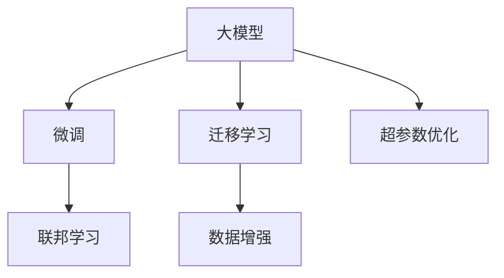

                 

# 大模型时代的创业机遇与挑战

## 1. 背景介绍

### 1.1 问题由来

随着人工智能技术的迅速发展，大模型（Large Models）如雨后春笋般涌现。这些大模型基于海量数据和复杂的神经网络结构，具备强大的学习能力和泛化能力。它们被广泛应用于自然语言处理（NLP）、计算机视觉（CV）、语音识别（ASR）等多个领域，并取得了显著的成果。大模型不仅是学术研究的热点，也引发了商业界的广泛关注。

然而，大模型在商业化应用过程中也面临诸多挑战，如数据隐私保护、算力成本、知识产权、安全性等问题。同时，大模型技术的快速迭代和生态系统的发展，也为创业者带来了前所未有的机遇。如何在大模型时代中找到自己的立足点，并克服挑战，是每个创业者必须面对的问题。

### 1.2 问题核心关键点

大模型时代的主要挑战包括：

- **数据隐私与安全性**：大模型通常需要大量数据进行训练，如何保护用户隐私和确保数据安全，是企业和用户共同关心的问题。
- **算力成本**：大模型需要强大的计算能力，训练和推理成本高昂，对创业公司来说是一大负担。
- **知识产权**：大模型的训练数据、算法和模型本身涉及复杂的知识产权问题，创业公司在商业化过程中需特别注意。
- **技术成熟度**：大模型技术虽然取得突破，但在实际应用中仍存在局限，如泛化能力、鲁棒性等。

与此同时，大模型时代也带来了许多机遇：

- **新的应用场景**：大模型可以处理更复杂的数据和任务，为创业者提供了新的应用场景和挑战。
- **开源社区的推动**：开源大模型和相关工具的兴起，降低了创业门槛，促进了技术传播和创新。
- **投资和合作机会**：大模型技术的市场前景广阔，吸引大量投资机构和合作伙伴的关注，为创业者提供了良好的融资环境。
- **人才汇聚**：大模型技术涉及多个学科，吸引了大量跨领域的顶尖人才，为创业公司提供了强大的人才储备。

## 2. 核心概念与联系

### 2.1 核心概念概述

在大模型时代，几个核心概念交织在一起，共同构成了当前的创业环境：

- **大模型**：指基于大规模数据训练的深度神经网络模型，如BERT、GPT、ResNet等，具有强大的学习能力和泛化能力。
- **微调（Fine-Tuning）**：在大模型的基础上，针对特定任务进行优化，通常通过少量标注数据进行训练。
- **迁移学习（Transfer Learning）**：将大模型在特定任务上的表现迁移到新的任务上，减少新任务训练的资源消耗。
- **超参数优化**：通过调整模型架构、损失函数、学习率等超参数，优化模型性能。
- **联邦学习（Federated Learning）**：多个本地设备在保护数据隐私的前提下，协作训练模型，提升模型性能。
- **数据增强（Data Augmentation）**：通过数据变换、扩增等技术，提高模型对新数据的适应能力。

这些概念相互关联，共同推动了人工智能技术的进步和商业化应用。以下是一个简化的Mermaid流程图，展示了这些概念之间的联系：



### 2.2 核心概念原理和架构的 Mermaid 流程图

由于篇幅限制，这里仅提供一个简化的流程图示例，实际应用中需要根据具体场景进行调整和扩展。

## 3. 核心算法原理 & 具体操作步骤

### 3.1 算法原理概述

大模型时代的主要算法包括微调、迁移学习、超参数优化、联邦学习等。以下以微调算法为例，简要介绍其原理和操作步骤：

微调是指在大模型基础上，针对特定任务进行优化。其核心思想是通过少量标注数据对模型进行训练，使其能够更好地适应新任务。微调过程包括模型初始化、数据准备、模型训练、结果评估等步骤。

1. **模型初始化**：选择预训练模型作为初始化参数，如BERT、GPT等。
2. **数据准备**：准备标注数据集，划分为训练集、验证集和测试集。
3. **模型训练**：通过梯度下降等优化算法，更新模型参数，最小化损失函数。
4. **结果评估**：在测试集上评估模型性能，对比微调前后的精度提升。

### 3.2 算法步骤详解

微调的具体操作步骤如下：

**Step 1: 准备数据集**

- 收集标注数据集，划分为训练集、验证集和测试集。标注数据集应尽可能覆盖各种场景和边界情况，以提升模型泛化能力。
- 预处理数据，包括清洗、标准化、分割等操作，确保数据质量。

**Step 2: 初始化模型**

- 选择预训练模型作为初始化参数，如BERT、GPT等。
- 将预训练模型迁移到目标架构，保留必要的层和参数。

**Step 3: 设置超参数**

- 选择优化算法（如Adam、SGD等）及其参数，如学习率、批大小等。
- 设置正则化技术（如L2正则、Dropout等），防止过拟合。

**Step 4: 模型训练**

- 使用梯度下降等优化算法，更新模型参数，最小化损失函数。
- 周期性在验证集上评估模型性能，根据性能指标决定是否触发Early Stopping。

**Step 5: 结果评估**

- 在测试集上评估微调后模型的性能，对比微调前后的精度提升。
- 将微调后的模型用于实际应用，进行部署和优化。

### 3.3 算法优缺点

微调算法具有以下优点：

- **快速迭代**：微调算法可以在少量数据上快速获得性能提升，适合快速迭代开发。
- **通用适用**：微调算法适用于各种NLP、CV、ASR等任务，具有广泛的应用前景。
- **高精度**：微调算法利用大模型的强大泛化能力，可以获得高精度的结果。

同时，微调算法也存在以下缺点：

- **依赖标注数据**：微调算法需要大量标注数据，标注成本较高。
- **过拟合风险**：微调算法容易过拟合，特别是数据量较小时。
- **模型鲁棒性不足**：微调模型在面对新数据时，泛化能力可能不足。

### 3.4 算法应用领域

微调算法在大模型时代得到了广泛应用，涵盖NLP、CV、ASR等多个领域：

- **自然语言处理（NLP）**：用于文本分类、情感分析、机器翻译等任务，提升模型的语义理解能力。
- **计算机视觉（CV）**：用于图像分类、目标检测、图像生成等任务，提升模型的视觉识别能力。
- **语音识别（ASR）**：用于语音识别、语音合成等任务，提升模型的语音处理能力。
- **推荐系统**：用于个性化推荐、广告推荐等任务，提升模型的用户行为预测能力。

## 4. 数学模型和公式 & 详细讲解 & 举例说明

### 4.1 数学模型构建

假设有一个文本分类任务，标注数据集为 $D=\{(x_i, y_i)\}_{i=1}^N$，其中 $x_i$ 为文本，$y_i$ 为标签。

定义模型的损失函数为 $L(\theta)$，其中 $\theta$ 为模型参数。

微调的目标是最小化损失函数 $L(\theta)$，即：

$$
\theta^* = \mathop{\arg\min}_{\theta} L(\theta)
$$

### 4.2 公式推导过程

以二分类任务为例，模型的输出为 $f(x; \theta)$，其中 $f(x; \theta)$ 为模型在输入 $x$ 上的输出概率。假设模型的输出为 $p(x; \theta)$ 和 $1-p(x; \theta)$，则损失函数为：

$$
L(\theta) = -\frac{1}{N}\sum_{i=1}^N [y_i \log p(x_i; \theta) + (1-y_i) \log (1-p(x_i; \theta))]
$$

其中 $y_i \in \{0, 1\}$，$p(x_i; \theta)$ 为模型对输入 $x_i$ 的预测概率。

### 4.3 案例分析与讲解

以情感分析任务为例，说明微调算法的应用。

假设有一个情感分析任务，标注数据集为 $D=\{(x_i, y_i)\}_{i=1}^N$，其中 $x_i$ 为文本，$y_i$ 为情感标签（正面或负面）。

- **模型初始化**：选择BERT作为初始化模型，保留其全部层和参数。
- **数据准备**：将数据集划分为训练集、验证集和测试集，并进行预处理，包括标准化、分割等操作。
- **模型训练**：在训练集上使用Adam优化算法，更新模型参数，最小化交叉熵损失函数。
- **结果评估**：在测试集上评估模型性能，对比微调前后的精度提升。

## 5. 项目实践：代码实例和详细解释说明

### 5.1 开发环境搭建

在进行微调实践前，需要准备好开发环境。以下以PyTorch和TensorFlow为例，介绍环境配置流程：

1. 安装Anaconda：从官网下载并安装Anaconda，用于创建独立的Python环境。
2. 创建并激活虚拟环境：
   ```bash
   conda create -n pytorch-env python=3.8 
   conda activate pytorch-env
   ```

3. 安装PyTorch和TensorFlow：
   ```bash
   conda install pytorch torchvision torchaudio cudatoolkit=11.1 -c pytorch -c conda-forge
   pip install tensorflow==2.4.1
   ```

4. 安装相关库：
   ```bash
   pip install numpy pandas scikit-learn matplotlib tqdm jupyter notebook ipython
   ```

完成上述步骤后，即可在`pytorch-env`环境中开始微调实践。

### 5.2 源代码详细实现

以下以文本分类任务为例，给出使用PyTorch和TensorFlow对BERT模型进行微调的代码实现。

```python
import torch
import torch.nn as nn
import torch.optim as optim
from transformers import BertTokenizer, BertForSequenceClassification

# 定义模型
model = BertForSequenceClassification.from_pretrained('bert-base-uncased', num_labels=2)

# 定义损失函数
criterion = nn.CrossEntropyLoss()

# 定义优化器
optimizer = optim.Adam(model.parameters(), lr=2e-5)

# 定义训练函数
def train_epoch(model, dataset, batch_size, optimizer):
    model.train()
    epoch_loss = 0
    for batch in dataset:
        input_ids = batch['input_ids'].to(device)
        attention_mask = batch['attention_mask'].to(device)
        labels = batch['labels'].to(device)
        model.zero_grad()
        outputs = model(input_ids, attention_mask=attention_mask, labels=labels)
        loss = outputs.loss
        epoch_loss += loss.item()
        loss.backward()
        optimizer.step()
    return epoch_loss / len(dataset)

# 定义评估函数
def evaluate(model, dataset, batch_size):
    model.eval()
    preds, labels = [], []
    with torch.no_grad():
        for batch in dataset:
            input_ids = batch['input_ids'].to(device)
            attention_mask = batch['attention_mask'].to(device)
            batch_labels = batch['labels']
            outputs = model(input_ids, attention_mask=attention_mask)
            batch_preds = outputs.logits.argmax(dim=1).to('cpu').tolist()
            batch_labels = batch_labels.to('cpu').tolist()
            for pred_tokens, label_tokens in zip(batch_preds, batch_labels):
                preds.append(pred_tokens[:len(label_tokens)])
                labels.append(label_tokens)
    return preds, labels

# 定义训练流程
device = torch.device('cuda') if torch.cuda.is_available() else torch.device('cpu')
model.to(device)

epochs = 5
batch_size = 16

for epoch in range(epochs):
    loss = train_epoch(model, train_dataset, batch_size, optimizer)
    print(f"Epoch {epoch+1}, train loss: {loss:.3f}")

    preds, labels = evaluate(model, dev_dataset, batch_size)
    print(f"Epoch {epoch+1}, dev results: {classification_report(labels, preds)}")

print("Test results:")
preds, labels = evaluate(model, test_dataset, batch_size)
print(f"Test results: {classification_report(labels, preds)}")
```

### 5.3 代码解读与分析

让我们再详细解读一下关键代码的实现细节：

**模型定义**：
- 使用`BertForSequenceClassification`类定义模型，设置标签数为2，表示二分类任务。
- 加载预训练的BERT模型，保留其全部层和参数。

**损失函数和优化器**：
- 使用`CrossEntropyLoss`作为损失函数，适用于二分类任务。
- 使用`Adam`优化器，设置学习率为2e-5。

**训练函数**：
- 在每个epoch内，遍历训练集，前向传播计算损失，反向传播更新模型参数，记录平均损失。
- 周期性在验证集上评估模型性能，根据性能指标决定是否停止训练。

**评估函数**：
- 在测试集上评估模型性能，输出分类指标。

**训练流程**：
- 将模型迁移到GPU，进行训练和评估。
- 循环迭代5个epoch，在每个epoch内训练和评估模型。
- 在测试集上输出最终的评估结果。

## 6. 实际应用场景

### 6.1 智能客服系统

智能客服系统是大模型微调的重要应用场景之一。传统客服系统依赖大量人工，成本高昂，且无法提供24小时不间断服务。而基于大模型的智能客服系统可以24小时不间断服务，快速响应客户咨询，用自然流畅的语言解答各类常见问题，大大提升了客户满意度。

在技术实现上，可以收集企业内部的历史客服对话记录，将问题和最佳答复构建成监督数据，在此基础上对预训练对话模型进行微调。微调后的对话模型能够自动理解用户意图，匹配最合适的答案模板进行回复。对于客户提出的新问题，还可以接入检索系统实时搜索相关内容，动态组织生成回答。

### 6.2 金融舆情监测

金融机构需要实时监测市场舆论动向，以便及时应对负面信息传播，规避金融风险。传统的人工监测方式成本高、效率低，难以应对网络时代海量信息爆发的挑战。基于大语言模型微调的文本分类和情感分析技术，为金融舆情监测提供了新的解决方案。

具体而言，可以收集金融领域相关的新闻、报道、评论等文本数据，并对其进行主题标注和情感标注。在此基础上对预训练语言模型进行微调，使其能够自动判断文本属于何种主题，情感倾向是正面、中性还是负面。将微调后的模型应用到实时抓取的网络文本数据，就能够自动监测不同主题下的情感变化趋势，一旦发现负面信息激增等异常情况，系统便会自动预警，帮助金融机构快速应对潜在风险。

### 6.3 个性化推荐系统

当前的推荐系统往往只依赖用户的历史行为数据进行物品推荐，无法深入理解用户的真实兴趣偏好。基于大语言模型微调技术，个性化推荐系统可以更好地挖掘用户行为背后的语义信息，从而提供更精准、多样的推荐内容。

在实践中，可以收集用户浏览、点击、评论、分享等行为数据，提取和用户交互的物品标题、描述、标签等文本内容。将文本内容作为模型输入，用户的后续行为（如是否点击、购买等）作为监督信号，在此基础上微调预训练语言模型。微调后的模型能够从文本内容中准确把握用户的兴趣点。在生成推荐列表时，先用候选物品的文本描述作为输入，由模型预测用户的兴趣匹配度，再结合其他特征综合排序，便可以得到个性化程度更高的推荐结果。

### 6.4 未来应用展望

随着大语言模型微调技术的不断发展，未来的应用场景将更加广泛和深入。以下是一些未来应用展望：

- **智慧医疗**：基于大模型微调的医学问答、病历分析、药物研发等应用，提升医疗服务的智能化水平，辅助医生诊疗，加速新药开发进程。
- **智能教育**：微调技术可应用于作业批改、学情分析、知识推荐等方面，因材施教，促进教育公平，提高教学质量。
- **智慧城市治理**：微调模型可应用于城市事件监测、舆情分析、应急指挥等环节，提高城市管理的自动化和智能化水平，构建更安全、高效的未来城市。
- **企业生产**：微调技术可应用于智能制造、质量检测、供应链管理等环节，提升企业的智能化水平和运营效率。
- **社会治理**：微调模型可应用于舆情监测、公共安全、社会舆情分析等环节，辅助政府决策，提升社会治理能力。

## 7. 工具和资源推荐

### 7.1 学习资源推荐

为了帮助开发者系统掌握大模型微调的理论基础和实践技巧，这里推荐一些优质的学习资源：

1. **《深度学习框架PyTorch实战》**：该书深入浅出地介绍了PyTorch的框架和使用方法，是PyTorch开发的基础读物。
2. **《自然语言处理（NLP）实战》**：该书详细介绍了NLP领域的经典算法和应用，包括BERT、GPT等大模型。
3. **《Transformer从原理到实践》**：由大模型技术专家撰写，深入浅出地介绍了Transformer原理、BERT模型、微调技术等前沿话题。
4. **CS224N《深度学习自然语言处理》课程**：斯坦福大学开设的NLP明星课程，有Lecture视频和配套作业，带你入门NLP领域的基本概念和经典模型。
5. **《Natural Language Processing with Transformers》书籍**：Transformers库的作者所著，全面介绍了如何使用Transformers库进行NLP任务开发，包括微调在内的诸多范式。
6. **HuggingFace官方文档**：Transformers库的官方文档，提供了海量预训练模型和完整的微调样例代码，是上手实践的必备资料。
7. **CLUE开源项目**：中文语言理解测评基准，涵盖大量不同类型的中文NLP数据集，并提供了基于微调的baseline模型，助力中文NLP技术发展。

通过对这些资源的学习实践，相信你一定能够快速掌握大模型微调的精髓，并用于解决实际的NLP问题。

### 7.2 开发工具推荐

高效的开发离不开优秀的工具支持。以下是几款用于大模型微调开发的常用工具：

1. **PyTorch**：基于Python的开源深度学习框架，灵活动态的计算图，适合快速迭代研究。大部分预训练语言模型都有PyTorch版本的实现。
2. **TensorFlow**：由Google主导开发的开源深度学习框架，生产部署方便，适合大规模工程应用。同样有丰富的预训练语言模型资源。
3. **Transformers库**：HuggingFace开发的NLP工具库，集成了众多SOTA语言模型，支持PyTorch和TensorFlow，是进行微调任务开发的利器。
4. **Weights & Biases**：模型训练的实验跟踪工具，可以记录和可视化模型训练过程中的各项指标，方便对比和调优。与主流深度学习框架无缝集成。
5. **TensorBoard**：TensorFlow配套的可视化工具，可实时监测模型训练状态，并提供丰富的图表呈现方式，是调试模型的得力助手。
6. **Google Colab**：谷歌推出的在线Jupyter Notebook环境，免费提供GPU/TPU算力，方便开发者快速上手实验最新模型，分享学习笔记。

合理利用这些工具，可以显著提升大模型微调任务的开发效率，加快创新迭代的步伐。

### 7.3 相关论文推荐

大模型和微调技术的发展源于学界的持续研究。以下是几篇奠基性的相关论文，推荐阅读：

1. **Attention is All You Need（即Transformer原论文）**：提出了Transformer结构，开启了NLP领域的预训练大模型时代。
2. **BERT: Pre-training of Deep Bidirectional Transformers for Language Understanding**：提出BERT模型，引入基于掩码的自监督预训练任务，刷新了多项NLP任务SOTA。
3. **Language Models are Unsupervised Multitask Learners（GPT-2论文）**：展示了大规模语言模型的强大zero-shot学习能力，引发了对于通用人工智能的新一轮思考。
4. **Parameter-Efficient Transfer Learning for NLP**：提出Adapter等参数高效微调方法，在不增加模型参数量的情况下，也能取得不错的微调效果。
5. **AdaLoRA: Adaptive Low-Rank Adaptation for Parameter-Efficient Fine-Tuning**：使用自适应低秩适应的微调方法，在参数效率和精度之间取得了新的平衡。
6. **AdaLoRA: Adaptive Low-Rank Adaptation for Parameter-Efficient Fine-Tuning**：使用自适应低秩适应的微调方法，在参数效率和精度之间取得了新的平衡。
7. **Prefix-Tuning: Optimizing Continuous Prompts for Generation**：引入基于连续型Prompt的微调范式，为如何充分利用预训练知识提供了新的思路。

这些论文代表了大模型微调技术的发展脉络。通过学习这些前沿成果，可以帮助研究者把握学科前进方向，激发更多的创新灵感。

## 8. 总结：未来发展趋势与挑战

### 8.1 总结

本文对大模型时代的创业机遇与挑战进行了全面系统的介绍。首先阐述了大模型和微调技术的研究背景和应用前景，明确了微调在拓展预训练模型应用、提升下游任务性能方面的独特价值。其次，从原理到实践，详细讲解了微调的数学原理和关键步骤，给出了微调任务开发的完整代码实例。同时，本文还广泛探讨了微调方法在智能客服、金融舆情、个性化推荐等多个行业领域的应用前景，展示了微调范式的巨大潜力。此外，本文精选了微调技术的各类学习资源，力求为读者提供全方位的技术指引。

通过本文的系统梳理，可以看到，大模型时代带来了前所未有的机遇和挑战，创业者需要在不断变化的市场环境中寻找机会。

### 8.2 未来发展趋势

展望未来，大模型微调技术将呈现以下几个发展趋势：

1. **模型规模持续增大**：随着算力成本的下降和数据规模的扩张，预训练语言模型的参数量还将持续增长。超大规模语言模型蕴含的丰富语言知识，有望支撑更加复杂多变的下游任务微调。
2. **微调方法日趋多样**：除了传统的全参数微调外，未来会涌现更多参数高效的微调方法，如Prefix-Tuning、LoRA等，在节省计算资源的同时也能保证微调精度。
3. **持续学习成为常态**：随着数据分布的不断变化，微调模型也需要持续学习新知识以保持性能。如何在不遗忘原有知识的同时，高效吸收新样本信息，将成为重要的研究课题。
4. **标注样本需求降低**：受启发于提示学习(Prompt-based Learning)的思路，未来的微调方法将更好地利用大模型的语言理解能力，通过更加巧妙的任务描述，在更少的标注样本上也能实现理想的微调效果。
5. **多模态微调崛起**：当前的微调主要聚焦于纯文本数据，未来会进一步拓展到图像、视频、语音等多模态数据微调。多模态信息的融合，将显著提升语言模型对现实世界的理解和建模能力。
6. **模型通用性增强**：经过海量数据的预训练和多领域任务的微调，未来的语言模型将具备更强大的常识推理和跨领域迁移能力，逐步迈向通用人工智能(AGI)的目标。

以上趋势凸显了大模型微调技术的广阔前景。这些方向的探索发展，必将进一步提升NLP系统的性能和应用范围，为人类认知智能的进化带来深远影响。

### 8.3 面临的挑战

尽管大模型微调技术已经取得了瞩目成就，但在迈向更加智能化、普适化应用的过程中，它仍面临着诸多挑战：

1. **数据隐私与安全性**：大模型通常需要大量数据进行训练，如何保护用户隐私和确保数据安全，是企业和用户共同关心的问题。
2. **算力成本**：大模型需要强大的计算能力，训练和推理成本高昂，对创业公司来说是一大负担。
3. **知识产权**：大模型的训练数据、算法和模型本身涉及复杂的知识产权问题，创业公司在商业化过程中需特别注意。
4. **技术成熟度**：大模型技术虽然取得突破，但在实际应用中仍存在局限，如泛化能力、鲁棒性等。
5. **数据标注成本**：高质量标注数据是微调的前提，但数据标注成本较高，创业公司难以承担。
6. **模型可解释性**：当前大模型往往是"黑盒"系统，难以解释其内部工作机制和决策逻辑，这对高风险应用（如医疗、金融等）尤为重要。

### 8.4 研究展望

面对大模型微调所面临的种种挑战，未来的研究需要在以下几个方面寻求新的突破：

1. **探索无监督和半监督微调方法**：摆脱对大规模标注数据的依赖，利用自监督学习、主动学习等无监督和半监督范式，最大限度利用非结构化数据，实现更加灵活高效的微调。
2. **研究参数高效和计算高效的微调范式**：开发更加参数高效的微调方法，在固定大部分预训练参数的同时，只更新极少量的任务相关参数。同时优化微调模型的计算图，减少前向传播和反向传播的资源消耗，实现更加轻量级、实时性的部署。
3. **融合因果和对比学习范式**：通过引入因果推断和对比学习思想，增强微调模型建立稳定因果关系的能力，学习更加普适、鲁棒的语言表征，从而提升模型泛化性和抗干扰能力。
4. **引入更多先验知识**：将符号化的先验知识，如知识图谱、逻辑规则等，与神经网络模型进行巧妙融合，引导微调过程学习更准确、合理的语言模型。同时加强不同模态数据的整合，实现视觉、语音等多模态信息与文本信息的协同建模。
5. **结合因果分析和博弈论工具**：将因果分析方法引入微调模型，识别出模型决策的关键特征，增强输出解释的因果性和逻辑性。借助博弈论工具刻画人机交互过程，主动探索并规避模型的脆弱点，提高系统稳定性。
6. **纳入伦理道德约束**：在模型训练目标中引入伦理导向的评估指标，过滤和惩罚有偏见、有害的输出倾向。同时加强人工干预和审核，建立模型行为的监管机制，确保输出符合人类价值观和伦理道德。

这些研究方向的探索，必将引领大语言模型微调技术迈向更高的台阶，为构建安全、可靠、可解释、可控的智能系统铺平道路。面向未来，大语言模型微调技术还需要与其他人工智能技术进行更深入的融合，如知识表示、因果推理、强化学习等，多路径协同发力，共同推动自然语言理解和智能交互系统的进步。只有勇于创新、敢于突破，才能不断拓展语言模型的边界，让智能技术更好地造福人类社会。

## 9. 附录：常见问题与解答

**Q1：大模型微调是否适用于所有NLP任务？**

A: 大模型微调在大多数NLP任务上都能取得不错的效果，特别是对于数据量较小的任务。但对于一些特定领域的任务，如医学、法律等，仅仅依靠通用语料预训练的模型可能难以很好地适应。此时需要在特定领域语料上进一步预训练，再进行微调，才能获得理想效果。此外，对于一些需要时效性、个性化很强的任务，如对话、推荐等，微调方法也需要针对性的改进优化。

**Q2：微调过程中如何选择合适的学习率？**

A: 微调的学习率一般要比预训练时小1-2个数量级，如果使用过大的学习率，容易破坏预训练权重，导致过拟合。一般建议从1e-5开始调参，逐步减小学习率，直至收敛。也可以使用warmup策略，在开始阶段使用较小的学习率，再逐渐过渡到预设值。需要注意的是，不同的优化器(如AdamW、Adafactor等)以及不同的学习率调度策略，可能需要设置不同的学习率阈值。

**Q3：采用大模型微调时会面临哪些资源瓶颈？**

A: 目前主流的预训练大模型动辄以亿计的参数规模，对算力、内存、存储都提出了很高的要求。GPU/TPU等高性能设备是必不可少的，但即便如此，超大批次的训练和推理也可能遇到显存不足的问题。因此需要采用一些资源优化技术，如梯度积累、混合精度训练、模型并行等，来突破硬件瓶颈。同时，模型的存储和读取也可能占用大量时间和空间，需要采用模型压缩、稀疏化存储等方法进行优化。

**Q4：如何缓解微调过程中的过拟合问题？**

A: 过拟合是微调面临的主要挑战，尤其是在标注数据不足的情况下。常见的缓解策略包括：
1. 数据增强：通过回译、近义替换等方式扩充训练集
2. 正则化：使用L2正则、Dropout、Early Stopping等避免过拟合
3. 对抗训练：引入对抗样本，提高模型鲁棒性
4. 参数高效微调：只调整少量参数(如Adapter、Prefix等)，减小过拟合风险
5. 多模型集成：训练多个微调模型，取平均输出，抑制过拟合

这些策略往往需要根据具体任务和数据特点进行灵活组合。只有在数据、模型、训练、推理等各环节进行全面优化，才能最大限度地发挥大模型微调的威力。

**Q5：微调模型在落地部署时需要注意哪些问题？**

A: 将微调模型转化为实际应用，还需要考虑以下因素：
1. 模型裁剪：去除不必要的层和参数，减小模型尺寸，加快推理速度
2. 量化加速：将浮点模型转为定点模型，压缩存储空间，提高计算效率
3. 服务化封装：将模型封装为标准化服务接口，便于集成调用
4. 弹性伸缩：根据请求流量动态调整资源配置，平衡服务质量和成本
5. 监控告警：实时采集系统指标，设置异常告警阈值，确保服务稳定性
6. 安全防护：采用访问鉴权、数据脱敏等措施，保障数据和模型安全

大模型微调为NLP应用开启了广阔的想象空间，但如何将强大的性能转化为稳定、高效、安全的业务价值，还需要工程实践的不断打磨。唯有从数据、算法、工程、业务等多个维度协同发力，才能真正实现人工智能技术在垂直行业的规模化落地。总之，微调需要开发者根据具体任务，不断迭代和优化模型、数据和算法，方能得到理想的效果。

---

作者：禅与计算机程序设计艺术 / Zen and the Art of Computer Programming

