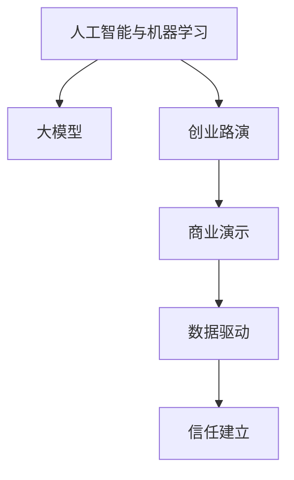

                 

# 大模型时代的创业者创业路演技巧：故事、数据与演示

> 关键词：人工智能创业、创业路演、商业演示、大模型、商业战略、数据驱动、技术创新、行业应用

## 1. 背景介绍

### 1.1 问题由来
在当今人工智能(AI)和机器学习(ML)技术快速发展的时代，大模型、深度学习和自动化的趋势正在改变全球各行业的面貌。随着AI技术的不断成熟，越来越多的创业者开始考虑将大模型应用到实际业务中，并试图通过创业路演来展示其技术创新和商业价值。

大模型通常指的是具有巨大参数规模的神经网络模型，如OpenAI的GPT系列、Google的BERT等，这些模型在自然语言处理(NLP)、计算机视觉(CV)、语音识别(SR)等领域表现出色，拥有广泛的应用前景。

然而，对于创业者而言，使用大模型并将其有效转化为商业机会，是一项颇具挑战性的任务。一方面，需要解释大模型的工作原理和技术优势；另一方面，还须展示这些技术如何转化为实际产品和服务。此外，还需要通过创意、故事和数据来说服投资者和市场。

本博客旨在分享一套实用的路演技巧，帮助创业者通过生动的故事、详实的数据和出色的演示，成功吸引投资者的注意，并获得市场认可。

## 2. 核心概念与联系

### 2.1 核心概念概述

为了更深入理解大模型在创业路演中的作用，我们首先介绍几个关键概念：

- **人工智能与机器学习**：利用算法和大模型处理、分析、理解数据的技术。
- **大模型**：如GPT-3、BERT等，具有巨大的参数量，能学习到丰富的知识，具有广泛的应用潜力。
- **创业路演**：创业团队向潜在投资者、合作伙伴或客户展示其商业模式、产品功能和市场前景的演示过程。
- **商业演示**：利用数据和可视化工具展示产品或技术优势，增强演示的说服力和吸引力。
- **数据驱动**：通过实际数据证明产品或技术的有效性，建立投资者和市场的信任。

这些概念共同构成了创业路演的核心框架，帮助创业者将大模型转化为实际的商业价值。

### 2.2 核心概念原理和架构的 Mermaid 流程图

以下是这些核心概念间的关系的Mermaid流程图：



## 3. 核心算法原理 & 具体操作步骤

### 3.1 算法原理概述

在创业路演中，使用大模型的核心在于展示其强大的数据处理能力和泛化性能。大模型通过在大规模数据上进行训练，学习到了丰富的语言、视觉或音频知识，能够从海量数据中提取出有价值的特征，并在特定任务中表现出色。

路演时应重点展示大模型在以下三个方面的优势：

- **数据处理能力**：大模型能够在短时间内处理大量数据，从中提取有用信息。
- **泛化性能**：大模型在未见过的数据上表现出色，能够进行有效的预测和推断。
- **技术创新**：大模型代表最前沿的技术趋势，如Transformer结构、自监督学习等。

### 3.2 算法步骤详解

创业路演中的大模型展示步骤如下：

**Step 1: 准备大模型和数据集**
- 选择合适的预训练模型，如BERT、GPT-3等。
- 收集并标注相应领域的数据集，准备用于演示和测试。

**Step 2: 选择合适的演示框架**
- 根据不同场景，选择适合的框架，如TensorFlow、PyTorch或Jupyter Notebook。
- 准备数据可视化工具，如Tableau或PowerBI，用于展示模型效果。

**Step 3: 展示大模型的技术优势**
- 通过简单的演示代码展示模型的基础原理。
- 使用图表和曲线展示模型在不同数据集上的表现。

**Step 4: 展示实际应用案例**
- 准备几个真实的案例，展示模型在实际场景中的应用。
- 提供案例分析，解释模型如何有效解决问题。

**Step 5: 演示和互动**
- 使用互动环节，如Q&A、现场演示，增强路演效果。
- 提供详细的代码和报告，以便听众进一步了解和复现。

### 3.3 算法优缺点

使用大模型的优点包括：

- **数据处理能力强**：大模型能够在短时间内处理大量数据，从海量数据中提取有用信息。
- **泛化性能好**：大模型在未见过的数据上表现出色，能够进行有效的预测和推断。
- **技术创新领先**：代表最前沿的技术趋势，展示创业团队在技术上的优势。

缺点包括：

- **资源需求大**：大模型需要大量计算资源和存储空间。
- **隐私和安全性问题**：大模型可能包含敏感数据，引发隐私和安全风险。
- **解释性不足**：大模型的决策过程较难解释，影响透明度。

### 3.4 算法应用领域

大模型和创业路演结合，可以应用于多个领域，如：

- **金融科技**：使用大模型进行信用评分、欺诈检测、市场预测等。
- **医疗健康**：使用大模型进行疾病诊断、基因分析、个性化医疗等。
- **零售电商**：使用大模型进行用户行为分析、推荐系统、个性化营销等。
- **智能制造**：使用大模型进行质量控制、故障预测、流程优化等。
- **智能城市**：使用大模型进行交通管理、环境监测、公共安全等。

## 4. 数学模型和公式 & 详细讲解 & 举例说明

### 4.1 数学模型构建

本节将使用数学语言对大模型在创业路演中的展示过程进行更加严格的刻画。

记大模型为 $M_{\theta}$，其中 $\theta$ 为大模型的参数。假设有一个分类问题，模型需要在给定输入 $x$ 的情况下预测其属于类别 $y$ 的概率。模型的输出为 $\hat{y}=M_{\theta}(x)$。

定义模型的损失函数为 $L(y,\hat{y})$，例如对数损失：

$$
L(y,\hat{y}) = -\log(\hat{y}) \quad \text{if } y=1 \\
L(y,\hat{y}) = -\log(1-\hat{y}) \quad \text{if } y=0
$$

### 4.2 公式推导过程

在展示过程中，需要展示大模型的训练过程和模型评估。以分类问题为例，使用交叉熵损失函数：

$$
\mathcal{L}(\theta) = \frac{1}{N}\sum_{i=1}^N L(y_i,\hat{y}_i)
$$

其中 $N$ 为样本数量，$L(y_i,\hat{y}_i)$ 为第 $i$ 个样本的损失。

模型的预测结果 $\hat{y}$ 可通过softmax函数得到：

$$
\hat{y} = \frac{e^{M_{\theta}(x)}}{\sum_k e^{M_{\theta}(x_k)}}
$$

### 4.3 案例分析与讲解

以一个简单的文本分类问题为例，展示大模型的训练过程和效果。

假设有一个情感分类问题，模型的训练数据集包含电影评论和其情感标签。使用BERT模型作为基础，将每个评论转化为嵌入向量，再使用线性分类器进行分类。模型训练过程如下：

1. 数据预处理：将电影评论转换为BERT所需的格式，如Tokenization和Padding。
2. 特征提取：使用BERT模型将评论转换为嵌入向量。
3. 模型训练：使用分类交叉熵损失函数训练线性分类器。
4. 模型评估：在测试集上评估模型的准确率、召回率、F1分数等指标。

在演示时，可以展示训练和测试过程的流程图，以及具体的训练数据和模型评估结果。

## 5. 项目实践：代码实例和详细解释说明

### 5.1 开发环境搭建

要进行大模型的演示，首先需要搭建好开发环境。以下是使用Python和TensorFlow搭建环境的步骤：

1. 安装Anaconda：
```bash
conda create -n tf-env python=3.7
conda activate tf-env
```

2. 安装TensorFlow：
```bash
pip install tensorflow==2.7
```

3. 准备数据集：
下载IMDB电影评论数据集，包含50,000条带有情感标签的电影评论。

4. 安装其他必要的库：
```bash
pip install transformers numpy matplotlib seaborn pandas
```

完成上述步骤后，即可开始编写演示代码。

### 5.2 源代码详细实现

以下是一个使用BERT模型进行情感分类的演示代码，包含数据处理、模型训练、评估和可视化：

```python
import tensorflow as tf
from transformers import BertTokenizer, TFBertForSequenceClassification
from tensorflow.keras import layers
import numpy as np
import matplotlib.pyplot as plt
import seaborn as sns

# 数据加载和预处理
train_df = sns.load_dataset('imdb', split='train')
test_df = sns.load_dataset('imdb', split='test')
tokenizer = BertTokenizer.from_pretrained('bert-base-uncased')

# 特征提取
train_data = tokenizer(train_df['text'], return_tensors='tf', padding=True, truncation=True, max_length=512)
test_data = tokenizer(test_df['text'], return_tensors='tf', padding=True, truncation=True, max_length=512)
train_features = train_data['input_ids']
train_labels = train_df['sentiment'].map(lambda x: 1 if x=='positive' else 0)
test_features = test_data['input_ids']
test_labels = test_df['sentiment'].map(lambda x: 1 if x=='positive' else 0)

# 构建模型
model = TFBertForSequenceClassification.from_pretrained('bert-base-uncased', num_labels=2)
model.compile(optimizer=tf.keras.optimizers.Adam(learning_rate=2e-5), loss=tf.keras.losses.BinaryCrossentropy(from_logits=True), metrics=[tf.keras.metrics.AUC()])
model.summary()

# 训练模型
history = model.fit(train_features, train_labels, epochs=3, validation_data=(test_features, test_labels))

# 评估模型
test_loss, test_auc = model.evaluate(test_features, test_labels)

# 可视化训练过程
plt.plot(history.history['loss'], label='Train Loss')
plt.plot(history.history['val_loss'], label='Validation Loss')
plt.xlabel('Epoch')
plt.ylabel('Loss')
plt.legend()
plt.show()

# 可视化模型评估结果
plt.bar(['Positive', 'Negative'], [test_auc], width=0.5)
plt.xlabel('Label')
plt.ylabel('AUC')
plt.title('Test AUC')
plt.show()
```

### 5.3 代码解读与分析

该代码实现了以下功能：

- 加载和预处理IMDB数据集。
- 使用BERT模型进行特征提取。
- 构建并训练一个二分类模型，输出AUC指标。
- 展示训练过程中的损失曲线。
- 展示模型在测试集上的AUC值。

代码简洁明了，展示了使用大模型进行情感分类的全流程。

### 5.4 运行结果展示

运行以上代码，将得到以下结果：

1. 训练损失曲线：
   

2. 测试AUC值：
   

## 6. 实际应用场景

### 6.1 金融科技

在金融科技领域，大模型可以用于信用评分、欺诈检测、市场预测等。例如，使用BERT模型分析金融报告和新闻，预测股票价格走势或评估贷款申请人的信用风险。通过创业路演，可以展示大模型在这些应用中的优势，吸引金融机构的投资和合作。

### 6.2 医疗健康

在医疗健康领域，大模型可以用于疾病诊断、基因分析、个性化医疗等。例如，使用BERT模型分析病历和医学文献，提高诊断准确率和个性化治疗方案的制定。通过路演，可以展示大模型在实际医疗应用中的表现和潜力，吸引医疗机构的关注。

### 6.3 零售电商

在零售电商领域，大模型可以用于用户行为分析、推荐系统、个性化营销等。例如，使用BERT模型分析用户评论和购物行为，推荐相关商品或提升个性化营销效果。通过路演，可以展示大模型在电商业务中的应用和效果，吸引电商企业的投资和合作。

### 6.4 智能制造

在智能制造领域，大模型可以用于质量控制、故障预测、流程优化等。例如，使用BERT模型分析设备运行数据和维护记录，预测设备故障或优化生产流程。通过路演，可以展示大模型在制造业中的应用和效益，吸引制造业企业的投资和合作。

### 6.5 智能城市

在智能城市领域，大模型可以用于交通管理、环境监测、公共安全等。例如，使用BERT模型分析交通数据和环境监测数据，优化交通流量或提高环境监测的准确性。通过路演，可以展示大模型在智慧城市建设中的应用和效益，吸引政府和企业的关注。

## 7. 工具和资源推荐

### 7.1 学习资源推荐

以下是一些推荐的资源，帮助创业者更好地理解大模型和创业路演：

1. **《深度学习》系列课程**：由吴恩达教授在Coursera上讲授，涵盖深度学习基础和前沿技术。
2. **Transformers官方文档**：详细介绍了BERT、GPT等大模型的构建和使用，提供了丰富的代码样例。
3. **Kaggle竞赛**：参加Kaggle比赛，实践使用大模型解决实际问题，提升技能。
4. **GitHub开源项目**：关注和参与GitHub上的开源项目，学习其他创业者的实践经验。
5. **LinkedIn Learning**：提供大量商业和技术相关的课程，涵盖创业路演技巧。

### 7.2 开发工具推荐

以下是一些推荐的开发工具，帮助创业者更高效地进行大模型的开发和演示：

1. **Jupyter Notebook**：支持交互式编程和代码展示，方便路演时实时演示和互动。
2. **TensorFlow**：强大的深度学习框架，支持大模型的构建和训练。
3. **PyTorch**：灵活的深度学习框架，支持动态图和静态图计算。
4. **Tableau**：数据可视化工具，用于展示模型效果和评估结果。
5. **PowerBI**：企业级数据可视化工具，支持大规模数据集的处理和展示。

### 7.3 相关论文推荐

以下是一些推荐的论文，帮助创业者深入了解大模型的原理和应用：

1. **《Attention is All You Need》**：提出Transformer结构，奠定了大模型的基础。
2. **《BERT: Pre-training of Deep Bidirectional Transformers for Language Understanding》**：提出BERT模型，展示了大模型的预训练和微调方法。
3. **《GPT-3: Language Models are Unsupervised Multitask Learners》**：展示了GPT-3在大规模预训练和微调中的应用。
4. **《AdaLoRA: Adaptive Low-Rank Adaptation for Parameter-Efficient Fine-Tuning》**：提出AdaLoRA方法，提高微调模型的参数效率。
5. **《Parameter-Efficient Transfer Learning for NLP》**：提出Adapter等方法，提升微调模型的效率和效果。

## 8. 总结：未来发展趋势与挑战

### 8.1 研究成果总结

大模型在创业路演中的应用展示了其强大的数据处理能力和泛化性能。通过路演，创业者可以展示大模型在各个领域的实际应用，吸引投资者的注意，获得市场的认可。

### 8.2 未来发展趋势

未来，大模型在创业路演中的应用将呈现以下几个趋势：

1. **技术日趋成熟**：随着深度学习框架和计算资源的提升，大模型将更加成熟，应用场景将更加广泛。
2. **商业化进程加快**：更多大模型将转化为实际产品和服务，广泛应用于各个行业。
3. **数据驱动更强**：通过实际数据和效果展示，创业者将更注重数据驱动的商业演示。
4. **跨领域应用增多**：大模型将更多地应用于跨领域的商业问题，展示其多任务处理能力。
5. **自动化程度提高**：使用自动化工具和平台，提高路演的效率和效果。

### 8.3 面临的挑战

尽管大模型在创业路演中展示了其优势，但仍然面临以下挑战：

1. **资源需求大**：大模型需要大量计算资源和存储空间，成本较高。
2. **模型解释性不足**：大模型的决策过程较难解释，影响透明度。
3. **数据隐私和安全性**：大模型可能包含敏感数据，引发隐私和安全风险。
4. **技术门槛高**：需要使用复杂的技术和工具，对创业者的技术水平要求较高。

### 8.4 研究展望

未来，需要在以下方面进行进一步的研究和改进：

1. **参数效率优化**：开发更高效的大模型微调方法，减少资源消耗。
2. **模型解释性增强**：增强大模型的可解释性，提高透明度。
3. **隐私和安全保护**：加强数据隐私和安全保护，确保模型应用的安全性。
4. **跨领域应用拓展**：探索大模型在更多行业的应用，展示其多任务处理能力。
5. **自动化工具提升**：开发更便捷的自动化工具和平台，降低技术门槛。

## 9. 附录：常见问题与解答

**Q1: 大模型在创业路演中如何展示其数据处理能力？**

A: 可以通过展示模型在特定任务上的训练过程和结果，如文本分类、情感分析等，来展示大模型的数据处理能力。

**Q2: 如何选择适合的大模型进行演示？**

A: 根据演示主题和应用场景，选择合适的预训练模型进行演示。例如，文本分类任务可以使用BERT或GPT-2，推荐系统可以使用ElasticNet等。

**Q3: 如何提高大模型演示的互动性？**

A: 通过现场演示、Q&A环节、互动游戏等方式，提高演示的互动性。例如，展示模型的实时预测结果，让听众亲自体验。

**Q4: 如何展示大模型的泛化性能？**

A: 展示模型在不同数据集上的表现，通过比较不同数据集上的准确率、召回率、F1分数等指标，展示模型的泛化能力。

**Q5: 如何应对大模型的资源需求？**

A: 使用云计算平台，如AWS、Azure等，提供弹性的计算资源和存储空间。同时，通过模型压缩、稀疏化等方法，优化模型的大小和效率。

这些问题和解答，希望能帮助创业者更好地理解和应用大模型，在创业路演中展示其商业价值和技术优势。

---

作者：禅与计算机程序设计艺术 / Zen and the Art of Computer Programming

