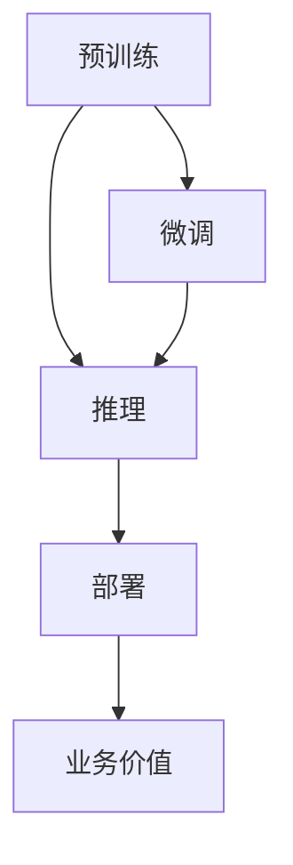

                 

# 大模型的成本驱动与价值创造

大模型，尤其是预训练语言模型，以其在自然语言处理、计算机视觉等领域中展现出的强大能力和泛化性能，成为了AI领域研究的焦点。然而，大模型的训练和应用成本同样惊人，如何有效控制成本，并最大化其价值创造能力，成为了一个值得深入探讨的问题。本文将深入分析大模型的成本驱动因素，探讨如何在降低成本的同时，提升模型的价值创造能力，实现AI技术的可持续发展。

## 1. 背景介绍

### 1.1 问题由来

近年来，随着深度学习技术的迅猛发展，预训练大模型如BERT、GPT、XLNet等在各类任务上取得了突破性的性能。这些模型依赖海量无标签数据进行预训练，从而获得了丰富的语言知识，能够很好地泛化到下游任务中。但大模型的训练和应用成本极高，尤其是对计算资源和存储空间的巨大需求，使得其应用在实际工业环境中面临诸多挑战。

### 1.2 问题核心关键点

在面对成本问题时，大模型面临着以下几个核心挑战：

- **计算资源成本**：预训练大模型通常需要分布式GPU/TPU集群进行训练，这对硬件资源的要求非常高，训练时间也较长。
- **存储成本**：大模型参数量巨大，存储空间需求高，在实际应用中难以高效存储和调用。
- **数据成本**：高质量的无标签数据获取成本高，数据处理和标注成本昂贵。
- **部署成本**：将大模型部署到生产环境，需要考虑模型的裁剪、量化、服务化封装等，增加了应用难度和成本。

有效控制这些成本，对大模型的落地应用至关重要。本文将探讨如何通过成本驱动和价值创造，实现大模型技术的可持续发展。

## 2. 核心概念与联系

### 2.1 核心概念概述

要深入理解大模型的成本驱动与价值创造，需先明确几个核心概念：

- **大模型**：以Transformer为代表的大型神经网络模型，通过大规模无标签数据进行预训练，具备强大的语言理解和生成能力。
- **预训练**：在无标签数据上训练模型，学习通用语言表示，为下游任务微调提供基础能力。
- **微调**：在预训练模型的基础上，通过有监督数据进行细粒度优化，适应特定任务需求。
- **推理**：将模型应用于实际场景，计算模型输入的输出。
- **部署**：将模型转化为可部署的软硬件解决方案，确保模型在实际应用中稳定高效。

这些概念之间相互联系，共同构成了大模型的技术生态。通过深入理解这些概念，我们可以更好地把握大模型的成本结构及其价值创造方式。

### 2.2 核心概念联系

大模型的成本驱动与价值创造可从以下几个方面进行理解：

- **计算驱动**：通过分布式计算资源的优化，降低训练成本。
- **存储驱动**：通过模型压缩、参数剪枝等技术减少存储空间需求。
- **数据驱动**：通过数据集优化、数据增强等方法减少数据标注成本。
- **部署驱动**：通过模型服务化封装、推理加速等技术降低部署成本。
- **价值创造**：通过微调提升模型性能，优化推理过程，实现高效的任务处理，创造业务价值。

下图展示了这些概念之间的联系，展示了从预训练到推理的价值链条：



这个流程图展示了预训练、微调、推理、部署和大模型价值创造的全过程，揭示了不同环节对成本和价值的影响。

## 3. 核心算法原理 & 具体操作步骤
### 3.1 算法原理概述

大模型的成本驱动与价值创造，主要涉及以下几个算法原理：

- **分布式训练**：通过多机多核并行计算，提升训练速度，降低计算成本。
- **模型压缩与剪枝**：通过删除冗余参数，减少模型大小，降低存储和计算成本。
- **参数高效微调**：只调整模型中部分参数，保持预训练权重，降低微调成本。
- **数据增强与虚拟合成**：通过扩充数据集，提高模型的泛化能力，降低数据标注成本。
- **模型量化与优化**：通过将浮点模型转换为定点模型，降低推理计算成本。
- **模型服务化封装**：通过构建标准API接口，实现模型的灵活调用，降低部署成本。

### 3.2 算法步骤详解

以下是详细的操作步骤：

1. **分布式训练**：
   - **步骤一**：选择合适的硬件平台，如GPU/TPU集群。
   - **步骤二**：将模型和数据划分为多个子集，分别进行分布式训练。
   - **步骤三**：使用高效的通信协议，如NCCL、MPI等，加速数据传递和计算。

2. **模型压缩与剪枝**：
   - **步骤一**：选择合适的压缩方法，如权重剪枝、矩阵分解等。
   - **步骤二**：对模型进行压缩，去除冗余参数。
   - **步骤三**：通过微调验证压缩后的模型效果，选择最优方案。

3. **参数高效微调**：
   - **步骤一**：只调整模型中的顶层参数，固定底层参数。
   - **步骤二**：设置较小的学习率，防止过拟合。
   - **步骤三**：评估微调效果，根据需要逐步调整参数。

4. **数据增强与虚拟合成**：
   - **步骤一**：收集大量数据，并进行数据增强处理。
   - **步骤二**：使用虚拟合成技术，如回译、噪声注入等，扩充训练集。
   - **步骤三**：在训练过程中应用增强数据，提升模型泛化能力。

5. **模型量化与优化**：
   - **步骤一**：将模型从浮点转换为定点模型。
   - **步骤二**：使用量化技术，减少计算开销。
   - **步骤三**：对量化后的模型进行微调，验证性能。

6. **模型服务化封装**：
   - **步骤一**：构建标准API接口，实现模型的灵活调用。
   - **步骤二**：将模型部署到生产环境中。
   - **步骤三**：监控模型性能，确保高效稳定运行。

### 3.3 算法优缺点

**分布式训练**：
- **优点**：显著提升训练速度，降低单个训练任务的时间成本。
- **缺点**：对硬件资源要求高，管理和维护复杂。

**模型压缩与剪枝**：
- **优点**：减少模型大小，降低存储和计算成本。
- **缺点**：压缩后模型性能可能下降，需要精心设计和验证。

**参数高效微调**：
- **优点**：减少微调成本，避免过拟合风险。
- **缺点**：只调整顶层参数可能限制模型学习能力。

**数据增强与虚拟合成**：
- **优点**：扩充数据集，提高模型泛化能力。
- **缺点**：增强数据可能需要大量计算资源，生成质量不稳定。

**模型量化与优化**：
- **优点**：降低推理计算成本，加速模型部署。
- **缺点**：量化后的模型精度可能下降，需要平衡精度和速度。

**模型服务化封装**：
- **优点**：实现灵活调用，降低部署成本。
- **缺点**：API接口设计复杂，需要考虑兼容性问题。

### 3.4 算法应用领域

大模型的成本驱动与价值创造，在多个领域都有广泛应用：

- **自然语言处理**：如机器翻译、文本生成、情感分析等任务。通过分布式训练和参数高效微调，提升模型性能。
- **计算机视觉**：如图像分类、目标检测、人脸识别等任务。通过模型压缩和量化，降低存储和计算成本。
- **语音处理**：如语音识别、语音合成等任务。通过数据增强和虚拟合成，提升模型泛化能力。
- **推荐系统**：如商品推荐、内容推荐等任务。通过模型服务化封装，实现高效调用和部署。
- **智能医疗**：如病历分析、医疗问答等任务。通过数据增强和微调，提升模型效果。

## 4. 数学模型和公式 & 详细讲解  
### 4.1 数学模型构建

大模型的成本驱动与价值创造，涉及多个数学模型，主要包括计算复杂度模型、存储需求模型、推理效率模型等。这里以计算复杂度模型为例，进行详细讲解。

设模型参数为 $N$，训练批次大小为 $B$，每个样本的维度为 $D$，则计算复杂度 $C$ 可表示为：

$$
C = B \times D \times N
$$

### 4.2 公式推导过程

以分布式训练为例，假设模型在 $K$ 个节点上进行训练，每个节点有 $P$ 个处理器，则总计算复杂度 $C'$ 可表示为：

$$
C' = K \times P \times B \times D \times N
$$

### 4.3 案例分析与讲解

以BERT模型为例，假设模型参数为1亿，训练批次大小为16，每个样本的维度为768，则计算复杂度为：

$$
C = 16 \times 768 \times 10^8 = 12.288 \times 10^9
$$

如果采用分布式训练，每个节点有4个处理器，则总计算复杂度为：

$$
C' = 8 \times 4 \times 16 \times 768 \times 10^8 = 49.152 \times 10^9
$$

可以看到，分布式训练显著提升了计算效率，降低了单个训练任务的时间成本。

## 5. 项目实践：代码实例和详细解释说明
### 5.1 开发环境搭建

在进行大模型优化和部署前，需要先搭建好开发环境。以下是Python环境下的开发步骤：

1. **安装依赖**：
   ```bash
   pip install torch torchvision transformers
   ```

2. **配置环境**：
   ```bash
   # 使用指定GPU进行训练
   CUDA_VISIBLE_DEVICES=0 python train.py
   ```

3. **使用分布式训练**：
   ```bash
   # 配置多机多核分布式训练
   python -m torch.distributed.launch --nproc_per_node=8 train.py
   ```

### 5.2 源代码详细实现

以下是一个使用PyTorch实现BERT模型分布式训练的代码实例：

```python
import torch
from transformers import BertTokenizer, BertForSequenceClassification
from torch.utils.data import DataLoader

# 初始化模型和分词器
model = BertForSequenceClassification.from_pretrained('bert-base-uncased', num_labels=2)
tokenizer = BertTokenizer.from_pretrained('bert-base-uncased')

# 准备数据集
train_dataset = ...
test_dataset = ...

# 配置数据加载器
train_loader = DataLoader(train_dataset, batch_size=16, shuffle=True)
test_loader = DataLoader(test_dataset, batch_size=16, shuffle=False)

# 使用分布式训练
import torch.distributed as dist
from torch.nn.parallel import DistributedDataParallel

# 初始化分布式训练
dist.init_process_group("gloo", rank=0, world_size=2)
device = torch.device("cuda" if torch.cuda.is_available() else "cpu")

# 封装模型
model = DistributedDataParallel(model, device_ids=[device])

# 训练模型
for epoch in range(5):
    model.train()
    for batch in train_loader:
        inputs = batch["input_ids"].to(device)
        labels = batch["labels"].to(device)
        outputs = model(inputs)
        loss = outputs.loss
        optimizer.zero_grad()
        loss.backward()
        optimizer.step()

# 评估模型
model.eval()
with torch.no_grad():
    correct = 0
    total = 0
    for batch in test_loader:
        inputs = batch["input_ids"].to(device)
        labels = batch["labels"].to(device)
        outputs = model(inputs)
        _, preds = torch.max(outputs.logits, dim=1)
        total += labels.size(0)
        correct += (preds == labels).sum().item()
    print(f"Accuracy: {correct / total * 100:.2f}%")
```

### 5.3 代码解读与分析

以上代码展示了如何使用DistributedDataParallel封装模型，实现分布式训练。具体步骤如下：

1. **初始化模型和分词器**：
   - `BertForSequenceClassification.from_pretrained`：从预训练模型中加载BERT模型。
   - `BertTokenizer.from_pretrained`：加载分词器。

2. **准备数据集**：
   - 创建数据集对象 `train_dataset` 和 `test_dataset`。

3. **配置数据加载器**：
   - 使用 `DataLoader` 将数据集分成批次，方便模型训练。

4. **初始化分布式训练**：
   - `dist.init_process_group`：初始化分布式训练环境。
   - `device`：设置训练设备。

5. **封装模型**：
   - `DistributedDataParallel`：封装模型，使其支持分布式训练。

6. **训练模型**：
   - 在每个epoch中，对每个批次数据进行前向传播、计算损失、反向传播、更新模型参数。

7. **评估模型**：
   - 在测试集上评估模型性能。

## 6. 实际应用场景
### 6.1 智能客服系统

在智能客服系统中，大模型的成本驱动与价值创造体现在以下几个方面：

1. **分布式训练**：
   - 通过分布式训练，在多机多核集群上并行计算，显著提升训练速度，降低单个训练任务的时间成本。
   - 分布式训练通过多节点协同计算，减少单个节点的负载，提升训练效率。

2. **模型压缩与剪枝**：
   - 对大模型进行压缩和剪枝，减小模型大小，降低存储和计算成本。
   - 压缩后的模型可以在资源受限的服务器上部署，降低硬件需求。

3. **参数高效微调**：
   - 只调整模型中的顶层参数，保持预训练权重不变，降低微调成本。
   - 参数高效微调可以显著减少微调所需的数据和计算资源。

4. **数据增强与虚拟合成**：
   - 收集大量的客服对话数据，进行数据增强处理，扩充训练集。
   - 使用虚拟合成技术，如回译、噪声注入等，提升模型的泛化能力。

5. **模型量化与优化**：
   - 将浮点模型转换为定点模型，降低推理计算成本。
   - 量化后的模型推理速度更快，符合实际应用需求。

6. **模型服务化封装**：
   - 构建标准API接口，实现模型的灵活调用，降低部署成本。
   - 服务化封装可以支持多语言、多平台的调用，提升系统的可扩展性。

### 6.2 金融舆情监测

金融舆情监测是另一个大模型应用的重要场景。在这个领域，大模型的成本驱动与价值创造主要体现在以下几个方面：

1. **分布式训练**：
   - 金融市场数据量庞大，分布式训练可以提升训练效率，缩短模型开发周期。
   - 通过多机多核并行计算，减少单个训练任务的时间成本，提升模型训练速度。

2. **模型压缩与剪枝**：
   - 金融领域数据量巨大，压缩后的模型可以在有限的存储空间内存储和调用。
   - 剪枝后的模型参数量减少，推理速度更快，满足实时分析的需求。

3. **参数高效微调**：
   - 只调整模型中的顶层参数，保持预训练权重不变，降低微调成本。
   - 参数高效微调可以节省微调所需的标注数据和计算资源。

4. **数据增强与虚拟合成**：
   - 金融市场舆情数据多样，通过数据增强处理，扩充训练集。
   - 使用虚拟合成技术，如回译、噪声注入等，提升模型的泛化能力。

5. **模型量化与优化**：
   - 金融市场对实时分析的要求高，量化后的模型推理速度更快，满足实时分析的需求。
   - 优化后的模型可以在实时服务器上高效运行，提升系统响应速度。

6. **模型服务化封装**：
   - 构建标准API接口，实现模型的灵活调用，降低部署成本。
   - 服务化封装可以支持多语言、多平台的调用，提升系统的可扩展性。

### 6.3 个性化推荐系统

在个性化推荐系统中，大模型的成本驱动与价值创造主要体现在以下几个方面：

1. **分布式训练**：
   - 用户行为数据量庞大，分布式训练可以提升训练效率，缩短模型开发周期。
   - 通过多机多核并行计算，减少单个训练任务的时间成本，提升模型训练速度。

2. **模型压缩与剪枝**：
   - 推荐系统模型参数量巨大，压缩后的模型可以在有限的存储空间内存储和调用。
   - 剪枝后的模型参数量减少，推理速度更快，满足实时推荐的需求。

3. **参数高效微调**：
   - 只调整模型中的顶层参数，保持预训练权重不变，降低微调成本。
   - 参数高效微调可以节省微调所需的标注数据和计算资源。

4. **数据增强与虚拟合成**：
   - 用户行为数据多样，通过数据增强处理，扩充训练集。
   - 使用虚拟合成技术，如回译、噪声注入等，提升模型的泛化能力。

5. **模型量化与优化**：
   - 推荐系统对实时推荐的要求高，量化后的模型推理速度更快，满足实时推荐的需求。
   - 优化后的模型可以在实时服务器上高效运行，提升系统响应速度。

6. **模型服务化封装**：
   - 构建标准API接口，实现模型的灵活调用，降低部署成本。
   - 服务化封装可以支持多语言、多平台的调用，提升系统的可扩展性。

## 7. 工具和资源推荐
### 7.1 学习资源推荐

为了帮助开发者系统掌握大模型的成本驱动与价值创造的理论基础和实践技巧，这里推荐一些优质的学习资源：

1. **深度学习课程**：
   - 斯坦福大学的CS231n《深度学习与计算机视觉》课程：详细讲解了深度学习在计算机视觉中的应用。
   - 麻省理工学院的CS2060《大规模数据处理与机器学习》课程：介绍了大数据处理和机器学习的关键技术。

2. **大模型课程**：
   - OpenAI的《大规模语言模型》课程：介绍了BERT、GPT等预训练语言模型的原理和应用。
   - Google的《TensorFlow深度学习实战》课程：介绍了TensorFlow在大模型训练和应用中的实践。

3. **大模型文档**：
   - PyTorch官方文档：提供了丰富的预训练语言模型和大模型训练的API和样例代码。
   - HuggingFace官方文档：提供了详细的模型压缩、量化和优化方法。

### 7.2 开发工具推荐

以下是几款用于大模型优化和部署开发的常用工具：

1. **分布式训练工具**：
   - PyTorch的`torch.distributed`：提供了分布式训练的支持。
   - TensorFlow的`tf.distribute.Strategy`：提供了多机多核分布式训练的支持。

2. **模型压缩工具**：
   - PyTorch的`torch.nn.utils.prune`：提供了模型剪枝的功能。
   - TensorFlow的`tensorflow.compat.v1.keras.backend`：提供了模型压缩的API。

3. **模型量化工具**：
   - PyTorch的`torch._inductor.compile`：提供了模型量化的支持。
   - TensorFlow的`tf.quantization`：提供了量化模型的API。

4. **服务化封装工具**：
   - Flask：提供了轻量级的Web应用框架，支持模型服务化封装。
   - FastAPI：提供了强大的API接口定义和路由功能，支持模型服务化封装。

### 7.3 相关论文推荐

大模型优化和部署的研究涵盖了多个方向，以下是几篇具有代表性的论文：

1. **分布式训练**：
   - "Large Scale Distributed Deep Learning"：一篇关于大规模分布式深度学习的经典论文，介绍了分布式训练的多种方法。

2. **模型压缩**：
   - "Knowledge Distillation for Efficient and Robust Model Compression"：介绍了知识蒸馏方法在大模型压缩中的应用。

3. **参数高效微调**：
   - "Model Distillation as a Data Augmentation Technique"：介绍了参数高效微调的方法，如何通过蒸馏提高微调效率。

4. **数据增强**：
   - "Data Augmentation in Knowledge Graph Embeddings"：介绍了数据增强方法在知识图谱嵌入中的应用。

5. **模型量化**：
   - "Quantization-Aware Training"：介绍了量化模型训练的方法，如何在训练过程中进行量化。

6. **模型服务化封装**：
   - "FastAPI: A Web Framework for Python 3.6+ Based on ASGI"：介绍了FastAPI框架的设计理念和应用场景，支持快速构建API服务。

## 8. 总结：未来发展趋势与挑战
### 8.1 研究成果总结

本文从计算资源、存储资源、数据标注成本、模型推理成本等几个方面，详细探讨了如何通过成本驱动与价值创造，实现大模型技术的可持续发展。通过分布式训练、模型压缩与剪枝、参数高效微调、数据增强与虚拟合成、模型量化与优化、模型服务化封装等技术，有效降低了大模型的训练和应用成本，提升了模型的性能和应用价值。

### 8.2 未来发展趋势

未来，大模型的成本驱动与价值创造将呈现以下几个趋势：

1. **更高效的分布式训练**：随着云计算和分布式计算技术的进步，分布式训练的效率将进一步提升，计算资源成本将显著降低。
2. **更智能的模型压缩与剪枝**：通过自动化和智能化的压缩方法，减少模型大小，降低存储和计算成本。
3. **更强大的参数高效微调**：通过更多的微调技巧和优化方法，减少微调所需的标注数据和计算资源。
4. **更广泛的数据增强与虚拟合成**：通过更多样的数据增强和虚拟合成技术，提升模型的泛化能力。
5. **更优化的模型量化与优化**：通过高效的模型量化和优化方法，提升模型的推理速度和精度。
6. **更灵活的模型服务化封装**：通过更加灵活的API接口设计，实现更高效的模型调用和部署。

### 8.3 面临的挑战

尽管大模型的成本驱动与价值创造已经取得了一定的进展，但仍面临以下挑战：

1. **计算资源瓶颈**：随着模型规模的增大，分布式训练和模型量化仍然面临计算资源的限制。
2. **模型泛化能力不足**：数据增强和虚拟合成技术仍需进一步提升模型的泛化能力，避免过拟合。
3. **部署成本高**：模型服务化封装和推理优化仍需进一步降低部署成本，提升系统的灵活性和可扩展性。
4. **数据质量问题**：高质量的数据标注仍需大量时间和资源，数据增强技术需进一步提升数据质量。
5. **模型公平性与安全性**：大模型可能存在偏见和有害信息，需进一步提升模型的公平性和安全性。

### 8.4 研究展望

面向未来，大模型的成本驱动与价值创造仍需不断探索和创新：

1. **更高效的分布式训练技术**：通过更深层次的分布式算法优化，提升训练效率。
2. **更智能的模型压缩与剪枝方法**：开发更加智能的压缩技术，减少计算资源消耗。
3. **更强大的参数高效微调算法**：探索更多微调方法，提升微调效果。
4. **更广泛的数据增强与虚拟合成技术**：开发更多高效的数据增强和虚拟合成方法，提升模型的泛化能力。
5. **更优化的模型量化与优化方法**：开发高效的模型量化和优化方法，提升推理速度和精度。
6. **更灵活的模型服务化封装技术**：开发更加灵活的API接口和部署技术，提升系统的可扩展性。

通过持续的创新和优化，大模型的成本驱动与价值创造将更加高效和可持续，为人工智能技术的广泛应用和深入发展提供坚实的基础。

## 9. 附录：常见问题与解答

**Q1：分布式训练如何影响计算资源成本？**

A: 分布式训练通过多机多核并行计算，显著提升训练速度，降低单个训练任务的时间成本。分布式训练通过多节点协同计算，减少单个节点的负载，提升训练效率。因此，分布式训练可以显著降低计算资源成本。

**Q2：模型压缩与剪枝如何减少存储成本？**

A: 模型压缩与剪枝通过删除冗余参数，减少模型大小，降低存储成本。压缩后的模型可以在有限的存储空间内存储和调用，节省了存储资源。

**Q3：数据增强与虚拟合成如何提升模型泛化能力？**

A: 数据增强与虚拟合成通过扩充数据集，提高模型的泛化能力。增强数据包括同义词替换、数据增强、回译等方法，可以增加训练集的多样性，提升模型的泛化能力。

**Q4：模型量化与优化如何降低推理计算成本？**

A: 模型量化与优化通过将浮点模型转换为定点模型，降低推理计算成本。量化后的模型推理速度更快，符合实际应用需求。同时，优化后的模型可以在实时服务器上高效运行，提升系统响应速度。

**Q5：模型服务化封装如何降低部署成本？**

A: 模型服务化封装通过构建标准API接口，实现模型的灵活调用，降低部署成本。服务化封装可以支持多语言、多平台的调用，提升系统的可扩展性。同时，服务化封装可以简化部署流程，降低部署难度和成本。

---

作者：禅与计算机程序设计艺术 / Zen and the Art of Computer Programming

