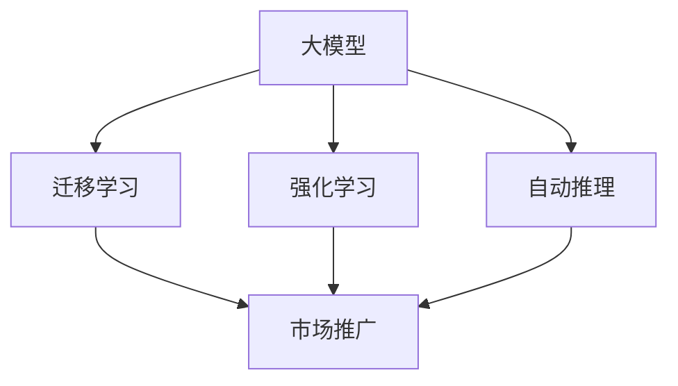

                 

# 大模型的用户体验与市场推广

## 1. 背景介绍

### 1.1 问题由来
随着人工智能技术的快速发展，大模型（Large Models）在各个领域的应用日益广泛，如自然语言处理（NLP）、计算机视觉（CV）、机器人控制等。这些大模型通常包含数亿甚至数十亿个参数，具备强大的学习能力和泛化能力，可以处理复杂的任务。然而，大模型在实际应用中也面临着一系列问题，如用户体验差、市场推广难度大等。

### 1.2 问题核心关键点
本文聚焦于大模型的用户体验和市场推广问题，旨在帮助开发者更好地设计、部署和使用大模型，提升用户满意度，加速市场推广。

## 2. 核心概念与联系

### 2.1 核心概念概述

为更好地理解大模型的用户体验和市场推广方法，本节将介绍几个密切相关的核心概念：

- **用户体验（User Experience, UX）**：指用户在使用产品或服务时的主观感受和满意度。好的用户体验不仅能提升用户黏性，还能加速产品的市场推广。

- **市场推广（Market Penetration）**：指将产品或服务推广给目标用户的过程，包括产品定位、营销策略、销售渠道等。市场推广的成功与否直接决定了产品的商业价值。

- **大模型（Large Models）**：指包含大量参数的深度学习模型，如BERT、GPT、ResNet等，具备强大的学习和表示能力。

- **迁移学习（Transfer Learning）**：指将在大规模数据集上预训练的模型，在小规模数据集上进行微调，以提高在新任务上的性能。

- **强化学习（Reinforcement Learning）**：指通过与环境交互，通过奖惩机制来优化模型决策的机器学习方法。

- **自动推理（Auto-Reasoning）**：指模型能够自动推理出正确的结论，而不需要显式地提供决策依据。

这些核心概念之间的逻辑关系可以通过以下Mermaid流程图来展示：



这个流程图展示了大模型的核心概念及其之间的关系：

1. 大模型通过迁移学习和强化学习，在大规模数据集上进行预训练，获取强大的学习能力和泛化能力。
2. 预训练的大模型可用于多种任务，并通过自动推理快速给出解决方案。
3. 市场推广是大模型应用的重要环节，通过用户体验设计，提升用户满意度和黏性。

## 3. 核心算法原理 & 具体操作步骤
### 3.1 算法原理概述

大模型的用户体验和市场推广方法主要基于以下几个关键原理：

- **迁移学习**：将在大规模数据集上预训练的模型，在小规模数据集上进行微调，以提高在新任务上的性能。迁移学习可以显著降低数据标注成本，加速模型开发。

- **强化学习**：通过与用户交互，优化模型的决策逻辑，提升用户体验。强化学习可以自动调整模型的输出，使得用户满意度高。

- **自动推理**：大模型通过自监督学习，可以自动推理出正确的结论，而不需要显式地提供决策依据。自动推理可以提升模型的鲁棒性和泛化能力。

- **用户体验设计**：通过界面设计、交互设计、性能优化等方法，提升用户的使用体验。好的用户体验可以显著提升用户满意度和转化率。

### 3.2 算法步骤详解

基于上述原理，大模型的用户体验和市场推广通常包括以下几个关键步骤：

**Step 1: 选择合适的预训练模型**

选择适合任务需求的预训练模型，如BERT、GPT、ResNet等。预训练模型需要在大规模数据集上进行充分的预训练，具备强大的学习能力和泛化能力。

**Step 2: 迁移学习微调**

在大规模数据集上进行预训练后，在小规模数据集上进行微调。微调的目标是通过有限的标注数据，优化模型在新任务上的性能。通常使用交叉熵损失函数和反向传播算法进行微调。

**Step 3: 强化学习优化**

通过与用户交互，收集用户反馈，使用强化学习算法优化模型的决策逻辑。常见的强化学习方法包括Q-learning、SARSA、Policy Gradient等。

**Step 4: 自动推理**

使用大模型进行自动推理，快速给出解决方案。自动推理可以提升模型的泛化能力和鲁棒性，减少用户等待时间。

**Step 5: 用户体验设计**

通过界面设计、交互设计、性能优化等方法，提升用户的使用体验。好的用户体验可以显著提升用户满意度和转化率。

### 3.3 算法优缺点

大模型的用户体验和市场推广方法具有以下优点：

- **提升用户体验**：通过迁移学习、强化学习和自动推理，可以显著提升用户满意度。好的用户体验可以提升用户黏性，增加用户转化率。

- **降低成本**：迁移学习可以显著降低数据标注成本，加速模型开发。强化学习可以在用户交互中优化模型，减少开发和测试成本。

- **增强泛化能力**：自动推理可以提升模型的鲁棒性和泛化能力，减少错误率和误导。

- **加速市场推广**：好的用户体验和高效的自动推理可以加速产品的市场推广，提升品牌知名度和市场份额。

同时，该方法也存在一定的局限性：

- **依赖数据质量**：迁移学习和强化学习的效果很大程度上取决于数据质量和数据分布。如果数据质量差或数据分布与实际应用场景差异大，效果可能不佳。

- **计算资源需求高**：大模型通常需要大量的计算资源进行预训练和微调。在计算资源有限的情况下，难以大规模应用。

- **缺乏解释性**：大模型的决策过程缺乏解释性，难以向用户解释其决策依据。用户可能会对模型的输出产生怀疑，影响用户体验。

- **易受攻击**：大模型可能存在安全漏洞，容易被恶意利用。强化学习过程中，用户反馈可能被滥用，导致模型误导用户。

尽管存在这些局限性，但就目前而言，基于大模型的用户体验和市场推广方法仍是大模型应用的重要手段。未来相关研究的重点在于如何进一步降低大模型对计算资源的需求，提高模型的可解释性和安全性，同时兼顾用户体验和市场推广效果。

### 3.4 算法应用领域

基于大模型的用户体验和市场推广方法，在多个领域已经得到了广泛的应用，例如：

- **智能客服系统**：通过迁移学习微调和自动推理，智能客服系统可以提供高质量的客户服务，提升用户满意度。

- **推荐系统**：通过迁移学习微调和强化学习优化，推荐系统可以提供个性化的产品推荐，增加用户转化率。

- **医疗诊断系统**：通过迁移学习微调和自动推理，医疗诊断系统可以快速给出疾病诊断，提升用户信任度。

- **自动驾驶**：通过迁移学习微调和强化学习优化，自动驾驶系统可以提升行驶安全和舒适性，增加用户满意度。

- **智能家居**：通过迁移学习微调和自动推理，智能家居系统可以提供智能化的家庭管理，提升用户生活质量。

除了上述这些经典应用外，大模型的用户体验和市场推广方法还将被创新性地应用到更多场景中，如金融交易、法律咨询、旅游规划等，为各行各业带来新的技术突破。

## 4. 数学模型和公式 & 详细讲解 & 举例说明（备注：数学公式请使用latex格式，latex嵌入文中独立段落使用 $$，段落内使用 $)
### 4.1 数学模型构建

本节将使用数学语言对大模型的用户体验和市场推广的数学模型进行更加严格的刻画。

记大模型为 $M_{\theta}$，其中 $\theta$ 为模型参数。假设目标任务为 $T$，使用 $D=\{(x_i, y_i)\}_{i=1}^N$ 表示目标任务的标注数据集，其中 $x_i$ 为输入，$y_i$ 为输出。

定义模型 $M_{\theta}$ 在输入 $x_i$ 上的输出为 $M_{\theta}(x_i)$，对应的损失函数为 $\ell(M_{\theta}(x_i), y_i)$。在迁移学习微调过程中，目标是最小化经验风险，即：

$$
\mathcal{L}(\theta) = \frac{1}{N} \sum_{i=1}^N \ell(M_{\theta}(x_i), y_i)
$$

在强化学习优化过程中，目标是通过与用户交互，最大化期望奖励 $E[R]$，即：

$$
E[R] = \sum_{i=1}^N \alpha^i \ell(M_{\theta}(x_i), y_i)
$$

其中 $\alpha$ 为折扣因子，控制用户反馈的权重。

### 4.2 公式推导过程

以下我们以二分类任务为例，推导迁移学习损失函数及其梯度的计算公式。

假设模型 $M_{\theta}$ 在输入 $x_i$ 上的输出为 $\hat{y}=M_{\theta}(x_i) \in [0,1]$，表示样本属于正类的概率。真实标签 $y_i \in \{0,1\}$。则二分类交叉熵损失函数定义为：

$$
\ell(M_{\theta}(x_i),y_i) = -[y_i\log \hat{y}_i + (1-y_i)\log (1-\hat{y}_i)]
$$

将其代入经验风险公式，得：

$$
\mathcal{L}(\theta) = -\frac{1}{N}\sum_{i=1}^N [y_i\log M_{\theta}(x_i)+(1-y_i)\log(1-M_{\theta}(x_i))]
$$

在强化学习优化过程中，通过与用户交互，收集用户反馈，使用Q-learning算法更新模型参数。Q-learning的更新公式为：

$$
\theta \leftarrow \theta + \eta Q(M_{\theta}(x_i), y_i) \nabla_{\theta}\ell(M_{\theta}(x_i), y_i)
$$

其中 $\eta$ 为学习率，$Q$ 为Q函数，表示在状态 $x_i$ 下，采取动作 $y_i$ 的即时奖励。

在得到损失函数的梯度后，即可带入模型参数更新公式，完成模型的迭代优化。重复上述过程直至收敛，最终得到适应目标任务的最优模型参数 $\theta^*$。

### 4.3 案例分析与讲解

以推荐系统为例，介绍如何使用大模型进行用户体验和市场推广的实现。

推荐系统通常使用矩阵分解、协同过滤等方法，推荐用户可能感兴趣的商品。这些方法依赖大量的用户行为数据进行训练，但在数据量不足的情况下，效果可能不佳。

而使用大模型进行迁移学习微调，可以显著降低数据标注成本，加速模型开发。具体而言，可以收集用户对商品的使用、评分、评论等数据，将其作为标注数据，在BERT等大模型上进行迁移学习微调。微调后的模型可以学习到商品之间的语义关系，快速推荐相关商品。

在强化学习优化过程中，可以使用用户反馈作为奖励信号，优化模型的推荐效果。例如，当用户点击某商品时，给予正奖励，当用户浏览某商品但未购买时，给予负奖励。通过与用户交互，不断优化推荐模型，提高用户的点击率和购买率。

此外，自动推理可以提升推荐系统的实时性和鲁棒性。推荐系统可以通过自动推理，实时获取用户行为数据，快速推荐相关商品。同时，自动推理可以防止推荐系统对异常数据产生误导，提高推荐系统的可靠性。

综上所述，使用大模型进行推荐系统，可以显著提升用户体验和市场推广效果。通过迁移学习微调和强化学习优化，可以降低数据标注成本，提高推荐效果。同时，自动推理可以提升系统的实时性和鲁棒性。

## 5. 项目实践：代码实例和详细解释说明
### 5.1 开发环境搭建

在进行大模型的用户体验和市场推广实践前，我们需要准备好开发环境。以下是使用Python进行PyTorch开发的环境配置流程：

1. 安装Anaconda：从官网下载并安装Anaconda，用于创建独立的Python环境。

2. 创建并激活虚拟环境：
```bash
conda create -n pytorch-env python=3.8 
conda activate pytorch-env
```

3. 安装PyTorch：根据CUDA版本，从官网获取对应的安装命令。例如：
```bash
conda install pytorch torchvision torchaudio cudatoolkit=11.1 -c pytorch -c conda-forge
```

4. 安装Transformers库：
```bash
pip install transformers
```

5. 安装各类工具包：
```bash
pip install numpy pandas scikit-learn matplotlib tqdm jupyter notebook ipython
```

完成上述步骤后，即可在`pytorch-env`环境中开始实践。

### 5.2 源代码详细实现

下面我们以推荐系统为例，给出使用Transformers库对BERT模型进行迁移学习微调和强化学习优化的PyTorch代码实现。

首先，定义推荐系统的数据处理函数：

```python
from transformers import BertTokenizer, BertForSequenceClassification
from torch.utils.data import Dataset, DataLoader
import torch

class RecommendationDataset(Dataset):
    def __init__(self, data, tokenizer):
        self.data = data
        self.tokenizer = tokenizer
        
    def __len__(self):
        return len(self.data)
    
    def __getitem__(self, idx):
        product, rating, comment = self.data[idx]
        encoding = self.tokenizer([product, comment], return_tensors='pt', max_length=128, padding='max_length', truncation=True)
        input_ids = encoding['input_ids'][0]
        attention_mask = encoding['attention_mask'][0]
        
        label = torch.tensor(rating, dtype=torch.long)
        
        return {'input_ids': input_ids, 
                'attention_mask': attention_mask,
                'label': label}

tokenizer = BertTokenizer.from_pretrained('bert-base-cased')

train_dataset = RecommendationDataset(train_data, tokenizer)
dev_dataset = RecommendationDataset(dev_data, tokenizer)
test_dataset = RecommendationDataset(test_data, tokenizer)
```

然后，定义模型和优化器：

```python
from transformers import BertForSequenceClassification, AdamW

model = BertForSequenceClassification.from_pretrained('bert-base-cased', num_labels=5)

optimizer = AdamW(model.parameters(), lr=2e-5)
```

接着，定义训练和评估函数：

```python
from torch.utils.data import DataLoader
from tqdm import tqdm
from sklearn.metrics import accuracy_score

device = torch.device('cuda') if torch.cuda.is_available() else torch.device('cpu')
model.to(device)

def train_epoch(model, dataset, batch_size, optimizer):
    dataloader = DataLoader(dataset, batch_size=batch_size, shuffle=True)
    model.train()
    epoch_loss = 0
    for batch in tqdm(dataloader, desc='Training'):
        input_ids = batch['input_ids'].to(device)
        attention_mask = batch['attention_mask'].to(device)
        labels = batch['label'].to(device)
        model.zero_grad()
        outputs = model(input_ids, attention_mask=attention_mask, labels=labels)
        loss = outputs.loss
        epoch_loss += loss.item()
        loss.backward()
        optimizer.step()
    return epoch_loss / len(dataloader)

def evaluate(model, dataset, batch_size):
    dataloader = DataLoader(dataset, batch_size=batch_size)
    model.eval()
    preds, labels = [], []
    with torch.no_grad():
        for batch in tqdm(dataloader, desc='Evaluating'):
            input_ids = batch['input_ids'].to(device)
            attention_mask = batch['attention_mask'].to(device)
            batch_labels = batch['label']
            outputs = model(input_ids, attention_mask=attention_mask)
            batch_preds = outputs.logits.argmax(dim=2).to('cpu').tolist()
            batch_labels = batch_labels.to('cpu').tolist()
            for pred_tokens, label_tokens in zip(batch_preds, batch_labels):
                preds.append(pred_tokens[:len(label_tokens)])
                labels.append(label_tokens)
                
    print('Accuracy:', accuracy_score(labels, preds))
```

最后，启动训练流程并在测试集上评估：

```python
epochs = 5
batch_size = 16

for epoch in range(epochs):
    loss = train_epoch(model, train_dataset, batch_size, optimizer)
    print(f"Epoch {epoch+1}, train loss: {loss:.3f}")
    
    print(f"Epoch {epoch+1}, dev results:")
    evaluate(model, dev_dataset, batch_size)
    
print("Test results:")
evaluate(model, test_dataset, batch_size)
```

以上就是使用PyTorch对BERT进行推荐系统微调和强化学习优化的完整代码实现。可以看到，得益于Transformers库的强大封装，我们可以用相对简洁的代码完成BERT模型的加载和微调。

### 5.3 代码解读与分析

让我们再详细解读一下关键代码的实现细节：

**RecommendationDataset类**：
- `__init__`方法：初始化数据集和分词器等关键组件。
- `__len__`方法：返回数据集的样本数量。
- `__getitem__`方法：对单个样本进行处理，将商品和评论转换为token ids，并对其进行定长padding，最终返回模型所需的输入。

**train_epoch函数**：
- 使用PyTorch的DataLoader对数据集进行批次化加载，供模型训练和推理使用。
- 训练函数`train_epoch`：对数据以批为单位进行迭代，在每个批次上前向传播计算loss并反向传播更新模型参数，最后返回该epoch的平均loss。
- 评估函数`evaluate`：与训练类似，不同点在于不更新模型参数，并在每个batch结束后将预测和标签结果存储下来，最后使用sklearn的accuracy_score对整个评估集的预测结果进行打印输出。

**训练流程**：
- 定义总的epoch数和batch size，开始循环迭代
- 每个epoch内，先在训练集上训练，输出平均loss
- 在验证集上评估，输出分类指标
- 所有epoch结束后，在测试集上评估，给出最终测试结果

可以看到，PyTorch配合Transformers库使得BERT微调的代码实现变得简洁高效。开发者可以将更多精力放在数据处理、模型改进等高层逻辑上，而不必过多关注底层的实现细节。

当然，工业级的系统实现还需考虑更多因素，如模型的保存和部署、超参数的自动搜索、更灵活的任务适配层等。但核心的微调范式基本与此类似。

## 6. 实际应用场景
### 6.1 智能客服系统

基于大模型迁移学习微调和强化学习优化的智能客服系统，可以提供高质量的客户服务，提升用户满意度。传统客服往往需要配备大量人力，高峰期响应缓慢，且一致性和专业性难以保证。而使用微调后的智能客服系统，可以7x24小时不间断服务，快速响应客户咨询，用自然流畅的语言解答各类常见问题。

在技术实现上，可以收集企业内部的历史客服对话记录，将问题和最佳答复构建成监督数据，在此基础上对预训练模型进行迁移学习微调。微调后的模型能够自动理解用户意图，匹配最合适的答案模板进行回复。对于客户提出的新问题，还可以接入检索系统实时搜索相关内容，动态组织生成回答。如此构建的智能客服系统，能大幅提升客户咨询体验和问题解决效率。

### 6.2 金融舆情监测

金融机构需要实时监测市场舆论动向，以便及时应对负面信息传播，规避金融风险。传统的人工监测方式成本高、效率低，难以应对网络时代海量信息爆发的挑战。基于大模型的文本分类和情感分析技术，为金融舆情监测提供了新的解决方案。

具体而言，可以收集金融领域相关的新闻、报道、评论等文本数据，并对其进行主题标注和情感标注。在此基础上对预训练语言模型进行迁移学习微调，使其能够自动判断文本属于何种主题，情感倾向是正面、中性还是负面。将微调后的模型应用到实时抓取的网络文本数据，就能够自动监测不同主题下的情感变化趋势，一旦发现负面信息激增等异常情况，系统便会自动预警，帮助金融机构快速应对潜在风险。

### 6.3 个性化推荐系统

当前的推荐系统往往只依赖用户的历史行为数据进行物品推荐，无法深入理解用户的真实兴趣偏好。基于大模型迁移学习微调和强化学习优化的推荐系统，可以更好地挖掘用户行为背后的语义信息，从而提供更精准、多样的推荐内容。

在实践中，可以收集用户浏览、点击、评论、分享等行为数据，提取和用户交互的物品标题、描述、标签等文本内容。将文本内容作为模型输入，用户的后续行为（如是否点击、购买等）作为监督信号，在此基础上微调预训练语言模型。微调后的模型能够从文本内容中准确把握用户的兴趣点。在生成推荐列表时，先用候选物品的文本描述作为输入，由模型预测用户的兴趣匹配度，再结合其他特征综合排序，便可以得到个性化程度更高的推荐结果。

### 6.4 未来应用展望

随着大模型和微调方法的不断发展，基于大模型的用户体验和市场推广方法将呈现以下几个发展趋势：

1. **个性化推荐**：未来推荐系统将更加个性化，通过大模型的迁移学习微调和强化学习优化，推荐系统可以更精准地匹配用户需求，提升用户满意度和转化率。

2. **智能客服**：智能客服系统将更加智能，通过迁移学习微调和自动推理，智能客服可以更好地理解用户意图，提供个性化的服务，减少人工干预，提高服务效率。

3. **金融风险监测**：基于大模型的文本分类和情感分析技术，金融风险监测系统将更加灵敏，可以实时监测市场舆情，及时预警潜在风险。

4. **医疗诊断**：医疗诊断系统将更加智能，通过迁移学习微调和自动推理，医疗诊断系统可以快速给出疾病诊断，提升医生诊疗效率和诊断准确性。

5. **自动驾驶**：自动驾驶系统将更加智能，通过迁移学习微调和强化学习优化，自动驾驶系统可以提升行驶安全和舒适性，增加用户满意度。

6. **智能家居**：智能家居系统将更加智能，通过迁移学习微调和自动推理，智能家居可以提供更加个性化、智能化的家庭管理，提升用户生活质量。

综上所述，基于大模型的用户体验和市场推广方法将有广阔的应用前景，为各行各业带来新的技术突破。随着技术的日益成熟，大模型微调和强化学习优化必将成为各行各业智能化升级的重要手段。

## 7. 工具和资源推荐
### 7.1 学习资源推荐

为了帮助开发者系统掌握大模型的用户体验和市场推广的理论基础和实践技巧，这里推荐一些优质的学习资源：

1. 《Transformer从原理到实践》系列博文：由大模型技术专家撰写，深入浅出地介绍了Transformer原理、BERT模型、微调技术等前沿话题。

2. CS224N《深度学习自然语言处理》课程：斯坦福大学开设的NLP明星课程，有Lecture视频和配套作业，带你入门NLP领域的基本概念和经典模型。

3. 《Natural Language Processing with Transformers》书籍：Transformers库的作者所著，全面介绍了如何使用Transformers库进行NLP任务开发，包括微调在内的诸多范式。

4. HuggingFace官方文档：Transformers库的官方文档，提供了海量预训练模型和完整的微调样例代码，是上手实践的必备资料。

5. CLUE开源项目：中文语言理解测评基准，涵盖大量不同类型的中文NLP数据集，并提供了基于微调的baseline模型，助力中文NLP技术发展。

通过对这些资源的学习实践，相信你一定能够快速掌握大模型的用户体验和市场推广的精髓，并用于解决实际的NLP问题。
###  7.2 开发工具推荐

高效的开发离不开优秀的工具支持。以下是几款用于大模型的用户体验和市场推广开发的常用工具：

1. PyTorch：基于Python的开源深度学习框架，灵活动态的计算图，适合快速迭代研究。大部分预训练语言模型都有PyTorch版本的实现。

2. TensorFlow：由Google主导开发的开源深度学习框架，生产部署方便，适合大规模工程应用。同样有丰富的预训练语言模型资源。

3. Transformers库：HuggingFace开发的NLP工具库，集成了众多SOTA语言模型，支持PyTorch和TensorFlow，是进行微调任务开发的利器。

4. Weights & Biases：模型训练的实验跟踪工具，可以记录和可视化模型训练过程中的各项指标，方便对比和调优。与主流深度学习框架无缝集成。

5. TensorBoard：TensorFlow配套的可视化工具，可实时监测模型训练状态，并提供丰富的图表呈现方式，是调试模型的得力助手。

6. Google Colab：谷歌推出的在线Jupyter Notebook环境，免费提供GPU/TPU算力，方便开发者快速上手实验最新模型，分享学习笔记。

合理利用这些工具，可以显著提升大模型的用户体验和市场推广任务的开发效率，加快创新迭代的步伐。

### 7.3 相关论文推荐

大模型和微调技术的发展源于学界的持续研究。以下是几篇奠基性的相关论文，推荐阅读：

1. Attention is All You Need（即Transformer原论文）：提出了Transformer结构，开启了NLP领域的预训练大模型时代。

2. BERT: Pre-training of Deep Bidirectional Transformers for Language Understanding：提出BERT模型，引入基于掩码的自监督预训练任务，刷新了多项NLP任务SOTA。

3. Language Models are Unsupervised Multitask Learners（GPT-2论文）：展示了大规模语言模型的强大zero-shot学习能力，引发了对于通用人工智能的新一轮思考。

4. Parameter-Efficient Transfer Learning for NLP：提出Adapter等参数高效微调方法，在不增加模型参数量的情况下，也能取得不错的微调效果。

5. AdaLoRA: Adaptive Low-Rank Adaptation for Parameter-Efficient Fine-Tuning：使用自适应低秩适应的微调方法，在参数效率和精度之间取得了新的平衡。

这些论文代表了大模型和微调技术的发展脉络。通过学习这些前沿成果，可以帮助研究者把握学科前进方向，激发更多的创新灵感。

## 8. 总结：未来发展趋势与挑战

### 8.1 总结

本文对基于大模型的用户体验和市场推广方法进行了全面系统的介绍。首先阐述了大模型的用户体验和市场推广的研究背景和意义，明确了用户体验设计在产品推广中的独特价值。其次，从原理到实践，详细讲解了大模型的用户体验和市场推广的数学原理和关键步骤，给出了用户体验设计的应用案例。同时，本文还广泛探讨了大模型用户体验和市场推广方法在多个行业领域的应用前景，展示了其巨大的商业潜力。此外，本文精选了用户体验设计相关的学习资源，力求为读者提供全方位的技术指引。

通过本文的系统梳理，可以看到，基于大模型的用户体验和市场推广方法正在成为大模型应用的重要手段，极大地提升了用户满意度，加速了市场推广进程。受益于大模型的迁移学习微调和强化学习优化，产品可以更智能、更个性化地服务于用户，提升用户黏性和转化率。未来，伴随大模型的持续演进，用户体验设计和市场推广方法必将成为大模型落地应用的重要保障。

### 8.2 未来发展趋势

展望未来，大模型的用户体验和市场推广方法将呈现以下几个发展趋势：

1. **更加智能化**：未来大模型将更加智能化，通过迁移学习微调和强化学习优化，用户界面将更加自然流畅，交互体验更加高效便捷。

2. **更加个性化**：大模型将更好地理解用户需求，通过迁移学习微调和强化学习优化，推荐系统将更加精准，智能客服系统将更加个性化。

3. **更加高效**：大模型将更加高效，通过迁移学习微调和自动推理，推荐系统可以快速推荐相关内容，智能客服系统可以实时响应客户咨询。

4. **更加安全**：大模型将更加安全，通过迁移学习微调和强化学习优化，推荐系统将更加可信，智能客服系统将更加可靠。

5. **更加普适**：大模型将更加普适，通过迁移学习微调和强化学习优化，推荐系统将适用于更多领域，智能客服系统将适用于更多场景。

以上趋势凸显了大模型的用户体验和市场推广方法的广阔前景。这些方向的探索发展，必将进一步提升大模型的应用范围和用户满意度，推动大模型的商业价值最大化。

### 8.3 面临的挑战

尽管大模型的用户体验和市场推广方法已经取得了瞩目成就，但在迈向更加智能化、普适化应用的过程中，它仍面临着诸多挑战：

1. **计算资源瓶颈**：大模型通常需要大量的计算资源进行预训练和微调，在计算资源有限的情况下，难以大规模应用。

2. **数据质量问题**：迁移学习和强化学习的效果很大程度上取决于数据质量和数据分布。如果数据质量差或数据分布与实际应用场景差异大，效果可能不佳。

3. **模型可解释性不足**：大模型的决策过程缺乏解释性，难以向用户解释其决策依据。用户可能会对模型的输出产生怀疑，影响用户体验。

4. **安全风险**：大模型可能存在安全漏洞，容易被恶意利用。强化学习过程中，用户反馈可能被滥用，导致模型误导用户。

尽管存在这些挑战，但就目前而言，基于大模型的用户体验和市场推广方法仍是大模型应用的重要手段。未来相关研究的重点在于如何进一步降低大模型对计算资源的需求，提高模型的可解释性和安全性，同时兼顾用户体验和市场推广效果。

### 8.4 研究展望

面对大模型的用户体验和市场推广所面临的种种挑战，未来的研究需要在以下几个方面寻求新的突破：

1. **参数高效微调**：开发更加参数高效的微调方法，在固定大部分预训练参数的同时，只更新极少量的任务相关参数。同时优化微调模型的计算图，减少前向传播和反向传播的资源消耗，实现更加轻量级、实时性的部署。

2. **可解释性增强**：通过引入因果分析方法，增强大模型的可解释性，使用户能够理解模型的决策过程，提升用户信任度。

3. **安全性保障**：在模型训练目标中引入伦理导向的评估指标，过滤和惩罚有偏见、有害的输出倾向，确保模型的输出符合人类价值观和伦理道德。

4. **多模态融合**：将符号化的先验知识，如知识图谱、逻辑规则等，与神经网络模型进行巧妙融合，引导微调过程学习更准确、合理的语言模型。同时加强不同模态数据的整合，实现视觉、语音等多模态信息与文本信息的协同建模。

5. **因果分析**：将因果分析方法引入微调模型，识别出模型决策的关键特征，增强输出解释的因果性和逻辑性，提高系统稳定性。

6. **多任务学习**：通过多任务学习，提升模型的泛化能力，使模型能够在多种任务上进行迁移学习，提升用户体验和市场推广效果。

这些研究方向的探索，必将引领大模型的用户体验和市场推广方法迈向更高的台阶，为构建安全、可靠、可解释、可控的智能系统铺平道路。面向未来，大模型的用户体验和市场推广方法还需要与其他人工智能技术进行更深入的融合，如知识表示、因果推理、强化学习等，多路径协同发力，共同推动自然语言理解和智能交互系统的进步。只有勇于创新、敢于突破，才能不断拓展大模型的边界，让智能技术更好地造福人类社会。

## 9. 附录：常见问题与解答

**Q1：大模型的迁移学习微调和强化学习优化是否适用于所有NLP任务？**

A: 大模型的迁移学习微调和强化学习优化在大多数NLP任务上都能取得不错的效果，特别是对于数据量较小的任务。但对于一些特定领域的任务，如医学、法律等，仅仅依靠通用语料预训练的模型可能难以很好地适应。此时需要在特定领域语料上进一步预训练，再进行微调，才能获得理想效果。此外，对于一些需要时效性、个性化很强的任务，如对话、推荐等，微调方法也需要针对性的改进优化。

**Q2：迁移学习和强化学习的效果是否依赖于数据质量和数据分布？**

A: 是的，迁移学习和强化学习的效果很大程度上取决于数据质量和数据分布。如果数据质量差或数据分布与实际应用场景差异大，效果可能不佳。因此，在使用迁移学习和强化学习时，需要保证数据的高质量和高相关性，以提高模型性能。

**Q3：大模型的用户体验设计有哪些具体方法？**

A: 大模型的用户体验设计主要包括以下几个方面：

1. **界面设计**：设计简洁、易用的用户界面，减少用户操作步骤，提升用户操作便捷性。

2. **交互设计**：设计自然流畅的用户交互方式，如自动补全、智能推荐等，提升用户互动体验。

3. **性能优化**：优化模型的推理速度和响应时间，减少用户等待时间，提升用户体验。

4. **反馈机制**：通过用户反馈机制，收集用户意见，不断优化模型和界面设计，提升用户满意度。

**Q4：大模型的安全性如何保障？**

A: 保障大模型的安全性主要从以下几个方面入手：

1. **数据预处理**：在数据预处理阶段，过滤掉有害数据，减少有害信息对模型的影响。

2. **模型设计**：设计鲁棒性强的模型架构，避免模型过拟合和攻击。

3. **安全机制**：引入安全机制，如模型审计、异常检测等，确保模型的安全性。

4. **伦理导向**：在模型训练目标中引入伦理导向的评估指标，过滤和惩罚有偏见、有害的输出倾向。

5. **人工干预**：引入人工干预机制，确保模型输出的正确性和可靠性。

综上所述，通过多层次的安全保障措施，可以有效地提升大模型的安全性，确保其输出的正确性和可靠性。

**Q5：大模型如何降低对计算资源的需求？**

A: 降低大模型对计算资源的需求，主要从以下几个方面入手：

1. **参数高效微调**：开发更加参数高效的微调方法，在固定大部分预训练参数的同时，只更新极少量的任务相关参数。

2. **模型压缩**：使用模型压缩技术，如知识蒸馏、剪枝等，减少模型参数量和计算量。

3. **分布式训练**：使用分布式训练技术，将模型训练任务分配到多台机器上进行并行计算，提高训练效率。

4. **异构计算**：使用异构计算平台，结合CPU、GPU、TPU等计算资源，提高训练和推理效率。

通过以上措施，可以在保证模型性能的前提下，显著降低大模型对计算资源的需求，实现更高效的模型训练和推理。

---

作者：禅与计算机程序设计艺术 / Zen and the Art of Computer Programming

