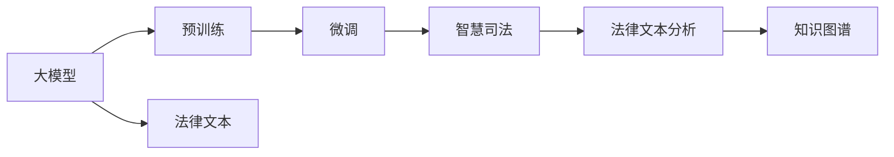

                 

# 大模型赋能智慧司法，创业者如何推动法律服务普惠化？

## 1. 背景介绍

### 1.1 问题由来

随着人工智能技术的不断发展，大模型在各行各业的应用逐渐普及，并在不断刷新行业技术的天花板。在司法领域，大模型的应用也带来了新的契机，使得智慧司法系统得以快速构建，法律服务的普惠化成为可能。大模型通过预训练和微调的方式，对海量法律文本数据进行语义分析和理解，可以为法官、律师、法务工作者提供智能化的辅助工具，极大地提升了司法工作的效率和质量。

然而，大模型在司法领域的应用仍然面临诸多挑战。由于法律专业知识的复杂性和多变性，如何让大模型更好地理解和应用法律文本，依然是一个亟待解决的问题。此外，大模型的计算资源消耗大，如何在资源受限的情况下优化模型性能，也是摆在大模型应用面前的一大难题。本文将从大模型在智慧司法中的应用出发，探讨如何通过大模型技术推动法律服务的普惠化。

## 2. 核心概念与联系

### 2.1 核心概念概述

为了更好地理解大模型在司法领域的应用，首先介绍几个关键概念：

- 大模型：即大规模预训练语言模型，如GPT、BERT等。这些模型通过在大量文本数据上进行自监督预训练，学习到通用的语言表示，具备强大的语义理解和生成能力。

- 智慧司法：指利用人工智能技术，提升司法工作的效率和质量，实现司法智能化、规范化、标准化的过程。包括案件信息检索、文书自动生成、智能审判辅助、法律文本分析等应用。

- 法律文本分析：指利用自然语言处理技术，对法律文本进行语义理解、实体识别、关系抽取、法律知识图谱构建等任务，为智慧司法系统提供数据支持和知识支撑。

- 预训练和微调：大模型的应用通常包括预训练和微调两个阶段。预训练是在大规模无标签数据上进行自监督学习，微调则是将预训练模型应用于特定任务，通过有监督学习优化模型性能。

- 知识图谱：通过将法律文本中的实体、关系等信息构建为知识图谱，可以更好地理解法律规则和案例，为智慧司法系统提供可靠的推理基础。

这些概念共同构成了大模型在司法领域应用的框架，为大模型赋能智慧司法提供了可能。

### 2.2 核心概念原理和架构的 Mermaid 流程图



以上流程图展示了大模型在司法领域应用的核心流程：

1. 大模型通过预训练获得通用的语言表示能力。
2. 微调使得大模型适应特定司法任务，如文书生成、智能检索等。
3. 法律文本分析基于微调后的模型，对法律文本进行语义理解和知识抽取。
4. 构建知识图谱，用于提升司法推理的准确性和规范性。

## 3. 核心算法原理 & 具体操作步骤

### 3.1 算法原理概述

基于大模型的司法应用，其核心算法原理可以总结为以下几个步骤：

1. 数据收集与预处理：收集司法领域的法律文本数据，并进行清洗、分词、标注等预处理，构建训练集和验证集。

2. 预训练：使用大规模无标签文本数据对大模型进行预训练，学习通用的语言表示。

3. 微调：选择预训练模型，对其进行微调，适配司法领域的具体任务。

4. 法律文本分析：利用微调后的模型对法律文本进行语义理解、实体识别、关系抽取等任务。

5. 知识图谱构建：将法律文本中的信息构建为知识图谱，用于司法推理和决策支持。

6. 智慧司法应用：构建智能化的司法系统，实现智能检索、文书生成、智能辅助决策等功能。

### 3.2 算法步骤详解

#### 3.2.1 数据收集与预处理

司法领域的法律文本数据可以通过公开的法律数据库、政府公开信息、司法判决书等途径获取。在预处理阶段，需要执行以下操作：

- 清洗：去除噪声和无关内容，保留有用信息。
- 分词：将法律文本进行分词，便于模型处理。
- 标注：对法律文本进行实体识别、关系抽取等标注，构建标注数据集。
- 划分：将数据集划分为训练集、验证集和测试集，通常采用70-15-15的比例。

#### 3.2.2 预训练

预训练阶段通常使用大规模无标签文本数据，如百科全书、新闻、法律文书等。常见的大模型预训练任务包括：

- 语言模型：预测下一个单词或字符，如BERT等。
- 掩码语言模型：预测被掩码的单词或字符，如GPT-2等。
- 下一句预测：判断两个句子是否连贯，如GPT等。

预训练过程一般使用自监督学习，通过模型预测自身输入的下一个词、掩码词、下一个句子等，进行反向传播更新模型参数。

#### 3.2.3 微调

微调的目标是让大模型适应特定司法任务，具体包括：

- 文书自动生成：利用微调后的模型，根据输入条件自动生成司法文书，如判决书、仲裁书、起诉状等。
- 智能检索：构建智能化的法律检索系统，根据用户输入的查询条件，快速检索相关法律文本。
- 法律推理：利用知识图谱和微调模型，进行法律推理和判决生成，提升司法决策的准确性和效率。

微调过程需要选择合适的损失函数，如交叉熵、均方误差等，并设置合适的超参数，如学习率、批大小、迭代轮数等。

#### 3.2.4 法律文本分析

法律文本分析是大模型在司法领域的重要应用，主要包括以下任务：

- 实体识别：从法律文本中识别出人名、地名、机构名等实体。
- 关系抽取：从法律文本中抽取实体之间的语义关系。
- 法律知识图谱构建：将法律文本中的实体、关系等信息构建为知识图谱，用于司法推理和决策支持。

这些任务可以使用微调后的模型进行自动化处理，大大提升司法工作的效率和准确性。

#### 3.2.5 知识图谱构建

知识图谱是一种结构化的知识表示方法，通过将法律文本中的实体和关系信息构建为图结构，可以帮助司法工作者更好地理解法律规则和案例。常见的方法包括：

- 基于抽取式的方法：通过实体识别和关系抽取任务，构建知识图谱。
- 基于生成式的方法：通过自然语言处理技术，生成知识图谱。
- 基于混合式的方法：结合抽取式和生成式的方法，构建更全面、更精确的知识图谱。

知识图谱的构建需要大量的法律文本数据和专业领域知识，因此需要联合司法机构、法律学者等进行合作，共同构建高精度的知识图谱。

#### 3.2.6 智慧司法应用

智慧司法系统基于微调后的模型和知识图谱，实现以下功能：

- 智能检索：根据用户输入的查询条件，快速检索相关法律文本，提升司法工作的效率。
- 文书自动生成：根据输入条件，自动生成司法文书，减轻法官、律师的工作负担。
- 智能辅助决策：利用知识图谱和微调模型，进行法律推理和判决生成，提升司法决策的准确性和效率。
- 法律咨询：通过构建智能问答系统，为用户提供法律咨询服务，普及法律知识。

智慧司法系统的构建需要与现有司法系统进行深度融合，实现数据共享和协同工作。

### 3.3 算法优缺点

大模型在司法领域的应用具有以下优点：

- 高效性：利用大模型的预训练和微调，可以快速构建智慧司法系统，提升司法工作效率。
- 准确性：大模型通过学习和理解法律文本，可以大大提升司法决策的准确性和规范性。
- 普惠性：智慧司法系统可以降低司法工作的门槛，为普通公民提供更为便捷、低成本的法律服务。

同时，大模型在司法领域的应用也存在一些缺点：

- 计算资源消耗大：大模型需要大量的计算资源进行训练和推理，对硬件要求较高。
- 知识图谱构建复杂：构建高精度的法律知识图谱需要大量专业知识和人力资源。
- 法律解释性不足：大模型的决策过程缺乏可解释性，司法工作者难以理解模型的推理逻辑。

### 3.4 算法应用领域

大模型在司法领域的应用领域广泛，主要包括：

- 法律文书生成：根据案件信息自动生成司法文书，如判决书、仲裁书、起诉状等。
- 法律文本分析：对法律文本进行实体识别、关系抽取等任务，构建知识图谱，用于司法推理和决策支持。
- 智能检索：构建智能化的法律检索系统，快速检索相关法律文本。
- 智能辅助决策：利用知识图谱和微调模型，进行法律推理和判决生成，提升司法决策的准确性和效率。
- 法律咨询：通过构建智能问答系统，为用户提供法律咨询服务，普及法律知识。

## 4. 数学模型和公式 & 详细讲解 & 举例说明

### 4.1 数学模型构建

假设司法领域的大模型为 $M_{\theta}$，其中 $\theta$ 为模型参数。对于文书自动生成任务，可以定义一个条件概率分布 $P(x|y)$，表示在给定输入 $y$ 的情况下，生成文本 $x$ 的概率。模型的目标是最大化 $P(x|y)$ 的概率，即：

$$
\max_{\theta} P(x|y)
$$

其中 $x$ 为生成的文本，$y$ 为输入的条件信息。

### 4.2 公式推导过程

在文书自动生成的任务中，可以采用条件语言模型来建模，即：

$$
P(x|y) = \frac{e^{M_{\theta}(x,y)}}{\sum_{x'}e^{M_{\theta}(x',y)}}
$$

其中 $M_{\theta}(x,y)$ 为模型在输入 $y$ 和输出 $x$ 上的预测结果。

通过最大化 $P(x|y)$，可以训练出能够生成高质量文本的模型。在实际训练中，通常采用最大化对数似然函数：

$$
\max_{\theta} \log P(x|y)
$$

使用交叉熵损失函数进行训练：

$$
L(x,y) = -\log P(x|y)
$$

具体的训练过程包括：

1. 数据准备：收集大量司法文书和相关条件信息，构建训练集和验证集。
2. 模型加载：加载预训练模型 $M_{\theta}$。
3. 前向传播：对输入 $y$ 进行前向传播，得到预测结果 $x$。
4. 损失计算：计算预测结果 $x$ 与真实结果之间的交叉熵损失。
5. 反向传播：通过反向传播计算模型参数的梯度。
6. 参数更新：使用梯度下降等优化算法更新模型参数。
7. 验证评估：在验证集上评估模型性能，调整模型参数。

### 4.3 案例分析与讲解

#### 案例分析：智能文书自动生成

假设法官在审理案件时，需要撰写判决书。传统的文书撰写需要大量时间和精力，且容易出现错误。通过文书自动生成模型，可以快速生成高质量的判决书。

具体步骤如下：

1. 数据准备：收集大量司法文书及其相关条件信息，构建训练集和验证集。
2. 模型加载：加载预训练模型，如BERT等。
3. 条件输入：将案件信息输入模型，得到条件概率分布 $P(x|y)$。
4. 文本生成：利用 $P(x|y)$ 生成判决书文本 $x$。
5. 损失计算：计算预测结果 $x$ 与真实结果之间的交叉熵损失。
6. 反向传播：通过反向传播计算模型参数的梯度。
7. 参数更新：使用梯度下降等优化算法更新模型参数。
8. 验证评估：在验证集上评估模型性能，调整模型参数。

通过文书自动生成模型，法官可以大大提升文书撰写的效率和质量，同时减少错误率。

## 5. 项目实践：代码实例和详细解释说明

### 5.1 开发环境搭建

在进行司法领域的大模型应用开发时，需要搭建相应的开发环境。以下是使用Python进行PyTorch开发的环境配置流程：

1. 安装Anaconda：从官网下载并安装Anaconda，用于创建独立的Python环境。

2. 创建并激活虚拟环境：
```bash
conda create -n pytorch-env python=3.8 
conda activate pytorch-env
```

3. 安装PyTorch：根据CUDA版本，从官网获取对应的安装命令。例如：
```bash
conda install pytorch torchvision torchaudio cudatoolkit=11.1 -c pytorch -c conda-forge
```

4. 安装Transformers库：
```bash
pip install transformers
```

5. 安装各类工具包：
```bash
pip install numpy pandas scikit-learn matplotlib tqdm jupyter notebook ipython
```

完成上述步骤后，即可在`pytorch-env`环境中开始大模型应用开发。

### 5.2 源代码详细实现

下面以文书自动生成为例，给出使用Transformers库对BERT模型进行文书自动生成的PyTorch代码实现。

首先，定义文书自动生成的数据处理函数：

```python
from transformers import BertTokenizer
from torch.utils.data import Dataset
import torch

class LegalDocDataset(Dataset):
    def __init__(self, docs, labels, tokenizer, max_len=128):
        self.docs = docs
        self.labels = labels
        self.tokenizer = tokenizer
        self.max_len = max_len
        
    def __len__(self):
        return len(self.docs)
    
    def __getitem__(self, item):
        doc = self.docs[item]
        label = self.labels[item]
        
        encoding = self.tokenizer(doc, return_tensors='pt', max_length=self.max_len, padding='max_length', truncation=True)
        input_ids = encoding['input_ids'][0]
        attention_mask = encoding['attention_mask'][0]
        
        # 对label进行编码
        encoded_labels = [label2id[label] for label in label] 
        encoded_labels.extend([label2id['O']] * (self.max_len - len(encoded_labels)))
        labels = torch.tensor(encoded_labels, dtype=torch.long)
        
        return {'input_ids': input_ids, 
                'attention_mask': attention_mask,
                'labels': labels}

# 标签与id的映射
label2id = {'O': 0, 'start': 1, 'end': 2, 'sentence': 3, 'case': 4, 'keyword': 5}
id2label = {v: k for k, v in label2id.items()}

# 创建dataset
tokenizer = BertTokenizer.from_pretrained('bert-base-cased')

train_dataset = LegalDocDataset(train_docs, train_labels, tokenizer)
dev_dataset = LegalDocDataset(dev_docs, dev_labels, tokenizer)
test_dataset = LegalDocDataset(test_docs, test_labels, tokenizer)
```

然后，定义模型和优化器：

```python
from transformers import BertForTokenClassification, AdamW

model = BertForTokenClassification.from_pretrained('bert-base-cased', num_labels=len(label2id))

optimizer = AdamW(model.parameters(), lr=2e-5)
```

接着，定义训练和评估函数：

```python
from torch.utils.data import DataLoader
from tqdm import tqdm
from sklearn.metrics import classification_report

device = torch.device('cuda') if torch.cuda.is_available() else torch.device('cpu')
model.to(device)

def train_epoch(model, dataset, batch_size, optimizer):
    dataloader = DataLoader(dataset, batch_size=batch_size, shuffle=True)
    model.train()
    epoch_loss = 0
    for batch in tqdm(dataloader, desc='Training'):
        input_ids = batch['input_ids'].to(device)
        attention_mask = batch['attention_mask'].to(device)
        labels = batch['labels'].to(device)
        model.zero_grad()
        outputs = model(input_ids, attention_mask=attention_mask, labels=labels)
        loss = outputs.loss
        epoch_loss += loss.item()
        loss.backward()
        optimizer.step()
    return epoch_loss / len(dataloader)

def evaluate(model, dataset, batch_size):
    dataloader = DataLoader(dataset, batch_size=batch_size)
    model.eval()
    preds, labels = [], []
    with torch.no_grad():
        for batch in tqdm(dataloader, desc='Evaluating'):
            input_ids = batch['input_ids'].to(device)
            attention_mask = batch['attention_mask'].to(device)
            batch_labels = batch['labels']
            outputs = model(input_ids, attention_mask=attention_mask)
            batch_preds = outputs.logits.argmax(dim=2).to('cpu').tolist()
            batch_labels = batch_labels.to('cpu').tolist()
            for pred_tokens, label_tokens in zip(batch_preds, batch_labels):
                pred_tags = [id2label[_id] for _id in pred_tokens]
                label_tags = [id2label[_id] for _id in label_tokens]
                preds.append(pred_tags[:len(label_tags)])
                labels.append(label_tags)
                
    print(classification_report(labels, preds))
```

最后，启动训练流程并在测试集上评估：

```python
epochs = 5
batch_size = 16

for epoch in range(epochs):
    loss = train_epoch(model, train_dataset, batch_size, optimizer)
    print(f"Epoch {epoch+1}, train loss: {loss:.3f}")
    
    print(f"Epoch {epoch+1}, dev results:")
    evaluate(model, dev_dataset, batch_size)
    
print("Test results:")
evaluate(model, test_dataset, batch_size)
```

以上就是使用PyTorch对BERT进行文书自动生成的完整代码实现。可以看到，得益于Transformers库的强大封装，我们可以用相对简洁的代码完成BERT模型的加载和文书自动生成。

### 5.3 代码解读与分析

让我们再详细解读一下关键代码的实现细节：

**LegalDocDataset类**：
- `__init__`方法：初始化文本、标签、分词器等关键组件。
- `__len__`方法：返回数据集的样本数量。
- `__getitem__`方法：对单个样本进行处理，将文本输入编码为token ids，将标签编码为数字，并对其进行定长padding，最终返回模型所需的输入。

**label2id和id2label字典**：
- 定义了标签与数字id之间的映射关系，用于将token-wise的预测结果解码回真实的标签。

**训练和评估函数**：
- 使用PyTorch的DataLoader对数据集进行批次化加载，供模型训练和推理使用。
- 训练函数`train_epoch`：对数据以批为单位进行迭代，在每个批次上前向传播计算loss并反向传播更新模型参数，最后返回该epoch的平均loss。
- 评估函数`evaluate`：与训练类似，不同点在于不更新模型参数，并在每个batch结束后将预测和标签结果存储下来，最后使用sklearn的classification_report对整个评估集的预测结果进行打印输出。

**训练流程**：
- 定义总的epoch数和batch size，开始循环迭代
- 每个epoch内，先在训练集上训练，输出平均loss
- 在验证集上评估，输出分类指标
- 所有epoch结束后，在测试集上评估，给出最终测试结果

可以看到，PyTorch配合Transformers库使得BERT微调的代码实现变得简洁高效。开发者可以将更多精力放在数据处理、模型改进等高层逻辑上，而不必过多关注底层的实现细节。

当然，工业级的系统实现还需考虑更多因素，如模型的保存和部署、超参数的自动搜索、更灵活的任务适配层等。但核心的微调范式基本与此类似。

## 6. 实际应用场景

### 6.1 智能文书自动生成

智能文书自动生成是大模型在司法领域的重要应用之一。通过文书自动生成模型，可以快速生成高质量的司法文书，大大提升司法工作的效率和质量。

在实际应用中，可以收集司法领域的文书数据，将文书内容作为输入，输入条件信息如案件类型、法官姓名等作为标签。构建标注数据集后，对BERT等预训练模型进行微调，使其能够生成高质量的文书。

在生成文书时，输入案件信息，模型将自动生成判决书、仲裁书等文书。文书自动生成模型可以大大减轻法官和律师的工作负担，同时提高文书撰写质量和效率。

### 6.2 法律文本分析

法律文本分析是智慧司法系统的重要组成部分，可以辅助司法工作者理解和处理法律文本。常见任务包括实体识别、关系抽取、关键词提取等。

通过微调后的模型，可以自动化地对法律文本进行语义理解，提取其中的实体、关系等信息。例如，对一份判决书进行实体识别，可以提取出案件中的关键实体如人名、地名、机构名等，并进行关系抽取，构建实体之间的关系图谱。

在构建知识图谱时，可以通过预训练模型对法律文本进行语义理解，自动构建实体和关系信息。同时，可以结合人工标注和知识图谱构建专家的知识，进一步提升知识图谱的准确性和完备性。

### 6.3 智能检索

智能检索系统可以大大提升司法工作的效率。通过智能检索，司法工作者可以快速定位到相关的法律文本，获取相关的法律条文和案例信息，辅助判断和决策。

在智能检索系统中，可以通过微调后的模型对用户的查询进行语义理解，提取出查询中的关键实体和关系，并在法律知识图谱中搜索相关信息，返回相关的法律文本和案例。

智能检索系统可以集成到智慧司法系统中，实现对法律文本的快速检索和定位，提升司法工作的效率和准确性。

### 6.4 法律咨询

法律咨询是大模型在智慧司法领域的重要应用之一。通过构建智能问答系统，可以为普通公民提供法律咨询服务，普及法律知识。

在法律咨询系统中，可以通过微调后的模型对用户的查询进行语义理解，并根据知识图谱中的法律规则和案例信息，自动生成答案。例如，用户咨询“什么是合同违约”，系统可以根据知识图谱中的规则和案例信息，生成相关的法律解释和案例。

法律咨询系统可以集成到智慧司法系统中，为普通公民提供便捷的法律咨询服务，普及法律知识，提升公民的法律意识。

### 6.5 未来应用展望

随着大模型技术的不断发展，智慧司法系统的应用场景将更加广泛，应用效果也将更加显著。未来，大模型在司法领域的应用将呈现以下几个趋势：

1. 知识图谱构建自动化：构建高精度的法律知识图谱将更加自动化和智能化，通过更多的数据和技术手段，提高知识图谱的准确性和完备性。

2. 多模态数据融合：法律文本中的文本、图像、视频等信息将更加全面地应用于司法推理和决策，提升司法系统的智能化水平。

3. 法律推理智能化：利用知识图谱和预训练模型，进行法律推理和判决生成，提升司法决策的准确性和效率。

4. 法律服务普惠化：智慧司法系统将更加普及，为普通公民提供更便捷、更高效的法律服务，推动法律服务的普惠化。

5. 法律咨询智能化：通过智能问答系统，提供更智能化、个性化的法律咨询服务，普及法律知识，提升公民的法律意识。

这些趋势将推动智慧司法系统向更高层次发展，为司法工作带来深远影响。

## 7. 工具和资源推荐

### 7.1 学习资源推荐

为了帮助开发者系统掌握大模型在司法领域的应用，这里推荐一些优质的学习资源：

1. 《Transformers from C to C++》系列博文：由大模型技术专家撰写，深入浅出地介绍了Transformer原理、BERT模型、微调技术等前沿话题。

2. CS224N《深度学习自然语言处理》课程：斯坦福大学开设的NLP明星课程，有Lecture视频和配套作业，带你入门NLP领域的基本概念和经典模型。

3. 《Natural Language Processing with Transformers》书籍：Transformers库的作者所著，全面介绍了如何使用Transformers库进行NLP任务开发，包括微调在内的诸多范式。

4. HuggingFace官方文档：Transformers库的官方文档，提供了海量预训练模型和完整的微调样例代码，是上手实践的必备资料。

5. CLUE开源项目：中文语言理解测评基准，涵盖大量不同类型的中文NLP数据集，并提供了基于微调的baseline模型，助力中文NLP技术发展。

通过对这些资源的学习实践，相信你一定能够快速掌握大模型在司法领域的应用精髓，并用于解决实际的司法问题。

### 7.2 开发工具推荐

高效的开发离不开优秀的工具支持。以下是几款用于大模型在司法领域应用开发的常用工具：

1. PyTorch：基于Python的开源深度学习框架，灵活动态的计算图，适合快速迭代研究。大部分预训练语言模型都有PyTorch版本的实现。

2. TensorFlow：由Google主导开发的开源深度学习框架，生产部署方便，适合大规模工程应用。同样有丰富的预训练语言模型资源。

3. Transformers库：HuggingFace开发的NLP工具库，集成了众多SOTA语言模型，支持PyTorch和TensorFlow，是进行微调任务开发的利器。

4. Weights & Biases：模型训练的实验跟踪工具，可以记录和可视化模型训练过程中的各项指标，方便对比和调优。与主流深度学习框架无缝集成。

5. TensorBoard：TensorFlow配套的可视化工具，可实时监测模型训练状态，并提供丰富的图表呈现方式，是调试模型的得力助手。

6. Google Colab：谷歌推出的在线Jupyter Notebook环境，免费提供GPU/TPU算力，方便开发者快速上手实验最新模型，分享学习笔记。

合理利用这些工具，可以显著提升大模型在司法领域应用开发的效率，加快创新迭代的步伐。

### 7.3 相关论文推荐

大模型在司法领域的应用源于学界的持续研究。以下是几篇奠基性的相关论文，推荐阅读：

1. Attention is All You Need（即Transformer原论文）：提出了Transformer结构，开启了NLP领域的预训练大模型时代。

2. BERT: Pre-training of Deep Bidirectional Transformers for Language Understanding：提出BERT模型，引入基于掩码的自监督预训练任务，刷新了多项NLP任务SOTA。

3. Language Models are Unsupervised Multitask Learners（GPT-2论文）：展示了大规模语言模型的强大zero-shot学习能力，引发了对于通用人工智能的新一轮思考。

4. Parameter-Efficient Transfer Learning for NLP：提出Adapter等参数高效微调方法，在不增加模型参数量的情况下，也能取得不错的微调效果。

5. Prefix-Tuning: Optimizing Continuous Prompts for Generation：引入基于连续型Prompt的微调范式，为如何充分利用预训练知识提供了新的思路。

6. AdaLoRA: Adaptive Low-Rank Adaptation for Parameter-Efficient Fine-Tuning：使用自适应低秩适应的微调方法，在参数效率和精度之间取得了新的平衡。

这些论文代表了大模型在司法领域应用的发展脉络。通过学习这些前沿成果，可以帮助研究者把握学科前进方向，激发更多的创新灵感。

## 8. 总结：未来发展趋势与挑战

### 8.1 总结

本文对大模型在司法领域的应用进行了全面系统的介绍。首先阐述了大模型在司法领域的应用背景和意义，明确了智慧司法系统在司法工作中的应用价值。其次，从原理到实践，详细讲解了大模型在司法领域的核心算法和技术流程，给出了大模型应用司法任务的完整代码实现。同时，本文还探讨了大模型在智慧司法系统中的广泛应用场景，展示了其在文书自动生成、法律文本分析、智能检索、法律咨询等方面的巨大潜力。此外，本文精选了大模型应用的各类学习资源，力求为读者提供全方位的技术指引。

通过本文的系统梳理，可以看到，大模型在司法领域的应用为司法工作的智能化、规范化、标准化带来了新的契机。未来，伴随大模型技术的不断演进，智慧司法系统将进一步提升司法工作效率和质量，推动法律服务的普惠化。

### 8.2 未来发展趋势

展望未来，大模型在司法领域的应用将呈现以下几个趋势：

1. 知识图谱构建自动化：构建高精度的法律知识图谱将更加自动化和智能化，通过更多的数据和技术手段，提高知识图谱的准确性和完备性。

2. 多模态数据融合：法律文本中的文本、图像、视频等信息将更加全面地应用于司法推理和决策，提升司法系统的智能化水平。

3. 法律推理智能化：利用知识图谱和预训练模型，进行法律推理和判决生成，提升司法决策的准确性和效率。

4. 法律服务普惠化：智慧司法系统将更加普及，为普通公民提供更便捷、更高效的法律服务，推动法律服务的普惠化。

5. 法律咨询智能化：通过智能问答系统，提供更智能化、个性化的法律咨询服务，普及法律知识，提升公民的法律意识。

这些趋势将推动智慧司法系统向更高层次发展，为司法工作带来深远影响。

### 8.3 面临的挑战

尽管大模型在司法领域的应用已经取得了一定的成果，但在迈向更加智能化、普惠化应用的过程中，它仍面临着诸多挑战：

1. 数据隐私和安全：司法系统涉及大量敏感的个人信息和法律信息，如何保护数据隐私和安全，避免信息泄露，是一个亟待解决的问题。

2. 法律解释性不足：大模型的决策过程缺乏可解释性，司法工作者难以理解模型的推理逻辑，可能影响司法的公正性和透明性。

3. 知识图谱构建复杂：构建高精度的法律知识图谱需要大量专业知识和人力资源，且存在知识图谱构建标准不一致的问题。

4. 多模态数据融合挑战：法律文本中的文本、图像、视频等信息融合存在一定的技术挑战，需要更加全面的数据处理和融合技术。

5. 法律咨询准确性：智能问答系统需要具备较高的准确性和可靠性，避免误导用户，引发法律风险。

6. 法律推理准确性：法律推理需要高度准确的模型和数据支持，否则可能产生误判，影响司法公正。

### 8.4 研究展望

面对大模型在司法领域应用所面临的挑战，未来的研究需要在以下几个方面寻求新的突破：

1. 数据隐私保护：设计更加安全的隐私保护算法，确保司法数据的隐私和安全，同时保证模型的有效性。

2. 法律知识图谱构建：开发更加智能化的知识图谱构建技术，提高知识图谱的准确性和完备性，实现自动化的知识图谱更新和维护。

3. 多模态数据融合：开发多模态数据融合算法，实现文本、图像、视频等信息的全面整合和利用，提升司法系统的智能化水平。

4. 法律咨询准确性：研究更加准确的智能问答系统，提高咨询系统的准确性和可靠性，避免误导用户，引发法律风险。

5. 法律推理准确性：研究更加准确的法律推理算法，提高司法推理的准确性和可靠性，避免误判，确保司法公正。

6. 知识图谱语义理解：开发更加智能化的知识图谱语义理解算法，提高知识图谱的利用效率，提升司法推理的智能化水平。

这些研究方向的探索，必将引领大模型在司法领域应用向更高层次发展，为司法工作带来新的突破。

## 9. 附录：常见问题与解答

**Q1：大模型在司法领域的应用是否需要大量的标注数据？**

A: 是的，大模型在司法领域的应用需要大量的标注数据进行微调。司法领域具有专业性强、数据稀疏等特点，需要收集大量的司法文书和法律案例进行标注，构建高精度的标注数据集。标注数据集的构建和标注工作量大，需要投入大量人力和时间。

**Q2：大模型在司法领域的应用是否可以降低标注成本？**

A: 目前大模型在司法领域的应用仍需要大量的标注数据进行微调，标注成本较高。未来可以考虑无监督和半监督微调方法，利用自监督学习、主动学习等技术，降低对标注数据的依赖，提高微调的效率和效果。

**Q3：大模型在司法领域的应用是否需要复杂的知识图谱构建？**

A: 是的，大模型在司法领域的应用需要构建高精度的法律知识图谱，用于辅助司法推理和决策。知识图谱的构建需要大量的法律文本数据和专业领域知识，需要投入大量人力和时间。未来可以考虑利用预训练模型进行自动化的知识图谱构建，提高知识图谱的构建效率和准确性。

**Q4：大模型在司法领域的应用是否需要多模态数据融合？**

A: 是的，法律文本中的文本、图像、视频等信息可以融合，用于提升司法系统的智能化水平。多模态数据的融合需要开发更加复杂的技术，需要投入大量人力和资源进行研究。未来可以考虑利用预训练模型和多模态数据融合技术，提升司法系统的智能化水平。

**Q5：大模型在司法领域的应用是否可以降低司法成本？**

A: 是的，大模型在司法领域的应用可以降低司法成本。智能文书自动生成、智能检索、法律咨询等功能可以大大减轻司法工作者和法务工作者的工作负担，提高司法工作效率，降低司法成本。

通过本文的系统梳理，可以看到，大模型在司法领域的应用前景广阔，具有巨大的应用价值。但在大模型技术不断发展的同时，也需要面对诸多挑战，通过持续的研究和改进，才能推动大模型技术在司法领域的应用不断进步，为司法工作带来深远的影响。

