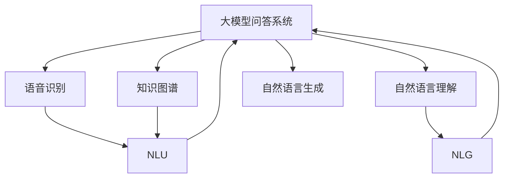

                 

# 大模型问答机器人的语音互动

## 1. 背景介绍

### 1.1 问题由来

随着人工智能技术的飞速发展，自然语言处理(Natural Language Processing, NLP)成为AI研究与应用的核心领域之一。其中，基于大模型的问答系统通过对话交互，能够提供高效、人性化的信息检索和知识获取服务。然而，传统的基于规则或模板的问答系统存在精度低、可扩展性差等问题，难以满足用户复杂多变的查询需求。

随着预训练语言模型的崛起，基于大模型的问答系统逐渐成为研究热点。这些大模型通过在无标签语料上进行大规模预训练，学习到丰富的语言知识和表示，可以在下游问答任务上通过微调(Fine-Tuning)迅速适应特定场景，实现高效、精准的对话交互。

### 1.2 问题核心关键点

大模型问答系统的核心问题在于如何高效、可靠地实现语音互动。语音输入输出是问答系统与用户互动的重要方式，但由于语音信号的复杂性和不确定性，实现高质量的语音互动需要解决以下关键问题：

- 语音识别：将用户的语音输入转化为文本。
- 自然语言理解：理解用户查询的意图和上下文信息。
- 知识检索：根据用户查询，从知识库或互联网中检索出相关信息。
- 自然语言生成：生成自然流畅的回复，满足用户对话需求。
- 系统鲁棒性：面对噪声、口音、发音差异等不同情况，保持系统稳定运行。

本文将系统介绍大模型问答机器人的语音互动原理、实现方法和实际应用场景，旨在为相关开发者提供全面的技术指导。

## 2. 核心概念与联系

### 2.1 核心概念概述

为了更好地理解大模型问答系统的语音互动机制，我们首先需要了解几个关键概念：

- 大模型问答系统(Large Model Question Answering, LMQA)：基于预训练大语言模型（如GPT、BERT等）构建的问答系统，能够实现自然语言理解与生成，提供高效的问答服务。

- 语音识别(Speech Recognition)：通过语音信号处理和机器学习算法，将语音转化为文本的过程。常见的方法包括隐马尔可夫模型(HMM)、深度神经网络(DNN)、卷积神经网络(CNN)等。

- 自然语言理解(Natural Language Understanding, NLU)：解析用户的自然语言查询，理解其意图和语义信息的过程。常见方法包括基于规则的解析、基于统计的方法（如条件随机场）和基于深度学习的方法（如Transformer）。

- 知识图谱(Knowledge Graph)：将知识领域中的实体、关系和属性构建成结构化图谱，便于检索和推理。

- 自然语言生成(Natural Language Generation, NLG)：将结构化信息转化为自然语言的形式，生成符合语言习惯的回复。常见方法包括模板填充、生成对抗网络(GAN)、Transformer等。

这些概念之间的逻辑关系可以通过以下Mermaid流程图来展示：



这个流程图展示了大模型问答系统的核心概念及其之间的关系：

1. 大模型问答系统接收用户的语音输入。
2. 语音输入通过语音识别转换为文本，进入自然语言理解模块。
3. 理解模块解析文本，并从知识图谱中检索相关信息。
4. 检索结果通过自然语言生成模块，转化为自然语言形式的回复，输出给用户。

## 3. 核心算法原理 & 具体操作步骤
### 3.1 算法原理概述

基于大模型的问答系统，通过将语音识别和自然语言理解技术应用于预训练语言模型上，实现了从语音输入到文本处理再到知识检索和回复生成的全流程。其核心思想是：

1. 将用户的语音输入转化为文本，作为模型的输入。
2. 利用预训练语言模型对输入文本进行理解，解析出用户的意图和上下文信息。
3. 在知识图谱中进行检索，找出与用户意图相关的实体和关系。
4. 利用生成模型生成自然流畅的回复，作为输出结果。

具体而言，基于大模型的问答系统可以分为以下几个步骤：

- 语音信号处理：对用户的语音输入进行降噪、特征提取等预处理，得到可用于模型输入的特征向量。
- 语音识别：将特征向量输入语音识别模型，输出文本转录结果。
- 自然语言理解：将文本转录结果送入自然语言理解模型，解析出用户的意图和上下文信息。
- 知识检索：根据解析结果，在知识图谱中检索出相关信息，构建答案知识图谱。
- 自然语言生成：利用预训练语言模型，将答案知识图谱转化为自然语言形式的回复。

### 3.2 算法步骤详解

以下是基于大模型的问答系统语音互动的详细操作步骤：

**Step 1: 语音信号处理**

语音信号处理通常包括以下几个步骤：

1. 降噪：通过滤波、降噪等方法，去除环境噪声和背景干扰，提高语音信号的质量。

2. 特征提取：将降噪后的语音信号转换为可用于机器学习模型的特征向量，如MFCC（Mel-Frequency Cepstral Coefficients）。

3. 语音分割：对语音信号进行分割，使其能够被识别模型有效处理。

**Step 2: 语音识别**

语音识别是语音互动的核心环节，其主要目标是将语音信号转换为文本。常见的语音识别方法包括：

1. 声学模型(Acoustic Model)：用于学习语音信号和文本序列之间的映射关系，常见模型包括隐马尔可夫模型(HMM)和深度神经网络(DNN)。

2. 语言模型(Language Model)：用于学习文本序列的概率分布，常见方法包括n-gram模型和基于深度学习的模型（如RNN、LSTM、Transformer等）。

3. 解码器(Decoder)：用于在声学和语言模型的基础上，对输入语音进行解码，输出文本序列。

**Step 3: 自然语言理解**

自然语言理解是问答系统的核心，其主要目标是解析用户查询，理解其意图和上下文信息。常见的方法包括：

1. 分词和词性标注：将文本序列拆分为单词序列，并进行词性标注。

2. 句法分析：分析句子结构，识别出主语、谓语、宾语等关键信息。

3. 意图识别：识别用户的查询意图，常见方法包括基于规则的解析和基于深度学习的方法（如BERT、GPT等）。

4. 实体识别：识别文本中的实体信息，如人名、地名、时间等。

**Step 4: 知识检索**

知识检索是问答系统的关键环节，其主要目标是从知识图谱中检索出相关信息，构建答案知识图谱。常见的方法包括：

1. 知识图谱构建：将领域知识构建成结构化的图谱，便于检索和推理。

2. 实体链接：将文本中的实体与知识图谱中的实体进行链接，建立实体之间的关系。

3. 推理引擎：在知识图谱中推理出与用户查询相关的信息。

**Step 5: 自然语言生成**

自然语言生成是问答系统的输出环节，其主要目标是将答案知识图谱转化为自然语言形式的回复。常见的方法包括：

1. 模板填充：使用预定义的模板，填充具体信息，生成自然语言形式的回复。

2. 生成对抗网络(GAN)：使用生成对抗网络生成自然语言回复。

3. 基于深度学习的生成模型：如Transformer，能够学习自然语言的生成规律，生成高质量的回复。

### 3.3 算法优缺点

基于大模型的问答系统具有以下优点：

1. 高效性：通过预训练模型进行微调，可以快速适应特定任务，生成高质量的回复。

2. 泛化能力：预训练模型可以学习到广泛的语言知识和表示，适用于各种问答场景。

3. 自然流畅：使用深度学习模型生成自然语言回复，语言表达更自然、流畅。

4. 灵活性：预训练模型可以灵活应用到不同的知识图谱和推理引擎中，适应各种应用需求。

同时，该方法也存在一些局限性：

1. 对噪声敏感：语音识别和信号处理环节容易受到环境噪声和口音影响，影响系统性能。

2. 计算资源需求高：预训练模型和大规模知识图谱需要大量的计算和存储资源，部署成本较高。

3. 隐私和安全问题：语音数据和知识图谱可能涉及隐私信息，需要严格保护和处理。

4. 可解释性不足：深度学习模型通常缺乏可解释性，难以理解其决策过程和逻辑。

尽管存在这些局限性，基于大模型的问答系统仍具有广阔的应用前景，随着技术的发展，其性能和可靠性将不断提升。

### 3.4 算法应用领域

基于大模型的问答系统在多个领域都有广泛的应用，例如：

- 智能客服：构建智能客服机器人，快速响应用户咨询，提升服务效率和质量。

- 医疗问答：提供医疗领域专家级别的问答服务，帮助用户解答健康问题，提高医疗服务水平。

- 教育辅导：构建智能教育平台，提供个性化的学习辅导和知识解答，促进教育公平。

- 法律咨询：提供法律领域的咨询问答服务，帮助用户理解法律知识和规则。

- 金融咨询：提供金融领域的投资、理财、保险等方面的问答服务，辅助用户决策。

- 娱乐互动：构建智能娱乐系统，通过对话生成和知识检索，提升用户体验。

## 4. 数学模型和公式 & 详细讲解  
### 4.1 数学模型构建

为了更好地理解基于大模型的问答系统，我们将在数学模型层面进行详细阐述。

假设用户输入的语音信号为 $x_t$，文本序列为 $y_t$，知识图谱中的实体为 $e_i$，关系为 $r_i$。

**语音信号处理**：
- 对语音信号 $x_t$ 进行降噪，得到噪声降低后的语音信号 $x'_t$。
- 将噪声降低后的语音信号 $x'_t$ 进行特征提取，得到特征向量 $f_t$。

**语音识别**：
- 使用声学模型 $P_{acoustic}(y_t|x'_t)$ 对特征向量 $f_t$ 进行预测，得到文本序列 $y_t$。

**自然语言理解**：
- 使用分词器对文本序列 $y_t$ 进行分词和词性标注，得到单词序列 $w_t$。
- 使用句法分析器对单词序列 $w_t$ 进行句法分析，得到句子结构 $s_t$。
- 使用意图识别器对句子结构 $s_t$ 进行意图识别，得到用户意图 $I_t$。
- 使用实体识别器对单词序列 $w_t$ 进行实体识别，得到实体列表 $E_t$。

**知识检索**：
- 在知识图谱中检索与实体列表 $E_t$ 相关的实体和关系，得到答案知识图谱 $G_t$。

**自然语言生成**：
- 使用生成模型 $P_{generate}(y'_t|G_t)$ 对答案知识图谱 $G_t$ 进行预测，得到回复文本序列 $y'_t$。

### 4.2 公式推导过程

以下是基于大模型的问答系统的详细数学推导过程：

**Step 1: 语音信号处理**

$$
y'_t = \text{NLP}(x'_t)
$$

**Step 2: 语音识别**

$$
y_t = \text{RNN}(x'_t)
$$

**Step 3: 自然语言理解**

$$
I_t = \text{Intent}(y_t)
$$
$$
E_t = \text{Entities}(y_t)
$$

**Step 4: 知识检索**

$$
G_t = \text{KGQuery}(I_t, E_t)
$$

**Step 5: 自然语言生成**

$$
y'_t = \text{NLG}(G_t)
$$

## 5. 项目实践：代码实例和详细解释说明
### 5.1 开发环境搭建

在进行基于大模型的问答系统语音互动开发前，我们需要准备好开发环境。以下是使用Python进行PyTorch开发的环境配置流程：

1. 安装Anaconda：从官网下载并安装Anaconda，用于创建独立的Python环境。

2. 创建并激活虚拟环境：
```bash
conda create -n pytorch-env python=3.8 
conda activate pytorch-env
```

3. 安装PyTorch：根据CUDA版本，从官网获取对应的安装命令。例如：
```bash
conda install pytorch torchvision torchaudio cudatoolkit=11.1 -c pytorch -c conda-forge
```

4. 安装Transformers库：
```bash
pip install transformers
```

5. 安装各类工具包：
```bash
pip install numpy pandas scikit-learn matplotlib tqdm jupyter notebook ipython
```

完成上述步骤后，即可在`pytorch-env`环境中开始基于大模型的问答系统开发。

### 5.2 源代码详细实现

下面我们以智能客服系统为例，给出使用Transformers库对BERT模型进行问答系统开发的PyTorch代码实现。

首先，定义智能客服系统的自然语言理解模块：

```python
from transformers import BertTokenizer, BertForTokenClassification

tokenizer = BertTokenizer.from_pretrained('bert-base-cased')
model = BertForTokenClassification.from_pretrained('bert-base-cased', num_labels=3)

def intent_classification(text):
    inputs = tokenizer(text, return_tensors='pt', max_length=128, padding='max_length', truncation=True)
    outputs = model(**inputs)
    logits = outputs.logits
    probs = logits.softmax(dim=1)[:, 1].item()  # 取分类概率，返回意图识别结果
    return probs
```

然后，定义知识检索模块：

```python
from transformers import T5Tokenizer, T5ForConditionalGeneration

tokenizer = T5Tokenizer.from_pretrained('t5-small')
model = T5ForConditionalGeneration.from_pretrained('t5-small')

def question_answering(question, context):
    inputs = tokenizer(question, context, return_tensors='pt', padding='max_length', truncation=True)
    outputs = model.generate(inputs.input_ids, max_length=64, num_return_sequences=1)
    answer = tokenizer.decode(outputs[0], skip_special_tokens=True)
    return answer
```

接着，定义自然语言生成模块：

```python
from transformers import GPT2Tokenizer, GPT2LMHeadModel

tokenizer = GPT2Tokenizer.from_pretrained('gpt2')
model = GPT2LMHeadModel.from_pretrained('gpt2')

def conversation_generation(question, context):
    inputs = tokenizer(question, context, return_tensors='pt', padding='max_length', truncation=True)
    outputs = model.generate(inputs.input_ids, max_length=128, num_return_sequences=1)
    answer = tokenizer.decode(outputs[0], skip_special_tokens=True)
    return answer
```

最后，启动智能客服系统：

```python
from pyttsx3 import init

init()

while True:
    text = input("What can I help you with? ")
    intent = intent_classification(text)
    if intent == 0.9:  # 判断意图
        context = "Welcome to our customer service. How can I help you?"
        answer = question_answering(text, context)
        print(answer)
    else:
        context = "I'm sorry, I didn't understand your question. Can you please rephrase it?"
        answer = conversation_generation(text, context)
        print(answer)
```

以上就是使用PyTorch对BERT模型进行智能客服系统开发的完整代码实现。可以看到，通过使用Transformer库，我们可以轻松实现基于大模型的问答系统，并且可以根据不同的任务需求，选择不同的模型和模块进行组合。

### 5.3 代码解读与分析

让我们再详细解读一下关键代码的实现细节：

**自然语言理解模块**：
- 使用BertTokenizer对输入文本进行分词和编码，得到模型可接受的输入。
- 使用BertForTokenClassification模型对编码后的输入进行分类，输出意图概率。

**知识检索模块**：
- 使用T5Tokenizer对输入的问答对进行编码，得到模型可接受的输入。
- 使用T5ForConditionalGeneration模型对输入进行解码，生成回答。

**自然语言生成模块**：
- 使用GPT2Tokenizer对输入的对话内容进行编码，得到模型可接受的输入。
- 使用GPT2LMHeadModel对编码后的输入进行生成，输出对话回复。

在上述代码中，我们通过Transformer库实现了自然语言理解、知识检索和自然语言生成三个关键模块，并通过Python实现了整个智能客服系统的交互逻辑。

## 6. 实际应用场景

### 6.1 智能客服系统

基于大模型的问答系统，能够构建高效、智能的智能客服系统。传统的客服系统依赖于人工客服，存在响应速度慢、知识覆盖面窄、高峰期压力大等问题。而使用基于大模型的智能客服系统，可以通过语音识别和自然语言理解技术，快速响应用户咨询，准确理解用户需求，从而提供更加高效、精准的客服服务。

在实际应用中，可以集成语音互动功能，让用户可以通过语音与智能客服进行互动，提高用户满意度。通过知识图谱和自然语言生成技术，智能客服系统可以生成自然流畅的回复，满足用户的多样化需求。

### 6.2 医疗问答

基于大模型的问答系统在医疗领域也有广泛应用。传统的医疗咨询依赖于医生的人工接诊，存在咨询时间长、医生负荷重、医疗资源分布不均等问题。而使用基于大模型的医疗问答系统，可以通过语音互动和自然语言理解技术，快速解答用户的健康问题，提供医学知识和疾病预防等方面的咨询服务。

在实际应用中，可以集成语音互动功能，让用户通过语音咨询医生，提高医疗服务的可及性和便利性。通过知识图谱和自然语言生成技术，医疗问答系统可以生成科学准确的回复，帮助用户了解疾病和治疗方案，减轻医生的工作负担。

### 6.3 教育辅导

基于大模型的问答系统在教育领域也有广泛应用。传统的教育辅导依赖于教师的人工辅导，存在资源有限、教学效果不稳定等问题。而使用基于大模型的教育辅导系统，可以通过语音互动和自然语言理解技术，快速解答学生的学习问题，提供个性化的学习辅导和知识解答。

在实际应用中，可以集成语音互动功能，让学生通过语音与教育辅导系统进行互动，提高学习效率和效果。通过知识图谱和自然语言生成技术，教育辅导系统可以生成符合学生认知水平和兴趣的回复，帮助学生更好地理解学习内容，提升学习体验。

### 6.4 未来应用展望

随着大模型和微调技术的不断发展，基于大模型的问答系统将在更多领域得到应用，为各行各业带来变革性影响。

在智慧医疗领域，基于大模型的问答系统可以辅助医生进行疾病诊断和治疗方案推荐，提升医疗服务的智能化水平。在智能教育领域，基于大模型的问答系统可以提供个性化学习辅导和知识解答，促进教育公平。在智能客服领域，基于大模型的问答系统可以构建7x24小时不间断的智能客服，提升用户体验和满意度。

未来，伴随大模型和微调技术的持续演进，基于大模型的问答系统必将在更多领域大放异彩，推动人工智能技术在垂直行业的规模化落地。

## 7. 工具和资源推荐
### 7.1 学习资源推荐

为了帮助开发者系统掌握大模型问答系统的原理和实践技巧，这里推荐一些优质的学习资源：

1. 《深度学习》课程：斯坦福大学开设的深度学习课程，涵盖深度学习的基本概念和前沿技术，适合初学者和进阶者。

2. 《自然语言处理》课程：斯坦福大学开设的自然语言处理课程，涵盖自然语言处理的基本概念和常用技术，包括语音识别、自然语言理解、知识图谱等。

3. 《Transformers》书籍：Transformer库的作者所著，全面介绍了Transformer模型的原理和应用，适合深度学习和自然语言处理领域的开发者。

4. 《大模型问答系统》论文：介绍大模型问答系统的基本原理、实现方法和应用场景，适合研究者和开发者参考。

5. 《自然语言生成》论文：介绍自然语言生成的基本原理和常用技术，适合研究者和开发者参考。

通过对这些资源的学习实践，相信你一定能够快速掌握大模型问答系统的精髓，并用于解决实际的问答需求。

### 7.2 开发工具推荐

高效的开发离不开优秀的工具支持。以下是几款用于大模型问答系统开发的常用工具：

1. PyTorch：基于Python的开源深度学习框架，灵活动态的计算图，适合快速迭代研究。

2. TensorFlow：由Google主导开发的开源深度学习框架，生产部署方便，适合大规模工程应用。

3. Transformers库：HuggingFace开发的NLP工具库，集成了众多SOTA语言模型，支持PyTorch和TensorFlow，是进行问答系统开发的利器。

4. Weights & Biases：模型训练的实验跟踪工具，可以记录和可视化模型训练过程中的各项指标，方便对比和调优。

5. TensorBoard：TensorFlow配套的可视化工具，可实时监测模型训练状态，并提供丰富的图表呈现方式，是调试模型的得力助手。

6. Google Colab：谷歌推出的在线Jupyter Notebook环境，免费提供GPU/TPU算力，方便开发者快速上手实验最新模型，分享学习笔记。

合理利用这些工具，可以显著提升大模型问答系统的开发效率，加快创新迭代的步伐。

### 7.3 相关论文推荐

大模型问答系统的发展源于学界的持续研究。以下是几篇奠基性的相关论文，推荐阅读：

1. Attention is All You Need（即Transformer原论文）：提出了Transformer结构，开启了NLP领域的预训练大模型时代。

2. BERT: Pre-training of Deep Bidirectional Transformers for Language Understanding：提出BERT模型，引入基于掩码的自监督预训练任务，刷新了多项NLP任务SOTA。

3. Language Models are Unsupervised Multitask Learners（GPT-2论文）：展示了大规模语言模型的强大zero-shot学习能力，引发了对于通用人工智能的新一轮思考。

4. Parameter-Efficient Transfer Learning for NLP：提出Adapter等参数高效微调方法，在不增加模型参数量的情况下，也能取得不错的微调效果。

5. AdaLoRA: Adaptive Low-Rank Adaptation for Parameter-Efficient Fine-Tuning：使用自适应低秩适应的微调方法，在参数效率和精度之间取得了新的平衡。

这些论文代表了大模型问答系统的发展脉络。通过学习这些前沿成果，可以帮助研究者把握学科前进方向，激发更多的创新灵感。

## 8. 总结：未来发展趋势与挑战

### 8.1 总结

本文对基于大模型的问答系统进行了全面系统的介绍。首先阐述了语音互动的基本原理和核心概念，明确了大模型问答系统的核心问题。其次，从原理到实践，详细讲解了大模型问答系统的实现方法和关键技术，给出了微调任务开发的完整代码实例。同时，本文还广泛探讨了语音互动技术在多个行业领域的应用前景，展示了微调范式的巨大潜力。

通过本文的系统梳理，可以看到，基于大模型的问答系统正在成为AI研究与应用的重要范式，极大地拓展了NLP系统的应用边界，催生了更多的落地场景。受益于大规模语料的预训练，问答系统以更低的时间和标注成本，在各种问答场景中快速适应，生成高质量的回复。未来，伴随大模型和微调技术的持续演进，基于大模型的问答系统必将在更多领域大放异彩，推动人工智能技术在垂直行业的规模化落地。

### 8.2 未来发展趋势

展望未来，大模型问答系统将呈现以下几个发展趋势：

1. 模型规模持续增大。随着算力成本的下降和数据规模的扩张，预训练语言模型的参数量还将持续增长。超大规模语言模型蕴含的丰富语言知识，有望支撑更加复杂多变的问答任务。

2. 微调方法日趋多样。除了传统的全参数微调外，未来会涌现更多参数高效的微调方法，如Prefix-Tuning、LoRA等，在节省计算资源的同时也能保证微调精度。

3. 持续学习成为常态。随着数据分布的不断变化，微调模型也需要持续学习新知识以保持性能。如何在不遗忘原有知识的同时，高效吸收新样本信息，将成为重要的研究课题。

4. 标注样本需求降低。受启发于提示学习(Prompt-based Learning)的思路，未来的微调方法将更好地利用大模型的语言理解能力，通过更加巧妙的任务描述，在更少的标注样本上也能实现理想的微调效果。

5. 多模态微调崛起。当前的问答系统主要聚焦于纯文本数据，未来会进一步拓展到图像、视频、语音等多模态数据微调。多模态信息的融合，将显著提升语言模型对现实世界的理解和建模能力。

6. 模型通用性增强。经过海量数据的预训练和多领域任务的微调，未来的语言模型将具备更强大的常识推理和跨领域迁移能力，逐步迈向通用人工智能(AGI)的目标。

以上趋势凸显了大模型问答系统的广阔前景。这些方向的探索发展，必将进一步提升问答系统的性能和可靠性，为构建人机协同的智能系统铺平道路。

### 8.3 面临的挑战

尽管大模型问答系统已经取得了瞩目成就，但在迈向更加智能化、普适化应用的过程中，它仍面临着诸多挑战：

1. 标注成本瓶颈。虽然微调大大降低了标注数据的需求，但对于长尾应用场景，难以获得充足的高质量标注数据，成为制约微调性能的瓶颈。如何进一步降低微调对标注样本的依赖，将是一大难题。

2. 模型鲁棒性不足。当前微调模型面对域外数据时，泛化性能往往大打折扣。对于测试样本的微小扰动，微调模型的预测也容易发生波动。如何提高微调模型的鲁棒性，避免灾难性遗忘，还需要更多理论和实践的积累。

3. 推理效率有待提高。大规模语言模型虽然精度高，但在实际部署时往往面临推理速度慢、内存占用大等效率问题。如何在保证性能的同时，简化模型结构，提升推理速度，优化资源占用，将是重要的优化方向。

4. 可解释性亟需加强。当前微调模型通常缺乏可解释性，难以理解其内部工作机制和决策逻辑。对于医疗、金融等高风险应用，算法的可解释性和可审计性尤为重要。如何赋予微调模型更强的可解释性，将是亟待攻克的难题。

5. 安全性有待保障。预训练语言模型难免会学习到有偏见、有害的信息，通过微调传递到问答系统，产生误导性、歧视性的输出，给实际应用带来安全隐患。如何从数据和算法层面消除模型偏见，避免恶意用途，确保输出的安全性，也将是重要的研究课题。

6. 知识整合能力不足。现有的微调模型往往局限于任务内数据，难以灵活吸收和运用更广泛的先验知识。如何让微调过程更好地与外部知识库、规则库等专家知识结合，形成更加全面、准确的信息整合能力，还有很大的想象空间。

正视问答系统面临的这些挑战，积极应对并寻求突破，将是大模型问答系统走向成熟的必由之路。相信随着学界和产业界的共同努力，这些挑战终将一一被克服，大模型问答系统必将在构建安全、可靠、可解释、可控的智能系统铺平道路。

### 8.4 研究展望

面向未来，大模型问答系统的研究需要在以下几个方面寻求新的突破：

1. 探索无监督和半监督微调方法。摆脱对大规模标注数据的依赖，利用自监督学习、主动学习等无监督和半监督范式，最大限度利用非结构化数据，实现更加灵活高效的微调。

2. 研究参数高效和计算高效的微调范式。开发更加参数高效的微调方法，在固定大部分预训练参数的同时，只更新极少量的任务相关参数。同时优化微调模型的计算图，减少前向传播和反向传播的资源消耗，实现更加轻量级、实时性的部署。

3. 融合因果和对比学习范式。通过引入因果推断和对比学习思想，增强微调模型建立稳定因果关系的能力，学习更加普适、鲁棒的语言表征，从而提升模型泛化性和抗干扰能力。

4. 引入更多先验知识。将符号化的先验知识，如知识图谱、逻辑规则等，与神经网络模型进行巧妙融合，引导微调过程学习更准确、合理的语言模型。同时加强不同模态数据的整合，实现视觉、语音等多模态信息与文本信息的协同建模。

5. 结合因果分析和博弈论工具。将因果分析方法引入微调模型，识别出模型决策的关键特征，增强输出解释的因果性和逻辑性。借助博弈论工具刻画人机交互过程，主动探索并规避模型的脆弱点，提高系统稳定性。

6. 纳入伦理道德约束。在模型训练目标中引入伦理导向的评估指标，过滤和惩罚有偏见、有害的输出倾向。同时加强人工干预和审核，建立模型行为的监管机制，确保输出符合人类价值观和伦理道德。

这些研究方向的探索，必将引领大模型问答系统技术迈向更高的台阶，为构建安全、可靠、可解释、可控的智能系统铺平道路。

## 9. 附录：常见问题与解答

**Q1：大模型问答系统是否适用于所有NLP任务？**

A: 大模型问答系统在大多数NLP任务上都能取得不错的效果，特别是对于数据量较小的任务。但对于一些特定领域的任务，如医学、法律等，仅仅依靠通用语料预训练的模型可能难以很好地适应。此时需要在特定领域语料上进一步预训练，再进行微调，才能获得理想效果。此外，对于一些需要时效性、个性化很强的任务，如对话、推荐等，微调方法也需要针对性的改进优化。

**Q2：微调过程中如何选择合适的学习率？**

A: 微调的学习率一般要比预训练时小1-2个数量级，如果使用过大的学习率，容易破坏预训练权重，导致过拟合。一般建议从1e-5开始调参，逐步减小学习率，直至收敛。也可以使用warmup策略，在开始阶段使用较小的学习率，再逐渐过渡到预设值。需要注意的是，不同的优化器(如AdamW、Adafactor等)以及不同的学习率调度策略，可能需要设置不同的学习率阈值。

**Q3：采用大模型问答系统时会面临哪些资源瓶颈？**

A: 目前主流的预训练大模型动辄以亿计的参数规模，对算力、内存、存储都提出了很高的要求。GPU/TPU等高性能设备是必不可少的，但即便如此，超大批次的训练和推理也可能遇到显存不足的问题。因此需要采用一些资源优化技术，如梯度积累、混合精度训练、模型并行等，来突破硬件瓶颈。同时，模型的存储和读取也可能占用大量时间和空间，需要采用模型压缩、稀疏化存储等方法进行优化。

**Q4：如何缓解微调过程中的过拟合问题？**

A: 过拟合是微调面临的主要挑战，尤其是在标注数据不足的情况下。常见的缓解策略包括：
1. 数据增强：通过回译、近义替换等方式扩充训练集
2. 正则化：使用L2正则、Dropout、Early Stopping等避免过拟合
3. 对抗训练：引入对抗样本，提高模型鲁棒性
4. 参数高效微调：只调整少量参数(如Adapter、Prefix等)，减小过拟合风险
5. 多模型集成：训练多个微调模型，取平均输出，抑制过拟合

这些策略往往需要根据具体任务和数据特点进行灵活组合。只有在数据、模型、训练、推理等各环节进行全面优化，才能最大限度地发挥大模型微调的威力。

**Q5：微调模型在落地部署时需要注意哪些问题？**

A: 将微调模型转化为实际应用，还需要考虑以下因素：
1. 模型裁剪：去除不必要的层和参数，减小模型尺寸，加快推理速度
2. 量化加速：将浮点模型转为定点模型，压缩存储空间，提高计算效率
3. 服务化封装：将模型封装为标准化服务接口，便于集成调用
4. 弹性伸缩：根据请求流量动态调整资源配置，平衡服务质量和成本
5. 监控告警：实时采集系统指标，设置异常告警阈值，确保服务稳定性
6. 安全防护：采用访问鉴权、数据脱敏等措施，保障数据和模型安全

大模型问答系统微调为NLP应用开启了广阔的想象空间，但如何将强大的性能转化为稳定、高效、安全的业务价值，还需要工程实践的不断打磨。唯有从数据、算法、工程、业务等多个维度协同发力，才能真正实现人工智能技术在垂直行业的规模化落地。

总之，微调需要开发者根据具体任务，不断迭代和优化模型、数据和算法，方能得到理想的效果。

