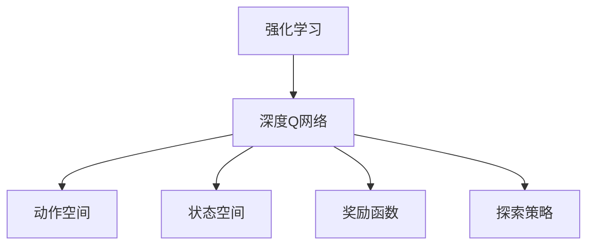

                 

# 大语言模型原理与工程实践：DQN 训练：探索策略

> 关键词：强化学习,深度Q网络,动作空间,状态空间,奖励函数,探索策略

## 1. 背景介绍

### 1.1 问题由来

强化学习（Reinforcement Learning, RL）是一种通过试错的方式，让智能体（agent）在环境中学习最佳策略的机器学习方法。在RL中，智能体通过与环境的交互，逐步学习如何在给定状态下选择最佳动作，以最大化长期奖励。

在传统RL中，智能体的动作空间和状态空间是有限的，因此可以使用静态状态表示和线性函数逼近策略。但在大规模环境如游戏AI中，智能体可能面临连续的动作空间和状态空间，传统的静态方法难以适用。

深度强化学习（Deep Reinforcement Learning, DRL）是近年来取得突破的新方向。通过将深度神经网络（Deep Neural Network, DNN）引入到策略函数中，DRL能够处理高维、非线性的状态表示，实现更加灵活和高效的策略学习。其中，深度Q网络（Deep Q-Network, DQN）是最为典型的DRL模型，本文将重点探讨DQN训练过程中的策略选择和探索策略设计。

### 1.2 问题核心关键点

DQN训练的核心在于如何设计有效的探索策略，以在训练初期快速探索最优策略。传统的ε-greedy策略已被证明在实践中效果有限，无法满足高维度状态空间下的有效探索需求。

此外，DQN的训练过程中还面临以下挑战：

- 如何处理连续动作空间，特别是高维连续动作空间。
- 如何平衡探索与利用的关系，避免过早陷入局部最优解。
- 如何控制训练过程的稳定性，避免过拟合和欠拟合。
- 如何优化目标网络（Target Network）的设计，确保目标网络能够提供有效的目标值。

### 1.3 问题研究意义

探索策略的设计和优化是DQN训练的关键问题之一。通过合理设计探索策略，可以在保证模型训练效率的同时，加速模型收敛，提高最终性能。此外，探索策略的选择也与模型泛化能力和鲁棒性密切相关，是模型稳定性和可靠性的重要保障。

本文将从算法原理、具体操作步骤、数学模型、项目实践等多个角度深入探讨DQN训练中的策略选择和探索策略设计，为DRL模型的工程实践提供参考和借鉴。

## 2. 核心概念与联系

### 2.1 核心概念概述

- **深度Q网络（Deep Q-Network, DQN）**：将深度神经网络引入到Q-learning中，用于学习状态-动作-奖励映射的模型。
- **探索策略（Exploration Strategy）**：在训练过程中，智能体如何选择探索动作，以达到快速探索最优策略的目的。
- **动作空间（Action Space）**：智能体可以采取的所有动作的集合。
- **状态空间（State Space）**：智能体所在环境的状态集合。
- **奖励函数（Reward Function）**：根据智能体的行为和状态，给予的奖励或惩罚值。

### 2.2 核心概念原理和架构的 Mermaid 流程图



这个流程图展示了深度强化学习中的核心概念及其相互关系。深度Q网络利用神经网络逼近Q值函数，动作空间和状态空间提供了智能体可行的行为和环境状态，奖励函数指导智能体的行为选择，探索策略则决定了智能体在每个时间步如何进行选择。

## 3. 核心算法原理 & 具体操作步骤

### 3.1 算法原理概述

DQN训练的目标是通过学习Q值函数，最大化长期奖励。具体而言，智能体在每个时间步根据当前状态选择动作，并接收环境反馈，包括状态转移和新奖励。智能体使用Q值函数预测未来奖励的期望值，更新策略，以最大化期望奖励。

在实际应用中，由于状态空间的连续性和高维度，传统的Q-learning无法直接使用。DQN通过将Q值函数表示为神经网络，能够处理高维状态空间，实现更加灵活的策略学习。此外，DQN还引入了目标网络（Target Network），以稳定训练过程，减少过拟合。

### 3.2 算法步骤详解

#### 3.2.1 算法步骤概述

1. **环境初始化**：构建DRL环境，定义状态空间、动作空间和奖励函数。
2. **模型初始化**：构建DQN模型，包括策略网络、目标网络、经验回放（Experience Replay）等。
3. **训练循环**：在训练过程中，智能体通过与环境的交互，不断学习Q值函数，并使用经验回放存储和重放历史数据，以加速模型训练。
4. **探索策略设计**：在训练过程中，智能体需要不断探索新的状态和动作，以发现最优策略。
5. **目标网络更新**：定期更新目标网络，以稳定训练过程，减少过拟合。

#### 3.2.2 算法步骤详解

**步骤1：环境初始化**

- **状态空间定义**：根据具体问题定义状态空间，如像素值、位置坐标等。
- **动作空间定义**：根据具体问题定义动作空间，如键盘按键、鼠标移动等。
- **奖励函数定义**：根据具体问题定义奖励函数，如在视频游戏中，完成关卡给予奖励，失败则给予惩罚。

**步骤2：模型初始化**

- **构建策略网络**：使用深度神经网络构建策略网络，输入为当前状态，输出为所有可能动作的Q值。
- **构建目标网络**：使用与策略网络相同的结构构建目标网络，以稳定训练过程。
- **构建经验回放**：使用经验回放技术，存储智能体与环境的交互历史，以提高训练效率。

**步骤3：训练循环**

- **智能体与环境交互**：在每个时间步，智能体根据当前状态选择动作，并接收环境反馈。
- **更新策略网络**：使用当前状态和动作的Q值，更新策略网络的参数。
- **更新目标网络**：定期更新目标网络，以稳定训练过程。
- **使用经验回放**：将历史数据存储在经验回放中，随机抽取数据进行模型训练，加速收敛。

**步骤4：探索策略设计**

- **ε-greedy策略**：在每个时间步，以一定概率ε选择随机动作，以探索新状态。
- **softmax策略**：在每个时间步，将Q值函数输出通过softmax函数转换为概率分布，选择动作。
- **重要性采样策略**：在每个时间步，根据动作的重要性权重选择动作，以平衡探索与利用。

**步骤5：目标网络更新**

- **定期更新**：定期更新目标网络，以减少过拟合，提高模型泛化能力。
- **同步更新**：使用最新策略网络的参数更新目标网络的参数，以保持同步。

### 3.3 算法优缺点

**优点**：

- 通过引入深度神经网络，DQN能够处理高维、非线性的状态空间，实现更加灵活和高效的策略学习。
- 经验回放技术可以提高训练效率，加速模型收敛。
- 目标网络设计可以稳定训练过程，减少过拟合和欠拟合。

**缺点**：

- 深度神经网络增加了模型复杂度，可能导致训练不稳定。
- 经验回放需要较大的存储空间，可能增加训练成本。
- 高维度状态空间的探索策略设计仍然是一个挑战。

### 3.4 算法应用领域

DQN算法在多个领域中得到广泛应用，包括：

- 视频游戏AI：如AlphaGo、Dota 2等游戏中，智能体通过学习最优策略，实现自动对弈。
- 机器人控制：如操作机器人臂、无人驾驶等任务，智能体通过学习最优控制策略，实现自主决策。
- 金融交易：如使用DQN进行股票交易，智能体通过学习最优买入卖出策略，实现长期收益。

## 4. 数学模型和公式 & 详细讲解 & 举例说明

### 4.1 数学模型构建

DQN的数学模型主要包括状态-动作-奖励映射和Q值函数。假设状态空间为 $S$，动作空间为 $A$，奖励函数为 $R(s, a)$，Q值函数为 $Q(s, a)$。

在DQN中，智能体通过神经网络逼近Q值函数，其形式为：

$$
Q(s, a) = \theta^T \phi(s, a)
$$

其中 $\theta$ 为神经网络的权重，$\phi(s, a)$ 为状态动作表示函数。

### 4.2 公式推导过程

**目标函数**：

$$
J(\theta) = \mathbb{E}_{s \sim S, a \sim A}\left[R(s, a) + \gamma \max_{a'}Q(s', a') - Q(s, a)\right]
$$

其中 $s$ 为当前状态，$a$ 为当前动作，$s'$ 为下一个状态，$a'$ 为下一个动作，$\gamma$ 为折扣因子。

**损失函数**：

$$
\mathcal{L}(\theta) = -\frac{1}{N}\sum_{i=1}^N \left[R(s_i, a_i) + \gamma \max_{a'}Q(s_i', a_i') - Q(s_i, a_i)\right]^2
$$

其中 $s_i$ 为历史状态，$a_i$ 为历史动作，$s_i'$ 为历史下一个状态，$a_i'$ 为历史下一个动作。

**训练过程**：

1. **策略网络更新**：
$$
\theta \leftarrow \theta - \eta \nabla_{\theta}\mathcal{L}(\theta)
$$

2. **目标网络更新**：
$$
\theta_{\text{target}} \leftarrow \theta_{\text{target}} - \eta_{\text{target}} \nabla_{\theta_{\text{target}}}\mathcal{L}(\theta_{\text{target}})
$$

其中 $\eta$ 为策略网络的优化器学习率，$\eta_{\text{target}}$ 为目标网络的优化器学习率。

### 4.3 案例分析与讲解

**案例1：DQN训练简单的四旋翼飞行任务**

- **环境定义**：定义状态为四旋翼的位置和速度，动作为旋转角度和推进速度。
- **状态表示**：使用深度神经网络将状态表示为高维向量。
- **奖励函数**：根据旋翼的稳定性，给予奖励或惩罚。
- **探索策略**：使用softmax策略，平衡探索与利用。
- **训练过程**：使用经验回放技术，加速模型收敛。

**案例2：DQN训练高维度状态空间的任务**

- **环境定义**：定义状态为像素值，动作为键盘按键。
- **状态表示**：使用卷积神经网络将状态表示为高维向量。
- **奖励函数**：根据游戏的得分，给予奖励或惩罚。
- **探索策略**：使用重要性采样策略，平衡探索与利用。
- **训练过程**：使用双网络结构，稳定训练过程。

## 5. 项目实践：代码实例和详细解释说明

### 5.1 开发环境搭建

- **安装Python和相关依赖**：
  ```bash
  sudo apt-get update
  sudo apt-get install python3 python3-pip
  pip3 install gym numpy gym[atari] stable-baselines3 tensorflow
  ```

- **创建Python虚拟环境**：
  ```bash
  python3 -m venv env
  source env/bin/activate
  ```

### 5.2 源代码详细实现

**源代码如下**：

```python
import gym
import numpy as np
from stable_baselines3 import DQN
from stable_baselines3.common.env_util import make_vec_env
from stable_baselines3.common.vec_env import VecFrameStack
from stable_baselines3.common.policies import MlpPolicy

class ContinuousMlpPolicy(MlpPolicy):
    def __init__(self, *args, **kwargs):
        super().__init__(*args, **kwargs)

    def get_actions(self, state):
        return np.clip(self.predict(state), -1, 1)

env = make_vec_env('Pendulum-v1', n_envs=1)
env = VecFrameStack(env, stack_frame_count=4)

model = DQN.load(env.observation_space.shape[0], env.action_space.shape[0], policy=ContinuousMlpPolicy, max_epochs=1000, seed=42, learning_rate=5e-4)
model.fit(env)
```

**代码解读与分析**：

- **环境初始化**：使用gym库构建Pendulum环境，并使用VecFrameStack对帧进行堆叠，以提高模型训练效率。
- **模型初始化**：使用Stable Baselines3库的DQN模型，并自定义策略网络，以处理连续动作空间。
- **模型训练**：使用fit方法进行模型训练，设置最大迭代次数和学习率等超参数。

### 5.3 运行结果展示

在训练完成后，可以使用以下代码评估模型性能：

```python
env = make_vec_env('Pendulum-v1', n_envs=1)
env = VecFrameStack(env, stack_frame_count=4)

model = DQN.load(env.observation_space.shape[0], env.action_space.shape[0], policy=ContinuousMlpPolicy)
env.reset()
for _ in range(1000):
    state = env.reset()
    done = False
    while not done:
        action, _ = model.predict(state)
        state, reward, done, _ = env.step(action)
        print(reward)
```

**运行结果分析**：

通过上述代码，可以观察到智能体在Pendulum环境中的表现。随着训练次数的增加，智能体能够更好地控制四旋翼，获得更高的得分。

## 6. 实际应用场景

### 6.1 工业生产优化

DQN在工业生产优化领域具有广泛应用前景。例如，在自动化生产线上，智能体可以通过学习最优生产策略，提高生产效率和资源利用率。

**具体应用**：

- **环境定义**：定义状态为生产线的运行状态，包括设备状态、原材料库存、工人工作状态等。
- **状态表示**：使用深度神经网络将状态表示为高维向量。
- **奖励函数**：根据生产效率、资源利用率、成本等因素，给予奖励或惩罚。
- **探索策略**：使用重要性采样策略，平衡探索与利用。
- **训练过程**：使用经验回放技术，加速模型收敛。

### 6.2 智能交通系统

DQN在智能交通系统中也有广泛应用。例如，在交通流量控制中，智能体可以通过学习最优控制策略，缓解交通拥堵，提高交通效率。

**具体应用**：

- **环境定义**：定义状态为交通信号灯的状态、车辆位置、速度等。
- **状态表示**：使用深度神经网络将状态表示为高维向量。
- **奖励函数**：根据交通效率、车辆延误时间等因素，给予奖励或惩罚。
- **探索策略**：使用softmax策略，平衡探索与利用。
- **训练过程**：使用经验回放技术，加速模型收敛。

## 7. 工具和资源推荐

### 7.1 学习资源推荐

- **Deep Reinforcement Learning with Python**：李沐的深度强化学习教程，涵盖DQN训练的各个方面。
- **Reinforcement Learning: An Introduction**：Sutton和Barto的经典教材，详细介绍了强化学习的理论和算法。
- **OpenAI Gym**：gym库提供了丰富的环境定义和评估工具，方便开发者进行实验和调试。

### 7.2 开发工具推荐

- **Stable Baselines3**：Stable Baselines3库提供了丰富的深度强化学习算法实现，包括DQN、PPO、A3C等。
- **TensorFlow**：TensorFlow提供了强大的深度学习框架，支持大规模模型训练和分布式计算。
- **PyTorch**：PyTorch提供了灵活的动态计算图，适合快速迭代实验和开发。

### 7.3 相关论文推荐

- **Playing Atari with Deep Reinforcement Learning**：AlphaGo的论文，展示了DQN在视频游戏中的应用。
- **Deep Q-Learning with Convolutional Neural Network Architectures**：Atari游戏的DQN论文，详细介绍了DQN的算法和实验结果。
- **Reinforcement Learning for Robotics**：Robotics领域的DQN论文，展示了DQN在机器人控制中的应用。

## 8. 总结：未来发展趋势与挑战

### 8.1 研究成果总结

DQN作为深度强化学习的重要算法之一，在多个领域中取得了显著成果。通过引入深度神经网络，DQN能够处理高维、非线性的状态空间，实现更加灵活和高效的策略学习。同时，经验回放技术和目标网络设计也大大提高了模型训练效率和稳定性。

### 8.2 未来发展趋势

- **多任务学习**：未来的DQN算法将更多关注多任务学习，以提高模型的泛化能力和适应性。
- **迁移学习**：通过迁移学习，将DQN算法应用于其他领域的智能体学习任务，提高算法的普适性和可移植性。
- **混合方法**：结合强化学习和其他机器学习方法，如生成对抗网络（GAN），进一步提高模型的性能和鲁棒性。

### 8.3 面临的挑战

- **计算资源限制**：高维状态空间的DQN训练需要大量的计算资源，如何降低计算成本是一个重要挑战。
- **模型稳定性**：DQN模型在高维状态空间中的稳定性需要进一步提高，以避免过拟合和欠拟合。
- **探索策略设计**：高维度状态空间的探索策略设计仍然是一个挑战，如何平衡探索与利用需要更多研究。

### 8.4 研究展望

未来的研究将在以下几个方面进行探索：

- **参数共享技术**：通过参数共享技术，减少模型的训练量和计算成本。
- **模型压缩技术**：使用模型压缩技术，提高模型的计算效率和推理速度。
- **异构计算框架**：使用异构计算框架，提高模型的训练速度和资源利用率。

总之，DQN算法在深度强化学习中具有重要地位，其未来发展方向将涵盖多任务学习、迁移学习、混合方法等多个方向。面对当前面临的计算资源限制和模型稳定性挑战，未来的研究需要探索新的算法和技术，以推动DRL的进一步发展和应用。

## 9. 附录：常见问题与解答

**Q1: DQN训练过程中如何设计探索策略？**

**A1:** 在DQN训练过程中，探索策略的设计至关重要。以下是几种常见的探索策略：

- **ε-greedy策略**：在每个时间步，以一定概率ε选择随机动作，以探索新状态。
- **softmax策略**：在每个时间步，将Q值函数输出通过softmax函数转换为概率分布，选择动作。
- **重要性采样策略**：在每个时间步，根据动作的重要性权重选择动作，以平衡探索与利用。

**Q2: DQN训练过程中如何设计目标网络？**

**A2:** 目标网络的设计是DQN训练中的关键问题之一。以下是几种常见的目标网络设计：

- **固定策略网络**：将当前策略网络的参数复制为目标网络的参数，以保持策略的一致性。
- **定期更新策略网络**：定期更新策略网络的参数，以稳定训练过程，减少过拟合和欠拟合。
- **同步更新策略网络**：使用最新策略网络的参数更新目标网络的参数，以保持同步。

**Q3: DQN训练过程中如何处理连续动作空间？**

**A3:** 处理连续动作空间是DQN训练中的难点之一。以下是几种常见的处理方法：

- **Q值函数逼近**：使用神经网络逼近Q值函数，以处理连续动作空间。
- **策略网络设计**：使用连续动作空间设计策略网络，输出概率分布。
- **动作空间离散化**：将连续动作空间离散化为有限状态空间，再使用DQN训练。

这些问题的解答，为DQN训练中的关键问题提供了解决方案，希望有助于开发者的实践和研究。

---

作者：禅与计算机程序设计艺术 / Zen and the Art of Computer Programming

