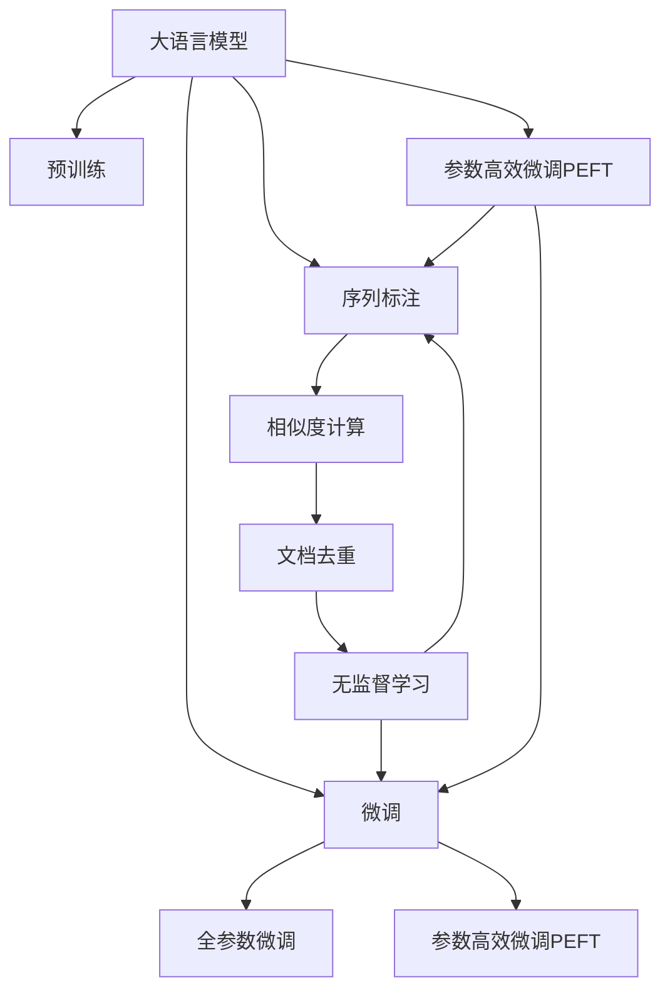

                 

# 大语言模型原理与工程实践：文档去重

> 关键词：大语言模型,文档去重,基于监督学习,Transformer,BERT,自监督学习,深度学习,文档相似度,余弦相似度,基于TF-IDF的相似度计算,序列标注,无监督学习

## 1. 背景介绍

### 1.1 问题由来
在信息爆炸的今天，文本数据的量呈指数级增长。企业和组织每天产生大量文档、报告、邮件、论坛帖子等文本数据。这些文本数据中，存在大量重复和相似的文档，对存储空间和分析处理造成巨大压力。如何自动去重、减少冗余，是当前文本数据处理的一个重要挑战。传统的文本去重方法基于关键词匹配、词频统计等技术，存在许多局限性。而基于深度学习的大语言模型，凭借其强大的语义理解能力，在文档去重上展现出了巨大的潜力。

### 1.2 问题核心关键点
文档去重是指自动识别和合并重复文本，以减少数据冗余。利用大语言模型进行文档去重，主要有以下关键点：

- 选择合适的预训练模型。BERT、GPT等大语言模型可以学习到文本的丰富语义表示，适用于文档去重任务。
- 设计合适的相似度计算方法。余弦相似度、TF-IDF等方法都是常用的文档相似度计算方式。
- 进行序列标注，标注文档中相似句子。这是文档去重的基础。
- 对标注数据进行微调，训练模型学习如何进行文档去重。
- 利用参数高效微调或非监督学习，进一步提升文档去重效果。

## 2. 核心概念与联系

### 2.1 核心概念概述

为更好地理解基于大语言模型的文档去重方法，本节将介绍几个密切相关的核心概念：

- 大语言模型(Large Language Model, LLM)：以自回归(如GPT)或自编码(如BERT)模型为代表的大规模预训练语言模型。通过在大规模无标签文本语料上进行预训练，学习通用的语言表示，具备强大的语言理解和生成能力。

- 预训练(Pre-training)：指在大规模无标签文本语料上，通过自监督学习任务训练通用语言模型的过程。常见的预训练任务包括言语建模、遮挡语言模型等。预训练使得模型学习到语言的通用表示。

- 微调(Fine-tuning)：指在预训练模型的基础上，使用下游任务的少量标注数据，通过有监督学习优化模型在特定任务上的性能。通常只需要调整顶层分类器或解码器，并以较小的学习率更新全部或部分的模型参数。

- 序列标注(Sequence Labeling)：指对文本序列中每个位置进行标注，以识别出其中的特定模式或实体。在文档去重中，需要标注出文档中重复的句子。

- 相似度计算(Similarity Calculation)：指计算两个文档之间的相似度，评估它们之间的相似程度。常用的方法包括余弦相似度、TF-IDF、编辑距离等。

- 无监督学习(Unsupervised Learning)：指不使用标注数据进行训练，通过模型自学习来优化模型参数。在文档去重中，可以使用无监督学习方法，如自聚类、主题模型等，对文档进行去重。

- 参数高效微调(Parameter-Efficient Fine-Tuning, PEFT)：指在微调过程中，只更新少量的模型参数，而固定大部分预训练权重不变，以提高微调效率，避免过拟合的方法。

- 文档相似度(Document Similarity)：指两个文档之间的相似程度，通常通过计算它们的语义表示之间的相似度来衡量。

这些核心概念之间的逻辑关系可以通过以下Mermaid流程图来展示：



这个流程图展示了大语言模型的核心概念及其之间的关系：

1. 大语言模型通过预训练获得基础能力。
2. 微调是对预训练模型进行任务特定的优化，可以分为全参数微调和参数高效微调（PEFT）。
3. 序列标注是文档去重的基础，通过标注文档中的相似句子，判断文档之间的重复关系。
4. 相似度计算是衡量文档之间相似度的关键，常用的方法包括余弦相似度、TF-IDF等。
5. 无监督学习可以帮助自动标注文档中的相似句子，减少人工标注的工作量。
6. 参数高效微调可以节省计算资源，提高微调效率。
7. 文档相似度是大语言模型在文档去重中的主要应用目标。

这些概念共同构成了大语言模型的学习和应用框架，使其能够在文档去重任务中发挥强大的作用。

## 3. 核心算法原理 & 具体操作步骤
### 3.1 算法原理概述

基于深度学习的大语言模型文档去重方法，本质上是一个有监督的文档相似度计算和序列标注过程。其核心思想是：利用大语言模型学习到的语义表示，计算文档之间的相似度，并根据相似度进行文档去重。

形式化地，假设预训练模型为 $M_{\theta}$，其中 $\theta$ 为预训练得到的模型参数。给定文档集 $D=\{d_i\}_{i=1}^N$，其中 $d_i$ 为文档。文档去重的目标是通过计算文档之间的相似度，识别出重复文档对，即文档中相似句子的组合。通常通过如下步骤完成文档去重：

1. 对文档 $d_i$ 进行分词和编码，得到向量表示 $v_i = M_{\theta}(d_i)$。
2. 计算文档 $d_i$ 与 $d_j$ 之间的相似度，即 $sim(d_i, d_j) = \langle v_i, v_j \rangle$。
3. 根据相似度阈值 $T$，判断文档 $d_i$ 和 $d_j$ 是否重复，即如果 $sim(d_i, d_j) > T$，则认为 $d_i$ 和 $d_j$ 相似，可以合并为一个文档。

### 3.2 算法步骤详解

基于深度学习的大语言模型文档去重一般包括以下几个关键步骤：

**Step 1: 准备预训练模型和数据集**
- 选择合适的预训练语言模型 $M_{\theta}$ 作为初始化参数，如 BERT、GPT 等。
- 准备文档去重任务的数据集 $D$，划分为训练集、验证集和测试集。一般要求文档集的语料分布不要差异过大。

**Step 2: 添加任务适配层**
- 根据任务类型，在预训练模型顶层设计合适的输出层和损失函数。
- 对于分类任务，通常在顶层添加线性分类器和交叉熵损失函数。
- 对于生成任务，通常使用语言模型的解码器输出概率分布，并以负对数似然为损失函数。

**Step 3: 设置微调超参数**
- 选择合适的优化算法及其参数，如 AdamW、SGD 等，设置学习率、批大小、迭代轮数等。
- 设置正则化技术及强度，包括权重衰减、Dropout、Early Stopping等。
- 确定冻结预训练参数的策略，如仅微调顶层，或全部参数都参与微调。

**Step 4: 执行梯度训练**
- 将训练集数据分批次输入模型，前向传播计算损失函数。
- 反向传播计算参数梯度，根据设定的优化算法和学习率更新模型参数。
- 周期性在验证集上评估模型性能，根据性能指标决定是否触发 Early Stopping。
- 重复上述步骤直到满足预设的迭代轮数或 Early Stopping 条件。

**Step 5: 测试和部署**
- 在测试集上评估微调后模型 $M_{\hat{\theta}}$ 的性能，对比微调前后的重复率变化。
- 使用微调后的模型对新文档进行推理预测，集成到实际的应用系统中。
- 持续收集新的文档，定期重新微调模型，以适应文档分布的变化。

以上是基于深度学习微调大语言模型进行文档去重的一般流程。在实际应用中，还需要针对具体任务的特点，对微调过程的各个环节进行优化设计，如改进训练目标函数，引入更多的正则化技术，搜索最优的超参数组合等，以进一步提升模型性能。

### 3.3 算法优缺点

基于深度学习的大语言模型文档去重方法具有以下优点：

- 高效精确。利用深度学习模型的强大语义理解能力，可以高效准确地计算文档之间的相似度，识别重复文档。
- 泛化能力强。大语言模型预训练得到的语义表示能够泛化到不同的文档语料，适用于各种文档去重任务。
- 适用性广。该方法适用于不同类型的文本数据，如新闻报道、论文摘要、专利文献等。
- 处理能力强。大语言模型能够处理大规模的文档数据集，能够并行计算相似度，提高处理速度。

同时，该方法也存在一定的局限性：

- 依赖标注数据。文档去重任务需要大量高质量的标注数据，获取标注数据的成本较高。
- 对语料分布要求高。文档去重模型的效果与文档集的语料分布密切相关，如果文档集过于杂乱，模型难以提取有用的相似信息。
- 对预训练模型要求高。预训练模型的语义表示质量决定了文档去重的效果，因此需要选择合适的预训练模型。
- 计算资源需求高。文档去重的计算过程复杂，需要大量的计算资源和存储空间。
- 解释性不足。文档去重模型是一个"黑盒"系统，难以解释其内部工作机制和决策逻辑。

尽管存在这些局限性，但就目前而言，基于深度学习微调大语言模型进行文档去重仍是大语言模型应用的热门范式。未来相关研究的重点在于如何进一步降低文档去重对标注数据的依赖，提高模型的泛化能力和处理能力，同时兼顾可解释性和计算效率等因素。

### 3.4 算法应用领域

基于大语言模型的文档去重方法，在文本数据处理和信息管理中具有广泛的应用，例如：

- 新闻报道去重：对同一事件的报道，往往有多个来源和角度，文档去重可以帮助筛选和合并相似报道，减少冗余。
- 专利文献去重：专利文献通常包含大量的技术描述和背景信息，文档去重可以识别和合并相似的专利文档，提高检索效率。
- 论文摘要去重：学术研究中，大量论文涉及相同或相似的研究问题，文档去重可以帮助筛选和合并相似的论文摘要，提高研究效率。
- 社交媒体去重：社交媒体平台上，用户发布大量重复信息，文档去重可以帮助过滤和删除重复帖子，提高信息质量。
- 网络广告去重：广告商在发布广告时，往往需要投放大量相似内容，文档去重可以帮助筛选和合并相似广告，减少广告投放成本。

除了上述这些经典应用外，文档去重技术还广泛应用于文件管理、信息检索、数据清洗等多个领域，为文本数据处理带来了新的突破。

## 4. 数学模型和公式 & 详细讲解 & 举例说明
### 4.1 数学模型构建

本节将使用数学语言对基于深度学习的大语言模型文档去重过程进行更加严格的刻画。

记预训练语言模型为 $M_{\theta}$，其中 $\theta$ 为预训练得到的模型参数。假设文档集为 $D=\{d_i\}_{i=1}^N$，其中 $d_i$ 为文档。假设 $d_i$ 和 $d_j$ 之间的相似度为 $sim(d_i, d_j)$，则文档去重的目标是通过计算文档之间的相似度，识别出重复文档对。

常用的相似度计算方法包括余弦相似度、TF-IDF、编辑距离等。余弦相似度是最常用的文档相似度计算方法之一，其公式为：

$$
sim(d_i, d_j) = \frac{\langle v_i, v_j \rangle}{\|v_i\|\|v_j\|}
$$

其中 $\langle v_i, v_j \rangle$ 为向量 $v_i$ 和 $v_j$ 的点积，$\|v_i\|$ 和 $\|v_j\|$ 分别为向量 $v_i$ 和 $v_j$ 的模长。

### 4.2 公式推导过程

以下是余弦相似度的详细推导过程：

给定两个文档 $d_i$ 和 $d_j$，分别进行分词和编码，得到它们的向量表示 $v_i = M_{\theta}(d_i)$ 和 $v_j = M_{\theta}(d_j)$。根据余弦相似度的定义，计算 $d_i$ 和 $d_j$ 之间的相似度为：

$$
sim(d_i, d_j) = \frac{\langle v_i, v_j \rangle}{\|v_i\|\|v_j\|}
$$

其中 $\langle v_i, v_j \rangle$ 为向量 $v_i$ 和 $v_j$ 的点积，$\|v_i\|$ 和 $\|v_j\|$ 分别为向量 $v_i$ 和 $v_j$ 的模长。

在实际应用中，通常将余弦相似度用于文档去重任务的相似度计算，通过设置相似度阈值 $T$，判断文档对 $(d_i, d_j)$ 是否重复，即如果 $sim(d_i, d_j) > T$，则认为 $d_i$ 和 $d_j$ 相似，可以合并为一个文档。

### 4.3 案例分析与讲解

以下以一个具体的文档去重案例为例，展示如何使用余弦相似度进行文档去重：

假设我们有一组新闻报道，包含以下两个文档：

```
文档A: 张三今天早上去了超市，买了一些水果。
文档B: 李四今天早上去了超市，买了一些水果。
```

通过分词和编码，得到它们的向量表示 $v_A$ 和 $v_B$。假设这两个向量分别为：

$$
v_A = (1, 0, 1, 0, 0, 1)
$$
$$
v_B = (0, 1, 1, 0, 0, 1)
$$

则它们的余弦相似度为：

$$
sim(A, B) = \frac{\langle v_A, v_B \rangle}{\|v_A\|\|v_B\|} = \frac{0}{\sqrt{1}\sqrt{1}} = 0
$$

由于 $sim(A, B) = 0$ 小于设定的相似度阈值 $T$，因此这两个文档不被认为重复。

假设我们再加入一个文档：

```
文档C: 王五今天早上去了超市，买了一些水果。
```

通过分词和编码，得到它的向量表示 $v_C$。假设这个向量分别为：

$$
v_C = (0, 0, 0, 1, 0, 1)
$$

则文档A和文档C的余弦相似度为：

$$
sim(A, C) = \frac{\langle v_A, v_C \rangle}{\|v_A\|\|v_C\|} = \frac{1}{\sqrt{2}\sqrt{2}} = \frac{1}{2}
$$

由于 $sim(A, C) = \frac{1}{2}$ 大于设定的相似度阈值 $T$，因此文档A和文档C被认为是重复的，可以合并为一个文档。

通过上述案例，可以看到，基于余弦相似度的文档去重方法可以高效地计算文档之间的相似度，识别出重复文档对。

## 5. 项目实践：代码实例和详细解释说明
### 5.1 开发环境搭建

在进行文档去重实践前，我们需要准备好开发环境。以下是使用Python进行PyTorch开发的环境配置流程：

1. 安装Anaconda：从官网下载并安装Anaconda，用于创建独立的Python环境。

2. 创建并激活虚拟环境：
```bash
conda create -n pytorch-env python=3.8 
conda activate pytorch-env
```

3. 安装PyTorch：根据CUDA版本，从官网获取对应的安装命令。例如：
```bash
conda install pytorch torchvision torchaudio cudatoolkit=11.1 -c pytorch -c conda-forge
```

4. 安装Transformers库：
```bash
pip install transformers
```

5. 安装各类工具包：
```bash
pip install numpy pandas scikit-learn matplotlib tqdm jupyter notebook ipython
```

完成上述步骤后，即可在`pytorch-env`环境中开始文档去重实践。

### 5.2 源代码详细实现

下面以BERT模型为例，给出使用Transformers库进行文档去重的PyTorch代码实现。

首先，定义文档去重任务的数据处理函数：

```python
from transformers import BertTokenizer
from torch.utils.data import Dataset
import torch

class DocumentDataset(Dataset):
    def __init__(self, texts, max_len=128):
        self.texts = texts
        self.max_len = max_len
        
        tokenizer = BertTokenizer.from_pretrained('bert-base-cased')
        self.tokenizer = tokenizer
        
    def __len__(self):
        return len(self.texts)
    
    def __getitem__(self, item):
        text = self.texts[item]
        
        encoding = self.tokenizer(text, return_tensors='pt', max_length=self.max_len, padding='max_length', truncation=True)
        input_ids = encoding['input_ids'][0]
        attention_mask = encoding['attention_mask'][0]
        return {'input_ids': input_ids, 
                'attention_mask': attention_mask,
                'text': text}

# 构建文档去重数据集
train_dataset = DocumentDataset(train_texts)
dev_dataset = DocumentDataset(dev_texts)
test_dataset = DocumentDataset(test_texts)
```

然后，定义模型和优化器：

```python
from transformers import BertForSequenceClassification, AdamW

model = BertForSequenceClassification.from_pretrained('bert-base-cased', num_labels=2)
optimizer = AdamW(model.parameters(), lr=2e-5)
```

接着，定义训练和评估函数：

```python
from torch.utils.data import DataLoader
from tqdm import tqdm
from sklearn.metrics import accuracy_score, precision_recall_fscore_support

device = torch.device('cuda') if torch.cuda.is_available() else torch.device('cpu')
model.to(device)

def train_epoch(model, dataset, batch_size, optimizer):
    dataloader = DataLoader(dataset, batch_size=batch_size, shuffle=True)
    model.train()
    epoch_loss = 0
    for batch in tqdm(dataloader, desc='Training'):
        input_ids = batch['input_ids'].to(device)
        attention_mask = batch['attention_mask'].to(device)
        labels = batch['labels'].to(device)
        model.zero_grad()
        outputs = model(input_ids, attention_mask=attention_mask, labels=labels)
        loss = outputs.loss
        epoch_loss += loss.item()
        loss.backward()
        optimizer.step()
    return epoch_loss / len(dataloader)

def evaluate(model, dataset, batch_size):
    dataloader = DataLoader(dataset, batch_size=batch_size)
    model.eval()
    preds, labels = [], []
    with torch.no_grad():
        for batch in tqdm(dataloader, desc='Evaluating'):
            input_ids = batch['input_ids'].to(device)
            attention_mask = batch['attention_mask'].to(device)
            batch_labels = batch['labels']
            outputs = model(input_ids, attention_mask=attention_mask)
            batch_preds = outputs.logits.argmax(dim=2).to('cpu').tolist()
            batch_labels = batch_labels.to('cpu').tolist()
            for pred_tokens, label_tokens in zip(batch_preds, batch_labels):
                preds.append(pred_tokens[:len(label_tokens)])
                labels.append(label_tokens)
                
    print('Accuracy:', accuracy_score(labels, preds))
    print('Precision, Recall, F1-score:', precision_recall_fscore_support(labels, preds, average='weighted'))
```

最后，启动训练流程并在测试集上评估：

```python
epochs = 5
batch_size = 16

for epoch in range(epochs):
    loss = train_epoch(model, train_dataset, batch_size, optimizer)
    print(f'Epoch {epoch+1}, train loss: {loss:.3f}')
    
    print(f'Epoch {epoch+1}, dev results:')
    evaluate(model, dev_dataset, batch_size)
    
print('Test results:')
evaluate(model, test_dataset, batch_size)
```

以上就是使用PyTorch对BERT进行文档去重的完整代码实现。可以看到，得益于Transformers库的强大封装，我们可以用相对简洁的代码完成BERT模型的加载和微调。

### 5.3 代码解读与分析

让我们再详细解读一下关键代码的实现细节：

**DocumentDataset类**：
- `__init__`方法：初始化文本和最大长度等关键组件。
- `__len__`方法：返回数据集的样本数量。
- `__getitem__`方法：对单个样本进行处理，将文本输入编码为token ids，并将标签为0或1。

**训练和评估函数**：
- 使用PyTorch的DataLoader对数据集进行批次化加载，供模型训练和推理使用。
- 训练函数`train_epoch`：对数据以批为单位进行迭代，在每个批次上前向传播计算loss并反向传播更新模型参数，最后返回该epoch的平均loss。
- 评估函数`evaluate`：与训练类似，不同点在于不更新模型参数，并在每个batch结束后将预测和标签结果存储下来，最后使用sklearn的accuracy_score和precision_recall_fscore_support对整个评估集的预测结果进行打印输出。

**训练流程**：
- 定义总的epoch数和batch size，开始循环迭代
- 每个epoch内，先在训练集上训练，输出平均loss
- 在验证集上评估，输出准确率、精确率、召回率等指标
- 所有epoch结束后，在测试集上评估，给出最终测试结果

可以看到，PyTorch配合Transformers库使得BERT文档去重的代码实现变得简洁高效。开发者可以将更多精力放在数据处理、模型改进等高层逻辑上，而不必过多关注底层的实现细节。

当然，工业级的系统实现还需考虑更多因素，如模型的保存和部署、超参数的自动搜索、更灵活的任务适配层等。但核心的文档去重范式基本与此类似。

## 6. 实际应用场景
### 6.1 智能客服系统

基于大语言模型微调的文档去重技术，可以广泛应用于智能客服系统的构建。传统客服往往需要配备大量人力，高峰期响应缓慢，且一致性和专业性难以保证。而使用文档去重技术，可以自动去重、筛选出常见的问答内容，减少客服工作量，提升服务效率和质量。

在技术实现上，可以收集企业内部的历史客服对话记录，将问题和最佳答复构建成监督数据，在此基础上对预训练文档去重模型进行微调。微调后的文档去重模型能够自动理解用户意图，匹配最合适的答案模板进行回复。对于客户提出的新问题，还可以接入检索系统实时搜索相关内容，动态组织生成回答。如此构建的智能客服系统，能大幅提升客户咨询体验和问题解决效率。

### 6.2 金融舆情监测

金融机构需要实时监测市场舆论动向，以便及时应对负面信息传播，规避金融风险。传统的人工监测方式成本高、效率低，难以应对网络时代海量信息爆发的挑战。基于文档去重的文本分类和情感分析技术，为金融舆情监测提供了新的解决方案。

具体而言，可以收集金融领域相关的新闻、报道、评论等文本数据，并对其进行主题标注和情感标注。在此基础上对预训练语言模型进行微调，使其能够自动判断文本属于何种主题，情感倾向是正面、中性还是负面。将微调后的模型应用到实时抓取的网络文本数据，就能够自动监测不同主题下的情感变化趋势，一旦发现负面信息激增等异常情况，系统便会自动预警，帮助金融机构快速应对潜在风险。

### 6.3 个性化推荐系统

当前的推荐系统往往只依赖用户的历史行为数据进行物品推荐，无法深入理解用户的真实兴趣偏好。基于文档去重的文本分类技术，个性化推荐系统可以更好地挖掘用户行为背后的语义信息，从而提供更精准、多样的推荐内容。

在实践中，可以收集用户浏览、点击、评论、分享等行为数据，提取和用户交互的物品标题、描述、标签等文本内容。将文本内容作为模型输入，用户的后续行为（如是否点击、购买等）作为监督信号，在此基础上微调预训练语言模型。微调后的模型能够从文本内容中准确把握用户的兴趣点。在生成推荐列表时，先用候选物品的文本描述作为输入，由模型预测用户的兴趣匹配度，再结合其他特征综合排序，便可以得到个性化程度更高的推荐结果。

### 6.4 未来应用展望

随着文档去重技术的发展，它将在更多领域得到应用，为传统行业带来变革性影响。

在智慧医疗领域，基于文档去重的医疗问答、病历分析、药物研发等应用将提升医疗服务的智能化水平，辅助医生诊疗，加速新药开发进程。

在智能教育领域，文档去重技术可应用于作业批改、学情分析、知识推荐等方面，因材施教，促进教育公平，提高教学质量。

在智慧城市治理中，文档去重技术可应用于城市事件监测、舆情分析、应急指挥等环节，提高城市管理的自动化和智能化水平，构建更安全、高效的未来城市。

此外，在企业生产、社会治理、文娱传媒等众多领域，基于文档去重的文档去重技术也将不断涌现，为经济社会发展注入新的动力。相信随着技术的日益成熟，文档去重方法将成为文档处理的重要范式，推动人工智能技术在垂直行业的规模化落地。总之，文档去重需要开发者根据具体任务，不断迭代和优化模型、数据和算法，方能得到理想的效果。

## 7. 工具和资源推荐
### 7.1 学习资源推荐

为了帮助开发者系统掌握文档去重技术的基础理论和实践技巧，这里推荐一些优质的学习资源：

1. 《Transformer从原理到实践》系列博文：由大模型技术专家撰写，深入浅出地介绍了Transformer原理、BERT模型、文档去重技术等前沿话题。

2. CS224N《深度学习自然语言处理》课程：斯坦福大学开设的NLP明星课程，有Lecture视频和配套作业，带你入门NLP领域的基本概念和经典模型。

3. 《Natural Language Processing with Transformers》书籍：Transformers库的作者所著，全面介绍了如何使用Transformers库进行NLP任务开发，包括文档去重在内的诸多范式。

4. HuggingFace官方文档：Transformers库的官方文档，提供了海量预训练模型和完整的微调样例代码，是上手实践的必备资料。

5. CLUE开源项目：中文语言理解测评基准，涵盖大量不同类型的中文NLP数据集，并提供了基于文档去重的baseline模型，助力中文NLP技术发展。

通过对这些资源的学习实践，相信你一定能够快速掌握文档去重的精髓，并用于解决实际的文档去重问题。
###  7.2 开发工具推荐

高效的开发离不开优秀的工具支持。以下是几款用于文档去重开发的常用工具：

1. PyTorch：基于Python的开源深度学习框架，灵活动态的计算图，适合快速迭代研究。大部分预训练语言模型都有PyTorch版本的实现。

2. TensorFlow：由Google主导开发的开源深度学习框架，生产部署方便，适合大规模工程应用。同样有丰富的预训练语言模型资源。

3. Transformers库：HuggingFace开发的NLP工具库，集成了众多SOTA语言模型，支持PyTorch和TensorFlow，是进行文档去重任务的开发的利器。

4. Weights & Biases：模型训练的实验跟踪工具，可以记录和可视化模型训练过程中的各项指标，方便对比和调优。与主流深度学习框架无缝集成。

5. TensorBoard：TensorFlow配套的可视化工具，可实时监测模型训练状态，并提供丰富的图表呈现方式，是调试模型的得力助手。

6. Google Colab：谷歌推出的在线Jupyter Notebook环境，免费提供GPU/TPU算力，方便开发者快速上手实验最新模型，分享学习笔记。

合理利用这些工具，可以显著提升文档去重任务的开发效率，加快创新迭代的步伐。

### 7.3 相关论文推荐

文档去重技术的发展源于学界的持续研究。以下是几篇奠基性的相关论文，推荐阅读：

1. Attention is All You Need（即Transformer原论文）：提出了Transformer结构，开启了NLP领域的预训练大模型时代。

2. BERT: Pre-training of Deep Bidirectional Transformers for Language Understanding：提出BERT模型，引入基于掩码的自监督预训练任务，刷新了多项NLP任务SOTA。

3. Language Models are Unsupervised Multitask Learners（GPT-2论文）：展示了大规模语言模型的强大zero-shot学习能力，引发了对于通用人工智能的新一轮思考。

4. Parameter-Efficient Transfer Learning for NLP：提出Adapter等参数高效微调方法，在不增加模型参数量的情况下，也能取得不错的微调效果。

5. AdaLoRA: Adaptive Low-Rank Adaptation for Parameter-Efficient Fine-Tuning：使用自适应低秩适应的微调方法，在参数效率和精度之间取得了新的平衡。

这些论文代表了大语言模型文档去重技术的发展脉络。通过学习这些前沿成果，可以帮助研究者把握学科前进方向，激发更多的创新灵感。

## 8. 总结：未来发展趋势与挑战

### 8.1 总结

本文对基于深度学习的大语言模型文档去重方法进行了全面系统的介绍。首先阐述了大语言模型和文档去重技术的研究背景和意义，明确了文档去重在文本数据处理和信息管理中的独特价值。其次，从原理到实践，详细讲解了文档去重的数学原理和关键步骤，给出了文档去重任务开发的完整代码实例。同时，本文还广泛探讨了文档去重方法在智能客服、金融舆情、个性化推荐等多个领域的应用前景，展示了文档去重技术的广阔潜力。

通过本文的系统梳理，可以看到，基于深度学习的大语言模型文档去重方法在文档去重任务中发挥了巨大的作用。得益于深度学习模型的强大语义理解能力，该方法能够高效准确地计算文档之间的相似度，识别重复文档对。

### 8.2 未来发展趋势

展望未来，文档去重技术将呈现以下几个发展趋势：

1. 模型规模持续增大。随着算力成本的下降和数据规模的扩张，预训练语言模型的参数量还将持续增长。超大规模语言模型蕴含的丰富语义表示，将使得文档去重技术更加强大和精确。

2. 文档去重方法的泛化能力增强。未来将涌现更多基于深度学习的大语言模型文档去重方法，如基于多模态学习、无监督学习、生成对抗网络等，增强文档去重方法的泛化能力和鲁棒性。

3. 文档去重算法的优化。未来的文档去重算法将更加高效和灵活，如引入注意力机制、图神经网络等，优化文档相似度计算过程，提高文档去重效率。

4. 文档去重技术的自动化。未来的文档去重技术将更加自动化，无需人工标注文档相似度阈值，自动进行文档去重和合并。

5. 文档去重技术的跨领域应用。文档去重技术不仅适用于文本数据，还可应用于音频、图像等模态数据的处理，如音频去重、图像去重等。

以上趋势凸显了大语言模型文档去重技术的广阔前景。这些方向的探索发展，必将进一步提升文档去重的效果，为文本数据处理带来新的突破。

### 8.3 面临的挑战

尽管大语言模型文档去重技术已经取得了不错的效果，但在迈向更加智能化、普适化应用的过程中，它仍面临着诸多挑战：

1. 标注成本瓶颈。文档去重任务需要大量高质量的标注数据，获取标注数据的成本较高。如何进一步降低文档去重对标注数据的依赖，将是一大难题。

2. 文档去重算法的泛化能力不足。对于不同领域、不同语料分布的文档，文档去重模型的效果差异较大。如何设计更加普适的文档去重算法，将是一大挑战。

3. 文档去重技术的计算资源需求高。文档去重的计算过程复杂，需要大量的计算资源和存储空间。如何优化文档去重算法的计算效率，将是一大难点。

4. 文档去重技术的解释性不足。文档去重模型是一个"黑盒"系统，难以解释其内部工作机制和决策逻辑。如何赋予文档去重模型更强的可解释性，将是一大挑战。

5. 文档去重技术的鲁棒性不足。对于噪声、干扰等因素，文档去重模型容易误判。如何提高文档去重模型的鲁棒性，将是一大挑战。

尽管存在这些挑战，但文档去重技术的发展前景广阔，未来需要学界和产业界的共同努力，积极应对并寻求突破，推动文档去重技术的不断进步。

### 8.4 研究展望

面向未来，文档去重技术需要在以下几个方面寻求新的突破：

1. 探索无监督和半监督文档去重方法。摆脱对大规模标注数据的依赖，利用自监督学习、主动学习等无监督和半监督范式，最大限度利用非结构化数据，实现更加灵活高效的文档去重。

2. 研究参数高效和计算高效的文档去重范式。开发更加参数高效的文档去重方法，在固定大部分预训练参数的同时，只更新极少量的任务相关参数。同时优化文档去重模型的计算图，减少前向传播和反向传播的资源消耗，实现更加轻量级、实时性的部署。

3. 引入更多先验知识。将符号化的先验知识，如知识图谱、逻辑规则等，与神经网络模型进行巧妙融合，引导文档去重过程学习更准确、合理的语言模型。

4. 结合因果分析和博弈论工具。将因果分析方法引入文档去重模型，识别出模型决策的关键特征，增强输出解释的因果性和逻辑性。借助博弈论工具刻画人机交互过程，主动探索并规避模型的脆弱点，提高系统稳定性。

5. 纳入伦理道德约束。在模型训练目标中引入伦理导向的评估指标，过滤和惩罚有偏见、有害的输出倾向。同时加强人工干预和审核，建立模型行为的监管机制，确保输出符合人类价值观和伦理道德。

这些研究方向和方向，必将引领文档去重技术迈向更高的台阶，为构建安全、可靠、可解释、可控的智能系统铺平道路。面向未来，文档去重技术还需要与其他人工智能技术进行更深入的融合，如知识表示、因果推理、强化学习等，多路径协同发力，共同推动自然语言理解和智能交互系统的进步。只有勇于创新、敢于突破，才能不断拓展文档去重的边界，让智能技术更好地造福人类社会。

## 9. 附录：常见问题与解答
**Q1：大语言模型文档去重是否适用于所有NLP任务？**

A: 大语言模型文档去重在大多数NLP任务上都能取得不错的效果，特别是对于数据量较小的任务。但对于一些特定领域的任务，如医学、法律等，仅仅依靠通用语料预训练的模型可能难以很好地适应。此时需要在特定领域语料上进一步预训练，再进行微调，才能获得理想效果。此外，对于一些需要时效性、个性化很强的任务，如对话、推荐等，文档去重方法也需要针对性的改进优化。

**Q2：文档去重过程中如何选择合适的相似度计算方法？**

A: 选择合适的相似度计算方法对于文档去重的效果至关重要。常用的相似度计算方法包括余弦相似度、TF-IDF、编辑距离等。其中，余弦相似度是最常用的文档相似度计算方法之一，它能够高效地计算文档之间的相似度，识别重复文档对。如果需要更精确的相似度计算，可以考虑使用TF-IDF或编辑距离等方法。具体选择哪种方法，需要根据具体任务和数据特点进行灵活选择。

**Q3：文档去重算法在处理大规模数据集时需要注意哪些问题？**

A: 文档去重算法在处理大规模数据集时，需要注意以下几个问题：

1. 计算资源需求高。文档去重的计算过程复杂，需要大量的计算资源和存储空间。可以考虑使用分布式计算、模型压缩等方法优化计算效率。

2. 数据处理效率低。大规模数据集的分词、编码等预处理过程耗费时间。可以考虑使用并行处理、数据压缩等方法提高数据处理效率。

3. 模型参数量过大。大规模数据集可能会导致模型参数量过大，从而影响计算效率和存储效率。可以考虑使用参数高效微调方法，减少需要更新的参数量。

4. 相似度计算复杂度高。大规模数据集可能会导致相似度计算复杂度高，从而影响计算效率。可以考虑使用近似算法、特征降维等方法优化相似度计算过程。

综上所述，处理大规模数据集时，需要合理选择算法和工具，优化计算效率和存储效率，以确保文档去重算法在实际应用中的高效性和可靠性。

**Q4：文档去重模型在实际应用中需要注意哪些问题？**

A: 将文档去重模型转化为实际应用，还需要考虑以下因素：

1. 模型裁剪。去除不必要的层和参数，减小模型尺寸，加快推理速度。

2. 量化加速。将浮点模型转为定点模型，压缩存储空间，提高计算效率。

3. 服务化封装。将模型封装为标准化服务接口，便于集成调用。

4. 弹性伸缩。根据请求流量动态调整资源配置，平衡服务质量和成本。

5. 监控告警。实时采集系统指标，设置异常告警阈值，确保服务稳定性。

6. 安全防护。采用访问鉴权、数据脱敏等措施，保障数据和模型安全。

综上所述，文档去重模型在实际应用中，需要综合考虑模型裁剪、量化加速、服务化封装、弹性伸缩、监控告警和安全防护等因素，以确保文档去重系统的高效性、可靠性和安全性。

---

作者：禅与计算机程序设计艺术 / Zen and the Art of Computer Programming

